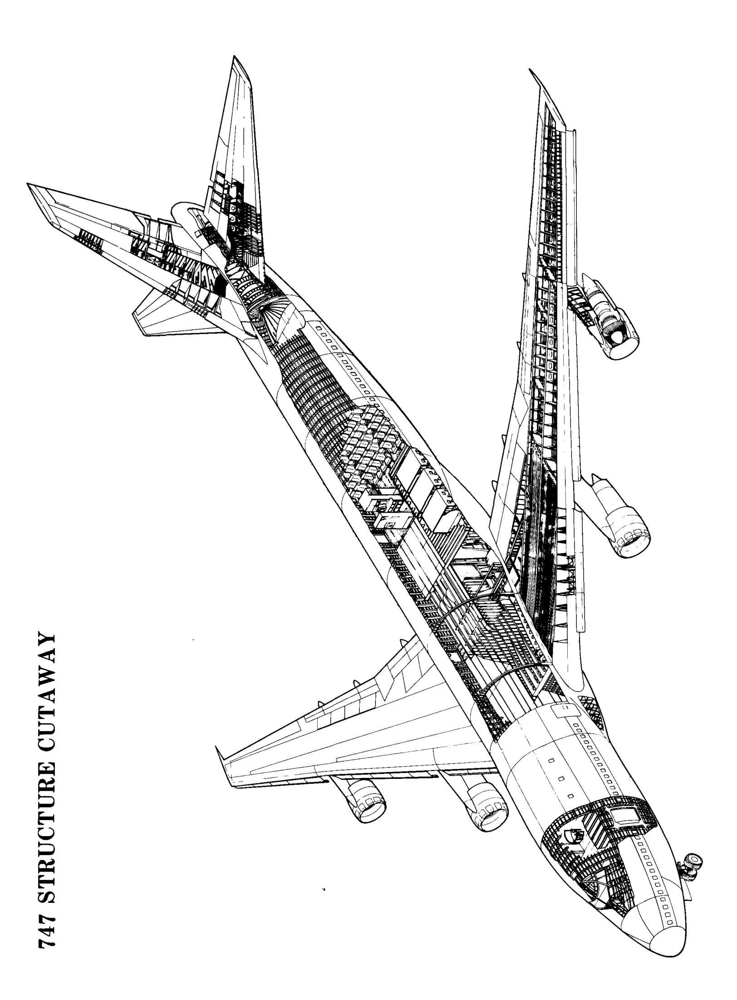
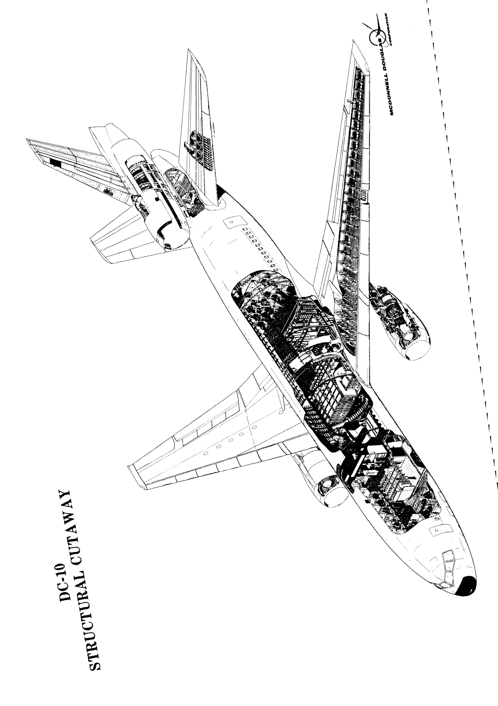
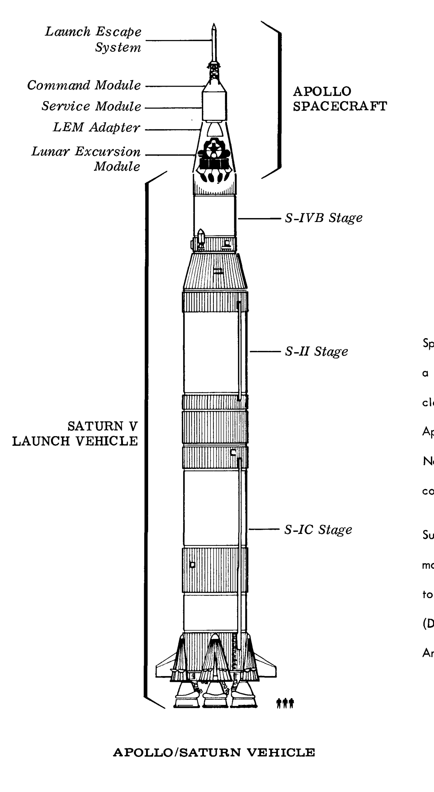
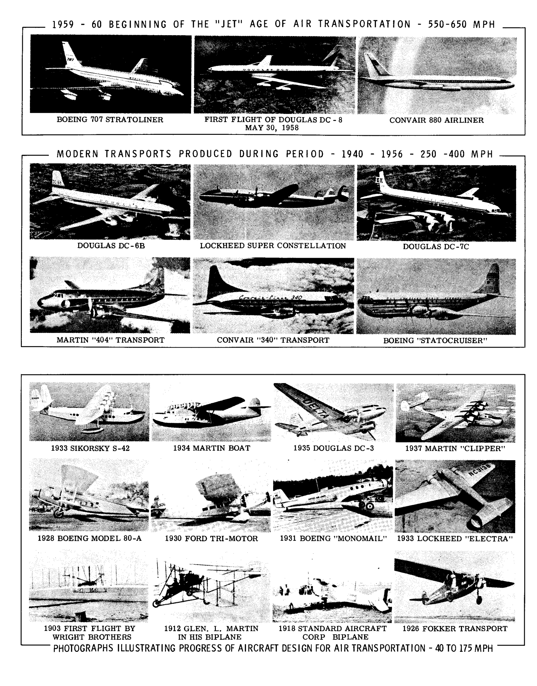
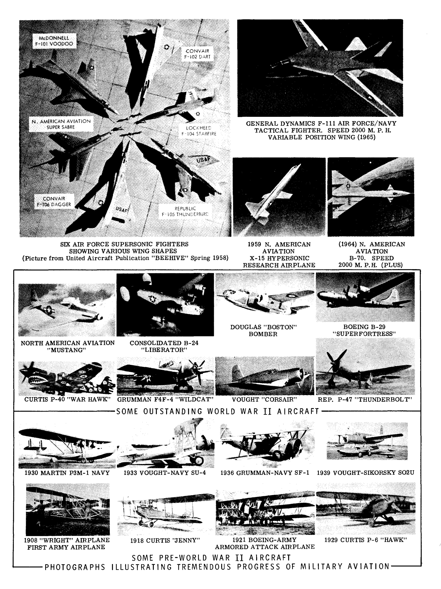
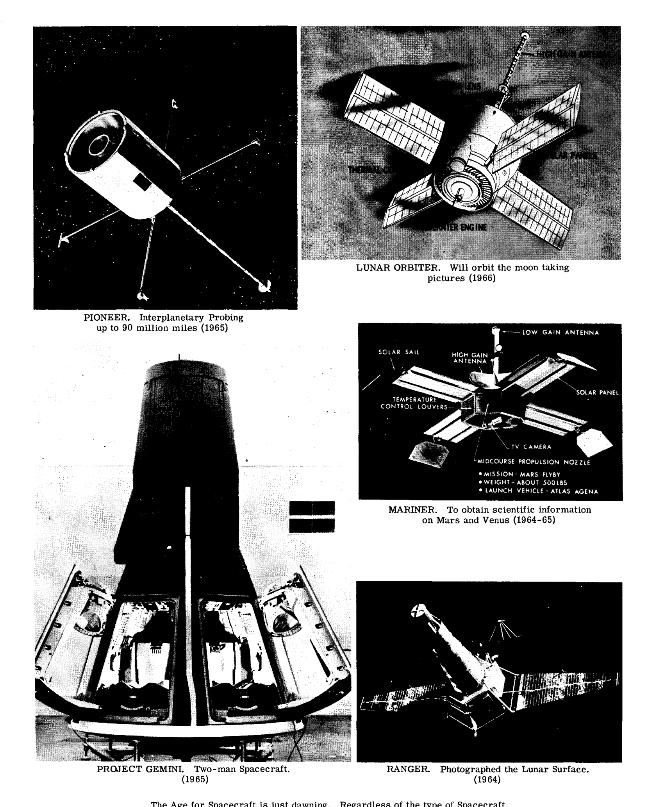
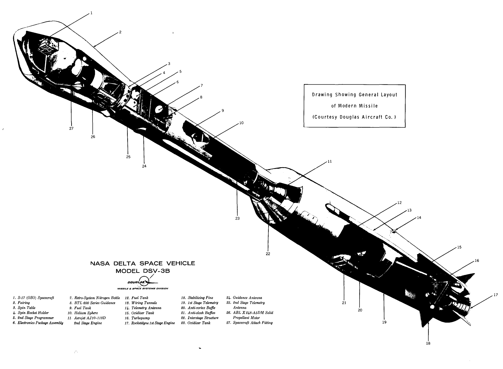
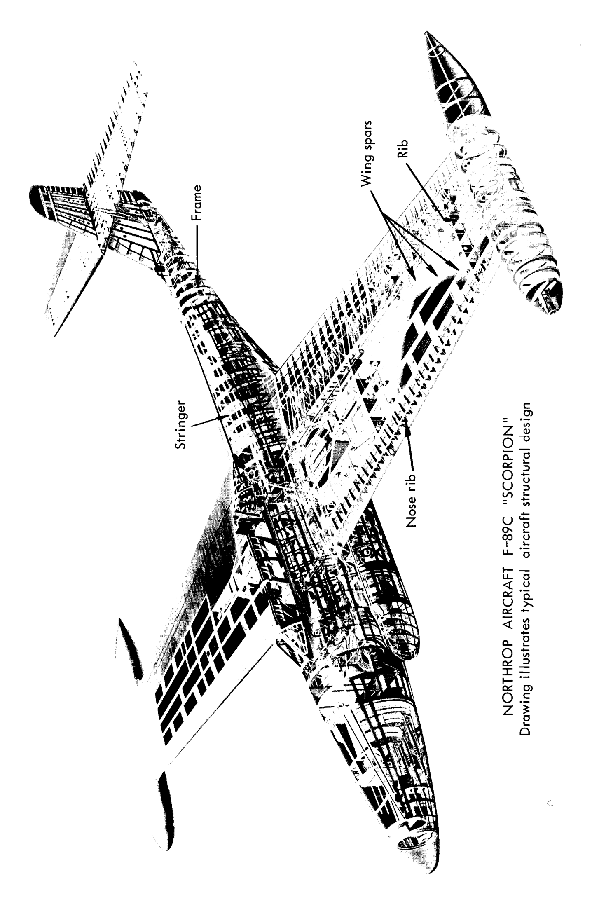
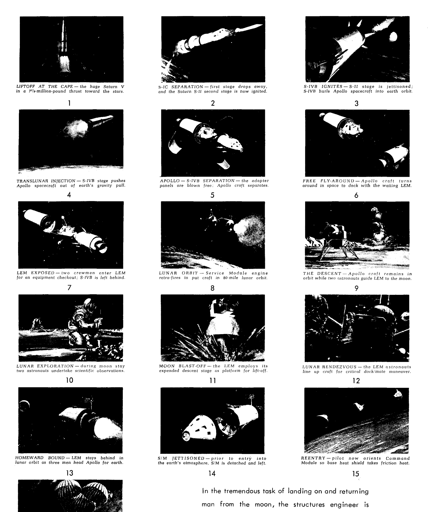

# 飛行体構造の解析と設計

トライステート・オフセット社

---

# 飛行体構造の解析と設計

**著者：E. F. ブルーン (B. S., M.S., C.E.)**  
パデュー大学 航空宇宙学名誉教授

以下の各氏および寄稿された章・節の協力を得て作成：

*   **R. J. H. ボラード博士** (第A24, A25, A26章)  
    ワシントン大学（シアトル）航空宇宙学科長
*   **ロイド・E・ハックマン** (第C12章)  
    複合構造工学コンサルタント
*   **ジョージ・リアニス博士** (第A18章)  
    パデュー大学 航空宇宙学教授
*   **ウィリアム・F・マコームズ** (第C10章第2部、第C11章第2部、第D3章)
*   **A. F. シュミット博士** (第A7, A8, A16, A17, A22章)  
    リットル・システムズ社
*   **クラレンス・R・スミス** (第C13章)  
    金属および構造の疲労に関する工学コンサルタント
*   **ジョセフ・A・ウルフ・ジュニア博士** (第A23章)  
    ゼネラルモーターズ研究所 シニアリサーチエンジニア

---

### まえがき

1965年版の「飛行体構造の解析と設計」は950ページを超えていた。時間の経過とともに、増補版や新素材の追加が期待されるのは当然である。そのため、約380ページの追加資料を加えることが望ましいと考えられたが、これは新版が1300ページを超えること、あるいは1冊のボリュームとしては大きすぎることを意味していた。当初は新版を2巻構成で発行することが決定され、製本準備もほぼ整っていたが、最終的には1巻構成に留め、前述の380ページの追加資料は、3冊の比較的小さな別冊本として発行することに変更された。これら3冊の別冊に関する情報は、目次の後の3ページに記載されている。読者は、これら3冊が構造設計分野の特定の主題を扱っており、現在入手可能であることに気づくだろう。

この新しい1973年1巻版には、1965年版から2つの大きな変更点がある。第A23章は、かつてUCLAの教員であり、現在はゼネラルモーターズ研究所に勤務するジョセフ・A・ウルフ博士という新しい共著者によって完全に改訂・拡張された。ウルフ博士は、1965年版のA23章の著者であるA・F・シュミット博士の協力を得た。もう一つの大きな変更点は、1965年版の疲労に関する第C13章が、新しい疲労の章に置き換えられたことである。この新しい第C13章の著者は、材料と構造の疲労という幅広い分野で広く知られた権威であるC・R・スミス氏である。

著者は、資料のチェックを行ってくれた数名の共著者に感謝の意を表する。このチェックにより、わずかな修正のみで済んだ。

本書の様々な章に含まれるかなりの量の資料は、多くの航空宇宙企業から著者に提供された報告書、マニュアル、図面、写真を利用している。特に、シアトルのボーイング社、ダグラス社、フォートワースおよびサンディエゴ部門のジェネラル・ダイナミクス社、デンバーのマーティン社、ノースアメリカン・アビエーションのコロンバスおよびタルサ部門、LTV社のヴォート部門に感謝する。著者は、これらの援助と協力に深く感謝している。

最後に、本書の章の中で「第2巻」への言及がある場合は、読者はそれを無視していただきたい。

エルマー・F・ブルーン  
1973年6月

---

### 目次

**章番号**

**A1 航空宇宙構造エンジニアの仕事**

#### 静定構造 (STATICALLY DETERMINATE STRUCTURES)
（荷重、反力、応力、せん断、曲げモーメント、たわみ）

*   A2 力系の平衡。トラス構造。外部補強翼。着陸装置。
*   A3 断面の性質 - 図心、慣性モーメントなど。
*   A4 航空機にかかる一般的荷重。
*   A5 梁 - せん断とモーメント。梁-柱モーメント。
*   A6 ねじり - 応力とたわみ。
*   A7 構造のたわみ。カスティリアノの定理。仮想仕事の原理。マトリックス法。

#### 静定不定構造を解くための理論と手法 (THEORY AND METHODS FOR SOLVING STATICALLY INDETERMINATE STRUCTURES)

*   A8 静定不定構造。最小仕事の定理。仮想仕事の原理。マトリックス法。
*   A9 弾性中心法によるフレームとリングの曲げモーメント。
*   A10 柱相似法。
*   A11 連続構造 - モーメント分配法。
*   A12 たわみ角法。

#### 梁の曲げおよびせん断応力。膜応力。柱および板の不安定性。 (BEAM BENDING AND SHEAR STRESSES. MEMBRANE STRESSES. COLUMN AND PLATE INSTABILITY.)

*   A13 曲げ応力。
*   A14 曲げせん断応力 - 充実および開断面 - せん断中心。
*   A15 閉じた薄肉断面におけるせん断流。
*   A16 圧力容器における膜応力。
*   A17 板の曲げ。
*   A18 柱および薄板の不安定性理論。

#### 実践的な航空機応力解析入門 (INTRODUCTION TO PRACTICAL AIRCRAFT STRESS ANALYSIS)

*   A19 修正梁理論による翼応力解析入門。
*   A20 修正梁理論による胴体応力解析入門。
*   A21 リブおよびフレームにかかる荷重と応力。
*   A22 特殊な翼の問題の解析。切り欠き。せん断遅れ（Shear lag）。後退翼。
*   A23 「変位法」による解析。

#### 弾性学および熱弾性学の理論 (THEORY OF ELASTICITY AND THERMOELASTICITY)

*   A24 熱弾性学の3次元方程式。
*   A25 弾性学および熱弾性学の2次元方程式。
*   A26 弾性学および熱弾性学の選択問題。

---

### 目次（続き）

**章番号**

#### 飛行体の材料とその性質 (FLIGHT VEHICLE MATERIALS AND THEIR PROPERTIES)

*   B1 基本原理と定義。
*   B2 飛行体構造用金属材料の機械的および物理的性質。

#### 構造要素の強度と複合構造 (STRENGTH OF STRUCTURAL ELEMENTS AND COMPOSITE STRUCTURES)

*   C1 組合せ応力。降伏および究極破壊の理論。
*   C2 安定な断面を持つ柱の強度。
*   C3 曲げにおける降伏および究極強度。
*   C4 引張、圧縮、曲げ、ねじり、および組合せ荷重下における丸型、流線型、長円型、および角型管の強度と設計。
*   C5 圧縮、せん断、曲げ、および組合せ応力系における平板の座屈強度。
*   C6 複合形状の局部座屈応力。
*   C7 圧縮における複合形状および外板-縦通材パネルのクリップリング強度。柱強度。
*   C8 モノコック円筒の座屈強度。
*   C9 曲面外板パネルおよび球面板の座屈強度。補強された曲面外板構造の究極強度。
*   C10 金属梁の設計。せん断抵抗（非座屈）型ウェブ。 
    *   パート1. 垂直補強材を持つ平板ウェブ。パート2. その他のタイプの非座屈ウェブ。
*   C11 斜め半張力場設計。
    *   パート1. 平板ウェブを持つ梁。パート2. 曲面ウェブシステム。
*   C12 サンドイッチ構造と設計。
*   C13 疲労。

#### 結合部と設計細部 (CONNECTIONS AND DESIGN DETAILS)

*   D1 フィッティングと結合。ボルトおよびリベット。
*   D2 溶接結合。
*   D3 構造設計におけるいくつかの重要な細部。

**付録 A マトリックスの初等算術規則**

---

### 現在入手可能な特別書籍

まえがきで説明したように、380ページの新しい資料を含めるために2巻構成に変更するのではなく、土壇場で1巻のまま維持し、この新しい資料を3つの異なる主題に関する別冊として発行することに決定した。これら3冊の概要は以下の通りである。

### 工学的な柱の解析 (ENGINEERING COLUMN ANALYSIS)

**著者：ウィリアム・F・マコームズ**  
シニア構造設計スペシャリスト  
LTV社ヴォート・エアロノーティクス部門（テキサス州ダラス）

「工学的な柱の解析」は、弾性支持上のものや材料の塑性域まで荷重がかかるものを含め、ほぼすべてのタイプの柱や梁-柱を解析するための実践的な方法を技術者に提供するために執筆された。本書は、弾性安定理論の事前の学習が不要なように書かれている。唯一の前提条件は、学部課程の工学コースで教えられる初等的な材料力学の理解である。

解析の数多くの手法やテクニックは、技術者による「手計算」のために提示されているが、これらは必要に応じてコンピュータによる解析用に構成することも可能である。本書の幅広い範囲は、以下のパートタイトルのリストによって示されている。特定の主題に関するさらなる読書のための参考文献も提供されている。資料の多くは、航空業界の実務技術者のためのクラスで著者によって使用されてきた。一見複雑に見える多くの柱や梁-柱がいかに簡単に解析できるかに、しばしば驚かされることだろう。

| パート | タイトル |
| :--- | :--- |
| A | 様々な柱の問題の概観 |
| B | 安定性と臨界荷重 |
| C | 一定断面かつ単スパンの柱 |
| D | 変断面かつ単スパンの柱 |
| E | 一定断面かつ単スパンの梁-柱 |
| F | 支点間が一定の多重梁-柱 |
| G | 支点間が一定断面の多スパン柱 |
| H | 安定性と強度のためのトラス構造の解析 |
| I | 梁のひずみ計算のための弾性荷重数値法 |
| J | 変断面かつ単スパンの柱 |
| K | 変断面かつ単スパンの梁-柱 |
| L | 多スパンの柱および変断面の梁-柱 |
| M | 弾性支持上の梁-柱 |
| N | 弾性支持上の柱 |
| O | 自由柱（ストラット）のねじり座屈 |
| P | 拘束された柱のねじり座屈 |
| Q | 特殊なトピック |

---

### フィラメント状複合構造の設計と解析 (DESIGN AND ANALYSIS OF FILAMENTARY COMPOSITE STRUCTURES)

**著者：ロイド・E・ハックマン**  
複合構造工学コンサルタント

著者は、新しい構造技術の基本的な概要を提示した。また、技術の開発だけでなく、実際の構造要素への技術の応用についての洞察も提供している。

著者は、繊維とマトリックスの相互作用というミクロ力学から、様々な種類の構造要素における複合積層板の使用、および接合方法に至るまでの設計と解析の手法を提示している。応用解析には、破損モードの記述、破損基準の記述、および複合材料の実験的評価のための試験方法も含まれている。

著者は、航空宇宙業界における複合材料設計の10年間の経験から得られた例題を用いて、すべての解析手法と破損基準の使用を実証している。

#### 目次

*   **C13.1 はじめに**
    *   C13.L1 技術の開発
    *   C13.L2 材料コンセプト
    *   C13.L3 複合構造への設計アプローチ
    *   C14.L4 用語集
*   **C13.2 直交異方性積層板の一般的関係**
    *   C13.2.1 弾性関係
    *   C13.2.2 布状積層板の強度関係
    *   C13.2.3 様々な構成の性質
    *   C13.2.4 配向積層板の弾性的性質
    *   C13.2.5 クロス積層板または平行積層板の弾性的性質
    *   C13.2.6 直交異方性層で作られた等方性積層板
*   **C13.3 単一方向積層材料の関係**
    *   C13.3.1 層の弾性関係
    *   C13.3.2 矩形配列の層の強度関係
    *   C13.3.3 六角形配列の層の強度関係
    *   C13.3.4 多重積層板の性質と応力
    *   C13.3.5 単一方向積層板の圧縮強度
    *   C13.3.6 ボイドが圧縮強度に及ぼす影響
*   **C13.4**
    *   C13.4.1 積層板の破壊基準
    *   C13.4.2 破壊モードと試験方法
    *   C13.4.3 積層板の非線形特性と破壊モード
*   **C13.5 フィラメント状複合構造要素の安定性**
    *   C13.5.1 平面矩形パネル
    *   C13.5.2 ハニカムサンドイッチ
*   **C13.6 複合材料の接合**
    *   C13.6.1 接着ラップジョイント
    *   C13.6.2 機械的締結ジョイント

---

### ミサイル構造の解析と設計 (ANALYSIS AND DESIGN OF MISSILE STRUCTURES)

**著者：J. I. オーランド（部門長）および J. F. メイヤーズ（課長）**  
ダグラス・エアクラフト社 ミサイル・宇宙部門

このセクションは、E. F. ブルーン教授の著書「飛行体構造の解析と設計」を詳述したものである。学生や初学者のエンジニアをミサイル構造の一般的な分野に導入し、典型的なブーストミサイルの予備荷重、応力解析、および構造設計の実務を限定的に提示するように設計されている。

最初の部分は分析的かつ記述的な性質のものであり、構成、材料の使用、構造技術、および設計要素における現在の慣行を読者に知らせるのに役立つ。本体、すなわちパートE1.7とE1.8では、仮想的な多段式ロケットを取り上げ、クリティカルな飛行荷重条件を導き出し、これらの荷重に対する解析を示している。解析手法はブルーン教授の著書「飛行体構造の解析と設計」の本体から直接導き出されており、ミサイル設計のためのデータの実際の使用例を読者に提供している。

#### 目次

*   パート ELI：歴史、用語、重量配分
*   パート E1.2：推進システムの基礎
*   パート E1.3：ミサイルおよび宇宙機の仕様
*   パート E1.4：ミサイルおよび宇宙機の代表的な構造
*   パート E1.5：ミサイル用材料
*   パート E1.6：構造設計要素
*   パート E1.7：ミサイル荷重解析
*   パート E1.8：ミサイル応力解析
*   パート E1.9：結論
*   付録：設計図表および「飛行体構造の解析と設計」（ブルーン著）からの抜粋資料

---

宇宙探索には、アポロ・サターン宇宙船に例示されるような、巨大な打ち上げ機が必要である。人間の大きさと比較した機体の大きさに注目してほしい。このような大型の機体は、構造エンジニアに多くの困難な課題を突きつける。
（図面提供：ノースアメリカン・アビエーション社）

宇宙船の時代は始まったばかりである。宇宙船の種類に関わらず、その創造には構造設計者の仕事が不可欠である。

人間を月に着陸させ、帰還させるという壮大な任務において、構造エンジニアは多くの新しく困難な設計要件に直面している。

アポロ11号は、宇宙飛行士アームストロング、オルドリン、コリンズを乗せて、1969年7月20日に月に着陸した。
（写真提供：ノースアメリカン・アビエーション社）