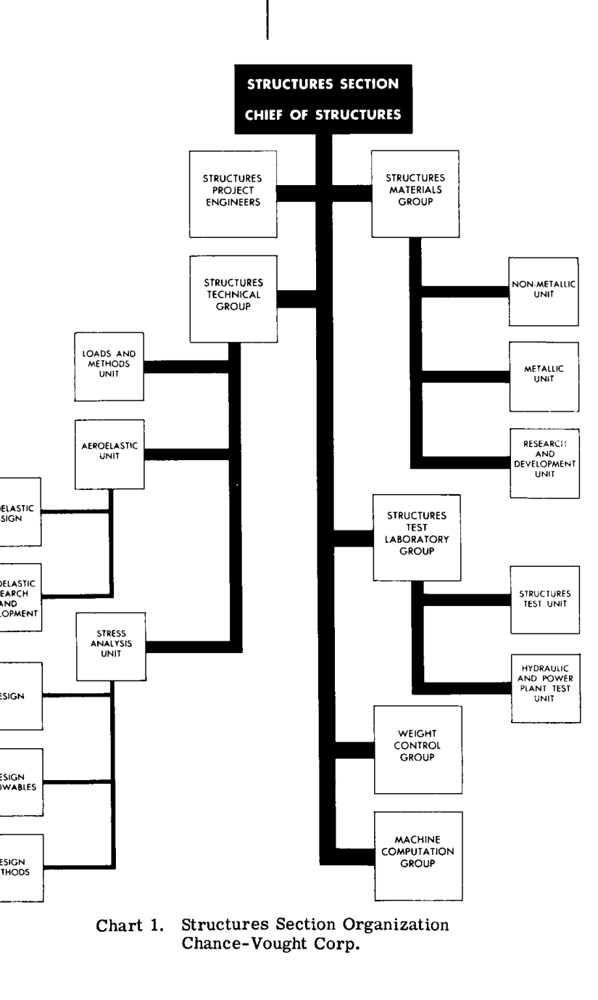
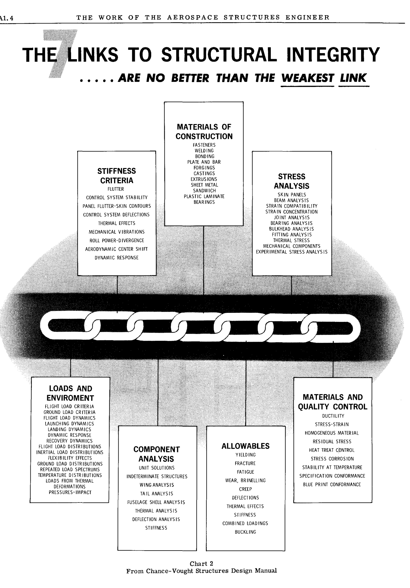

# 第 AI 章

# 航空宇宙構造エンジニアの業務

## AI. 1 序論

空気より重い機械による人類初の制御可能な飛行は、1903年12月17日、ノースカロライナ州キティホークにおいてオーヴィル・ライトによって行われた。その飛行距離は 120 フィート、持続時間は 20 秒であった。今日、この最初の飛行は非常に印象の薄いものに見えるが、何世紀もの間、人類がライト兄弟が 1903 年に成し遂げたことを夢見たり、試みたりしてきたことを考えれば、その重要性の真の展望が見えてくる。

航空史の最初の 50 年間に達成された凄まじい進歩は、そのほとんどが最後の 25 年間に起こったものであり、ほとんど信じがたいほどである。しかし、疑いなく、第 2 の 50 年間における進歩は、さらに信じがたいほど幻想的なものになるだろう。これが執筆されている 1964 年現在、時速 600 マイルのジェット旅客機による輸送は確立されており、数種類の軍用機は時速 1200 から 2000 マイルの範囲の速度を有している。マッハ 3 の速度を持つ超音速旅客機の予備設計は完了しており、政府はこのような飛行車両の開発を支援する段階にある。したがって、1970 年代初頭には超音速航空輸送が一般的になるはずである。ミサイル設計の急速な進歩は、宇宙時代の到来を告げた。すでに、いくつかの惑星への着陸といった宇宙の本格的な探査が可能になる前に必要となる、新しい知識を求めて、多くの宇宙車両が飛行している。残念ながら、ミサイルとロケット動力の急速な発展は、核爆弾と組み合わされることで、地球の広大な地域を瞬時に破壊する恐るべき潜在能力を人類に与えてしまった。現在、宇宙探査が人類の利益に関してどこへ、あるいは何に繋がるのかを知る者はいないが、超音速旅客機輸送に次ぐ航空分野の大きな拡大は、垂直離着陸機（VTOL）の完全な開発と利用になることは分かっている。したがって、航空の進歩の第 2 の半世紀を生きる人々は、最初の 50 年間に起こったことよりも、さらに幻想的な進歩を目撃することになるのは間違いないだろう。

## AI. 2 航空機会社の一般的組織 エンジニアリング部門

現代の民間旅客機、軍用機、ミサイル、および宇宙車両は、高度な科学的機械であり、成功する製品を保証するためには、密接な協力の下で働く何百人ものエンジニアや科学者の結集された知識と経験が必要である。したがって、航空宇宙会社のエンジニアリング部門は、多くの専門家グループで構成されており、その専門教育は物理学、化学および冶金学、機械学、電気学、そしてもちろん航空工学といった、工学教育のあらゆる分野を網羅している。

たまたま、ほとんどすべての航空宇宙会社は、エンジニアリング部門の組織や、多くのセクションおよびグループの職務と責任を説明し、航空宇宙産業が保有する膨大な研究所や試験施設を例示した、広範なパンフレットや冊子を発行している。学生がこれらの無料の刊行物を読み、学習して、現代の飛行車両がいかに構想され、設計され、生産されるかについて、早い段階で一般的な理解を得ることを強く推奨する。

一般に、航空宇宙会社のエンジニアリング部門は 6 つの大きな、かなりはっきりとしたセクションに分けられ、それらはさらに専門的なグループに分けられ、さらにエンジニアの小さな作業グループに分けられる。例として、6 つのセクションを、いくつかの多様なグループと共に以下に挙げる。これは完全なリストではないが、必要とされる広範なエンジニアリングの構成の概念を提示するものである。

I. 基本設計部門 (Preliminary Design Section)

II. 技術解析部門 (Technical Analysis Section)

    (1) 空気力学グループ (Aerodynamics Group)
    (2) 構造グループ (Structures Group)
    (3) 重量重心制御グループ (Weight and Balance Control Group)
    (4) 動力装置解析グループ (Power Plant Analysis Group)
    (5) 材料・工程グループ (Materials and Processes Group)
    (6) 制御解析グループ (Controls Analysis Group)

III. コンポーネント設計部門 (Component Design Section)

    (1) 構造設計グループ (翼、胴体、および操舵面)
    (2) システム設計グループ (すべての機械、油圧、電気、および熱の設置)

IV. 研究所試験部門 (Laboratory Tests Section)

    (1) 風洞および流体力学試験室
    (2) 構造試験室
    (3) 推進試験室
    (4) 電子機器試験室
    (5) 電気機械試験室
    (6) 兵器および制御試験室
    (7) アナログおよびデジタル計算機室

V. 飛行試験部門 (Flight Test Section)

VI. エンジニアリング・フィールドサービス部門 (Engineering Field Service Section)

この教科書は構造という主題を扱っているため、構造グループの業務を詳細に議論することが適切であると思われる。他のグループの詳細な議論については、学生は各種の航空機会社の刊行物を参照すべきである。

## AI. 3 構造グループの業務

構造グループは、エンジニアの数に関しては、技術解析部門である第 II セクションを構成する多くのエンジニアグループの中で最大のものの一つである。構造グループは、主に航空機の構造的健全性（安全性）に対して責任を負う。安全性は、十分な強度または十分な剛性に依存する場合がある。この構造的健全性は、可能な限り軽量であることを伴わなければならない。なぜなら、過剰な重量は航空機の性能に悪影響を及ぼすからである。例えば、大型で長射程のミサイルでは、1 ポンドの不要な構造重量がミサイルの総重量に 200 ポンド以上の増加をもたらす可能性がある。

構造グループは通常、以下のようなサブグループに分けられる。：

(1) 航空荷重計算グループ (Applied Loads Calculation Group)
(2) 応力解析および強度グループ (Stress Analysis and Strength Group)
(3) 動力学解析グループ (Dynamics Analysis Group)
(4) 特別プロジェクトおよび研究グループ (Special Projects and Research Group)

### 航空荷重計算グループの業務

構造のいかなる部分も、最終的に強度や剛性に関してプロポーションを決定する前に、航空機にかかる真の外部荷重を決定しなければならない。致命的な荷重は多くの源から発生するため、荷重グループは空気力学的な力からの荷重だけでなく、動力装置、航空機の慣性、制御システムののアクチュエータ、発進、着陸、および回収装置、兵装などからの荷重も解析しなければならない。空気力学的な力の影響は、最初は航空機構造が剛体であるという仮定の下で計算される。航空機構造が決定された後、その真の剛性を使用して動的な影響を得ることができる。荷重および圧力解析に空気力学の原理を適用する際には、通常、風洞模型試験の結果が必要となる。

このグループの業務の最終結果は、多くのグラフや要約テーブルを含む、完全な航空荷重設計基準を示す正式な報告書である。最終結果には、翼や胴体などの主要な航空機ユニットについて、便利な  $X, Y, Z$  軸のセットを参照した完全なせん断力、モーメント、および法線方向の力が示されることがある。

### 応力解析および強度グループの業務

本質的に、応力グループの主要な業務は、航空機やミサイルのすべての構造部材やユニットに使用する材料の種類、厚さ、サイズ、および断面形状を指定または決定することであり、また、そのような部材のすべてのジョイントや接続部の設計を支援することである。軽量であることの安全性は、極めて重要な構造設計要件である。応力グループは、最適な構造上の全体配置を考案するために、構造設計セクションと常に密接に連携しなければならない。動力装置、内蔵燃料タンク、脚収納部、およびその他の大きな切り欠きなどの要因が、例えば 2 本桁のシングルセル翼か、多桁のマルチセル翼かといった、翼構造のタイプを決定することがある。

初期の構造設計検討を迅速に進めるために、応力グループは近似荷重に基づく初期の構造サイズを提供しなければならない。応力グループによる業務の最終結果は、どのように応力が計算され、これらの応力を効率的に支えるために必要な部材サイズがどのように得られたかを示す、精緻な報告書に記録される。部材の最終的なサイズは、弾性作用、非弾性作用、高温、疲労などの 1 つまたは複数の要因によって決定される場合がある。理論計算の正確さを保証するために、応力グループは、許容設計応力の根拠となる情報を得るために構造試験室の支援を受けなければならない。

### 動力学解析グループの業務

動力学解析グループは、超音速航空機、ミサイル、および垂直離着陸機が動力学の一般的な分野において多くの新しく複雑な問題を提示しているため、近年、必要とされるエンジニアの数に関して急速に拡大している。一部の航空機会社では、動力学グループは構造グループの外に独立したグループとして設置されている。

動力学グループのエンジニアは、振動と衝撃、航空機のフラッターの調査、およびその制御または修正のための設計要件や変更の確立に責任を負う。航空機には数十の機械設備が含まれている。これらの設備やシステムのいかなる部分の振動も、誤作動や故障の危険を引き起こすような性質のものである可能性があり、したがって動力学的特性は、信頼性が高く安全な運用を確保するために変更または修正されなければならない。

翼や胴体などの航空機の主要な構造ユニットは、剛体ではない。したがって、高速飛行中に鋭い突風が柔軟な翼に当たると、動的な荷重状況が発生し、翼は振動する。動力学専門家は、この振動が翼構造に誘発される応力に関して深刻であるかどうかを判断しなければならない。動力学グループはまた、ミサイルや飛行車両の誘導および制御システムの安定性と性能の決定にも責任を負う。動力学グループは、多くの理論計算に必要な特定の要因の信頼できる値を得るために、各種の試験室と絶えず連携しなければならない。

### 特別プロジェクト・グループの業務

一般に、すべての多様な技術グループには、航空が進歩するにつれて近い将来または遠い将来に遭遇することになる設計問題に取り組んでいる特別なサブグループがある。例えば、構造グループにおいて、このサブグループは次のような問題を研究している可能性がある。(1) 超音速における翼構造の熱応力をどのように計算するか。(2) 新しいタイプの翼構造をどのように応力解析するか。(3) 将来の宇宙旅行にはどのようなタイプのボディ構造が最適か、またどのような種類の材料が必要になるか、などである。

図 1 は、一般的な大手航空宇宙会社の構造セクションの典型的な構成を示している。図 2 は、構造エンジニアが飛行車両の構造的健全性を確保する際に関与しなければならない多くの項目をリストアップしている。図 1 と図 2 は両方とも Chance-Vought 社の構造設計マニュアル（Structures Design Manual）からのものであり、同社の許可を得て転載している。

