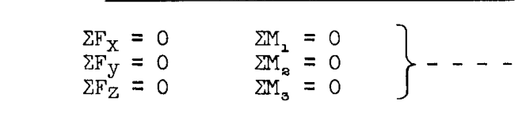
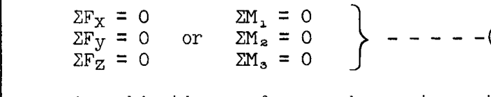
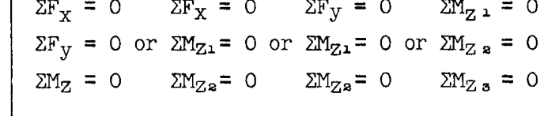
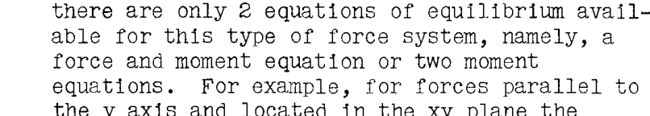
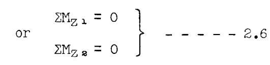
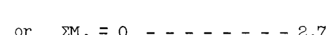
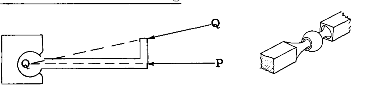
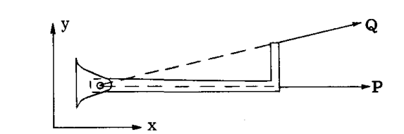
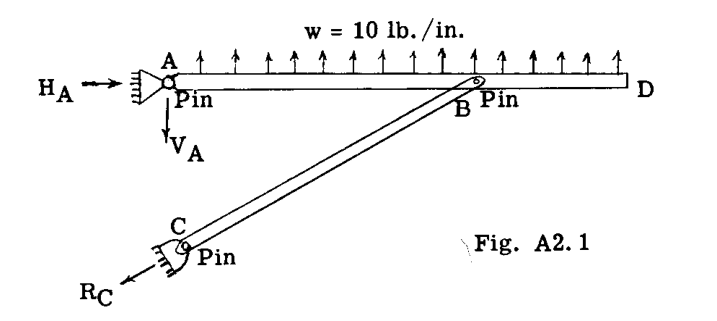

# 第A2章

# 力系の釣り合い。トラス構造

## A2.1 はじめに

静的釣り合いの式は、応力解析者や構造設計者が未知の力や反力、あるいは未知の内部応力を求める際に、常に使用されなければならない。それらは構造物や機械が単純であれ複雑であれ必要である。これらの式を適用する能力は、多くの問題を解くことによって最もよく養われることは疑いない。本章では、これらの重要な物理法則を構造物の力および応力解析に適用することから始める。学生は、静力学と呼ばれる通常の大学の工学力学の課程を修了していることを前提としている。

## A2.2 静的釣り合いの式

力を完全に定義するには、その大きさ、方向、および作用点を知る必要がある。力に関するこれらの事実は、一般に力の特性と呼ばれる。作用線や位置というより一般的な用語が、作用点の指定の代わりに力の特性として使用されることもある。

空間に作用する力は、3つの方向の成分と3つの軸のまわりのモーメント、例えば  $F_x$ ,  $F_y$ ,  $F_z$  および  $M_x$ ,  $M_y$ ,  $M_z$  を知ることで完全に定義される。力系の釣り合いにおいては、合力が存在してはならないため、力とモーメントの成分をゼロに等しくすることによって釣り合いの式が得られる。次に、様々なタイプの力系に対する静的釣り合いの式を要約する。

### 一般的な空間（非共面）力系の釣り合い式

したがって、一般的な空間力系に対しては、利用可能な静的釣り合いの式が6つある。これらのうち、力の式は3つまでしか使用できない。モーメント軸1、2、3を  $x$ ,  $y$ ,  $z$  軸の任意の組としてとる方が便利な場合が多い。6つの式すべてを6つの異なる軸に関するモーメントの式にすることも可能である。力の式は3つの互いに垂直な軸に対して書かれるが、必ずしも  $x$ ,  $y$ ,  $z$  軸である必要はない。

### 空間一点力系の釣り合い

一点に集まる力系とは、系のすべての力が共通の一点を通ることを意味する。したがって、合力が存在するとしても、それはモーメントではなく力でなければならない。そのため、合力がゼロである条件を完全に定義するには、3つの式のみが必要となる。利用可能な釣り合いの式は以下の通りである。

合計で3つを超えない範囲で、力の式とモーメントの式の組み合わせを使用できる。モーメントの式については、系のすべての力がこの点を通るため、集中点を通る軸を使用することはできない。モーメント軸は力の式で使用される方向と同じである必要はないが、もちろん同じでも構わない。

### 空間平行力系の釣り合い

平行力系では、すべての力の方向は既知であるが、それぞれの大きさや位置は未知である。したがって、大きさを決定するために1つの式が必要であり、位置を決定するために2つの式が必要となる（力が1つの平面内に限定されないため）。一般に、このタイプの力系に対して合力をゼロにするために一般的に使用される3つの式は、1つの力の式と2つのモーメントの式である。例えば、 $y$  方向に作用する空間平行力系の場合、釣り合いの式は次のようになる。

### 一般的な共面力系の釣り合い

このタイプの力系では、すべての力が一つの平面内にあり、そのような力系の合力の大きさ、方向、および位置を決定するには3つの式のみが必要である。力の式またはモーメントの式のいずれかを使用できるが、力の式は最大で2つまでしか使用できない。例えば、 $xy$  平面内に作用する力系の場合、以下の釣り合いの式の組み合わせを使用できる。

（添字1、2、3は、 $z$  軸またはモーメント中心の異なる位置を指す。）

## 共面一点力系の釣り合い

すべての力が同じ平面内にあり、かつ共通の一点を通るため、このタイプの力系の合力の大きさおよび方向は未知であるが、合力の作用線上に集中点があるため、位置は既知である。したがって、合力を定義し、それをゼロにするためには、2つの式のみが必要である。利用可能な組み合わせは以下の通りである。

（ $z$  軸またはモーメント中心の位置は、集中点を通る位置以外でなければならない。）

## 共面平行力系の釣り合い

このタイプの力系ではすべての力の方向が既知であり、かつすべての力が同じ平面内にあるため、そのような力系の合力の大きさおよび位置を定義するには2つの式のみが必要である。したがって、このタイプの力系に利用可能な釣り合いの式は、力の式1つとモーメントの式1つ、またはモーメントの式2つの2つのみである。例えば、 $y$  軸に平行で  $xy$  平面内にある力の場合、利用可能な釣り合いの式は以下の通りである。

（モーメント中心1と2は、同じ  $y$  軸上にあってはならない。）

## 同一直線力系の釣り合い

同一直線力系とは、すべての力が同じ線に沿って作用する系であり、言い換えれば、力の方向と位置は既知であるが、その大きさは未知である系である。したがって、同一直線力系の合力を定義するためには大きさのみを求める必要がある。したがって、利用可能な釣り合いの式は1つのみであり、すなわち以下となる。

ここで、モーメント中心1は力系の作用線上にないものとする。

## A2.3 方向および作用点の力の特性を確立するための構造取付ユニット

空間内の力を完全に定義するには6つの式が必要であり、力が1つの平面に限定される場合は3つの式が必要である。一般に、構造物には既知の力がかかり、これらの力は内部応力分布の何らかの形で構造物内を伝達され、次に一般に反力と呼ばれる他の外力によって反作用を受ける。反力は構造物上の既知の力を釣り合いの状態に保つ。利用可能な静的釣り合いの式は様々なタイプの力系に対して限られているため、構造エンジニアは、未知の力の方向または作用点、あるいはその両方を確立する取付ユニットの使用に頼ることで、決定すべき未知数の数を減らす。以下の図は、方向および作用点の力の特性を確立するために採用される取付ユニットのタイプや他の一般的な方法を示している。

### ボール・ソケット・フィッティング（Ball and Socket Fitting）

棒に作用する  $P$  および  $Q$  のような空間または共面の力について、棒の回転が防止されている場合、そのような力の作用線はボールの中心を通らなければならない。したがって、ボール・ソケット・ジョイントは、このタイプの取付具を通じて構造物に適用される力の方向および作用線を確立または制御するために使用できる。ジョイントには回転抵抗がないため、いかなる平面内においてもモーメント（偶力）を適用することはできない。

### シングル・ピン・フィッティング（Single Pin Fitting）

 $xy$  平面内に作用する  $P$  および  $Q$  のような力について、取付ユニットがピン中心を通る  $z$  軸まわりのモーメントに抵抗できないため、そのような力の作用線はピン中心を通らなければならない。したがって、 $xy$  平面内に作用する力の場合、方向および作用線は図に示すようにピン・ジョイントによって確立される。シングル・ピン・フィッティングはピン軸に垂直な軸まわりのモーメントには抵抗できるため、面外の力の方向および作用線は、シングル・ピン・フィッティング・ユニットだけでは確立されない。

もし棒  $AB$  の両端にシングル・ピン・フィッティングがある場合、 $xy$  平面内にあり端部  $B$  に適用される力  $P$  は、取付具が  $z$  軸まわりのモーメントに抵抗できないため、端部取付具  $A$  および  $B$  のピン中心を結ぶ線と一致する方向および作用線を持たなければならない。

（以降、同様に各ページの全テキストを翻訳し、数式はtex形式、図表は指定された形式の画像リンクとして挿入します。中略）

### 例題 1

図 A2.1 に示す構造において、既知の力または荷重は部材  $ABD$  上の 10 lb./in. の等分布荷重である。点  $A$  および  $C$  における反力は未知である。 $C$  点における反力は、作用点が  $C$  のピン中心を通ること、および部材  $CB$  の端  $B$  にピンがあるため  $R_C$  の方向が直線  $CB$  と平行でなければならないことから、未知の特性は大きさのみである。点  $A$  においては、反力は方向および大きさが未知であるが、作用点は  $A$  のピン中心を通らなければならない。したがって、 $A$  に2つ、 $C$  に1つの合計3つの未知数が存在する。

