# 第A2章

# 力系の釣り合い。トラス構造

## A2.1 はじめに
静的釣り合いの式は、未知の力や反力、あるいは未知の内部応力を求める際に、応力解析者や構造設計者によって絶えず使用されなければならない。これらは、構造物や機械が単純であっても複雑であっても必要不可欠である。これらの式を適用する能力は、多くの問題を解くことによって最もよく養われることは疑いようがない。本章では、構造物の力および応力解析への、これらの重要な物理法則の適用を開始する。学生は、静力学と呼ばれる通常の大学の工学力学コースを修了しているものと想定している。

## A2.2 静的釣り合いの式
力を完全に定義するには、その大きさ、方向、および作用点を知る必要がある。力に関するこれらの事実は、一般に力の特性と呼ばれる。作用線や位置といったより一般的な用語が、作用点の指定の代わりに力の特性として使用されることもある。

空間に作用する力は、3つの方向の成分と3つの軸の周りのモーメント、例えば  $F_x$ 、 $F_y$ 、 $F_z$  および  $M_x$ 、 $M_y$ 、 $M_z$  を知ることで完全に定義される。力系の釣り合いのためには、合力が存在してはならず、したがって釣り合いの式は力とモーメントの成分をゼロに等しくすることによって得られる。様々な種類の力系に対する静的釣り合いの式を以下に要約する。

### 一般的な空間（非同一平面）力系の釣り合い式

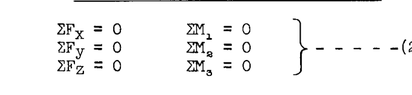

したがって、一般的な空間力系には、利用可能な静的釣り合いの式が6つある。これらのうち3つまでを力の式として使用できる。モーメント軸1、2、および3を、 $x$ 、 $y$ 、 $z$  軸の任意のセットとして取ることがより便利な場合が多い。6つの式すべてを、6つの異なる軸に関するモーメントの式にすることもできる。力の式は、互いに垂直な3つの軸に対して記述されるが、 $x$ 、 $y$ 、 $z$  軸である必要はない。

### 空間共点力系の釣り合い
共点とは、力系のすべての力が共通の一点を通過することを意味する。したがって、合力が存在する場合、それはモーメントではなく力でなければならず、合力がゼロでなければならないという条件を完全に定義するには、3つの式だけで十分である。利用可能な釣り合いの式は以下の通りである。

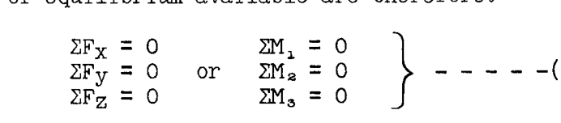

合計で3つを超えない範囲で、力とモーメントの式の組み合わせを使用できる。モーメントの式については、システム内のすべての力がこの点を通過するため、共有点を通る軸は使用できない。モーメント軸は、力の式で使用される方向と同じ方向である必要はないが、もちろん同じでも構わない。

### 空間平行力系の釣り合い
平行力系では、すべての力の方向は既知であるが、それぞれの大きさおよび位置は未知である。したがって、大きさを決定するために1つの式が必要であり、力が1つの平面内に限定されないため、位置を決定するために2つの式が必要である。一般に、このタイプの力系で合力をゼロにするために一般的に使用される3つの式は、1つの力の式と2つのモーメントの式である。

例えば、 $y$  方向に作用する空間平行力系の場合、釣り合いの式は次のようになる。

$$
\Sigma F_y = 0, \quad \Sigma M_x = 0, \quad \Sigma M_z = 0 \quad ----- (2.3)
$$

### 一般的な同一平面力系の釣り合い
このタイプの力系では、すべての力が一つの平面内にあり、このような力系の合力の大きさ、方向、および位置を決定するには3つの式しか必要としない。力またはモーメントの式のいずれかを使用できるが、力の式は最大で2つまでしか使用できない。例えば、 $xy$  平面内で作用する力系の場合、以下の釣り合いの式の組み合わせが使用できる。

$$
\begin{aligned}
\Sigma F_x &= 0 & \Sigma F_x &= 0 & \Sigma F_y &= 0 & \Sigma M_{z_1} &= 0 \\
\Sigma F_y &= 0 & \text{または } \Sigma M_{z_1} &= 0 & \text{または } \Sigma M_{z_1} &= 0 & \text{または } \Sigma M_{z_2} &= 0 \quad 2.4 \\
\Sigma M_z &= 0 & \Sigma M_{z_2} &= 0 & \Sigma M_{z_2} &= 0 & \Sigma M_{z_3} &= 0
\end{aligned}
$$

（添字1、2、および3は、 $z$  軸またはモーメント中心の異なる位置を指す。）

### 同一平面共点力系の釣り合い
すべての力が同じ平面内にあり、また共通の一点を通過するため、このタイプの力系の合力の大きさおよび方向は未知であるが、共有点が合力の作用線上にあるため位置は既知である。したがって、合力を定義し、それをゼロにするためには、2つの釣り合いの式だけで十分である。利用可能な組み合わせは次の通りである。

$$
\left.
\begin{aligned}
\Sigma F_x &= 0 \\
\Sigma F_y &= 0
\end{aligned}
\right. \text{または } 
\left.
\begin{aligned}
\Sigma F_x &= 0 \\
\Sigma M_z &= 0
\end{aligned}
\right. \text{または } 
\left.
\begin{aligned}
\Sigma F_y &= 0 \\
\Sigma M_z &= 0
\end{aligned}
\right. \text{または } 
\left.
\begin{aligned}
\Sigma M_{z_1} &= 0 \\
\Sigma M_{z_2} &= 0
\end{aligned}
\right. \quad 2.5
$$

（ $z$  軸またはモーメント中心の位置は、共有点以外の場所でなければならない）

### 同一平面平行力系の釣り合い
このタイプの力系では、すべての力の方向が既知であり、すべての力が同じ平面内にあるため、このような力系の合力の大きさおよび位置を定義するには2つの式しか必要としない。したがって、このタイプの力系で利用可能な釣り合いの式は2つだけであり、すなわち、力とモーメントの式、または2つのモーメントの式である。例えば、 $y$  軸に平行で  $xy$  平面内にある力の場合、利用可能な釣り合いの式は次のようになる。

$$
\left.
\begin{aligned}
\Sigma F_y &= 0 \\
\Sigma M_z &= 0
\end{aligned}
\right. \quad \text{または} \quad 
\left.
\begin{aligned}
\Sigma M_{z_1} &= 0 \\
\Sigma M_{z_2} &= 0
\end{aligned}
\right. \quad ----- 2.6
$$

（モーメント中心1と2は同じ  $y$  軸上にあってはならない）

### 同一直線力系の釣り合い
同一直線力系とは、すべての力が同じ線に沿って作用するものであり、換言すれば、力の方向および位置は既知であるが、その大きさは未知である。したがって、同一直線力系の合力を定義するためには大きさだけを求める必要があり、釣り合いの式は1つだけ利用可能である。すなわち、

$$
\Sigma F = 0 \quad \text{または} \quad \Sigma M_1 = 0 \quad ----- 2.7
$$

ここで、モーメント中心1は力系の作用線上にないものとする。

## A2.3 方向および作用点の力の特性を確立するための構造フィッティングユニット
空間内の力を完全に定義するには6つの式が必要であり、力が一つの平面に限定されている場合は3つの式が必要である。一般に、構造物には既知の力がかかり、これらの力はある種の内部応力分布を介して構造物を経由して伝達され、次に既知の力を釣り合いの状態に保つ反力と一般に呼ばれる他の外力によって反作用を受ける。利用可能な静的釣り合いの式は、様々な種類の力系に対して限定されているため、構造エンジニアは、未知の力の方向またはその作用点、あるいはその両方を決定するフィッティングユニットの使用に頼り、それによって決定すべき未知数の数を減らす。以下の図は、力の特性である方向と作用点を確立するために採用されるフィッティングユニットの種類、またはその他の一般的な方法を示している。

### ボール・アンド・ソケット・フィッティング (Ball and Socket Fitting)

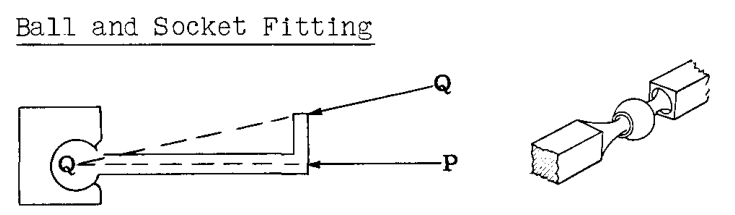

バーに作用する P や Q のような空間または同一平面上の力について、バーの回転が妨げられている場合、そのような力の作用線はボールの中心を通過しなければならない。したがって、ボール・アンド・ソケット・ジョイント（球継手）は、このタイプのフィッティングを介して構造物に加えられる力の方向と作用線を確立または制御するために使用できる。このジョイントには回転抵抗がないため、どの平面においてもモーメントを加えることはできない。

### シングルピン・フィッティング (Single Pin Fitting)

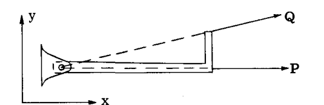

 $xy$  平面内で作用する P や Q のような力については、フィッティングユニットがピン中心を通る  $z$  軸周りのモーメントに抵抗できないため、そのような力の作用線はピン中心を通過しなければならない。したがって、 $xy$  平面内で作用する力については、図に示すように、ピンジョイントによって方向と作用線が確立される。シングルピン・フィッティングはピン軸に垂直な軸周りのモーメントに抵抗できるため、平面外の力の方向と作用線は、シングルピン・フィッティングユニットによっては確立されない。

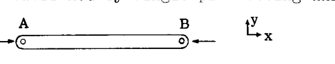

バー AB の各端にシングルピン・フィッティングがある場合、 $xy$  平面内にあり端部 B に加えられる力 P は、フィッティングが  $z$  軸周りのモーメントに抵抗できないため、端部フィッティング A と B のピン中心を結ぶ線と一致する方向と作用線を持たなければならない。

### ダブルピン - ユニバーサルジョイント・フィッティング (Double Pin - Universal Joint Fittings)

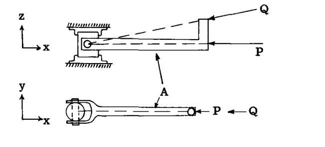

シングルピン・フィッティングユニットはピン軸に垂直な軸周りのモーメントに抵抗できるため、上に示したようなダブルピンジョイントがしばしば使用される。このフィッティングユニットは  $y$  または  $z$  軸周りのモーメントに抵抗できないため、加えられる P や Q のような力は、図に示すようにフィッティングユニットの中心を通過するような作用線と方向を持たなければならない。しかし、このフィッティングユニットは  $x$  軸周りのモーメントに抵抗することができ、言い換えれば、ユニバーサルタイプのフィッティングユニットはねじりモーメントに抵抗することができる。

### ローラー (Rollers)

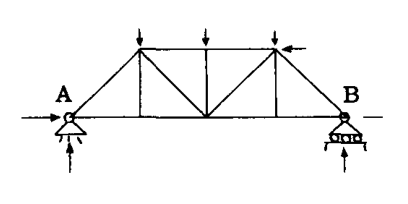

支持点での構造物の移動を可能にするために、ローラーの考え方を取り入れたフィッティングユニットがよく使用される。例えば、上の図のトラスは、端部 (A) でピンフィッティングによって支持されており、これはさらに、端部 (A) でのトラスの水平方向の移動を妨げるフィッティング部分に取り付けられている。しかし、もう一方の端 (B) は、端 (B) でのトラスの水平方向の移動に対して水平方向の抵抗を提供しないローラーの群（ネスト）によって支持されている。ローラーは、反力の方向をローラー面に対して垂直として固定する。

フィッティングユニットはピンによってトラスジョイントに結合されているため、反力の作用点も既知であり、したがってローラーピンタイプのフィッティングについては、大きさという一つの力の特性だけが未知である。トラスへの反力の作用点はピンによって既知であるが、方向と大きさは未知である。

### 潤滑スロットまたはダブルローラータイプのフィッティングユニット (Lubricated Slot or Double Roller Type of Fitting Unit)

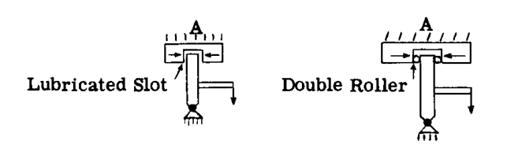

力の方向または反力を確立するために使用される別の一般的なフィッティングタイプは、第1カラムの最下部の図に示されている。ジョイント (A) におけるいかなる反力も、支持部 (A) が垂直方向の抵抗を提供しないように設計されているため、水平でなければならない。

### ケーブル - タイロッド (Cables - Tie Rods)

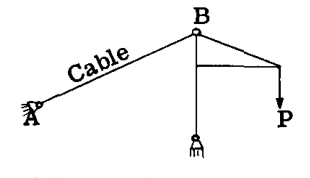

ケーブルやタイロッドは曲げ抵抗が無視できるため、ケーブルからのクレーン構造上のジョイント B における反力はケーブル軸と同一直線上になければならない。したがって、ケーブルは点 B におけるトラスへの反力の方向特性と作用点を確立する。

## A2.4 問題解決で使用される反力フィッティングユニットの記号
反力を求めるために構造物を解析する際には、部材の応力などが不明な力の特性を知る必要があり、最終的な設計で使用される、または使用されると想定されるフィッティング支持部または取り付けユニットを示すために簡単な記号を使用するのが一般的である。以下のスケッチ記号は、同一平面力系で一般的に使用されるものである。

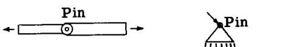

部材の端にある小さな円や三角形上の円は、シングルピン結合を表し、このユニットと接続部材または構造物の間に作用する力の作用点を固定する。

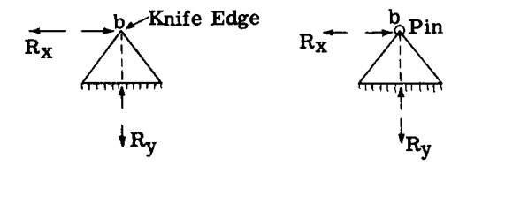

上記の図記号は、取り付け点 (b) の並進は妨げられるが、点 (b) の周りの取り付けられた構造物の回転は可能である反力を表している。したがって、反力は方向と大きさが未知であるが、作用点は既知であり、すなわち点 (b) を通過する。方向を未知数として使用する代わりに、スケッチに示されているように、合力による反力を互いに直角な2つの成分に置き換える方が便利である。

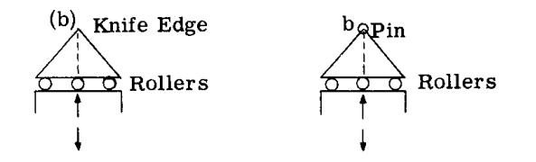

ローラーを使用した上記のフィッティングユニットは、フィッティングユニットが点 (b) を通る水平力に抵抗できないため、反力の方向をローラー面に対して垂直として固定する。したがって、反力の方向と作用点は確立されており、大きさだけが未知である。

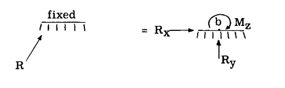

上記の図記号は、接続構造に剛に（リジッドに）取り付けられた剛な支持を表すために使用される。3つの力の特性（大きさ、方向、作用点）がすべて未知であるため、反力は完全に未知である。反力 R を、ある点 (b) を基準とした2つの力成分と、合力 R が点 (b) の周りに引き起こした未知のモーメント M の和に置き換えるのが便利であり、これは上のスケッチに示されている。この議論は、すべての力が同じ平面内にある同一平面構造に適用される。空間構造の場合、反力にはさらに  $R_z$ 、 $M_x$ 、 $M_y$  という3つの未知数が存在する。

## A2.5 静定構造物と不静定構造物
静定構造物（Statically determinate structure）とは、与えられた荷重系に対して、静的釣り合いの式を使用することによって、すべての外反力と内部応力を求めることができるものである。不静定構造物（Statically indeterminate structure）とは、釣り合いの式だけを使用しても、すべての反力と内部応力を求めることができないものである。

静定構造物は、荷重系の下で構造物を安定させるのに十分なだけの外部反力、または十分なだけの内部部材を持っている。一つの反力または部材が取り除かれると、構造物はリンケージまたは機構（メカニズム）に縮小され、したがってもはや荷重系に抵抗できなくなる。構造物が、与えられた荷重系の下で構造物の安定性に必要な数よりも多くの外部反力または内部部材を持っている場合、それは不静定であり、冗長性（redundancy）の程度は、静的釣り合いの式によって求められる数を超えた未知数の数によって決まる。構造物は、外部反力に関してのみ不静定である場合、内部応力に関してのみ不静定である場合、あるいはその両方である場合がある。

不静定構造物を解くために必要な追加の式は、構造物の歪み（distortion）を考慮することによって得られる。これは、歪みを計算する必要があるため、すべての部材のサイズと、部材が作られている材料を知らなければならないことを意味する。静定構造物では、サイズや材料に関するこの情報は必要ではなく、構造物全体の構成のみが必要である。したがって、静定構造物の設計解析は単純明快であるが、不静定構造物の設計解析には一般的な試行錯誤の手順が必要となる。

## A2.6 静定および不静定構造物の例
構造物を解析する際の最初のステップは、提示された構造物が静定であるかどうかを判断することである。もしそうであれば、部材のサイズや材料の種類を知らなくても、反力や内部応力を求めることができる。静定でない場合は、追加の式を得るために弾性理論を適用しなければならない。弾性理論については、A7章からA12章で詳しく扱っている。

学生が構造物が静定であるかどうかを判断する問題に慣れるのを助けるために、いくつかの例題を提示する。

### 例題 1

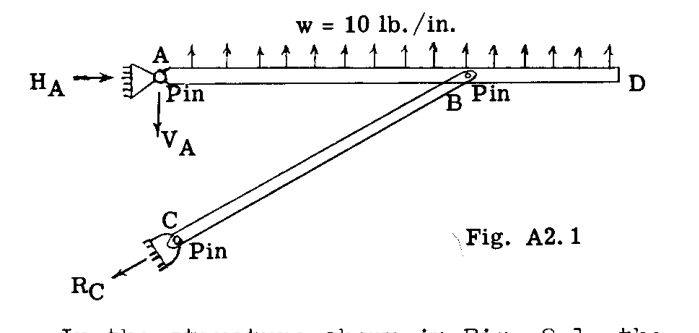

図 2.1 に示す構造において、既知の力または荷重は部材 ABD 上の 10 lb/in の等分布荷重である。点 A および C における反力は未知である。C における反力は、作用点が C のピン中心を通り、部材 CB の B 端にピンがあるため  $R_C$  の方向が線 CB と平行でなければならないことから、未知の特性は大きさだけである。点 A においては、反力は方向と大きさが未知であるが、作用点は A のピン中心を通過しなければならない。したがって、A には2つの未知数、C には1つの未知数があり、合計で3つの未知数がある。同一平面力系で利用可能な3つの釣り合いの式により、構造は静定である。方向を A における未知の角度として使用して反力の方向を求める代わりに、図に示すように A における反力を互いに直角な成分  $H_A$  および  $V_A$  に置き換えるのが一般的により便利であり、したがって構造に対する3つの未知数は3つの大きさとなる。

### 例題 2

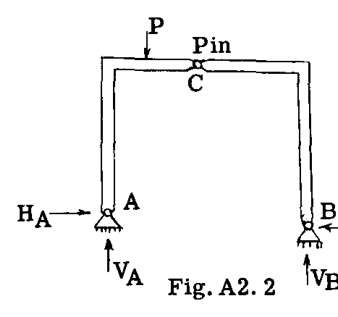 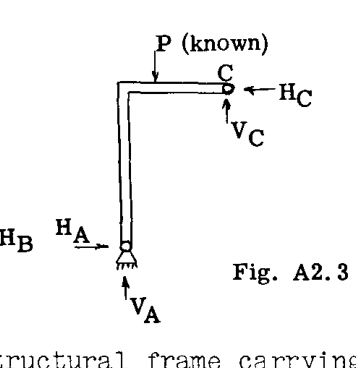

図 2.2 は、既知の荷重系 P を支持する構造フレームを示している。反力点 A および B にピンがあるため、各反力の作用点は既知である。しかし、各反力の大きさと方向は未知であり、合計で4つの未知数となる。同一平面力系で利用可能な釣り合いの式は3つだけである。最初は、この構造は不静定であると結論づけるかもしれないが、この構造には C に内部ピンがあることに気づかなければならない。これは、ピンが回転に対して抵抗を持たないため、この点での曲げモーメントがゼロであることを意味する。構造全体が釣り合いの状態にある場合、各部分は同様に釣り合いの状態でなければならず、任意の部分を自由体（free body）として切り出し、釣り合いの式を適用することができる。図 2.3 は、C のピンの左側にあるフレームの自由体を示している。C の周りのモーメントを取り、それをゼロに等しくすると、4つの未知数  $H_A$ 、 $V_A$ 、 $V_B$ 、 $H_B$  を決定するために使用する4番目の式が得られる。C の周りのモーメント式には、腕（アーム）がゼロであるため C の周りにモーメントを持たない未知数  $V_C$  および  $H_C$  は含まれない。例題 1 と同様に、A および B における反力は、未知の特性として角度（方向）を使用する代わりに、H および V 成分に置き換えられている。構造は静定である。

### 例題 3

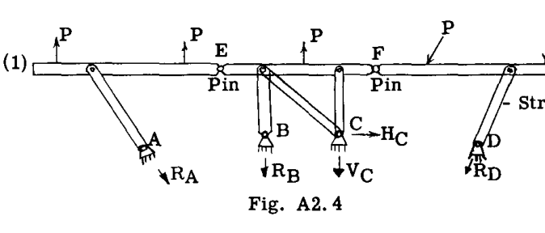

図 2.4 は、既知の荷重系 P を運び、5本のストラットによって支持された直線部材 1-2 を示している。反力点 A、B、D においては、反力は方向と作用点が既知であるが、各支持部のベクトルで示されているように大きさは未知である。点 C においては、2本のストラットがジョイント C に入るため、反力の方向は未知である。大きさも未知であるが、反力が C を通過しなければならないため作用点は既知である。したがって、 $R_A$ 、 $R_B$ 、 $R_D$ 、 $V_C$ 、 $H_C$  という5つの未知数がある。同一平面力系に対しては、利用可能な釣り合いの式が3つあるため、最初の結論としては、構造が  $(5-3) = 2$  次の不静定であるということになるかもしれない。しかし、構造を観察すると、点 E および F に2つの内部ピンがあることがわかり、これら2点での曲げモーメントがゼロであることを意味する。したがって、釣り合いの3つの式とともに使用できる式がさらに2つ得られる。このように、ピン E の左側およびピン F の右側の構造の自由体図を描き、各ピンの周りのモーメントをゼロに等しくすると、上記の5つの未知数以外の未知数を含まない2つの式が得られる。したがって、構造は静定である。

### 例題 4

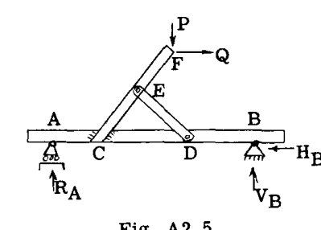 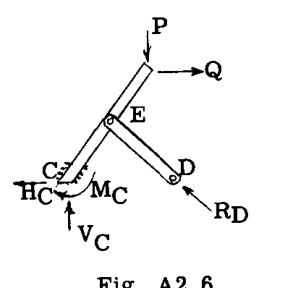

図 2.5 は、既知の荷重 P および Q を受ける上部構造 CED を支える梁 AB を示している。問題は、構造が静定であるかどうかである。構造全体の外部未知反力は点 A および B にある。A においては、ローラータイプの作用により、方向と作用点が既知であるため、大きさだけが反力の唯一の未知の特性である。B においては、大きさと方向は未知であるが作用点は既知であり、したがって  $R_A$ 、 $V_B$ 、 $H_B$  という3つの未知数があり、利用可能な3つの釣り合いの式によってこれらの反力を求めることができるため、構造は外部反力に関して静定である。次に、外部反力を求めた後、静力学によって内部応力を求めることができるかどうかを調べる。明らかに、内部応力は C および D における内部反力の影響を受けるため、図 2.6 に示すように上部構造の自由体を描き、C および D に存在する内部力を外力として考慮する。実際の構造では、部材は点 C で溶接や複数のボルト接続などによって剛に取り付けられている。これは、大きさ、方向、作用点の3つの力または反力の特性すべてが未知であることを意味する。換言すれば、C には3つの未知数が存在する。便宜上、これらの未知数を図 2.6 に示すように  $H_C$ 、 $V_C$ 、 $M_C$  の3つの成分で表す。図 2.6 のジョイント D において、反力  $R_D$  に関する唯一の未知数は大きさである。なぜなら、部材 DE の各端にあるピンが反力  $R_D$  の方向と作用点を確立するからである。したがって、4つの未知数があるが、図 2.6 の構造に対しては釣り合いの式が3つしかないため、構造はすべての内部応力に関して不静定である。学生は、点 AC、BD、FE 間の内部応力は静定であり、したがって不静定な部分は構造三角形 CEDC であることに注意すべきである。

### 例題 5

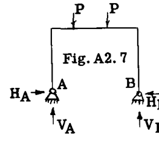 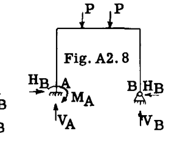 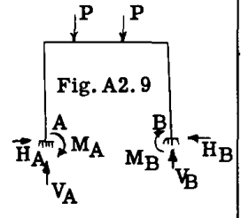

図 2.7、2.8、2.9 は、同じ既知の荷重系 P を受けているが、点 A および B での支持条件が異なる同じ構造を示している。問題は、各構造が不静定であるかどうか、そうであればどの程度か、つまり静的釣り合いの式を超えた未知数の数はいくつかということである。同一平面力系があるため、構造全体の釣り合いには静力学の式が3つしか利用できない。

図 2.7 の構造では、作用点は既知であるが、A における反力および B における反力も大きさと方向が未知である。したがって、4つの未知数があり（利用可能な静力学の式は3つだけ）、構造は1次の不静定となる。図 2.8 では、A における反力は剛なものであるため、大きさ、方向、作用点の3つの特性すべてが未知である。点 B では、ピンのみにより大きさと方向の2つの未知数があり、合計で5つの未知数となる。利用可能な静力学の式は3つしかないため、構造は2次の不静定である。図 2.9 の構造では、A および B の両方の支持が剛である。したがって、各支持において3つの力の特性が未知であり、合計で6つの未知数となり、構造は3次の不静定となる。

### 例題 6

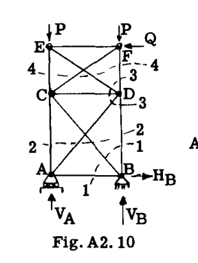 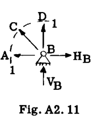 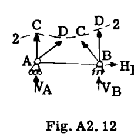

図 2.10 は、点 A および B で支持され、既知の荷重系 P、Q を受ける2ベイのトラスを示している。トラスのすべての部材は、各ジョイントで共通のピンによって端部で接続されている。A および B における反力は、示されているようにフィッティングを介して加えられる。問題は、構造が静定であるかどうかである。A および B における外部反力に関して、支持のタイプにより A においては1つの未知数、B においては2つの未知数（図 2.10 に示されるように  $V_A$ 、 $V_B$ 、 $H_B$ ）が生じ、3つの静的釣り合いの式が利用可能であるため、構造は静定である。

次に、反力 A および B の値を求めた後、内部部材の応力を求めることができるかどうかを調べる。図 2.10 のジョイント B を断面 1-1 で示されるように切り出し、図 2.11 に示すように自由体を描くと想定する。トラスの部材は各端にピンがあるため、これらの部材の荷重は軸方向でなければならず、したがって方向と作用線は既知であり、大きさだけが未知である。図 2.11 では、 $H_B$  と  $V_B$  は既知であるが、AB、CB、および DB は大きさが未知である。したがって、3つの未知数があるが、共点力系の釣り合いの式は2つしかない。図 2.10 のトラスを断面 2-2 で切り、図 2.12 に示すように下部の自由体を描くと、CA、DA、CB、DB の軸方向荷重という4つの未知数があるが、同一平面力系に対して利用可能な釣り合いの式は3つしかない。

CA、DA、CB、DB の応力を何らかの方法で求めることができたと仮定し、次にジョイント D に進み、それを自由体として扱うか、または上部パネルをセクション 4-4 に沿って切り、下部を自由体として使用するとする。上記と同じ理由により、利用可能な釣り合いの式の数よりも未知数が一つ多いことがわかり、したがってトラスは内部部材の応力に関して2次の不静定である。

物理的には、この構造は荷重下での安定性のために必要な部材よりも2つ多く部材を持っており、各トラスパネルで1つの対角部材を除いても構造は依然として安定しており、すべての部材の軸方向応力は部材の断面積の大きさや材料の種類に関係なく静的釣り合いの式によって求めることができる。各パネルに2番目の対角部材を追加すると、応力を求める前にすべてのトラス部材のサイズと使用される材料の種類を知る必要があり、部材応力を求める前に追加の式はトラスの歪みを考慮することから得られなければならない。例えば、上部パネルの1つの対角部材が除かれたと仮定する。その場合、静力学によって上部パネルの部材の応力を求めることができるが、下部パネルは依然としてダブル対角システムのために1次の不静定であり、したがって1つの追加の式が必要であり、トラスの歪みの考慮が必要となる。（不静定トラスの解法は A8 章で扱われる。）

## A2.7 静定同一平面構造物および同一平面荷重の例題の解法
学生は航空機構造の初歩的なコースを履修する前に静力学のコースを履修しているはずであるが、静的釣り合いの式の適用を伴う問題の限定的な復習は、特に問題が通常の静力学の初歩的なコースのほとんどの問題よりもいくらか難しい可能性がある場合には、十分に正当化されると感じられる。不静定構造物を解く際の一環として静的釣り合いの式を使用しなければならず、また不静定構造物はこの本の他の章でかなり詳細に扱われているため、本章では静力学を伴う問題には限られたスペースしか割かない。

### 例題 8

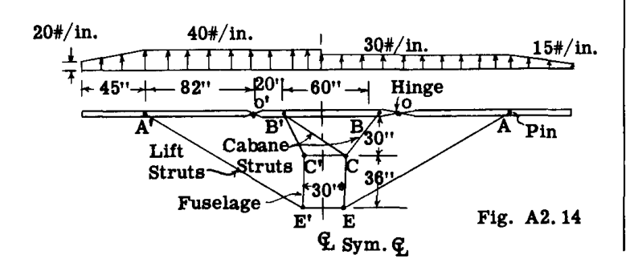

図 A2.14 は、揚力ストラットとカバネストラットによって翼桁を胴体構造に結び付けて支持された翼桁からなる、非常に簡略化された翼構造を示している。翼桁への分布空気荷重は、機体の中心線に対して非対称である。翼桁は3つのユニットで作られており、点 O および O' でピンフィッティングを使用して容易に分解できる。すべての支持翼ストラットは、各端にシングルピン・フィッティングユニットを備えている。問題は、部材の軸方向荷重と桁への反力を決定することである。

**解法:** 最初に決定すべきことは、構造が静定であるかどうかである。図から、翼桁は5本のストラットによって支持されていることが観察される。すべてのストラットの各端にピンがあるため、各ストラットの荷重の大きさという5つの未知数がある。翼桁全体を5本のストラットで支持された単一のユニットとして考えると、3つの釣り合いの式があり、したがって5つの未知のストラット荷重を求めるにはさらに2つの式が必要である。翼桁には点 O および O' に2つの内部シングルピン接続が含まれていることに気づく。これは、シングルピン・フィッティングがモーメントに抵抗できないため、ピンの片側にあるすべての力のモーメントがゼロに等しくなければならないという事実を確立する。このように、2つの内部ピンフィッティングによって2つの追加の式が得られ、したがって5つの未知数を求めるための5つの式が得られる。

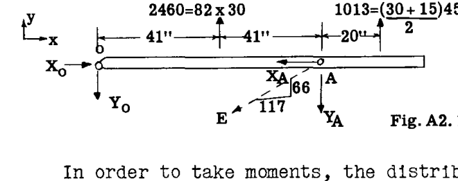

図 2.15 は、点 O におけるヒンジフィッティングの右側の翼桁の自由体を示している。モーメントを取るために、桁上の分布荷重は各桁部分の合力、すなわち分布荷重系の図心を介して作用する総荷重に置き換えられている。A におけるストラット反力  $E_A$  は、その成分  $Y_A$  および  $X_A$  で扱う方が便利であるため、仮想的に示されている。O における反力は大きさと方向が未知であり、便宜上、成分  $X_O$  および  $Y_O$  で扱う。想定される向きは図に示されている。

力の向きは、ベクトルの端にある矢印の頭でグラフィカルに表される。正しい向きは、釣り合いの式を記述する際に力またはモーメントにプラスまたはマイナスの符号を与えなければならないため、釣り合いの式の解から得られる。力またはモーメントの向きが未知であるため、それは仮定され、釣り合いの式の代数的な解が大きさにプラスの値を与える場合、真の向きは想定通りであり、解がマイナスの符号を与える場合は想定と反対である。部材内の未知の力が軸方向荷重である場合、引張応力をプラス、圧縮応力をマイナスと呼ぶのが一般的である。したがって、未知の軸方向荷重の向きを引張として仮定すると、釣り合いの式の解が正の値を与えれば、真の応力は引張であり、負の符号は想定された引張応力が逆転されるべきであること、すなわち圧縮であることを示し、一貫した符号が得られる。

未知の  $Y_A$  を求めるために、点 O の周りのモーメントを取り、釣り合いのためにゼロに等しくする。

$$
\Sigma M_O = - 2460 \times 41 - 1013 \times 102 + 82 Y_A = 0
$$

したがって、 $Y_A = 204000/82 = 2480 \text{ lb}$  となる。プラスの符号は、図で想定された向きが正しいことを意味する。幾何学的形状により、 $X_A = 2480 \times 117/66 = 4400 \text{ lb}$  であり、ストラット EA の荷重は  $\sqrt{4400^2 + 2480^2} = 5050 \text{ lb}$  の引張、または図で想定された通りとなる。

 $X_O$  を求めるために、釣り合いの式を使用する。
$$
\Sigma F_x = 0 = X_O - 4400 = 0, \text{ したがって } X_O = 4400 \text{ lb}
$$

 $Y_O$  を求めるために、次を使用する。
$$
\Sigma F_y = 0 = 2460 + 1013 - 2480 - Y_O = 0, \text{ したがって } Y_O = 993 \text{ lb}
$$

釣り合いの結果を確認するために、すべての力の A の周りのモーメントを取り、それらがゼロに等しいかどうかを確認する。
$$
\Sigma M_A = 2460 \times 41 - 1013 \times 20 - 993 \times 82 = 0 \text{ (確認完了)}
$$

桁部分 O'A' において、外部荷重は 30 に対して 40 であるため、反力は明らかに部分 OA に対して求められたものの 40/30 倍となる。
したがって  $A'E' = 6750, \quad X_{O'} = 5880, \quad Y_{O'} = 1325$ 

図 2.16 は、以前に求められた O および O' における反力を持つ中央の桁部分の自由体を示している。ストラット内の未知の荷重は、矢印で示されているように引張と仮定されている。

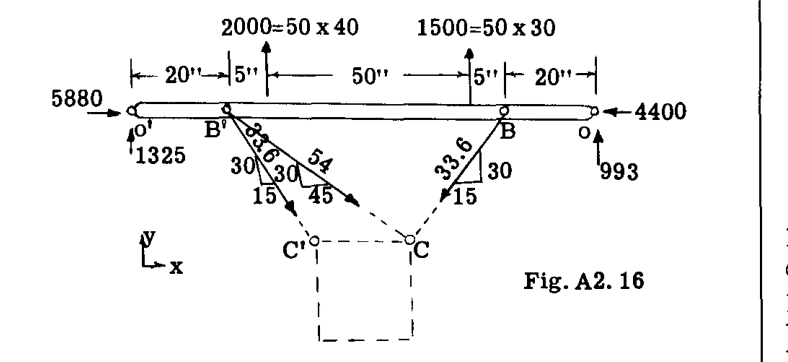

部材 BC の荷重を求めるために、B' の周りのモーメントを取る。
$$
\Sigma M_{B'} = 1325 \times 20 - 2000 \times 5 - 1500 \times 55 - 993 \times 80 + 60 (BC) \frac{30}{33.6} = 0
$$
したがって、 $BC = 2720 \text{ lb}$  であり、想定通りの向きとなる。

ストラット荷重 B'C' を求めるために、点 C の周りのモーメントを取る。
$$
\Sigma M_C = 1325 \times 65 + 2000 \times 40 + (5880 - 4400) \times 30 - 1500 \times 10 - 993 \times 35 - 30 (B'C') \frac{30}{33.6} = 0
$$
したがって、 $B'C' = 6000 \text{ lb}$  であり、示されている向きとなる。

部材 B'C の荷重を求めるために、次の式を使用する。
$$
\begin{aligned}
\Sigma F_y = 0 &= 1325 + 2000 + 1500 + 993 - 6000 \left(\frac{30}{33.6}\right) - 2720 \left(\frac{30}{33.6}\right) - B'C \left(\frac{30}{54}\right) \\
&= 0
\end{aligned}
$$
したがって、 $B'C = - 3535 \text{ lb}$  となる。マイナスの符号は、図に示されているものと反対の向きに作用すること、つまり引張ではなく圧縮であることを意味する。

これで、桁への反力を決定でき、桁のせん断力、曲げモーメント、および軸方向荷重を求めることができる。数値結果は、結果がゼロになるかどうかを確認するために、別のモーメント中心の周りのすべての力のモーメントを取ることによって、桁全体の釣り合いを確認する必要がある。

### 例題 9

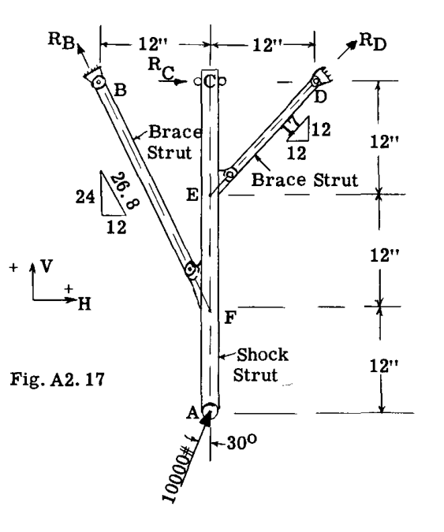

図 2.17 は、すべての部材と荷重が一つの平面内に限定された簡略化された飛行機の着陸装置ユニットを示している。ブレースストラットは各端でピン留めされており、C における支持はローラータイプであるため、支持フィッティングによって C 点で垂直反力が発生することはない。C 点の部材はローラー上で回転できるが、水平方向の移動は妨げられている。車軸ユニット A に 10,000 lb の既知の荷重が加えられている。問題は、ブレースストラット内の荷重と C における反力を求めることである。

**解法:** ブレースストラットの各端にシングルピン・フィッティングがあるため、反力  $R_B$  および  $R_D$  はストラット軸と同一直線上にあり、したがってそれぞれの方向と作用点は既知であり、大きさだけが未知である。C におけるローラータイプのフィッティングは、反力  $R_C$  の方向と作用点を固定し、大きさだけを未知数として残す。したがって、 $R_B$ 、 $R_C$ 、 $R_D$  という3つの未知数があり、3つの静的釣り合いの式が利用可能であるため、構造は外部反力に関して静定である。3つの未知の反力のそれぞれの向きは、ベクトルで示されているように想定されている。

 $R_D$  を求めるために、点 B の周りのモーメントを取る。
$$
\Sigma M_B = - 10000 \sin 30^\circ \times 36 - 10000 \cos 30^\circ \times 12 - R_D \left(\frac{12}{17}\right) \times 24 = 0
$$
したがって、 $R_D = - 16750 \text{ lb}$  となる。結果にマイナスの符号が付いているため、反力  $R_D$  は図 2.17 のベクトルで示されている向きと反対の向きを持つ。反力  $R_D$  はピン端のために線 DE と同一直線上にあるため、ブレースストラット DE の荷重は 16,750 lb の圧縮である。上記の B 周りのモーメント式において、反力  $R_D$  は点 D で垂直成分と水平成分に分解され、したがって  $(12/17)R_D$  に等しい垂直成分だけが式に含まれる。なぜなら水平成分は点 B を通る作用線を持ち、したがってモーメントを持たないからである。 $R_C$  は点 B の周りのモーメントがゼロであるため、式には含まれない。

 $R_B$  を求めるために、 $\Sigma F_y = 0$  を取る。
$$
\Sigma F_y = 10000 \times \cos 30^\circ + (- 16750)(12/17) + R_B (24/26.8) = 0
$$
したがって、 $R_B = 3540 \text{ lb}$  となる。符号がプラスであるため、向きは図で想定された通りである。反力  $R_B$  は線 BF と同一直線上にあるため、ストラット荷重 BF は 3,540 lb の引張である。

 $R_C$  を求めるために、 $\Sigma H = 0$  を取る。
$$
\Sigma H = 10000 \sin 30^\circ - 3540 (12/26.8) + (- 16750)(12/17) + R_C = 0
$$
したがって、 $R_C = 8407 \text{ lb}$  となる。結果はプラスであり、したがって想定された向きは正しかった。

数値結果を確認するために、釣り合いのために点 A の周りのモーメントを取る。
$$
\begin{aligned}
\Sigma M_A &= 8407 \times 36 + 3540 (24/26.8) \times 12 - 3540 (12/26.8) \times 36 + 16750 (12/17) \times 12 - 16750 (12/17) \times 36 \\
&= 303000 + 38100 - 57100 + 142000 - 426000 \\
&= 0 \text{ (確認完了)}
\end{aligned}
$$

## A2.8 同一平面荷重を受ける同一平面トラス構造の応力
航空機の建設において、トラスタイプの構造は非常に一般的である。最も一般的なのは、胴体フレームを構成する管状鋼溶接トラスであり、あまり頻繁ではないが、アルミニウム合金管状トラスもある。閉じたセクションと開いたセクションで構成されるトラスタイプの梁は、翼梁の建設にも頻繁に使用される。トラスの部材の応力または荷重は、一般に「一次」および「二次」応力と呼ばれる。以下の仮定の下で見出される応力は、一次応力と呼ばれる。

1. トラスの部材は直線で、重さがなく、一つの平面内にある。
2. 一つの点で接するトラスの部材は、共通の摩擦のないピンによって結合されていると考えられ、すべての部材軸はピンの中心で交差する。
3. すべての外荷重は、トラスのジョイントのみに加えられ、トラスの平面内にある。したがって、部材に生じるすべての荷重または応力は、曲げやねじれを伴わない軸方向の引張または圧縮のいずれかである。

上記の仮定が満たされないためにトラス部材に生じる応力は、二次応力と呼ばれる。ほとんどの鋼管トラスは端部で互いに溶接されており、他のトラスタイプでは部材はリベットまたはボルトで結合されている。ジョイントにおけるこの拘束は、一部の部材に一次応力よりも大きな二次応力を引き起こす可能性がある。同様に、実際の設計において、多くの機器の取り付けをこれらのトラス部材で支持することによって、端部の間のトラス部材に力を加えることが一般的である。しかし、これらのいわゆる二次荷重の大きさに関係なく、まず上記のアウトラインの仮定の下で一次応力を求めるのが一般的な習慣である。

### 内部応力に関してトラス構造が静定であるかどうかを判断するための一般的な基準
構築できる最も単純なトラスは、3つの部材  $m$  と3つのジョイント  $j$  を持つ三角形である。より精巧なトラスは、各三角形が1つのジョイントと2つの部材を追加するように配置された、追加の三角形フレームで構成される。したがって、いかなる荷重下でも安定性を確保するための部材の数は次の通りである。
$$
m = 2j - 3 \quad ----- (2.8)
$$
式 (2.8) で要求される部材数よりも少ない部材を持つトラスは、不安定な釣り合いの状態にあり、特定の荷重条件下を除いて崩壊する。式 (2.8) に示されている部材数を持つトラスの荷重は、一点で交わる部材の力が共点力系を形成するため、利用可能な静力学の式で求めることができる。このタイプの力系に対しては、2つの静的釣り合いの式が利用可能である。

したがって、 $j$  個のジョイントに対しては、 $2j$  個の利用可能な式がある。しかし、外部反力を決定するために3つの独立した式が必要であり、したがってすべての部材の荷重を解くために必要な式の数は  $2j - 3$  である。したがって、トラス部材の数が式 (2.8) で与えられる数であれば、トラスは内部部材の一次荷重に関して静定であり、トラスは安定でもある。

トラスが式 (2.8) で示されるよりも多くの部材を持っている場合、部材の荷重は静力学の法則によってすべて求めることができないため、トラスは冗長（過剰）で不静定であると考えられる。このような不静定構造は、部材が適切に配置されていれば安定しており、いかなる配置の荷重も支持する。

## トラス構造の一次応力を決定するための解析的手法
一般に、トラスタイプの構造の一次応力を見つけるために静的釣り合いの式を適用するには、3つのかなり異なる方法または手順がある。それらはしばしば、節点法（Method of joints）、モーメント法（Method of moments）、およびせん断法（Method of shears）と呼ばれる。

## A2.9 節点法
トラス全体が釣り合いの状態にある場合、トラス内の各部材またはジョイントも同様に釣り合いの状態でなければならない。トラスジョイントで交差する部材の力は共通の一点で交差し、したがって各ジョイントの力は共点・同一平面力系を形成する。節点法は、ジョイントを自由体として切り出し、あるいは分離し、共点力系に対する釣り合いの法則を適用することからなる。このタイプのシステムに対しては2つの独立した式しか利用できないため、どのジョイントにおいても2つまでの未知数しか存在できない。したがって、手順としては、2つの未知数しか存在しないジョイントから開始し、トラス全体をジョイントごとに順次進めていく。この方法を説明するために、図 A2.18 の片持ちトラスを考える。観察から、ジョイント  $L_3$  においては、内部応力が未知の部材は2つしかない。図 A2.19 は、ジョイント  $L_3$  の自由体を示している。部材  $L_3 L_2$  および  $L_3 U_2$  の応力は、ジョイント  $L_3$  から離れる方向に引っ張る矢印で示されているように、引張と仮定されている。

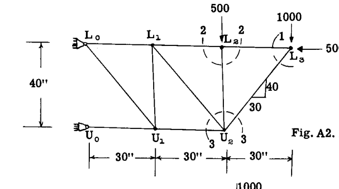

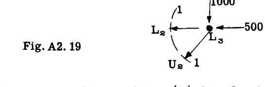

ジョイント  $L_3$  に作用する力の静的釣り合いの式は  $\Sigma H = 0$  および  $\Sigma V = 0$  である。
$$
\Sigma V = - 1000 - L_3 U_2 (40/50) = 0 \quad ----- (a)
$$
したがって、 $L_3 U_2 = - 1250 \text{ lb}$  となる。符号がマイナスになったため、応力は図 A2.19 で想定されたものと反対、すなわち圧縮である。
$$
\Sigma H = - 500 - (- 1250)(30/50) - L_2 L_3 = 0 \quad ----- (b)
$$
したがって、 $L_2 L_3 = 250 \text{ lb}$  となる。符号がプラスになったため、向きは図で想定された通り、あるいは引張である。式 (b) において、 $L_3 L_2$  の 1250 の荷重は、図 A2.19 に示されているものと反対に作用することが判明したため、マイナスの値として代入された。さらなる釣り合いの式を記述する前に、解決された部材の自由体図の矢印の向きを変更するのがおそらくより良い手順であろう。ジョイント  $U_2$  には依然として3つの未知部材が存在するのに対し、ジョイント  $L_2$  には2つしか存在しないため、ジョイント  $U_2$  の代わりにジョイント  $L_2$  に進まなければならない。図 A2.20 は、断面 2-2（図 A2.18 参照）で切り出されたジョイント  $L_2$  の自由体を示している。未知の部材応力  $L_2 U_2$  の向きは、500 lb の荷重と明らかに釣り合うように作用しているため、圧縮（ジョイントに向かって押す）と想定されている。

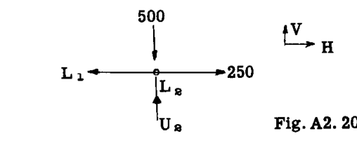

ジョイント  $L_2$  の釣り合いのため、 $\Sigma H = 0$  および  $\Sigma V = 0$  とする。
$$
\Sigma V = - 500 + L_2 U_2 = 0, \text{ したがって } L_2 U_2 = 500 \text{ lb}
$$
符号がプラスになったため、図 A2.20 で想定された向きは正しかった、あるいは圧縮である。
$$
\Sigma H = 250 - L_2 L_1 = 0, \text{ したがって } L_2 L_1 = 250 \text{ lb}
$$

次に、図 A2.18 の断面 3-3 で切り出され、図 A2.21 として描かれたジョイント  $U_2$  を考える。既知の部材応力は、以前に求められた真の向きで示されている。2つの未知の部材応力  $U_2 L_1$  および  $U_2 U_1$  は引張と想定されている。

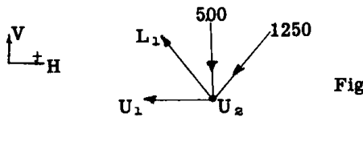

$$
\Sigma V = - 500 - 1250 (40/50) + U_2 L_1 (40/50) = 0
$$
したがって、 $U_2 L_1 = 1875 \text{ lb}$ （想定通りの引張）。