# 第A2章  
# 力系の平衡。トラス構造

### A2.1 はじめに

静的平衡方程式は、応力解析者や構造設計者が未知の力、反力、あるいは未知の内部応力を求める際に、絶えず使用しなければならないものである。それらは、構造物や機械が単純なものであろうと複雑なものであろうと不可欠である。これらの方程式を適用する能力は、多くの問題を解くことによって最も効果的に養われることは疑いようがない。本章では、これらの重要な物理法則を構造物の力および応力解析へ適用することから始める。なお、学生は「静力学」と呼ばれる通常の大学レベルの工学力学コースを修了していることを前提としている。

### A2.2 静的平衡の方程式

力を完全に定義するには、その大きさ、方向、および作用点を知る必要がある。力に関するこれらの事実は、一般に力の特性（Characteristics of the force）と呼ばれる。作用点という名称の代わりに、作用線（Line of action）や位置（Location）という、より一般的な用語が力の特性として使われることもある。

空間に作用する力は、3方向の成分とその3軸まわりのモーメント（例えば  $F_x$ ,  $F_y$ ,  $F_z$  および  $M_x$ ,  $M_y$ ,  $M_z$ ）がわかれば完全に定義される。力系の平衡のためには、合力が存在してはならず、したがって平衡の方程式は、力とモーメントの成分をゼロに等しく置くことによって得られる。各種の力系に対する静的平衡の方程式を以下に要約する。

#### 一般空間（非共面）力系の平衡方程式

$$ 
\left. \begin{matrix} \Sigma F_x = 0 & \Sigma M_1 = 0 \\ \Sigma F_y = 0 & \Sigma M_2 = 0 \\ \Sigma F_z = 0 & \Sigma M_3 = 0 \end{matrix} \right\} - - - - -(2.1) 
$$  
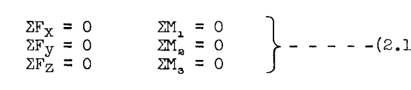

したがって、一般的な空間力系に対しては、6つの静的平衡方程式が利用可能である。これらのうち、力の式は3つまでしか使用できない。モーメント軸 1, 2, 3 として、任意の  $x, y, z$  軸のセットをとるのが都合が良い場合が多い。6つすべての方程式を、6つの異なる軸に関するモーメント方程式にすることも可能である。力の式は、互いに直交する3つの軸に対して記述されるが、必ずしも  $x, y, z$  軸である必要はない。

#### 空間共点力系の平衡

共点（Concurrent）とは、力系のすべての力が共通の一点を通ることを意味する。したがって、合力が存在する場合、それはモーメントではなく力でなければならず、合力がゼロであるという条件を完全に定義するには、3つの方程式だけで十分である。したがって、利用可能な平衡方程式は次のようになる。

$$ 
\left. \begin{matrix} \Sigma F_x = 0 & & \Sigma M_1 = 0 \\ \Sigma F_y = 0 & \text{または} & \Sigma M_2 = 0 \\ \Sigma F_z = 0 & & \Sigma M_3 = 0 \end{matrix} \right\} - - - - -(2.2) 
$$  
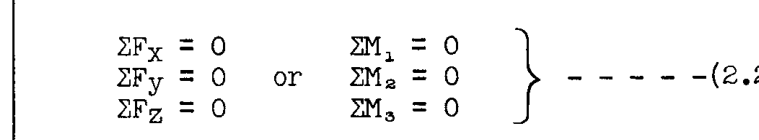

合計で3つ以下になるように、力の方程式とモーメントの方程式を組み合わせることができる。モーメントの方程式については、力系のすべての力が一点を通過するため、共点を通る軸を使用することはできない。モーメント軸は、力の方程式で使用される方向と同じである必要はないが、もちろん同じでも構わない。

#### 空間平行力系の平衡

平行力系では、すべての力の方向は既知であるが、それぞれの大きさおよび位置は未知である。したがって、大きさを決定するために1つの方程式が必要であり、力は一つの平面に限定されないため、位置を決定するために2つの方程式が必要となる。一般に、このタイプの力系で合力をゼロにするために一般的に使用される3つの方程式は、1つの力の方程式と2つのモーメントの方程式である。例えば、 $y$  方向に作用する空間平行力系の場合、平衡方程式は次のようになる。

$$ \Sigma F_y = 0, \Sigma M_x = 0, \Sigma M_z = 0 - - - - -(2.3) $$  

#### 一般共面力系の平衡

このタイプの力系では、すべての力が一つの平面内にあり、このような力系の合力の大きさ、方向、および位置を決定するには3つの方程式だけで十分である。力またはモーメントのいずれの方程式も使用できるが、力の方程式は最大2つまでしか使用できない。例えば、 $xy$  平面内で作用する力系の場合、以下の平衡方程式の組み合わせが使用できる。

$$ \begin{matrix} \Sigma F_x = 0 & & \Sigma F_x = 0 & & \Sigma F_y = 0 & & \Sigma M_{z1} = 0 \\ \Sigma F_y = 0 & \text{または} & \Sigma M_{z1} = 0 & \text{または} & \Sigma M_{z1} = 0 & \text{または} & \Sigma M_{z2} = 0 & 2.4 \\ \Sigma M_z = 0 & & \Sigma M_{z2} = 0 & & \Sigma M_{z2} = 0 & & \Sigma M_{z3} = 0 \end{matrix} $$  
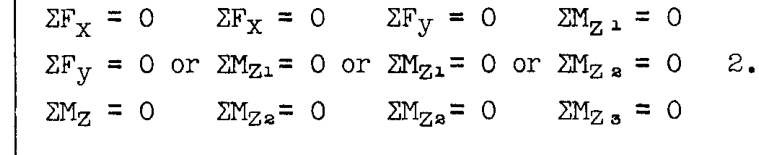

（添字1, 2, 3 は、 $z$  軸またはモーメント中心の異なる位置を指す。）

#### 共面共点力系の平衡

すべての力が同じ平面内にあり、かつ共通の一点を通るため、このタイプの力系の合力の大きさおよび方向は未知であるが、位置は共点が合力の作用線上にあるため既知である。したがって、合力を定義してゼロにするためには、2つの方程式だけで十分である。利用可能な組み合わせは次のとおりである。

$$ \left. \begin{matrix} \Sigma F_x = 0 & & \Sigma F_x = 0 & & \Sigma F_y = 0 & & \Sigma M_{z1} = 0 \\ \Sigma F_y = 0 & \text{または} & \Sigma M_z = 0 & \text{または} & \Sigma M_z = 0 & \text{または} & \Sigma M_{z2} = 0 \end{matrix} \right\} 2.5 $$  
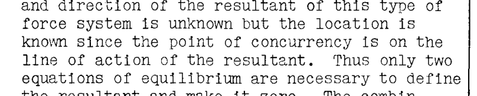

（ $z$  軸またはモーメント中心の位置は、共点を通らない場所でなければならない。）

#### 共面平行力系の平衡

このタイプの力系のすべての力の方向が既知であり、かつすべての力が同じ平面内にあるため、このような力系の合力の大きさおよび位置を定義するには2つの方程式だけで十分である。したがって、このタイプの力系に対して利用可能な平衡方程式は、力とモーメントの方程式のペア、または2つのモーメント方程式のいずれかの2つだけである。例えば、 $y$  軸に平行で  $xy$  平面内に位置する力の場合、利用可能な平衡方程式は次のようになる。

$$ \left. \begin{matrix} \Sigma F_y = 0 & & \Sigma M_{z1} = 0 \\ & \text{または} & \\ \Sigma M_z = 0 & & \Sigma M_{z2} = 0 \end{matrix} \right\} - - - - - 2.6 $$  
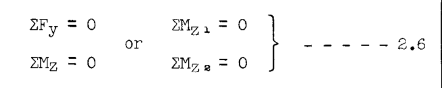

（モーメント中心1と2は、同じ  $y$  軸上にあってはならない。）

#### 同一線上（Colinear）力系の平衡

同一線上の力系とは、すべての力が同じ直線に沿って作用する系である。言い換えれば、力の方向と位置は既知であるが、その大きさは未知である。したがって、同一線上の力系の合力を定義するためには大きさだけを求めればよい。したがって、利用可能な平衡方程式は1つだけであり、すなわち、

$$ \Sigma F = 0 \text{ または } \Sigma M_1 = 0 - - - - - - 2.7 $$  

ここで、モーメント中心1は力系の作用線上にないものとする。

### A2.3 方向および作用点の力の特性を決定するための構造継手（Fitting Units）

空間における力を完全に定義するには6つの方程式が必要であり、力が一つの平面に限定されている場合は3つの方程式が必要である。一般に、構造物は既知の力によって荷重を受け、これらの力は内部の応力分布の何らかの形で構造物内を伝達され、その後、他の外力によって反作用を受ける。これらは一般に反力（Reactions）と呼ばれ、既知の力を平衡状態で構造物上に保持するものである。各種の力系に対して利用可能な静的平衡方程式は限られているため、構造エンジニアは、未知の力の方向またはその作用点、あるいはその両方を決定する継手ユニットを使用することに頼り、これにより決定すべき未知数の数を減らしている。以下の図は、方向および作用点の力の特性を決定するために採用される継手ユニットのタイプ、またはその他の一般的な方法を示している。

#### ボール・アンド・ソケット継手 (Ball and Socket Fitting)

バーに作用する  $P$  や  $Q$  のような空間または共面の力に対して、バーの回転が妨げられる場合、そのような力の作用線はボールの中心を通過しなければならない。したがって、ボール・アンド・ソケット・ジョイントを使用して、このタイプの継手を通じて構造物に適用される力の方向と作用線を設定または制御することができる。このジョイントには回転抵抗がないため、いかなる平面内にも偶力（Couples）を加えることはできない。

#### シングルピン継手 (Single Pin Fitting)

 $xy$  平面内に作用する  $P$  や  $Q$  のような力に対して、継手ユニットはピン中心を通る  $z$  軸に関するモーメントに抵抗できないため、そのような力の作用線はピン中心を通過しなければならない。したがって、 $xy$  平面内に作用する力については、図に示されるようにピン接合によって方向と作用線が設定される。シングルピン継手はピン軸に垂直な軸に関するモーメントには抵抗できるが、面外の力の方向と作用線はしたがってシングルピン継手ユニットでは設定されない。

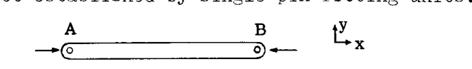

もしバー  $AB$  の両端にシングルピン継手がある場合、 $xy$  平面内にあり端部  $B$  に加えられる任意の力  $P$  は、継手が  $z$  軸まわりのモーメントに抵抗できないため、端部継手  $A$  と  $B$  のピン中心を結ぶ線と一致する方向と作用線を持たなければならない。

#### ダブルピン - ユニバーサルジョイント継手 (Double Pin - Universal Joint Fittings)

シングルピン継手ユニットはピン軸に垂直な軸に関するモーメントに抵抗できるため、上記のようなダブルピンジョイントがしばしば使用される。この継手ユニットは  $y$  軸または  $z$  軸に関するモーメントに抵抗できず、したがって加えられる  $P$  や  $Q$  のような力は、図に示されるように継手ユニットの中心を通過するような作用線と方向を持たなければならない。しかし、この継手ユニットは  $x$  軸に関するモーメントに抵抗することができ、言い換えれば、ユニバーサルタイプの継手ユニットはねじりモーメント（Torsional moment）に抵抗することができる。

#### ローラー (Rollers)

構造物が支持点で移動できるようにするために、ローラーの考え方を取り入れた継手ユニットがしばしば使用される。例えば、上の図のトラスは端部 (A) でピン継手によって支持されており、これはさらに、端部 (A) でのトラスのいかなる水平方向の移動も防ぐ継手部分に取り付けられている。しかし、もう一方の端部 (B) は、端部 (B) でのトラスの水平方向の移動に対して水平抵抗を一切提供しないローラーの集合体によって支持されている。ローラーは、(B) における反力の方向をローラー床に対して垂直に固定する。継手ユニットはピンによってトラスジョイントに結合されているため、反力の作用点も既知であり、したがって、ローラーピンタイプの継手については、大きさという一つの力の特性だけが未知である。端部 (A) の継手ユニットについては、ピンがあるためにトラスへの反力の作用点は既知であるが、方向と大きさは未知である。

#### 給油スロットまたはダブルローラータイプの継手ユニット (Lubricated Slot or Double Roller Type of Fitting Unit)

力の方向または反力を設定するために使用される別の一般的な継手タイプは、第1列の下部にある図に示されている。ジョイント (A) におけるいかなる反力も、(A) における支持部が垂直抵抗を提供しないように設計されているため、水平でなければならない。

#### ケーブル - タイロッド (Cables - Tie Rods)

ケーブルやタイロッドは曲げ抵抗が無視できるため、ケーブルからクレーン構造物へのジョイント B における反力はケーブル軸と同一線上でなければならない。したがって、ケーブルは、点 B におけるトラスへの反力の方向と作用点の力の特性を設定する。

### A2.4 問題解決で使用される反作用継手ユニットの記号

構造物の反力、部材応力などを解く際には、どのような力の特性が未知であるかを知る必要があり、最終的な設計で使用される、または使用されることが想定される継手支持部や取り付けユニットを示すために、単純な記号を使用するのが一般的である。以下のスケッチ記号は、共面力系で一般的に使用されるものである。

部材の端部または三角形上の小さな円は、シングルピン接続を表し、このユニットと接続部材または構造物の間に作用する力の作用点を固定する。

上記の図表記号は、取り付け点 (b) の並進は妨げられるが、取り付けられた構造物の (b) まわりの回転は起こり得る反作用を表している。したがって、反力は方向と大きさが未知であるが、作用点、すなわち点 (b) を通ることは既知である。方向を未知数として使用する代わりに、スケッチに示されているように、合力による反力を互いに直角な2つの成分に置き換える方が便利である。

ローラーを使用した上記の継手ユニットは、継手ユニットが点 (b) を通る水平力に抵抗できないため、反力の方向をローラー床に対して垂直に固定する。したがって、反力の方向と作用点は設定されており、大きさだけが未知である。

上記の図表記号は、接続構造物に剛に（Rigidly）取り付けられた剛支持を表すために使用される。3つの力の特性（大きさ、方向、作用点）すべてが未知であるため、反作用は完全に未知である。反力  $R$  を、上記のスケッチに示されているように、ある点 (b) に関する2つの力の成分と、合力  $R$  が点 (b) まわりに引き起こした未知のモーメント  $M$  に置き換えるのが便利である。この議論は、すべての力が同じ平面内にある共面構造に適用される。空間構造の場合、反作用にはさらに  $R_z, M_x, M_y$  という3つの未知数が加わる。

### A2.5 静定構造物と不静定構造物

静定構造物（Statically determinate structure）とは、与えられた荷重系に対して、すべての外的な反力および内部応力を静的平衡の方程式を用いるだけで求めることができる構造物である。不静定構造物（Statically indeterminate structure）とは、平衡の方程式を用いるだけでは、すべての反力と内部応力を求めることができない構造物である。

静定構造物とは、与えられた荷重系の下で構造物を安定させるためにちょうど十分な外的反力、またはちょうど十分な内部部材を持つものであり、もし一つの反力または部材が取り除かれると、構造物はリンク機構またはメカニズムに減少（劣化）し、したがって荷重系に抵抗できなくなるものである。もし構造物が、与えられた荷重系の下での安定性のために必要な数以上の外的反力または内部部材を持つ場合、それは不静定であり、冗長度（Redundancy）の次数は、静的平衡の方程式で求められる数を超えた未知数の数に依存する。構造物は、外的な反力のみ、または内部応力のみ、あるいはその両方に関して静的に不静定となり得る。

不静定構造物を解くために必要な追加の方程式は、構造物の歪み（Distortion）を考慮することによって得られる。これは、歪みを計算する必要があるため、すべての部材のサイズと、部材が作られている材料を知らなければならないことを意味する。静定構造物では、サイズや材料に関するこの情報は必要なく、構造物全体の構成（Configuration）のみが必要である。したがって、静定構造物の設計解析は明快であるが、不静定構造物の設計解析には一般的な試行錯誤（Trial and error）の手順が必要である。

### A2.6 静定および不静定構造物の例

構造物を解析する第一歩は、提示された構造物が静定であるかどうかを判断することである。もしそうであれば、部材のサイズや材料の種類を知らなくても、反力や内部応力を求めることができる。もし静定でなければ、追加の方程式を得るために弾性理論を適用しなければならない。弾性理論については、第A7章から第A12章までで詳しく扱われる。

学生が構造物が静定であるかどうかを判断する問題に慣れるのを助けるために、いくつかの例題を提示する。

#### 例題1

図 A2.1 に示される構造物において、既知の力または荷重は、部材  $ABD$  上の 1 インチあたり 10 lb の分布荷重である。点  $A$  および  $C$  における反力は未知である。点  $C$  における反力は、作用点が  $C$  におけるピン中心を通り、かつ部材  $CB$  の  $B$  端にピンがあるために  $R_C$  の方向は線  $CB$  に平行でなければならないため、未知の特性は大きさだけである。点  $A$  においては、反力は方向と大きさが未知であるが、作用点は  $A$  におけるピン中心を通らなければならない。したがって、 $A$  に 2 つの未知数、 $C$  に 1 つの未知数があり、合計 3 つである。共面力系に対して 3 つの平衡方程式が利用可能であるため、この構造物は静定である。方向を  $A$  における未知の角度として使用して反力の方向を見つける代わりに、図のように反力を  $H_A$  および  $V_A$  という互いに直角な成分に置き換える方が通常は便利であり、したがって構造物の 3 つの未知数は 3 つの大きさとなる。

#### 例題2

図 2.2 は、既知の荷重系  $P$  を支持する構造フレームを示している。反作用点  $A$  と  $B$  にピンがあるため、各反力の作用点は既知である。しかし、各反力の大きさと方向は未知であり、合計 4 つの未知数に対して、共面力系で利用可能な平衡方程式は 3 つだけである。最初、この構造物は静的に不静定であると結論付けるかもしれないが、この構造物には  $C$  点に内部ピンがあることに気づかなければならない。これは、ピンが回転に対する抵抗を持たないため、この点における曲げモーメントがゼロであることを意味する。構造物全体が平衡状態にあるならば、各部分も同様に平衡状態でなければならず、任意の断分を自由体（Free body）として切り出して平衡方程式を適用することができる。図 2.3 は、点  $C$  の左側のフレームの自由体を示している。 $C$  まわりのモーメントをとり、ゼロに等しく置くと、 $H_A, V_A, V_B, H_B$  という 4 つの未知数を決定するのに使用する 4 番目の方程式が得られる。 $C$  まわりのモーメント方程式には、モーメントアームがゼロであるため、 $V_C$  と  $H_C$  という未知数は含まれない。例題1と同様に、 $A$  と  $B$  における反力は、方向（角度）を未知の特性として使用する代わりに、 $H$  と  $V$  の成分に置き換えられている。この構造物は静定である。

#### 例題3

図 2.4 は、既知の荷重系  $P$  を運び、5 つのストラット（支柱）で支持された直線部材 1-2 を示している。反作用点  $A, B, D$  において、反力は方向と作用点は既知であるが、各支持部においてベクトルで示されているように大きさは未知である。点  $C$  においては、2 つのストラットがジョイント  $C$  に入るため、反作用の方向は未知である。大きさも未知であるが、作用点は反力が  $C$  を通過しなければならないため既知である。したがって、5 つの未知数、すなわち  $R_A, R_B, R_D, V_C, H_C$  がある。共面力系に対して 3 つの平衡方程式があるため、最初の結論は、この構造物は  $(5-3) = 2$  次の不静定であるということかもしれない。しかし、構造物の観察により、 $E$  点と  $F$  点に 2 つの内部ピンがあることがわかり、これら 2 点における曲げモーメントがゼロであることを意味し、したがって平衡方程式と共に使用する追加の 2 つの方程式が与えられる。したがって、ピン  $E$  の左側とピン  $F$  の右側の構造物の自由体図を描き、各ピンまわりのモーメントをゼロに等しく置くと、上に挙げた 5 つの未知数以外の未知数を含まない 2 つの方程式が得られる。したがって、この構造物は静定である。

#### 例題4

図 2.5 は、既知の荷重  $P$  および  $Q$  を受ける上部構造  $CED$  を支える梁  $AB$  を示している。問題は、この構造物が静定であるかどうかである。構造物全体の外部未知反力は、点  $A$  と  $B$  にある。 $A$  においては、ローラータイプの作用により、方向と作用点は既知であるため、大きさだけが未知の特性である。 $B$  においては、大きさと方向は未知であるが、作用点は既知である。したがって、3 つの未知数  $R_A, V_B, H_B$  があり、3 つの平衡方程式が利用可能であるため、これら反力を見つけることができ、したがって構造物は外部反力に関しては静定である。次に、外部反力を求めた後に内部応力が静力学によって求められるかどうかを調査する。明らかに、内部応力は  $C$  と  $D$  における内部反力によって影響を受けるため、図 2.6 に示すように上部構造の自由体図を描き、 $C$  と  $D$  に存在した内部力を外力として考慮する。実際の構造物では、部材は溶接や複数のボルト接続などで点  $C$  で剛に結合されている。これは、3 つすべての力または反力の特性、すなわち大きさ、方向、作用点が未知であることを意味する。言い換えれば、 $C$  には 3 つの未知数が存在する。便宜上、これらの未知数を図 2.6 に示すように  $H_C, V_C, M_C$  の 3 つの成分で表す。図 2.6 の点  $D$  において、反力に関する唯一の未知数は、部材  $DE$  の各端にあるピンが反力  $R_D$  の方向と作用点を決定するため、大きさ  $R_D$  である。したがって、4 つの未知数があるが、図 2.6 の構造物に対して平衡方程式は 3 つしかなく、したがってこの構造物はすべての内部応力に関して静的に不静定である。点  $AC, BD, FE$  間の内部応力は静定であり、したがって静的に不静定な部分は構造三角形  $CEDC$  であることに注意すべきである。

#### 例題5

図 2.7, 2.8, 2.9 は、同じ既知の荷重系  $P$  を受けるが、点  $A$  および  $B$  で異なる支持条件を持つ同じ構造物を示している。問題は、各構造物が静的に不静定であるかどうか、そうであればどの程度か、すなわち、利用可能な静力学の方程式を超えた未知数の数はいくつかということである。共面力系を扱っているため、構造物全体に対して 3 つの静力学の方程式しか利用できない。

図 2.7 の構造物では、 $A$  における反力および  $B$  における反力も、作用点は既知であるが大きさと方向が未知である。したがって、4 つの未知数（利用可能な方程式は 3 つだけ）により、構造物は 1 次の静的不静定となる。図 2.8 では、 $A$  における反力は剛支持であり、したがって大きさ、方向、作用点の 3 つの特性すべてが未知である。 $B$  点では、ピンのみであるため、大きさ、方向の 2 つの未知数があり、合計で 5 つの未知数となる。利用可能な方程式は 3 つだけであるため、構造物は 2 次の静的不静定となる。図 2.9 の構造物では、 $A$  と  $B$  の両方の支持部が剛支持である。したがって、各支持部において 3 つ、合計 6 つの力の特性が未知であり、構造物は 3 次の静的不静定となる。

#### 例題6

図 2.10 は、点  $A$  と  $B$  で支持され、既知の荷重系  $P, Q$  を受ける 2 ベイのトラスを示している。トラスのすべての部材は、各ジョイントで共通のピンによって両端が接続されている。 $A$  と  $B$  における反力は、示されている継手を介して適用される。問題は、構造物が静定であるかどうかである。点  $A$  と  $B$  における外部反力に関しては、支持のタイプにより  $A$  で 1 つの未知数、 $B$  で 2 つの未知数、すなわち図 2.10 に示されるように  $V_A, V_B, H_B$  が生じ、3 つの静的平衡方程式が利用可能であるため、構造物は静定である。

次に、 $A$  と  $B$  における反力の値を求めた後、内部部材の応力を見つけることができるかどうかを調査する。図 2.10 のジョイント  $B$  を断面 1-1 で切り出し、図 2.11 に示される自由体図を描くと仮定する。トラスの部材は各端にピンがあるため、これらの部材内の荷重は軸方向でなければならず、したがって方向と作用線は既知であり、大きさだけが未知である。図 2.11 では  $H_B$  と  $V_B$  は既知であるが、 $AB, CB, DB$  は大きさが未知である。したがって 3 つの未知数があるが、共面共点力系の平衡方程式は 2 つしかない。もし図 2.10 のトラスを断面 2-2 で切り、図 2.12 に示すように下部の自由体図を描くと、 $CA, DA, CB, DB$  の軸方向荷重という 4 つの未知数があるが、共面力系に対して利用可能な平衡方程式は 3 つしかない。

どうにかして  $CA, DA, CB, DB$  内の応力を見つけることができたと仮定し、次にジョイント  $D$  に進み、それを自由体として扱うか、または上部パネルを断面 4-4 に沿って切り、下部を自由体として使用したとする。上記と同じ推論により、利用可能な平衡方程式の数よりも未知数が 1 つ多いことがわかり、したがってトラスは内部部材の応力に関して 2 次の静的不静定である。

物理的には、この構造物は荷重下での安定性のために必要以上の部材を 2 つ持っている。なぜなら、各トラスパネルに 1 つずつ対角部材を残しても、構造物は依然として安定であり、すべての部材の軸方向応力を、断面サイズや材料の種類に関わらず、静的平衡の方程式によって求めることができるからである。各パネルに 2 番目の対角部材を追加するには、部材の応力が見つかる前にすべてのトラス部材のサイズと使用される材料の種類を知る必要があり、追加の方程式はトラスの歪みを伴う考察から得られなければならない。トラスの歪みを考慮して追加の方程式を求める必要がある。（不静定トラスの解法は第A8章で扱われる。）

### A2.7 静定共面構造物と共面荷重の例題解法

航空機構造に関する基礎的なコースを受講する前に、学生は静力学のコースを受講しているが、静的平衡の方程式の適用を伴う問題の限定的な復習を行うことは、特にその問題が通常の静力学の初歩的なコースで見られるものよりもいくらか難しい可能性がある場合には、十分に正当化されると考えられる。不静定構造物を解く際や、不静定構造物は本書の他の章でかなり詳細に扱われているため、本章の静力学を伴う問題には限られたスペースのみを割く。

#### 例題8

図 A2.14 は、揚力および機体構造に主翼桁を結合するカベイン・ストラットによって支持された、非常に簡略化された主翼構造を示している。主翼桁上の分布空気荷重は、機体の中心線に対して非対称である。主翼桁は、点  $O$  および  $O'$  におけるピン継手を使用して容易に分解できる 3 つのユニットで作られている。すべての支持用翼ストラットは、各端にシングルピン継手ユニットを備えている。問題は、部材の軸方向荷重と桁への反作用を決定することである。

**解法**: 最初に決定すべきことは、構造物が静定であるかどうかである。図から、主翼桁は 5 つのストラットで支持されていることがわかる。すべてのストラットの各端にピンがあるため、5 つの未知数、すなわち各ストラット内の荷重の大きさがある。各ストラット荷重の方向と位置は、各ストラットの両端にあるピンのために既知である。主翼桁全体を 1 つのユニットとして 5 つのストラットで支持されていると考えた場合、平衡方程式は 3 つであるため、5 つの未知のストラット荷重を求めるには、さらに 2 つの方程式が必要である。主翼桁には、点  $O$  および  $O'$  において 2 つの内部シングルピン接続が含まれていることに注意する。これにより、シングルピン継手はモーメントに抵抗できないため、ピンの片側に位置するすべての力のモーメントはゼロに等しくなければならないという事実が確立される。したがって、2 つの内部ピン継手により 2 つの追加の方程式が得られ、5 つの未知数を求めるための 5 つの方程式が得られる。

図 2.15 は、ヒンジ継手  $O$  の右側の主翼桁の自由体を示している。

モーメントをとるために、桁上の分布荷重は各桁部分の合力、すなわち分布荷重系の図心を介して作用する合計荷重に置き換えられている。ストラット反力  $EA$  の  $A$  点における成分は、成分  $Y_A$  および  $X_A$  として扱う方が便利であるため、幻影（Phantom）として示されている。 $O$  における反力は大きさと方向が未知であり、便宜上、成分  $X_O$  および  $Y_O$  として扱う。想定される向き（センス）は図に示されている。

力の向きは、ベクトルの端にある矢印によって図示される。正しい向きは平衡方程式の解から得られる。なぜなら、力またはモーメントには方程式を書く際にプラスまたはマイナスの符号が与えられなければならないからである。力またはモーメントの向きが未知である場合は、それが想定され、もし平衡方程式の代数解が大きさにプラスの値を与えるならば、真の向きは想定された通りであり、解がマイナスの値を与えるならば想定とは逆である。未知の力が部材の軸方向荷重である場合、引張応力（テンション）をプラス、圧縮応力（コンプレッション）をマイナスと呼ぶのが一般的である。したがって、未知の軸方向荷重の向きを引張として想定した場合、平衡方程式の解は、真の応力が引張であれば大きさにプラスの値を与え、マイナスの符号は想定された引張応力が逆転されるか、圧縮されるべきであることを示し、これにより符号の一貫性が得られる。

未知数  $Y_A$  を求めるために、点  $O$  まわりのモーメントをとり、平衡のためにゼロに等しく置く。

$$ \Sigma M_O = - 2460 \times 41 - 1013 \times 102 + 82 Y_A = 0 $$

したがって、 $Y_A = 204000/82 = 2480$  lb となる。プラスの符号は、図で想定された向きが正しいことを意味する。幾何学的形状により、 $X_A = 2480 \times 117/66 = 4400$  lb であり、ストラット  $EA$  の荷重は  $\sqrt{4400^2 + 2480^2} = 5050$  lb の引張、または図で想定された通りである。

 $X_O$  を求めるために、平衡方程式を使用する。

$$ \Sigma F_x = 0 = X_O - 4400 = 0 \quad \text{したがって } X_O = 4400 \text{ lb} $$

 $Y_O$  を求めるために、次式を使用する。

$$ \Sigma F_y = 0 = 2460 + 1013 - 2480 - Y_O = 0 \quad \text{したがって } Y_O = 993 \text{ lb} $$

平衡のための結果を確認するために、 $A$  まわりのすべての力のモーメントをとり、それらがゼロに等しいかどうかを確認する。

$$ \Sigma M_A = 2460 \times 41 - 1013 \times 20 - 993 \times 82 = 0 \quad \text{（確認）} $$

桁の部分  $O'A'$  において、外部荷重が 30 に対して 40 であるため、反作用は明らかに  $OA$  部分で求められたものの  $40/30$  倍である。

したがって、 $A'E' = 6750, X_{O'} = 5880, Y_{O'} = 1325$  である。

図 2.16 は、以前に求められた  $O$  および  $O'$  における反力を伴う中央桁部分の自由体を示している。ストラット内の未知の荷重は、矢印で示されるように引張として想定されている。

ストラット  $BC$  内の荷重を求めるために、 $B'$  まわりのモーメントをとる。

$$ \Sigma M_{B'} = 1325 \times 20 - 2000 \times 5 - 1500 \times 55 - 993 \times 80 + 60 (BC) \frac{30}{33.6} = 0 $$

したがって、 $BC = 2720$  lb、向きは想定された通りである。

ストラット荷重  $B'C'$  を求めるために、点  $C$  まわりのモーメントをとる。

$$ \Sigma M_C = 1325 \times 65 + 2000 \times 40 + (5880 - 4400) 30 - 1500 \times 10 - 993 \times 35 - 30 (B'C') \frac{30}{33.6} = 0 $$

したがって、 $B'C' = 6000$  lb、向きは示されている通りである。

部材  $B'C$  の荷重を求めるために方程式を使用する。

$$ \Sigma F_y = 0 = 1325 + 2000 + 1500 + 993 - 6000 \frac{30}{33.6} - 2720 \frac{30}{33.6} - B'C \frac{30}{54} = 0 $$

したがって、 $B'C = - 3535$  lb。マイナスの符号は、それが図に示されているものとは逆、すなわち引張の代わりに圧縮であることを意味する。

これで桁上の反力を決定でき、桁上のせん断力、曲げモーメント、および軸方向荷重を求めることができる。数値結果は、すべての力のモーメントを別のモーメント中心のまわりでとり、結果がゼロになるかどうかを確認することによって、桁全体の平衡をチェックすべきである。

#### 例題9

図 2.17 は、すべての部材と荷重が一つの平面に限定された、簡略化された航空機の着陸装置ユニットを示している。ブレース・ストラット（支持支柱）は各端でピン留めされており、 $C$  における支持はローラータイプであるため、点  $C$  における支持継手によって垂直方向の反力は生じない。点  $C$  の部材はローラー上で回転できるが、水平方向の移動は阻止されている。車軸ユニット  $A$  に 10,000 lb の既知の荷重が加えられている。問題は、ブレース・ストラット内の荷重と  $C$  における反力を求めることである。

**解法**: ブレース・ストラットの各端にシングルピン継手があるため、反力  $R_B$  および  $R_D$  はストラット軸と同一線上にある。したがって、 $R_B$  および  $R_D$  の反作用については方向と作用点は既知であり、それぞれの大きさだけが未知である。 $C$  におけるローラータイプの継手は反力  $R_C$  の方向と作用点を固定し、大きさだけを未知数として残す。したがって 3 つの未知数  $R_B, R_C, R_D$  があり、3 つの静的平衡方程式が利用可能であるため、構造物は外部反力に関して静定である。3 つの未知の反作用のそれぞれの向きは、ベクトルによって示されているように想定されている。

 $R_D$  を求めるために、点  $B$  まわりのモーメントをとる。

$$ \Sigma M_B = - 10000 \sin 30^\circ \times 36 - 10000 \cos 30^\circ \times 12 - R_D \frac{12}{17} \times 24 = 0 $$

したがって、 $R_D = - 16750$  lb。結果がマイナスの符号で出たため、反力  $R_D$  は図 2.17 に示されたベクトルとは逆の向きを持つ。ピン端のために反力  $R_D$  は線  $DE$  と同一線上にあるため、ブレース・ストラット  $DE$  内の荷重は 16,750 lb の圧縮（コンプレッション）である。上記の  $B$  まわりのモーメント方程式において、反力  $R_D$  は点  $D$  において垂直成分と水平成分に分解されており、したがって作用線が点  $B$  を通過してモーメントを持たない水平成分は無視し、 $(12/17)R_D$  に等しい垂直成分のみが方程式に入っている。 $R_C$  は  $B$  まわりのモーメントがゼロであるため、方程式には入らない。

 $R_B$  を求めるために、 $\Sigma F_y = 0$  をとる。

$$ \Sigma F_y = 10000 \times \cos 30^\circ + (- 16750)(12/17) + R_B \frac{24}{26.8} = 0 $$

したがって、 $R_B = 3540$  lb。符号がプラスで出たため、向きは図で想定されたものと同じである。したがって、反力  $R_B$  は線  $BF$  と同一線上にあるため、ストラット荷重  $BF$  は 3540 lb の引張である。

 $R_C$  を求めるために、 $\Sigma H = 0$  をとる。

$$ \Sigma H = 10000 \sin 30^\circ - 3540 (12/26.8) + (- 16750)(12/17) + R_C = 0 $$

したがって、 $R_C = 8407$  lb。結果はプラスであり、想定された向きは正しかった。

数値結果を確認するために、平衡のために点  $A$  まわりのモーメントをとる。

$$ \Sigma M_A = 8407 \times 36 + 3540 \frac{24}{26.8} \times 12 - 3540 \frac{12}{26.8} \times 36 + 16750 \frac{12}{17} \times 12 - 16750 \frac{12}{17} \times 36 = 303000 + 38100 - 57100 + 142000 - 426000 = 0 \quad \text{（確認）} $$

### A2.8 共面荷重を受ける共面トラス構造の応力

航空機の建設において、トラスタイプの構造は非常に一般的である。最も一般的なものは、胴体フレームを構成する管状スチール溶接トラスであり、あまり頻繁ではないがアルミ合金管状トラスもある。閉じたセクションや開いたセクションの部材で構成されるトラスタイプの梁も、主翼梁の建設によく使用される。トラスの部材内の応力や荷重は、一般に「一次（Primary）」および「二次（Secondary）」応力と呼ばれる。以下の仮定の下で求められる応力は、一次応力と呼ばれる。

(1) トラスの部材は直線で、重量がなく、一つの平面内にある。
(2) ジョイントで接するトラス部材は、共通の摩擦のないピンによって互いに結合されていると考えられ、すべての部材軸はピン中心で交差する。
(3) すべての外部荷重はトラスのジョイントのみに、トラスの平面内で加えられる。したがって、部材に生じるすべての荷重または応力は、曲げやねじれを伴わない軸方向の引張または圧縮である。

上記の仮定が満たされないためにトラス部材に生じる応力は、二次応力と呼ばれる。ほとんどのスチール管状トラスは端部で溶接されており、他のトラスタイプでは部材はリベットやボルトで結合されている。ジョイントにおけるこの拘束により、一部の部材に一次応力よりも大きな二次応力が発生することがある。同様に、実際の設計では、トラス部材の端の間で多くの機器の取り付けを支持することによって、トラス部材に力を加えることが一般的である。しかし、これらがいわゆる二次荷重の大きさに関わらず、まず上記の仮定の下で一次応力を求めることが一般的である。

#### トラス構造が内部応力に関して静定であるかどうかを判断するための一般基準

構築できる最も単純なトラスは、3 つの部材  $m$  と 3 つのジョイント  $j$  を持つ三角形である。より複雑なトラスは、各三角形が 1 つのジョイントと 2 つの部材を追加するように配置された、追加の三角形フレームで構成される。したがって、いかなる荷重下でも安定性を保証するための部材の数は次のとおりである。

$$ m = 2j - 3 - - - - - - - - - - - - - (2.8) $$

式 (2.8) で要求される数よりも少ない部材を持つトラスは、不安定な平衡状態にあり、特定の荷重条件を除いて崩壊する。式 (2.8) に示される部材数を持つトラス内の荷重は、部材が一点で交差するか、共点力系を形成するため、利用可能な静力学の方程式で求めることができる。このタイプの力系に対しては、2 つの静的平衡方程式が利用可能である。

したがって、 $j$  個のジョイントに対して、 $2j$  個の方程式が利用可能である。しかし、外部反力を決定するには 3 つの独立した方程式が必要であり、したがって、部材内のすべての荷重を解くために必要な方程式の数は  $2j - 3$  である。したがって、トラス部材の数が式 (2.8) で与えられる数であれば、トラスはトラス部材内の一次荷重に関して静定であり、トラスは安定でもある。

トラスが式 (2.8) で示される数以上の部材を持つ場合、部材荷重を静力学の法則によってすべての部材で求めることができないため、そのトラスは冗長（Redundant）であり、静的に不静定であると見なされる。このような冗長な構造は、部材が適切に配置されていれば安定であり、あらゆる配置の荷重を支えることができる。

### トラス構造における一次応力を決定するための解析的手法

一般に、トラスタイプ構造の一次応力を求める際に静的平衡の方程式を適用する、3 つのかなり明確な方法または手順がある。それらは、節点法（Method of joints）、モーメント法（Method of moments）、およびせん断法（Method of shears）と呼ばれることが多い。

#### A2.9 節点法 (Method of Joints)

トラス全体が平衡状態にあるならば、トラス内の各部材またはジョイントも同様に平衡状態でなければならない。トラスジョイントにおける部材内の力は共通の点で交差するため、各ジョイントにおける力は共面共点力系を形成する。節点法は、ジョイントを自由体として切り出すか、あるいは隔離し、共点力系の平衡の法則を適用することからなる。このタイプの系に対しては 2 つの独立した方程式しか利用できないため、任意のジョイントにおいて存在できる未知数は 2 つだけである。したがって、手順としては、未知数が 2 つしか存在しないジョイントから開始し、トラス全体をジョイントごとに順次進めていく。この方法を説明するために、図 A2.18 の片持ちトラスを考える。観察により、ジョイント  $L_3$  において内部応力が未知の部材は 2 つだけであることがわかる。図 A2.19 はジョイント  $L_3$  の自由体を示している。部材  $L_3L_2$  および  $L_3U_2$  内の応力は、ジョイント  $L_3$  から引き離す矢印で示されているように、引張として想定されている。

ジョイント  $L_3$  に作用する力の静的平衡方程式は  $\Sigma H = 0$  および  $\Sigma V = 0$  である。

$$ \Sigma V = - 1000 - L_3U_2 (40/50) = 0 - - - - - - -(a) $$

したがって、 $L_3U_2 = - 1250$  lb。符号がマイナスで出たため、応力は想定されたものとは逆、すなわち圧縮である。

$$ \Sigma H = - 500 - (- 1250)(30/50) - L_2L_3 = 0 - - (b) $$

したがって、 $L_2L_3 = 250$  lb。符号がプラスで出たため、向きは図で想定されたものと同じ、すなわち引張である。方程式 (b) において、 $L_3L_2$  内の荷重 1250 は、それが図 A2.19 に示されているものとは逆に作用することが判明したため、マイナスの値として代入された。より良い手順としては、さらに平衡方程式を書く前に、解かれた部材について自由体図内の矢印の向きを変更することかもしれない。 $U_2$  においては依然として 3 つの未知部材が存在するのに対し、 $L_2$  においては 2 つだけであるため、ジョイント  $U_2$  の代わりにジョイント  $L_2$  に進まなければならない。図 A2.20 は、断面 2-2 で切り出したジョイント  $L_2$  の自由体を示している（図 A2.18 参照）。未知の部材応力  $L_2U_2$  の向きは、500 lb の荷重と釣り合うために明らかにこの方向に作用しているため、圧縮（ジョイントに向かって押す）として想定されている。

ジョイント  $L_2$  の平衡のためには、 $\Sigma H = 0$  および  $\Sigma V = 0$  である。

$$ \Sigma V = - 500 + L_2U_2 = 0 \quad \text{したがって } L_2U_2 = 500 \text{ lb} $$

符号がプラスで出たため、想定された向きは正しく、圧縮である。

$$ \Sigma H = 250 - L_2L_1 = 0 \quad \text{したがって } L_2L_1 = 250 \text{ lb} $$

次に、ジョイント  $U_2$  を断面 3-3 で切り出し、図 A2.21 として描かれた自由体として考える。既知の部材応力は、以前に求められた真の向きで示されている。2 つの未知部材応力  $U_2L_1$  および  $U_2U_1$  は引張として想定されている。

$$ \Sigma V = - 500 - 1250 (40/50) + U_2L_1 (40/50) = 0 $$

したがって、 $U_2L_1 = 1875$  lb（想定通りの引張）。

$$ \Sigma H = (- 1250)(30/50) - 1875 (30/50) - U_1U_2 = 0 $$

したがって、 $U_1U_2 = - 1875$  lb、すなわち想定とは逆の向きで、圧縮である。

注：学生は以降のジョイントも同様に続けるべきである。この片持ちトラスを伴う例では、未知数が 2 つだけのジョイントとしてジョイント  $L_3$  を選択することが可能であったため、反力を求める必要はなかった。図 A2.22 に示されるようなトラスでは、まず反力  $R_1$  または  $R_2$  を求める必要があり、それが反作用点において 2 つの未知数のみを含むジョイントを提供する。

すべての未知数の代数符号がプラスで出たため、想定された方向は図 A2.22 に示される通り正しかった。

 $A$  まわりのモーメントをとり、 $\Sigma M_A = 0$  を確認する。

$$ \Sigma M_A = 500 \times 30 + 1000 \times 60 + 1000 \times 90 + 500 \times 30 + 500 \times 120 - 150 V_B = 0 $$

したがって、 $V_B = 1600$  lb。

 $\Sigma V = 0$  をとる。

$$ \Sigma V = V_A - 1000 - 1000 - 500 - 500 + 1600 = 0 \quad \text{したがって } V_A = 1400 \text{ lb} $$

 $\Sigma H = 0$  をとる。

$$ \Sigma H = 500 - H_A = 0 \quad \text{したがって } H_A = 500 \text{ lb} $$

#### A2.10 モーメント法 (Method of Moments)

共面非共点力系に対しては、3 つの静力学の方程式が利用可能である。これら 3 つの方程式は、3 つの異なる点まわりのモーメント方程式としてとることができる。図 A2.22 は典型的なトラスを示している。部材  $F_1, F_2, F_3, F_4, F_5$  および  $F_6$  の荷重を求めることが要求されているとする。

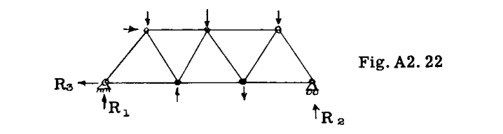

解法の第一歩は、点  $A$  および  $B$  における反力を求めることである。 $B$  におけるローラータイプの支持により、反力  $B$  の唯一の未知の要素は大きさである。点  $A$  においては、反力の大きさと方向は未知であり、合計 3 つの未知数に対して 3 つの静力学の方程式が利用可能である。便宜上、点  $A$  における未知の反力はその未知の  $H$  および  $V$  成分に置き換えられている。

$$ \Sigma M_B = 1400 \times 150 + 500 \times 30 - 500 \times 120 - 500 \times 30 - 1000 \times 90 - 1000 \times 60 = 0 \quad \text{（確認）} $$

部材  $F_1, F_2$  および  $F_3$  内の応力を決定するために、トラスを 1-1 で切断する（図 A2.22）。図 A2.23 は、この断面の左側のトラス部分の自由体図を示している。

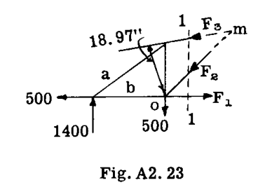

トラス全体は平衡状態にある。したがって、いかなる部分も平衡状態でなければならない。図 A2.23 において、トラス全体の中に存在していた部材  $F_1, F_2$  および  $F_3$  の内部応力は、現在、断面 1-1 の左側のトラス部分を他の荷重および反力と組み合わせて平衡状態に保持する外力として考慮される。図 A2.23 の部材  $a$  および  $b$  は切断されていないため、これらの部材内の荷重は内部応力のままであり、示されているトラス部分の平衡には影響を与えない。したがって、断面 1-1 の左側のトラス部分は、図 A2.24 に示すように、 $F_1, F_2$  および  $F_3$  の値に影響を与えることなく、一つの固体ブロック（剛体）として考えることができる。モーメント法は、その名称が示すように、特定の部材内の荷重を見つけるためにある点まわりのモーメントをとる操作を伴う。3 つの未知数があるため、選択されたモーメント中心まわりで 2 つの未知の応力のそれぞれのモーメントがゼロになるようにモーメント中心を選択しなければならず、したがって 1 つの未知の力または応力だけがモーメントの方程式に入るようにする。例えば、図 A2.24 において荷重  $F_3$  を決定するために、力  $F_1$  と  $F_2$  の交点、すなわち点  $O$  まわりのモーメントをとる。

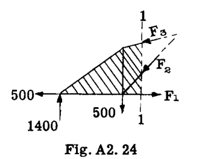

$$ \text{したがって } \Sigma M_O = 1400 \times 30 - 18.97 F_3 = 0 $$

$$ \text{したがって } F_3 = \frac{42000}{18.97} = 2215 \text{ lb 圧縮（想定通り）} $$

モーメント中心  $O$  から力  $F_3$  までのアームを求めるには少量の計算が必要であるため、一般的には、未知の力をその作用線上の点において  $H$  および  $V$  成分に分解し、これら成分の一方がモーメント中心を通り、他方の成分のアームが通常検査によって決定できるようにする方が単純である。したがって、図 A2.25 において、力  $F_3$  は点  $O'$  において成分  $F_3V$  および  $F_3H$  に分解される。その後、以前と同様に点  $O$  まわりのモーメントをとる。

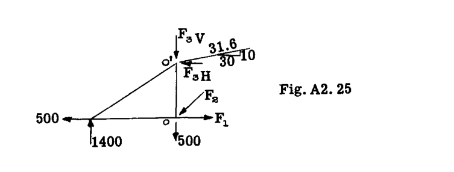

$$ \Sigma M_O = 1400 \times 30 - 20 F_3H = 0 $$

したがって、 $F_3H = 2100$  lb であり、したがって

$$ F_3 = 2100 (31.6/30) = 2215 \text{ lb（以前と同様）} $$

荷重  $F_1$  は、力  $F_2$  と  $F_3$  の交点である点  $m$  まわりのモーメントをとることで求められる（図 A2.23 参照）。

$$ \Sigma M_m = 1400 \times 60 + 500 \times 30 - 500 \times 30 - 30 F_1 = 0 $$

したがって、 $F_1 = 2800$  lb（引張と想定）。

力  $F_2$  をモーメント方程式を使用して求めるために、力  $F_1$  と  $F_3$  の交点である点  $(r)$  まわりのモーメントをとる（図 A2.26 参照）。点  $(r)$  から  $F_2$  の作用線までの垂直距離を求めることを避けるために、 $F_2$  を図 A2.26 に示すように、その作用線上の点  $O$  において  $H$  および  $V$  成分に分解する。

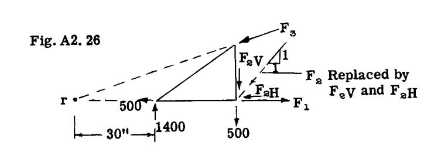

$$ \Sigma M_r = - 1400 \times 30 + 500 \times 60 + 60 F_2V = 0 $$

したがって、 $F_2V = 12000/60 = 200$  lb。

したがって、 $F_2 = 200 \times \sqrt{2} = 282$  lb（圧縮）。

#### A2.11 せん断法 (Method of Shears)

図 A2.22 において、部材  $F_4$  内の応力を求めるために、図 A2.27 に示す左側部分を与える断面 2-2 を切断する。

節点法は、未知数  $F_5$  および  $F_6$  の交点が無限遠にあるため、部材  $F_4$  を解くには十分ではない。したがって、3 つの切断部材のうち 2 つが平行である条件に対しては、トラスのウェブ部材を解くための、一般にせん断法（Method of shears）、または 2 つの平行な未知の弦部材に対して垂直なすべての力の合計がゼロに等しくなければならないという方法がある。平行な弦部材はその作用線に垂直な方向の成分を持たないため、上記の平衡方程式には入らない。

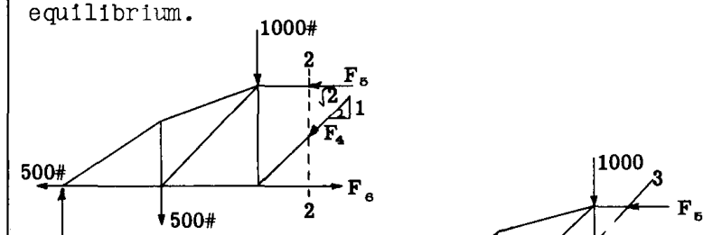

図 A2.27 を参照して、

$$ \Sigma V = 1400 - 500 - 1000 - F_4 (1/\sqrt{2}) = 0 $$

したがって、 $F_4 = - 141$  lb（想定とは逆の向き、すなわち引張の代わりに圧縮）。

部材  $F_7$  内の応力を求めるために、図 A2.22 の断面 3-3 を切断し、図 A2.28 に左側部分の自由体図を描く。 $F_1$  および  $F_8$  は水平であるため、部材  $F_7$  はこの断面におけるトラス上のせん断を担わなければならず、ゆえにせん断法という名称がついている。

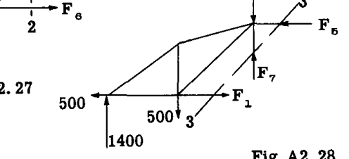

$$ \Sigma V = 1400 - 500 - 1000 + F_7 = 0 $$

したがって、 $F_7 = 100$  lb（想定通りの圧縮）。

注：学生は、これら例示的な例で使用された左側部分の代わりに、切断断面の右側のトラス部分を自由体として使用して、モーメント法およびせん断法を示すこの例題を解くべきである。トラス内の応力を最も有利に解決するために、通常、各手法には特定のケースや部材に対して利点があるため、上記の 3 つの手法のうち複数を組み合わせて使用する。それぞれの方法が断面法（Method of sections）であることを認識することが重要であり、平行弦を持つトラスのように多くの場合、平衡方程式を書き留めることなく暗算で応力を求めることができる。平行弦トラスについては、一般的に以下の記述が当てはまる。

(1) パネル対角部材の応力の垂直成分は、パネル上の垂直せん断（パネルの一方の側にある外力の代数和）に等しい。なぜなら、弦部材は水平であり、したがって垂直成分を持たないからである。

(2) トラスの垂直部材は、一般に、対角部材の垂直成分に、垂直部材の端部ジョイントに加えられる任意の外部荷重を加えたものに抵抗する。

(3) 弦部材内の荷重は、対角部材の水平成分によるものであり、一般に、これらの水平成分の総和に等しい。

平行弦トラスにおける部材応力の決定を単純化して説明するために、図 A2.29 の片持ちトラスを考え、点  $A$  および  $J$  における支持反力を伴うものとする。

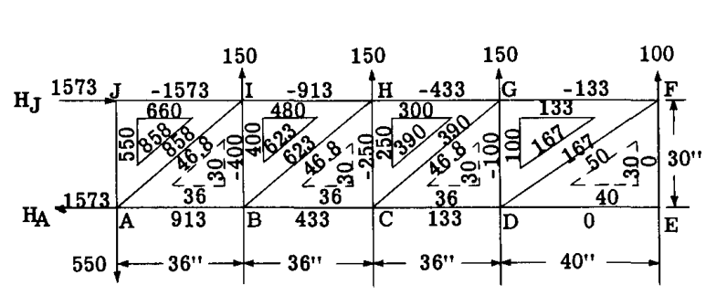

まず、点線で示されているように、トラスの各パネルにおける長さの三角形（Length triangles）を計算する。各パネル内の他の三角形は荷重三角形または指標三角形（Index triangles）と呼ばれ、その辺は長さの三角形の辺に直接比例する。

各パネル内のせん断荷重は、まず各指標三角形の垂直辺に書き込まれる。したがって、パネル  $EFGD$  において、パネルを横切る垂直断面の右側の力を考慮すると、せん断は 100 lb であり、これは指標三角形の垂直辺に記録される。

右から 2 番目のパネルについては、せん断は  $100 + 150 = 250$  であり、3 番目のパネルについては  $100 + 150 + 150 = 400$  lb、同様に 4 番目のパネルについては 550 lb となる。

対角部材内の荷重およびその水平成分は、長さの三角形の対角線および水平辺の長さに直接比例する。したがって、対角部材  $DF$  内の荷重は  $100 (50/30) = 167$  であり、部材  $CG$  の荷重は  $250 (46.8/30) = 390$  である。部材  $DF$  内の荷重の水平成分は  $100 (40/30) = 133$  であり、 $CG$  については  $250 (36/30) = 300$  である。これらの値は、図 A2.29 に示されるように各トラスパネルの指標三角形上に示されている。我々は、ジョイント  $E$  を最初に考慮することによって、トラスの部材内の荷重の解析を開始する。

 $\Sigma V = 0$  を用いると、ジョイント  $E$  に外部垂直荷重が存在しないため、観察により  $EF = 0$  となる。同様に、 $\Sigma H = 0$  という同じ推論により、部材  $DE$  内の荷重  $= 0$  となる。対角部材  $FD$  内の荷重は、パネルの指標三角形の対角線の値、すなわち 167 lb に等しい。パネルの右側のせん断が上向きであり、対角部材  $FD$  の垂直成分が平衡のために下向きに引かなければならないため、観察によりそれは引張である。

ジョイント  $F$  を考えると、 $\Sigma H = - FG - FD_H = 0$  であり、これは対角部材  $DF$  内の荷重の水平成分が部材  $FG$  内の荷重に等しいか、または指標三角形の水平辺の値、すなわち - 133 lb に等しいことを意味する。 $DF$  の水平成分がジョイント  $F$  を引いているため、 $FG$  は平衡のためにジョイントに対して押さなければならず、ゆえにマイナスである。

ジョイント  $D$  を考えると、

 $\Sigma V = DF_V + DG = 0$  であるが、 $DF_V = 100$ （指標三角形の垂直辺）である。
 $\therefore DG = - 100$ 
 $\Sigma H = DE + DF_H - DC = 0$  であるが、 $DE = 0$  かつ  $DF_H = 133$ （指標三角形から）である。
 $\therefore DC = 133$ 

ジョイント  $G$  を考えると、

 $\Sigma H = - GH + GF - GC_H = 0$  であるが、 $GF = - 133$  であり、第 2 パネルの指標三角形から  $GC_H = 300$  である。
したがって、 $GH = - 433$  lb。この方法で進めると、図 A2.29 に示されるようにすべての部材の応力が得られる。すべての平衡方程式は、計算尺での計算と共に行い、暗算で解くことができ、すべての部材荷重はトラス図面上に直接書き込むことができる。

図 A2.29 の結果を観察すると、トラス垂直部材内の荷重は指標荷重三角形の垂直辺の値に等しく、トラス対角部材内の荷重は指標三角形の対角線の値に等しく、一般に上部および下部の水平トラス部材内の荷重は指標三角形の水平辺の値の合計に等しいことがわかる。

点  $A$  および  $J$  における反力は、上記の手順がジョイント  $A$  および  $J$  に到達したときに求められる。作業のチェックとして、トラス全体を 1 つのユニットとして扱って反力を決定すべきである。

図 A2.30 は、対称的に荷重を受けた単純支持のプラットトラス（Pratt Truss）の応力の解法を示している。すべてのパネルが同じ幅と高さを持つため、示されているように長さの三角形は 1 つだけ描かれる。対称性のため、指標三角形はトラスの中心線の片側のパネルに対してのみ描かれている。まず、各パネル内の垂直せん断が各指標三角形の垂直辺に書き込まれる。トラスの対称性と、外部荷重の半分がジョイント  $U_3$  および  $L_3$  で支持され、残りの半分が反力  $R_1$  および  $R_2$  で支持されていることがわかっているため、中央パネルのせん断  $= (100 + 50) 1/2 = 75$  である。パネル  $U_1U_2L_1L_2$  の垂直せん断は、75 に  $U_2$  および  $L_2$  における外部荷重を加えたもの、すなわち合計 225 であり、同様に端部パネルのせん断  $= 225 + 50 + 100 = 375$  である。これらの値がわかれば、指標三角形の他の 2 辺は各パネルの長さの三角形の辺に直接比例し、その結果は図 A2.30 に示される通りになる。

この点からの一般的な手順は、対角部材内の荷重を求め、次に垂直部材、そして最後に水平弦部材内の荷重を求めることである。

対角部材内の荷重は、指標三角形の斜辺の値に等しい。向きは、引張か圧縮かに関わらず、トラスを精神的に切断し、対角部材の垂直成分によってバランスをとらなければならない外部せん断荷重の方向を記録することによって、検査によって決定される。

垂直部材内の荷重は、節点法によって決定され、ジョイントの順序は、垂直部材内の応力が検討中のジョイントの方程式  $\Sigma V = 0$  において唯一の未知数となるように選択される。

したがって、ジョイント  $U_3$  については、 $\Sigma V = - 50 - U_3L_3 = 0$  または  $U_3L_3 = - 50$  である。

ジョイント  $U_2$  については、 $\Sigma V = - 50 - U_2L_3V - U_2L_2 = 0$  であるが、 $U_2L_3V = 75$ （指標三角形からの  $U_2L_3$  の垂直成分）である。 $\therefore U_2L_2 = - 50 - 75 = - 125$ 。ジョイント  $L_1$  については、 $\Sigma V = - 100 + L_1U_1 = 0$  であり、したがって  $L_1U_1 = 100$  である。

水平弦部材は、トラスの対角部材の水平成分のためにジョイントで荷重を受けるため、 $L_0$  から始めて、これらの水平成分を足し合わせて弦応力を得ることができる。したがって、 $L_0L_1 = 312$ （指標三角形から）。 $L_1L_2 = 312$ （ジョイント  $L_1$  の  $\Sigma H = 0$  より）。ジョイント  $U_1$  において、対角部材の水平成分  $= 312 + 187.5 = 499.5$  である。したがって、 $U_1U_2$  内の荷重  $= - 499.5$  である。同様に、ジョイント  $L_2$  において、 $L_2L_3 = 312 + 187.5 = 499.5$  である。ジョイント  $U_2$  において、 $U_1U_2$  および  $U_2U_3$  の水平成分  $= 499.5 + 62.5 = 562$  であり、これは部材  $U_2U_3$  内の - 562 によってバランスをとらなければならない。

反力  $R_2$  は、端部パネルの指標三角形の垂直辺の値、すなわち 375 に等しい。これは、トラス全体を考慮し、  $R_2$  まわりのモーメントをとることでチェックされるべきである。

トラスが非対称に荷重されている場合は、まず反力を決定し、その後、端パネルから始めて指標三角形を描くことができる。パネルのせん断はそこから容易に計算できるからである。

### A2.12 航空機の翼構造。布またはプラスチックカバー付きトラスタイプ

金属で覆われた片持ち翼は、全体的な空気力学的効率が高く、十分なねじり剛性を持っているため、図 A2.31 および 32 の航空機に示されているような低速の商業用または個人のパイロット用航空機を除いて、外部ブレース付きの翼に取って代わられた。翼の被覆は通常布であり、したがって翼の中にドラッグトラス（Drag truss）を設けてドラッグ方向の荷重に抵抗する必要がある。図 A2.33 および 34 は、そのような翼の一般的な構造レイアウトを示している。2 つの桁または梁は金属または木材である。各ドラッグトラスベイでダブルワイヤーを使用する代わりに、引張または圧縮荷重のいずれかを受けることができる単一の対角ストラットを使用することもできる。外部ブレース・ストラットは流線型のチューブである。

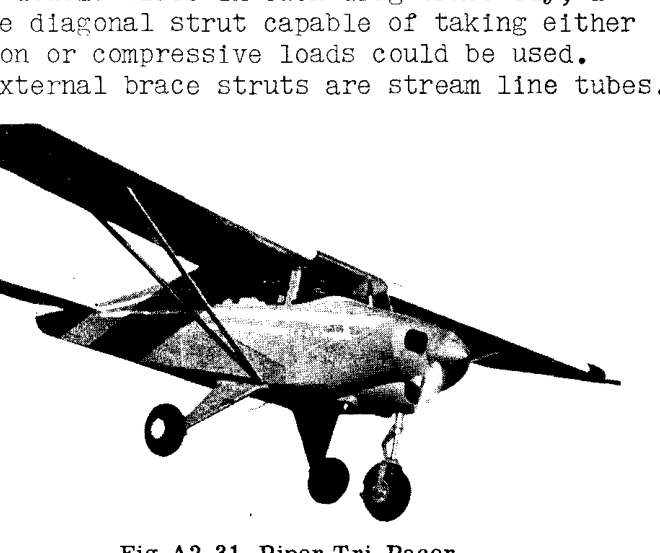
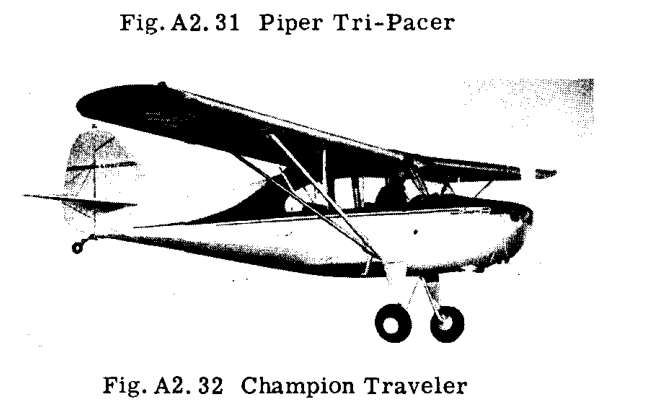

#### 例題10 外部ブレース付き単葉機主翼構造

図 A2.35 は、外部ブレース付き単葉翼の構造寸法図を示している。翼は翼桁の間に布で覆われており、したがってストラットとタイロッドで構成されるドラッグトラスが、ドラッグ方向の強度と剛性を提供するために必要である。揚力およびドラッグトラスのすべての部材内の軸方向荷重が決定される。この問題の目的は、学生に静定空間トラス構造を解く練習をさせることであるため、簡略化された空気荷重が想定される。

**想定される空気荷重**:

(1) ヒンジからストラットポイントまで 1 インチあたり 45 lb の一定の翼幅方向揚力荷重、その後翼端で 22.5 lb/in までテーパー状になる。

(2) 1 インチあたり 6 lb の前方一定分布ドラッグ荷重。

上記の空気荷重は、高迎角状態を表している。この状態では、図 A2.36 に示されるようにドラッグトラス上に前方荷重をかけることができる。揚力とドラッグの力をドラッグトラスの方向に投影すると、揚力による前方投影は空気ドラッグによる後方投影よりも大きく、その差がこの例題では 6 lb/in と想定されている。低迎角状態では、ドラッグトラス方向の荷重は後方に作用する。

**解法**:

フロントおよびリアビーム（前桁および後桁）にかかる走行荷重が、解法の第一歩として計算される。飛行条件として、空気力の風圧中心は図 A2.37 に示される通り想定される。

フロントビーム上の走行荷重は  $45 \times 24.2/36 = 30.26$  lb/in であり、残りの  $45 - 30.26 = 14.74$  lb/in がリアビーム上の荷重となる。

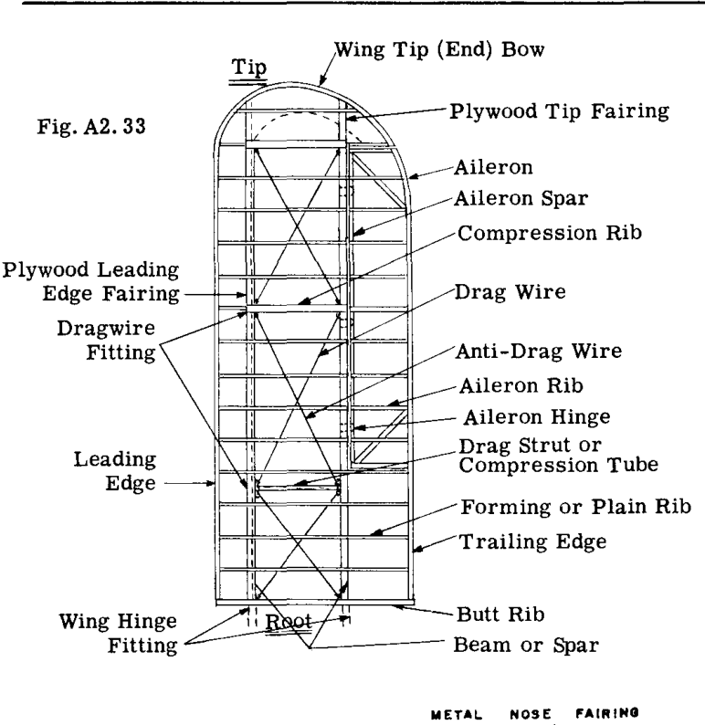
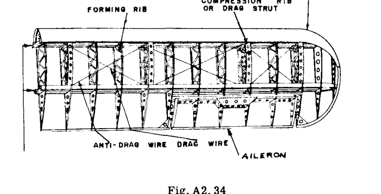
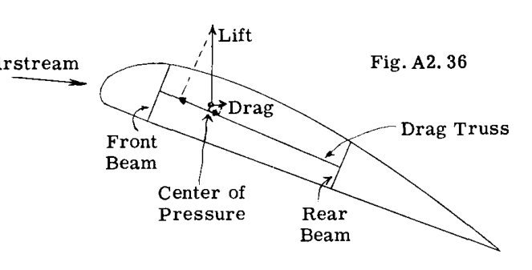
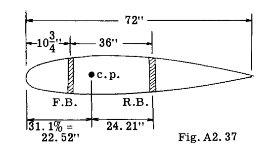
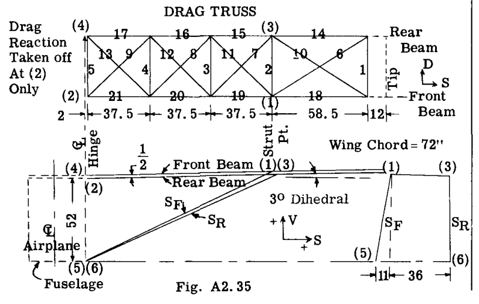

トラス内の荷重を節点法で解くには、すべての荷重をトラスジョイントに伝達しなければならない。翼桁は、一端が機体で、外側が 2 つの揚力ストラットによって支持されている。したがって、各ビーム上の走行揚力荷重により、ストラットおよびヒンジ点における各ビームの反力を計算する。

**フロントビーム (Front Beam)**

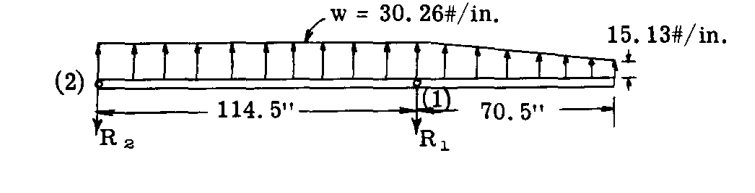

点 (2) まわりのモーメントをとる。

$$ 114.5 R_1 - 114.5 \times 30.26 \times 114.5/2 - 15.13 \times 70.5 \times 149.75 - 15.13 \times 35.25 \times 138 = 0 $$

したがって、 $R_1 = 3770$  lb。

 $\Sigma V = 0$  をとる。ここで  $V$  方向は梁に垂直にとる。

$$ \Sigma V = - R_2 - 3770 + 30.26 \times 114.5 + \frac{(30.26 + 15.13)}{2} \times 70.5 = 0 $$

したがって、 $R_2 = 1295$  lb。

（学生は、常に結果を確認するために、点 (1) まわりのモーメントをとって  $\Sigma M_1 = 0$  かどうかを確認すべきである。）

**リアビーム (Rear Beam)**

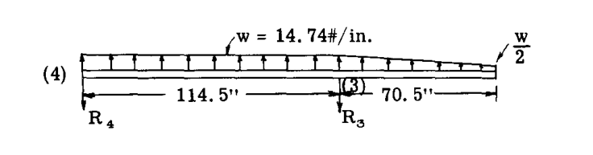

リアビームはフロントビームと同じスパン寸法を持つが、荷重は 14.74 lb/in である。したがって、梁の反力  $R_4$  および  $R_3$  は、フロントビームのそれらの  $14.74/30.26 = 0.4875$  倍となる。

したがって、 $R_3 = 0.4875 \times 3770 = 1838$  lb、および  $R_4 = 0.4875 \times 1295 = 631$  lb である。

解法の次のステップは、すべての部材の軸方向荷重を解くことである。節点法を使用し、次の列のトップに図示されているような 3 つのトラスシステム（前部揚力トラス、後部揚力トラス、およびドラッグトラス）で構成される構造を検討する。梁は揚力トラスとドラッグトラスの両方に共通である。

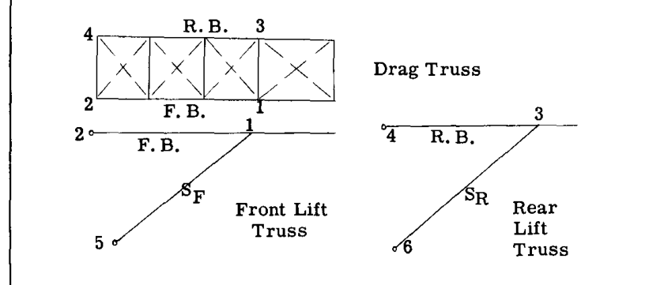

表 A2.1 は、図 A2.35 に示される情報から決定された揚力トラス部材の  $V, D, S$  投影を示している。部材の真の長さ  $L$  と成分比は、単純な計算によって求められる。

**表 A2.1**  
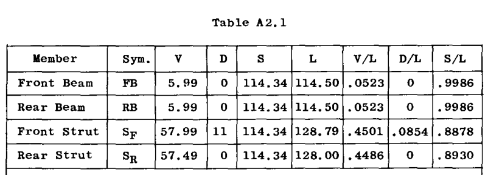

ジョイント (1) から始めて、ジョイントの解法を開始する。ジョイント (1) の自由体図を以下にスケッチする。すべての部材は、各端にピンを持つ二力部材と見なされ、したがって大きさだけが各部材荷重の唯一の未知の特性である。ジョイント (1) に入るドラッグトラス部材は、 $D_1$  と呼ばれる単一の反力に置き換えられる。 $D_1$  が求められた後、ドラッグトラス全体が処理されるときに、ドラッグトラス部材に荷重を引き起こすその影響を求めることができる。ジョイントの解法において、ドラッグトラスはドラッグ方向に平行であると想定されているが、これは図 A2.35 からは正確ではないが、部材荷重への誤差は無視できる。

**ジョイント 1 (平衡方程式)**

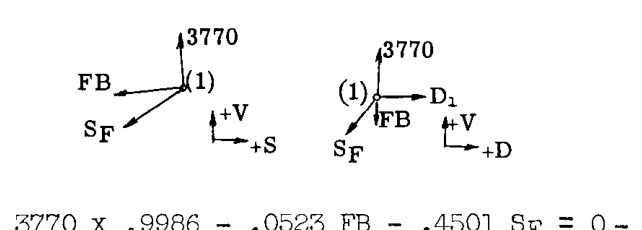

$$ \Sigma V = 3770 \times 0.9986 - 0.0523 FB - 0.4501 SF = 0 - - - (1) $$
$$ \Sigma S = - 3770 \times 0.0523 - 0.9986 FB - 0.8878 SF = 0 - - - (2) $$
$$ \Sigma D = - 0.0854 SF + D_1 = 0 - - - - - - - - - - - (3) $$

方程式 (1), (2), (3) を解くと、以下が得られる。

$$ FB = - 8513 \text{ lb（圧縮）} $$
$$ SF = 9333 \text{ lb（引張）} $$
$$ D_1 = 798 \text{ lb（後方へ）} $$