# A2.11  

$$
\Sigma H = (-1250) (30/50) - 1875 (30/50) - U_1 U_2 = 0
$$

ゆえに、 $U_1 U_2 = -1875$  lb. または想定とは逆の向き、したがって圧縮である。  

注：学生は、これに続く節点へと作業を継続すべきである。この片持ちトラスの例では、未知数が2つしかない節点として節点  $L_3$  を選択することが可能であったため、反力を求める必要はなかった。図 A2.22 に示されるようなトラスでは、最初に反力  $R_1$  または  $R_2$  を求める必要があり、それによって2つの未知の力のみを含む反力点における節点が提供される。  

  

## A2.10 モーメント法  

同一平面上の非平行力系に対して、3つの静力学方程式が利用可能である。これら3つの方程式は、3つの異なる点に関するモーメント方程式として採用することができる。図 A2.22 は典型的なトラスを示している。部材  $F_1, F_2, F_3, F_4, F_5, F_6$  の荷重を求めることが要求されているとする。  

  

解法の第一歩は、点AとBにおける反力を求めることである。点Bのローラー型の支持のため、点Bにおける反力で未知な要素はその大きさのみである。点Aでは、反力の大きさと方向が未知であり、利用可能な3つの静力学方程式に対して合計3つの未知数が存在する。便宜上、点Aにおける未知の反力は、その未知の H 成分および V 成分に置き換えられている。  

点 A に関するモーメントをとると、  

$$
\Sigma M_A = 500 \times 30 + 1000 \times 60 + 1000 \times 90 + 500 \times 30 + 500 \times 120 - 150 V_B = 0
$$

ゆえに  $V_B = 1600$  lb. である。  

 $\Sigma V = 0$  とすると、  

$$
\Sigma V = V_A - 1000 - 1000 - 500 - 500 + 1600 = 0
$$

したがって  $V_A = 1400$  lb. である。  

 $\Sigma H = 0$  とすると、  

$$
\Sigma H = 500 - H_A = 0
$$

したがって  $H_A = 500$  lb. である。  

すべての未知数の代数符号が正となったため、図 A2.22 に示された想定された方向は正しかった。  

 $\Sigma M_B = 0$  をとることによって結果を確認する。  

$$
\Sigma M_B = 1400 \times 150 + 500 \times 30 - 500 \times 120 - 500 \times 30 - 1000 \times 90 - 1000 \times 60 = 0 \text{ (確認)}
$$

部材  $F_1, F_2, F_3$  の応力を決定するために、トラスを断面 1-1 で切断する（図 A2.22）。図 A2.23 は、この断面の左側のトラス部分の自由体図を示している。  

  
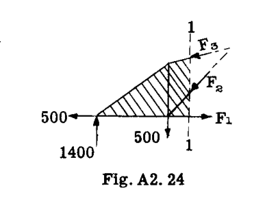  

トラス全体は平衡状態にある。したがって、いかなる部分も平衡状態でなければならない。図 A2.23 において、トラス全体に存在していた部材  $F_1, F_2, F_3$  の内部応力は、他の荷重や反力と組み合わせて断面 1-1 の左側の部分を平衡に保つための外力とみなされる。図 A2.23 の部材  $a$  と  $b$  は切断されていないため、これらの部材の荷重は内部応力のままであり、示されているトラス部分の平衡には影響を与えない。したがって、図 A2.24 に示されているように、断面 1-1 の左側の部分は  $F_1, F_2, F_3$  の値に影響を与えることなく、1つの固体ブロックとみなすことができる。モーメント法は、その名が示す通り、特定の部材の荷重を見つけるためにある点に関するモーメントをとる操作を含む。3つの未知数があるため、選択されたモーメント中心に対して、2つの未知の応力のモーメントがそれぞれゼロになるようにモーメント中心を選択しなければならず、これにより、モーメントの方程式に入る未知の力または応力は1つだけになる。例えば、図 A2.24 の荷重  $F_3$  を決定するために、力  $F_1$  と  $F_2$  の交点、すなわち点 O に関するモーメントをとる。  

したがって、  

$$
\Sigma M_O = 1400 \times 30 - 18.97 F_3 = 0
$$

ゆえに  

$$
F_3 = \frac{42000}{18.97} = 2215 \text{ lb. 圧縮（または想定通りに作用）}
$$

モーメント中心 O から力  $F_3$  までの腕を求めるには少量の計算が必要であるため、一般的には、未知の力をその作用線上の1点において H 成分と V 成分に分解し、これらの成分の一方がモーメント中心を通り、もう一方の成分の腕が通常は目視で決定できるようにする方が簡単である。  

# A2.12 力系の平衡、トラス構造  

図 A2.25 では、力  $F_3$  は点 O' においてその成分  $F_{3V}$  と  $F_{3H}$  に分解されている。そして、以前と同様に点 O に関するモーメントをとると：  

$$
\Sigma M_O = 1400 \times 30 - 20 F_{3H} = 0
$$

ゆえに、 $F_{3H} = 2100$  lb. であり、したがって  

$$
F_3 = 2100 (31.6 / 30) = 2215 \text{ lb.（以前に得られた値と同様）}
$$

荷重  $F_1$  は、力  $F_2$  と  $F_3$  の交点である点  $m$  に関するモーメントをとることで求めることができる（図 A2.23 参照）。  

$$
\Sigma M_m = 1400 \times 60 + 500 \times 30 - 500 \times 30 - 30 F_1 = 0
$$

ゆえに、 $F_1 = 2800$  lb.（想定通りの引張）  

モーメント方程式を用いて力  $F_2$  を求めるために、力  $F_1$  と  $F_3$  の交点である点 (r) に関するモーメントをとる（図 A2.26 参照）。点 (r) から  $F_2$  の作用線までの垂直距離を求めることを避けるため、 $F_2$  を図 A2.26 に示すように、その作用線上の点 O において H 成分と V 成分に分解する。  

$$
\Sigma M_r = - 1400 \times 30 + 500 \times 60 + 60 F_{2V} = 0
$$

ゆえに、 $F_{2V} = 12000 / 60 = 200$  lb.  

したがって  $F_2 = 200 \times \sqrt{2} = 282$  lb. 圧縮  

## A2.11 せん断法 (Method of Shears)  

図 A2.22 において、部材  $F_4$  の応力を求めるために、断面 2-2 で切断し、図 A2.27 に示すように左側部分の自由体図を得る。  

モーメント法は、他の2つの未知数  $F_5$  と  $F_6$  の交点が無限遠にあるため、部材  $F_4$  を解くには十分ではない。したがって、3つの切断された部材のうち2つが平行であるような状況では、トラスのウェブ部材を解くための一般に「せん断法」と呼ばれる方法、あるいは2つの平行な未知の弦材に垂直なすべての力の合計がゼロに等しくなければならないという方法がある。平行な弦材は、その作用線に垂直な方向の成分を持たないため、上記の平衡方程式には入らない。  

  
  
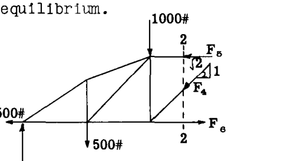  
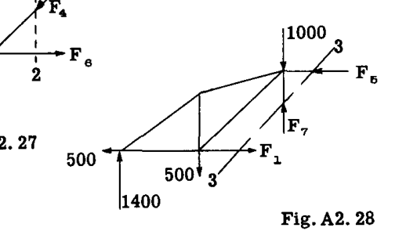  

図 A2.27 を参照すると  

$$
\Sigma V = 1400 - 500 - 1000 - F_4 (1 / \sqrt{2}) = 0
$$

ゆえに  $F_4 = - 141$  lb.（引張、または図で想定したのと逆の向き）  

部材  $F_7$  の応力を求めるために、図 A2.22 の断面 3-3 で切断し、図 A2.28 に左側部分の自由体図を描く。 $F_3$  と  $F_6$  は水平であるため、部材  $F_7$  がこの断面 3-3 におけるトラスのせん断力を負担しなければならない。ゆえに、せん断法という名前がついている。  

$$
\Sigma V = 1400 - 500 - 1000 + F_7 = 0
$$

ゆえに  $F_7 = 100$  lb.（想定通りの圧縮）  

注：学生は、これらの例題で使用された左側部分の代わりに、切断断面の右側部分を自由体として使用して、モーメント法とせん断法を説明するこの例題を解くべきである。トラスの部材の応力を最も有利に解くためには、通常、上記の3つの方法のうち複数を使い分ける。それぞれに、特定のケースや部材に対する利点があるからである。それぞれが断面法であり、多くの場合、例えば平行弦トラスなどでは、平衡方程式を書き出すことなく、頭の中で実質的に応力を見つけることができることを認識することが重要である。平行弦トラスについては、一般に以下の記述が真である。  

(1) パネルの斜材の応力の垂直成分は、パネル上の垂直せん断力（パネルの一方の側に対する外力の代数和）に等しい。なぜなら弦材は水平であり、したがって垂直成分がゼロであるからである。  

(2) トラスの垂直材は、一般に、斜材の垂直成分に、垂直材の端の節点に加えられた外力を加えたものに抵抗する。  

(3) 弦材の荷重は斜材の水平成分によるものであり、一般にこれらの水平成分の総和に等しい。  

平行弦トラスの部材の応力を決定する簡便さを説明するために、図 A2.29 の片持ちトラスを考え、A点とJ点に支持反力があるものとする。  

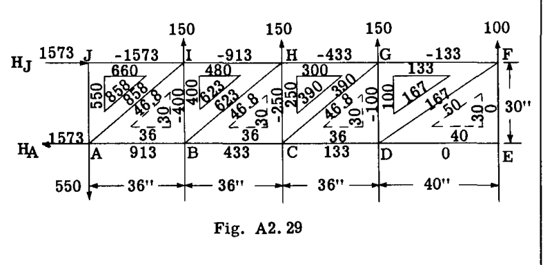  

まず、図に破線の三角形で示されているように、トラスの各パネルにおける長さの三角形を計算する。各パネルにおける他の三角形は、荷重または指標三角形（index triangles）と呼ばれ、それらの辺は長さの三角形の辺に直接比例する。  

各パネルのせん断荷重は、まず各指標三角形の垂直辺に書き込まれる。したがって、パネル EFGD において、パネルを切断する垂直断面の右側の力を考慮すると、せん断力は 100 lb. であり、これは指標三角形の垂直辺に記録される。  

自由端から2番目のパネルについては、せん断力は  $100 + 150 = 250$  であり、3番目のパネルについては  $100 + 150 + 150 = 400$  lb.、同様にして4番目のパネルについては 550 である。  

斜材の荷重およびその水平成分は、長さの三角形の斜辺および水平辺の長さに直接比例する。したがって、斜材 DF の荷重は  $100 (50/30) = 167$  であり、部材 CG の荷重は  $250 (46.8/30) = 390$  である。DF の荷重の水平成分は  $100 (40/30) = 133$  であり、CG は  $250 (36/30) = 300$  である。これらの値は、図 A2.29 に示すように、各トラスパネルの指標三角形に示されている。節点 E を最初に考慮することにより、トラス部材の荷重の解析を開始する。  

 $\Sigma V = 0$  を用いると、観察により  $EF = 0$  となる。これは節点 E に外力の垂直荷重が存在しないためである。同様に、 $\Sigma H = 0$  についても同じ理由で、部材 DE の荷重は 0 となる。斜材 FD の荷重はパネル指標三角形の斜辺の値、すなわち 167 lb. に等しい。観察により、パネルの右側のせん断力は上向きであり、斜材 FD の垂直成分は平衡のために下向きに引かなければならないため、これは引張である。  

節点 F を考慮すると、 $\Sigma H = - FG - FD_H = 0$  であり、これは斜材 DF の荷重の水平成分が部材 FG の荷重に等しいか、指標三角形の水平辺の値、すなわち - 133 lb. に等しいことを意味する。DF の水平成分が節点 F を引いているため、FG は平衡のために節点に対して押さなければならず、したがって負（圧縮）である。  

節点 D を考慮すると：  

 $\Sigma V = DF_V + DG = 0$  であるが、 $DF_V = 100$ （指標三角形の垂直辺）である。  
 $\therefore DG = - 100$   
 $\Sigma H = DE + DF_H - DC = 0$  であるが、 $DE = 0$  および  $DF_H = 133$ （指標三角形より）である。  
 $\therefore DC = 133$   

節点 G を考慮すると：  

 $\Sigma H = - GH + GF - GC_H = 0$  であるが、 $GF = - 133$ 、および2番目のパネルの指標三角形より  $GC_H = 300$  である。  
したがって  $GH = - 433$  lb. このように進めることで、図 A2.29 に示すように、すべての部材の応力が得られる。すべての平衡方程式は頭の中で解くことができ、計算は計算尺で行うことで、すべての部材荷重をトラス図に直接書き込むことができる。  

図 A2.29 の結果を観察すると、トラスの垂直材の荷重は指標荷重三角形の垂直辺の値に等しく、トラスの斜材の荷重は指標三角形の斜辺の値に等しく、一般に上弦材および下弦材の荷重は指標三角形の水平辺の値の総和に等しいことがわかる。  

反力 A および J は、上記の手順が節点 A および J に到達したときに求められる。作業の確認として、トラス全体を1つのものとして扱って反力を決定すべきである。  

図 A2.30 は、左右対称に荷重がかかった単純支持のプラットトラスの部材応力の解法を示している。すべてのパネルが同じ幅と高さを持つため、図に示すように、長さの三角形は1つだけ描かれる。対称性のため、指標三角形はトラスの中心線の一方の側のパネルに対してのみ描かれる。まず、各パネルの垂直せん断力を各指標三角形の垂直辺に書き込む。トラスの対称性および荷重により、節点  $U_3$  および  $L_3$  における外荷重の半分は反力  $R_1$  で支持され、1/2 は反力  $R_2$  で支持される。  

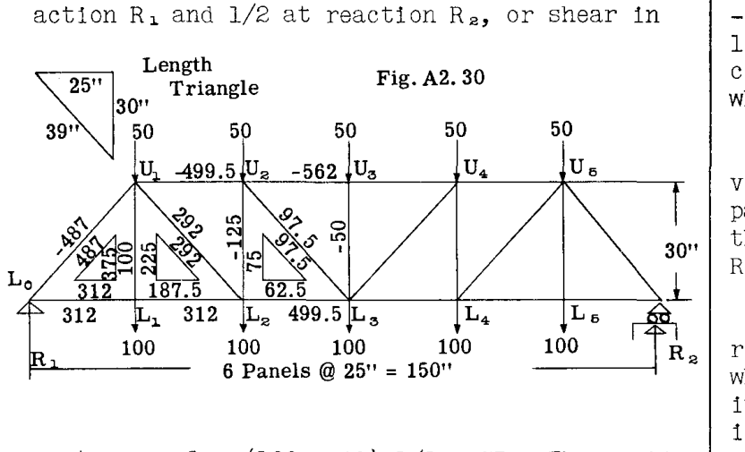  

中央パネルのせん断力  $= (100 + 50) 1/2 = 75$ 。パネル  $U_1 U_2 L_1 L_2$  の垂直せん断力は、75 に  $U_2$  と  $L_2$  における外荷重を加えたもの、すなわち合計 225 に等しく、同様に端部パネルのせん断力は  $= 225 + 50 + 100 = 375$  である。これらの値がわかれば、指標三角形の他の2辺は各パネルの長さの三角形の辺に直接比例し、その結果は図 A2.30 に示すようになる。  

この時点からの一般的な手順は、斜材の荷重を求め、次に垂直材、最後に水平弦材の荷重を求めることである。  

斜材の荷重は指標三角形の斜辺の値に等しい。引張か圧縮かの向きは、トラスの仮想的な断面を切り、斜材の垂直成分によって平衡を保たなければならない外力のせん断荷重の方向を注目することによって、目視で決定される。  

垂直材の荷重は節点法によって決定され、節点の順序は、検討対象の節点の方程式  $\Sigma V = 0$  において垂直部材の応力が唯一の未知数となるように選択される。  

したがって、節点  $U_3$  については、 $\Sigma V = - 50 - U_3 L_3 = 0$   
または  $U_3 L_3 = - 50$ 。  

節点  $U_2$  については、 $\Sigma V = - 50 - U_2 L_{3V} - U_2 L_2 = 0$  であるが、指標三角形より  $U_2 L_{3V} = 75$ （ $U_2 L_3$  の垂直成分）である。  
 $\therefore U_2 L_2 = - 50 - 75 = - 125$ 。  
節点  $L_1$  については、 $\Sigma V = - 100 + L_1 U_1 = 0$ 、ゆえに  $L_1 U_1 = 100$ 。  

水平弦材は、斜材の水平成分によって節点で荷重を受けるため、節点  $L_0$  から開始して、これらの水平成分を加算して弦応力を得ることができる。したがって、  
 $L_0 L_1 = 312$ （指標三角形より）。  
節点  $L_1$  について  $\Sigma H = 0$  より  $L_1 L_2 = 312$ 。  
節点  $U_1$  において、斜材の水平成分  $= 312 + 187.5 = 499.5$ 。したがって、部材  $U_1 U_2$  の荷重  $= - 499.5$ 。同様に節点  $L_2$  において、 $L_2 L_3 = 312 + 187.5 = 499.5$ 。節点  $U_2$  において、 $U_1 U_2$  と  $U_2 U_3$  の水平成分  $= 499.5 + 62.5 = 562$  であり、これは部材  $U_2 U_3$  において - 562 によって平衡が保たれなければならない。  

反力  $R_2$  は端部パネルの指標三角形の垂直辺の値、すなわち 375 に等しい。これはトラス全体を考え、 $R_2$  に関するモーメントをとることによって確認されるべきである。  

トラスに非対称に荷重がかかっている場合は、まず反力を決定し、その後、パネルのせん断力が容易に計算できるため、端部パネルから始めて指標三角形を描くことができる。  

## A2.12 航空機の翼構造。布またはプラスチックを被覆したトラス型。  

金属被覆の片持ち翼は、全体的な空気力学的効率が良く、十分なねじり剛性を持っているため、図 A2.31 および 32 に例示される低速の商用または個人用パイロット機を除いて、外部補強された翼にほぼ取って代わられた。翼の被覆は通常布製であり、したがって、翼内の抗力方向に荷重を抵抗するために抗力トラスが必要である。図 A2.33 および 34 は、そのような翼の一般的な構造配置を示している。2本の桁またはビームは金属または木製である。各抗力トラスベイに二重のワイヤを使用する代わりに、引張または圧縮荷重のいずれも受けることができる単一の斜めストラットを使用することもできる。外部の支柱（ストラット）は流線型の管である。  

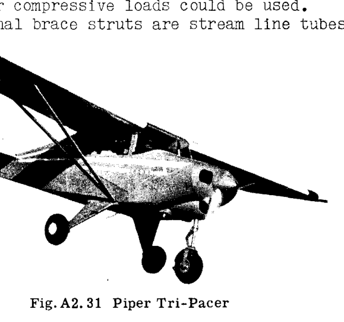  
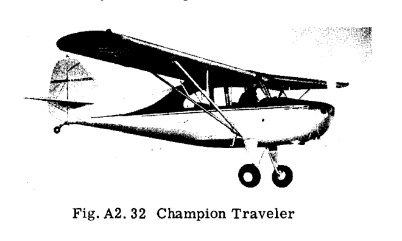  

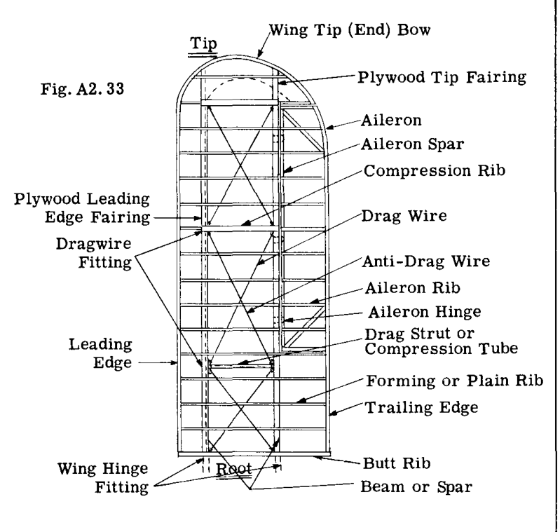  
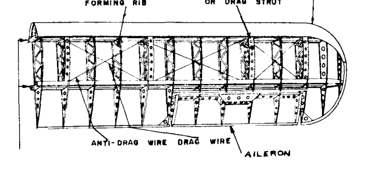  

### 例題 10. 外部補強型単葉機の翼構造  

図 A2.35 は、外部補強型単葉機翼の構造寸法図を示している。翼は翼桁の間に布が張られており、したがって、方向の強度と剛性を提供するためにストラットとタイロッドで構成される抗力トラスが必要である。揚力トラスおよび抗力トラスのすべての部材における軸方向の荷重が決定される。この問題の目的は、学生に静定空間トラス構造の解法の練習をさせることであるため、簡略化された空気荷重が想定される。  

想定される空気荷重：-  
(1) ヒンジから支柱点までは 45 lb./in. の一定の翼幅方向揚力荷重、その後、翼端に向かって 22.5 lb./in. までテーパー状に減少する。  
(2) 6 lb./in. の前方への一様な分布抗力荷重。  

上記の空気荷重は、高い迎角の状態を表している。この状態では、図 A2.36 に示されるように、抗力トラスに前方荷重がかかる可能性がある。揚力および抗力（空気抵抗）を抗力トラスの方向に投影すると、揚力による前方への投影成分の方が、空気抵抗による後方への投影成分よりも大きく、その差はこの例題では 6 lb./in. と想定されている。低い迎角の状態では、抗力トラス方向の荷重は後方に作用する。  

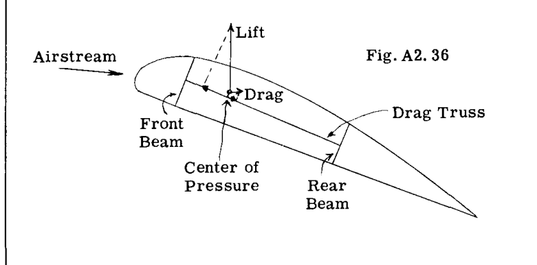  

### 解法：  

前後の桁にかかる等分布荷重が、解法の第一歩として計算される。今回の飛行条件については、空気力の圧力中心は図 A2.37 に示すように想定される。  

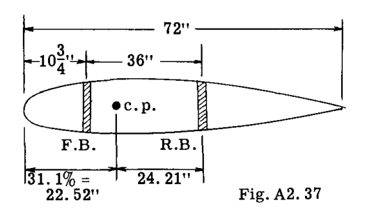  

前桁にかかる等分布荷重は  $45 \times 24.2 / 36 = 30.26$  lb./in. となり、残りの  $45 - 30.26 = 14.74$  lb./in. が後桁にかかる荷重となる。  

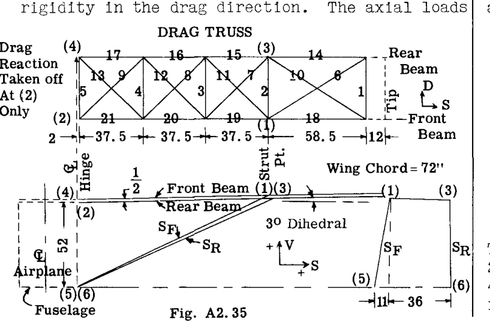  

トラス系の荷重を節点法で解くには、すべての荷重をトラスの節点に伝達しなければならない。翼桁は、一端が胴体で支持され、外側で2本の揚力支柱（リフトストラット）によって支持されている。したがって、各桁にかかる等分布揚力荷重による、支柱点およびヒンジ点における各桁の反力を計算する。  

### 前桁 (Front Beam)  

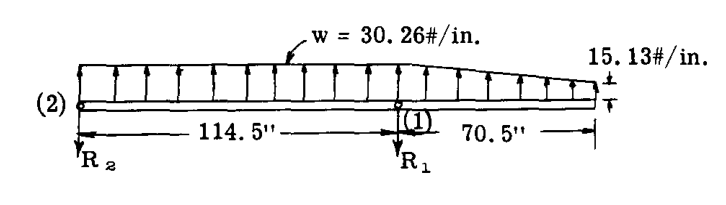  

点 (2) に関するモーメントをとると  

$$
114.5 R_1 - 114.5 \times 30.26 \times 114.5/2 - 15.13 \times 70.5 \times 149.75 - 15.13 \times 35.25 \times 138 = 0
$$

ゆえに  
 $R_1 = 3770$  lb.  

 $\Sigma V = 0$  とする（ただし、V 方向は桁に垂直な方向とする）  

$$
\Sigma V = - R_2 - 3770 + 30.26 \times 114.5 + \frac{(30.26 + 15.13)}{2} \times 70.5 = 0
$$

ゆえに  $R_2 = 1295$  lb.  

（学生は、 $\Sigma M_1 = 0$  となるかを確認するために、点 (1) に関するモーメントをとって結果を常に確認すべきである）  

### 後桁 (Rear Beam)  

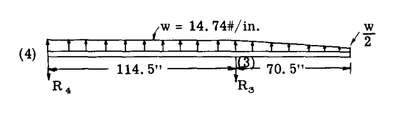  

後桁は前桁と同じスパン寸法を持つが、荷重は 14.74 lb./in. である。したがって、桁の反力  $R_3$  および  $R_4$  は、前桁の値の  $14.74 / 30.26 = 0.4875$  倍になる。  

ゆえに  $R_3 = 0.4875 \times 3770 = 1838$  lb.  
 $R_4 = 0.4875 \times 1295 = 631$  lb.  

解法の次のステップは、すべての部材の軸荷重を解くことである。節点法を用い、次の列の最上部に示されているように、3つのトラス系で構成された構造として考える。すなわち、前部揚力トラス、後部揚力トラス、および抗力トラスである。桁は揚力トラスと抗力トラスの両方に共通である。  

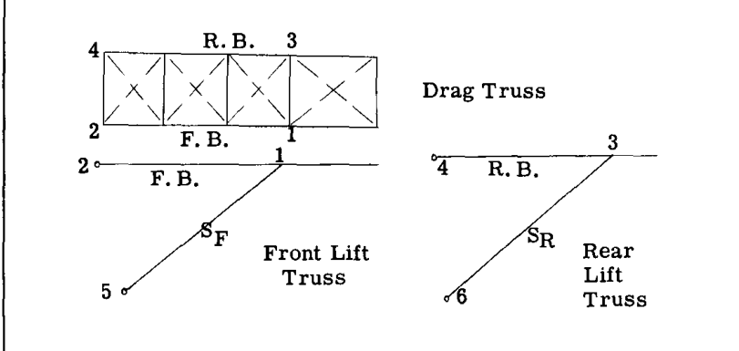  

表 A2.1 は、図 A2.35 に与えられた情報から決定された、揚力トラス部材の V、D、および S 投影成分を示している。部材の長さ L と成分比は、簡単な計算で求められる。  

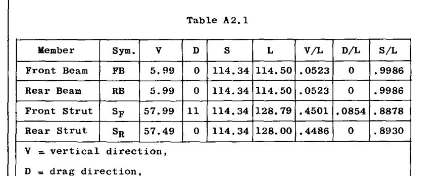  

V = 垂直方向、D = 抗力方向、S = 側面方向  
 $L = \sqrt{V^2 + D^2 + S^2}$   

節点 (1) から節点の解法を開始する。節点 (1) の自由体図を以下にスケッチする。すべての部材は2力部材、あるいは両端にピンを持つものとみなされ、したがってその大きさのみが各部材荷重の唯一の未知の特性である。節点 (1) に入ってくる抗力トラス部材は、 $D_1$  と呼ばれる単一の反力に置き換えられる。 $D_1$  が求められた後、抗力トラス全体が扱われるときに、抗力トラス部材に荷重を引き起こすその影響を求めることができる。節点の解法では、抗力トラスは抗力方向に平行であると想定されているが、これは図 A2.35 からは完全には正しくない。しかし、部材荷重の誤差は無視できる。  

節点 1（平衡方程式）  

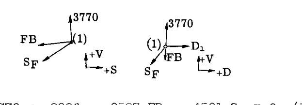  

$$
\Sigma V = 3770 \times 0.9986 - 0.0523 F_B - 0.4501 F_S = 0 \quad \cdots (1)
$$
$$
\Sigma S = - 3770 \times 0.0523 - 0.9986 F_B - 0.8878 F_S = 0 \quad \cdots (2)
$$
$$
\Sigma D = - 0.0854 F_S + D_1 = 0 \quad \cdots (3)
$$

方程式 (1)、(2)、(3) を解くと、以下が得られる：  

 $F_B = - 8513$  lb.（圧縮）  
 $F_S = 9333$  lb.（引張）  
 $D_1 = 798$  lb.（後方）