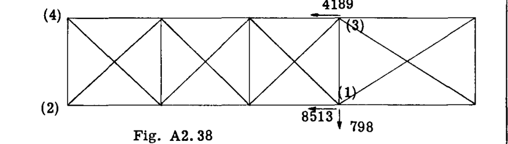
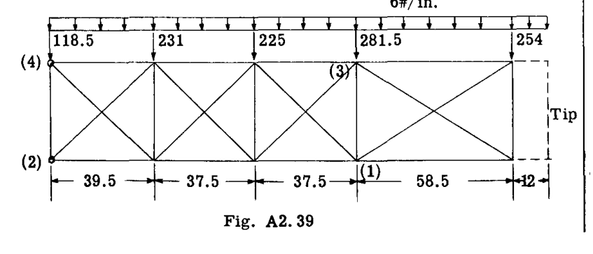
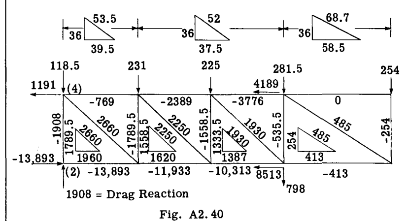
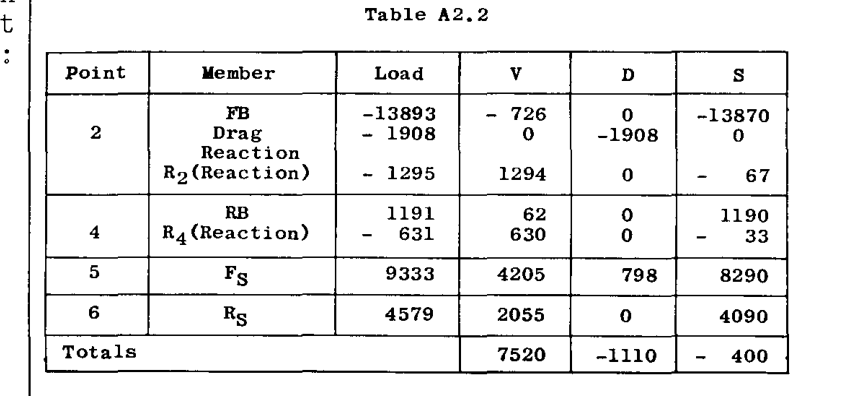
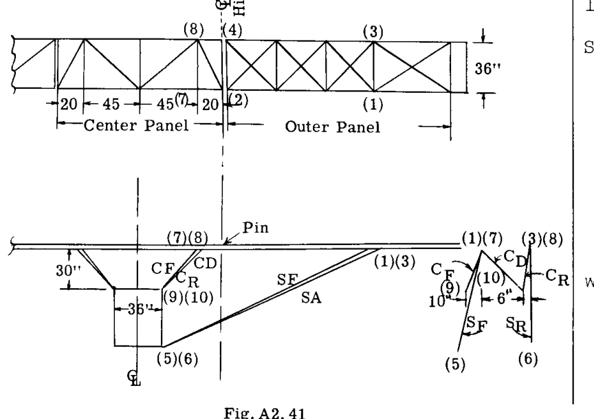
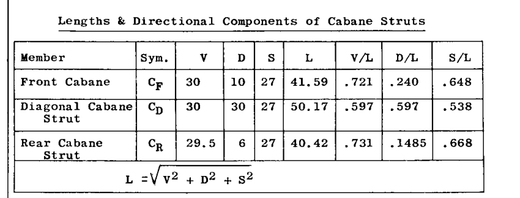
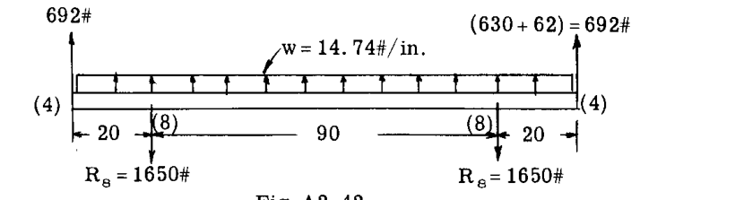

# A2.17  節点 (3) (平衡方程式)    $$ \Sigma V = 1838 \times .9986 - .0523 RB - .4486 SR = 0 \quad -(4) $$  $$ \Sigma S = -1838 \times .0523 - .9986 RB - .8930 SR = 0 \quad -(5) $$  $$ \Sigma D = D_3 + 0 = 0 \quad -(6) $$  方程式 (4), (5), (6) を解くと以下が得られる：   $RB = - 4189 lb.$  (圧縮)   $SR = 4579 lb.$  (引張)   $D_3 = 0$   Fig. A2.38 は、既述の通り、節点 (1) および (3) におけるドラッグトラス上のリフト支柱の反力を示している。    ## 空気力によるドラッグトラスのパネル点荷重  ドラッグ方向の空気荷重成分は、翼の前方に向かって  $6 lb./in.$  であると仮定された。   $6 lb./in.$  の分布荷重は、Fig. A2.39 に示すように、パネル点における集中荷重に置き換えられる。各パネル点は、オーバーハング翼端部分の影響を受ける外側の2つのパネル点を除き、分布荷重の半分を隣接するパネル点に伝える。  したがって、外側のパネル点集中荷重  $254 lb.$  は、次のように (3) より外側のドラッグ荷重の (3) まわりのモーメントをとることで決定される：  $$ P = 70.5 \times 6 \times 35.25 / 58.5 = 254 lb. $$  ドラッグトラスの解法を簡略化するため、内側パネルのドラッグストラットとドラッグワイヤは、節点 (2) および (4) で交差するように修正されている。この点におけるビームとフィッティングの設計では、当然ながら実際の偏心条件の影響を考慮すべきである。    ## ドラッグトラスにおける複合荷重  Fig. A2.38 と Fig. A2.39 の2つの荷重系を合算すると、Fig. A2.40 に示すように全ドラッグトラス荷重が得られる。得られた部材の軸応力は、指数応力法 (Art. A2.9) によって算出される。値はトラス図に示されている。  翼を胴体に取り付けるフィッティングの1つを、ドラッグ反力を胴体に伝達できないようにし、翼パネルからの全ドラッグ反力を1点に集中させることが一般的である。この例では、点 (2) がドラッグに抵抗する点として仮定されている。圧縮状態になるドラッグワイヤは、機能しないものと想定される。    # A2.18  ## 胴体反力  作業のチェックとして、また翼構造から胴体への基準荷重を得るために、胴体反力を外部から加えられる空気荷重に対して確認する。Table A2.2 は、計算結果を表形式で示している。    ## 外部から加えられる空気荷重：  V 成分  $= (3770 + 1295 + 1838 + 631) \times .9986 = 7523 lb.$  (誤差  $3 lb.$ )  D 成分  $= -185 \times 6 = 1110 lb.$  (誤差  $= 0$ )  S 成分  $= -(3770 + 1295 + 1838 + 631) \times .0523 = 394 lb.$  (誤差  $6 lb.$ )  # EQUILIBRIUM OF FORCE SYSTEMS. TRUSS STRUCTURES.  分布した揚力空気荷重が作用するため、翼梁（ウィングビーム）は軸荷重に加えて曲げ荷重も受ける。したがって、翼梁は梁-柱（ビームコラム）として機能する。梁-柱の作用については、本書の別の章で扱われる。  翼が布ではなく金属外皮（スキン）で覆われている場合、ドラッグトラスは省略できる。なぜなら、上下のスキンが、前後の翼梁をフランジ部材とする梁のウェブとして機能するからである。その場合、翼は複合曲げと軸荷重を受けるボックスビームとして検討される。  ## 例題 11. 3セクション外装式支柱翼  Fig. A2.41 は、高翼外装式支柱翼構造を示している。翼の外側パネルは、例題1の翼パネルと同一に作られている。この外側パネルは、点 (2) および (4) のシングルピンフィッティングによって中央パネルに取り付けられている。これらの点にピンを配置することで構造は静定（statically determinate）となるが、もし梁が3つのパネルすべてを通して連続していた場合、支柱の変形による沈下支持点上に載る3スパン連続梁となるため、翼梁上のリフトおよびカベイン支柱の反力は不静定（statically indeterminate）となる。    点 (2) および (4) のフィッティングピンは梁の中立軸に対して偏心させることができるため、横方向の梁の曲げモーメントを減少させる目的で梁を連続にしても得られるメリットはほとんどない。組立、格納、輸送の観点からは、翼を3つの部分で構成することが便利である。連続梁を得るために点 (2) および (4) でマルチボルトフィッティングが使用される場合、政府機関の設計要件により、マルチボルトフィッティングは完全な連続性の50パーセントしか提供しないという仮定で翼梁を解析する必要があるため、大きなメリットはない。    外側パネルの空気荷重は、例題1のものと同一とされる。同様に、リフトストラット  $SF$  および  $SR$  の上反角と方向も例題1と同じにされている。したがって、外側パネルのドラッグトラスおよびリフトトラスの荷重解析は例題1のものと同一である。中央パネルの等分布リフト荷重を  $45 lb./in.$ 、前方ドラッグ荷重を  $6 lb./in.$  と仮定して解法を継続する。  ## 中央パネルの解法  ### 中央後方梁  Fig. A2.42 は、中央後方梁への横方向荷重を示している。荷重は、等分布空気荷重と、ピン点 (4) において外側パネルから中央パネルに及ぼされる力の垂直成分で構成される。例題1の Table A2.2 より、この合成反力 V は  $630 + 62 = 692 lb.$  に等しい。    節点 (8) におけるカベイン反力の垂直成分は、荷重の対称性により、全ビーム荷重の半分、すなわち  $65 \times 14.74 + 692 = 1650 lb.$  となる。