# A2.17

### 結合部 (3) (平衡方程式)

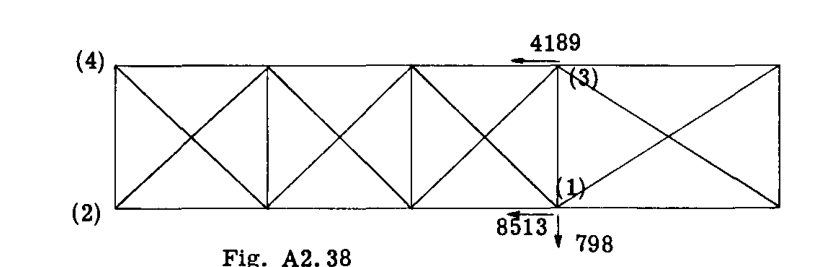

$$
\Sigma V = 1838 \times .9986 - .0523 RB - .4486 SR = 0 \quad ---(4)
$$

$$
\Sigma S = -1838 \times .0523 - .9986 RB - .8930 SR = 0 \quad ---(5)
$$

$$
\Sigma D = D_a + 0 = 0 \quad ---(6)
$$

方程式 4、5、6 を解くと、以下が得られる。
 $RB = - 4189$  lb. (圧縮)  
 $SR = 4579$  lb. (引張)  
 $D_a = 0$   

Fig. A2.38 は、上記で求められた、結合部 (1) および (3) におけるドラッグトラス上のリフトストラットの反力を示している。

### 空力ドラッグ荷重によるドラッグトラスのパネル点荷重

ドラッグ方向の空気荷重成分は、前方に向かって作用する翼の  $6$  lb./in. であると仮定された。

 $6$  lb./in. の分布荷重は、Fig. A2.39 に示すように、パネル点の集中荷重に置き換えられる。各パネル点は、オーバーハング翼端部分の影響を受ける 2 つの外側パネル点を除き、隣接するパネル点への分布荷重の半分を受け持つ。

したがって、254 lb. の外側パネル点集中荷重は、次のように (3) の外側のドラッグ荷重について (3) の周りのモーメントをとることによって決定される。

$$
P = 70.5 \times 6 \times 35.25 / 58.5 = 254 \text{ lb.}
$$

ドラッグトラスの解法を簡略化するために、内側ドラッグトラスパネルのドラッグストラットとドラッグワイヤは、点 (2) および (4) のヒンジで交差するように修正された。この点におけるビームとフィッティングの設計では、実際の偏心状態の影響を当然考慮すべきである。

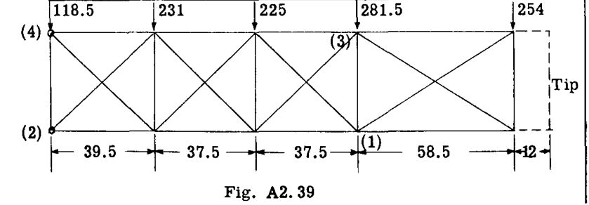

### ドラッグトラス上の結合荷重

Figs. A2.38 と A2.39 の 2 つの荷重系を加算すると、Fig. A2.40 に示すように全ドラッグトラス荷重が得られる。得られた部材の軸応力は、指標応力法 (Art. A2.9) によって解かれる。値はトラス図に示されている。翼を胴体に取り付けるフィッティングの 1 つを、ドラッグ反力を胴体に伝達できないようにするのが慣例であり、それによって翼パネルからの全ドラッグ反力が胴体上の 1 点に確実に限定される。この例では、点 (2) がドラッグに抵抗する点として想定されている。圧縮状態になるドラッグワイヤは、作動しないものと想定される。

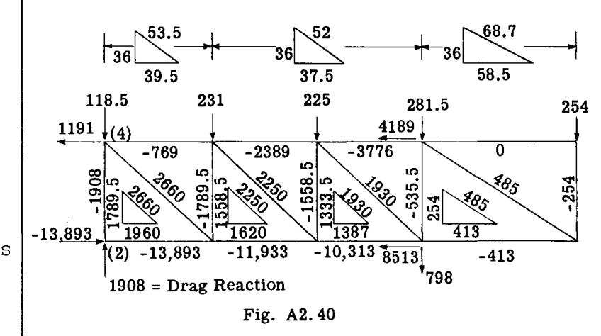

### 胴体反力

作業のチェックとして、また翼構造から胴体への基準荷重を得るために、胴体反力を外部から加えられた空気荷重に対してチェックする。Table A2.2 は、計算を表形式で示している。

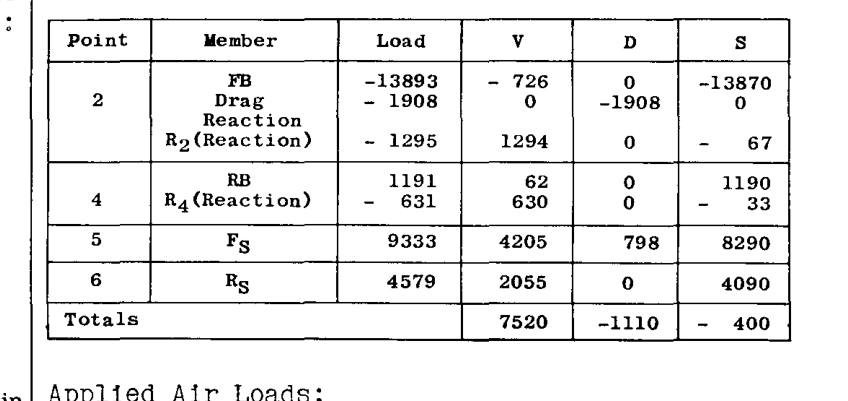

**作用空気荷重:**

V 成分  $= (3770 + 1295 + 1838 + 631) \times .9986 = 7523$  lb. (誤差 3 lb.)  
D 成分  $= -185 \times 6 = 1110$  lb. (誤差 = 0)  
S 成分  $= -(3770 + 1295 + 1838 + 631) \times .0523 = 394$  lb. (誤差 6 lb.)  

# A2.18 EQUILIBRIUM OF FORCE SYSTEMS. TRUSS STRUCTURES.

分布リフト空気荷重を受ける翼ビームは、軸荷重に加えて曲げ荷重も受ける。したがって、翼ビームはビームカラムとして機能する。ビームカラムの作用については、本書の別の章で扱う。

翼が布の代わりに金属外板で覆われている場合、上下の外板が、前後のビームをフランジ部材とするビームのウェブとして機能するため、ドラッグトラスを省略できる。この場合、翼は曲げと軸荷重の複合荷重を受けるボックスビームとみなされる。

## 例題 11. 3 セクション外部支持翼

Fig. A2.41 は、高翼の外部支持翼構造を示している。翼の外側パネルは、例題 1 の翼パネルと同一に作られている。この外側パネルは、点 (2) および (4) のシングルピンフィッティングによって中央パネルに取り付けられている。これらの点にピンを配置することで、構造は静定になるが、ビームが 3 つのパネルすべてを通して連続している場合、ストラットの変形による沈下支点上に載る 3 スパン連続ビームとなるため、翼ビーム上のリフトおよびカベインストラットの反力は不静定となる。点 (2) および (4) のフィッティングピンは、ビームの中立軸に対して偏心させることができるため、横方向のビーム曲げモーメントを減少させる目的でビームを連続にしても、得られる利点はほとんどない。組立、格納、および輸送のために、このような翼を 3 つの部分で構成すると便利である。連続ビームを得るために点 (2) および (4) でマルチボルトフィッティングが使用される場合、様々な政府機関の設計要件により、マルチボルトフィッティングが完全な連続性の 50 パーセントしか提供しないという仮定に基づいて翼ビームも分析しなければならないため、あまり利点はない。

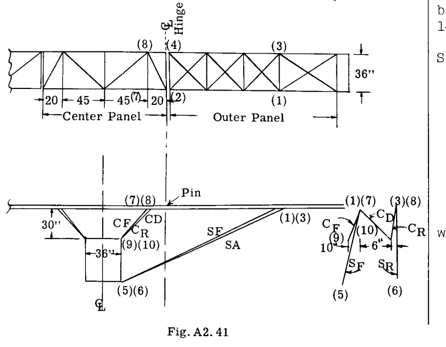

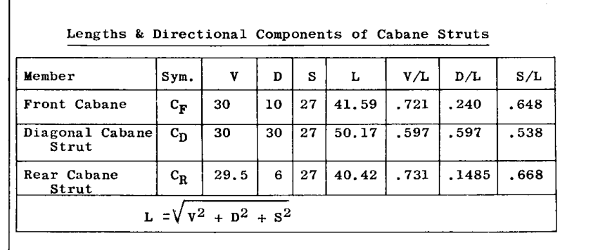

外側パネル上の空気荷重は、例題 1 のものと同一とされる。同様に、リフトストラット SF および SR の反角と方向も例題 1 と同一にされている。したがって、外側パネルのドラッグおよびリフトトラスの荷重分析は、例題 1 のものと同一である。解法は、中央パネルの走行リフト荷重が 45 lb./in.、前方ドラッグ荷重が 6 lb./in. であると仮定して継続される。

## 中央パネルの解法

### 中央後部ビーム

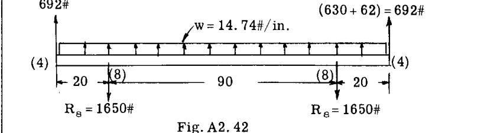

Fig. A2.42 は、中央後部ビーム上の横方向荷重を示している。荷重は、分布空気荷重と、ピン点 (4) において外側パネルから中央パネルに及ぼされる力の垂直成分で構成される。例題 1 の Table A2.2 から、この合成 V 反力は  $630 + 62 = 692$  lb. に等しい。

結合部 (8) におけるカベイン反力の垂直成分は、荷重の対称性により、全ビーム荷重の半分、すなわち  $65 \times 14.74 + 692 = 1650$  lb. に等しい。

### 結合部 8 における力系の解法

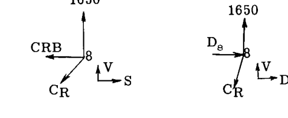

$$
\Sigma V = 1650 - .731 CR = 0
$$

これより

$$
CR = 1650 / .731 = 2260 \text{ lb. (引張)}
$$

$$
\Sigma S = - CRB - 2260 \times .668 = 0
$$

# A2.19

これより

$$
CRB = - 1510 \text{ lb. (圧縮)}
$$

$$
\Sigma D = D_a - 2260 \times .1485 = 0
$$

これより

$$
D_a = 336 \text{ lb. ドラッグトラス反力}
$$

### 中央前部ビーム

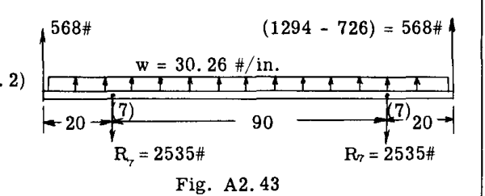

Fig. A2.43 は、中央前部ビーム上の V 荷重と、その結果として生じる結合部 (7) におけるカベイン反力の V 成分を示している。

### 結合部 7 における力系の解法

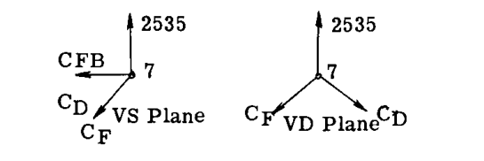

$$
\Sigma V = 2535 - .721 CF - .597 CD = 0
$$

$$
\Sigma S = - CFB - .648 CF - .538 CD = 0
$$

$$
\Sigma D = - .240 CF + .597 CD = 0
$$

これら 3 つの方程式を解くと、以下が得られる。

 $CFB = - 2281$  (圧縮)  
 $CF = 2635$   
 $CD = 1058$   

### ドラッグトラス部材の荷重の解法

Fig. A2.44 は、中央パネルのドラッグトラスに加えられるすべての荷重を示している。外側パネルからの S および D 反力は、例題 1 の Table A2.2 から点 (2) および (4) で取得される。点 (8) における 336 lb. のドラッグ荷重は、後部カベインストラットによるものであり、同様に点 (8) における - 1510 のビーム軸荷重も同様である。点 (7) における - 2281 lb. の軸方向ビーム荷重は、前部カベインストラットの反力によるものである。パネル点荷重は、前方に向かって作用する与えられた 6 lb./in. の走行ドラッグ荷重によるものである。

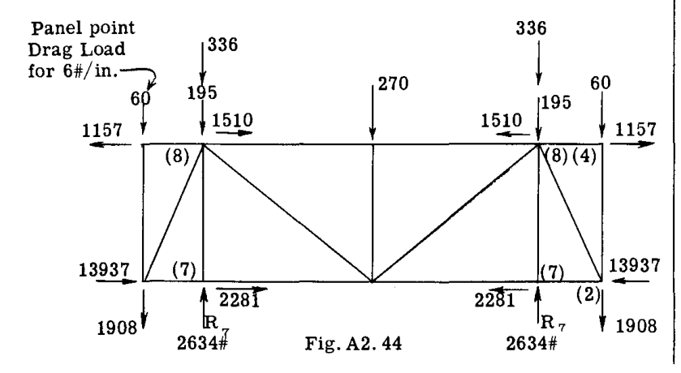

これらすべてのドラッグトラス荷重を平衡に保つ反力は、前部および対角カベインストラットが交差して剛な三角形を形成するため、点 (7) のカベイントラスによって供給される。したがって、ドラッグ反力 R は、全ドラッグ荷重の半分、すなわち 2634 lb. に等しい。

Fig. A2.44 の荷重についてトラスを解くと、Fig. A2.45 の部材軸荷重が得られる。

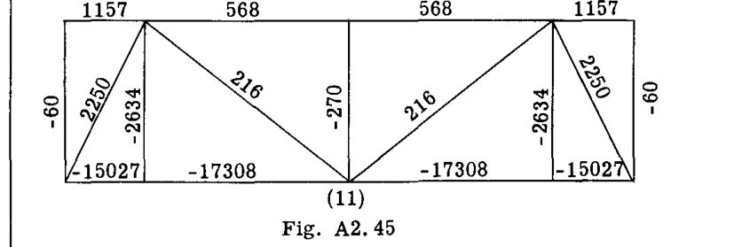

### 点 7 におけるドラッグ反力によるカベインストラットの荷重

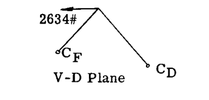

$$
\Sigma D = - 2634 - .240 CF + .597 CD = 0
$$

$$
\Sigma V = .721 CF - .597 CD = 0
$$

CF および CD について解くと、以下が得られる。

 $CF = - 2740$  lb. (圧縮)  
 $CD = 3310$  (引張)  

これらの荷重を、以前にリフト荷重に対して計算された荷重に加算すると、次のようになる。

 $CF = - 2740 + 2635 = - 105$   
 $CD = 1058 + 3310 = 4368$  lb.  
 $CR = 2260$  lb.  

### 胴体反力

作業のチェックとして、胴体反力を作用空気荷重に対してチェックする。Table A2.3 は、胴体反力の V、D、および S 成分を示している。

# A2.20 EQUILIBRIUM OF FORCE SYSTEMS. TRUSS STRUCTURES.

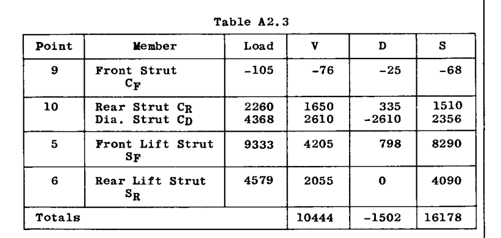

**作用空気荷重**

V 成分  $= 7523$  (外側パネル)  $+ 65 \times 45 = 10448$  (チェック)  
D 成分  $= - 1110$  (外側パネル)  $- 65 \times 6 = - 1500$  (誤差 2 lb.)  

胴体反力の Table A2.3 から  $\Sigma S = 16178$  となる。Fig. A2.45 から、航空機の中心線における前部ビームの荷重は  $- 17308$ 、後部ビームは 568 である。結合部 11 における対角ドラッグストラットの水平成分は  $216 \times 45 / 57.6 = 169$  lb. である。

すると、全 S 成分  $= 16178 - 17308 + 568 + 169 = - 393$  lb. となり、作用空気荷重の横方向成分と一致する。

航空機の中心線を通る垂直面上の全横方向荷重は、作用荷重の S 成分と等しくなければならない。作用する横方向荷重は  $- 394$  lb. である（例題 1 を参照）。中央パネル上の空気荷重は垂直であるため、S 成分はゼロである。

## 例題 12. シングルスパートラス＋ねじりトラス系

小さな翼や操舵面では、表面被覆として布がよく使用される。布は信頼できるねじり抵抗を提供できないため、ねじり強度を提供するために内部構造をそのような設計にする必要がある。シングルスパーに特殊なタイプのトラス系を加えたものが、満足のいく構造を与えるためによく使用される。Fig. A2.46 は、そのようなタイプの構造、すなわちトラス化されたシングルスパー AEFN と、スパーと後縁 OS の間の三角形トラス系を示している。Fig. A2.46 (a, b, c) は、3 つの投影図と寸法を示している。構造の表面被覆上の空気荷重は、スパーラインで  $0.5$  lb./in. $^2$  の強度であり、後縁に向かって線形にゼロまで変化すると仮定される（Fig. d を参照）。

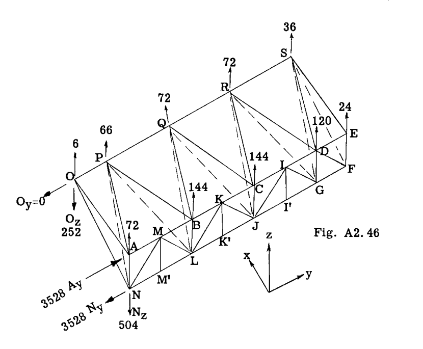

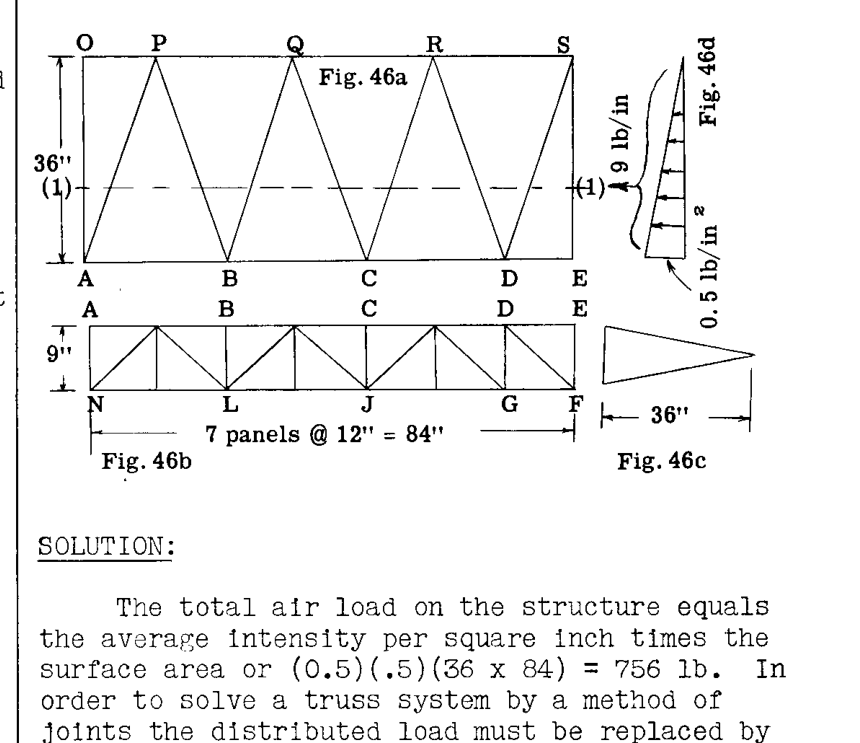

問題は、構造のすべての部材の軸荷重を決定することである。トラス構造の一次荷重を求める際に通常行われるように、すべての部材は 2 力部材であると仮定される。

### 解法:

構造上の全空気荷重は、1平方インチあたりの平均強度に表面積を乗じたもの、すなわち  $(0.5)(.5)(36 \times 84) = 756$  lb. に等しい。結合法によってトラス系を解くために、分布荷重を構造の結合部に作用する等価荷重系に置き換えなければならない。Fig. (d) を参照すると、幅 1 インチ、長さ 36 インチのストリップ上の全空気荷重は  $36(0.5)/2 = 9$  lb. であり、その c.g. または合力位置は線 AE から 12 インチである。Fig. 46a では、この 9 lb./in. の合力荷重が、ライン 1-1 に沿って配置された仮想のビーム上に作用していると想定されている。このラインに沿って加えられた走行荷重は、現在、結合部 OPQRSEDBCA に作用する等価な力系に置き換えられている。この結合部分布の結果は、Fig. A2.46 の結合部荷重によって示されている。これらの結合部荷重がどのように得られたかを示すために、結合部 ESDR における荷重の計算を以下に示す。

Fig. A2.48 は、考慮すべき構造の一部を示している。ライン 1-1 に沿った 9 lb./in. の走行荷重に対して、反応は以下のようになる。

# A2.21

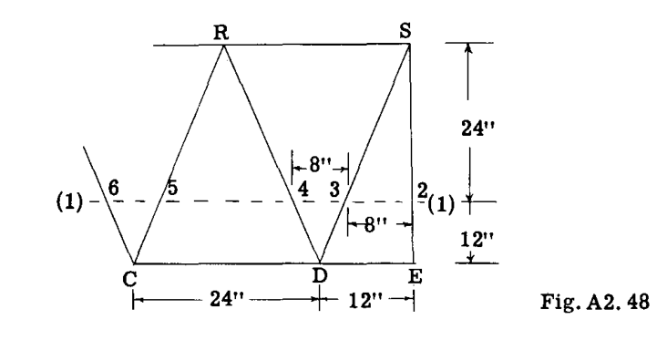

点 2, 3, 4, 5 などに載っている単純梁。点 2-3 間の距離は 8 インチである。この距離の全荷重は  $8 \times 9 = 72$  lb. である。半分、すなわち 36 lb. が点 (2) に行き、もう半分が点 (3) に行く。点 (2) における 36 lb. は、E における等価な力系と、S への 8 または  $(36)/3 = 12$  lb. および E への  $(36)(2/3) = 24$  lb. に置き換えられる。点 (3) と (4) の間の距離は 8 インチで、荷重は  $8 \times 9 = 72$  lb. である。これの半分、すなわち 36 が点 (3) に行き、これが点 (3) における前の 36 に加えられて、点 (3) において 72 lb. となる。次に 72 lb. の荷重は、S および D における等価な力系、すなわち S への  $(72)/3 = 24$  lb. と D への  $(72)(2/3) = 48$  lb. に置き換えられる。したがって、S における最終荷重は  $24 + 12 = 36$  lb. となり、Fig. A2.46 に示されている通りである。三角形 CRD の対称性により、距離 CD 上の全荷重の半分は点 (4) および (5) 、すなわち  $(24 \times 9)/2 = 108$  lb. に行く。したがって、D への配分は  $(108)(2/3) = 72$  および R への 36 である。D における以前の 48 lb. の荷重に 72 を加えると、Fig. A2.46 に示されているように、D における全荷重は 120 lb. となる。点 (5) における 108 lb. は、R への  $(108)/3 = 36$ 、または R における合計 72 lb. も与える。学生は Fig. A2.46 に示されているように、他の結合部への分布をチェックする必要がある。

導出された結合部荷重系と元の空気荷重系の等価性をチェックするには、各系の大きさとモーメントが同じでなければならない。Fig. A2.46 に示されている全結合部荷重を加算すると、756 lb. となり、これは元の空気荷重と一致する。構造の左端における x 軸の周りの全空気荷重のモーメントは、  $756 \times 42 = 31752$  in. lb. に等しい。Fig. A2.46 の結合部荷重系のモーメントは、  $(66 \times 12) + (72 \times 36) + (72 \times 60) + (56 \times 84) + 144(24 + 48) + (120 \times 72) + (24 \times 84) = 31752$  in. lb. となり、チェックされる。ライン AE の周りの全空気荷重のモーメントは  $756 \times 12 = 9072$  in. lb. に等しい。分布結合部荷重のモーメントは  $(6 + 66 + 72 + 72 + 36)36 = 9072$  となり、これもチェックされる。

### 反力の計算

構造は、点 A, N, O において、ピン軸が x 軸に平行なシングルピンフィッティングによって支持されている。N におけるフィッティングが Z 方向のスパー荷重を受け持つと仮定する。Fig. A2.46 は反力  $O_y, O_z, A_y, N_y, N_z$  を示している。 $O_z$  を求めるために、スパー AEFN に沿った y 軸の周りのモーメントをとる。

$$
\Sigma M_y = (6 + 66 + 72 + 72 + 36)36 - 36 O_z = 0
$$

これより、想定通り、下向きに作用する  $O_z = 252$  lb. である。

 $O_y$  を求めるために、点 (A) を通る z 軸の周りのモーメントをとる。

$$
\Sigma M_z = 0 + 36 O_y = 0, \quad O_y = 0
$$

 $A_y$  を求めるために、点 N を通る x 軸の周りのモーメントをとる。空気荷重のモーメントは以前に - 31752 と計算されたので、

$$
\Sigma M_x = - 31752 + 9 A_y = 0, \quad \text{これより、} A_y = 3528 \text{ lb.}
$$

 $N_y$  を求めるために、 $\Sigma F_y = 0$  をとる。

$$
\Sigma F_y = 3528 - N_y = 0, \quad \text{したがって } N_y = 3528 \text{ lb.}
$$

 $N_z$  を求めるために、 $\Sigma F_z = 0$  をとる。

$$
\Sigma F_z = - 252 + 756 - N_z = 0, \quad \text{したがって } N_z = 504 \text{ lb.}
$$

反力はすべて Fig. A2.46 に記録されている。

### トラス部材荷重の解法

簡略化のために、構造上の荷重系は 2 つの荷重系として個別に検討される。1 つの系にはライン AE に沿って作用する荷重のみが含まれ、2 番目の荷重系にはライン OS に沿って作用する残りの荷重が含まれる。結合部 O では曲げモーメントに抵抗できないため、スパー AE に沿った外部荷重は、完全に A と N で反力を受ける。言い換えれば、スパー単独でライン AE 上の荷重に抵抗する。

Fig. A2.49 は、このスパーとその結合部外部荷重の図を示している。この荷重によって生じる軸荷重はトラス部材上に記されている。（学生はこれらの部材荷重をチェックする必要がある。）

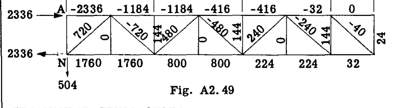

### 三角形トラス系

後縁 OS に沿った荷重系は、スパー・トラスと対角トラス系の両方に応力を生じさせる。点 O における支持フィッティングは Z 方向の反力を提供するが、x 軸の周りの反力モーメントは提供しない。後縁上の荷重は O を通る y 軸上にあるため、これらすべての荷重が点 O に流れることは明らかである。後縁部材の曲げ強度は無視できるため、

# A2.22 EQUILIBRIUM OF FORCE SYSTEMS. TRUSS STRUCTURES.

結合部 S における 36 lb. の荷重は、対角トラス系を通って点 O に伝達されるために、経路 SDRCQBPAO をたどらなければならない。同様に、R における 72 lb. の荷重は、O に到達するために経路 RCQBPAO などをたどらなければならない。

### 対角トラス部材の荷重の計算:-

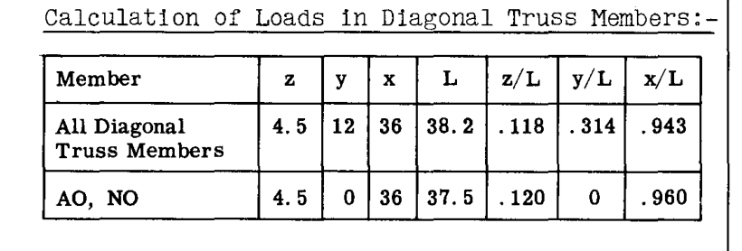

### 結合部 S の検討

三角形トラス SEF は、EF におけるこのトラスの反力がスパーにねじれを与え、スパーには感知できるほどのねじり抵抗がないため、S における 36 lb. の荷重の一部を伝達するのを助けることができない。

結合部 S を自由体として考え、平衡方程式を記述すると:

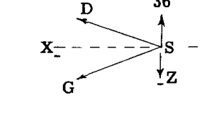

$$
\Sigma F_x = - .943 DS - .943 GS = 0
$$

これより、 $DS = - GS$ 

$$
\Sigma F_z = 36 + .118 DS - .118 GS = 0
$$

 $DS = - GS$  を代入して GS について解くと、 $GS = 159$  lb. (引張)、 $DS = - 159$  (圧縮) が得られる。

### 結合部 D の検討

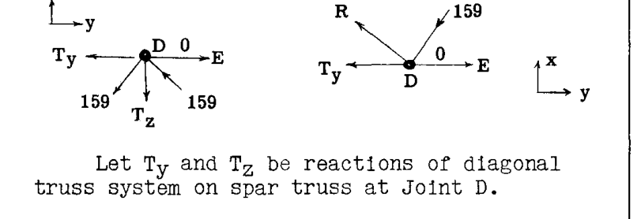

 $T_y$  および  $T_z$  を、結合部 D におけるスパートラス上の対角トラス系の反力とする。

$$
\Sigma F_x = - 159 \times .943 + .943 DR = 0, \quad \text{したがって } DR = 159 \text{ lb.}
$$

$$
\Sigma F_z = - 159 \times .118 + 159 \times .118 - T_z = 0
$$

これより  $T_z = 0$  となり、対角トラスは D においてスパートラスに Z 反力やせん断荷重を生じさせないことを意味する。

$$
\Sigma F_y = - .314 \times 159 - .314 \times 159 - T_y = 0
$$

これより  $T_y = - 100$  lb. である。

結合部 G を同様の方法で調査すると、結果は  $T_z = 0$  および  $T_y = 100$  を示す。結合部 D における結果は、後部対角トラス系がスパー上にせん断荷重反力を生じさせないが、スパーの y 方向に対力の組（カップル）を生じさせ、それがスパートラスの弦材上部に圧縮、弦材下部に引張を生じさせることを示している。

### 結合部 R の検討

トラス RCJR に伝達される荷重は、R における 72 lb. に、トラス DRG から結合部 R に来る S における 36 lb. を加えたものに等しい。

したがって、RC における荷重  $= (72 + 36)0.5 \times (1/.118) = - 457$  lb.  
これより  $RJ = 457$ 、  $CQ = 457$ 、  $JQ = - 457$ 

### 結合部 Q

トラス QBL に伝達される荷重  $= 72 + 72 + 36 = 180$  lb.  
したがって、QB における荷重  $= (180 \times 0.5)(1/.118) = - 762$   
これより  $QL = 762$ 、  $BP = 762$ 、  $LP = - 762$ 

### 結合部 P

荷重  $= 180 + 66 = 246$   
PA における荷重  $= (246 \times 0.5)(1/.118) = - 1040$   
これより  $PN = 1040$ 

### 結合部 (A) を自由体として検討する。

$$
\Sigma F_x = - 1040 \times .943 + .960 AO = 0, \quad AO = 1022 \text{ lb.}
$$

同様に、結合部 N を考慮すると、 $NO = - 2022$  lb. が得られる。

### スパー上の対力反力

以前に指摘したように、対角ねじりトラスはスパーの y 方向に組反力を生じさせる。この力の大きさは、スパー結合部で出会う対角トラス部材の荷重の y 成分の合計に等しい。 $T_y$  をスパー上のこの反力荷重とする。

結合部 C において:

$$
T_y = - (457 + 457) .314 = - 287 \text{ lb.}
$$

同様に、結合部 J において  $T_y = 287$ 

結合部 B において:

$$
T_y = - (762 + 762) .314 = - 479
$$

同様に、結合部 L において  $T_y = 479$ 

結合部 A において:

$$
T_y = - (1040 \times .314) = - 326
$$

同様に、結合部 N において  $T_y = 326$ 