トーション・トラスによるスパー・トラスへの反力を Fig. A2.50 に示す。この荷重によるスパー・トラス部材の荷重は、各トラス部材に隣接して書き込まれている。これらの部材荷重を Fig. A2.49 の荷重に加えると、Fig. A2.51 に示すような最終的なスパー・トラス部材の荷重が得られる。  

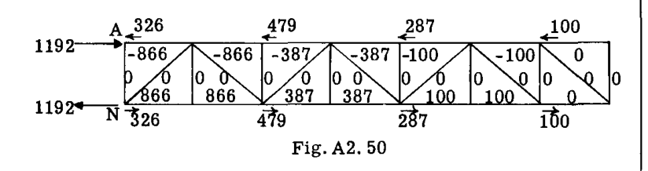  

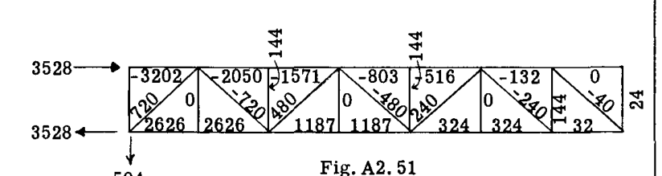  

Fig. A2.50 と A2.49 の反力を加算すると、3528 および 504 が得られ、これは Fig. A2.46 で得られた反力と一致する。  

## A2.13 脚構造（ランディングギア構造）  

航空機は陸上および空中の両方の乗り物であり、したがって、車輪やブレーキといった地上で航空機を運用する手段を備えていなければならない。さらに、着陸時や荒れた地上を走行する際に伴う衝撃力を制御するための対策を講じる必要がある。この要件には、タイヤによって提供されるエネルギー吸収以上の、脚部における特別なエネルギー吸収ユニットが必要である。したがって、脚部には、一般にオレオストラットと呼ばれる、いわゆるショックストラットが含まれる。これは、2つの入れ子状のシリンダーで構成される部材である。ストラットが圧縮されると、気密シリンダー内のオイルが一つのシリンダーからもう一つのシリンダーへとオリフィスを通って押し出され、着陸時の衝撃によるエネルギーは、このオイルをオリフィスに押し通す作業によって吸収される。オリフィスは、オレオストラットの変位またはストロークにわたって実質的に一定の抵抗を提供するように設計することができる。  

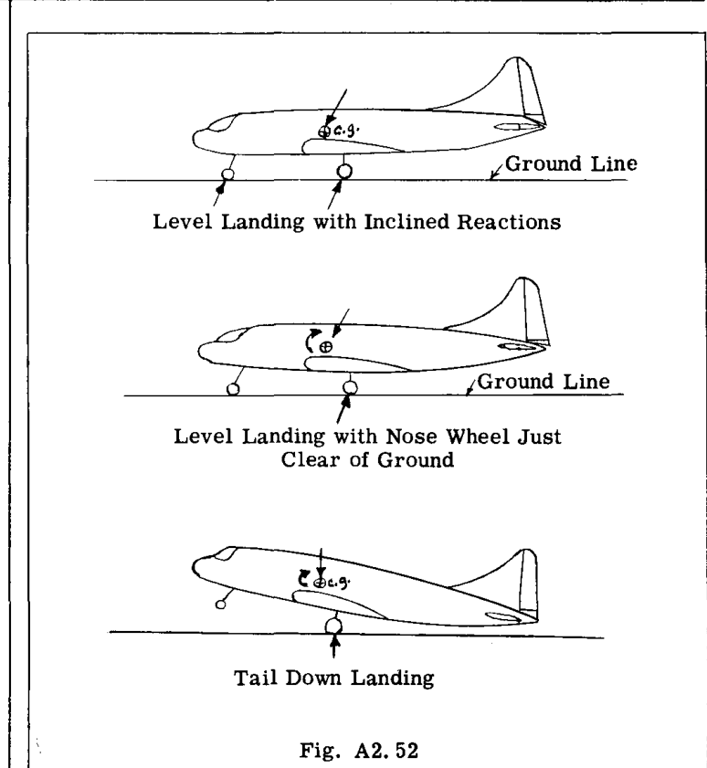  

航空機は、接地瞬間の様々な姿勢で安全に着陸することができる。Fig. A2.52 は、脚部の設計のために政府の航空当局によって指定されている航空機の3つの姿勢を示している。これらの対称的なブレーキなしの荷重に加えて、ブレーキ状態、片輪着陸状態、車輪への側方荷重などの特別な荷重が必要とされる。言い換えれば、脚部は航空機の通常の運用で遭遇する様々な着陸条件下で、かなりの数の異なる荷重を受ける可能性がある。  

Fig. A2.53 は代表的な主脚ユニットの写真を、Fig. A2.54 は前脚ユニットの写真を示している。  

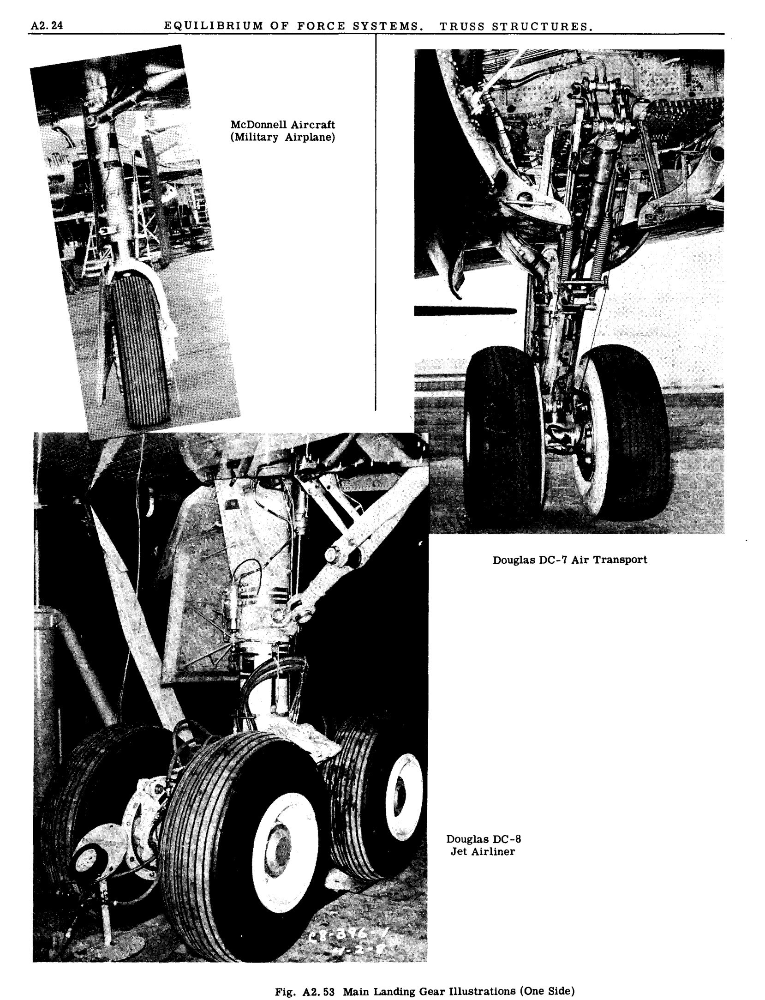  

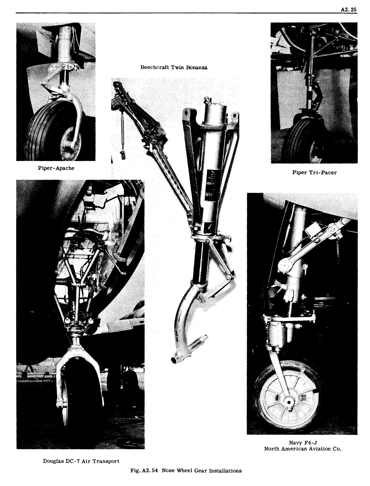  

現代の航空機における脚部の設計成功は、航空機の構造レイアウトおよび強度設計において遭遇する最も困難な問題の一つであることは疑いない。一般に、空気力学的効率のために脚部は主翼、ナセル、または胴体の内部に格納されなければならず、したがって、信頼性が高く安全な格納および展開機構システムが必要となる。車輪にはブレーキをかけ、前脚は操向可能にしなければならない。脚部は比較的大きな荷重を受け、その大きさは航空機の総重量の数倍に達することもあり、これらの大きな荷重は支持する主翼または胴体構造に伝えられなければならない。脚部の重量は航空機の重量の約6パーセントに達することがあるため、高い強度/重量比が脚部の主要な設計要件であることは明らかである。非効率な構造配置や保守的な応力解析は、航空機に多くの不必要な重量を追加し、その結果、有効荷重（ペイロード）を減少させる可能性がある。  

## A2.14 脚ユニット部材の反力および荷重の計算例題  

最も単純な形式では、脚部は、その上端が支持構造に剛結合された片持ち梁として機能する単一のオレオストラットで構成される。オレオストラットの下部シリンダーは、その下端に車輪とタイヤを取り付けるための車軸を保持している。この片持ち梁は、2方向の曲げ、ねじり、および軸荷重を受ける。脚部は通常格納式に作られるため、オレオストラットの上端に、この複雑な力の組み合わせに耐え、かつ単純な格納機構の動きを可能にする単一のフィッティングユニットを設計することは困難である。さらに、このような大きな集中荷重系に対して、主翼または胴体構造を貫通する支持構造を提供することも困難である。  

したがって、曲げモーメントの大きさを小さくし、片持ちストラットの曲げの柔軟性を低減し、さらに格納問題や構造の貫通問題を簡素化するために、オレオストラットに1つまたは2つのブレースを追加するのが一般的である。一般に、部材端部または支持点に特別に設計されたフィッティングを使用して、方向と作用点の力の特性を確立することにより、脚構造を静定にする努力がなされる。  

2つの例題の解答を提示する。1つは単輪の脚、もう1つは2輪の脚に関するものである。  

### 例題 13  

Fig. A2.55 は、VS および VD 平面上の脚構成の投影図を示している。Fig. A2.56 は空間寸法図である。脚の解析では、記号  $Z, X, Y$  の代わりに参照軸として  $V, D, S$  を使用するのが一般的である。この脚ユニットは、三輪式の脚システムの一方の主脚を表していると想定される。想定される荷重は、機首上げまたは尾部接地状態に対応する（Fig. A2.52 の下の図を参照）。この問題における車輪への設計荷重は垂直方向であり、その大きさは  $15000 \text{ lb}$  である。  

脚ユニットは、点 F, H および G で支持構造に取り付けられている。脚の格納は、F と H を通る軸を中心に脚を後方かつ上方に回転させることによって行われる。F と H のフィッティングは、曲げモーメントに抵抗しないように設計されている。したがって、F と H における反力は大きさと方向が未知である。反力と角度を未知数として使用する代わりに、Fig. A2.56 に示すように、結果として生じる反力をその  $V$  および  $D$  成分に置き換える。G における反力は、部材 GC の各端にあるピンフィッティングが G における反力の方向と作用線を固定するため、大きさのみが未知である。計算の便宜上、反力  $G$  はその成分  $G_V$  および  $G_D$  に置き換えられる。脚への側方荷重については、 $S$  方向の反力は特別に設計されたユニットによって点 F で受け持たれる。  

#### 解法 (SOLUTION)  

最初のステップとして、点 F, H, および G における脚への支持反力を計算する。未知数は  $F_S, F_V, F_D, H_V, H_D$  および  $G$  の6つである（Fig. A2.56 参照）。空間力系に対して利用可能な6つの静的平衡方程式により、静力学によって反力を求めることができる。Fig. A2.56 を参照して：  

 $F_S$  を求めるために  $\sum S = 0$  とする  

$$ 
F_S + 0 = 0, \text{ したがって } F_S = 0 
$$ 

反力  $G_V$  を求めるために、点 F, H を通る  $S$  軸のまわりのモーメントをとる。  

$$ 
\sum M_S = 3119 \times 50 - 24 G_V = 0 
$$ 

これより、想定した向きで  $G_V = 6500 \text{ lb}$ 。  
（ $15000 \text{ lb}$  の車輪荷重は、Fig. A2.55 に示されているように  $V$  および  $D$  成分に分解されている）。  

 $G_V$  が既知となったので、反力  $G$  は  $(6500)(31.8 / 24) = 8610 \text{ lb}$  となり、同様に成分  $G_D$  は  $(6500)(21 / 24) = 5690 \text{ lb}$  となる。  

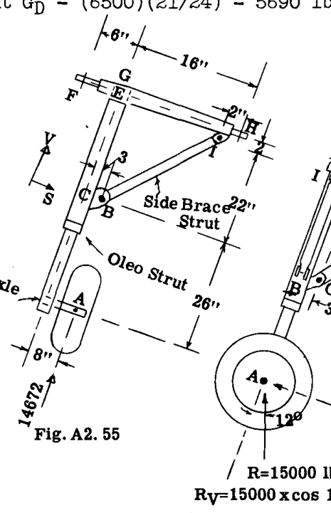  

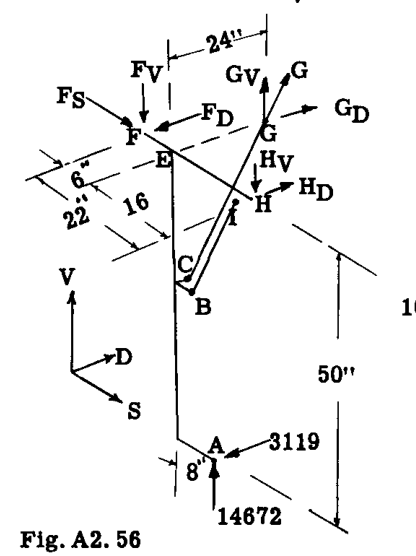  

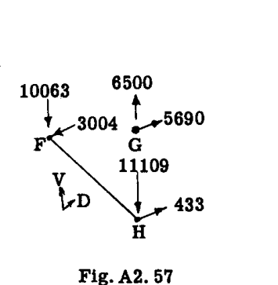  

点 H を通る  $D$  軸のまわりのモーメントをとり、 $F_V$  を求める。  

$$ 
\sum M_H(D) = 16 G_V + 14672 \times 8 - 22 F_V = 0 
$$ 

$$ 
= 16 \times 6500 + 14672 \times 8 - 22 F_V = 0 
$$ 

これより、 $F_V = 10063 \text{ lb}$ （想定した向き）。  

点 F を通る  $V$  軸のまわりのモーメントをとり、 $H_D$  を求める。  

$$ 
\sum M_F(V) = - 6 G_D - 22 H_D + 3119 \times 14 = 0 
$$ 

$$ 
= - 6 \times 5690 - 22 H_D + 3119 \times 14 = 0 
$$ 

これより、 $H_D = 433 \text{ lb}$ 。  

 $F_D$  を求めるために  $\sum D = 0$  とする。  

$$ 
\sum D = - F_D + H_D + G_D - 3119 = 0 
$$ 

$$ 
= - F_D + 433 + 5690 - 3119 = 0 
$$ 

これより、 $F_D = 3004 \text{ lb}$ 。  

 $H_V$  を求めるために  $\sum V = 0$  とする。  

$$ 
\sum V = - F_V + G_V - H_V + 14672 = 0 
$$ 

$$ 
= - 10063 + 6500 - H_V + 14672 = 0 
$$ 

これより、 $H_V = 11109 \text{ lb}$ 。  

Fig. A2.57 は求められた反力をまとめたものである。結果は、点 A を通る  $D$  軸および  $V$  軸のまわりのモーメントをとることにより、構造全体の平衡についてチェックされる。  

$$ 
\sum M_A(D) = - 10063 \times 14 + 6500 \times 8 + 11109 \times 8 
$$ 

$$ 
= - 140882 + 52000 + 88882 = 0 \text{ (check)} 
$$ 

$$ 
\sum M_A(V) = 5690 \times 8 - 433 \times 8 - 3004 \times 14 
$$ 

$$ 
= 45520 - 3464 - 42056 = 0 \text{ (check)} 
$$ 

解法の次のステップは、オレオストラットユニットに働く力の計算である。Fig. A2.58 は、オレオストラットと車軸ユニットの自由体図を示している。ブレース部材 BI および CG は、各端がピン結合されているため二力部材であり、したがって、点 B および C における反力特性として未知なのは大きさのみである。オレオストラットと上部クロス部材 FH の間の点 E におけるフィッティングは、オレオストラット軸まわりのねじりモーメントに抵抗し、 $D, V, S$  の反力を提供するが、 $D$  および  $S$  軸まわりのモーメント反力は提供しないように設計されている。したがって、未知数は  $BI, CG, E_S, E_V, E_D$  および  $T_E$  の計6つであり、したがって静定である。ねじりモーメント  $T_E$  は、Fig. A2.58 では二重矢印のベクトルで表されている。ベクトルの方向はモーメント軸を表し、モーメントの回転方向は右ねじの法則によって与えられる。すなわち、右手の親指を矢印と同じ方向に向けたとき、曲げた指が回転の向きを示す。  

点 E を通る  $V$  軸のまわりのモーメントをとることにより、抵抗ねじりモーメント  $T_E$  を求める。  

$$ 
\sum M_E(V) = - 3119 \times 8 + T_E = 0, \text{ したがって } T_E = 24952 \text{ in. lb.} 
$$ 

点 E を通る  $S$  軸のまわりのモーメントをとり、 $CG$  を求める。  

$$ 
\sum M_E(S) = 3119 \times 50 - (24 / 31.8) CG \times 3 - 24 (21 / 31.8) CG = 0 
$$ 

これより、 $CG = 8610 \text{ lb}$ 。  

これは、点 G における反力が 8610 であると求められた際の結果と一致する。したがって  $CG$  の  $D$  および  $V$  成分は：  

$$ 
CG_D = 8610 (21 / 31.8) = 5690 \text{ lb.} 
$$ 

$$ 
CG_V = 8610 (24 / 31.8) = 6500 \text{ lb.} 
$$ 

ブレースストラット BI の荷重を求めるために、点 E を通る  $D$  軸のまわりのモーメントをとる。  

$$ 
\sum M_E(D) = - 14672 \times 8 + 3 (BI) 22 / 24.6 + 24 (BI) 11 / 24.6 = 0 
$$ 

これより、 $BI = 8775 \text{ lb.}$   

したがって、 

$$ 
BI_V = (8775)(22 / 24.6) = 7840 \text{ lb.} 
$$ 

$$ 
BI_S = (8775)(11 / 24.6) = 3920 \text{ lb.} 
$$ 

 $E_S$  を求めるために  $\sum S = 0$  とする。  

$$ 
\sum S = E_S - 3920 = 0, \text{ したがって } E_S = 3920 
$$ 

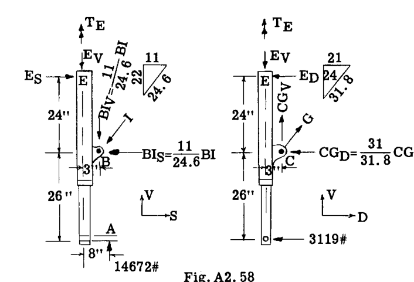  

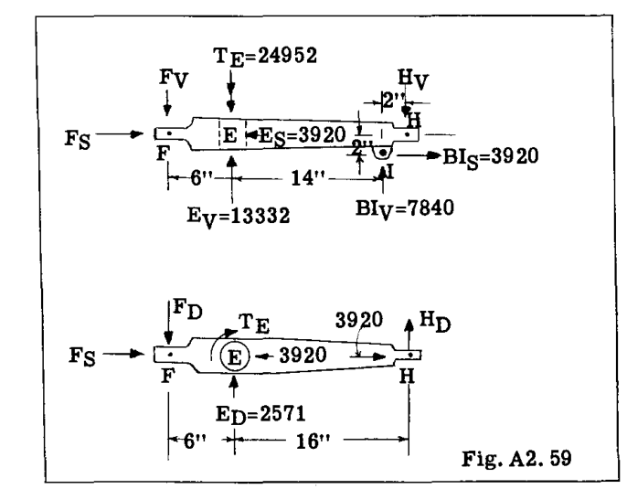  

 $E_D$  を求めるために  $\sum D = 0$  とする。  

$$ 
\sum D = 5690 - 3119 - E_D = 0, \text{ したがって } E_D = 2571 
$$ 

 $E_V$  を求めるために  $\sum V = 0$  とする。  

$$ 
\sum V = - E_V + 14672 - 7840 + 6500 = 0, \text{ したがって } E_V = 13332 \text{ lb.} 
$$ 

Fig. A2.59 は、上部部材 FH の自由体図を示している。未知数は  $F_V, F_D, F_S, H_V, H_D$  である。オレオストラットユニットの解析から得られた荷重または反力も図に記録されている。この自由体図の平衡方程式は：  

$$ 
\sum S = 0 = - 3920 + 3920 + F_S = 0, \text{ または } F_S = 0 
$$ 

$$ 
\sum M_F(D) = 22 H_V - 3920 \times 2 - 7840 \times 20 - 13332 \times 6 = 0 
$$ 

これより、 $H_V = 11110 \text{ lb.}$ 。このチェック値は以前に得られており、したがって我々の作業のチェックとなる。  

$$ 
\sum M_F(V) = 24952 - 2571 \times 6 - 22 H_D = 0 
$$ 

これより、 $H_D = 433 \text{ lb.}$ 。  

$$ 
\sum V = - F_V + 13332 + 7840 - 11110 = 0 
$$ 

これより、$F_V = 10063 
$$ 

$$ 
\sum D = - F_D + 2571 + 433 = 0 
$$ 

これより、 $F_D = 3004 \text{ lb.}$ 。  

このように、オレオストラットと上部部材 FH の自由体図を通じて計算することで、脚全体の平衡方程式によってこれらの反力を求めたときと同じ F および H での反力が得られる。  

各部材のすべての荷重と反力が既知となったため、オレオストラットユニットと上部部材 FH の強度設計を行うことができ、軸方向、曲げ、およびねじり応力を求めることができる。  

ブレースストラット CG および BI の荷重は軸方向であり、それぞれ  $8610 \text{ lb}$  の引張および  $8775 \text{ lb}$  の圧縮であるため、設計応力を得るためのさらなる計算は不要である。  

## トルクリンク (TORQUE LINK)  

オレオストラットは2つの入れ子状の筒で構成されており、下部シリンダーが上部シリンダー内を上方に移動できるようにしながら、2つの筒の間でねじりモーメントを伝達する何らかの手段を備えていなければならない。このトルク伝達を提供する最も一般的な方法は、ダブルカンチレバー・ナットクラッカー型の構造を使用することである。Fig. A2.60 は、このようなトルクリンクが我々の問題のオレオストラットにどのように適用されるかを示している。  

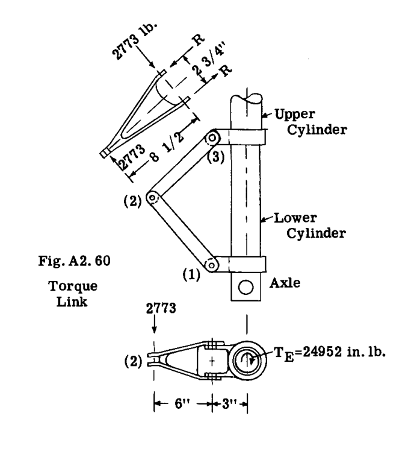  

我々の問題で伝達されるべきトルクは  $24952 \text{ in. lb}$  である。  

点 (2) におけるトルクリンクの2つのユニット間の反力  $R_a$  は、Fig. A2.60 参照、したがって  $24952 / 9 = 2773 \text{ lb}$  に等しい。  

点 (3) におけるリンク基部での反力  $R_a$  は、 $2773 \times 8.5 / 2.75 = 8560 \text{ lb}$  である。これらの反力が既知であれば、リンクユニットの強度設計と接続を行うことができる。  

### 例題 14  

Fig. A2.61 に示されている脚は、主脚の代表的なものであり、主翼の下面に取り付けられ、パワープラント・ナセル構造の下部によって提供される空間内に、線 AB のまわりを前方かつ上方に回転して格納される。オレオストラット OE は、点 E にスライド式の取り付け部を持ち、部材 AB が E で垂直荷重を受けるのを防いでいる。しかし、E のフィッティングは、オレオストラットと部材 AB の間でせん断およびトルク反力を伝達する。ブレースストラット GD, FD および CD は、各端でピン結合されており、二力部材であると想定される。  

Fig. A2.61 に示すように、不均等な車輪荷重を伴う航空機の水平着陸状態が想定されている。  

#### 解法 (SOLUTION)  

脚は支持構造の点 A, B および C に取り付けられている。脚全体を自由体として扱い、まずこれらの点における反力を計算する。Fig. A2.62 は、荷重と反力を伴う空間図を示している。A, B および C における反力は、それらの  $V$  および  $D$  成分に置き換えられている。  

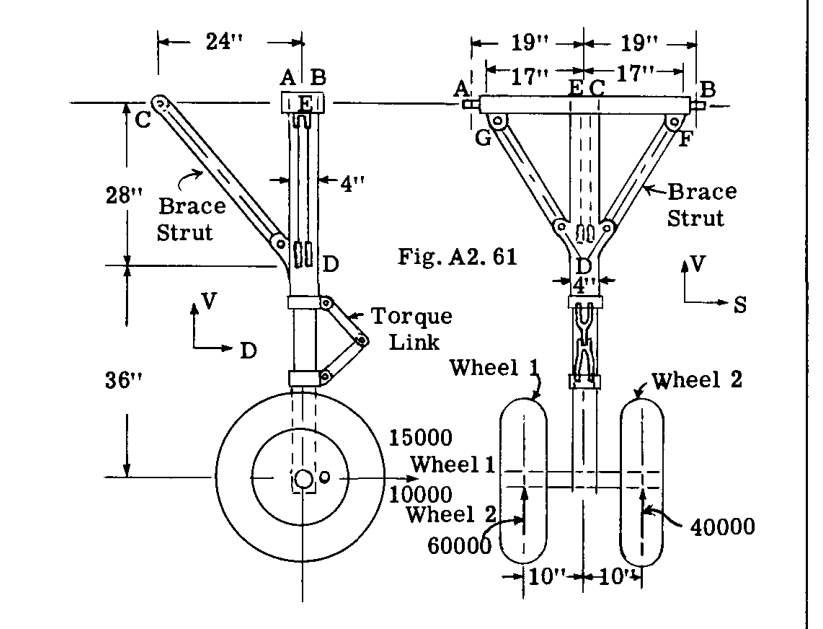  

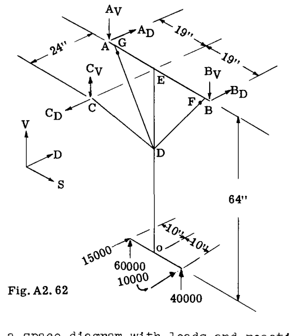  

反力  $C_V$  を求めるために、点 AB を通る  $S$  軸のまわりのモーメントをとる。  

$$ 
\sum M_{AB} = - (15000 + 10000) 64 + 24 C_V = 0 
$$ 

これより、 $C_V = 66666 \text{ lb}$ 。想定した向き（Fig. A2.62）。  

点 C における反力は、部材 CD が両端でピン結合されているため、作用線が直線 CD に沿っていなければならず、したがってストラット CD における抗力成分と荷重は幾何学的に従う。したがって、  

$$ 
C_D = 66666 (24 / 28) = 57142 \text{ lb.} 
$$ 

$$ 
C_D = 66666 (36.93 / 28) = 87900 \text{ lb. 引張} 
$$ 

 $B_V$  を求めるために、点 (A) を通る抗力軸まわりのモーメントをとる。  

$$ 
\sum M_A(D) = - 60000 \times 9 - 40000 \times 29 - 66666 \times 19 + 38 B_V = 0 
$$ 

これより、 $B_V = 78070 \text{ lb.}$   

 $A_V$  を求めるために、 $\sum V = 0$  とする。  

$$ 
\sum V = - 78070 + 60000 + 40000 + 66666 - A_V = 0 
$$ 

これより、 $A_V = 88596 \text{ lb.}$   

 $B_D$  を求めるために、点 (A) を通る  $V$  軸まわりのモーメントをとる。  

$$ 
\sum M_A(V) = 57142 \times 19 - 15000 \times 9 - 10000 \times 29 - 38 B_D = 0 
$$ 

これより、 $B_D = 17386 \text{ lb.}$   

 $A_D$  を求めるために  $\sum D = 0$  とする。  

$$ 
\sum D = - 57142 + 15000 + 10000 + 17386 + A_D = 0 
$$ 

これより、 $A_D = 14756 \text{ lb.}$   

結果をチェックするために、点 O を通る  $V$  および  $D$  軸まわりのモーメントをとる。  

$$ 
\sum M_O(V) = 5 \times 10000 + 14756 \times 19 - 17386 \times 19 = 0 \text{ (check)} 
$$ 

$$ 
\sum M_O(D) = 20000 \times 10 - 88596 \times 19 + 78070 \times 19 = 0 \text{ (check)} 
$$ 

## オレオストラット OE の反力  

Fig. A2.63 はオレオストラット OE の自由体図を示している。車輪にかかる荷重は車軸中心線から点 (O) に移されている。したがって、(O) における全  $V$  荷重は  $60000 + 40000 = 100000$ 、全  $D$  荷重は  $15000 + 10000 = 25000$  に等しい。これらの力の、(O) を通る  $V$  および  $D$  軸まわりのモーメントは、  

$$ 
M_O(V) = (15000 - 10000) 10 = 50000 \text{ in. lb.} 
$$ 

$$ 
M_O(D) = (60000 - 40000) 10 = 200000 \text{ in. lb.} 
$$ 

これらのモーメントは、Fig. A2.63 で二重矢印のベクトルで示されている。モーメントの向きは右手の親指と指の法則によって決定される。  

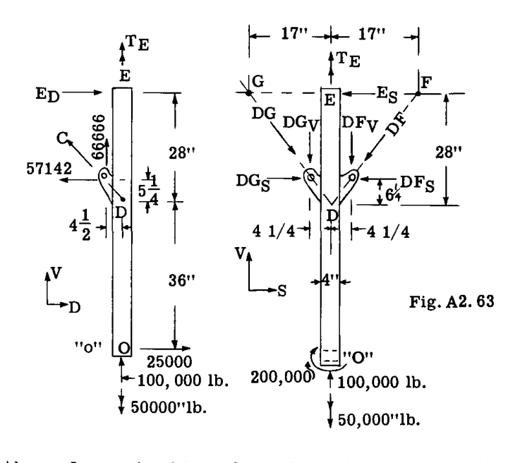  

点 E におけるフィッティングは、オレオストラットまわりの  $V$  軸まわりのモーメントまたはねじりモーメントに抵抗するように設計されている。また、せん断反力  $E_S$  および  $E_D$  を提供できるが、 $S$  または  $D$  軸まわりの曲げ抵抗は提供しない。  

未知数は力  $E_S, E_D, DF, DG$  およびモーメント  $T_E$  である。  

軸 OE まわりのモーメントをとって  $T_E$  を求める。  

$$ 
\sum M_{OE} = - 50000 + T_E = 0, \text{ これより } T_E = 50000 \text{ in. lb.} 
$$ 

点 D を通る  $D$  軸まわりのモーメントをとって  $E_S$  を求める。  

$$ 
\sum M_D(D) = 200000 - 28 E_S = 0, \text{ これより } E_S = 7143 \text{ lb.} 
$$ 

点 G を通る  $D$  軸まわりのモーメントをとって力  $DF_V$  を求める。  

$$ 
\sum M_G(D) = 200000 - 100000 \times 17 - 66666 \times 17 + 34 DF_V = 0 
$$ 

これより、 $DF_V = 77451 \text{ lb.}$   

すると、 

$$ 
DF_S = 77451 (17 / 28) = 47023 \text{ lb.} 
$$ 

$$ 
DF = 77451 (32.72 / 28) = 90503 \text{ lb.} 
$$ 

 $\sum V = 0$  として  $DG_V$  を求める。  

$$ 
\sum V = 100000 - 77451 + 66666 - DG_V = 0 
$$ 

または  $DG_V = 89215$   

すると、 

$$ 
DG_S = 89215 (17 / 28) = 54164 \text{ lb.} 
$$ 

$$ 
DG = 89215 (32.73 / 28) = 104190 \text{ lb.} 
$$ 

点 D を通る  $S$  軸まわりのモーメントをとって  $E_D$  を求める。  

$$ 
\sum M_D(S) = - 25000 \times 35 + 28 E_D = 0 
$$ 

$$ 
E_D = 31243 \text{ lb.} 
$$ 

結果はストラットの静的平衡についてチェックされる。点 (0) を通る  $D$  軸まわりのモーメントをとる。  

$$ 
\sum M_O(D) = 200000 + 54164 \times 36 - 47023 \times 36 - 7143 \times 64 = 0 \text{ (check)} 
$$ 

$$ 
\sum M_O(S) = 31243 \times 64 - 57142 \times 36 = 0 \text{ (check)} 
$$ 

## 上部部材 AB の反力  

Fig. A2.64 は、オレオストラットからの以前の反力から判明した既知の荷重を伴う部材 AB の自由体図を示している。  

未知数は  $A_D, B_D, A_V$  および  $B_V$  である。 $A$  を通る  $D$  軸まわりのモーメントをとって  $B_V$  を求める。  

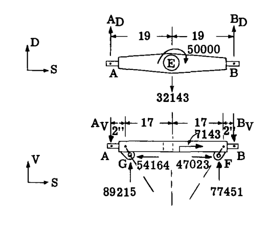  

$$ 
\sum M_A(D) = - 89215 \times 2 - 77451 \times 36 - 38 B_V = 0 
$$ 

これより、 $B_V = 78070 \text{ lb.}$   

 $\sum V = 0$  をとって  $A_V$  を求める。  

$$ 
\sum V = 89215 + 77451 - 78070 - A_V = 0 
$$ 

これより、 $A_V = 88596 \text{ lb.}$   

 $A$  を通る  $V$  軸まわりのモーメントをとって  $B_D$  を求める。  

$$ 
\sum M_A(V) = 50000 + 32143 \times 19 - 38 B_D = 0 
$$ 

これより、 $B_D = 17386 \text{ lb.}$   

 $\sum D = 0$  をとって  $A_D$  を求める。  

$$ 
\sum D = 17386 - 32143 + A_D = 0, \text{ または } A_D = 14757 \text{ lb.} 
$$ 

これら4つの反力は、脚を自由体として扱ったときに元々得られた反力と一致し、計算の数値的チェックとなる。  

脚の各部分に働く力が既知となれば、各部品の強度と剛性を設計することができる。オレオストラットには、例題 13 および Fig. A2.60 で議論したようなトルクリンクが必要となる。  

## A2.15 問題  

(1) 1から10までの番号が振られた構造物について、外部反力および内部応力に関して静定であるかどうかを判定せよ。  

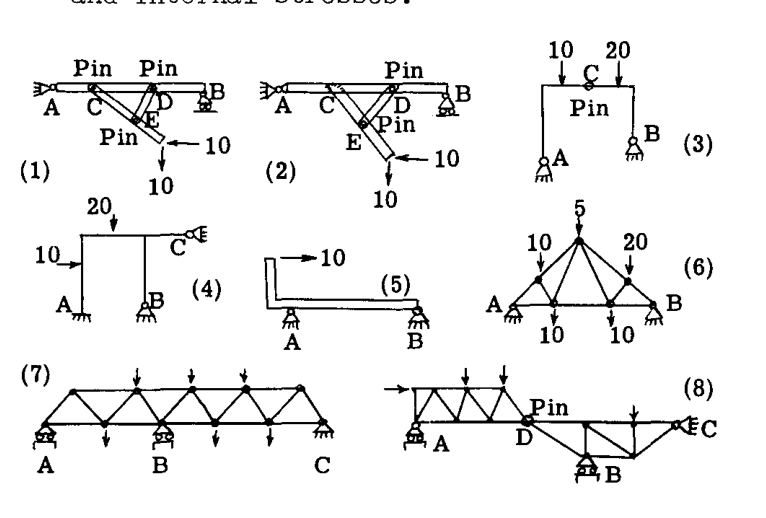  

(2) Fig. 11 から 15 に示されている構造物の反力の水平成分および垂直成分を求めよ。  

(3) Fig. 16 から 18 に示されているトラス構造の部材の軸荷重を求めよ。  

(4) Fig. 19 の構造物の部材の軸荷重を決定せよ。部材は点 A, B および C で支持部にピン結合されている。  

(5) Fig. 20 は、エンジンにプロペラを組み立てるための吊り上げ用三脚フレームを示している。ホイストに  $1000 \text{ lb}$  の荷重がかかっている場合の、フレーム内の荷重を求めよ。  

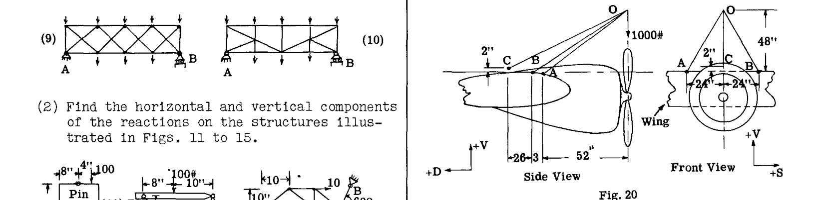  

(6) Fig. 21 は、外部ブレース付き単葉機の主翼構造を示している。以下の荷重に対して、揚力トラスおよび抗力トラスのすべての部材の軸荷重を決定せよ。  

前部ビーム揚力荷重 =  $30 \text{ lb/in.}$ （上向き）  
後部ビーム揚力荷重 =  $24 \text{ lb/in.}$ （上向き）  
翼抗力荷重 =  $8 \text{ lb/in.}$ （後向き）  

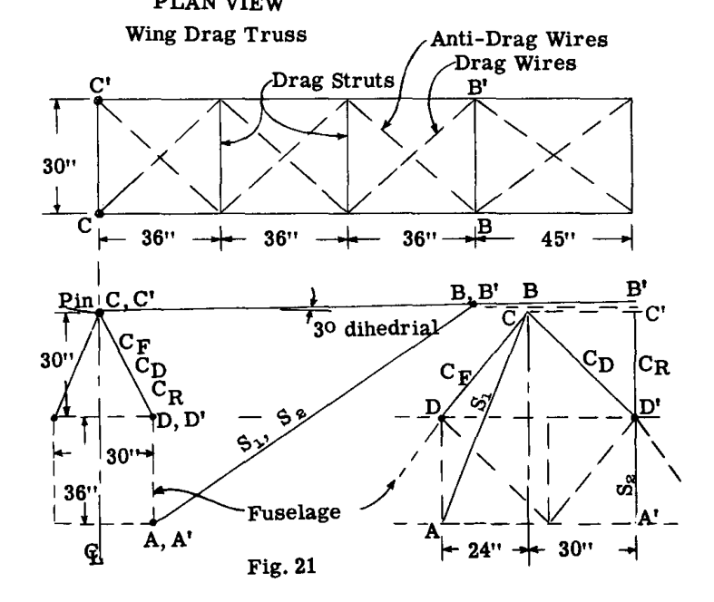  

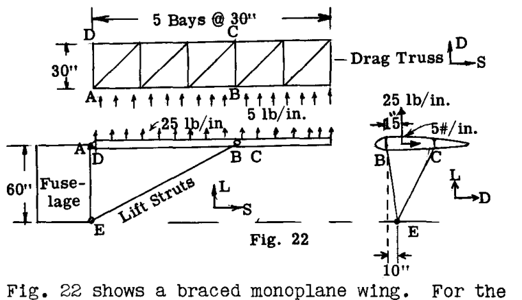  

Fig. 22 はブレース付き単葉機主翼を示している。与えられた空気荷重に対して、揚力トラスおよび抗力トラス部材の軸荷重を求めよ。抗力トラスの抗力反力は点 A で受け持たれる。  

(8) Fig. 23 の脚構造の点 A および B におけるフィッティングは、 $V, D, S$  反力および  $D$  および  $V$  軸まわりのモーメントに抵抗する。与えられた車輪荷重に対して、A および B における反力と部材 CD の荷重を求めよ。  

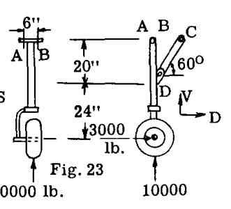  

(9) Fig. 24 の脚では、ブレース部材 BC および BF は二力部材である。点 E のフィッティングは  $V, D, S$  反力に抵抗を提供するが、 $V$  軸まわりのモーメント抵抗のみを提供する。与えられた車輪荷重に対して、E における反力および部材 BF と BC の荷重を求めよ。  

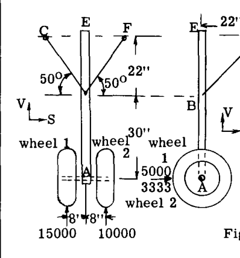  

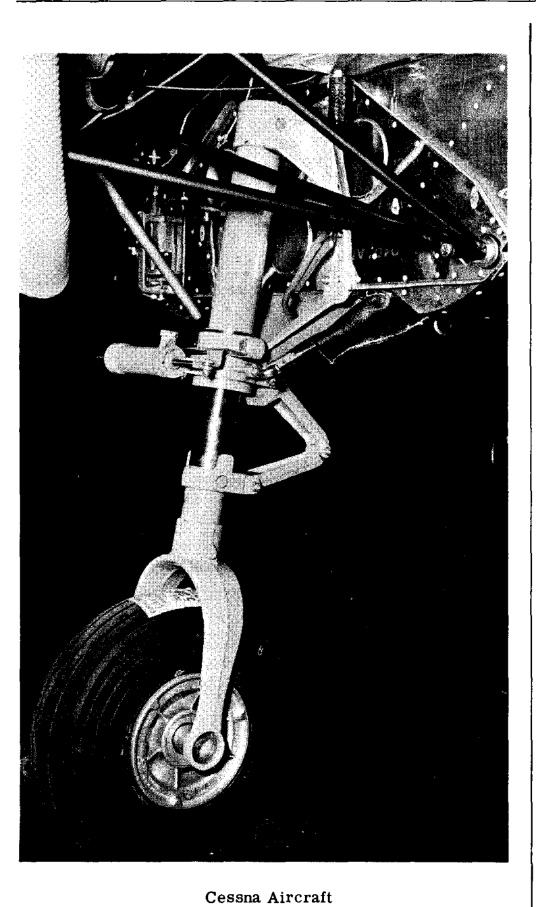  

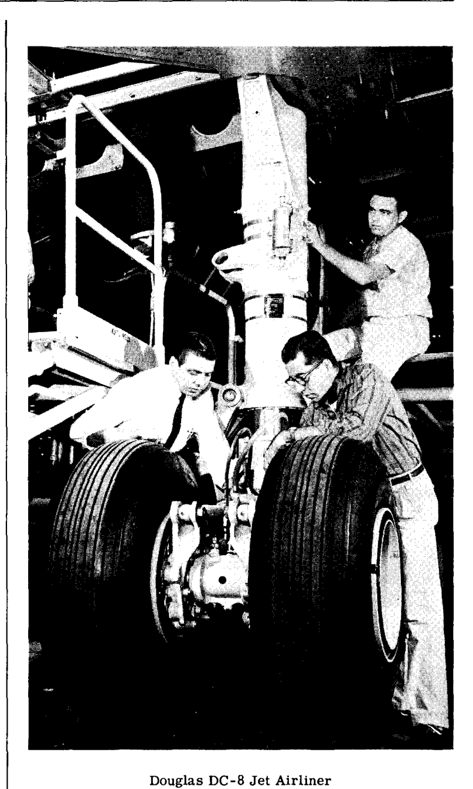