# 第A3章  
# 断面の特性 - 図心、慣性モーメントなど  

### A3.1 緒言  
工学計算において、重心（center of gravity）と慣性モーメント（moment of inertia）という2つの用語は常に使用されている。したがって、これらの用語についての簡潔な復習が必要である。  

### A3.2 図心、重心  
線、面積、体積、または質量の図心（centroid）とは、線、面積、体積、または質量の全体がそこに集中していると考えられ、かつ、その真の、あるいは自然な方法で分布している場合と同じモーメントをある軸に対して持つような点のことである。この一般的な関係は、次のようなモーメントの原理によって表すことができる。  

線：  $\bar{x} L = \sum Lx$ 、したがって  $\bar{x} = \frac{\sum Lx}{L} = \frac{\int x dL}{L}$   
面積：  $\bar{x} A = \sum ax$ 、したがって  $\bar{x} = \frac{\sum ax}{A} = \frac{\int x dA}{A}$   
体積：  $\bar{x} V = \sum Vx$ 、したがって  $\bar{x} = \frac{\sum Vx}{V} = \frac{\int x dV}{V}$   
質量：  $\bar{x} M = \sum mx$ 、したがって  $\bar{x} = \frac{\sum mx}{M} = \frac{\int x dM}{M}$   

幾何学的な図形が線または平面に対して対称である場合、その図形の図心は与えられた線または平面上にある。これは、線または平面の反対側にある図形の各部分のモーメントが、数値的には等しいが符号が逆であるという事実から明らかである。図形が2つの線または平面に対して対称である場合、図心は2つの線または2つの平面の交点にあり、同様に、図形が3つの対称面を持つ場合、図心は3つの面の交点にある。  

### A3.3 慣性モーメント  
慣性モーメントという用語は、力学において、面積、体積、質量の2次モーメントを表す多くの数学的表現に適用される。例えば、  

$$
\int y^2 dA, \int r^2 dV, \int r^2 dM
$$

などである。  

### A3.4 面積の慣性モーメント  
面積に適用される場合、慣性モーメントという用語には物理的な意味はないが、非常に多くの工学上の問題や計算に現れる量である。しかし、これは面積全体に適用される一様に変化する力の全回転モーメントを決定する際に、面積そのものの影響を示す因子と考えることができる。  

Fig. A3.1を、3つの座標軸  $ox$ 、 $oy$ 、 $oz$  に対する任意の平面領域とし、 $ox$  と  $oy$  がその面積の平面内にあるものとする。  
 $dA$  を、図に示すように座標  $x, y$  および  $r$  を持つ微小面積とする。  

すると、  
 $I_x = \int y^2 dA$ 、 $I_y = \int x^2 dA$ 、 $I_z = \int r^2 dA$   
ここで、 $I_x$ 、 $I_y$ 、および  $I_z$  は、それぞれ  $xx$ 、 $yy$ 、および  $zz$  軸まわりの面積の慣性モーメントである。  

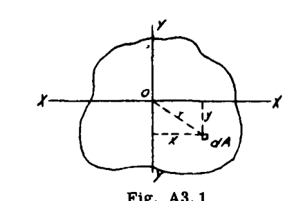  

### A3.5 極慣性モーメント  
Fig. A3.1において、 $Z$  軸まわりの慣性モーメント  $I_z = \int r^2 dA$  は極慣性モーメント（polar moment of inertia）と呼ばれ、その表面内の一点に関する面積の慣性モーメントとして定義できる。  
 $r^2 = x^2 + y^2$  (Fig. A3.1) なので、  
 $I_z = \int (y^2 + x^2) dA = I_x + I_y$   
すなわち、極慣性モーメントは、面積の平面内にあり、互いに直角で、極軸と平面の交点を通る任意の2つの軸に関する慣性モーメントの和に等しい。  

### A3.6 回転半径  
立体の回転半径（radius of gyration）とは、慣性軸から、もしその全質量をそこに集中させることができたとしても、その慣性モーメントが変わらないような点までの距離のことである。  

したがって、  $\int r^2 dM = \rho^2 M$  であり、ここで  $\rho$  は回転半径である。  
 $\int r^2 dM = I$  なので、  $I = \rho^2 M$  または  $\rho = \sqrt{\frac{I}{M}}$   

同様に、面積の場合、  
 $I = \rho^2 A$  または  $\rho = \sqrt{\frac{I}{A}}$   

### A3.7 平行軸の定理  
Fig. A3.2において、 $I_{\bar{y}}$  を図心軸  $y-y$  に関する面積の慣性モーメントとし、軸  $y_1 y_1$  に関する慣性モーメントを求めるとする。 $y_1 y_1$  は  $yy$  に平行である。 $y_1 y_1$  から距離  $x + d$  にある微小面積  $dA$  を考える。  

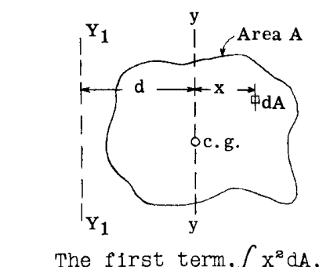  

すると、 $I_{y_1} = \int (d + x)^2 dA$   
 $= \int x^2 dA + 2d \int x dA + d^2 \int dA$   

最初の項  $\int x^2 dA$  は、図心軸  $y-y$  に関する物体の慣性モーメントを表し、記号  $\bar{I}$  で与えられる。2番目の項は、 $y-y$  が物体の図心軸であるため  $\int x dA$  がゼロとなるので、ゼロである。最後の項  $d^2 \int dA = Ad^2$  すなわち、物体の面積に軸  $yy$  と  $y_1 y_1$  の間の距離の2乗を掛けたものである。  

したがって、一般的には、  
 $I = \bar{I} + Ad^2$   
この式は、面積の平面内の任意の軸に関する面積の慣性モーメントは、平行な図心軸に関する慣性モーメントに、面積と2つの軸の間の距離の2乗の積を加えたものに等しいことを示している。  

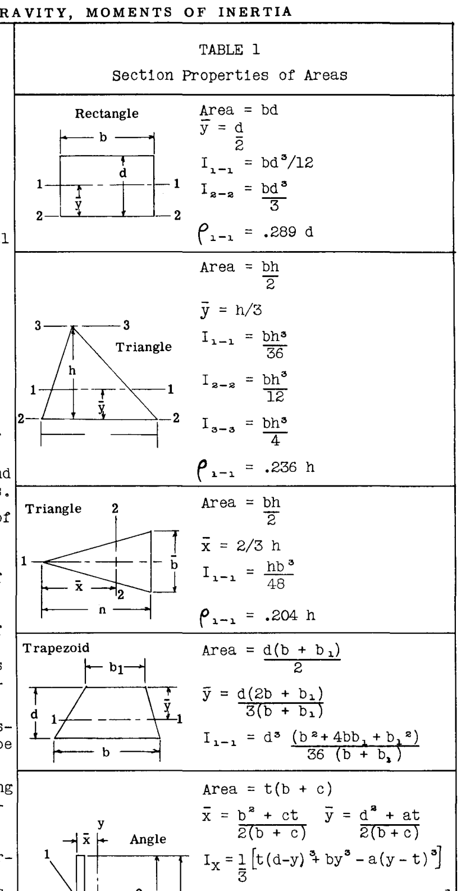  

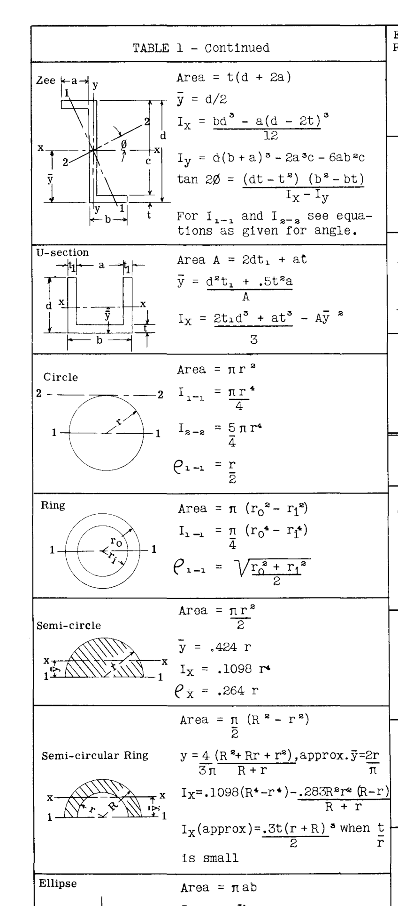  

**質量に対する平行軸の定理**： 面積の代わりに物体の質量を考慮する場合、平行軸は次のように書ける。  
 $I = \bar{I} + Md^2$   
ここで、 $M$  は物体の質量を指す。  

### A3.7a 質量の慣性モーメント  
粒子の質量と、線または平面からの距離の2乗の積は、その線または平面に関する粒子の質量の慣性モーメントと呼ばれる。したがって、  
 $I = \sum mr^2$   
総和が定積分で表される場合、式は次のように書ける。  
 $I = \int r^2 dM$   

**航空機の慣性モーメント**：  
飛行および着陸の両方の条件において、航空機は角加速度を受ける可能性がある。加速度の大きさと、加速度に抵抗する質量慣性力の分布と大きさを決定するために、特定の航空機の応力解析を行う際には、一般に3つの座標軸に関する航空機の慣性モーメントが必要となる。  
航空機の重心を通る座標軸  $X, Y, Z$  に関する航空機の質量慣性モーメントは、次のように表すことができる。  

 $I_x = \sum wy^2 + \sum wz^2 + \sum \Delta I_x$   
 $I_y = \sum wx^2 + \sum wz^2 + \sum \Delta I_y$   
 $I_z = \sum wx^2 + \sum wy^2 + \sum \Delta I_z$   

ここで、 $I_x$ 、 $I_y$ 、および  $I_z$  は、一般に航空機のロール、ピッチ、およびヨー慣性モーメントと呼ばれる。  
 $w$  = 航空機内の各項目の重量  
 $x, y, z$  = 航空機の重心を通る軸から各重量  $w$  までの距離  
各式の最後の項は、各項目の自身の  $X, Y, Z$  図心軸に関する慣性モーメントの総和である。  
 $w$  がポンドで、距離がインチで表される場合、慣性モーメントはポンド・インチの2乗の単位で表され、これを  $1/32.16 \times 144$  を掛けることでスラグ・フィートの2乗に変換できる。  

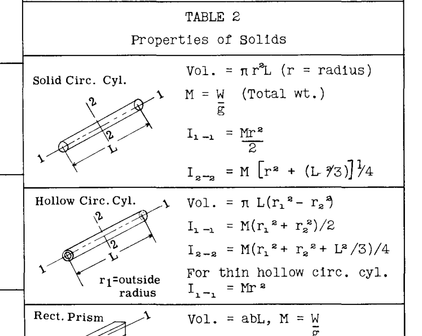  

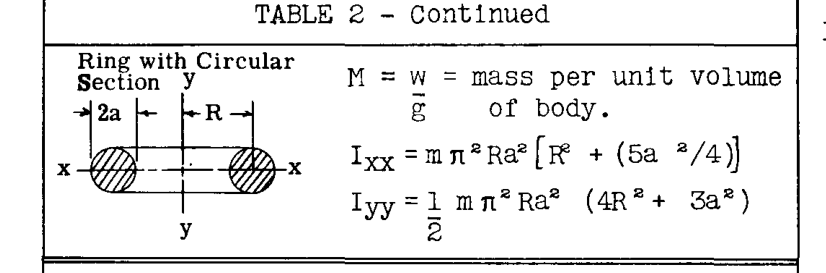  

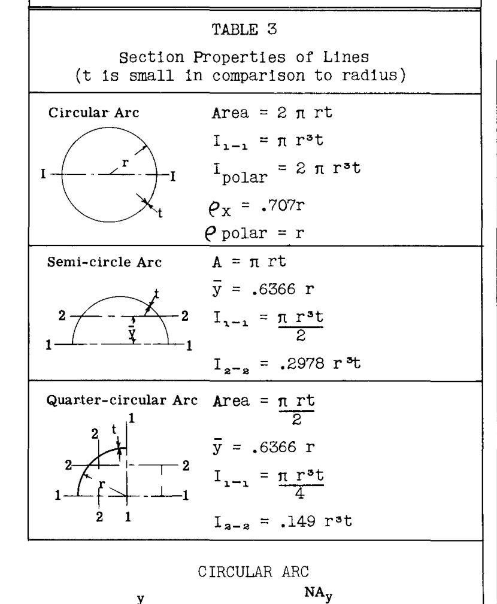  

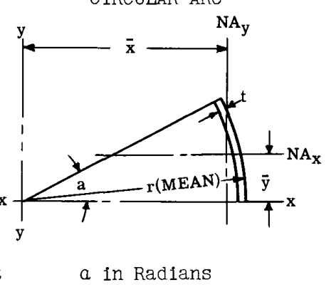  

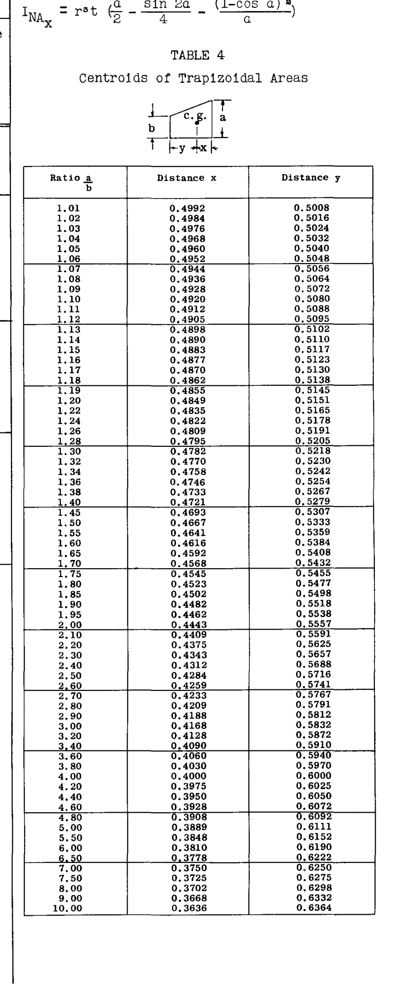  

**例題 1**： Fig. A3.3に示す航空機の総重量と重心を決定せよ。航空機の重量は10項目または重量グループに分解されており、それぞれの図心（c.g.）位置は記号 + で示されている。  

**解法**： 航空機の重心は、2つの直交する軸に対して配置される。この例では、プロペラの中心線を通る垂直軸を水平方向の基準軸とし、推力線（thrust line）を垂直方向の基準軸として選択する。解くべき一般的な式は以下の通りである。  
 $\bar{x} = \frac{\sum wx}{\sum w} =$  基準軸  $Z-Z$  から航空機の重心までの距離  
 $\bar{y} = \frac{\sum wy}{\sum w} =$  基準軸  $X-X$  から航空機の重心までの距離  

Table 4に必要な計算が示されている。これより、  
 $\bar{x} = \frac{417180}{3150} = 133.3$  インチ（プロペラ中心線より後方）  
 $\bar{y} = \frac{5480}{3150} = -1.74$  インチ（推力線より下方）  

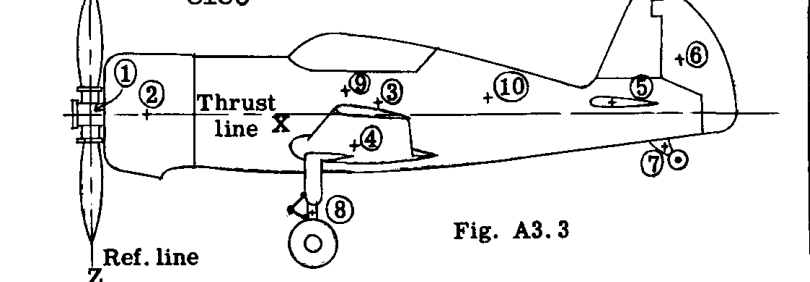  

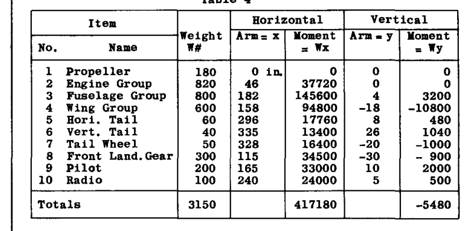  

**例題 2**： Fig. A3.4に示す面積について、水平方向の図心軸に関する慣性モーメントを求めよ。  

**解法**： まず、水平方向の基準軸に関する慣性モーメントを求める。この解法では、図のように底部を通る軸  $x'x'$  を任意の軸として採用した。この慣性モーメントが分かれば、図心軸への移動を行うことができる。Table 5は、軸  $x'x'$  に関する慣性モーメントの計算詳細を示している。簡単のため、断面をA, B, C, D, Eの5つの部分に分割した。  
 $I_{cx}$  は、考慮されている特定の部分の図心  $x$  軸に関する慣性モーメントである。  
軸  $x'x'$  から図心水平軸までの距離  $= \bar{y} = \frac{\sum Ay}{\sum A} = \frac{17.97}{6.182} = 2.91$  インチ  

平行軸の定理により、慣性モーメントを軸  $x'x'$  から図心軸  $xx$  に移動させる。  
 $I_{xx} = I_{x'x'} - A \bar{y}^2 = 79.47 - 6.18 \times 2.91^2 = 27.2 \text{ in}^4$   
回転半径  $\rho_{xx} = \sqrt{\frac{I_{xx}}{A}} = \sqrt{\frac{27.2}{6.18}} = 2.1$  インチ  

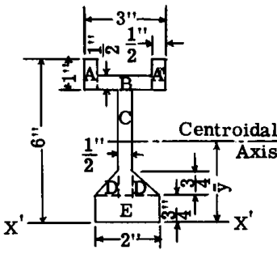  

**例題 3**： Fig. A3.5に示すストリンガー断面の水平図心軸に関する慣性モーメントを求めよ。  

**解法**： 図のように水平基準軸  $x'x'$  を仮定する。慣性モーメントをまずこの軸に関して計算し、次に図心軸  $xx$  に移動させる。Table 6を参照。  

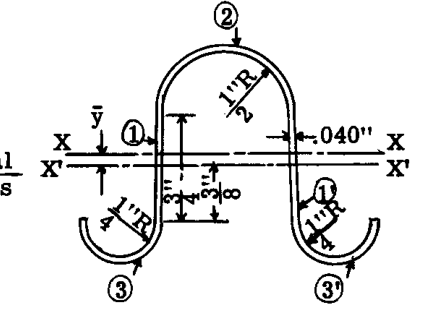  

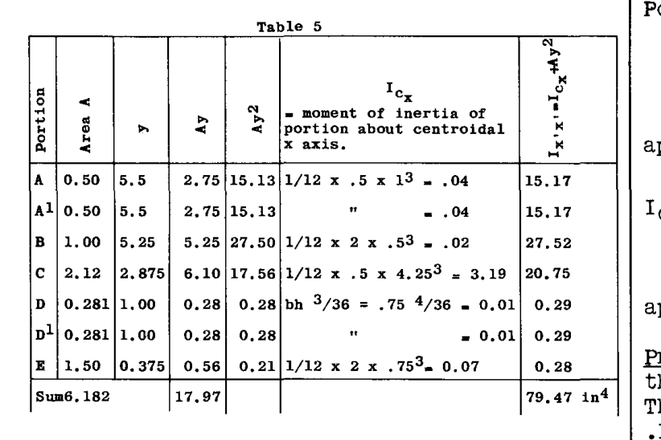  

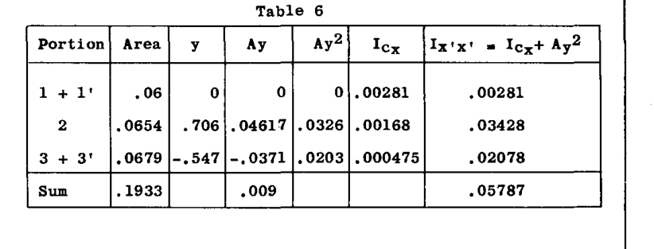  

**例題 4**： Fig. A3.5aにおけるフライホイールの回転軸に関する慣性モーメントを求めよ。材料はアルミニウム合金鋳物（重量 = 0.1 lb/cu. in.）である。  

**解法**： スポークは細長い円形ロッドとして、リムとハブは中空円筒として扱うことができる（Table 2参照）。  

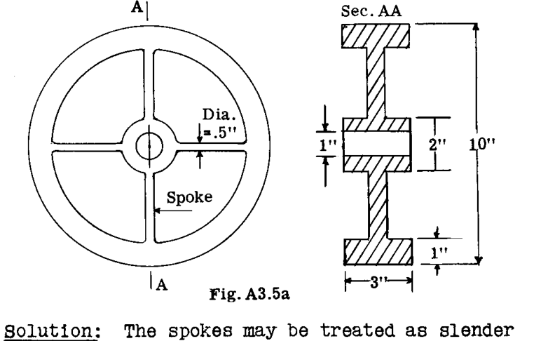  

**例題 5**： 航空機の慣性モーメント。  
航空機の総重量図心を通る座標軸に関する慣性モーメントを計算するために、航空機重量とその分布の分解が必要であり、これは航空機の重量バランス見積もりから入手可能である。  

Table 6aは航空機の慣性モーメントの完全な計算を示している。この表はN.A.C.A. テクニカルノート #575「設計データからの航空機慣性モーメントの推定」から引用したものである。  

**表の解説**： Fig. A3.5bは、選択された基準平面と軸を示している。これらの軸に関する慣性モーメントが決定された後、平行軸の定理を使用して、航空機の重心を通る平行な軸に関する値が求められる。  

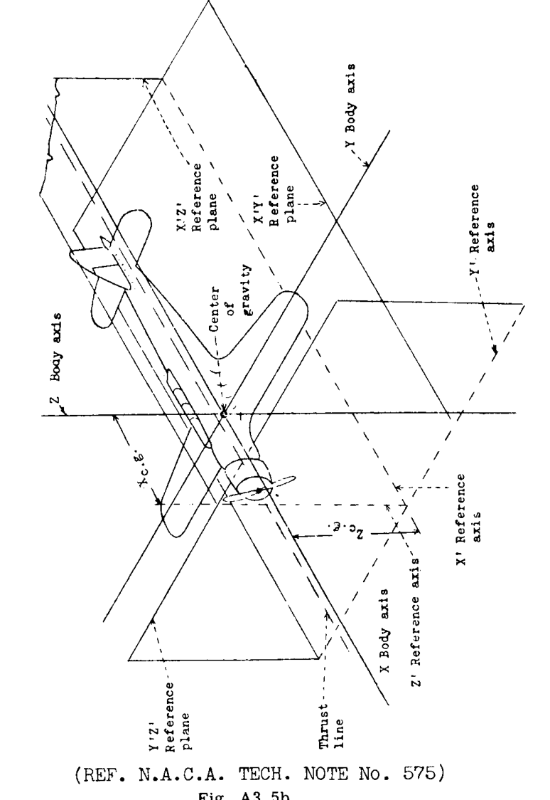  

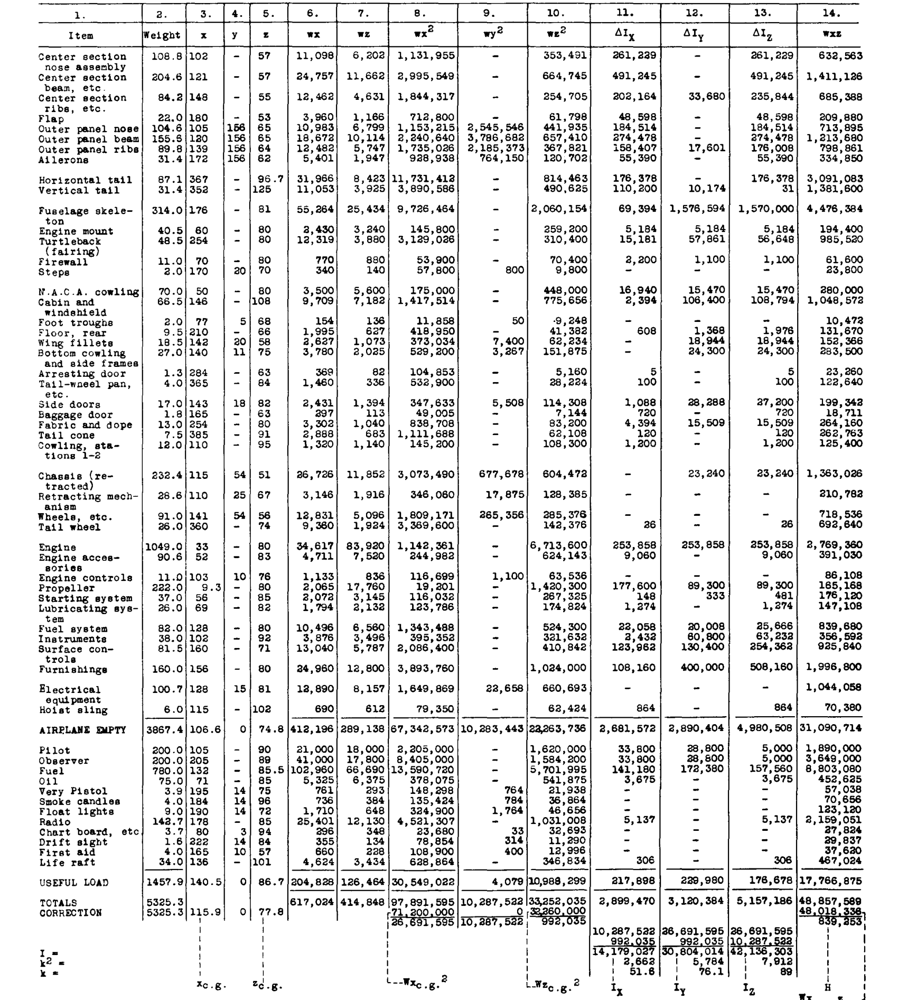  

主慣性モーメントを決定するために、基準軸に関する重量の慣性相乗モーメントが必要である。Column (14)は基準軸に関する値を与えている。相乗モーメントを航空機の図心軸に移動させるために、平行軸の定理を使用する。したがって、  
 $\sum wxz_{c.g.} = \sum wxz (\text{Ref. axes}) - \sum w \bar{x} \bar{z} = 48,857,589 - 5325.3 \times 115.9 \times 77.8 = 839,253 \text{ lb. in}^2$   

すべての値を  $\text{slug ft}^2$  に縮小するには、  $\frac{1}{32.17} \times \frac{1}{144}$  を掛ける。  
したがって、  $I_x = 3061, I_y = 6680, I_z = 9096, I_{xz} = 181$   
図心座標軸に関する慣性特性が得られれば、主軸に関する慣性モーメントは面積について説明したのと同様の方法で決定される（A3.13参照）。  
 $X$  軸と  $Z$  軸の間の角度  $\phi$  は次のように与えられる。  
 $\tan 2\phi = \frac{2I_{xz}}{I_z - I_x} = \frac{2 \times 181}{9096 - 3061} = .05998$  したがって  $\phi = 1^\circ 43'$   

### A3.8 慣性相乗モーメント  
様々な工学問題、特に非対称断面の慣性モーメントの計算を伴う問題では、  $\int xy dA$  という表現が使用される。この表現は、直交軸  $x$  および  $y$  に関する面積の慣性相乗モーメント（product of inertia）と呼ばれる。  

面積の慣性相乗モーメントは記号  $I_{xy}$  で与えられ、したがって、  
 $I_{xy} = \int xy dA$  --- (1)  
単位は、慣性モーメントと同様に、長さの4乗（インチの4乗やフィートの4乗）で表される。 $x$  と  $y$  は正または負のいずれの値も取りうるため、 $I_{xy}$  項はゼロ、あるいは正または負の値のいずれかになる。  

**立体の慣性相乗モーメント**： 立体の慣性相乗モーメントは、それを構成すると想定される各微小部分の重量に、その部分の与えられた点を通る3つの座標面のうちの2つからの距離の積を掛けたものの和である。  
したがって、平面  $X$  および  $Y$  に関しては、  
 $I_{xy} = \int xy dW, I_{xz} = \int xz dW, I_{yz} = \int yz dW$   

### A3.9 対称軸に対する慣性相乗モーメント  
面積が2つの直交する軸に対して対称である場合、それらの軸に関する相乗モーメントはゼロである。これは、対称軸が図心軸  $x$  および  $y$  であるという事実から導かれる。  

### A3.10 平行軸の定理  
定理は、「任意の共面直交軸ペアに関する面積の慣性相乗モーメントは、平行な図心軸ペアに関する面積の慣性相乗モーメントに、面積と与えられた軸ペアからの図心の距離の積を加えたものに等しい」と述べている。すなわち式で表すと、  
 $I_{xy} = \bar{I}_{xy} + A \bar{X} \bar{Y}$  --- (2)  

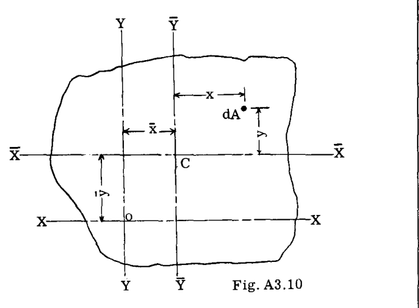  

### A3.11 傾斜軸に関する慣性モーメント  
航空機の構造では、翼断面（エアフォイル）形状が一般に非対称であるため、非対称なビーム断面が非常によく見られる。したがって、このような断面を扱う際の一般的な手順は、まず何らかの直交軸のセットに関する慣性モーメントを求め、次に別の傾斜した軸に移動させることである。Fig. A3.11において、軸  $X_1 X_1$  に関する面積の慣性モーメントは、  
 $I_{x_1} = \int y_1^2 dA = \int (y \cos \phi - x \sin \phi)^2 dA$   
 $= I_x \cos^2 \phi + I_y \sin^2 \phi - 2I_{xy} \sin \phi \cos \phi$  --- (3)  
同様に、次の式も導出できる。  
 $I_{y_1} = I_x \sin^2 \phi + I_y \cos^2 \phi + 2I_{xy} \sin \phi \cos \phi$  --- (4)  

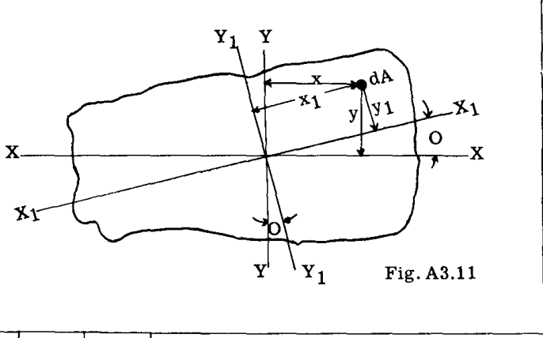  

### A3.12 慣性相乗モーメントがゼロになる軸の位置  
式 (3) と (4) を加算すると、次のようになる。  
 $I_{x_1} + I_{y_1} = I_x + I_y$  --- (5)  
すなわち、交点を通るすべての直交軸ペアに関する面積の慣性モーメントの和は一定である。  
Fig. A3.11において、 $I_{x_1 y_1} = I_{xy} \cos 2\phi + \frac{1}{2} (I_x - I_y) \sin 2\phi$   
したがって、  $I_{x_1 y_1}$  がゼロになるのは、  
 $\tan 2\phi = \frac{2I_{xy}}{I_y - I_x}$  --- (6)  

### A3.13 主軸  
非対称な曲げを伴う問題では、主軸（principal axis）と呼ばれる特定の軸に関する面積の慣性モーメントが頻繁に使用される。面積の主軸とは、その軸に関する慣性モーメントが、図心を通る他のどの軸よりも最大または最小になるような軸のことである。慣性相乗モーメントがゼロになる軸が主軸である。  

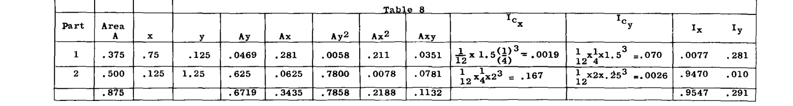  

**例題 4**： Fig. A3.12に示すアングルの、図心を通る主軸に関する慣性モーメントを求めよ。  

**解法**： Fig. A3.12に示すように基準軸  $X$  と  $Y$  を仮定し、慣性モーメントをまずこれらの軸に関して計算する。Table 8に計算結果を示す。角度は2つの部分(1)と(2)に分けられる。  

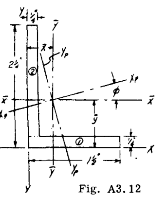  

**例題 5**： Fig. A3.13は、典型的な分散型フランジ・2セル翼ビーム断面を示している。上下面はZおよびバルブアングル断面によって補強されている。主軸に関する断面の慣性モーメントを求めよ。  

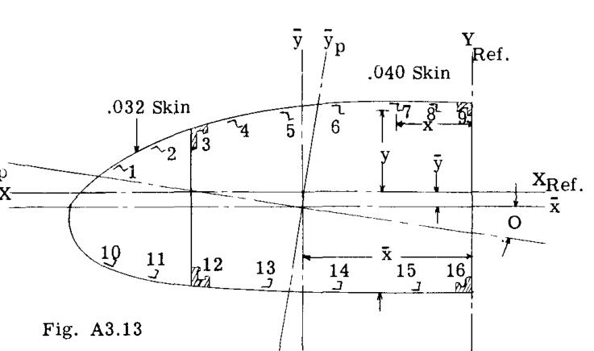  

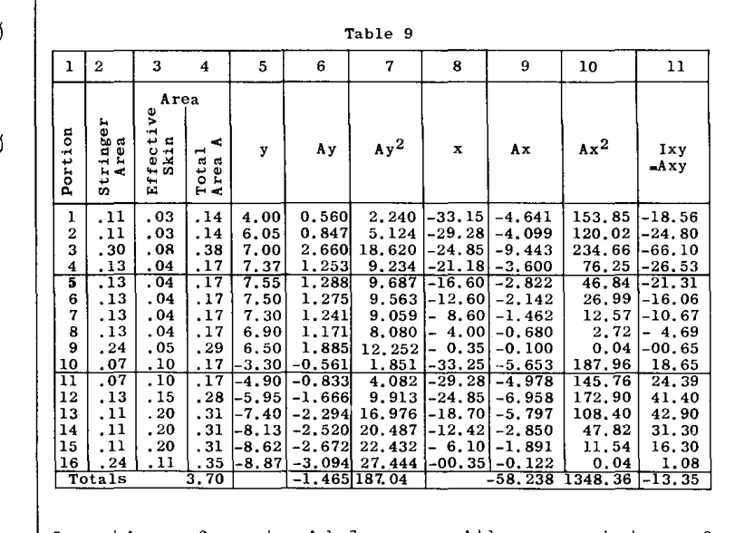  

### A3.14 代表的な航空機構造断面の特性  
Table A3.10からA3.15、およびChart A3.1は、航空機に共通するいくつかの構造形状の断面特性を示している。  

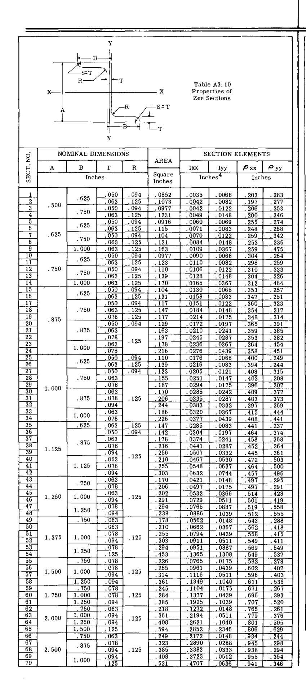  

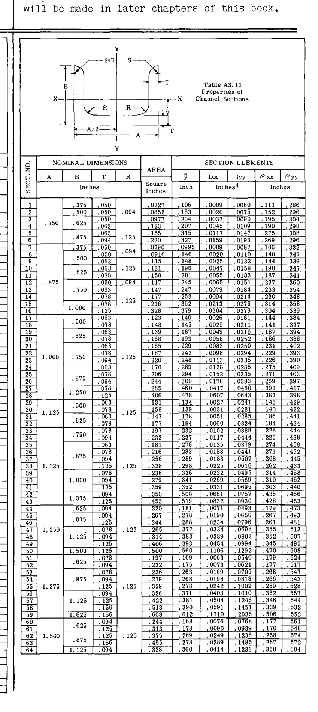  

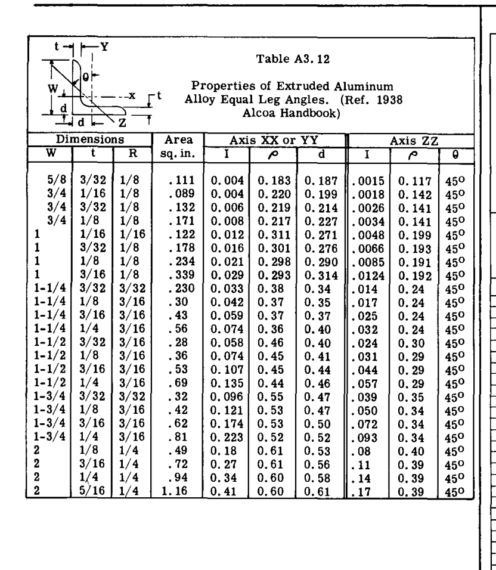  

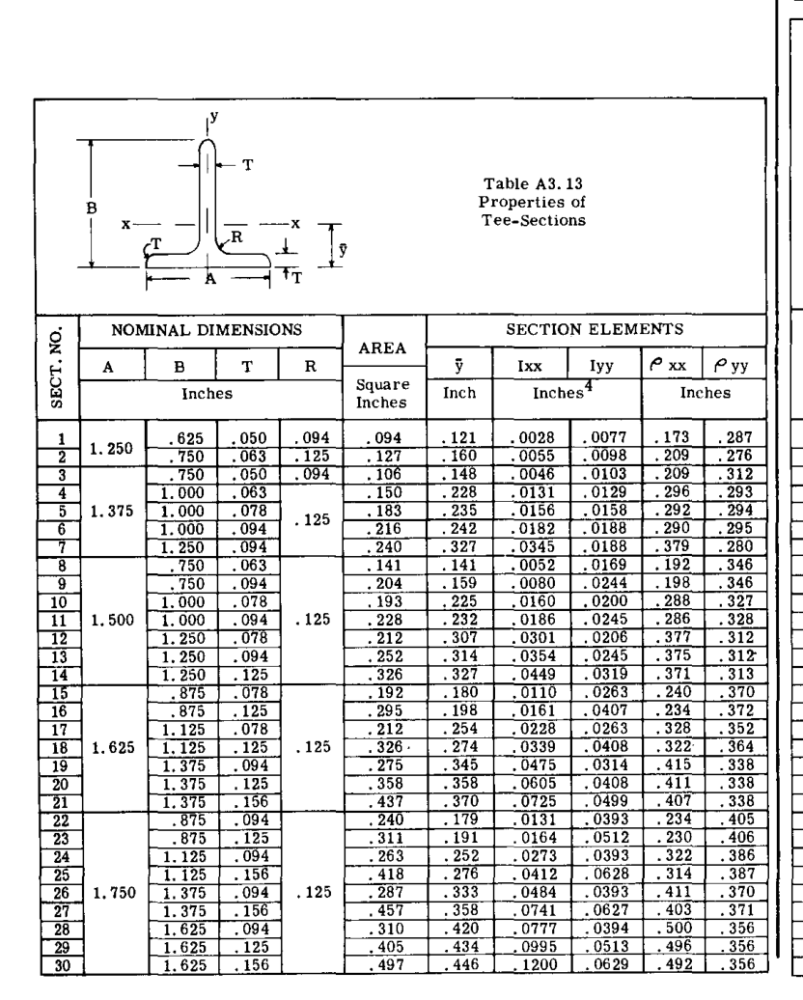  

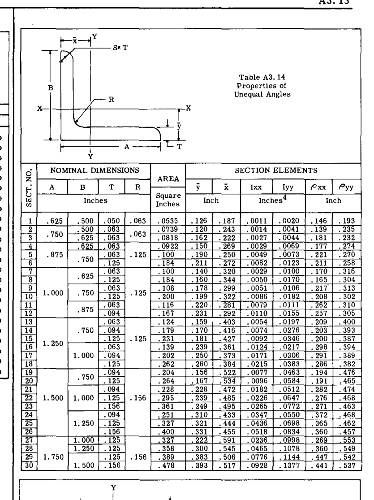  

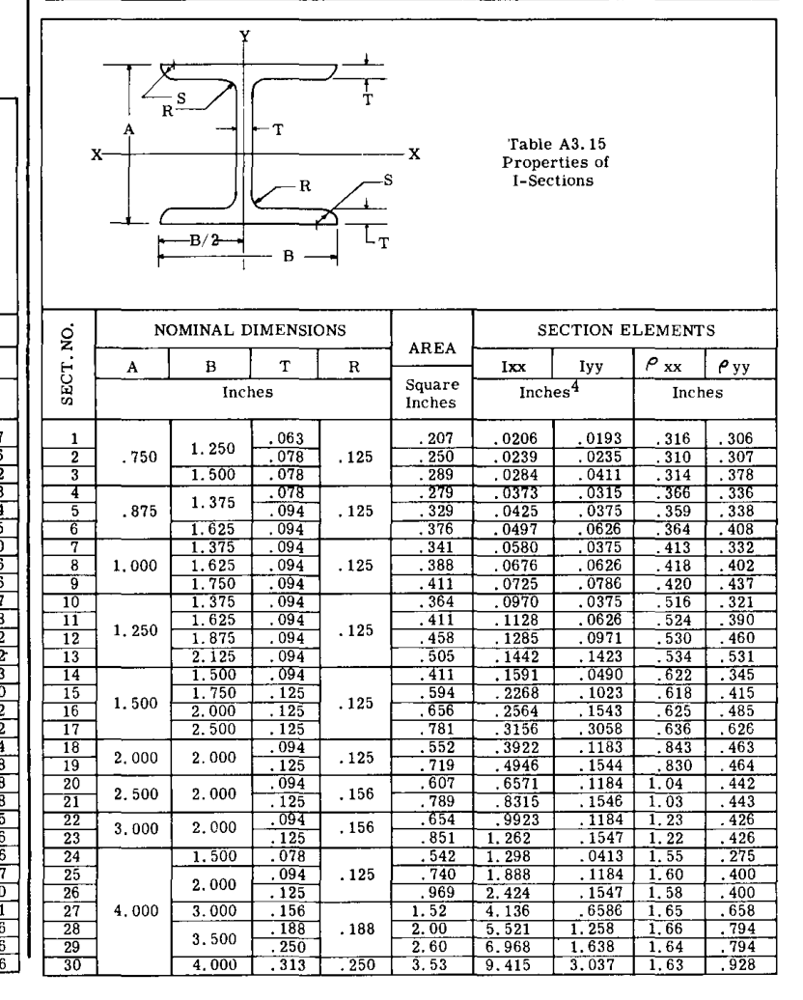  

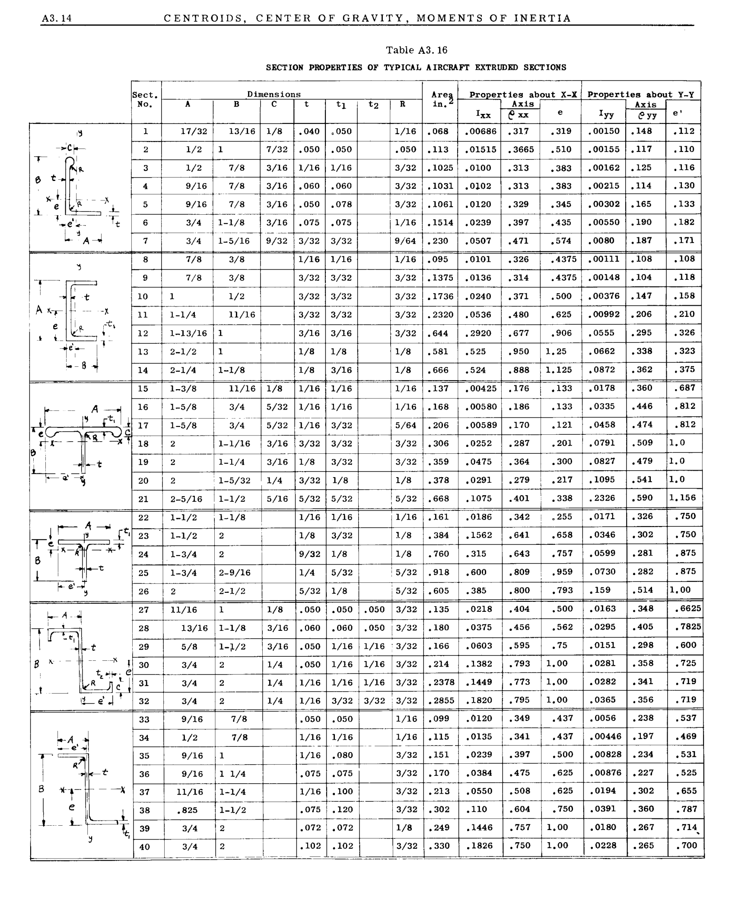  

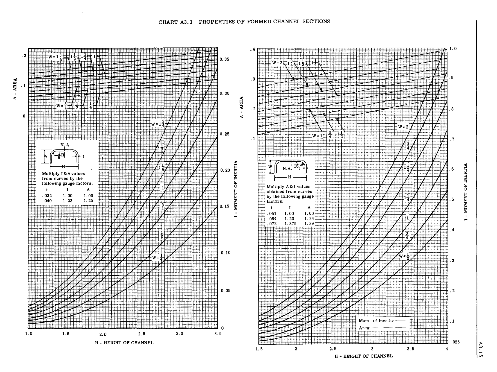  

### A3.15 問題  
(1) Fig. A3.14の断面について、各主軸  $X_p$  および  $Z_p$  に関する慣性モーメントを求めよ。  
(2) Fig. A3.15の断面について、主軸に関する慣性モーメントを計算せよ。  

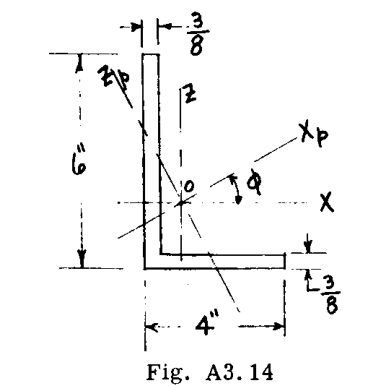 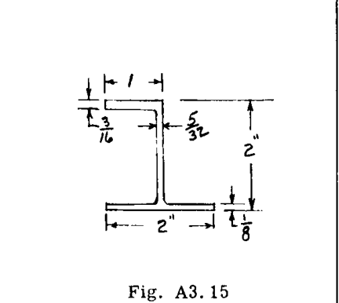  

(3) Fig. A3.16は、6本の縦通材（ストリンガー）を持つボックス型ビーム断面を示している。以下の仮定に基づき、ビーム断面の主軸に関する慣性モーメントを求めよ。  
(a) ビームが上方に曲がり、上部が圧縮、下部が引張を受けると仮定する。したがって、上面のシートは圧縮応力に対してほとんど抵抗を持たないため無視する。下面のシートは引張を受けるため有効である。計算の簡略化のため、垂直ウェブは無視する。  
(b) (a)の条件を逆転させ、上面を引張、下面を圧縮とする。  

(4) Fig. A3.17の3本ストリンガー単セルボックスビーム断面について、主軸に関する慣性モーメントを計算せよ。ウェブまたは壁材料はすべて無効であると仮定する。  

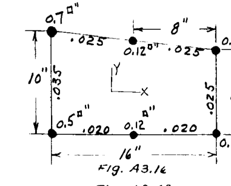 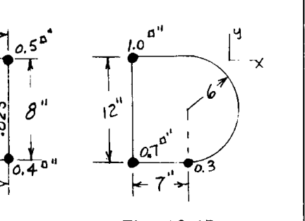  

(5) Fig. A3.18のビーム断面について、4本のストリンガーのみが有効な材料であると仮定して、主軸に関する慣性モーメントを計算せよ。  

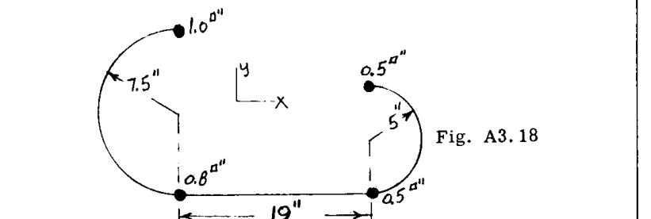  

(6) Fig. A3.19は、下面に切り欠きのある翼ビーム断面を示している。8本のストリンガーのみが有効な材料であると仮定して、主軸に関する慣性モーメントを求めよ。  

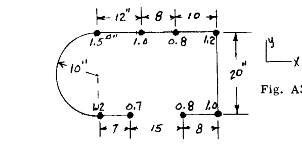  

(7) Fig. A3.20は3セル多フランジビームを示している。ビーム上面の7本のフランジ部材はそれぞれ0.3 sq. in.の面積を持ち、底面スキンのフランジ部材はそれぞれ0.2 sq. in.の面積を持つ。底面スキンの厚さは0.03インチである。フランジ部材と底面スキンが有効な材料を構成すると仮定して、主軸に関する慣性モーメントを計算せよ。  

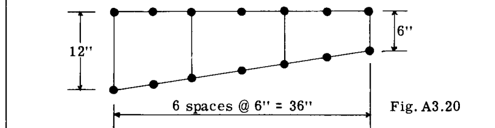  

(8) Fig. A3.21は小型胴体の断面を示している。破線はドアによる構造の切り欠きを表している。13本のストリンガーがそれぞれ0.1 sq. in.の面積を持つと仮定せよ。胴体スキンは無効であるとする。有効断面の主軸に関する慣性モーメントを計算せよ。  

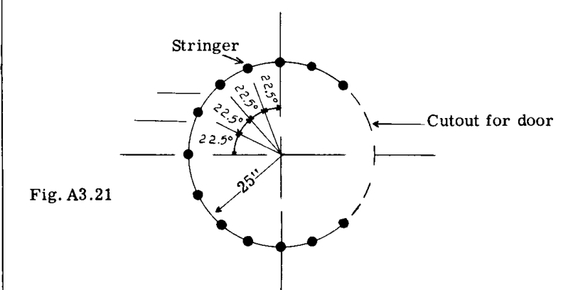