# 第 A3 章  
# 断面特性 - 形心  
# 慣性モーメントなど  

## A3.1 はじめに  
工学計算において、重心（center of gravity）と慣性モーメント（moment of inertia）という2つの用語は絶えず使用されている。したがって、これらの用語についての簡潔な復習を行うことは適切である。  

## A3.2 形心、重心  
線、面積、体積、または質量の形心（centroid）とは、その線、面積、体積、または質量の全体がそこに集中していると考えたときに、実際の分布状態と同じ軸に対するモーメントを持つ点のことである。この一般的な関係は、モーメントの原理によって次のように表すことができる。  

線の場合：  $X L = \sum L x$  、したがって  $\bar{x} = \frac{\sum L x}{L} = \frac{\int x dL}{L}$   

面積の場合：  $X A = \sum a x$  、したがって  $\bar{x} = \frac{\sum a x}{A} = \frac{\int x dA}{A}$   

体積の場合：  $X V = \sum V x$  、したがって  $\bar{x} = \frac{\sum V x}{V} = \frac{\int x dV}{V}$   

質量の場合：  $X M = \sum m x$  、したがって  $\bar{x} = \frac{\sum m x}{M} = \frac{\int x dM}{M}$   

幾何学的図形が直線または平面に対して対称である場合、その図形の形心はその直線または平面上にある。これは、図形の反対側にある各部分のモーメントが、数値は等しいが符号が反対であるという事実から明らかである。図形が2つの直線または平面に対して対称である場合、図形の形心はそれら2つの直線または平面の交点に位置する。同様に、図形が3つの対称面を持つ場合、形心はそれら3つの面の交点に位置する。  

## A3.3 慣性モーメント  
慣性モーメントという用語は、力学において、面積、体積、および質量の2次モーメントを表す多くの数学的表現に適用される。例えば、以下の通りである。  

$$ 
\int y^2 dA, \int r^2 dV, \int r^2 dM \text{ など} 
$$ 

## A3.4 面積の慣性モーメント  
面積に適用される場合、慣性モーメントという用語自体には物理的な意味はないが、非常に多くの工学上の問題や計算に登場する物理量を表している。しかし、ある面積に加えられた等変分布荷重による全回転モーメントを決定する際に、その面積自体の影響を示す係数と考えることができる。  

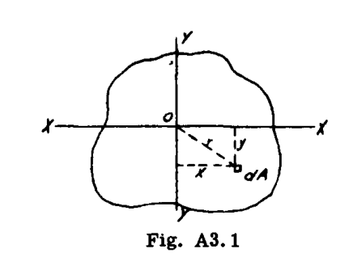  

図 A3.1 に示すように、座標軸  $ox$  ,  $oy$  ,  $oz$  を基準とした任意の平面領域を考える。  $ox$  と  $oy$  は面積の平面内にある。  
座標  $x$  ,  $y$  ,  $r$  を持つ微小面積を  $dA$  とする。  
このとき、  

$$ 
I_x = \int y^2 dA, I_y = \int x^2 dA, I_z = \int r^2 dA 
$$ 

ここで、  $I_x$  ,  $I_y$  ,  $I_z$  はそれぞれ軸  $xx$  ,  $yy$  ,  $zz$  に関する面積の慣性モーメントである。  

## A3.5 極慣性モーメント  
図 A3.1 において、  $Z$  軸に関する慣性モーメント  $I_z = \int r^2 dA$  は極慣性モーメント（polar moment of inertia）と呼ばれ、その面内の一点に関する面積の慣性モーメントとして定義できる。  
 $r^2 = x^2 + y^2$  であるから（図 A3.1）、  

$$ 
I_z = \int (y^2 + x^2) dA = I_x + I_y 
$$ 

すなわち、極慣性モーメントは、面積の平面内にあり、互いに直交し、極軸と平面の交点を通る任意の2つの軸に関する慣性モーメントの和に等しい。  

## A3.6 回転半径  
剛体の回転半径（radius of gyration）とは、慣性軸からその剛体内の点までの距離であり、もし全質量がその点に集中したとしても、慣性モーメントが変わらないような距離のことである。  
したがって、  $\int r^2 dM = \rho^2 M$  となり、ここで  $\rho$  は回転半径である。  
 $\int r^2 dM = I$  であるから、  $I = \rho^2 M$  または  $\rho = \sqrt{\frac{I}{M}}$  となる。  

同様に、面積の場合、  

$$ 
I = \rho^2 A \text{ または } \rho = \sqrt{\frac{I}{A}} 
$$ 

## A3.7 平行軸の定理  
図 A3.2 において、  $I_y$  を形心軸  $y-y$  に関する面積の慣性モーメントとし、軸  $y_1 y_1$  に関する慣性モーメントを求めるものとする。  $y_1 y_1$  は  $y-y$  に平行である。  $y_1 y_1$  からの距離が  $x + d$  である微小面積  $dA$  を考える。  

このとき、  

$$ 
I_{y_1} = \int (d + x)^2 dA = \int x^2 dA + 2d \int x dA + d^2 \int dA 
$$ 

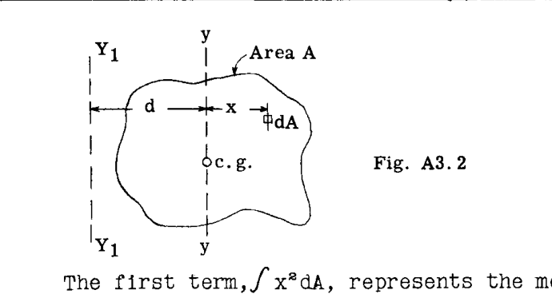  

第1項  $\int x^2 dA$  は、物体の形心軸  $y-y$  に関する慣性モーメントを表し、記号  $\bar{I}$  で与えられる。第2項は、  $y-y$  が物体の形心軸であり  $\int x dA$  がゼロになるため、ゼロとなる。最後の項  $d^2 \int dA = A d^2$  、すなわち物体の面積に軸  $y-y$  と  $y_1 y_1$  の間の距離の2乗を掛けたものである。  

したがって、一般に、  

$$ 
I = \bar{I} + A d^2 
$$ 

この式は、面積の平面内の任意の軸に関する面積の慣性モーメントは、平行な形心軸に関する慣性モーメントに、面積と2軸間の距離の2乗の積を加えたものに等しいことを示している。  

### 質量に対する平行軸の定理  
面積の代わりに物体の質量を考える場合、平行軸の定理は次のように書ける。  

$$ 
I = \bar{I} + M d^2 
$$ 

ここで、  $M$  は物体の質量を指す。  

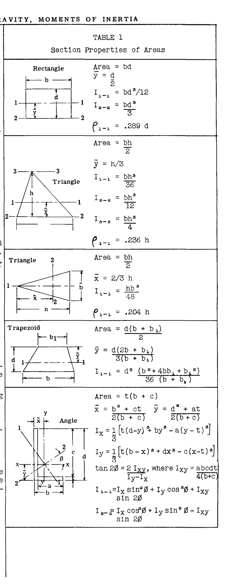  

## A3.7a 質量の慣性モーメント  
粒子の質量と、直線または平面からの距離の2乗との積は、その直線または平面に関する質量の慣性モーメントと呼ばれる。したがって、  

$$ 
I = \sum M r^2 
$$ 

合計が定積分で表せる場合、その式は次のように書ける。  

$$ 
I = \int r^2 dM 
$$ 

### 飛行機の慣性モーメント  
飛行条件および着陸条件の両方において、飛行機は角加速度を受ける可能性がある。加速度の大きさ、および質量慣性抵抗力の分布と大きさを決定するために、特定の飛行機の応力解析を行う際には、通常、3つの座標軸に関する飛行機の慣性モーメントが必要となる。  
飛行機の重心を通る座標軸  $X$  ,  $Y$  ,  $Z$  に関する飛行機の質量慣性モーメントは、次のように表すことができる。  

$$ 
I_X = \sum w y^2 + \sum w z^2 + \sum \Delta I_X 
$$ 
$$ 
I_Y = \sum w x^2 + \sum w z^2 + \sum \Delta I_Y 
$$ 
$$ 
I_Z = \sum w x^2 + \sum w y^2 + \sum \Delta I_Z 
$$ 

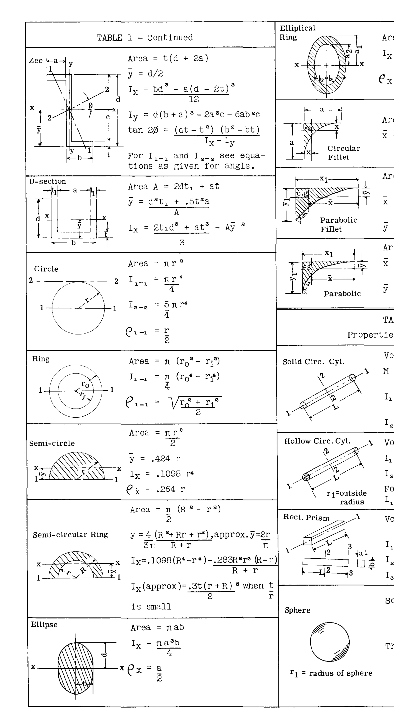  

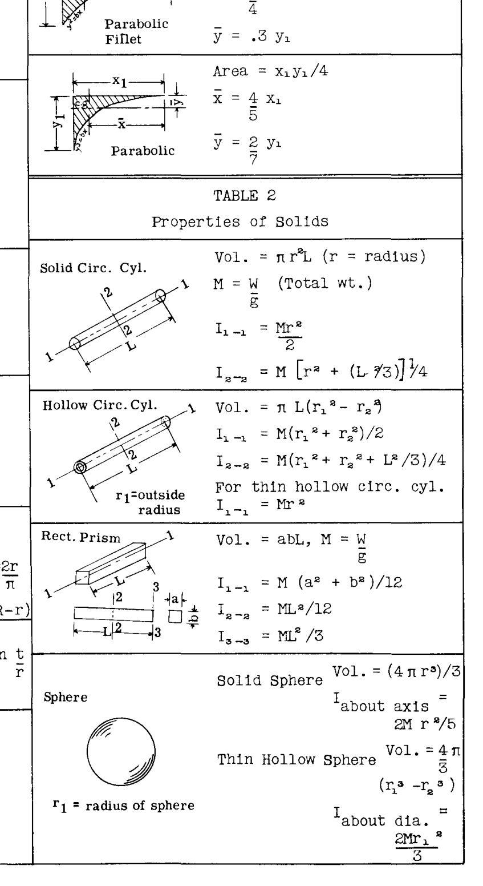  

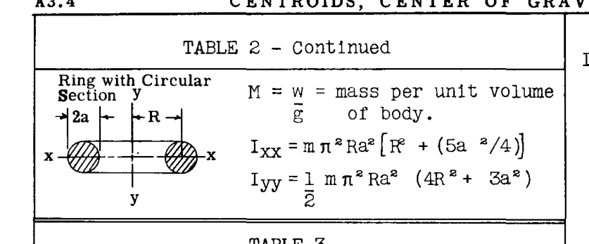  

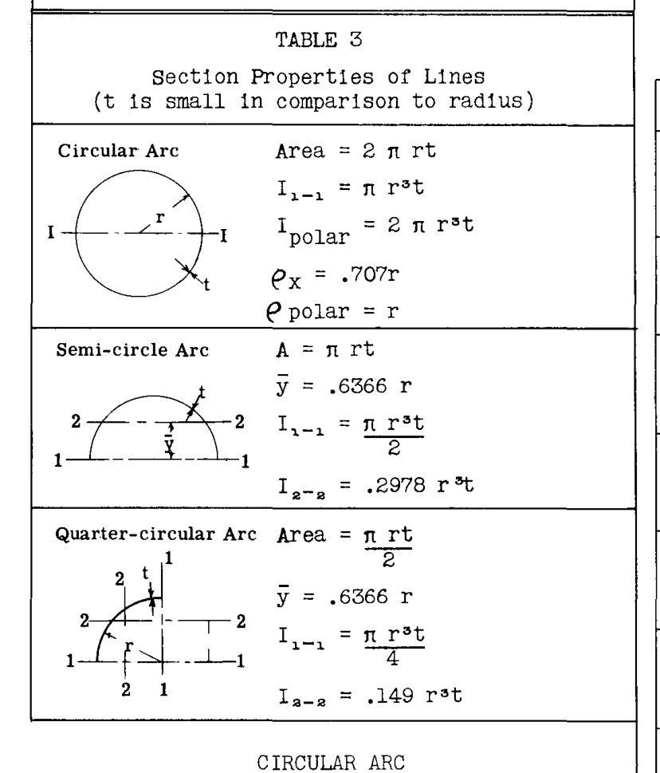  

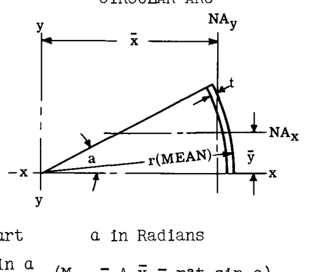  

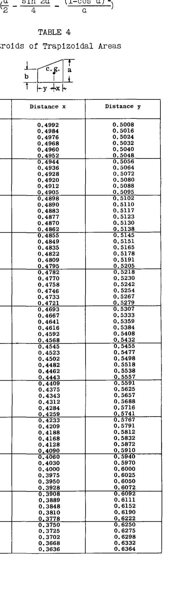  

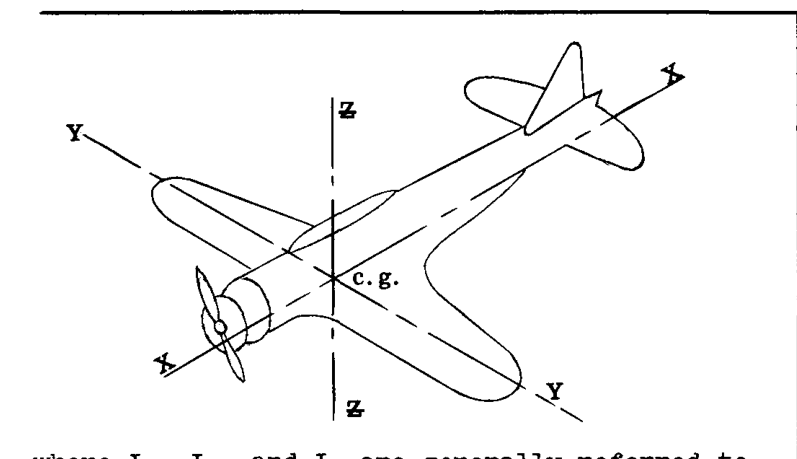  

ここで、  $I_X$  ,  $I_Y$  ,  $I_Z$  は一般に、飛行機のロール、ピッチ、およびヨーイング慣性モーメントと呼ばれる。  
 $w$  = 飛行機内の各アイテムの重量  
 $x$  ,  $y$  ,  $z$  = 飛行機の重心を通る軸から重量  $w$  までの距離  
各式の最後の項は、各アイテムの自身の  $X, Y, Z$  形心軸に関する慣性モーメントの総和である。  

 $w$  がポンド（pounds）、距離がインチ（inches）で表される場合、慣性モーメントは ポンド・インチ2（pound-inches squared）の単位で表される。これは、  $1/32.16 \times 144$  を掛けることで、 スラグ・フィート2（slug feet squared）に変換できる。  

### 例題 1  
図 A3.3 に示す飛行機の総重量と重心を求めよ。飛行機の重量は、図中の記号「+」で示された個別の重心位置を持つ10個のアイテムまたは重量グループに分解されている。  

**解：** 飛行機の重心は、2つの直交する軸を基準として配置される。この例では、プロペラの中心線を通る垂直軸を水平方向の基準軸として選択し、推力線を垂直方向の基準軸として選択する。解くべき一般的な式は以下の通りである。  

$$ 
\bar{x} = \frac{\sum w x}{\sum w} = \text{基準軸 } Z-Z \text{ からの飛行機重心までの距離} 
$$ 
$$ 
\bar{y} = \frac{\sum w y}{\sum w} = \text{基準軸 } X-X \text{ からの飛行機重心までの距離} 
$$ 

表 4 に必要な計算を示す。  

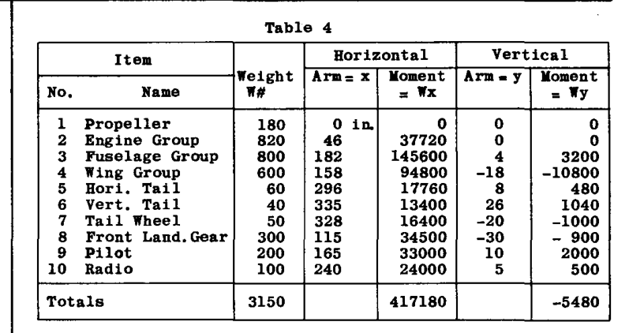  

これより、  

$$ 
\bar{x} = \frac{417180}{3150} = 133.3" \text{（プロペラ中心線より後方）} 
$$ 
$$ 
\bar{y} = \frac{5480}{3150} = -1.74" \text{（推力線より下方）} 
$$ 

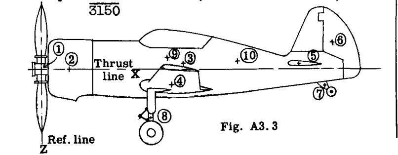  

### 例題 2  
図 A3.4 に示す面積について、水平形心軸に関する慣性モーメントを求めよ。  

**解：** まず、水平基準軸に関する慣性モーメントを求める。この解法では、図のように底辺を通る軸  $x'x'$  を任意の軸として採用している。この慣性モーメントが求まれば、形心軸への変換が可能である。表 5 は、軸  $x'x'$  に関する慣性モーメントの詳細な計算を示している。簡単のため、断面は A, B, C, D, E の5つの部分に分割されている。  

 $I_{cx}$  は、考慮している特定の部品の形心  $x$  軸に関する慣性モーメントである。  
軸  $x'x'$  から形心水平軸までの距離は  
 $\bar{y} = \frac{\sum A y}{\sum A} = \frac{17.97}{6.182} = 2.91"$   

平行軸の定理により、慣性モーメントを軸  $x'x'$  から形心軸  $xx$  へ変換する。  

$$ 
I_{xx} = I_{x'x'} - A \bar{y}^2 = 79.47 - 6.18 \times 2.91^2 = 27.2 \text{ in}^4 
$$ 

回転半径は、  
 $\rho_{xx} = \sqrt{\frac{I_{xx}}{A}} = \sqrt{\frac{27.2}{6.18}} = 2.1"$   

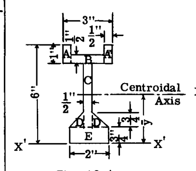  
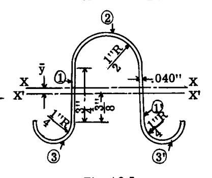  

### 例題 3  
図 A3.5 に示すストリンガー断面の、水平形心軸に関する慣性モーメントを求めよ。  

**解：** 図に示すように水平基準軸  $x'x'$  を仮定する。まずこの軸に関する慣性モーメントを計算し、次に形心軸  $xx$  に変換する。表 6 を参照。  

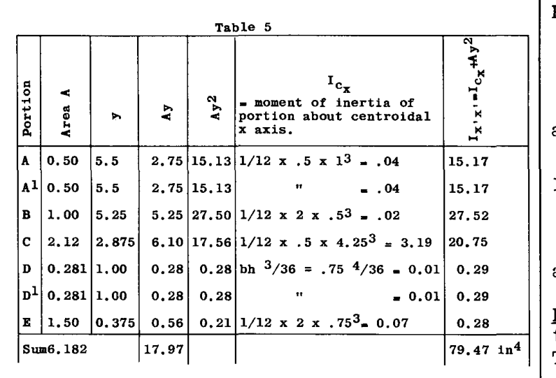  
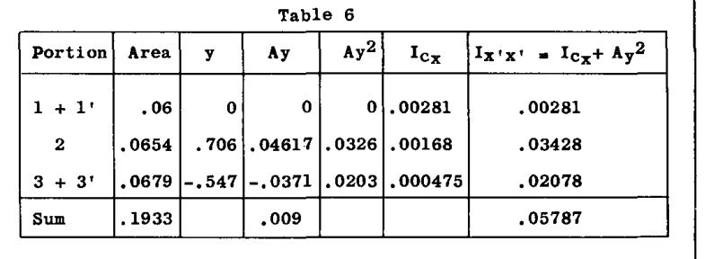  

表 6 の詳細な説明：  
部分 1 + 1'  
$$ 
I_{cx} = \frac{1}{12} b d^3 = \frac{1}{12} (.04 \times .75^3) \times 2 = .00281 \text{ in}^4 
$$  

部分 2 (表 1 参照)  
$$ 
y = .375 + \frac{4}{3\pi} \frac{R^2 + Rr + r^2}{R + r} = .375 + \frac{4}{3\pi} \frac{(.5^2 + .5 \times .54 + .54^2)}{(.5 + .54)} = .375 + .331 = .706" 
$$  
表 1 の近似法によると：  
 $y = .375 + \frac{2}{\pi} r_1 = .375 + \frac{2}{\pi} \times (.52) = .706"$   

$$ 
I_{cx} = .1098 \times (R^2 + r^2) t (R + r) - \frac{.283 R^2 r^2 t}{R + r} 
$$ 
$$ 
= .1098 (.2916 + .25) \times .04 \times 1.04 - \frac{.283 \times .2916 \times .25 \times .04}{1.04} 
$$ 
$$ 
= .002475 - .000793 = .001682 \text{ in}^4 
$$  
近似式：  $I_{cx} = .3 t r_1^3 = .3 \times .04 \times .52^3 = .001688 \text{ in}^4$   

部分 3 + 3' (表 1 参照)  
$$ 
y = .375 + \frac{4}{3\pi} \frac{(.0841 + .0725 + .0625)}{.54} = .375 + .172 = .547" 
$$  
近似：  $y = .375 + \frac{2}{\pi} r_1 = .375 + .172 = .547"$   

$$ 
I_{cx} = \left[ \frac{.1098 (.0841 + .0625) + .04 \times .54 - .283 \times .0841 \times .0625 \times .04}{.54} \right] = .002375 
$$  
近似：  $I_{cx} = .3 \times .04 \times .27^3 = .002365 \text{ in}^4$   

### 例題 4  
図 A3.5a のフライホイールの、回転軸に関する慣性モーメントを求めよ。材質は鋳造アルミニウム合金（重量 = 0.1 lb/cu. inch）とする。  

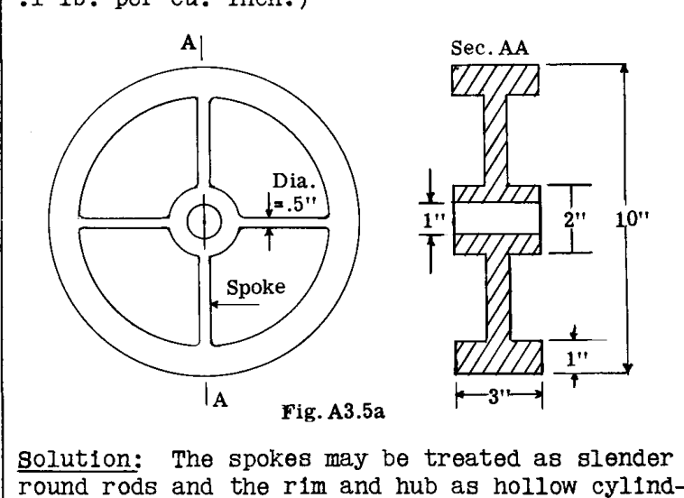  

**解：** スポークは細い丸棒、リムとハブは中空円筒として扱うことができる。（表 2 を参照）  

**リム**  
重量  $W = \pi (R^2 - r^2) \times 3 \times .1 = \pi (5^2 - 4^2) \times .3 = 8.48 \text{ lb}$   
 $I = .5 W (R^2 + r^2) = .5 \times 8.48 (5^2 + 4^2) = 173.7 \text{ lb. in}^2$   

**ハブ**  
 $W = \pi (1^2 - .5^2) \times 3 \times .1 = .707 \text{ lb}$   
 $I = .5 \times .707 (1^2 + .5^2) = .44 \text{ lb. in}^2$   

**スポーク**  
スポークの長さ = 3"  
スポークの重量 =  $3 \times \pi \times .25^2 \times .1 = .588 \text{ lb}$   
1本のスポークの  $I = W L^2 / 12 + W r^2 = .588 \times 3^2 / 12 + .588 \times 2.5^2 = 4.10 \text{ lb. in}^2$   
4本のスポークの  $I = 4 \times 4.10 = 16.40$   

ホイールの全  $I = 16.40 + .44 + 173.7 = 190.54 \text{ lb. in}^2$   
 $I = 190.54 / (32.16 \times 144) = .0411 \text{ slug ft}^2$   

### 例題 5 飛行機の慣性モーメント  
総重量の重心を通る座標軸に関する飛行機の慣性モーメントを計算するために、飛行機の重量とその分布の内訳が必要である。これは飛行機の重量およびバランスの見積もりから得られる。  
表 6a は飛行機の慣性モーメントの完全な計算を示している。この表は N.A.C.A. テクニカルノート #575「設計データからの飛行機の慣性モーメントの推定」から引用したものである。  

**表の説明**  
図 A3.5b は、選択された基準平面と軸を示している。これらの軸に対して慣性モーメントが決定された後、平行軸の定理を使用して、飛行機の重心を通る平行な軸に関する値を求める。  

表 6a の各列の説明は以下の通りである。  
第1列：飛行機ユニットまたはアイテムの内訳。  
第2列：各アイテムの重量。  
第3、4、5列：基準平面または軸からアイテムの重心までの距離。  
第6、7列：基準軸  $Y'$  および  $X'$  に関する各アイテム重量の1次モーメント。  
第8、9、10列：基準軸に関するアイテム重量の慣性モーメント。  
第11、12、13列：基準軸に平行な、各アイテム自身の形心軸に関する慣性モーメント。胴体骨格、翼パネル、エンジンなどは、その形心慣性モーメントの値が比較的大きい。  

第3列と第5列の最後の値は、基準平面から飛行機の重心までの距離を示す。  
 $\bar{x}_{c.g.} = \frac{\sum w x}{\sum w} = \frac{617024 \text{ (col. 6)}}{5325.3 \text{ (col. 2)}} = 115.9 \text{ in.}$   
 $\bar{z}_{c.g.} = \frac{\sum w z}{\sum w} = \frac{414848 \text{ (col. 7)}}{5325.3} = 77.8 \text{ in.}$   

(8)、(9)、(10)列の最後の値は、次のように平行軸の定理を用いて得られたものである。  
飛行機の重心に関する  $\sum w x^2 = 97891595 - 5325.3 \times 115.9^2 = 26691595$   
 $\sum w z^2 = 33252035 - 5325.3 \times 77.8^2 = 992035$   

(11)、(12)、(13)列の最後から3番目の値は、飛行機の重心を通る  $x, y, z$  軸に関する飛行機の慣性モーメントである。値は以下の通り。  
 $I_y = \sum w x^2 + \sum w z^2 + \sum \Delta I_y = 26691595 + 992035 + 3120384 = 30804014 \text{ lb. in}^2$   
 $I_x = \sum w y^2 + \sum w z^2 + \sum \Delta I_x = 10287522 + 992023 + 2899470 = 14179027 \text{ lb. in}^2$   
 $I_z = \sum w y^2 + \sum w x^2 + \sum \Delta I_z = 10287522 + 26691595 + 5157186 = 42136303 \text{ lb. in}^2$   

主慣性軸を決定するためには、基準軸に関する重量の慣性乗積（product of inertia）が必要である。第14列は基準軸に関する値を示している。飛行機の重心軸に慣性乗積を変換するために、平行軸の定理を利用する。  

$$ 
\sum w x z_{c.g.} = \sum w x z (\text{基準軸}) - \sum w \bar{x} \bar{z} = 48857589 - 5325.3 \times 115.9 \times 77.8 = 839253 \text{ lb. in}^2 
$$  

すべての値を スラグ・フィート2（slug ft^2）に変換するには、  $\frac{1}{32.17} \times \frac{1}{144}$  を掛ける。  
したがって、 $I_x = 3061, I_y = 6680, I_z = 9096, I_{xz} = 181$   

重心座標軸に関する慣性特性が得られれば、主軸に関する慣性モーメントは面積の場合と同様に決定される。  
 $X$  軸と  $Z$  軸の間の角度  $\phi$  と主軸は次のように与えられる。  

$$ 
\tan 2 \phi = \frac{2 I_{xz}}{I_z - I_x} = \frac{2 \times 181}{9096 - 3061} = .05998 \text{ したがって } \phi = 1^\circ 43' 
$$  

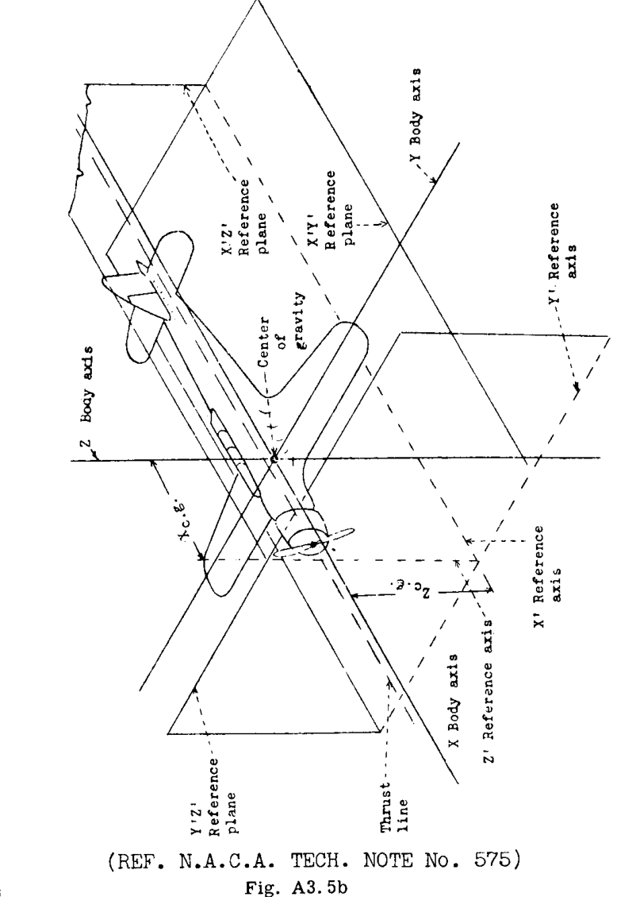  

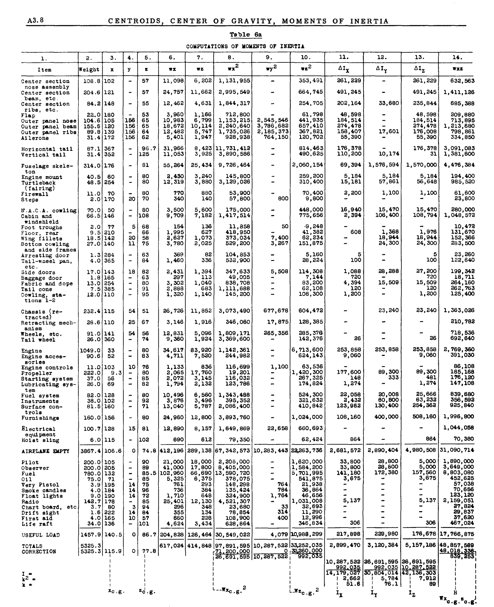  

主慣性モーメントは以下の式で与えられる。  
 $I_{xp} = I_x \cos^2 \phi + I_z \sin^2 \phi - I_{xz} \sin 2 \phi$   
 $I_{yp} = I_y$   
 $I_{zp} = I_x \sin^2 \phi + I_z \cos^2 \phi + I_{xz} \sin 2 \phi$   

代入すると：  
 $I_{xp} = 3061 \times (0.9996)^2 + 9096 \times (0.0300)^2 - 181 \times .0599 = 3056$   
 $I_{zp} = 3061 \times (0.0300)^2 + 9096 \times (0.9996)^2 + 181 \times .0599 = 9102$   
 $I_{yp} = 6680$   

## A3.7b 問題  
(1) 図 A3.6 に示す梁断面の、水平形心軸に関する慣性モーメントを求めよ。  
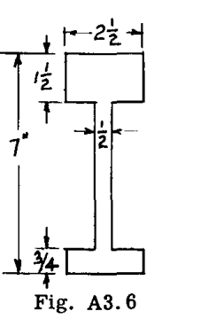  

(2) 図 A3.7 に示す断面について、形心  $Z$  軸および  $X$  軸に関する慣性モーメントを計算せよ。  
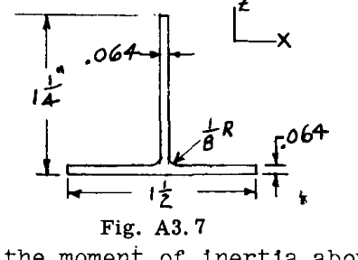  

(3) 図 A3.8 に示す断面について、水平形心軸に関する慣性モーメントを求めよ。  
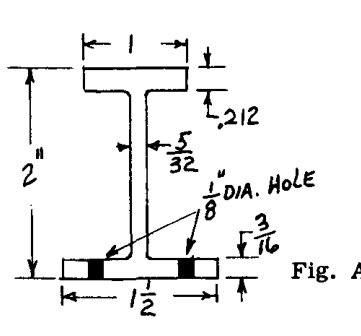  

(4) 図 A3.9 の梁断面において、4つのコーナー部材のみが有効な材料であると仮定する。垂直および水平形心軸に関する慣性モーメントを計算せよ。  
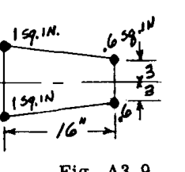  

## A3.8 慣性乗積  
さまざまな工学上の問題、特に非対称断面の慣性モーメントの計算を伴う問題では、式  $\int x y dA$  が使用される。この式は、直交座標軸  $x$  および  $y$  に関する面積の慣性乗積（product of inertia）と呼ばれる。面積の慣性乗積という用語は、記号  $I_{xy}$  で与えられ、したがって、  

$$ 
I_{xy} = \int x y dA \quad \dots (1) 
$$  

単位は、慣性モーメントと同様に、インチまたはフィートの4乗で表される。  $x$  と  $y$  は正にも負にもなりうるため、項  $I_{xy}$  はゼロ、または正もしくは負の値をとる。  

### 剛体の慣性乗積  
剛体の慣性乗積は、物体を分割した各微小部分の重量に、基準となる3つの座標平面のうちの2つからの距離の積を掛けて得られる積の総和である。  
したがって、平面  $X$  および  $Y$  に関しては、  

$$ 
I_{xy} = \int x y dW, \quad I_{xz} = \int x z dW, \quad I_{yz} = \int y z dW 
$$  

## A3.9 対称軸に関する慣性乗積  
面積が2つの直交する軸に対して対称である場合、それらの軸に関する慣性乗積はゼロである。これは、対称軸が形心軸  $x$  および  $y$  であるという事実から導かれる。  
面積が2つの直交する軸のうちの1つだけに対して対称である場合、慣性乗積  $\int x y dA$  はゼロである。なぜなら、対称軸の片側にある要素に対する各積  $x y dA$  に対して、反対側に対応する符号が反対の等しい積  $x y dA$  が存在し、その結果、式  $\int x y dA$  はゼロになるからである。  

## A3.10 平行軸の定理  
この定理は、「同一平面上の任意の1組の直交座標軸に関する面積の慣性乗積は、その面積の平行な1組の形心軸に関する慣性乗積に、面積と指定された1組の軸からの形心の距離の積を加えたものに等しい」と述べている。あるいは、式で表すと：  

$$ 
I_{xy} = \bar{I}_{xy} + A \bar{X} \bar{Y} \quad \dots (2) 
$$  

この式は、図 A3.10 を参照することで容易に導き出せる。  $\bar{X}\bar{X}$  と  $\bar{Y}\bar{Y}$  は特定の面積の形心軸である。  $XX$  と  $YY$  は点  $O$  を通る平行な軸である。  
軸  $YY$  および  $XX$  に関する慣性乗積は、  
 $I_{xy} = \int (x + \bar{x})(y + \bar{y}) dA$   
 $= \int x y dA + \bar{x} \bar{y} \int dA + \bar{x} \int y dA + \bar{y} \int x dA$   

最後の2つの積分は、  $\int y dA$  および  $\int x dA$  が形心軸を基準としているため、それぞれゼロである。したがって、  $I_{xy} = \int x y dA + \bar{x} \bar{y} A$  となり、これは式 (2) の形式で書くことができる。