# A3.10 図心、重心、慣性モーメント

## A3.11 傾斜軸に関する慣性モーメント

航空機の構造では、翼型（エアフォイル）の形状が一般に非対称であるため、非対称なビーム断面が非常によく見られる。したがって、このような断面に関する一般的な手順は、まず何らかの直交軸セットについて慣性モーメントを求め、次に他の傾斜した軸へ変換することである。したがって、図 A3.11 において、軸  $X_1 X_1$  に関する面積の慣性モーメントは以下のようになる。

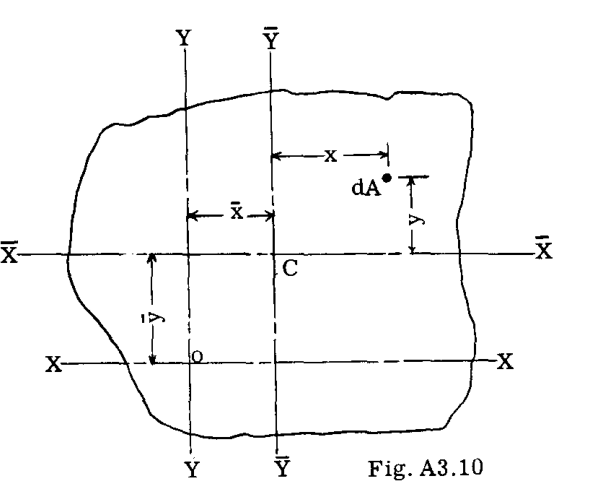

$$
I_{X_1} = \int y_1^2 dA = \int (y \cos \phi - x \sin \phi)^2 dA
$$

$$
= \cos^2 \phi \int y^2 dA + \sin^2 \phi \int x^2 dA - 2 \sin \phi \cos \phi \int xy dA
$$

$$
= I_X \cos^2 \phi + I_Y \sin^2 \phi - 2 I_{XY} \sin \phi \cos \phi \quad (3)
$$

同様の方法で、以下の式を導くことができる。

$$
I_{Y_1} = I_X \sin^2 \phi + I_Y \cos^2 \phi + 2 I_{XY} \sin \phi \cos \phi \quad (4)
$$

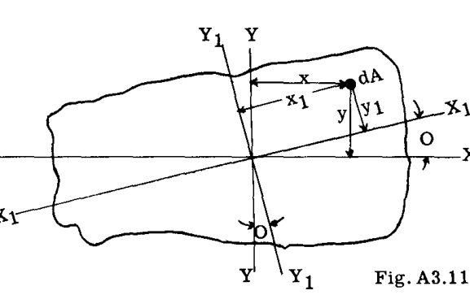

式(3)と(4)を加算すると、次式が得られる。

$$
I_{X_1} + I_{Y_1} = I_X + I_Y \quad (5)
$$

言い換えれば、共通の交点を通るすべての直交軸ペアに関する面積の慣性モーメントの和は一定である。

## A3.12 慣性相乗モーメントがゼロになる軸の位置

図 A3.11 において、

$$
I_{X_1 Y_1} = \int x_1 y_1 dA = \int (x \cos \phi + y \sin \phi)(y \cos \phi - x \sin \phi) dA
$$

$$
= (\cos^2 \phi - \sin^2 \phi) \int xy dA + \cos \phi \sin \phi \int (y^2 - x^2) dA
$$

$$
= I_{XY} \cos 2\phi + \frac{1}{2} (I_X - I_Y) \sin 2\phi
$$

したがって、 $I_{X_1 Y_1}$  がゼロになるのは、

$$
\tan 2\phi = \frac{2 I_{XY}}{I_Y - I_X} \quad (6)
$$

のときである。

## A3.13 主軸

非対称曲げを伴う問題では、面積のモーメントは、しばしば主軸と呼ばれる特定の軸に関して用いられる。面積の主軸とは、その面積の慣性モーメントが、面積の重心を通る他のいかなる軸に関するものよりも最大または最小になる軸のことである。  

慣性相乗モーメントがゼロになる軸が主軸である。  

対称軸に関しては慣性相乗モーメントがゼロであるため、対称軸は主軸であるということになる。  

直交する重心軸と主軸との間の角度は、式(6)によって与えられる。

### 例題 4
図 A3.12 に示すアングルの慣性モーメントを、重心を通る主軸について求めよ。

**解法:**
参照軸  $X$  および  $Y$  を図 A3.12 に示すように仮定し、まずこれらの軸に関する慣性モーメントを計算する。表 8 に計算結果を示す。角度は(1)と(2)の2つの部分に分割される。

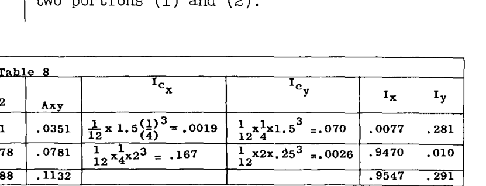

 $I_{Cx}$  および  $I_{Cy} =$  各部分の自身の  $X$  および  $Y$  重心軸に関する慣性モーメント。  

**重心軸の位置:**

$$
\bar{y} = \frac{\sum Ay}{\sum A} = \frac{.6719}{.875} = .767\text{"}
$$

$$
\bar{x} = \frac{\sum Ax}{\sum A} = \frac{.3435}{.875} = .392\text{"}
$$

**参照  $X$  および  $Y$  軸から平行重心軸への慣性モーメントおよび慣性相乗モーメントの移動:**

$$
\bar{I}_X = I_X - A\bar{y}^2 = .955 - .875 \times .767^2 = .440
$$

$$
\bar{I}_Y = I_Y - A\bar{x}^2 = .291 - .875 \times .392^2 = .157
$$

$$
\bar{I}_{XY} = \sum Axy - A\bar{x}\bar{y} = .1132 - .875 \times .767 \times .392 = -.150
$$

**重心を通る重心  $X, Y$  軸と主軸の間の角度を次のように計算する:**

$$
\tan 2\phi = \frac{2\bar{I}_{XY}}{\bar{I}_Y - \bar{I}_X} = \frac{2(-.150)}{.157 - .440} = \frac{-.30}{-.283} = 1.06
$$

$$
2\phi = 46^\circ - 40\text{'}
$$

$$
\phi = 23^\circ - 20\text{'}
$$

**重心主軸に関する慣性モーメントを次のように計算する:**

$$
\bar{I}_{xp} = I_X \cos^2 \phi + I_Y \sin^2 \phi - 2I_{XY} \sin \phi \cos \phi
$$

$$
= .44 \times .918^2 + .157 \times .3965^2 - 2(-.150) \times .3965 \times .918 = .504 \text{ in.}^4
$$

$$
\bar{I}_{yp} = I_X \sin^2 \phi + I_Y \cos^2 \phi + 2I_{XY} \sin \phi \cos \phi
$$

$$
= .44 \times .3965^2 + .157 \times .918^2 + 2(-.150) \times .3965 \times .918 = .092 \text{ in.}^4
$$

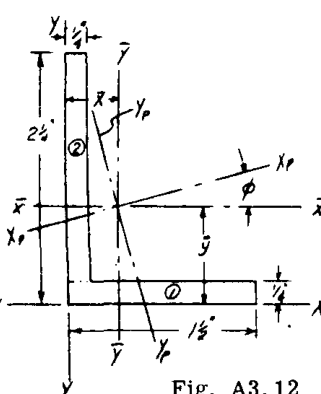

### 例題 5
図 A3.13 は、典型的な分散型フランジを持つ2セル翼ビーム断面を示している。上下面は Z およびバルブアングル断面で補強されている。この断面の主軸に関する慣性モーメントを求めよ。

**解法:**
断面の特性は、軸方向の応力に抵抗できる有効材料に依存する。有効材料の問題は後の章で取り上げる。表 9 は、仮定された直交参照軸  $XX$  および  $YY$  に関する慣性モーメントの計算を示している（図 A3.13 参照）。断面は、第 1 列にリストされているように 16 個のストリンガーに分割されている。上面については、ストリンガーとともに作用するために、.032 外板の厚さの 30 倍の幅が想定され、.04 外板の厚さの 25 倍の幅が想定されている（第 3 列参照）。下面では、隣接するストリンガーまでの中間までの外板が各ストリンガーとともに作用すると想定されるか、または全外板が有効であるとされる。第 4 列は各ストリンガーユニットの合計面積を与え、ストリンガーと有効外板の重心に集中していると見なされる。すべての距離  $x$  および  $y$ （第 5 列および第 8 列）は、大きな図面からスケールで測定されたものである。

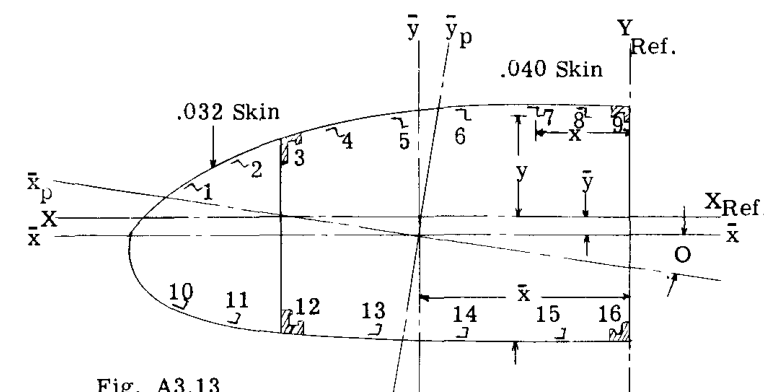

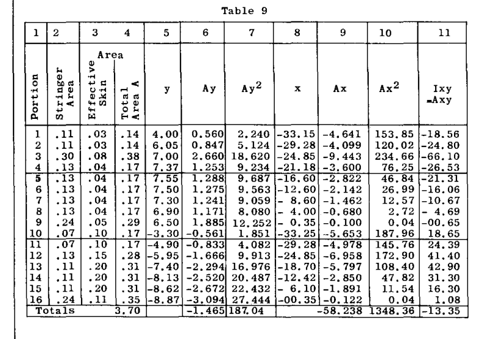

**参照軸に対する重心軸の位置:**

$$
\bar{y} = \frac{\sum Ay}{\sum A} = \frac{-1.465}{3.70} = -.396\text{"}
$$

$$
\bar{x} = \frac{\sum Ax}{\sum A} = \frac{58.238}{3.70} = 15.74\text{"}
$$

$$
\bar{I}_X = 187.04 - 3.70 \times .396^2 = 186.5 \text{ in.}^4
$$

$$
\bar{I}_Y = 1348.36 - 3.70 \times 15.74^2 = 431.7 \text{ in.}^4
$$

$$
\bar{I}_{XY} = -13.35 - (3.70 \times .396 \times 15.74) = 36.41 \text{ in.}^4
$$

$$
\tan 2\phi = \frac{2\bar{I}_{XY}}{\bar{I}_Y - \bar{I}_X} = \frac{2(36.41)}{431.7 - 186.5} = .29696
$$

$$
2\phi = 16^\circ - 32.5\text{'}
$$

$$
\phi = 8^\circ - 16.25\text{'}
$$

$$
\bar{I}_{xp} = I_X \cos^2 \phi + I_Y \sin^2 \phi - 2I_{XY} \sin \phi \cos \phi
$$

$$
= 186.46 \times .9896^2 + 431.7 \times .1438^2 - 2[36.41 \times .9896 \times (-.1438)] = 181.2 \text{ in.}^4
$$

$$
\bar{I}_{yp} = I_X \sin^2 \phi + I_Y \cos^2 \phi + 2I_{XY} \sin \phi \cos \phi
$$

$$
= 186.46 \times .1438^2 + 431.7 \times .9896^2 + 2[36.41 \times .9896 \times (-.1438)] = 437 \text{ in.}^4
$$

## A3.14 代表的な航空機構造断面の断面特性

表 A3.10 から A3.15 および チャート A3.1 は、航空機に共通するいくつかの構造形状の断面特性を示している。これらの表の使用は、この本の後の章で行われる。

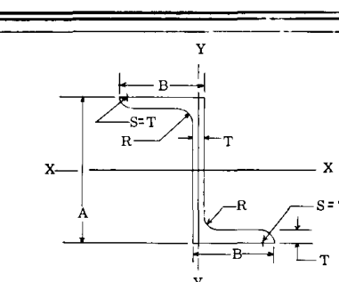

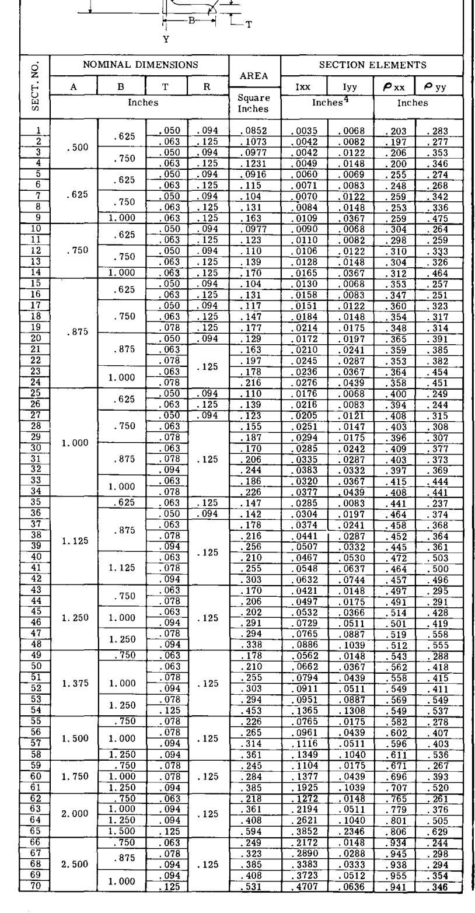

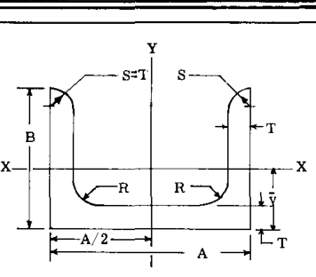

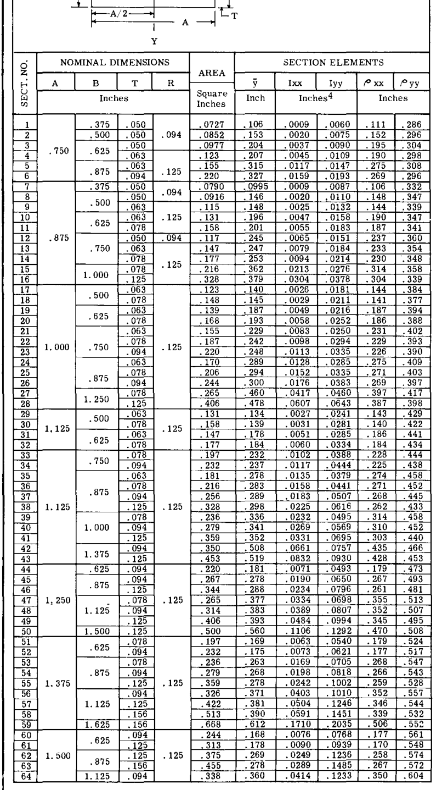

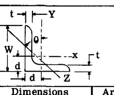

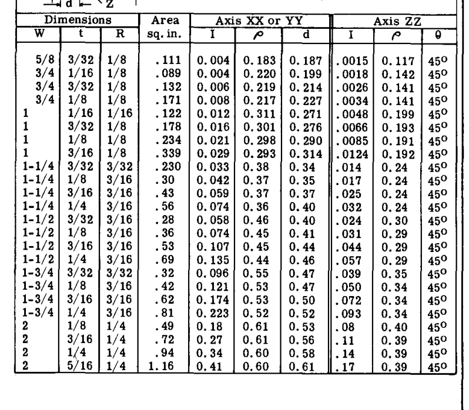

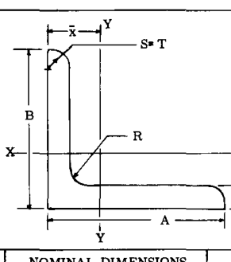

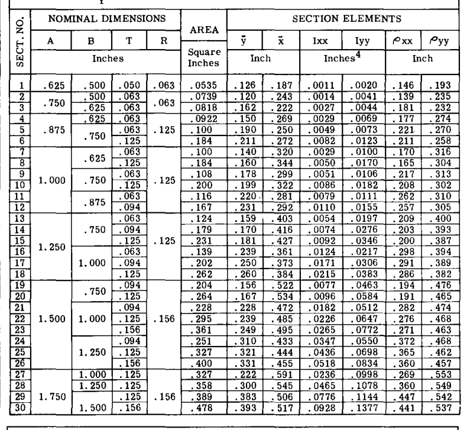

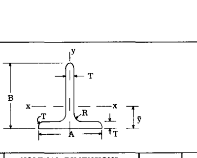

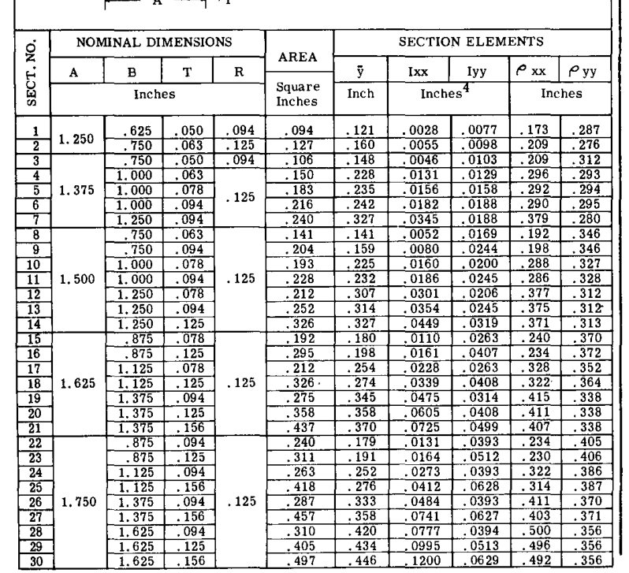

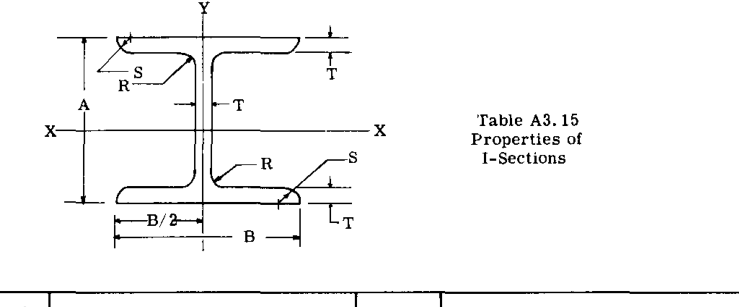

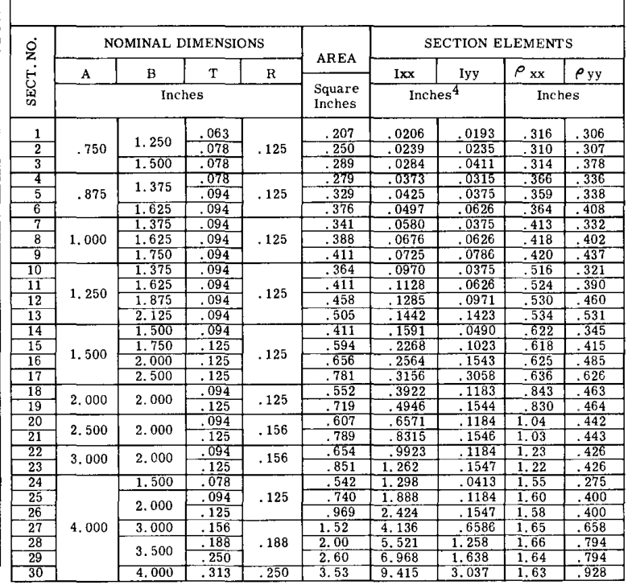

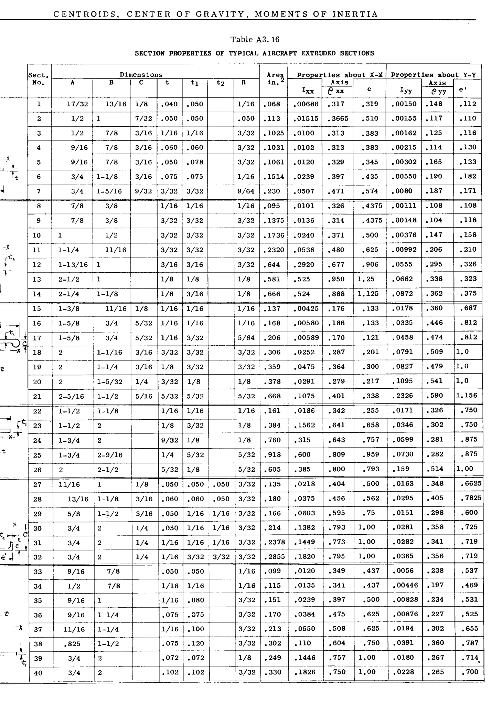

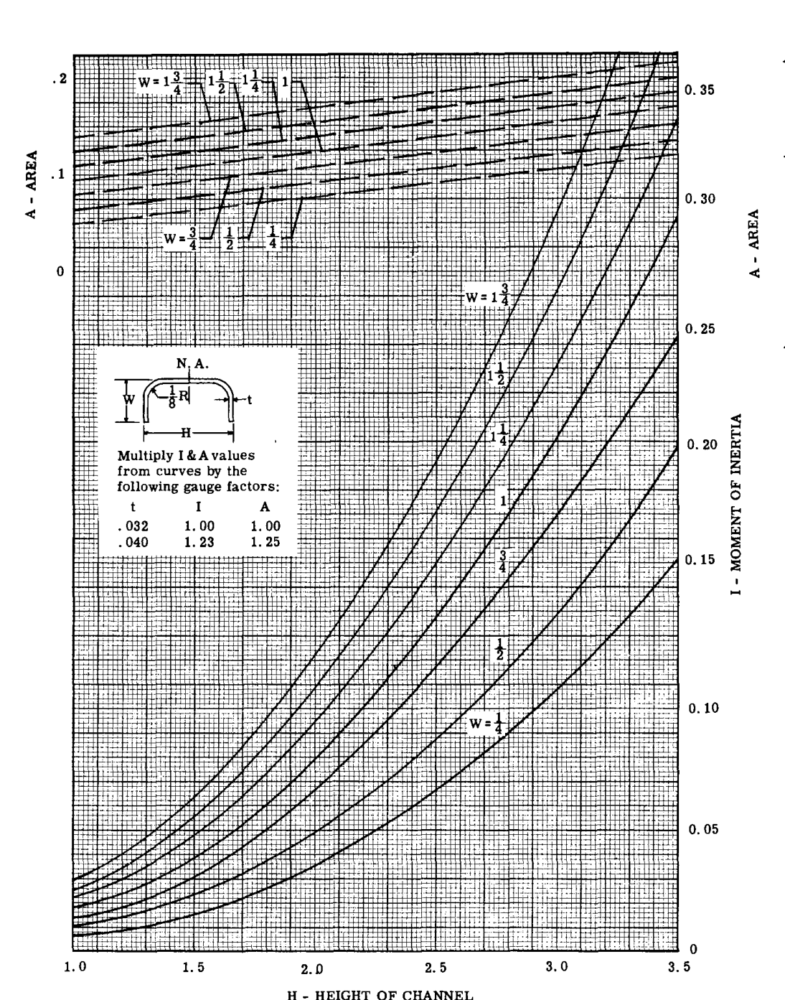

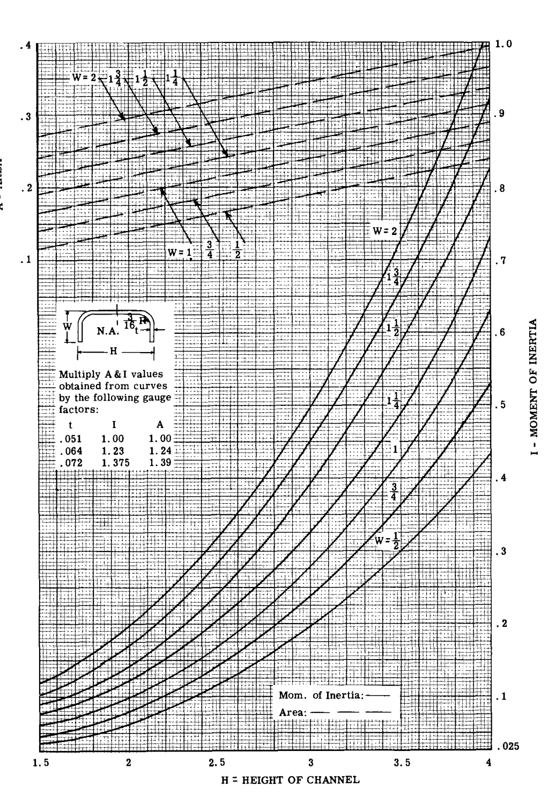

## A3.15 演習問題

(1) 図 A3.14 の断面について、各主軸  $X_p$  および  $Z_p$  に関する慣性モーメントを求めよ。  

(2) 図 A3.15 の断面について、主軸に関する慣性モーメントを計算せよ。  

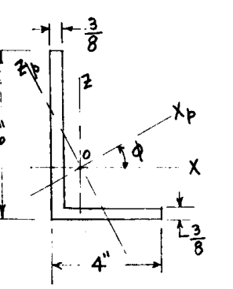
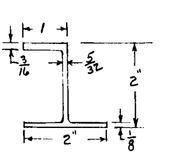

(3) 図 A3.16 は、6つの縦方向ストリンガーを持つボックスタイプビーム断面を示している。以下の仮定条件において、主軸に関するビーム断面の慣性モーメントを求めよ。  
(a) ビームが上向きに曲がり、上部が圧縮、下部が引張状態にあると仮定する。したがって、上側のシートは圧縮応力に対してほとんど抵抗を持たないため、無視する。下側のシートは引張状態にあるため有効である。計算を簡略化するため、垂直ウェブは無視する。  
(b) (a)の条件を逆転させ、上側を引張、下側を圧縮とする。  

(4) 図 A3.17 の 3 ストリンガー単一セルボックスビーム断面について、主軸に関する慣性モーメントを計算せよ。すべてのウェブまたは壁材料は無効であると仮定する。  

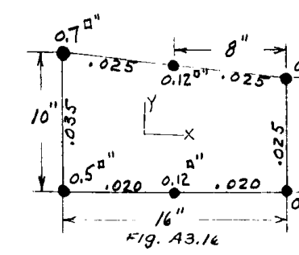
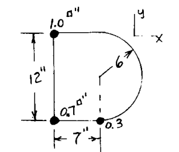

(5) 図 A3.18 のビーム断面について、4つのストリンガーのみが有効な材料であると仮定して、主軸に関する慣性モーメントを計算せよ。  

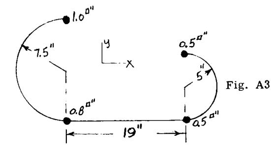

(6) 図 A3.19 は、下面にカットアウトがある翼ビーム断面を示している。8つのストリンガーのみが有効な材料であると仮定して、主軸に関する慣性モーメントを求めよ。  

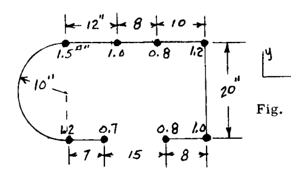

(7) 図 A3.20 は、3セルのマルチフランジビームを示している。ビームの上面にある 7 つのフランジ部材の面積は各 .3 sq. in. であり、底面外板にあるものは各 0.2 sq. in. である。底面外板の厚さは .03 インチである。フランジ部材と底面外板が有効材料を構成すると仮定して、主軸に関する慣性モーメントを計算せよ。  

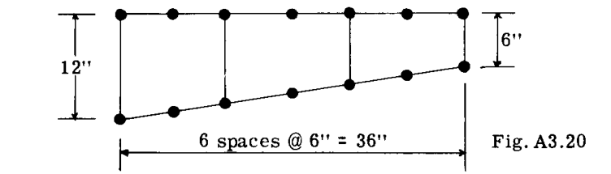

(8) 図 A3.21 は小型飛行機胴体の断面を示している。破線はドアによる構造のカットアウトを表している。13 個のストリンガーのそれぞれの面積が 0.1 sq. in. であると仮定せよ。胴体外板は無効であると見なす。有効断面の主軸に関する慣性モーメントを計算せよ。

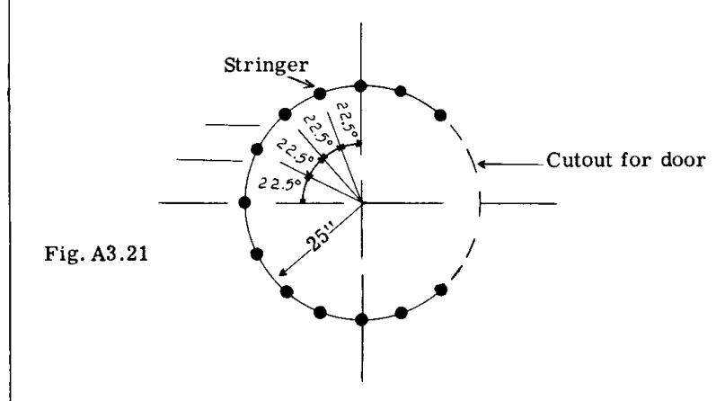