# 第A4章
# 航空機への一般的荷重

## A4.1 はじめに

航空機の構造設計を行う前に、飛行、着陸、離陸状態において航空機に作用する外力を知る必要がある。現代の航空機は亜音速、遷音速、超音速の速度域で飛行するため、航空機にかかる空気荷重を完全に決定するには、空気力学に関する徹底的な理論的知識が必要である。さらに、直線テーパー翼、後退翼、デルタ翼など、多種多様な翼構成があり、これらの翼の多くは、より優れた揚力や制御特性を促進するために前縁および後縁デバイスを備えていることが多い。動力装置のナセルユニット、外部燃料タンクなどの存在は、翼の周囲の空気の流れに影響を与え、その結果、翼にかかる空気力の大きさや分布に影響を与える。同様に、胴体や機体自体も翼の上の空気の流れに影響を与える。航空機にかかる空気荷重の理論的計算は、構造学の書籍で扱うにはあまりにも大きな主題であるため、大学の航空カリキュラムではこの主題のために別のコースを用意するのが一般的である。

ほとんどの航空機会社では、航空機にかかる荷重は構造解析部門に配属されたエンジニアのグループによって決定され、このグループはしばしば機体荷重計算グループと呼ばれる。このグループの業務は主に空気力学の使用に基づいているが、航空機構造がこれらの空気力を安全かつ効率的に支えられるように適切に設計できるように、航空機にかかる空気力の大きさと分布を決定することに関係する空気力学の段階である。航空機会社のエンジニアリング部門には、独立した、あるいは別の空気力学セクションがあるが、一般的に彼らの責任は、航空機の性能、安定性、および制御を保証または保証するために空気力学の主題を使用することである。

航空機構造理論の学習においては、航空機にかかる荷重に関する基本的な全般的知識を持つことが望ましいため、本章ではその情報の提供を試みる。翼の設計を扱う後の章で、この主題についてさらに詳しく説明する。

## A4.2 制限荷重または適用荷重。設計荷重。

航空機は特定の任務を遂行するために設計されているため、サイズ、構成、性能に関連して多くのタイプの航空機が存在する。例えば、ダグラス DC-8 のような民間輸送機は、一定数の乗客を空港間のさまざまな距離にわたって安全、効率的、かつ快適に輸送する任務を遂行するように設計されている。一方、空軍の戦闘機タイプの航空機は、敵機を撃墜したり、低速の味方機を保護したりする任務を持っている。この任務を効率的に遂行するには、DC-8 輸送機とは大きく異なる構成が必要となる。さらに、戦闘機タイプの航空機は、その必要な任務を遂行するために、DC-8 と比較してはるかに急激に操縦されなければならない。

一般に、航空機にかかる空気力の大きさは、航空機の速度と、この速度の大きさおよび方向が変化する割合（加速度）に依存する。飛行加速度因子の大きさは、人体がこれらの加速度慣性力に負傷することなく耐えられる能力によって制限される場合があり、これは戦闘機タイプの航空機における状況である。一方、DC-8 の操縦加速度は、人体が耐えられるものによって規定されるのではなく、ある空港から別の空港へ乗客を安全に輸送するために必要なものによって決定される。

航空機の構造を、その必要な任務の遂行中に受ける荷重よりも大きな荷重に対して設計すると、明らかに航空機の重量が大幅に増加し、設計された任務に対する性能や全体的な効率が低下する。

航空輸送における安全を特に確保するとともに、設計の統一性と効率性を高めるために、政府の航空機関（文民および軍事）は、航空機の構造設計に使用される荷重の大きさに関して、さまざまなタイプの航空機に対して明確な要件を設けている。これらの規定された航空機荷重を一般的に参照する場合、以下の2つの用語が使用される。

### 制限荷重（Limit Loads）または適用荷重（Applied Loads）
制限（limit）および適用（applied）という用語は、同じ荷重を指し、民間機関（C.A.A.）は制限という用語を使用し、軍事機関は適用という用語を使用する。

制限荷重は、航空機の耐用年数中に予想される最大荷重である。

航空機構造は、有害な永久変形を生じることなく制限荷重を支えることができなければならない。制限荷重に至るまでのすべての荷重において、構造の変形は航空機の安全な運用を妨げないものでなければならない。

### 終局荷重（Ultimate Loads）または設計荷重（Design Loads）
これらの2つの用語は一般に同じ意味で使用される。終局荷重または設計荷重は、制限荷重に安全率（F.S.）を乗じたものに等しい。

設計荷重 = 制限荷重（または適用荷重） × 安全率

一般に、全体の安全率は 1.5 である。政府の要件では、これらの設計荷重が故障することなく構造によって支えられることも規定されている。

航空機は規定された制限荷重を超える荷重を受けることは想定されていないが、実質的にあらゆる機械や構造の設計において、ユニットの完全な構造的破壊に対するある程度の予備強度が必要である。これは、次のような多くの要因によるものである： (1) 空気力学理論および構造応力解析理論に含まれる近似値、(2) 材料の物理的特性のばらつき、(3) 製造および検査基準のばらつき。おそらく、航空機に安全率を設ける最も重要な理由は、事実上すべての航空機が、飛行可能な最大速度と、飛行または着陸時に受ける可能性のある最大加速度に制限されているという事実による。これらは操縦士の制御下にあるため、緊急時には制限荷重をわずかに超える可能性があるが、破壊に対する安全率があれば、この制限荷重の超過は航空機の安全の観点から深刻な事態を招くべきではない。ただし、構造の小部分や一部の修理や交換が必要となるような永久的な構造変形を引き起こす可能性はある。

航空機の突風による荷重は、突風速度が仮定されるという意味で恣意的である。この突風速度は、世界中の飛行中の突風の測定と記録に関する長年の経験に基づいているが、航空機の寿命の間に、嵐の領域の近くや山岳地帯、水域の上空で、荷重要件で指定されたものよりもわずかに大きい突風速度が発生する可能性は十分にある。したがって、安全率は、このような状況が発生した場合の故障に対する安全性を保証するものである。

従来の航空機における外力の広範な一般的カテゴリーは、次のような分類に分けることができる。

(1) 空気荷重
- 航空機の操縦によるもの（操縦士の制御下）
- 空気の突風によるもの（操縦士の制御外）

(2) 着陸荷重
- 陸上への着陸（車輪またはスキータイプ）
- 水上への着陸
- 拘束着陸（航空母艦への着陸）

(3) 動力装置荷重
- 推力（Thrust）
- トルク（Torque）

(4) 離陸荷重
- カタパルト射出
- 補助的な短期間の推力ユニットを用いた補助離陸

(5) 特殊荷重
- 航空機の吊り上げ
- 航空機の曳航
- 艇体型航空機のビーチング
- 胴体の加圧

(6) 重量および慣性力

応力解析の目的で外力を分解する場合、一連の参照軸を持つと便利である。Fig. A4.0 に示すように、航空機の重心を通る参照軸  $XYZ$  は、空気力学的計算と同様に応力解析業務でも通常使用されるものである。便宜上、参照軸はしばしば航空機の重心以外の別の原点を参照することがある。

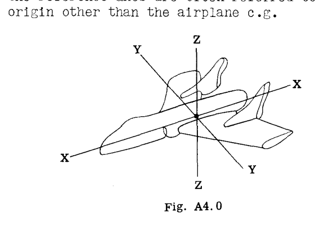

## A4.4 重量と慣性力
重量とは、その質量に比例する一定の力であり、すべての物理的な物体を地球の中心に向かって引き寄せる傾向がある。
定常飛行（等速）中の航空機には、航空機の重量、航空機全体にかかる空気力、および動力装置の力が平衡状態にある力の体系が作用している。操縦士は、エンジンの出力を変えたり、表面制御を操作して航空機の速度の方向を変えたりすることで、このバランスの取れた定常飛行状態を変えることができる。これらの不平衡な力は、航空機を加速または減速させる。

### 剛体の純粋な並進運動に対する慣性力
剛体に作用する不平衡な力が、物体の速度の大きさのみを変化させ、その方向を変化させない場合、その運動は並進（Translation）と呼ばれ、基礎物理学から、加速力  $F = Ma$  である。ここで、 $M$  は物体の質量、または  $W/g$  である。Fig. A4.1 では、不平衡な力体系  $F$  が剛体を右方向に加速させる。Fig. A4.2 は、各質量粒子  $m_1a, m_2a$  などにかかるこの不平衡な力の効果を示しており、したがって全有効力は  $\sum ma = Ma$  である。これらの有効力が逆転されると、それらは慣性力と呼ばれる。したがって、外力と慣性力は平衡状態にある力の体系を形成する。

基礎物理学から、加速度が一定である場合の純粋な並進運動について、次の関係が得られる。

 $v - v_0 = at$   (1)

 $s = v_0 t + \frac{1}{2} at^2$   (2)

 $v^2 - v_0^2 = 2as$   (3)

ここで、
 $s$  = 時間  $t$  内に移動した距離
 $v_0$  = 初速度
 $v$  = 時間  $t$  後の終速度

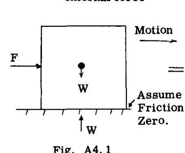
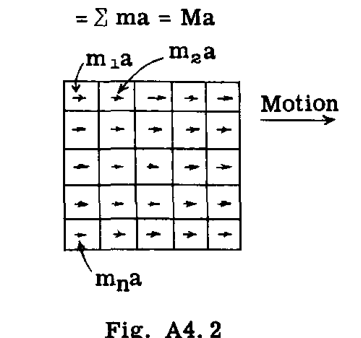

### 回転する剛体への慣性力
一般的な航空機の操縦は、航空機の  $XZ$  面に平行な面内での曲線経路に沿った運動であり、一般にピッチング面（Pitching Plane）と呼ばれる。定常飛行からの引き起こし（Pull up）や降下からの引き起こし（Pull out）は、航空機に曲線経路をたどらせる。Fig. A4.3 は、曲線経路をたどる航空機を示している。点  $A$  において経路に沿って速度が増加している場合、航空機は2つの加速度、すなわち、点  $A$  における曲線に対して接線方向で大きさが  $a_t = r\alpha$  に等しい加速度と、点  $A$  において飛行経路に対して垂直で回転中心 ( $O$ ) に向かう  $a_n = r\omega^2$  に等しい加速度を受けている。ニュートンの法則から、これらの加速度による有効力は次の通りである。

 $F_n = Mr\omega^2 = M v^2/r$   (4)

 $F_t = Mr\alpha$   (5)

ここで、
 $\omega$  = 点  $A$  における角速度
 $\alpha$  = 点  $A$  における角加速度
 $r$  = 点  $A$  における飛行経路の曲率半径

慣性力は、Fig. A4.3 に示されるように、これらの有効力と等しく反対方向である。これらの慣性力は、平衡状態にある航空機上の全荷重体系の一部として考慮することができる。
航空機の経路に沿った速度が一定の場合、  $a_t = 0$  となり、慣性力  $F_t = 0$  となり、法線慣性力  $F_n$  のみが残る。
角加速度が一定の場合、次の関係が成り立つ。

 $\omega - \omega_0 = \alpha t$   (6)

 $\theta = \omega_0 t + \frac{1}{2} \alpha t^2$   (7)

 $\omega^2 - \omega_0^2 = 2\alpha\theta$   (8)

ここで、
 $\theta$  = 時間  $t$  における回転角
 $\omega_0$  = rad/sec 単位の初期角速度
 $\omega$  = 時間  $t$  後の角速度

Fig. A4.3 において、回転中心 ( $O$ ) まわりの慣性力のモーメント  $T_o$  は、 $Mr\alpha(r) = Mr^2\alpha$  に等しい。項  $Mr^2$  は、点 ( $O$ ) まわりの航空機の質量慣性モーメントである。航空機は自身の重心軸まわりにかなりのピッチング慣性モーメントを持つため、それを含める必要がある。したがって、平行軸の定理により、

 $T_o = I_o\alpha + I_{c.g.}\alpha$   (9)

ここで、 $I_o = Mr^2$  であり、 $I_{c.g.}$  = 航空機の重心を通る  $Y$  軸まわりの航空機の慣性モーメントである。

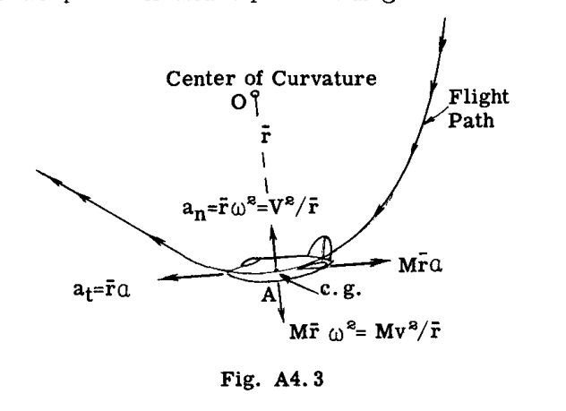

### 航空機の重心を通る  $Y$  軸まわりのピッチング回転に対する慣性力
飛行中、空気の突風が水平尾翼に当たり、航空機の重心まわりにモーメントを持つ尾翼力を生じさせることがある。一部の着陸状態では、地面や水面からの力が航空機の重心を通らないため、航空機の重心まわりにモーメントが生じる。これらのモーメントは、航空機を重心を通る  $Y$  軸まわりに回転させる。
したがって、この効果単独では、Fig. A4.3 の回転中心は ( $O$ ) ではなく、航空機の重心、すなわち  $r = 0$  になる。したがって  $F_n$  および  $F_t$  はゼロに等しくなり、純粋な回転に対する唯一の慣性力は  $I_{c.g.}\alpha$ （偶力）となり、したがって、この慣性偶力の重心まわりのモーメントは  $c.g. = T_{c.g.} = I_{c.g.}\alpha$  となる。
前に説明したように、慣性力が航空機に作用する他のすべての適用荷重とともに含まれる場合、航空機は静的平衡状態にあり、問題は平衡の静力学方程式によって処理される。

## A4.5 翼への空気力
航空機の翼は、空気力の主要な部分を担う。水平定常飛行において、翼にかかる空気の垂直方向の上向きの力は、実質的に航空機の重量に等しい。翼型（Airfoil）という用語は、翼の断面の形状を指すときに使用される。Fig. A4.4 および Fig. A4.5 は、翼型形状の周囲を流れる気流による、正および負の迎角に対する空気圧強度分布図を示している。この図の形状と強度は、翼型自体の形状、厚さ対翼弦比、上面および下面のキャンバーなど、多くの要因に影響される。通常の翼は胴体に取り付けられており、外部動力装置、翼端タンクなどを支持する場合がある。さらに、通常の翼は通常、平面形状と厚さがテーパーしており、高い揚力や制御効果を生み出すために前縁および後縁のスロットやフラップを備えている場合がある。翼の周囲の空気の流れは、上記のような要因に影響されるため、翼の翼弦方向および翼幅方向の分布に関する空気力の正確な像を得るには、通常、風洞試験が必要である。

### 合空気力。圧力中心。
航空機全体のバランスや平衡を扱う場合、翼にかかる全空気力の合力を扱うのが便利である。例えば、Fig. A4.6 および Fig. A4.7 の2つの空気圧強度分布図を考えてみよう。これらの分布力体系は、その合力 ( $R$ ) に置き換えることができる。もちろん、合力 ( $R$ ) の大きさ、方向、および位置が既知でなければならない。位置は圧力中心（Center of Pressure）と呼ばれる用語で指定され、これは合力  $R$  が翼型翼弦線と交差する点である。迎角が変化すると、合空気力は大きさ、方向、および圧力中心の位置が変化する。

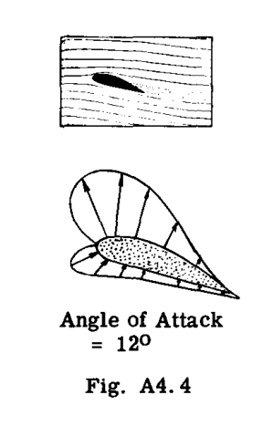
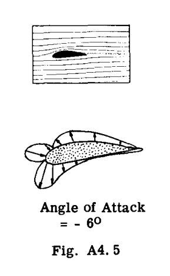
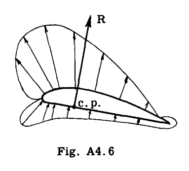
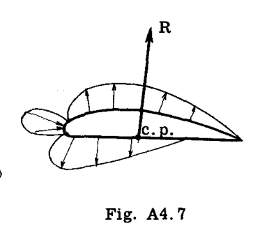

### 合空気力の揚力および抗力成分
合力  $R$  を扱う代わりに、空気力学的および応力解析の両方の検討において、合力を気流に対して垂直および平行な2つの成分に置き換えることが便利である。Fig. A4.8 は、この揚力（Lift）成分と抗力（Drag）成分への分解を示している。

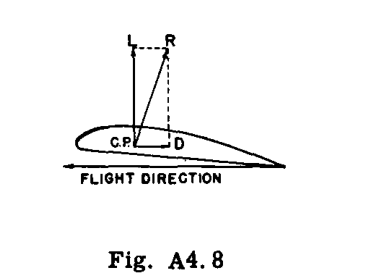

### 空力中心 (a.c.)
航空機は多くの異なる迎角で飛行するため、多くの飛行設計条件に対して圧力中心が変化することを意味する。たまたま、翼型上には、揚力と抗力によるモーメントがどの迎角に対しても一定である点が1つ存在する。この点は空力中心（Aerodynamic Center, a.c.）と呼ばれ、そのおおよその位置は前縁から測定して翼弦の 25% の位置にある。したがって、合力  $R$  は、Fig. A4.9 に示すように、空力中心における揚力と抗力、および翼モーメント  $M_{a.c.}$  に置き換えることができる。

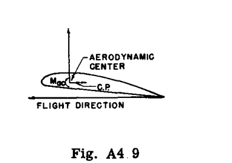

## A4.6 飛行中の航空機への力
Fig. A4.10 は、加速飛行状態における航空機にかかる主要な力を一般的に示している。

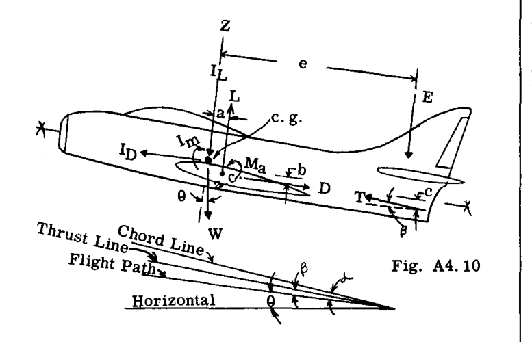

 $T$  = エンジン推力
 $L$  = 全翼揚力に胴体揚力を加えたもの
 $D$  = 航空機の全抗力
 $M_a$  = 翼の a.c.（空力中心）を基準とした  $L$  と  $D$  のモーメント
 $W$  = 航空機の重量
 $I_L$  = 飛行経路に垂直な慣性力
 $I_D$  = 飛行経路に平行な慣性力
 $I_m$  = 回転慣性モーメント
 $E$  = 飛行経路に垂直な尾翼荷重

水平等速飛行状態では、慣性力  $I_L, I_D, I_m$  はゼロになる。並進を伴うが自身の重心軸まわりの角加速度を伴わない加速飛行状態では、慣性モーメント  $I_m$  はゼロになるが、 $I_L$  と  $I_D$  は値を持つ。

### 定常飛行の平衡方程式
Fig. A4.10 から次のように書くことができる。

 $\sum F_x = 0, \quad D + W \sin 	heta - T \cos eta = 0$ 

 $\sum F_z = 0, \quad L - W \cos 	heta + T \sin eta - E = 0$ 

 $\sum M_y = 0, \quad -M_a - La - Db + Tc \cos eta + Ee = 0$ 

### 加速飛行の平衡方程式

 $\sum F_x = 0, \quad D + W \sin 	heta - T \cos eta - I_D = 0$ 

 $\sum F_z = 0, \quad L - W \cos 	heta + T \sin eta - I_L - E = 0$ 

 $\sum M_y = 0, \quad -M_a - La - Db + Tc \cos eta + Ee + I_m = 0$ 

使用される符号：
- 力 - プラスは上向きおよび尾翼方向
- モーメント - 時計回りがプラス
- 重心から力までの距離 - プラスは上向きおよび尾翼方向

## A4.7 荷重倍数
通常、記号 ( $n$ ) で与えられる荷重倍数（Load Factor）という用語は、定常飛行中の航空機にかかる力を乗じて、航空機の加速中に作用する動的力体系と等価な静的力体系を得るための数値的倍数として定義できる。Fig. A4.11 は定常水平飛行における力を示している。 $L$  は航空機の全揚力（翼プラス尾翼）を表す。したがって、 $L = W$  である。ここで、航空機が  $Z$  軸に沿って上向きに加速されていると仮定する。Fig. A4.12 は、加速度の方向とは逆に下向きに作用する追加の慣性力  $W a_z / g$  を示している。この航空機の全揚力  $L$  は次のように表される。

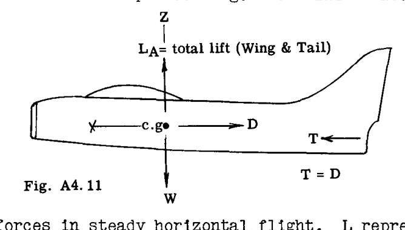
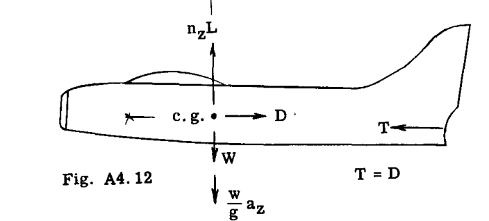

Fig. A4.11 における加速されていない状態の全揚力  $L$  は、 $Z$  方向の静的平衡を生み出すために荷重倍数  $n_z$  を乗じなければならない。
したがって、  $n_z L - W - rac{W}{g} a_z = 0$ 
 $L = W$  であるため、
したがって、  $n_z = 1 + rac{a_z}{g}$ 

航空機は当然、 $Z$  軸だけでなく  $X$  軸に沿っても加速される可能性がある。したがって Fig. A4.13 では、エンジン推力  $T$  の大きさは航空機の抗力  $D$  よりも大きく、これが航空機を前方へ加速させる。慣性力を  $X$  方向の荷重倍数  $n_x$  で表すと便利である。

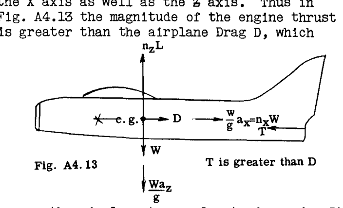

航空機の重量  $W$  は、したがって
 $n_x W = rac{W}{g} a_x$  (Fig. A4.13 参照)
 $\sum F_x = 0$ , ゆえに  $T - D - n_x W = 0$ 
したがって、 $n_x = rac{T - D}{W}$ 

したがって、航空機にかかる荷重は、荷重倍数の観点から議論することができる。適用または制限荷重倍数は、特定の航空機のサービス中に発生する可能性のある最大荷重倍数である。Art. A4.2 で議論されたこれらの荷重は、目立った永久変形なしに航空機構造によって受けられなければならない。

設計荷重倍数は、制限荷重倍数に安全率を乗じたものに等しく、これらの設計荷重は、破断や崩壊、言い換えれば完全な破壊なしに構造によって支えられなければならない。

## A4.8 航空機の設計飛行要件
文民および軍事航空当局は、航空機のさまざまな分類に対する設計条件を規定する要件を発行している。一般的に言えば、あらゆる航空機の飛行高度は、荷重倍数（加速度）と対気速度（より正確には動圧）の既存の値を述べることによって定義できる。

航空機の加速度は、操縦と空気の突風という2つの原因から生じる。操縦による加速度は、特定の加速度を超えないように制御装置を操作できる操縦士の制御下にある。高度な機動性を持つ軍用機では、加速度倍数を制限するためのガイドとして加速度計がコックピットの計器に含まれている。民間航空機では、操縦倍数は、その特定のタイプの航空機の必要な飛行運用において必要とされるあらゆる操縦を安全に処理できるほど高く設定されている。これらの制限操縦倍数は、長年の運用経験に基づいており、重量設計の観点から航空機に不利益を与えることなく、安全性の観点から満足のいく結果を与えている。

空気の突風に遭遇することによる航空機の加速度は、空気の突風の方向と速度に依存するため、操縦士の制御下にはない。民間および軍用航空機に加速度計を設置し、あらゆる種類の天候や場所で飛行させることで得られた多くの累積データから、毎秒 30 フィートの突風速度で十分であることがわかっている。

航空機の速度も航空機にかかる荷重に同様に影響を与える。速度が高くなるほど、空気力学的翼モーメントも高くなる。さらに、突風加速度は航空機の速度とともに増加する。したがって、特定の航空機を明確な最大飛行速度に制限するのが通例である。民間航空機の場合、速度は妥当な滑空速度に制限されており、これは妥当な飛行運用を処理するのに十分である。

## A4.9 突風荷重倍数
鋭いエッジを持つ突風が推力線（ $X$  軸）に垂直な方向で航空機に当たると、航空機の速度に急激な変化がないまま、翼の迎角に急激な変化が生じる。法線力係数 ( $C_{Z_A}$ ) は迎角に対して線形に変化すると仮定できる。したがって、Fig. (a) において、速度  $V$  で水平飛行を維持するために必要な航空機力係数  $C_{Z_A}$  を点 (B) で表し、鋭いエッジを持つ突風  $KU$  が  $V$  を変化させることなく迎角に急激な変化  $\Delta 	ext{a}$  を引き起こした後の  $C_{Z_A}$  の値を点 (C) とする。  $Z$  方向の航空機荷重の全増加は、したがって点 B における比  $C_{Z_A}$  で表すことができる。

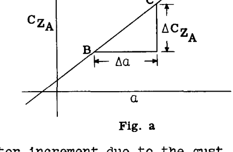
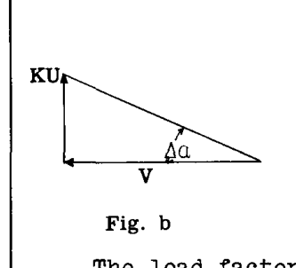

Fig. (b) から、小さな角度の場合、 $\Delta a = KU/V$  であり、Fig. (a) から、 $\Delta C_{Z_A} = m \Delta a$  である。ここで  $m$  = 航空機の法線力曲線の傾き（ラジアンあたり  $C_{Z_A}$ ）。

突風  $KU$  による荷重倍数の増分は、次のように表すことができる。

 $\Delta n = \frac{\Delta C_{Z_A}}{C_{Z_A}} = \frac{(KUm)}{V} \frac{(\rho V^2 S)}{2W} = \frac{KU V m}{575 W}$  (A)

ここで、
 $U$  = 突風速度 (ft./sec.)
 $K^*$  = 翼荷重に依存する突風補正係数（ $K$  の曲線は民間航空当局によって提供されている）。
 $V$  = 指示対気速度 (miles per hour)。
 $S$  = 翼面積 (sq. ft.)。
 $W$  = 航空機の総重量。

* NACA Technical Note 2964 (1953年6月) は、軽減係数  $K$  を突風係数  $K_g = 0.88 M_g / (5.3 + M_g)$  に置き換えることを提案している。この式において  $M_g$  は航空機の質量比または質量パラメータ  $2 W / 	ext{a} 
ho c g s$  であり、ここで  $c$  はフィート単位の平均幾何翼弦、 $g$  は重力加速度である。

 $U$  を 30 ft./sec. とし、 $m$  を絶対単位（度あたり）の迎角に対する  $C_{Z_A}$  の変化とすると、式 (A) は次のように簡約される。

 $\Delta n = \frac{3KmV}{W/S}$  (B)

したがって、航空機が水平姿勢で飛行しているときの突風荷重倍数  $n$  は、次のようになる。

 $n = 1 + \frac{3KmV}{W/S}$  (C)

航空機が垂直姿勢にあるときは、次のようになる。

 $n = \pm \frac{3KmV}{W/S}$  (D)

## A4.10 主要な飛行条件の図解。速度-荷重倍数線図
前述のように、航空機の主要な設計飛行条件は、加速度と速度の制限値を述べ、さらに適用される最大突風速度を加えることによって与えることができる。例として、ある航空機の設計荷重要件は次のように述べられる： 「提案される航空機は、最大水平飛行速度の 1.4 倍までの  $C_{L_{max}}$  に対応する速度から、すべての速度においてそれぞれ +6.0g および -3.5g の適用正負加速度に対して設計されるものとする。さらに、航空機は、最大水平飛行速度の 1.4 倍の制限速度までの任意の方向に作用する 30 ft./sec. の突風によるいかなる適用荷重にも耐えなければならない。これらの適用荷重には 1.5 の安全率を使用するものとする」。

グラフ形式では、これらの設計要件は、一般に速度-加速度線図（Velocity-acceleration diagram）と呼ばれる図を得るために、荷重倍数と速度をプロットすることによって表すことができる。上記の仕様の結果は Fig. A4.14 のようになる。したがって、線 AB および CD は、この図解では最大水平飛行速度の 1.4 倍とされる制限速度 BD 内の速度に制限される、制限された正負の操縦荷重倍数を表している。これらの制限された操縦線は、航空機の最大  $C_L$  値との交点によって点 A および C で終了する。点 A と B の間の速度では、一般的に、操縦士がこれらの値を超えるように制御装置を操作することが可能であるため、操縦士は操縦加速度を超えないように注意しなければならない。点 A および C 未満の速度では、航空機にかかる荷重に関する限り、操縦士の注意は必要ない。なぜなら、 $C_{L_{max}}$  を生成する操縦は、線 AB および CD で与えられる制限値よりも小さな加速度を与えるからである。

飛行経路に垂直な 30 ft./sec. の突風による正負の突風加速度を Fig. A4.14 に示す。この例の線図では、突風線が線 AB より下の線 BD と交差するため、正の突風は航空機の制限速度内では致命的ではない。負の突風の場合、突風荷重倍数は速度 F と D の間で致命的となり、最大加速度は点 E で与えられる。

必要な操縦倍数が比較的低い航空機の場合、突風加速度は正負の両方で致命的となる可能性がある。突風方程式の検討は、最も軽く荷重された状態（最小の総重量）が最大の突風荷重倍数を生じさせ、したがって部分的なペイロード、燃料などのみが関与することを示している。

線図において、点 A および B は一般に、それぞれ高迎角（H.A.A.）および低迎角（L.A.A.）と呼ばれるものに対応し、点 C および D はそれぞれ倒立（H.A.A.）および（L.A.A.）条件に対応する。

一般的に言えば、航空機が点 A, B, E, F, C における速度および加速度条件によって生成される空気荷重に対して設計されている場合、速度および加速度に関して指定された制限内で飛行すれば、構造強度の観点から安全であるはずである。

基本的には、飛行条件の要件は、指定された速度と加速度、および突風の考慮に基づいている。したがって、上記の基本的な議論を理解している学生は、これら3つの政府機関の設計要件を理解するのに苦労することはないはずである。

応力解析の目的で、すべての速度は指示対気速度（Indicated air speeds）として表される。「指示」対気速度は、標準大気条件下で海面における真の対気速度を示す完璧な対気速度計によって示される速度として定義される。実対気速度  $V_a$  と指示対気速度  $V_i$  の関係は、次の式で与えられる。

 $V_i = \sqrt{\frac{\rho_a}{\rho_0}} V_a$ 

ここで、
 $V_i$  = 指示対気速度
 $V_a$  = 実対気速度
 $\rho_0$  = 海面における標準空気密度
 $\rho_a$  =  $V_a$  が達成される空気の密度

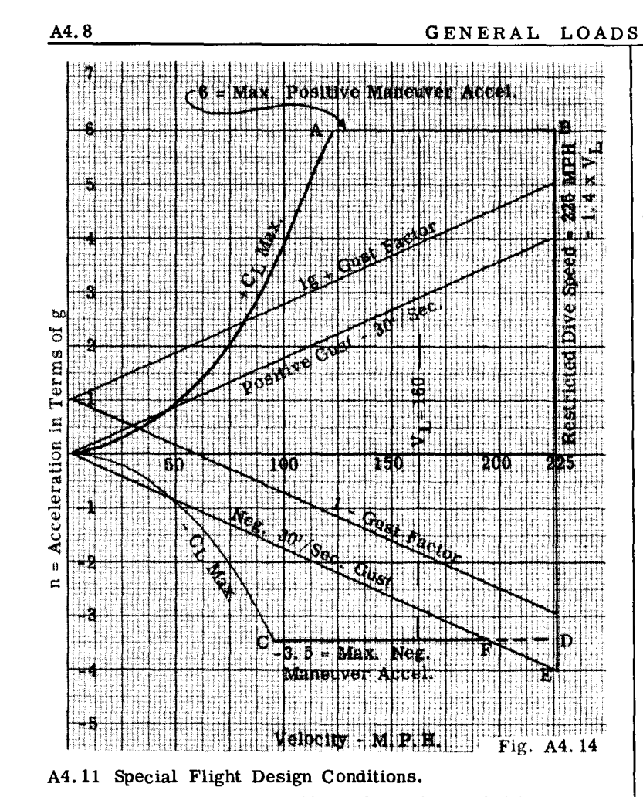

## A4.11 特殊飛行設計条件
翼や胴体構造の特定の部分にとって致命的となる可能性のある他の多くの飛行条件がある。ほとんどの航空機には、着陸速度を低下させるためのフラップが装備されており、そのようなフラップは最小着陸速度の少なくとも2倍の速度で下げられる。フラップ付き翼型は翼型特性の大きさや位置に異なる値を持つため、フラップを操作できる最大速度に関連する規定された要件内で、考えられるすべてのフラップ条件について翼構造をチェックしなければならない。一般的に言えば、フラップ条件はフラップより内側の翼部分にのみ影響を与え、通常、後部ビームのウェブまたはせん断壁、およびトルクボックスの上面および下面の壁に対してのみ致命的である。これは、フラップの偏向によって圧力中心がかなり後方に移動し、その結果、従来のカンチレバーボックスメタルビームと同様に、後部せん断壁により多くのせん断荷重とねじりモーメントが発生するためである。

航空機は同様に補助翼（エルロン）条件についても調査されなければならない。補助翼の操作は、航空機の翼の各サイドに異なる空気荷重を生じさせ、それが航空機の角ロール加速度を生じさせる。さらに、偏向された補助翼は翼型特性の大きさと位置を変化させるため、補助翼条件における荷重が通常の飛行条件における荷重よりも致命的であるかどうかを判断するために計算を行わなければならない。

尾翼への空気の突風によるピッチングモーメントから生じる角加速度については、エンジンが翼に取り付けられ、前縁の前方に位置している場合の翼への荷重をチェックする必要がある。

着陸装置が翼に取り付けられている場合、または燃料やエンジンが翼の中や上に搭載されている場合、着陸状態において翼構造に生じる荷重は、着陸装置やエンジン取り付け点の翼構造の内側のいくつかの部分にとって致命的となる可能性がある。

## A4.12 剛体航空機の加速運動を含む例題
前に説明したように、航空機にかかる適用力体系に慣性力を加えることにより、航空機を加速運動状態から静的平衡状態に置くのが一般的な実務である。通常、航空機は剛体であると仮定される。この一般的な手順を説明するために、いくつかの例題を提示する。

### 例題 1
Fig. A4.15 は、海軍の航空母艦に着陸し、航空機の拘束フックにかかるケーブルの引き  $T$  によって拘束されている航空機を示している。航空機の重量が 12,000 lbs. で、航空機に  $3.5g$  ( $112.7 ft/sec^2$ ) の一定の加速度が与えられている場合、フックの引き  $T$ 、車輪の反力  $R$ 、およびフックの引きの作用線と航空機の重心の間の距離 ( $d$ ) を求めよ。着陸速度が 60 M.P.H. である場合、停止距離はいくらか。

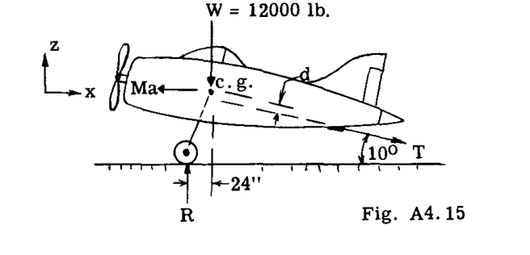

**解：**
拘束ケーブルと接触すると、航空機は Fig. A4.15 に対して右方向に減速される。運動は水平方向の純粋な並進である。慣性力は

 $Ma = \frac{W}{g} a = \left( \frac{12,000}{g} \right) 3.5g = 42,000 \text{ lb.}$ 

慣性力は加速度の方向とは逆に作用するため、Fig. A4.15 に示すように左方向に作用する。
未知の力  $T$  および  $R$  は、静的平衡方程式を使用して解くことができる。

 $\sum F_x = -42,000 + T \cos 10^\circ = 0$ 

したがって、  $T = 42,700 \text{ lb.}$ 

 $\sum F_z = -12,000 + R - 42,700 \times \sin 10^\circ = 0$ 

したがって、  $R = 19,420 \text{ lb.}$ 

距離 ( $d$ ) を求めるには、航空機の重心まわりのモーメントをとる。

 $\sum M_{c.g.} = 19,420 \times 24 - 42,700 d = 0$ 

したがって、  $d = 10.9 \text{ in.}$ 

着陸速度  $v_0 = 60 \text{ M.P.H.} = 88 \text{ ft/sec.}$ 

 $v^2 - v_0^2 = 2as$ 

代入：  $0^2 - 88^2 = 2(-112.7) s$ 

したがって、停止距離  $s = 34.4 \text{ ft.}$ 

### 例題 2
フロートを装備した航空機が、Fig. A4.16 に示すように海軍の巡洋艦から射出されている。カタパルト射出力  $P$  は航空機に  $3g$  ( $96.6 ft/sec^2$ ) の一定の水平加速度を与える。航空機の総重量は 9,000 lb. で、カタパルトのトラックは 35 ft. の長さである。射出機  $P$  とカタパルトカーからの反力  $R_1$  および  $R_2$  を求めよ。エンジンの推力は 900 lb. である。トラック走行終了時の航空機の速度はいくらか。

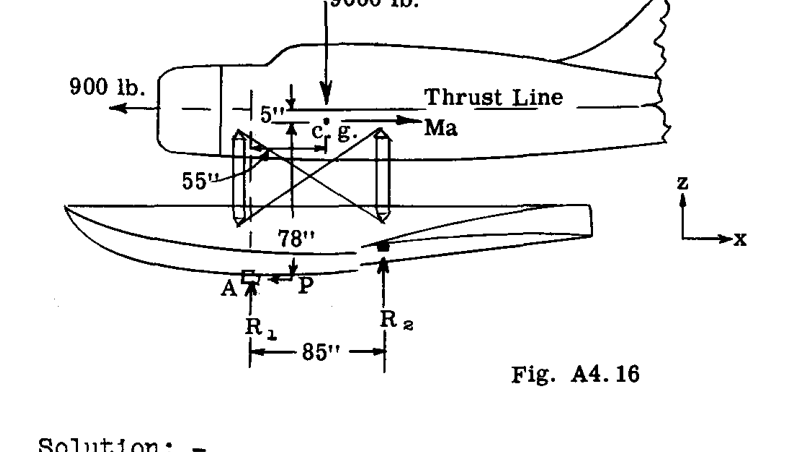

**解：**
力は、カートの速度が小さく、したがって航空機の翼の揚力および航空機の抗力が無視できる、カタパルト走行の開始直後について決定される。
航空機の尾部に向かって作用する水平慣性力は、

 $Ma = \left( \frac{9,000}{g} \right) 3.0g = 27,000 \text{ lb.}$ 

静力学から：

 $\sum F_x = -900 - P + 27,000 = 0$ , したがって  $P = 26,100 \text{ lb.}$ 

 $R_2$  を求めるには、点  $A$  まわりのモーメントをとる。

 $\sum M_A = 9,000 \times 55 + 27,000 \times 78 - 900 \times 83 - 85 R_2 = 0$ 

したがって、  $R_2 = 29,800 \text{ lb.}$ （上向き）

 $\sum F_z = 29,800 - 9,000 + R_1 = 0$ 

したがって、  $R_1 = -20,800 \text{ lb.}$ （下向きに作用）

カタパルトトラック終了時の速度は、次の式から求めることができる。

 $v^2 - v_0^2 = 2as$ 

または  $v^2 - 0 = 2 \times 96.6 \times 35$ 

 $v = 82 \text{ ft/sec.} = 56 \text{ M.P.H.}$ 

### 例題 3
Fig. A4.17 に示すような輸送機が、着陸時に接地した直後で、航空機を静止させるために後輪に 35,000 lb. のブレーキ力がかかっていると仮定する。着陸の水平速度は 85 M.P.H. ( $125 ft/sec$ ) である。航空機にかかる空気力を無視し、プロペラ力をゼロと仮定して、接地反力  $R_1$  および  $R_2$  はいくらか。一定のブレーキ力での着陸滑走距離はいくらか。

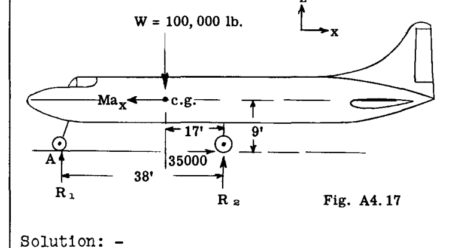

**解：**
航空機は水平方向に減速されているため、航空機の重心を通る慣性力は航空機の前方に向かって作用する。ブレーキ力が与えられているので、平衡方程式によって減速因子を解くことができる。

 $\sum F_x = 35,000 - Ma_x = 0$ 

したがって、  $Ma_x = 35,000$ 

または  $\left( \frac{W}{g} \right) a_x = 35,000$ 

ゆえに  $a_x = \left( \frac{35,000}{100,000} \right) 32.2 = 11.27 \text{ ft/sec}^2$ 

着陸滑走距離 ( $s$ ) を求めるために、

 $v^2 - v_0^2 = 2 a_x s$ 

 $0 - 125^2 = 2 (-11.27) s$ 

したがって、  $s = 695 \text{ ft.}$ 

 $R_2$  を求めるには、点 (A) まわりのモーメントをとる。

 $\sum M_A = 100,000 \times 21 - 35,000 \times 9 + 38 R_2 = 0$ 

 $R_2 = 47,000 \text{ lb.}$ （車輪2つ分）

 $\sum F_z = 47,000 - 100,000 + R_1 = 0$ 

 $R_1 = 53,000 \text{ lb.}$ 

### 例題 4
Fig. A4.18 の航空機は重量が 14,000 lb. である。速度 500 M.P.H. ( $733 ft/sec$ ) で水平に飛行しており、操縦士が曲率半径 2,500 ft. の曲線経路に引き上げた。エンジンの推力と航空機の抗力は等しく、反対方向で、互いに同一直線上にあると仮定する（Fig. A4.18 には示されていない）。
以下を求めよ：
(a) 航空機の  $Z$  方向の加速度
(b) 翼の揚力 ( $L$ ) と尾翼の力 ( $T$ )
(c) 航空機の荷重倍数。

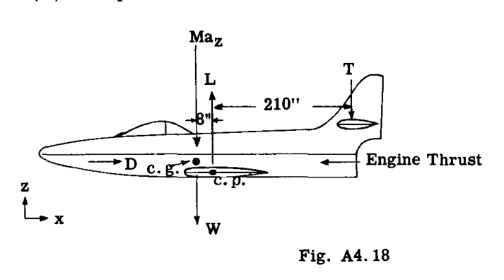

**解：**
加速度  $a_z = rac{v^2}{r} = rac{733^2}{2,500} = 215 \text{ ft/sec}^2$ 
または  $214.5 / 32.2 = 6.68g$ （上向き）。
飛行経路に垂直で下向きに作用する慣性力は、

 $Ma_z = \left( \frac{14,000}{g} \right) 6.68g = 93,520 \text{ lb.}$ 

この力を航空機の重心に配置することで静的平衡が促進され、したがって尾翼荷重  $T$  を求めるには、翼の空力中心 ( $c.p.$ ) まわりのモーメントをとる。

 $\sum M_{c.p.} = -(14,000 + 93,520) 8 + 210 T = 0$ 

したがって、  $T = 4100 \text{ lb.}$ （下向き）

翼の揚力 ( $L$ ) を求めるために、

 $\sum F_z = -4100 - 14,000 - 93,520 + L = 0$ 

 $L = 111,600 \text{ lb.}$ 

航空機の荷重倍数 =  $\frac{\text{航空機の揚力}}{W} = \frac{111,600 - 4100}{14,000} = 7.7$ 

### 例題 5
例題 4 で使用されたのと同じ姿勢の航空機を想定する。ここで、操縦士が操縦桿を急に前方に押し、航空機に  $4 \text{ rad/sec}^2$  のピッチング角加速度を与えたとする。
(a) 翼の揚力が変化しないと仮定して、慣性力と尾翼荷重  $T$  を求めよ。
(b) Fig. A4.19 に示す重心位置を持つ重量 1500 lb. のジェットエンジンにかかる力を求めよ。
航空機の慣性モーメント  $I_y$ （ピッチング）を  $300,000 \text{ lb. sec}^2 \cdot \text{in.}$  と仮定する。

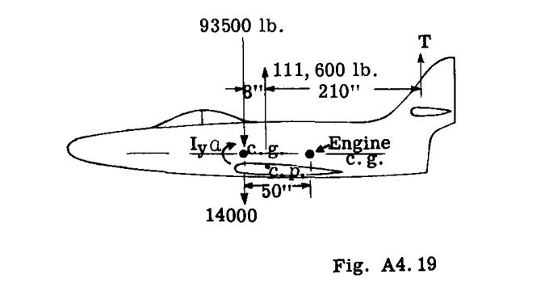

**解：**
Fig. A4.19 は、例題 4 で求めた揚力と慣性力を持つ航空機の自由体を示している。
角加速度  $\alpha = 4 \text{ rad/sec}^2$  による追加の慣性力は、

 $I_y \alpha = 300,000 \times 4 = 1,200,000 \text{ in. lb.}$ 

これは角加速度の方向に対して時計回り、または反対方向に作用する。
航空機は現在静的平衡状態にあり、尾翼荷重  $T$  を求めるには、航空機の重心まわりのモーメントをとる。

 $\sum M_{c.g.} = 1,200,000 - 111,600 \times 8 - 218 T = 0$ 

 $T = 1,409 \text{ lb.}$ 

 $Ma_z$  を求めるために、

 $\sum F_z = 111,600 - 14,000 + 1,409 - Ma_z = 0$ 

 $Ma_z = 99,009 \text{ lb.}$ 

したがって、  $a_z = \left( \frac{99,009}{14,000} \right) g = 7.1 g \text{ ft/sec}^2$ 

エンジンの重心は Fig. A4.19 に示すように、航空機の重心から 50 インチ後方にある。エンジンにかかる力は、その自重 1500 lb. と、 $a_z$  および  $\alpha$  による慣性力になる。
 $a_z$  による慣性力は、

 $Ma_z = \left( \frac{1500}{g} \right) 7.1g = 10,630 \text{ lb.}$ 

角加速度  $\alpha$  による慣性力は、

 $Mr\alpha = \frac{1500}{32.2 \times 12} \times 50 \times 4 = 776 \text{ lb.}$ （下向き）

すると、エンジンにかかる合力は、

 $1500 + 10,630 + 776 = 12,906 \text{ lb.}$ （下向き）

注：もしエンジンが航空機の重心より前方にあった場合、776 lb. の慣性力は下向きではなく上向きに作用する。
特定の航空機部品にかかる角加速度による慣性力を計算する場合、式  $F = Mr\alpha$  は、その特定の部品が自身の重心  $Y$  軸まわりの慣性モーメントが無視できるほど小さいことを前提としている。大きな部品の場合、この重心質量慣性モーメントが無視できない可能性があり、航空機の  $I_y$  に含める必要がある。
そのような部品の慣性力を求めるには、式  $F = Mr\alpha$  を次のように修正する必要がある。

 $F = (I_{c.g.} \alpha) / r$  　ここで

 $r$  = 航空機の重心から部品の重心までの距離またはアーム。
 $I_{c.g.}$  = 部品の航空機の重心まわりの質量慣性モーメント =  $I_0 + Mr^2$ 
ここで  $I_0$  は部品の自身の重心  $Y$  軸まわりの質量慣性モーメントである。
 $F$  = 半径  $r$  に垂直な lb. 単位の慣性力。

### 例題 6
Fig. A4.20 は、総重量が 100,000 lb. の大型輸送機を示している。航空機のピッチング質量慣性モーメントは  $I_y = 40,000,000 \text{ lb. sec}^2 \cdot \text{in.}$  である。
航空機は前輪がわずかに地面から離れた状態で水平着陸を行っている。後輪の反力は 319,000 lb. で、100,000 lb. の抗力成分と 300,000 lb. の垂直成分を与えるような角度で傾いている。
求めよ：
(a) 航空機にかかる慣性力。
(b) 重量が 180 lb. で、位置が Fig. A4.20 に示されている操縦士にかかる合力荷重。

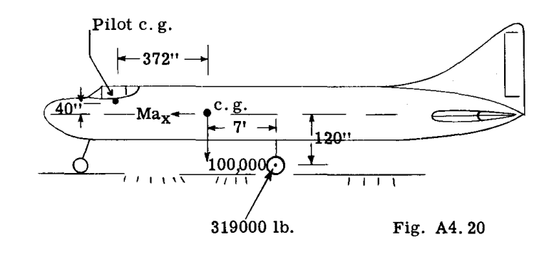

**解：**
この例題では翼の揚力は無視される。
航空機にかかる慣性力は、 $M a_x$  と  $M a_z$  の力、および偶力  $I_{c.g.} \alpha$  である。
 $M a_x$  を求めるために、

 $\sum F_x = 100,000 - M a_x = 0$ 

または  $M a_x = 100,000 \text{ lb.}$ 

したがって、  $a_x = \frac{100,000}{M} = \left( \frac{100,000}{100,000} \right) g = 1g \rightarrow$ 

 $M a_z$  を求めるために、

 $\sum F_z = 300,000 - 100,000 - M a_z = 0$ 

 $M a_z = 200,000 \text{ lb.}$ 

したがって、  $a_z = \frac{200,000}{M} = \left( \frac{200,000}{100,000} \right) g = 2g \uparrow$ 

慣性偶力  $I_{c.g.} \alpha$  を求めるために、航空機の重心まわりのモーメントをとる。

 $\sum M_{c.g.} = -100,000 \times 120 - 300,000 \times 84 + I_{c.g.} \alpha = 0$ 

 $I_{c.g.} \alpha = 37,200,000 \text{ lb.}$ 

したがって、角加速度  $\alpha = \frac{37,200,000}{40,000,000} = 0.93 \text{ rad/sec}^2$ 

操縦士にかかる合力荷重の計算：

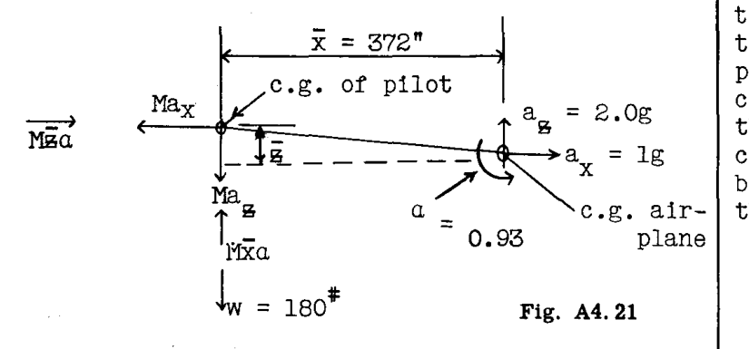

Fig. A4.21 は航空機の重心加速度を示している。
操縦士にかかる力は、操縦士の体重 180 lb. と、図に示されるさまざまな慣性力で構成される。

 $M a_x = \left( \frac{180}{g} \right) 1g = 180 \text{ lb.}$ 

 $M a_z = \left( \frac{180}{g} \right) 2.0g = 360 \text{ lb.}$ 

角加速度  $\alpha$  による慣性力は、航空機の重心と操縦士の間の半径アームに垂直に作用する。便宜上、この垂直な力を  $z$  および  $x$  成分に置き換える。

 $F_x = M z \alpha = \frac{180}{32.2 \times 12} \times 40 \times 0.93 = 17 \text{ lb.}$ 

 $F_z = M x \alpha = \frac{180}{32.2 \times 12} \times 372 \times 0.93 = 161 \text{ lb.}$ 

操縦士にかかる  $x$  方向の全荷重は、

 $180 - 17 = 163 \text{ lb.}$ 

操縦士にかかる  $z$  方向の全荷重は、

 $360 + 180 - 161 = 379 \text{ lb.}$ 

したがって、合力  $R$  は、

 $\sqrt{379^2 + 163^2} = 410 \text{ lb.}$ 

## A4.13 航空機が剛体でないことの影響
Art. A4.12 の例題は、航空機が剛体である（構造変形を受けない）ことを前提としている。この仮定に基づき、飛行中または着陸状態において航空機に適用される荷重は、航空機の加速度により発生する慣性力と平衡状態に置かれる。航空機構造が他の構造と同様に剛体ではなく、特に並進および着陸の両方の状態においてかなり大きな曲げ変形を受けるカンチレバー翼であることは明らかである。Fig. A4.21 は、ボーイング B-47 航空機のテスト翼の複合写真を示している。示されている最大の上向きおよび下向きの変形は設計荷重に対するものであり、一般に適用荷重の 1.5 倍である。これら2つの高迎角条件における適用荷重下での翼の変形が、写真に示されている変形の 2/3 になると言うのは正しくない。なぜなら、設計荷重下では翼の大部分が材料の弾性限界を超えて応力を受けているか、あるいは剛性係数が弾性係数よりも大幅に小さい塑性域に入っているからである。したがって、適用荷重下での変形は、写真に示されているものの 2/3 よりもいくらか小さくなる。したがって、この写真は、翼構造が剛体とはほど遠いものであることを非常に印象的に示している。

静的荷重とは、徐々に適用され、構造に目立った衝撃や振動を引き起こさない荷重である。高速機では、空気の突風、飛行操縦、着陸反力はかなり急速に適用されるため、動的荷重として分類できる。したがって、これらの動的荷重が柔軟な（非剛体）航空機のカンチレバー翼に当たると、かなり大きな翼の変形が生じ、翼は振動する傾向がある。したがって、この振動は翼の質量ユニットにさらなる加速度を引き起こし、それは翼にさらなる慣性力が発生することを意味する。さらに、外力の適用速度が翼の自然曲げ振動数に近づくと、励起された振動によって非常に大きな追加の翼応力が発生する可能性がある。

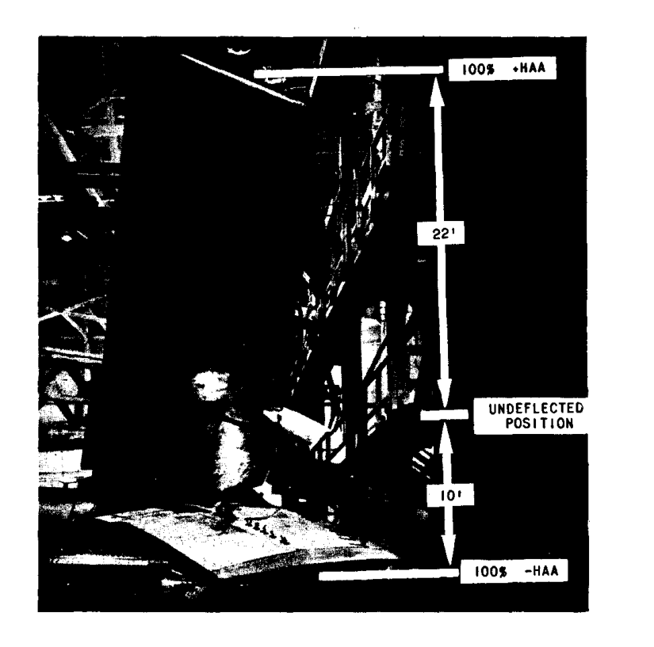

第二次世界大戦まで、事実上すべての航空機は構造設計の目的で剛体として仮定されていた。戦時中、剛体解析に基づく従来の設計手順が満足のいく、あるいは安全な応力を示していた荷重条件下で、航空機の故障が発生した。これらの故障は間違いなく、航空機が剛体ではないことによる動的過応力によるものであった。

さらに、航空機の設計の進歩により、翼が薄くなり、翼幅が比較的大きくなり、多くの場合、これらの翼には動力装置、爆弾、翼端燃料タンクなどの集中質量が搭載されるようになった。そのため、翼の柔軟性が増し、自然曲げ振動数が低下した。この事実は、航空機の速度が大幅に向上し、その結果、空気の突風荷重がより急速に適用されるようになったこと、あるいは荷重の特性がより動的になったことと相まって、翼構造への全体的な荷重効果は無視できないものとなり、翼の強度設計において無視することはできない。

### 翼荷重への空気力の一般的動的影響
航空機における重大な空気荷重は、操縦士による航空機の操縦、または横方向の空気の突風に遭遇することによって引き起こされる。輸送機は、乗客を輸送する任務において高い航空機加速度を生じさせるような急激な操縦のために設計される必要はないため、操縦荷重を適用する時間は、高速から急激に引き起こしを行う戦闘機よりもかなり長い。

Fig. A4.22 は、180 M.P.H. におけるダグラス D.C.3 航空機の引き起こし操縦の結果を、荷重倍数対荷重適用の時間の関係で示している。示されているように、3.25 の荷重倍数のピーク荷重は、1秒の時間の終わりに得られた。

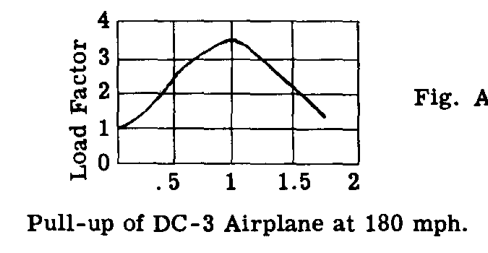

著者は、D.C.3 翼の自然振動数を毎秒 10 ～ 15 サイクル程度と見積もっており、したがって、翼の半変形サイクル時間の 1/10 または 1/15 に対して 1 秒の荷重時間は、動的過応力が目立たないことを示している。一般に、輸送機における操縦荷重下での動的過応力は、空気の突風や着陸などの他の条件ほど大きくはないと言える。

### 空気の突風による動的影響
空気の突風速度が高くなり、航空機の速度が高くなるほど、翼に荷重を加える時間は短くなる。

NACA Technical Note 2424 は、双発のマーチン輸送機での飛行試験結果を報告している。翼構造のさまざまな点にひずみ計が配置され、法線方向の航空機加速度も記録されたさまざまな突風条件に対してひずみが読み取られた。その後、同様の航空機法線加速度を与えるために、ゆっくりとした引き起こし操縦が行われた。翼は 3.8 cps の自然振動数を持ち、航空機の速度は 250 M.P.H. であった。このレポートで示された結論のうちの2つは次の通りである： (1) 空気の突風下での単位法線加速度あたりの曲げひずみは、すべての測定位置および試験の飛行条件において、ゆっくりとした引き起こしのものよりも約 20% 高かった。(2) 翼の曲げひずみの動的成分は、主に基本翼曲げモードの励起によるものであると考えられた。

これらの結果は、空気の突風が、民間輸送機タイプの航空機に対して同じ航空機法線加速度を与える操縦荷重よりも急速に空気荷重を翼に加えることを示しており、したがって動的ひずみ効果は突風条件に対してより顕著になる。

Fig. A4.23, 24, 25 は、Bisplinghoff* によって決定された、大型翼への空気の突風の動的影響の結果を示している。これらの図の結果は、動的影響が翼の一部の部分で翼の力を大幅に増加させ、他の部分では減少させる傾向があることを示している。

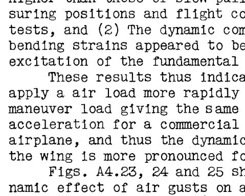
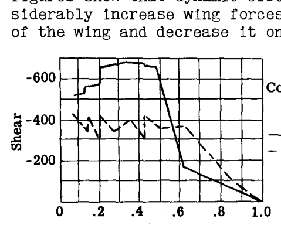
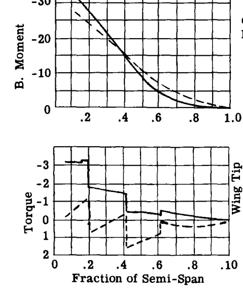

* 「動的荷重下における航空機構造の応力に関する調査報告書」 M. I. T. 出版。

飛行艇において、従来の着陸装置を介して適用される着陸荷重や、水圧によって適用される荷重も、動的荷重として分類されるほど急速に適用されることがわかっており、そのような翼幅の大きい翼に適用される荷重は、そのような構造の安全な設計において無視できない動的応力を生じさせる。

## A4.14 航空機の構造設計における動的荷重の影響に関する一般的結論
ターボジェットエンジンとロケットエンジンの登場により、ほんの数年前には夢にも思わなかったような航空機速度の範囲が開かれ、すでに遷音速および超音速航空機が一般的になりつつある。空気力学的観点から、そのような速度は薄い翼型断面を余儀なくし、それが高密度の翼を促進した。したがって、軍用爆撃機や近い将来のジェット民間輸送機のような、かなりの翼幅を持ち、通常、エンジン、燃料タンクなどの集中質量を翼に搭載している航空機の場合、動的応力がかなりのものになるため、航空機を剛体とする仮定は十分に正確ではない。

翼の動的荷重の計算には、翼構造の質量および剛性分布が既知である必要がある。翼の構造設計が開始される時点ではこれらの要因は不明であるため、設計における一般的な手順は、まず翼を剛体と仮定し、航空機の空気力学的特性および動的慣性力の蓄積に対する弾性翼の影響をおおよそ考慮するために、過去の設計経験や利用可能な研究情報に基づく補正係数を加えることである。このようにして初期設計された翼について、完全な動的解析によってチェックし、結果に応じて修正し、その後、修正された弾性翼に対して再計算を行うことができる。この手順は、高速コンピュータが利用可能になったため、現在では実用的である。

## A4.15 演習問題

(1). Fig. A4.26 の航空機は、航空機に 3.25g の前方加速度を与えるケーブルの引き  $T$  によって航空母艦のデッキから射出されている。航空機の総重量は 15,000 lb. である。
(a) 射出ケーブルの張力荷重  $T$ 、および車輪の反力  $R_1$  と  $R_2$  を求めよ。
(b) 飛行速度が 75 M.P.H. である場合、必要な射出距離と射出時間  $t$  はいくらか。

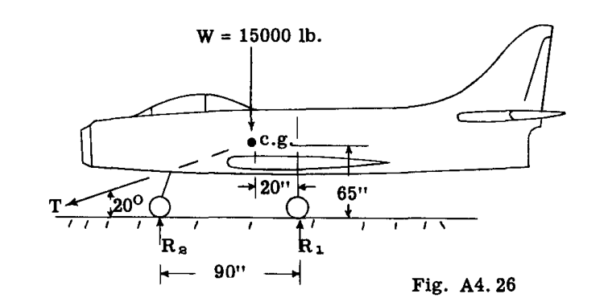

(2). Fig. A4.26 の航空機が滑走路に 75 M.P.H. で着陸し、後輪に垂直方向の後輪反力の 0.4 に等しいブレーキがかけられていると仮定する。航空機の水平減速度と停止距離はいくらか。

(3). Fig. A4.27 の飛行パトロール艇は、図に示すように 250,000 lb. の合力底面水圧を受けて水上着陸を行う。揚力および尾翼荷重を図のように仮定する。航空機のピッチング慣性モーメントは 10,000,000 lb. sec² · in. である。航空機のピッチング角加速度を求めよ。艇体の後端の座席に座っている、体重 200 lb. の乗組員にかかる全荷重はいくらか。

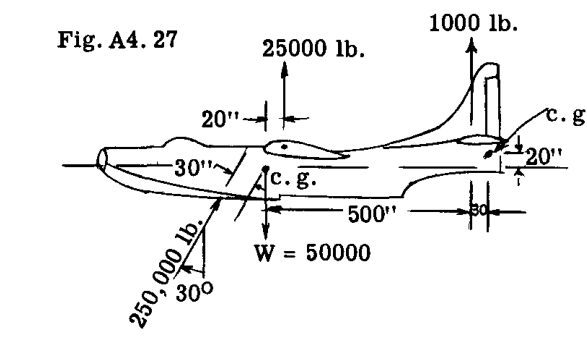

(4). Fig. A4.28 のジェット機は、操縦士が 8g の引き起こしを開始したとき、600 M.P.H. の速度で急降下している。航空機の重量は 16,000 lb. である。エンジンの推力と航空機の全抗力は等しく、反対方向で、同一直線上にあると仮定する。
(a) 引き起こし開始時の飛行経路の半径を求めよ。
(b)  $Z$  方向の慣性力を求めよ。
(c) 揚力  $L$  と尾翼荷重  $T$  を求めよ。

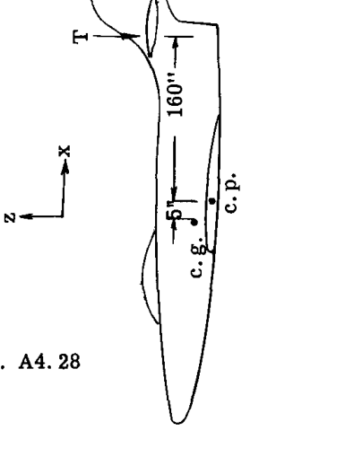