# 第A5章  
# はり — せん断とモーメント  

## A5.1 はじめに  
一般に、その縦軸に対して垂直に荷重を支持する構造部材は、**はり（beam）**と呼ばれる。航空機の構造には、翼や胴体など、はりユニットの優れた例が数多く存在する。航空機の主要な構造ユニットにおいて、曲げ力のみが単独で作用することは極めて稀であり、通常は軸力やねじり力が伴う。しかし、曲げ力とはりの曲げによる結果としての応力は、通常、ばり構造の設計において最も重要である。  

## A5.2 静定ばりと不静定ばり  
はりは、既知の負荷荷重と未知の支持反力を受けるものと考えることができる。もし、既知の負荷荷重の支持反力への配分が、静的平衡の条件のみ、すなわち力とモーメントの総和がゼロであることから決定できる場合、そのはりは**静定ばり（statically determinate beam）**と見なされる。しかし、既知の負荷荷重の支持反力への配分が、載荷中のはり材料の挙動に影響される場合、支持反力は静的平衡方程式のみでは求めることができず、そのはりは**不静定ばり（statically indeterminate beam）**に分類される。このようなはりを解くには、はりの変形に基づく他の条件を、静的平衡方程式と組み合わせて使用しなければならない。  

## A5.3 せん断力と曲げモーメント  
与えられたはりには、特定の既知の負荷荷重が作用する。はりを静的平衡状態に保つための反力は、必要な静的平衡方程式、すなわち以下の式によって計算される。  

-  $\sum V = 0$ 、すなわちすべての鉛直方向の力の代数和がゼロ。  
-  $\sum H = 0$ 、すなわちすべての水平方向の力の代数和がゼロ。  
-  $\sum M = 0$ 、すなわちすべてのモーメントの代数和がゼロ。  

はり全体が静的平衡状態にあるとき、はりのどの部分も同様に静的平衡状態になければならない。ここで、Fig. A5.1のはりを考える。 $P = 100 \text{ lb}$  の既知の負荷荷重は、図に示すように25および75 lbsの2つの反力によって平衡が保たれており、これらは単純な静力学から計算される。（この問題では、はりの自重は無視する）。ここで、はりを断面 a-a で切断し、Fig. A5.2に示すように右側の部分を自由体（free body）として考える。  

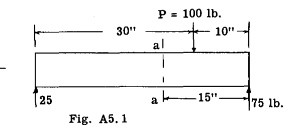  
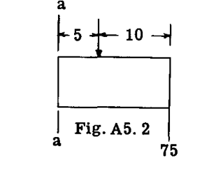  

静的平衡のためには、このはりの部分に作用するすべての力とモーメントについて、 $\sum V$ 、 $\sum H$ 、および  $\sum M$  がゼロに等しくなければならない。Fig. A5.3において  $\sum V = 0$  を考えると：  

$$  
\sum V = 75 - 100 = -25 \text{ lb.}  
$$  

(1)  

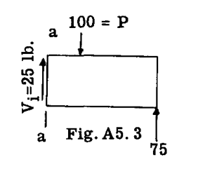  

したがって、示された力の下では、力系はV方向に不均衡であり、そのため、V方向の力の平衡を生じさせるために、断面 a-a に  $25 \text{ lb}$  に等しい内部抵抗力  $V_1$  が存在していなければならない。Fig. A5.3は、平衡のために存在しなければならない抵抗せん断力  $V_1 = 25 \text{ lb}$  を示している。  

Fig. A5.3において  $\sum M = 0$  を考慮し、断面 a-a 上の点 O のまわりのモーメントをとると、  

$$  
\sum M_o = -75 \times 15 + 100 \times 5 = -625 \text{ in.lb.}  
$$  

(2)  

 $-625$  の不均衡モーメントは、はりの部分を断面 a-a のまわりに回転させようとする。平衡を保つためには、断面 a-a に対抗する抵抗モーメント  $M = 625$  が存在しなければならない。Fig. A5.4は、 $V_1$  と  $M_1$  が作用している自由体を示している。  

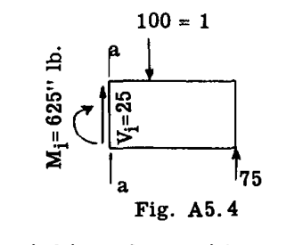  

次に  $\sum H$  はゼロでなければならない。外力および内部抵抗せん断力  $V_1$  には水平成分がない。したがって、抵抗モーメント  $M_1$  を生じさせる内部力は、水平方向の不均衡力が生じないようなものでなければならない。これは、抵抗モーメント  $M_1$  が、Fig. A5.5に示すような偶力（couple）の形、すなわち  $M_1 = Cd$  または  $Td$  であり、 $T$  が  $C$  と等しくなければ、 $\sum H = 0$  にならないことを意味する。  

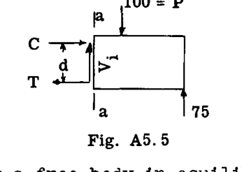  

はりに作用する荷重と反力が、はりのある部分を隣接する部分に対して上または下にせん断または移動させようとする傾向は、**外部鉛直せん断力（External Vertical Shear）**、または一般に**せん断力（Vertical Shear）**と呼ばれ、記号  $V$  で表される。  

式(1)から、はりの任意の断面におけるせん断力は、**せん断力を求めようとする断面の片側に作用するすべての力と反力の代数和**として定義できる。断面の左側の部分が右側の部分に対して上方に移動しようとする傾向がある場合、せん断力の符号は正（positive shear）とされ、逆の傾向がある場合は負（negative shear）とされる。言い換えれば、力の代数和が左側で上向き、または右側で下向きの場合、せん断力は正であり、左側で下向き、または右側で上向きの場合は負である。  

式(2)から、はりの任意の断面における曲げモーメントは、**断面に関する、断面のいずれかの側に作用するすべての力のモーメントの代数和**として定義できる。この曲げモーメントがはりの上部繊維に圧縮（短縮）を、下部繊維に引張（伸長）を生じさせる傾向がある場合、曲げモーメントは正（positive bending moment）に分類され、逆の状態の場合は負とされる。  

## A5.4 せん断力図とモーメント図  
航空機の設計では、はりの大部分が奥行きや断面においてテーパーしており、また変動する分布荷重を支持している。したがって、そのようなはりの様々な断面を設計またはチェックするには、はりに沿ったすべての断面におけるせん断力と曲げモーメントの値の全体像を把握する必要がある。これらの値を基準線からの縦座標としてプロットした場合、得られる曲線は**せん断力図（Shear diagram）**および**モーメント図（Moment diagram）**と呼ばれる。学生のこれらの図に関する知識をリフレッシュするために、いくつかのせん断力図とモーメント図の例をプロットする。  

### 例題1  
Fig. A5.6に示すはりのせん断力図と曲げモーメント図を描け。はりの自重は無視する。  

一般に、最初のステップは反力を決定することである。  
 $R_B$  を求めるには、点 A のまわりのモーメントをとる。  
$$  
\sum M_A = -4 \times 500 + 1000 \times 5 + 300 \times 13 - 10R_B = 0  
$$  
よって  $R_B = 690 \text{ lb.}$   

$$  
\sum V = -500 + R_A - 1000 - 300 + 690 = 0  
$$  
よって  $R_A = 1110 \text{ lb.}$   

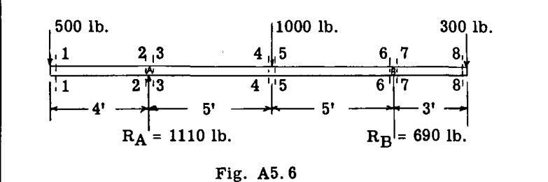  

**せん断力図の計算：**  
はりの左端から始める。 $500 \text{ lb}$  荷重のすぐ右側の断面、すなわち断面 1-1 を考え、断面の左側の部分を考慮すると、断面 1-1 におけるせん断力は  $\sum V = -500$ （負、左側で下向き）である。  

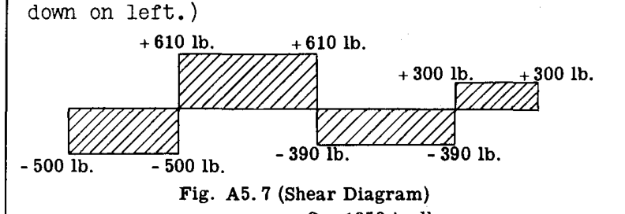  
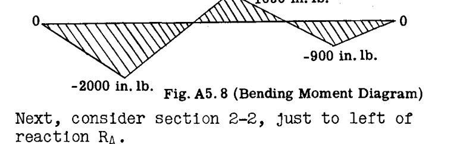  

次に、 $R_A$  のすぐ左側の断面 2-2 を考えると、  
 $\sum V = -500$  となり、断面 1-1 と同じである。  

次に、 $R_A$  のすぐ右側の断面 3-3 を考えると、  
 $\sum V = -500 + 1110 = 610$ （正、断面の左側で上向き）である。  

次に、 $1000 \text{ lb}$  荷重のすぐ左側の断面 4-4 を考えると、  
 $\sum V = -500 + 1110 = 610$ （断面 3-3 と同じ）である。  

 $1000 \text{ lb}$  荷重の右側の断面 5-5 を考えると、  
 $\sum V = -500 + 1110 - 1000 = -390$ （左側で下向き）である。  

自由体の右側の部分を使用して、断面 5-5 におけるこのせん断力をチェックする。  
 $\sum V = -300 + 690 = 390$  となり、これはチェックに一致する（ $\sum V$  が右側で上向きのため、せん断力の符号はマイナス）。  
断面 6-6 では、右側の部分を自由体として使用する：  
 $\sum V = -300 + 690 = 390$ （マイナスせん断）。  
断面 7-7：  
 $\sum V = -300$ （正せん断、右側で下向き）。  
断面 8-8：  
 $\sum V = -300$ （正せん断）。  
Fig. A5.7は、せん断力図にプロットされた値を示している。  

**曲げモーメント図の計算：**  
断面 1-1 から始め、左側の力のみを考慮する：  
 $\sum M = -500 \times 0 = 0$   
断面 2-2 と 3-3 はわずかな距離しか離れていないため、 $R_A$  のすぐ上の断面を想定し、左側の力のみを考慮する：  
 $\sum M = -500 \times 4 = -2000 \text{ in. lb.}$ （負のモーメント、上部繊維に引張が生じるため）。  
 $1000 \text{ in. lb.}$  荷重下の断面を考慮する：  
左側への  $\sum M = -500 \times 9 + 1110 \times 5 = 1050 \text{ in. lb.}$ （正のモーメント、上部繊維を圧縮）。  

右側の力を考慮してチェックする：  
 $\sum M \text{ right} = 300 \times 8 - 690 \times 5 = -1050 \text{ in. lb.}$   
次に、 $R_B$  上の断面を考慮する：  
 $\sum M \text{ right} = 300 \times 3 = 900 \text{ in. lb.}$ （負のモーメント、上部繊維に引張）。  
断面 8-8 において：  
 $\sum M \text{ right} = 300 \times 0 = 0$   
Fig. A5.8は、プロットされた値を示している。  

### 例題2  
Fig. A5.9に示すはりと荷重について、せん断力図とモーメント図を計算し描け。  
まず、反力  $R_A$  と  $R_B$  を決定する：  
 $\sum M_A = 36 \times 10 \times 18 + 120 \times 9 - 36R_B = 0$   
よって  $R_B = 210 \text{ lb.}$   
 $\sum V = -120 - 36 \times 10 + 210 + R_A = 0$   
よって  $R_A = 270 \text{ lb.}$   

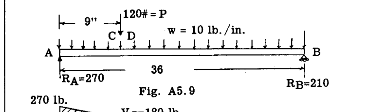  
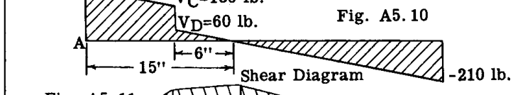  
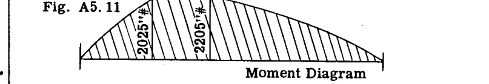  

**せん断力図：**  
 $R_A$  における反力のすぐ右側の鉛直せん断力は 270 上向き、すなわち正である。これは Fig. A5.10 において線 AE としてプロットされている。荷重のすぐ左側の断面 C における鉛直せん断力は、断面の左側の力を考慮すると  $= 270 - 9 \times 10 = 180 \text{ lb.}$  上向き、すなわち正である。A と C の間の、A から距離  $x$  における任意の断面の鉛直せん断力は：  
 $V_x = 270 - 10x$  となり、したがってせん断力は A における 270 から C における 180 まで、 $10 \text{ lb/in.}$  の一定の割合で減少する。  
荷重のすぐ右側の断面 D における鉛直せん断力は、  
 $V_D = \sum V_{left} = 270 - 10 \times 9 - 120 = 60$  上向き、すなわち正。  

点 D と B の間の任意の断面が A から距離  $x$  にあるときの鉛直せん断力は：  
 $V_{DB} = 270 - 120 - 10x$  — — — (1)  

点 B、 $x = 36$  において：  
したがって  $V_B = 270 - 120 - 10 \times 36 = -210 \text{ lb.}$  となり、これは反力  $R_B$  と一致する。  
鉛直せん断力は D から B まで  $10 \text{ lb/in.}$  の割合で減少するため、D から  $6"$  の位置、すなわちせん断力が  $60 \text{ lb}$  である D 点から、せん断力がゼロになる点まで減少する。  
この点は、式(1)をゼロとおいて  $x$  について解くことによっても特定できる。  
 $0 = 270 - 120 - 10x$ 、よって  $x = \frac{150}{10} = 15"$ （A点より）。  

**曲げモーメント図：**  
反力  $R_A$  のすぐ右側の断面 A において、左側の力を考慮すると、反力  $R_A$  の腕がゼロであるため、曲げモーメントはゼロである。  
左側の反力  $R_A$  から距離  $x$  にある A と C の間の任意の断面における曲げモーメントは、  
 $M_x = R_A x - \frac{wx^2}{2}$  — — — (2)  

式(2)において、 $x$  は 9 より大きくなることはできない。  
D と B の間（ $x$  が 9 より大きい）の曲げモーメントの式は  
 $M_x = R_A x - P(x - 9) - \frac{wx^2}{2}$  — — — (3)  
 $= 270x - 120(x - 9) - \frac{10x^2}{2}$   
 $= 1080 + 150x - 5x^2$  — — — (4)  

断面 C、 $x = 9"$  において、式(4)に代入すると、  
 $M_c = 1080 + 150 \times 9 - 5 \times 9^2 = 2025 \text{ in. lb.}$ （正、上部繊維を圧縮）。  
せん断力がゼロになる点、 $x = 15"$  において、  
 $M = 1080 + 150 \times 15 - 5 \times 15^2 = 2205$   
このように、式(2)および(4)に代入することにより、プロットされたモーメント図 Fig. A5.11 が得られる。  

## A5.5 最大曲げモーメントの断面  
例題2のはりの曲げモーメントの一般式は、式(3)より、  
 $M_x = R_A x - P(x - 9) - \frac{wx^2}{2}$   

ここで、 $M_x$  を最大または最小にする  $x$  の値は、 $M_x$  の  $x$  に関する一次導関数をゼロに等しくする値である。すなわち、  
$$  
\frac{dM_x}{dx} = R_A - P - wx = 0  
$$  
(5)  

したがって、 $M_x$  を最大または最小にする  $x$  の値は、以下の方程式から求めることができる。  
$$  
R_A - P - wx = 0  
$$  
しかし、この方程式を観察すると、項  $R_A - P - wx$  は左側の反力から距離  $x$  の断面におけるせん断力であることがわかる。したがって、**せん断力がゼロであるところで曲げモーメントは最大になる**。したがって、せん断力がゼロである場所を示すせん断力図は、最大曲げモーメントの点を特定するための便利な手段となる。  

## A5.6 せん断力と曲げモーメントの関係  
式(5)は次のように書くこともできる。  
$$  
\frac{dM}{dx} = V  
$$  
なぜなら、式(5)の右辺部分はせん断力に等しいからである。したがって、  
$$  
dM = Vdx  
$$  
(6)  

これは、わずかな距離  $dx$  だけ離れた2つの断面における曲げモーメントの差  $dM$  が、その2つの断面の間のせん断曲線の下の面積  $Vdx$  に等しいことを意味する。したがって、2つの断面  $x_1$  と  $x_2$  について、  
$$  
\int_{M_1}^{M_2} dM = \int_{x_1}^{x_2} Vdx  
$$  
したがって、**せん断力図の任意の2点間の面積は、その2点間の曲げモーメントの変化量に等しい**。  

この関係を説明するために、例題2（Fig. A5.10）のせん断力図を考える。左側の反力  $R_A$  と荷重の間の曲げモーメントの変化は、これら2点間のせん断力図の面積に等しく、  
$$  
\frac{270 + 180}{2} \times 9 = 2025 \text{ in. lb.}  
$$  
左側支持点での曲げモーメントはゼロであるため、この変化量は、荷重  $P$  下の断面における真のモーメントに等しい。  

これに点 D とせん断力ゼロの点の間の小さな三角形の面積を加えると、  
せん断力、または  $\frac{60}{2} \times 6 = 180$  であり、最大モーメントとして  $2205 \text{ in. lb.}$  が得られる。これは、せん断力ゼロの点と点 B の間のせん断力図の面積をとることによってチェックできる：  
$$  
\frac{210}{2} \times 21 = 2205 \text{ in. lb.}  
$$  

### 例題3  
Fig. A5.12は、支柱 BD および CE によって支持された着陸装置のオレオ支柱 ADEO を示している。図に示すように、車軸を通して  $15000 \text{ lb}$  の着陸地上荷重が加えられている。すべての部材の軸荷重と、オレオ支柱のせん断力および曲げモーメント図を求めることが要求されている。  

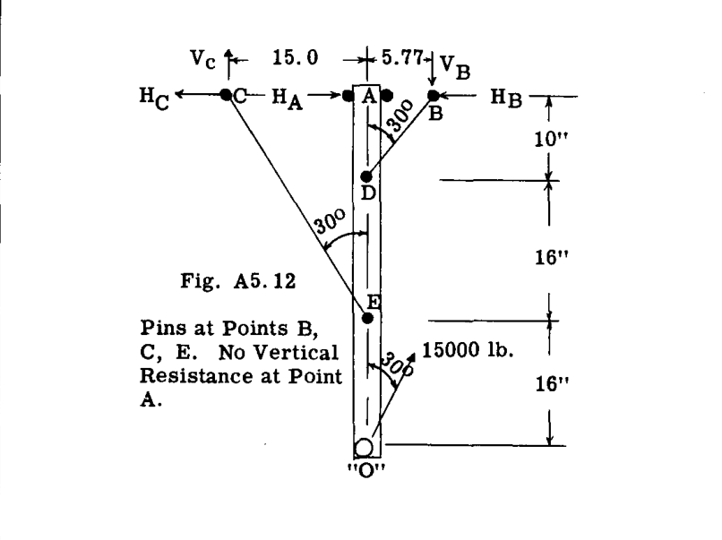  

**解：**  
 $V_c$  を求めるために、点 B のまわりのモーメントをとる。  
$$  
\sum M_B = -15000 \times 0.5 \times 42 + 15000 \times 0.866 \times 5.77 + 20.77 V_c = 0  
$$  
よって  $V_c = 11550 \text{ lb.}$   
部材 CE の軸荷重はしたがって、  
 $11550 / \cos 30^\circ$  または  $13330 \text{ lb.}$   
 $\therefore H_c = 11550 \times \frac{15}{26} = 6660$   

 $H_A$  を求めるために、点 D のまわりのモーメントをとる。  
$$  
\sum M_D = 11550 \times 15 - 6660 \times 10 - 15000 \times 0.5 \times 32 + 10 H_A = 0  
$$  
よって  $H_A = 13340 \text{ lb.}$   
 $V_B$  を求めるために、 $\sum F_V = 0$  をとる。  
$$  
\sum F_V = 15000 \cos 30^\circ + 11550 - V_B = 0  
$$  
よって  $V_B = 24550 \text{ lb.}$   
部材 BD の軸荷重はしたがって  $24550 / \cos 30^\circ = 28360 \text{ lb.}$ （圧縮）に等しい。反力  $H_B$  はしたがって  $28360 \times \sin 30 = 14180 \text{ lb.}$  に等しい。  

Fig. A5.13は、計算された点 A、D、E における反力を持つ自由体としてのオレオ支柱を示している。Fig. A5.13はまた、軸荷重、鉛直せん断、および曲げモーメント図も示している。  

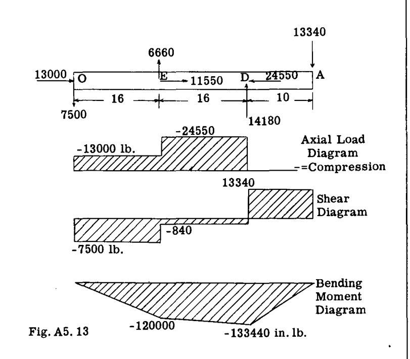  

はりの曲げ変形を考慮しない、負荷された荷重による曲げモーメントは、通常、**一次曲げモーメント（primary bending moments）**と呼ばれる。部材が軸荷重を支持している場合、軸荷重に部材の横方向のたわみを乗じた値により、追加の曲げモーメントが生じる。これらの曲げモーメントは通常、**二次曲げモーメント（secondary bending moments）**と呼ばれる。（A23-30節では二次モーメントの計算を扱っている）。  

### 例題4  
Fig. A5.14は、横方向荷重と縦方向荷重の両方が負荷されたはりを示している。このはりの荷重は、あらゆる種類の固定機器を支持する飛行機胴体内の内部はりの典型的なものである。はりの反力は点 A と B にある。要求事項：せん断力図と曲げモーメント図を描け。  

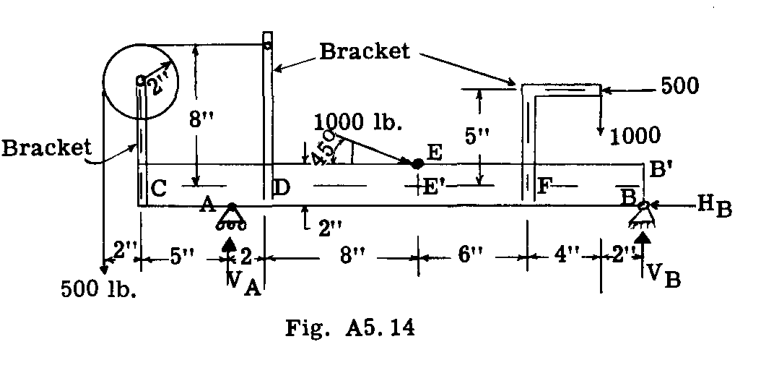  

**解：**  
A および B における反力の計算：  
 $V_B$  を求めるために、点 A のまわりのモーメントをとる。  
$$  
\sum M_A = -500 \times 7 - 500 \times 6 + 1000 \times 20 + 1000 \times \sin 45^\circ \times 10 + 1000 \cos 45^\circ \times 2 - 22 V_B = 0  
$$  
よって  $V_B = 999.3 \text{ lb.}$ （上向き）。  
 $V_A$  を求めるために  $\sum V = 0$  をとる。  
$$  
\sum V = 999.3 - 1000 - 1000 \sin 45^\circ - 500 + V_A = 0  
$$  
よって  $V_A = 1207.8 \text{ lb.}$ （上向き）。  
 $H_B$  を求めるために  $\sum H = 0$  をとる。  
$$  
\sum H = -500 + 1000 \cos 45^\circ - H_B = 0 \text{、よって } H_B = 207.1  
$$  

 $45^\circ$  の  $1000 \text{ lb}$  荷重を除き、すべての荷重はブラケットに加えられ、そのブラケットははりへと固定されている。したがって、次のステップは、はりの中心線支持点における負荷されたブラケットの反力を求めることである。E点での荷重とB点での反力  $H_B$  もはりの中心線に関連付けられる。  
Fig. A5.15 (a,b,c,d) は、自由体としての片持ちブラケットを示している。これらのブラケットの底部における反力が決定される。これらの反力を反転させたものが、点 C、D、F、E においてはりに加えられる荷重となる。  

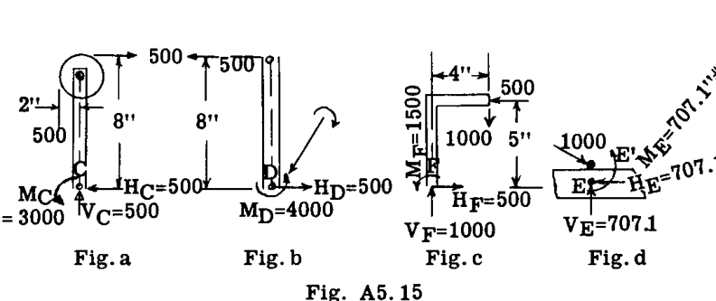  

ブラケット C において、 $H_c$  を求めるために  $\sum H = 0$  をとると、明らかに  $H_c = 500 \text{ lb}$  である。同様に  $\sum V = 0$  を使用して  $V_c = 500 \text{ lb}$  を求める。 $M_c$  を求めるために点 C のまわりのモーメントをとる。 $\sum M_c = -500 \times 2 + 500 \times 8 - M_c = 0$ 、よって  $M_c = 3000 \text{ in. lb.}$ 。学生は点 D および F におけるブラケットの底部での反力をチェックすべきである（Fig. b,c 参照）。  