# 第A5章

# 梁 - せん断力とモーメント

## A5.1 はじめに

一般に、その縦軸に対して垂直に荷重を支持する構造部材は梁（ビーム）と呼ばれる。航空機の構造には、翼や胴体などの梁ユニットの優れた例が多く見られる。主要な航空機構造ユニットに曲げ力だけが単独で作用することは極めて稀であり、通常は軸力やねじり力が伴う。しかし、梁の曲げによる曲げ力と、その結果生じる梁の応力は、通常、梁構造の設計において最も重要である。

## A5.2 静定梁と不静定梁

梁は、既知の適用荷重と未知の支持反力を受けるものと考えることができる。もし適用された既知の荷重の支持反力への配分が、静止平衡条件のみから、すなわち力とモーメントの総和がゼロであることから決定できる場合、その梁は静定梁と見なされる。しかし、既知の適用荷重の支持反力への配分が、載荷中の梁材料の挙動に影響を受ける場合、支持反力は静止平衡方程式だけでは求めることができず、その梁は不静定梁に分類される。このような梁を解くには、静止平衡方程式と組み合わせて、梁の変形に基づいた他の条件を使用しなければならない。

## A5.3 せん断力と曲げモーメント

与えられた梁は、ある既知の適用荷重を受ける。梁を静止平衡状態に保つための梁の反力は、静止平衡の必要な方程式、すなわち以下によって計算される。

 $\Sigma V=0$ 、またはすべての垂直方向の力の代数和はゼロである。  
 $\Sigma H=0$ 、またはすべての水平方向の力の代数和はゼロである。  
 $\Sigma M=0$ 、またはすべてのモーメントの代数和はゼロである。  

梁全体が静止平衡状態にあるとき、梁のあらゆる部分も同様に静止平衡状態でなければならない。ここで、Fig. A5.1の梁を考えてみよう。既知の適用荷重  $P=100 \text{ lb}$  は、図示されているように、単純な静力学から計算された25および75 lbsの2つの反力によって平衡状態に保たれている。（この問題では梁の自重は無視される）。ここで、梁をセクション a-a で切断したと考え、右側の部分を Fig. A5.2 に示すように平衡状態にある自由体として考える。

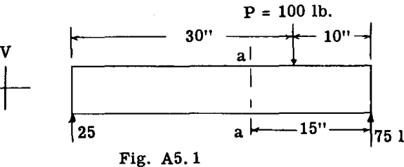

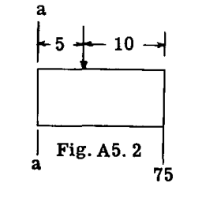

静止平衡のためには、この梁の部分に作用するすべての力とモーメントについて、 $\Sigma V$ 、 $\Sigma H$ 、および  $\Sigma M$  がゼロに等しくなければならない。Fig. A5.3 における  $\Sigma V=0$  を考えると、

$$
\Sigma V = 75 - 100 = - 25 \text{ lb.} \text{ (1)}
$$

したがって、示された力の下では、力系はV方向に不均衡であり、それゆえ、V方向の力の平衡を生じさせるために、セクション a-a には  $25 \text{ lb}$  に等しい内部抵抗力  $V_1$  が存在していたはずである。Fig. A5.3 は、平衡のために存在しなければならない抵抗せん断力  $V_1 = 25 \text{ lb}$  を示している。

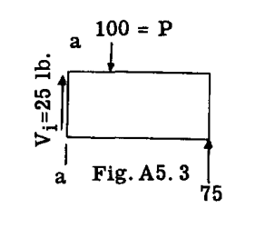

Fig. A5.3 において  $\Sigma M=0$  を考慮し、セクション a-a 上のある点 O の周りのモーメントをとると、

$$
\Sigma M_o = - 75 \times 15 + 100 \times 5 = - 625 \text{ in.lb.} \text{ (2)}
$$

すなわち、 $- 625$  の不均衡なモーメントが、梁の部分をセクション a-a の周りに回転させようとする。平衡を提供するために、セクション a-a には反対方向の抵抗モーメント  $M = 625$  が存在しなければならない。Fig. A5.4 は、 $V_1$  と  $M_1$  が作用している自由体を示している。

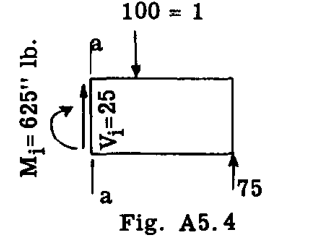

さて、 $\Sigma H$  はゼロに等しくなければならない。外力および内部抵抗せん断力  $V_1$  は水平成分を持たない。したがって、抵抗モーメント  $M_1$  を生じさせる内部力は、不均衡な水平力が生じないようなものでなければならない。

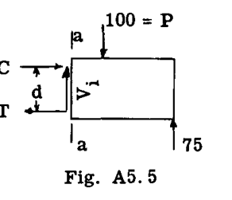

これは、抵抗モーメント  $M_1$  が Fig. A5.5 に示されるような偶力の形をとること、あるいは  $M_1 = Cd$  または  $Td$  であり、 $\Sigma H=0$  とするために  $T$  が  $C$  と等しくなければならないことを意味する。

梁に作用する荷重と反力が、梁の一方の部分を隣接する梁の部分に対して相対的に上または下にせん断または移動させようとする傾向は、外的部分垂直せん断力、または一般に梁の垂直せん断力と呼ばれ、記号  $V$  で表される。

方程式 (1) から、梁の任意の断面における垂直せん断力は、せん断力を求めたい断面の一方の側に作用するすべての力と反力の代数和として定義できる。もし断面の左側の部分が右側の部分に対して上向きに移動しようとする傾向がある場合、垂直せん断力の符号は正のせん断力とされ、傾向が逆であれば負とされる。言い換えれば、力の代数和が左側で上向き、または右側で下向きであれば、垂直せん断力は正であり、左側で下向き、または右側で上向きであれば負である。

方程式 (2) から、梁の任意の断面における曲げモーメントは、断面に関する断面のいずれか一方の側に作用するすべての力のモーメントの代数和として定義できる。もしこの曲げモーメントが梁の上部繊維の圧縮（短縮）と下部繊維の引張（伸長）を生じさせようとする傾向がある場合、曲げモーメントは正の曲げモーメントに分類され、逆の状態であれば負とされる。

## A5.4 せん断力図とモーメント図

航空機の設計では、梁の大部分は深さと断面においてテーパー状になっており、また変化する分布荷重も受けている。したがって、そのような梁のさまざまな断面を設計またはチェックするためには、梁に沿ったすべての断面における垂直せん断力と曲げモーメントの値に関する完全な全体像を持つことが必要である。これらの値を基準線からの縦座標としてプロットした場合、得られる曲線はせん断力およびモーメント図と呼ばれる。学生のこれらの図に関する知識をリフレッシュするために、いくつかのせん断力およびモーメント図の例をプロットする。

### 例題 1

Fig. A5.6 に示される梁のせん断力図および曲げモーメント図を描け。梁の自重は無視せよ。

一般に、最初のステップは反力を決定することである。
 $R_B$  を求めるために、点 A の周りのモーメントをとる。
 $\Sigma M_A = - 4 \times 500 + 1000 \times 5 + 300 \times 13 - 10R_B = 0$   
したがって  $R_B = 690 \text{ lb}$ 。  
 $\Sigma V = - 500 + R_A - 1000 - 300 + 690 = 0$   
したがって  $R_A = 1110 \text{ lb}$ 。

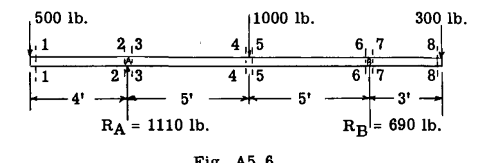

#### せん断力図の計算:
梁の左端から開始する。 $500 \text{ lb}$  荷重のすぐ右側の断面、すなわちセクション 1-1 を考え、その断面の左側の部分を考慮すると、1-1 における垂直せん断力は  $= \Sigma V = - 500$  （負、左側で下向き）である。

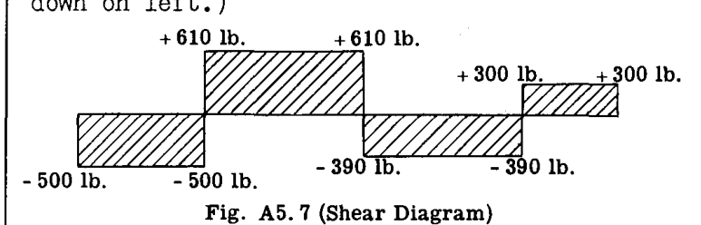

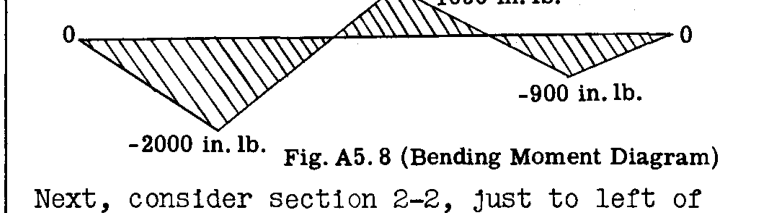

次に、反力  $R_A$  のすぐ左側にあるセクション 2-2 を考える。  
 $\Sigma V = - 500$ 、すなわちセクション 1-1 と同じである。

次に、 $R_A$  のすぐ右側にあるセクション 3-3 を考える。  
 $\Sigma V = - 500 + 1110 = 610$  （正、断面の左側で上向き）。

次に、 $1000 \text{ lb}$  荷重のすぐ左側にあるセクション 4-4 を考える。  
 $\Sigma V = - 500 + 1110 = 610$  （セクション 3-3 と同じ）。

 $1000 \text{ lb}$  荷重のすぐ右側にあるセクション 5-5 を考える。  
 $\Sigma V = - 500 + 1110 - 1000 = - 390$  （左側で下向き）。

自由体として梁の右側の部分を使用して、セクション 5-5 におけるこのせん断力をチェックする。  
 $\Sigma V = - 300 + 690 = 390$ 。これはチェックに合格する（右側で  $\Sigma V$  が上向きであるため、せん断力の符号はマイナスである）。セクション 6-6 では、自由体として右側の部分を使用する。  
 $\Sigma V = - 300 + 690 = 390$  （マイナスのせん断力）。

セクション 7-7:  
 $\Sigma V = - 300$  （正のせん断力、右側で下向き）。

セクション 8-8:  
 $\Sigma V = - 300$  （正のせん断力）。

Fig. A5.7 はせん断力図にプロットされた値を示している。

#### 曲げモーメント図の計算:
セクション 1-1 から開始し、左側の力のみを考慮する。  
 $\Sigma M = - 500 \times 0 = 0$   

セクション 2-2 と 3-3 は微分的な距離しか離れていないため、 $R_A$  のすぐ上のセクションを想定し、左側の力のみを考慮する。  
 $\Sigma M = - 500 \times 4 = - 2000 \text{ in.lb.}$  （負のモーメント。上部繊維に引張が生じるため）。

 $1000 \text{ in.lb.}$  荷重の下のセクションを考える。左側のモーメントをとる。  
左側の  $\Sigma M = - 500 \times 9 + 1110 	imes 5 = 1050 \text{ in.lb.}$  （正のモーメント。上部繊維を圧縮する）。

右側の力を考慮してチェックする。  
右側の  $\Sigma M = 300 \times 8 - 690 	imes 5 = - 1050 \text{ in.lb.}$   

次に、 $R_B$  の上の断面を考える。  
右側の  $\Sigma M = 300 \times 3 = 900 \text{ in.lb.}$  （負のモーメント、上部繊維に引張）。

セクション 8-8 において:  
右側の  $\Sigma M = 300 \times 0 = 0$   

Fig. A5.8 はプロットされた値を示している。

以上の結果から、ある断面の左側にある力から曲げモーメントを求めた場合、時計回りであれば曲げモーメントは正であることがわかる。右側の力から求めた場合は、反時計回りであれば正である。学生は、変形した構造のおおよその形状をスケッチし、上部および下部繊維に引張または圧縮のどちらが存在するかから符号を決定すべきである。

### 例題 2

Fig. A5.9 に示される梁および載荷について、せん断力図およびモーメント図を計算し描け。

まず、反力  $R_A$  および  $R_B$  を決定する。  
 $\Sigma M_A = 36 \times 10 \times 18 + 120 \times 9 - 36R_B = 0$   
したがって  $R_B = 210 \text{ lb}$ 。  
 $\Sigma V = - 120 - 36 \times 10 + 210 + R_A = 0$   
したがって  $R_A = 270 \text{ lb}$ 。

#### せん断力図:
点 A の反力のすぐ右側の垂直せん断力は  $270$  上向き、すなわち正である。これは Fig. A5.10 において線 AE としてプロットされている。荷重のすぐ左側、セクション C における垂直せん断力は、セクションの左側の力を考慮して  $= 270 - 9 \times 10 = 180 \text{ lb}$  上向き、すなわち正である。A と C の間の任意のセクションで、A からの距離が  $x$  の場所の垂直せん断力は、

 $V_x = 270 - 10x$  であり、したがってせん断力は A における 270 から C における 180 まで、 $10 \text{ lb/in}$  の一定の割合で減少する。

荷重のすぐ右側、セクション D における垂直せん断力は、
 $V_D = \Sigma V_{\text{left}} = 270 - 10 \times 9 - 120 = 60$  上向き、すなわち正である。

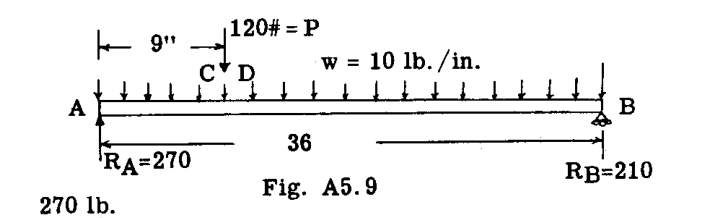

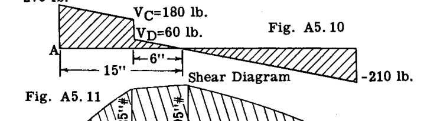

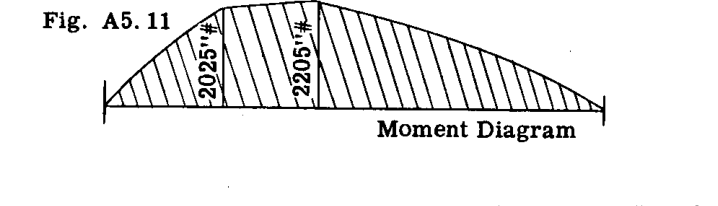

D と B の間の任意のセクションで、A からの距離が  $x$  の場所の垂直せん断力は、

$$
V_{DB} = 270 - 120 - 10x \text{ (1)}
$$

点 B ( $x=36$ ) において:  
したがって  $V_B = 270 - 120 - 10 \times 36 = - 210 \text{ lb}$  となり、これは反力  $R_B$  と一致する。
垂直せん断力は D から B まで  $10 \text{ lb/in}$  の割合で減少するため、せん断力が D から 6インチ の場所で、せん断力がゼロになる点がある。なぜなら D におけるせん断力は  $60 \text{ lb}$  だからである。
この点は、方程式 (1) をゼロに等しいと置いて  $x$  について解くことによっても求めることができる。  
 $0 = 270 - 120 - 10x$ 、すなわち  $x = \frac{150}{10} = 15 \text{ インチ (A点から)}$ 。

もしせん断力図が集中荷重の下でゼロを通過した場合、せん断力方程式をゼロに等しいと置いて  $x$  について解く方法は使用できなかったはずである。したがって一般に、せん断力がゼロになる場所を見つけるにはせん断力図を描くのが最善である。Fig. A5.10 はプロットされたせん断力図を示している。

#### モーメント図:
反力  $R_A$  のすぐ右側のセクション A において、左側の力を考慮すると、 $R_A$  の腕がゼロであるため、曲げモーメントはゼロである。
A と C の間の任意のセクションで、左反力  $R_A$  からの距離が  $x$  の場所の曲げモーメント  $M_x$  は、

$$
M_x = R_A x - \frac{wx^2}{2} \text{ (2)}
$$

方程式 (2) において、 $x$  は 9 より大きくなることはできない。D と B の間（ $x$  が 9 より大きい）の曲げモーメントの方程式は、

$$
M_x = R_A x - P(x-9) - \frac{wx^2}{2} \text{ (3)}
$$

$$
= 270x - 120(x-9) - \frac{10x^2}{2}
$$

$$
= 1080 + 150x - 5x^2 \text{ (4)}
$$

セクション C ( $x=9\text{インチ}$ ) において、方程式 (4) に代入すると、
 $M_C = 1080 + 150 \times 9 - 5 \times 9^2 = 2025 \text{ in.lb.}$  （正、上部繊維の圧縮）。

せん断力ゼロの点 ( $x=15\text{インチ}$ ) において、
 $M = 1080 + 150 \times 15 - 5 \times 15^2 = 2205$ 

このように、方程式 (2) および (4) に代入することにより、Fig. A5.11 にプロットされたモーメント図が得られる。

## A5.5 最大曲げモーメントの断面

例題 2 の梁の曲げモーメントの一般式は、方程式 (3) から得られる。

$$
M_x = R_A x - P(x-9) - \frac{wx^2}{2}
$$

さて、 $M_x$  を最大または最小にする  $x$  の値は、 $M_x$  の  $x$  に関する一次導関数をゼロに等しいとした値、すなわち

$$
\frac{dM_x}{dx} = R_A - P - wx = 0 \text{ (5)}
$$

したがって、 $M_x$  を最大または最小にする  $x$  の値は、次の方程式から求められる。

$$
R_A - P - wx = 0
$$

しかし、この方程式を観察すると、項  $R_A - P - wx$  は左反力から距離  $x$  にあるセクションのせん断力であることがわかる。したがって、せん断力がゼロの場所で、曲げモーメントは最大である。このように、せん断力がゼロである場所を示すせん断力図は、最大曲げモーメントの点を特定するための便利な手段である。

## A5.6 せん断力と曲げモーメントの関係

方程式 (5) は次のように書くこともできる。
 $\frac{dM}{dx} = V$ 
なぜなら、方程式 (5) の右辺はせん断力に等しいからである。

したがって、
$$
dM = V dx \text{ (6)}
$$

これは、微小な距離  $dx$  だけ離れた2つのセクションにおける曲げモーメントの差  $dM$  が、その2つのセクション間のせん断曲線の下の面積  $V dx$  に等しいことを意味する。したがって、任意の2点間のせん断力図の面積は、その2点間の曲げモーメントの変化量に等しい。

この関係を説明するために、例題 2 のせん断力図 (Fig. A5.10) を考える。左反力  $R_A$  と荷重の間の曲げモーメントの変化は、これら2点間のせん断力図の面積に等しく、すなわち、
 $\frac{270 + 180}{2} \times 9 = 2025 \text{ in.lb.}$  である。左支持点における曲げモーメントはゼロであるため、この変化量はしたがって荷重  $P$  の下のセクションにおける真のモーメントに等しい。

これに、点 D とせん断力ゼロの点との間の小さな三角形の面積  $\frac{60}{2} \times 6 = 180$  を加えると、最大モーメントとして  $2205 \text{ in.lb.}$  が得られる。これは、せん断力ゼロの点と点 B との間のせん断力図の面積をとることによってチェックできる。
 $\frac{210}{2} \times 21 = 2205 \text{ in.lb.}$  である。

### 例題 3

Fig. A5.12 は、ストラット BD および CE によって支持された着陸装置オレオ支柱 ADEO を示している。図示されているように、車輪軸を通して  $15000 \text{ lb}$  の着陸接地荷重が作用している。すべての部材の軸荷重と、オレオ支柱のせん断力および曲げモーメント図を求めよ。

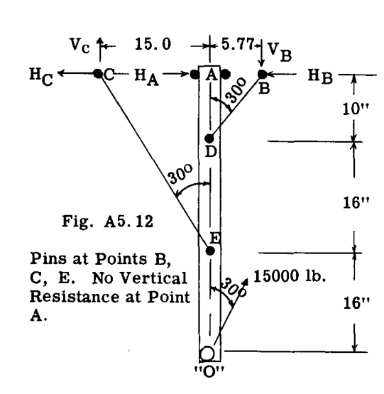

#### 解法:
 $V_C$  を求めるために、点 B の周りのモーメントをとる。  
 $\Sigma M_B = - 15000 \times 0.5 \times 42 + 15000 \times 0.866 \times 5.77 + 20.77 V_C = 0$   
したがって  $V_C = 11550 \text{ lb}$ 。

部材 CE の軸荷重はしたがって、
 $11550 / \cos 30^\circ$  または  $13330 \text{ lb}$ 。  $\therefore H_C = 11550 \times 15/26 = 6660$ 

 $H_A$  を求めるために、点 D の周りのモーメントをとる。  
 $\Sigma M_D = 11550 \times 15 - 6660 \times 10 - 15000 \times 0.5 \times 32 + 10 H_A = 0$   
したがって  $H_A = 13340 \text{ lb}$ 。

 $V_B$  を求めるために、 $\Sigma F_V = 0$  をとる。  
 $\Sigma F_V = 15000 \cos 30^\circ + 11550 - V_B = 0$   
したがって  $V_B = 24550 \text{ lb}$ 。

したがって部材 BD の軸荷重は、 $24550 / \cos 30^\circ = 28360 \text{ lb}$  （圧縮）に等しい。反力  $H_B$  はしたがって  $28360 \times \sin 30^\circ = 14180 \text{ lb}$  に等しい。

Fig. A5.13 は、計算された A、D、E における反力を伴う自由体としてのオレオ支柱を示している。Fig. A5.13 はまた、軸荷重、垂直せん断、および曲げモーメント図も示している。

適用された荷重による曲げモーメントは、梁の曲げ変形を考慮せずに計算され、通常、一次曲げモーメントと呼ばれる。もし部材が軸荷重を受けている場合、軸荷重に梁の側方たわみを乗じた値によって追加の曲げモーメントが生じ、これらの曲げモーメントは通常、二次曲げモーメントと呼ばれる。（A23-30 節では二次モーメントの計算を扱っている）。

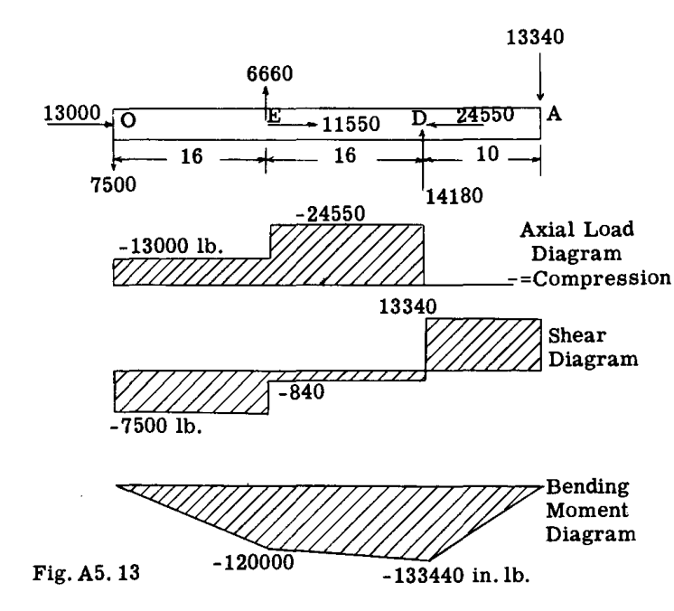

### 例題 4

Fig. A5.14 は、横荷重と縦荷重の両方を受ける梁を示している。この梁の荷重は、あらゆる種類の固定機器を支持する航空機胴体内の内部梁の典型的なものである。梁の反力は点 A および B にある。求めよ：せん断力図および曲げモーメント図。

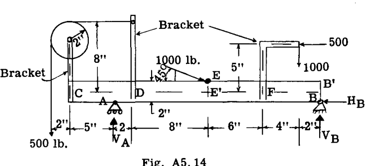

#### 解法:
A および B における反力の計算：  
 $V_B$  を求めるために、点 A の周りのモーメントをとる。  
 $\Sigma M_A = - 500 \times 7 - 500 \times 6 + 1000 \times 20 + 1000 \times \sin 45^\circ \times 10 + 1000 \cos 45^\circ \times 2 - 22 V_B = 0$   
したがって  $V_B = 999.3 \text{ lb}$  （上向き）。

 $V_A$  を求めるために  $\Sigma V = 0$  をとる。  
 $\Sigma V = 999.3 - 1000 - 1000 \sin 45^\circ - 500 + V_A = 0$   
したがって  $V_A = 1207.8 \text{ lb}$  （上向き）。

 $H_B$  を求めるために  $\Sigma H = 0$  をとる。  
 $\Sigma H = - 500 + 1000 \cos 45^\circ - H_B = 0$ 、したがって  $H_B = 207.1$ 。

 $45^\circ$  における  $1000 \text{ lb}$  荷重を除いて、すべての荷重はブラケットに加えられており、それらが次に梁に固定されている。したがって、次のステップは、梁の中心線支持点における載荷されたブラケットの反力を見つけることである。E における荷重と B における反力  $H_B$  も梁の中心線に参照される。

Fig. A5.15 (a, b, c, d) は、片持ちブラケットを自由体として示している。これらの片持ち梁の基部における反力が決定される。これらの反力を反転させたものが、点 C、D、F、E において梁に加えられる荷重となる。

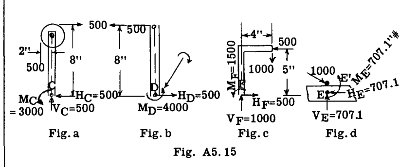

C のブラケットについては、 $H_C$  を求めるために  $\Sigma H = 0$  をとると、明らかに  $H_C = 500 \text{ lb}$  である。同様に  $\Sigma V = 0$  を使用して  $V_C = 500 \text{ lb}$  を求める。 $M_C$  を求めるために、点 C の周りのモーメントをとる。 $\Sigma M_C = - 500 \times 2 + 500 \times 8 - M_C = 0$ 、したがって  $M_C = 3000 \text{ in.lb.}$  である。学生は D および F におけるブラケットの基部での反力をチェックすべきである (Fig. b, c 参照)。

 $45^\circ$  で 1000 の荷重が加えられ、点 E'' に作用しているものは、梁の中心線である点 E に参照される。Fig. d は、E' における荷重による E における反力を示している。B における反力も梁の中心線に参照されるべきである。Fig. A5.16 は、点 C、D、E'、F、および B' において適用された荷重を伴う梁を示している。Fig. A5.17、18、および 19 は、Fig. A5.16 の梁荷重の下での軸荷重、垂直せん断、および曲げモーメント図を示している。

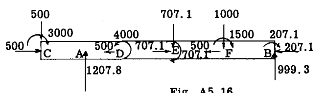

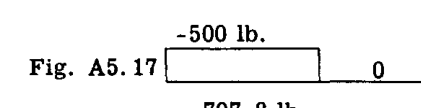

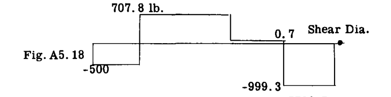

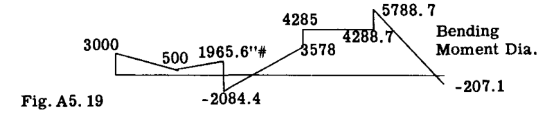

せん断力図は、前述と同様の方法で決定される。適用された外的な偶力は、垂直せん断力の計算には入らない。曲げモーメント図は、特定の断面の片側に位置するすべての偶力とすべての力のモーメントの代数和をとることによって計算できる。もしせん断力図の面積を使用して曲げモーメントを求めたい場合は、真の曲げモーメントを得るために、偶力モーメントをせん断面積に加える必要がある。例えば、点 E のすぐ左側の曲げモーメントは、C と E の間のせん断力図の面積の大きさに、C と E の間に加えられたすべての偶力モーメントの和を加えたものに等しいが、E におけるものは含まない。

計算を説明すると：  
 $(- 500 \times 5) + (707.8 \times 10) = 4578 \text{ in.lb.}$  （せん断力図の面積から）。  
 $(3000 - 4000) = - 1000 \text{ in.lb.}$  （偶力モーメントの和から）。  
したがって  $E_{\text{left}}$  における曲げモーメント  $= 4578 - 1000 = 3578 \text{ in.lb.}$ 。

 $E_{\text{right}}$  における曲げモーメントは、 $E_{\text{left}}$  におけるものに E における偶力モーメントを加えたもの、すなわち  $3578 + 707 = 4285 \text{ in.lb.}$  に等しくなる。

学生は、梁に偶力モーメントが加えられたとき、垂直せん断力がゼロを通過することなく、最大ピークモーメントを持つことが可能であることを認識すべきである。この事実を説明するために、Fig. A5.20 の梁、すなわち、梁の中央点 C において  $10 \text{ in.lb.}$  の大きさの外的に加えられた偶力モーメントを持つ単純支持梁を考える。せん断力図および曲げモーメント図は示されている通りであり、最大曲げモーメントは C で発生するが、せん断力図はゼロを通過しない。

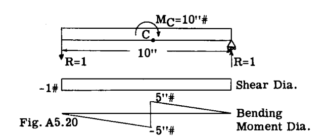

偶力とは、同一直線上にない2つの等しく反対向きの力である。 $10 \text{ in.lb.}$  の偶力が、各  $100 \text{ lb}$  の力と、Fig. A5.21 に示すようにそれらの間の  $0.1$  インチの腕で構成されていると仮定しよう。

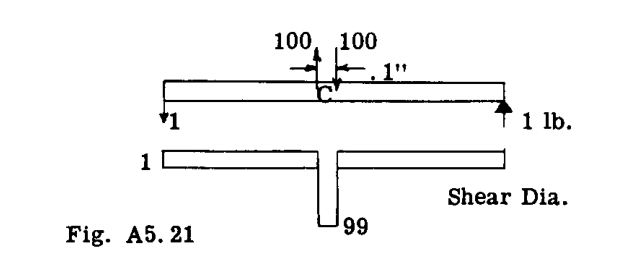

せん断力図は Fig. A5.21 に示す通りであり、現在はそれぞれの偶力の力の下でゼロを通過している。したがって、偶力モーメントが  $dx$  の腕を持っていると仮定すれば、C の右側のせん断力は 1 lb であり、その後、ある未知の負の値に変化し、その後、距離  $dx$  が左に向かってカバーされるにつれて 1 lb 正に戻る。このように、せん断力は点 C の領域で2回ゼロを通過する。

## A5.7 部分的なモーメント図

静定梁のたわみを計算したり（第A7章参照）、不静定構造物を解いたりする際（第A8章参照）、曲げモーメント曲線の下の面積が必要となるため、各荷重と反力を個別の作用力として扱い、各力についてモーメント図を描くことがしばしば便利である。特定の点における真の曲げモーメントは、すべてのさまざまなモーメント曲線のその特定の点における縦座標の代数和に等しくなり、あるいは個別のモーメント図を合算することで真の曲げモーメント図が得られる。Fig. A5.22 および A5.23 は、モーメント図を部分的に描くことを説明している。これらの例では、左端から開始して右端に向かって進み、梁があたかも右端で固定された片持ち梁であるかのように各力のモーメント曲線を順次描いている。最終的な曲げモーメント曲線は、これらの個別の図の和に等しく、図に示されている通りである。

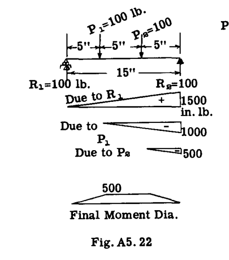

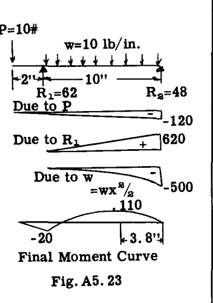

### 不静定構造物を解く際の静的モーメント曲線

不静定構造物を解く際の通常の数学的手順は、まず必要な冗長な、または未知の反力を取り除いて構造物を静定化し、次にこの想定された静定構造物のたわみを計算することである。そのような構造物の解法においても、モーメント図を部分的に構成されたものとして扱うことが同様に便利である。説明のために、Fig. A5.24 は点 A および B で固定された荷重のかかった矩形フレームを示している。A と B の両方の反力は、大きさ、方向、位置において未知であり、あるいは各反力は 3 つの未知の要素、合計 6 つの未知数を持っている。3 つの静止平衡方程式が利用可能であるため、構造物は 3 次の不静定である。Fig. A5.25 は、端 A を解放して点 B で固定された曲がった片持ち梁にすることで、構造物を静定化できる一例を示している。Fig. A5.25 は、この片持ちフレームに個別に作用する各荷重についての曲げモーメント曲線を示している。Fig. A5.26 は、Fig. A5.25 のさまざまなモーメント曲線の総和としての真の曲げモーメントを示している。

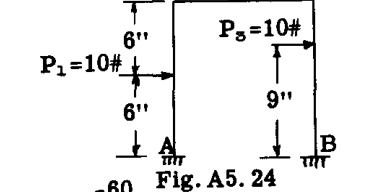

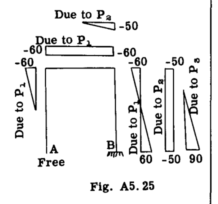

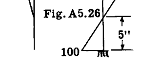

別の解法として、Fig. A5.27 に示すように、A でピン結合され、B でローラー結合されたフレームとして、この固定端フレームを静定化した修正を想定することもできる。この想定された構造物は、A における反力の大きさおよび方向（H 成分および V 成分の 2 つの大きさ）と B における反力の大きさの 3 つの未知要素しかないため、静定である。反力  $V_A$ 、 $H_A$ 、および  $V_B$  は静力学によって求めることができ、その結果は Fig. A5.27 に示されている。Fig. A5.28 は、A から開始して B に向かって時計回りに進んだ、各荷重または反力によるこのフレーム上の曲げモーメント図を個別に示している。Fig. A5.29 は、個別の図の総和としての真の曲げモーメント図を示している。

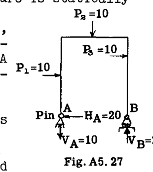

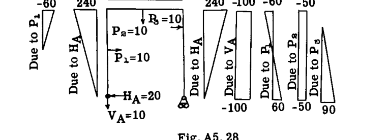

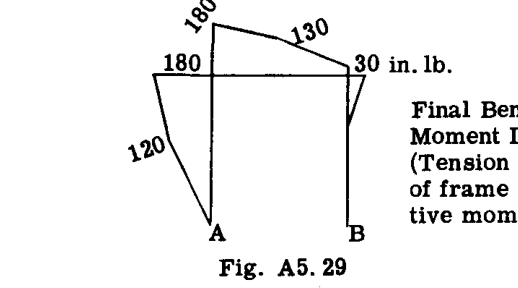

## A5.8 前のステーションの力による断面における力

### 直線梁

航空機の構造には、変化する分布荷重を受ける梁が多く存在する。最小の構造重量は航空機の構造設計において極めて重要であり、したがって、梁の各部分が効率的に比例配分できるように、構造のための完全な曲げモーメント図を持つことが望ましい。せん断力図およびモーメント図を計算する際、通常、あるステーションにおけるせん断力とモーメントを、前のステーションのせん断力とモーメント、およびこれら2つのステーション間に位置する荷重の効果として表すと、時間を節約できる。説明のために、Fig. A5.30 は、異なる大きさの多数の横荷重 F を受ける片持ち梁を示している。Fig. A5.31 は、ステーション 1 と 2 の間の梁部分の自由体を示している。ステーション 1 における垂直せん断力  $V_1$  はステーション 1 の左側の力の和に等しく、ステーション 1 における曲げモーメント  $M_1$  はステーション 1 の左側にあるすべての力のステーション 1 の周りのモーメントの代数和に等しい。

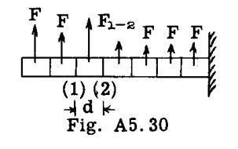

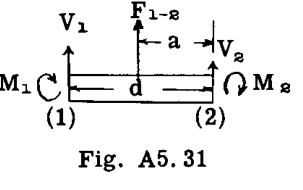

さて、ステーション 2 を考えると：垂直せん断力  $V_2 = V_1 + F_{1-2}$  であり、言葉で言えば、せん断力  $V_2$  は前のステーション 1 におけるせん断力に、ステーション 1 と 2 の間に位置するすべての力 F の代数和を加えたものに等しい。再び Fig. A5.31 を考えると、ステーション 2 における曲げモーメント  $M_2$  は、 $M_2 = M_1 + V_1 d + F_{1-2} a$  と書くことができ、あるいは言葉で言えば、ステーション 2 における曲げモーメント  $M_2$  は、前のステーション 1 における曲げモーメント  $M_1$  に、前のステーション 1 におけるせん断力  $V_1$  に腕  $d$ （ステーション 1 と 2 の間の距離）を乗じたものを加え、さらにステーション 1 と 2 の間に位置するすべての力 F のステーション 2 の周りのモーメントを加えたものに等しい。

## A5.9 曲線梁の方程式

多くの構造梁は縦荷重と横荷重の両方を受けており、また梁は直線要素を組み合わせてフレームを形成したり、あるいはすべての梁要素が曲線を描いて曲線フレームやリングを形成したりすることもある。例えば、航空機の胴体リングは、フレーム上の外板の力の作用により、その境界に沿って変化する大きさおよび方向の力を受ける曲線梁である。完全な曲げモーメント図は通常望ましいため、完全なせん断力および曲げモーメントの値を得る際の実務的な計算量を最小限に抑えることが望ましい。Fig. A5.32 は、多数の異なる垂直荷重 F および水平荷重 Q を受けた曲線梁を示している。Fig. A5.33 は、自由体として切り出された梁の部分 1-2 を示している。 $H_1$  はステーション 1 における合水平力を表し、ステーション 1 の左側にあるすべての Q 力の代数和に等しい。 $V_1$  はステーション 1 における合垂直力を表し、ステーション 1 の左側にあるすべての F 力の和に等しく、 $M_1$  は、ステーション 1 の左側に位置するすべての力のモーメントによる、ステーション 1 上の点 (1) の周りの曲げモーメントに等しい。

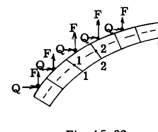

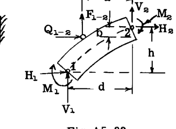

すると、Fig. A5.33 から、ステーション 2 における点 (2) での合力およびモーメントについて次のように書くことができる。

$$
V_2 = V_1 + F_{1-2}
$$
$$
H_2 = H_1 + Q_{1-2}
$$
$$
M_2 = M_1 + V_1 d - H_1 h + F_{1-2} a - Q_{1-2} b
$$

与えられた点、与えられたステーションにおける合力およびモーメントが得られたら、梁の応力を求める際には通常、力を梁の断面に垂直および平行な成分に分解し、またそれらの位置を梁断面の中立軸上の点に転送する必要がある。

例えば、Fig. A5.34 は梁断面の点 1 における合力およびモーメントを示している。それらは、Fig. A5.35 に示されるように、垂直力 N とせん断力 S、およびモーメント  $M_1$  に分解できる。ここで、

$$
N = H \cos \alpha + V \sin \alpha
$$
$$
S = V \cos \alpha - H \sin \alpha
$$

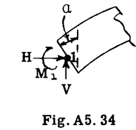

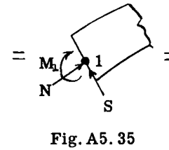

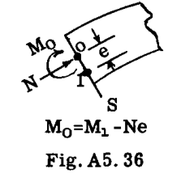

後に梁断面が設計される際、中立軸が点 1 ではなく点 O にあることが判明する場合がある。Fig. A5.36 は、点 O に参照された力とモーメントを示しており、 $M_o$  は  $M_1 - Ne$  に等しい。"}