# A5.10 ねじりモーメント (Torsional Moments)  

梁の曲げのみを引き起こす荷重は、その作用線が梁の撓み軸（flexural axis）を通過するように配置されている。非常に多くの場合、梁への荷重は梁の撓み軸を通過せず、その結果、梁は曲げとねじりの両方を受けることになる。ねじり作用を引き起こすモーメントは、通常、ねじりモーメント（torsional moments）と呼ばれる。航空機の翼は、曲げとねじりの複合作用を受ける梁構造の優れた例である。翼型（airfoil）の荷重の圧力中心（center of pressure）は迎え角によって変化し、また多くの飛行条件が存在するため、飛行および着陸のあらゆる条件下でねじりモーメントを排除することは不可能である。胴体については、垂直尾翼が通常は胴体の上方に配置されているため、この尾翼ユニットへの荷重は胴体に曲げとねじりの複合作用を引き起こす。  

Fig. A5.34は、チューブの端に取り付けられた金具上の点Aに荷重  $P$  が作用している片持ちチューブを示している。  

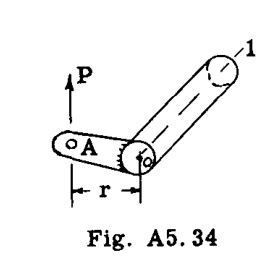
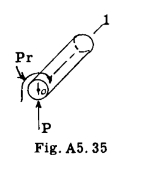  

撓み軸はチューブの中心線、すなわち軸1-1と一致している。Fig. A5.35は、荷重  $P$  がチューブ軸1-1上の点(0)に移動された様子を示している。しかし、元の力  $P$  は(0)に対して  $Pr$  に等しいモーメントを持っていたため、点(0)における力系が元の点Aにおける力  $P$  と等価であるためには、点(0)に作用する荷重  $P$  にモーメント  $Pr$  を加えなければならない。点(0)を通過して作用する力  $P$  はねじれを伴わない曲げを引き起こし、モーメント  $Pr$  はねじりのみを引き起こす。  

モーメントを様々な合力作用面に分解する方法については、静力学の教科書を参照されたい。  

# A5.11 翼の剪断力とモーメント (Shears and Moments on Wing)  

第A4章の第A4.5節および第A4.6節では、翼の空気荷重と、飛行中の航空機全体の平衡について論じている。説明されているように、翼型上の分布空気力を、翼型の空力中心（aerodynamic center）を通過して作用する2つの合力、すなわち揚力（lift）と抗力（drag）、および翼のモーメントに置き換えるのが一般的である。翼の周囲の気流はスパン方向（spanwise direction）に一様ではないため、翼型の力係数  $C_L$ 、 $C_D$ 、および  $C_M$  は翼のスパンに沿って変化する。Fig. A5.36は、一様なスパン方向の変化  $C_L$  および  $C_D$  に対する、 $C_L$  および  $C_D$  力係数の典型的なスパン方向の変化を示している。  

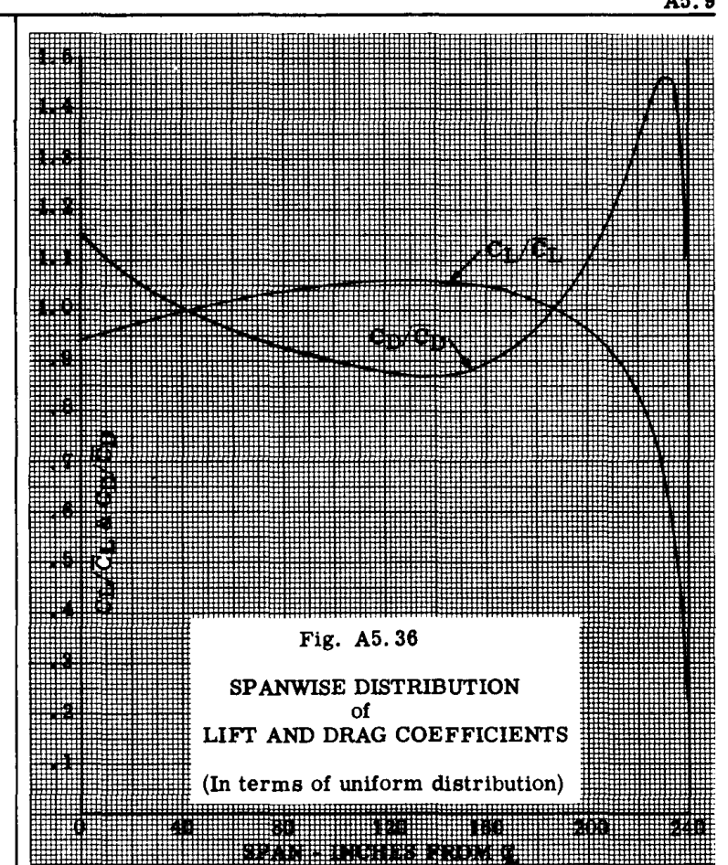  

特定の種類の航空機は特定の仕事や任務を遂行するように設計されており、その任務を遂行するためには、特定の最大加速度まで機動を制限した特定の最大航空機速度が必要となる。これらの制限加速度は通常、航空機の  $X$   $Y$   $Z$  軸を基準として規定される。揚力と抗力の方向は迎え角によって変化するため、応力解析においては、航空機に対して方向が固定されている  $X$   $Y$   $Z$  軸を基準としてすべての力を分解するのが単純で便利である。  

翼の応力解析の時間短縮要素として、翼の剪断力とモーメントについて単位荷重解析（unit load analysis）を行うのが一般的である。設計条件に応じた翼の剪断力とモーメントは、単純な比例計算と加算の問題となる。例えば、以下のように仮定するのが一般的である：  

(1) 翼型の空力中心を通り、 $Z$  方向に翼に作用する任意の合計単位荷重を想定し、そのスパン方向の分布は  $C_L$  または揚力係数の分布に従うとする。  

(2) (1)と同様の合計荷重であるが、 $X$  方向に作用するものとする。  

(3) 翼型の空力中心を通り、 $Z$  方向に作用する合計単位翼荷重を想定し、そのスパン方向の分布は  $C_D$  または抗力係数の分布に従うとする。  

(4) (3)と同様であるが、 $X$  方向に作用するものとする。  

(5) 単位合計翼モーメントを想定し、そのスパン方向の分布は  $C_{m_{a.c.}}$  またはモーメント係数の分布に従うとする。  

上記の単位荷重条件は、航空機を剛体とした場合の並進運動における加速度条件に対するものである。飛行中や着陸時の機動で発生し得る航空機の角加速度（angular accelerations）についても、単位荷重解析が行われる。  

航空機にかかる荷重の計算という主題は、構造の教科書で網羅するにはあまりに広大である。この主題は通常、空気力学と構造学の基礎課程を修了した後の、ほとんどの航空工学カリキュラムの別個のコースで扱われる。航空機に作用する荷重の計算において遭遇する問題のタイプを説明するために、翼と胴体に関する簡略化された問題を以下に示す。  

# A5.12 単位荷重条件における翼の剪断力とモーメントの計算例題 (Example Problem of Calculating Wing Shears and Moments for One Unit Load Condition)  

Fig. A5.37は片持ち翼の半翼平面形状を示している。Fig. A5.38は、ステーション0における翼断面を示している。基準  $Y$  軸は40パーセント翼弦線（chord line）に取られており、この特定の翼のレイアウトでは、これはたまたま直線になっている。  

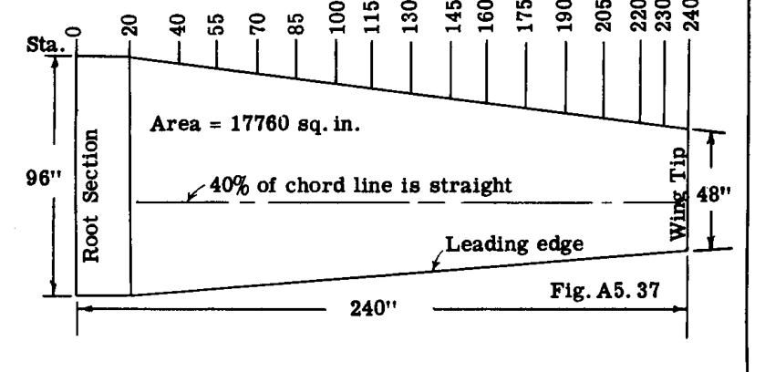
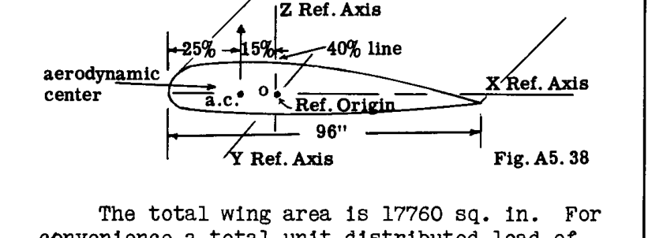  

全翼面積は  $17760\text{ sq. in.}$  である。便宜上、合計  $17760\text{ lbs.}$  の単位分布荷重が半翼に作用し、 $Z$  方向に上向きに、かつ翼型の空力中心を通って作用すると仮定する。この荷重のスパン方向の分布は、スパン方向の揚力係数（ $C_L$ ）分布に従うものとする。この例題では、簡単にするために一定であると仮定する。  

Table A5.1は、翼端のステーション240から中心線のステーション0までの複数のステーションについて、 $Z$  方向の翼剪断力（ $V_z$ ）、 $X$  軸まわりの曲げモーメント  $M_x$ 、および  $Y$  軸まわりのモーメント  $M_y$  を決定するための計算を表形式で示している。  

表の第1列は、選択されたステーションの番号を示している。第3列は、スパン方向の揚力係数分布の比率  $\frac{C_L}{\bar{C}_L}$ （一様な分布  $\bar{C}_L$  に対する  $C_L$ ）を示している。この例では、この翼に対する揚力係数のスパン方向分布に関する風洞試験や空力計算が行われていないため、この比率を1（Unity）としている。実際の航空機を含む問題では、Fig. A5.36に示されているような曲線が利用可能であり、Table A5.1の第3列に入れる値は、そのような曲線から読み取られることになる。第2列は各ステーションにおける翼弦長を示している。第4列は、各ステーションにおけるスパン1インチあたりの翼の走行荷重（running load）を示している。合計17760ポンドの単位荷重が半翼に作用し、翼面積が  $17760\text{ sq. in.}$  であると仮定したため、任意のステーションにおけるスパン1インチあたりの走行荷重は、そのステーションにおける翼弦長に等しくなる。  

様々なステーションにおける剪断力とモーメントを求めるために、分布荷重は各区間（strip）の分布荷重に等しい集中荷重に分割され、この集中荷重はその区間の重心を通過して作用するものとされる。第5、6、7列は、区間荷重（ $\Delta P_z$ ）を決定するための計算を示している。第8列は、第4列に端部が示されている台形分布荷重の図心（centroid）にある  $\Delta P_z$  荷重の位置を示している。これらの図心位置を決定するには、第A3章のTable A3.4を使用すると便利である。  

各ステーションにおける剪断力  $V_z$  とモーメント  $M_x$  の値は、第A5.8節で説明した方法によって計算される。Table A5.1の第9、10、11、12列にその計算が示されている。例えば、ステーション220に対する第12列の  $M_x = 9884$  という値は、第12列の前のステーション（230）における  $M_x$  モーメント（2436）に、前のステーション（230）における剪断力（第10列の4908）に距離10インチを乗じた値を足し、さらにステーション230と220の間の区間荷重によるモーメント（第9列の2540）を加えたものであり、合計で9884となる。  

区間荷重  $\Delta P_z$  は、各翼区間の空力中心（a.c.）を通過して作用する。第13列と第14列は、 $x$  アーム、すなわち空力中心から基準  $Y$  軸までの距離を示している（Fig. A5.38参照）。第15列は各区間荷重の  $M_y$  モーメントを、第16列は各ステーションにおける  $M_y$  モーメントを示しており、これはステーション240から0へ進むにつれての区間モーメントの合計に等しい。  

Fig. A5.39は、Table A5.1から取得したステーション(0)における結果を示している。  

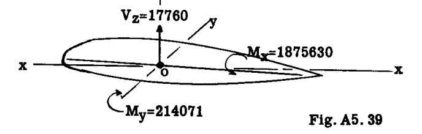  

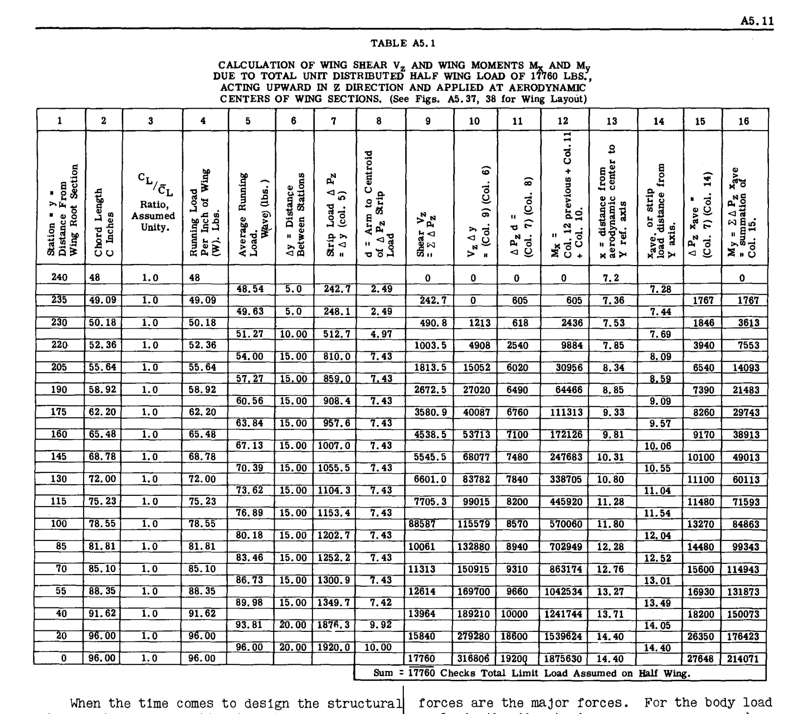  

これらの適用された剪断力とモーメントに耐えるための断面の構造構成を設計する段階になると、構造設計者は、例えば特定の断面の剪断中心（shear center）を通過するような別の  $Y$  軸に力を変換したいと考えるかもしれない。別の座標系への力系の変換は、特に困難ではない。  

# 機体上の剪断力とモーメント (SHEARS AND MOMENTS ON AIRPLANE BODY)  

## A5.13 はじめに (Introduction)  

航空機の機体は、基本的には梁として機能し、飛行条件や着陸条件によっては、ねじりやねじりモーメントを受ける可能性のある梁柱（beam column）としても機能する。したがって、航空機の機体を設計するには、飛行中や着陸時に遭遇する可能性のある剪断力、曲げ、ねじり、および軸方向の力の全体像が必要である。翼の荷重解析では、直接的な空気力が主要な力となる。機体の荷重解析では、直接的な空気圧は二次的なものであり、主要な荷重は、動力装置、翼、着陸装置、尾翼など、機体に取り付けられたユニットからの荷重や反力の形で、集中した性質を持つ。さらに、機体は通常、荷重を支える媒体として機能するため、内部機器、設備、積載物などの重量の慣性力に抵抗する際、機体には重要な力が発生する。  

翼の場合と同様に、機体の荷重解析の大部分は、機体の構造解析をあまり考慮せずに行うことができる。航空機の機体の荷重解析には膨大な計算が含まれるため、本章での扱いは簡略化されたものであり、主に航空機の機体の荷重解析の問題に一般的にどのようにアプローチするかを学生に示すことを目的としている。  

## A5.14 設計条件と設計重量 (Design Conditions and Design Weights)  

航空機の機体は、操縦条件と突風（gust）条件の両方について、指定された飛行条件からのすべての荷重に耐えられるように設計されなければならない。突風による加速度は航空機の重量に反比例して変化するため、飛行条件に対しては軽荷重（light load）条件で機体を解析またはチェックするのが一般的である。一般的に、設計重量は政府機関によって指定される。しかし、着陸条件については、軽荷重条件よりも過酷になるため、通常の総重量（normal gross weight）が使用される。  

機体の設計において通常調査される一般的な設計条件は以下の通りである。  

### 飛行条件 (Flight Conditions):  
- H.A.A. (高迎え角：High angle of attack)  
- L.A.A. (低迎え角：Low angle of attack)  
- I.L.A.A. (背面低迎え角：Inverted low angle of attack)  
- I.H.A.A. (背面高迎え角：Inverted high angle of attack)  

上記の条件は、一般に並進加速度のみを想定している。さらに、航空機の重心まわりの特定の角加速度による力も考慮しなければならないと規定される場合がある。機体は通常、突風やエンジンの力などによって生じる対称および非対称の特別な尾翼荷重に耐えることが要求される。また、翼にかかる非対称な空気荷重による力もチェックする必要がある。  

### 着陸条件 (Landing Conditions):  
一般に、機体は以下の着陸条件について調査される。各条件の詳細な要件は、軍用機および民間機の両方について政府の仕様書に記載されている。  

- **陸上機**:  
  - 水平着陸 (Level landing)  
  - 横荷重を伴う水平着陸 (Level landing with side load)  
  - 三点着陸 (Three point landing)  
  - 地上反転を伴う三点着陸 (Three point landing with ground loop)  
  - 前転または横転条件 (Nose over or turn over condition)  
  - アレスティング (Arresting：通常、海軍の空母艦載機のみ)  

- **水上機またはボート**:  
  - 角加速度を伴う、または伴わないステップ着陸 (Step landing with and without angular acceleration)  
  - 船首着陸 (Bow landing)  
  - 船尾着陸 (Stern landing)  
  - 二波着陸 (Two wave landing)  
  - ビーチング条件 (Beaching conditions)  
  - カタパルト射出条件 (海軍機)  

- **特別な条件または力**:  
  - 航空機の曳航 (Towing of airplane)  
  - 機体の与圧 (Body supercharging)  

## A5.15 機体重量と重心分布 (Body Weight and Balance Distribution)  

機体自重とその内容物による抵抗慣性力は、航空機の機体の荷重解析において重要な役割を果たす。初期の空力設計および全体的なレイアウトと配置が決定されたら、航空機の完全な重量と重心の推定を行う必要がある。この推定は、通常、航空機の各ユニットの重量と分布の推定に経験のある技術部門の重量管理セクションのエンジニアによって行われる。報告書の形式で提出されるこの推定値は、すべての主要な航空機ユニットや設備の重量と重心（c.g.）の位置、およびこれらの主要な航空機アッセンブリや設備を構成する多くのマイナーユニットの重量と位置を示す。この重量・重心報告書は、機体の荷重解析の重要な部分を形成する自重慣性荷重解析の基礎となる。この重量・重心推定値の使用方法は、後の例題で説明する。  

## A5.16 荷重解析。単位解析。 (Load Analysis. Unit Analysis.)  

第A5.14節に挙げたような多くの設計条件があるため、機体の荷重解析における一般的な手順は、一連の単位解析（unit analyses）に基づかせることである。特定の設計条件に対する荷重は、単位解析の結果に適切な倍率を掛け合わせて組み合わせることで得られる。以下に、この単位解析の手法を説明する簡略化された例題を示す。  

## A5.17 単位荷重条件における胴体の剪断力とモーメントの計算を説明する例題 (Example Problem Illustrating the Calculation of Shears and Moments on Fuselage Due to Unit Load Conditions)  

Fig. A5.40およびA5.41は、この例題で使用する航空機の機体のレイアウトを示している。これは実際の航空機の機体であり、前の例題で使用した翼はこの航空機のものである。  

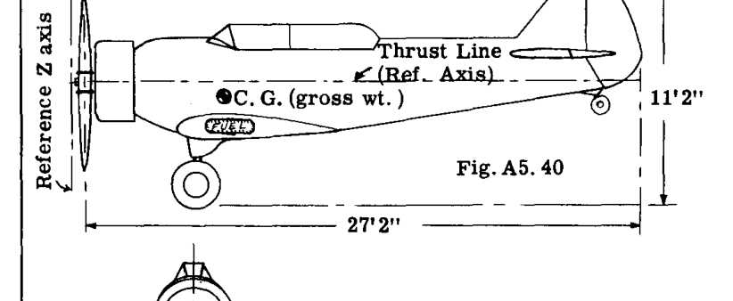
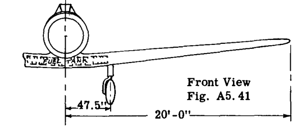  

Table A5.2は、航空機全体の重量と重心の推定値を示している。この表は通常、技術部門の重量管理セクションによって作成され、機体の荷重解析を行う前にこの情報を入手しておく必要がある。  

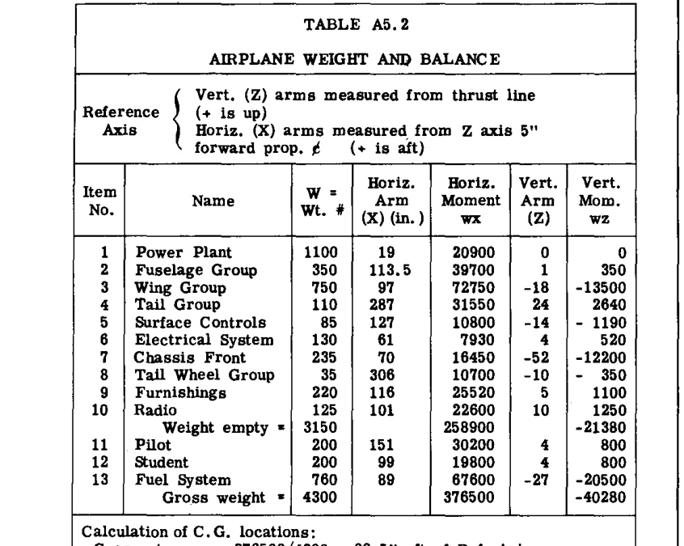  

Table A5.3は、翼および前脚や燃料のように翼に取り付けられたアイテムを除き、胴体に取り付けられた、または胴体内に運ばれるすべてのアイテムの重量と重心の計算を示している。  

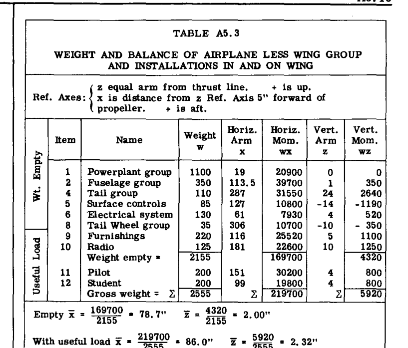  

自重慣性荷重による胴体の真の剪断力とモーメントに近似させるためには、Table A5.3に示されている各アイテムの重量を分配する必要がある。Fig. A5.42は、航空機の側面図を示しており、Table A5.3の重量アイテムの重心位置が(+)記号で示されている。様々な設計条件において慣性力の方向は変化するため、慣性力を  $X$  および  $Z$  成分に分解するのが便利であり、また一般的である。したがって、Fig. A5.43では、Table A5.3に示されている重量が、それらの重心（c.g.）位置を通って  $Z$  方向に作用すると仮定されている。示されているような荷重は、胴体に沿った剪断力とモーメントの真の姿を示さないため、これらの荷重は、実際の重量分布を模擬するような方法で分配されるべきである。ほとんどの重量・重心報告書では、重量アイテムはTable A5.3に示されているよりもかなり詳細に分割されており、それによって重量分布がより明確になる。重量分布を行う者は、航空機の内部側面図を調べ、すべての設備や機器の一般的な配置を把握すべきである。さらに、機体の重量分布に影響を及ぼす可能性のある全体的な構造配置についても検討すべきである。プロセス全体には、重量分布の良好な近似を得るためのかなりの常識が必要である。幸いなことに、動力装置や尾翼などの大きな自重荷重は明確に位置が特定されているため、小さな分布重量の分配における些細な誤差が、全体の剪断力やモーメントを大きく変えることはない。  

妥当な精度を得るために、胴体または機体は一連のステーション（駅）またはセクション（断面）に分割される。Fig. A5.42において、選択されたセクションは  $Z$  基準軸からの距離を表すステーションとして設計されている。一般的な問題は、Fig. A5.43に示されている集中荷重を、様々な胴体ステーションに作用する等価なシステムに分配することである。  

明らかに、Table A5.3の重量アイテムがパイロット、学生、無線機などの集中荷重を表している場合、その重量は、そのアイテムの重心（c.g.）から隣接するステーションまでの距離に反比例して、隣接するステーションに分配することができる。しかし、胴体構造（Table A5.3のアイテム2）のように、その重心位置がFig. A5.43のステーション80と120の間に位置するような重量アイテムの場合、この350ポンドの重量は胴体全体のものであるため、隣接する2つのステーションのみにこの重量を分配するのは明らかに誤りである。したがって、この350ポンドの重量アイテムはすべてのステーションに分配されるべきである。この分配における制約条件は、基準軸まわりの分配されたシステムのモーメントが、同じ軸まわりの元の重量のモーメントと等しくなければならないということである。Fig. A5.44は、350ポンドの自重が、重量が  $Z$  方向に作用すると考慮して、様々なステーションにどのように分配されたかを示している。  

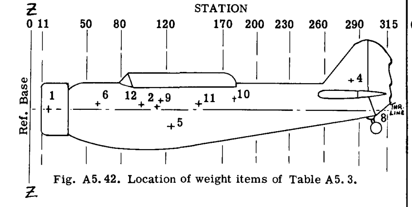
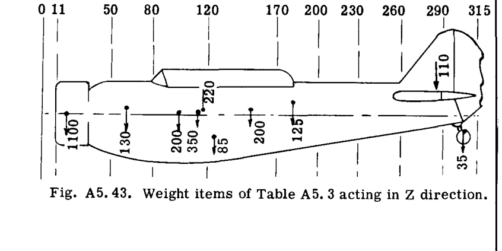
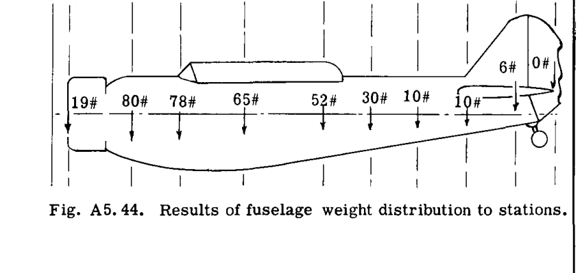
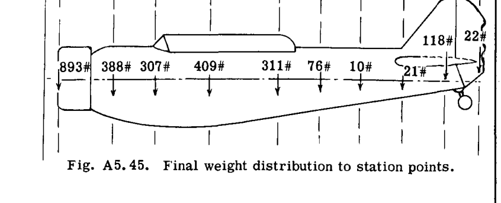
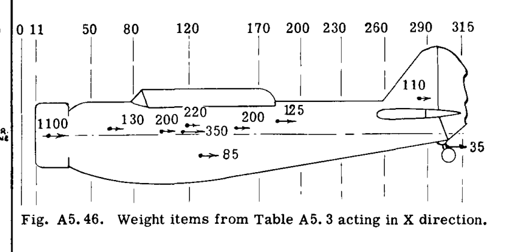
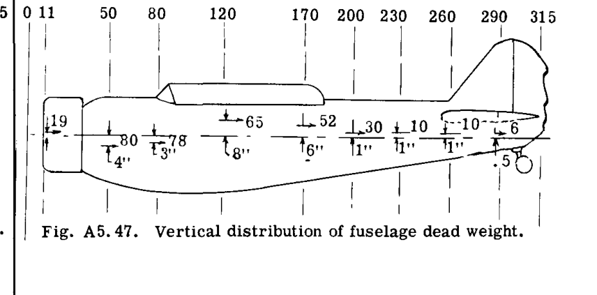
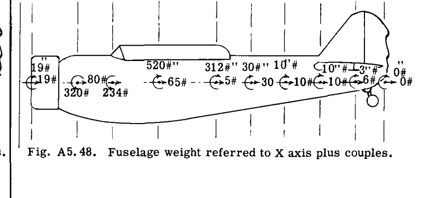
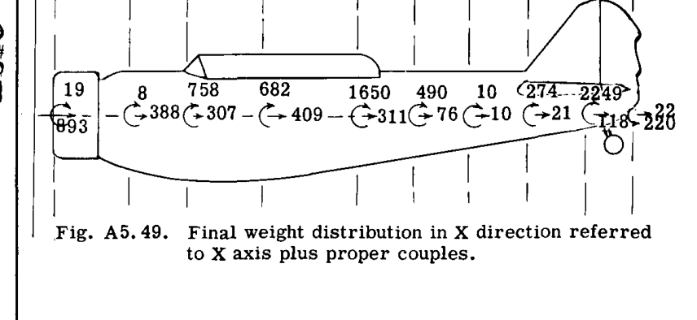  

Table A5.4は、Table A5.3の重量アイテムに対するこのステーション位置への重量分配の結果を示している。各重量アイテムの横にある水平行の値は、様々な胴体ステーションへの分配を示している。Tableの下から3番目の水平行に示されている各ステーションにおける重量の合計が、最終的なステーション重量を与える。これらの重量は、荷重が  $Z$  方向に作用する場合としてFig. A5.45に示されている。 $Z$  軸まわりの各合計ステーション荷重のモーメントは、Table A5.4の下から2番目の水平行に示されている。この行のモーメントの合計は、Table A5.3の合計  $wx$  モーメント、すなわち 219700"# と等しくなければならない。このチェックはTable A5.4の最後の垂直列に示されている。  

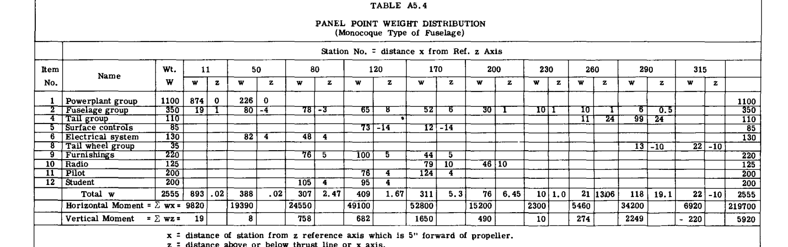  

分配されたシステムは、 $Z$  方向または垂直方向にも、Fig. A5.46に示されている元の重量システムと同じ合力重心（c.g.）位置を持つように分配されなければならない。Fig. A5.47は、Fig. A5.44に示されている胴体重量分布システムが、垂直方向の様々なステーションにどのように分配されるかを示しており、このシステムの  $X$  軸まわりのモーメントが、元の胴体重量350ポンドのモーメントと等しくなるようにされている。便宜上、これらの分配された胴体重量は、 $X$  軸に加えてFig. A5.48に示されているモーメントに変換することができる。  

Table A5.4は、様々なステーションにおける各アイテムの垂直方向の分布を示している。一番下の水平行は、各ステーションにおける荷重の  $X$  軸まわりのモーメントを示しており、これは個々の荷重にそれらの  $Z$  距離を掛けたものに等しい。この水平行の値の合計は、Table A5.3の合計  $wz$  モーメントと等しくなければならない。このチェックは最後の垂直列の下部に示されている。Fig. A5.49は、 $X$  方向の重量分布についてTable A5.4に示されている結果を示している。  

## A5.18 胴体の剪断力とモーメントの単位解析 (Unit Analysis for Fuselage Shears and Moments.)  

多くの飛行条件や着陸条件が存在するため、胴体の剪断力、軸方向の力、および曲げモーメントについて単位解析を行っておくと、大幅な時間を節約できる。設計値は、一般に、単位解析における値の合計に適切な倍率を掛けたものとして得られる。  

胴体にかかる荷重は、一般に、尾翼荷重、エンジン荷重、翼の反力、胴体に取り付けられている場合は着陸装置の反力、および航空機の加速度（並進および角加速度の両方）による慣性力で構成される。簡単のために、これらの荷重は  $Z$  軸および  $X$  軸に平行な成分に分解することができる。  

単位解析の手順を説明するために、我々の例題について以下の単位条件の単位解析を行う。  

(1)  $Z$  方向に作用し、上向きの単位加速度または荷重係数。  
(2)  $X$  方向に作用し、前向きの単位加速度または荷重係数。  
(3)  $X$  軸に垂直に下向きに作用する単位尾翼荷重。  

通常、エンジンの推力やトルク、尾翼への横荷重、角加速度についても単位解析が行われるが、例題の計算が長くなりすぎないように、上記の3つの単位条件のみを詳細に実施する。その他については後の節で詳しく説明する。  

###  $Z$  方向の単位荷重係数に対する解法 (Solution for Unit Load Factor in Z Direction.)  

Fig. A5.50は、Table A5.4またはFig. A5.45から取得した  $Z$  方向に作用する自重荷重を示している。翼はFig. A5.50に示されているようにステーション73および116で胴体に取り付けられている。これらの点における金具は、すべての抗力または  $X$  方向の反力が、ステーション73のフロント金具で完全に受け持たれるように設計されていると想定する。胴体を平衡状態にするために、翼の反力を計算する。  

 $\Sigma F_x = 0$ 、  $R_H + 0 = 0$ 、よって  $R_H = 0$   
 $\Sigma M_{station 0} = 219700 - 116 R_R - 73 R_F = 0$  --- (A)  
(注: 219700はTable A5.3より)  
 $\Sigma F_z = -2555 + R_F + R_R = 0$  --- (B)  

(A)と(B)の連立方程式を  $R_F$  と  $R_R$  について解くと：  
 $R_F = 1780\text{ lb.}$ 、 $R_R = 775\text{ lb.}$   

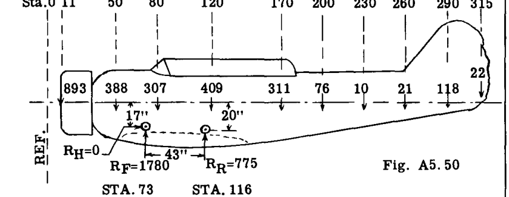  

Table A5.5は、様々なステーションにおける胴体の剪断力と曲げモーメントの計算を示している。  

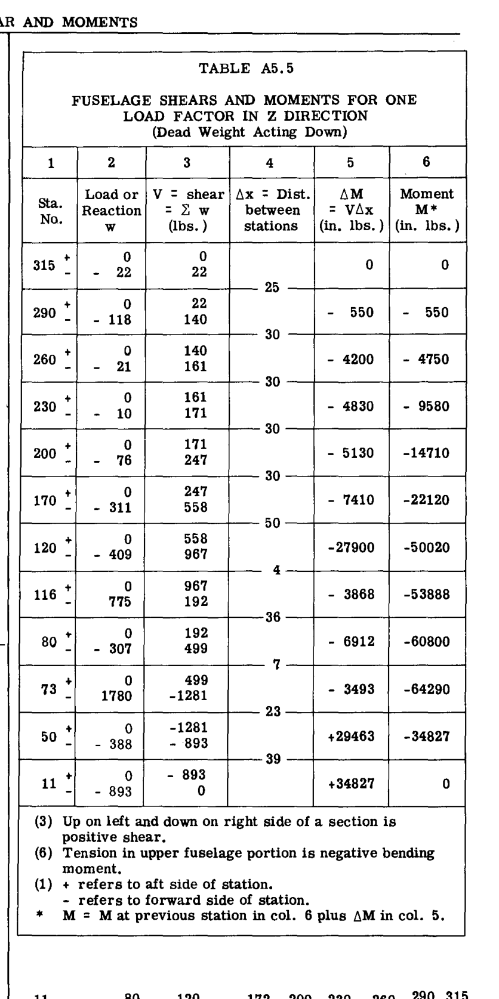  

###  $X$  方向の単位荷重係数に対する解法 (Solution for Unit Load Factor in X Direction.)  

Fig. A5.51は、Table A5.4またはFig. A5.40から取得した、後方に作用する荷重に対するパネルポイント自重分布を示している。胴体を平衡状態にするために、点(A)および(B)における翼の反力を計算する。  

 $\Sigma F_x = 2555 - R_H = 0$ 、よって  $R_H = 2555\text{ lb. (前向き)}$   

点(A)まわりのモーメントをとると：  
 $\Sigma M_A = 2555 \times 17 + 5920 - 43 R_R = 0$ 、よって  $R_R = 1147.8 \text{ (上向き)}$   
(5920はTable A5.4からの偶力の合計に等しい)  

 $\Sigma F_z = 1147.8 - R_F = 0$ 、よって  $R_F = 1147.8\text{ lb. (下向き)}$   

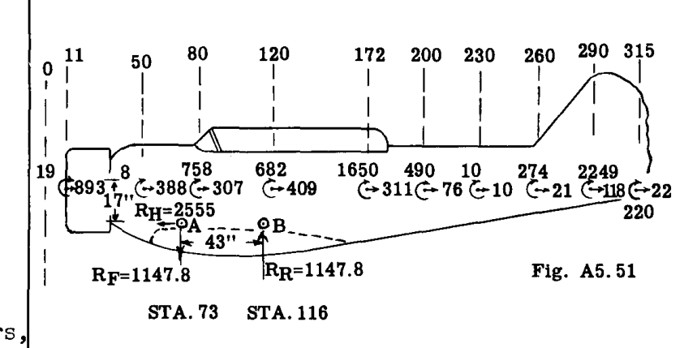  

Table A5.6は、Fig. A5.51の荷重に対する剪断力、モーメント、および軸方向荷重の計算を示している。  

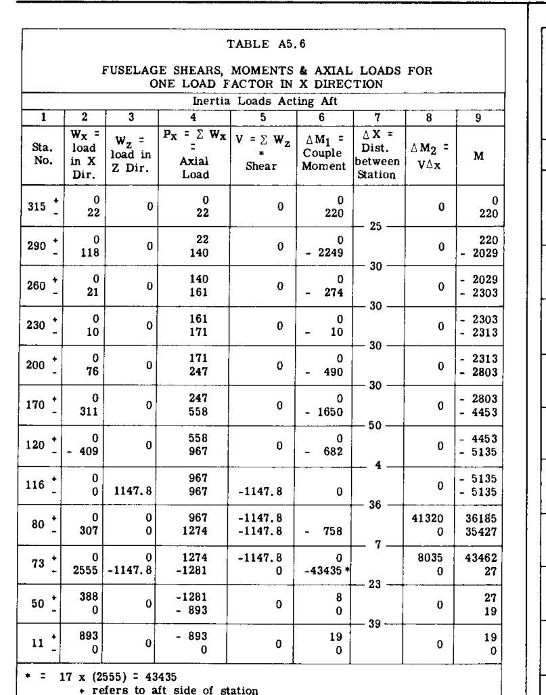  

### 下向きに作用する単位水平尾翼荷重に対する解法 (Solution for Unit Horizontal Tail Load Acting Down.)  

翼取付点での反力と釣り合う、  $Z$  方向に作用する尾翼上の 100 lb. の単位荷重について、胴体の剪断力とモーメントを計算する。水平尾翼上の圧力中心はステーション277.5にある。Fig. A5.52は胴体の荷重を示している。(A)および(B)における翼の反力を求める：  

 $\Sigma M_A = 100 \times (277.5 - 73) - 43 R_R = 0$ 、よって  $R_R = 475.6\# \text{ (上向き)}$   
 $\Sigma F_z = -100 + 475.6 - R_F = 0$ 、よって  $R_F = 375.6\# \text{ (下向き)}$   

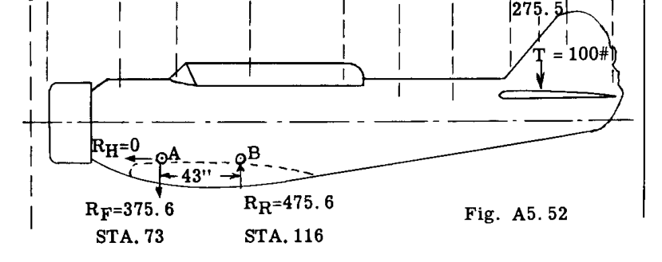  

Table A5.7は、様々なステーションにおける剪断力とモーメントの詳細な計算を示している。  

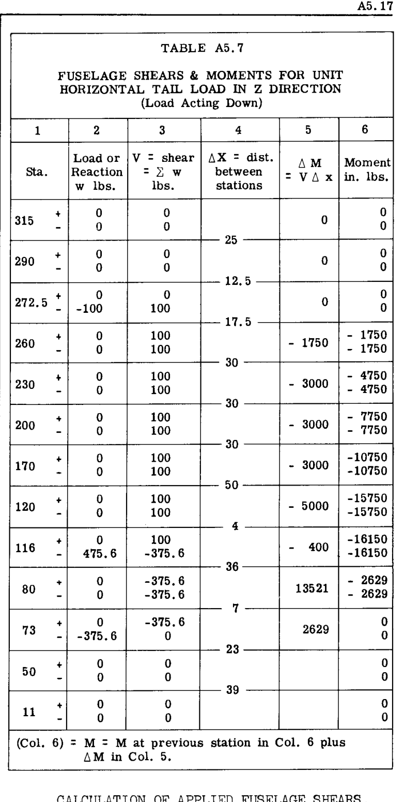  

# 特定の飛行条件に対する、胴体の剪断力、モーメントおよび軸荷重の計算 (CALCULATION OF APPLIED FUSELAGE SHEARS, MOMENTS AND AXIAL LOADS FOR A SPECIFIC FLIGHT CONDITION.)  

Table A5.5、A5.6、およびA5.7の結果を用いることで、特定の飛行条件における適用される剪断力とモーメントは、比例計算と加算の問題として得られる。説明のために、ある飛行条件に対する適用値を計算する。  

この航空機の(H.A.A.)高迎え角条件に対する空力計算の結果、以下の結果が得られたと仮定する（学生は、これらがどのように得られたかという知識なしにこれを受け入れる必要がある）。  

-  $Z$  方向の適用荷重係数  $= -6.0$  (下向き)  
-  $X$  方向の適用荷重係数  $= 1.333$  (後方)  
- 適用尾翼荷重  $= 110\text{ lb.}$  (上向き)  

したがって、 $Z$  および  $X$  方向の荷重係数と尾翼荷重が分かれば、Table A5.8を例示のように埋めることができる。同様の方法で他の飛行条件の値も求めることができる。唯一の違いは、適用される荷重が異なるため、新しい乗数（multiplying factors）のセットになることである。  

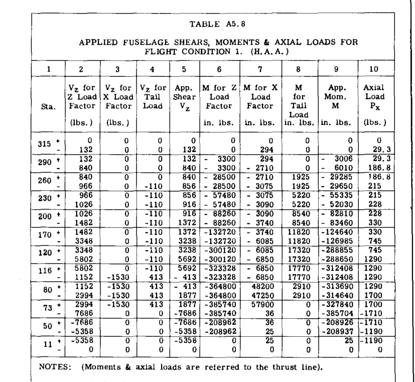  

## A5.19 着陸条件における胴体剪断力とモーメントの例題 (Example of Fuselage Shears and Moments for Landing Conditions.)  

Fig. A5.53は、水平着陸条件における航空機を示している。地面反力  $R$  は着陸装置の車輪の中心と航空機の重心（c.g.）を通過すると仮定される。垂直方向の究極荷重係数が7の場合、胴体の剪断力、モーメント、および軸荷重が必要となる（総重量  $= 4300\#$ ）。  

### 解法 (SOLUTION):  

地面反力  $R$  の垂直成分または  $Z$  成分は、 $7$  の荷重係数として指定されており、これは  $7 \times 4300 = 30100\#$  に等しい。この半分が各車輪に作用する。  

 $R$  の水平成分または  $X$  成分は  $30100 \times \tan 23^\circ = 425 \times 30100 = 12800\#$  であり、後方に作用する。航空機の水平荷重係数は  $12800 / 4300 = 2.98$  である。  

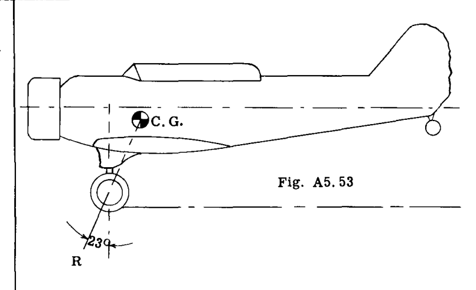  

これらの  $X$  および  $Z$  成分に対する抵抗は、航空機の  $X$  および  $Z$  方向の慣性力によって提供される。  

Table A5.5およびA5.6は、それぞれ  $Z$  および  $X$  方向の1つの荷重係数による慣性荷重に対する胴体の剪断力、モーメント、および軸荷重を示している。したがって、この特定の着陸条件に対する機体の力を得るためには、これら2つの表の値に適切な係数を掛けて結果を加算するだけでよい。  

したがって、垂直荷重係数 7 による胴体の力は、Table A5.5の第(3)列の値に 7 を掛けて剪断力を得、第 6 列に 7 を掛けて曲げモーメントを得ることに等しい。  

同様に、 $X$  方向の荷重係数 2.98 による力は、Table A5.6の第(4)、(5)、(9)列の値に (-2.98) を掛けて、軸荷重、剪断力、および曲げモーメントをそれぞれ得ることに等しい。  

最終的な真の力は、これらの結果の代数和となる。  

### 角加速度を伴う着陸 (Landing with Angular Acceleration)  

水平着陸条件において、地面反力の水平成分が垂直成分の特定の割合でなければならないと規定されることがあり、そのためにFig. A5.53における地面反力  $R$  の作用線が航空機の重心を通過しなくなり、航空機に外部ピッチングモーメントが発生する。このモーメントは通常、航空機の重心まわりの不平衡モーメントによって生じる角加速度による慣性力によって釣り合わされる。この外部モーメントによる胴体の剪断力とモーメントは、第A5.20節で説明するように求めることができる。  

## A5.20 角加速度による慣性荷重 (Inertia Loads Due to Angular Acceleration.)  

一部の飛行条件では、航空機が並進加速度に加えて角加速度を受ける必要があると規定されている。航空機のこの角加速度は、航空機を静力学的平衡にある物体として扱う場合には、計算しなければならない慣性力を生じさせる。ある場合には、尾翼への突風によって尾翼荷重が規定され、それが航空機の重心まわりにモーメントを生じさせ、航空機の角加速度を引き起こす。特定の着陸条件では、地面の力が航空機の重心を通過せず、重心まわりにモーメントを生じさせ、応力解析目的のために慣性力によって釣り合わされる。  

### 航空機の慣性モーメント (Moment of Inertia of Airplane)  

航空機の重心軸まわりの慣性モーメントの計算は、第A3章の3.5ページで説明されている。詳細な例題の解法は、第A3章のTable 6Aに詳しく示されている。基準軸まわりの航空機の慣性モーメントの一般式は以下の通りである。  

$$I_y = \Sigma wx^2 + \Sigma wz^2 + \Sigma \Delta I_y$$
$$I_x = \Sigma wy^2 + \Sigma wz^2 + \Sigma \Delta I_x$$
$$I_z = \Sigma wy^2 + \Sigma wx^2 + \Sigma \Delta I_z$$  

上記各式の最後の項は、各重量アイテムの重心軸まわりの慣性モーメントを表している。  

## A5.21 単位 100,000 In. Lbs. ピッチングモーメントによる慣性荷重の解法 (Solution for Inertia Loads Due to Unit 100,000 In. Lbs. Pitching Moment.)  

航空機が重心まわりの不平衡モーメントを受けた際の、釣り合い慣性荷重を決定する一般的な手順を説明するために、単位  $100,000\text{ in. lb.}$  モーメントについての解析を行う。Table A5.9に必要な計算を示す。  

運動学より：  
ピッチング角加速度  $\alpha = \frac{M_y}{I_y}$   
( $\text{rad/sec}^2$ )  

ここで、  
 $M_y =$  航空機の重心まわりの不平衡外部ピッチングモーメント。  
 $I_y =$  航空機の重心まわりの航空機の慣性モーメント  $= \Sigma wr^2$ 。  

角加速度  $\alpha$  による質量  $w/g$  の接線方向慣性力  $F$  は、以下に等しい。  

 $F = \frac{w}{g} r \alpha$ 、ここで  $\alpha = \frac{M_y}{I_y} g$   

よって、  
 $F = \frac{M_y}{I_y} w r$ 、ここで  $r$  は重量  $w$  から航空機の重心までの距離である。  

慣性力  $F$  を2つの成分  $F_x$  および  $F_z$  に分解して扱うのが便利である。したがって、  

$$F_z = \frac{M_y}{I_y} w x_c$$ --- (1)  
$$F_x = \frac{M_y}{I_y} w z_c$$ --- (2)  

Table A5.9より、 $I_y = 16097600$ 。  
 $M_y$  は 100,000 と仮定された。  
よって、  
$$F_z = \frac{100000}{16097600} w x_c = .00621 w x_c$$
$$F_x = .00621 w z_c$$  

ここで  $z_c$  および  $x_c$  は、航空機の重心に対する重量  $w$  の  $z$  および  $x$  距離である。  

Table A5.9の第9列および第10列は、これらの慣性成分の値を示している。Fig. A5.54は、胴体に適用されたこれらの慣性荷重を示している。翼取付点における反力を計算し、胴体の剪断力、モーメント、および軸荷重の表を作成すべきである。この単位表は、航空機の角加速度を含むすべての条件に使用することができる。  

Table A5.9の慣性抵抗荷重は、慣性モーメントが動力装置や翼などの大きなアイテムの図心慣性モーメントを無視しているため、近似値にすぎないことを認識すべきである。この例題は、角加速度による慣性抵抗荷重を決定する一般的な手順を説明することのみを目的としている。同じ一般的な手順を、 $Z$  軸および  $X$  軸まわりの不平衡外部モーメント（一般にヨーイングおよびローリングモーメントと呼ばれる）を考慮する際にも踏襲することができる。  

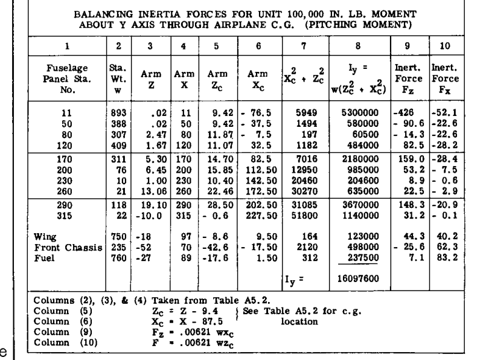