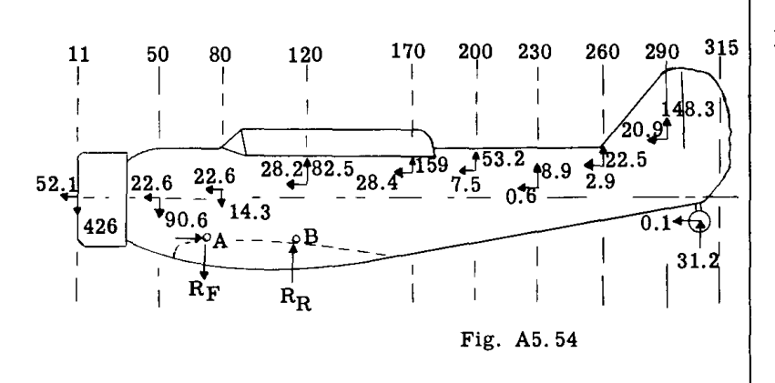
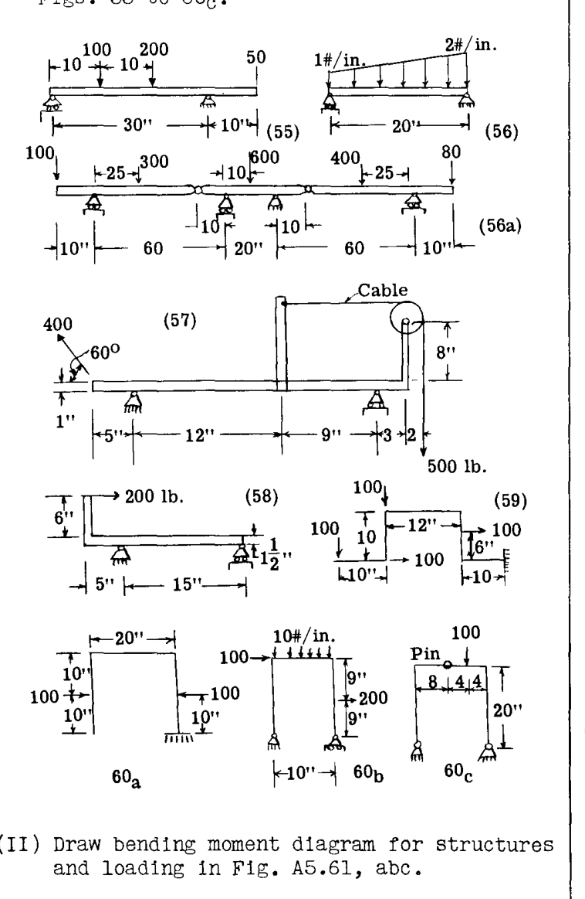
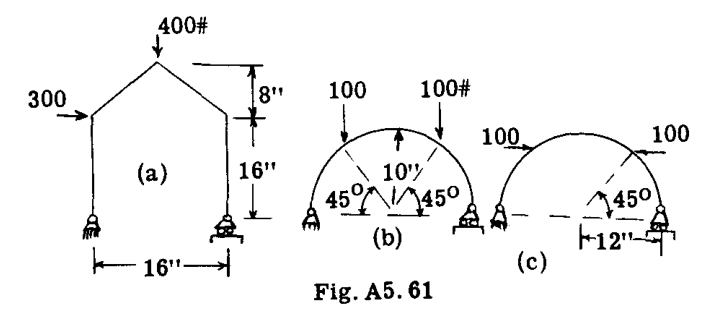
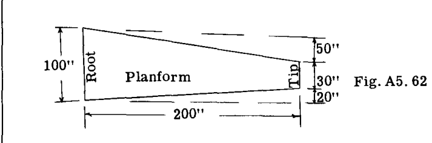
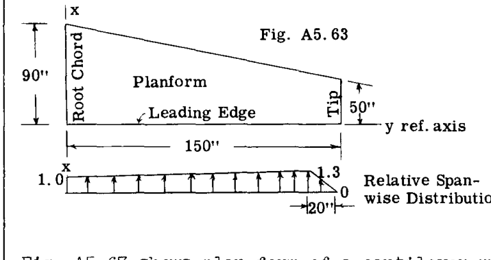
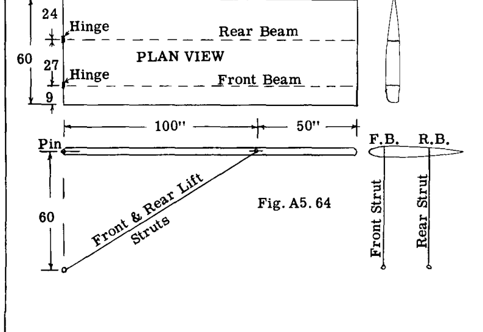
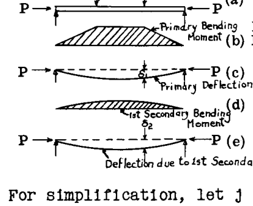
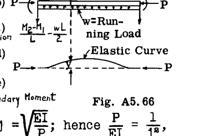
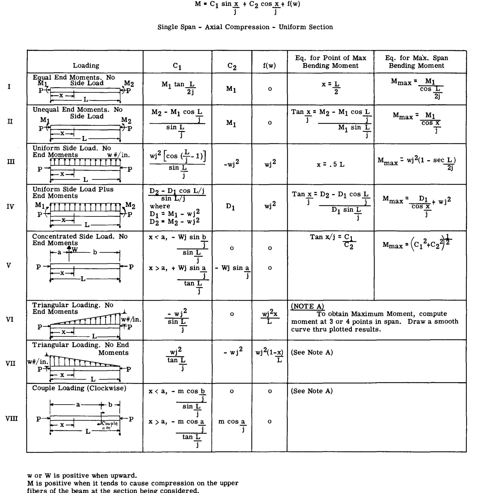
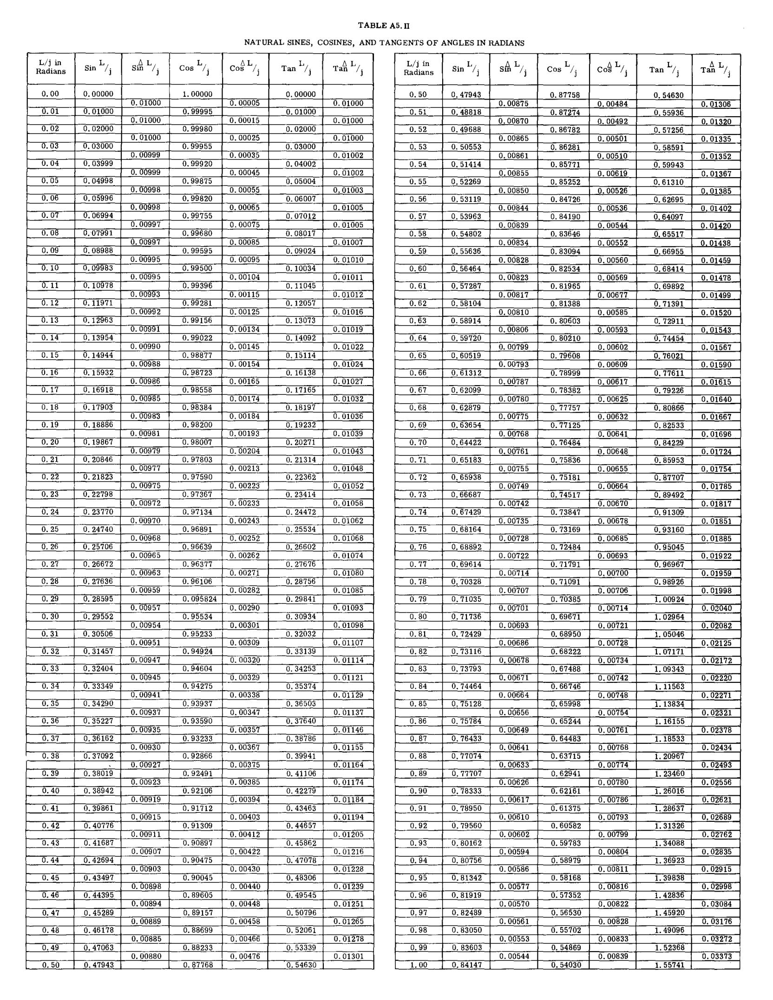

# 梁 — せん断とモーメント  

  

## A5.22 問題  

(I) 図 55 から 60c に示す荷重がかかった構造物のせん断力、曲げモーメント、および軸荷重図を描け。  

  

(II) 図 A5.61 a, b, c の構造物と荷重に対する曲げモーメント図を描け。  

  

III. 図 A5.62 は片持ち翼の平面形状を示している。表面に  $50\text{ lb./sq.ft.}$  の一定の垂直等分布荷重が作用していると仮定せよ。翼のせん断力と曲げモーメントの式を作成し、端部から 25、100、150、および 200 インチの地点での値を求めよ。  

  

  

図 A5.63 は片持ち翼の平面形状を示している。表面に垂直な総分布空気荷重は  $10000\text{ lb.}$  である。相対的なスパン方向の分布が示されている。圧力中心を前縁から翼弦の 24 パーセントの位置に取れ。翼を 10 インチ幅の細長い帯に分割し、 $V_z$ 、 $M_x$ 、および  $M_y$  を計算し、それらの曲線をプロットせよ。  

IV. 図 A5.64 は外部補剛された単葉翼を示している。翼の平均揚力荷重を翼に対して垂直に  $90\text{ lb./sq.ft.}$  とし、圧力中心を前縁から翼弦の 27 パーセントの位置に取って、前後のビームの一次せん断力および曲げモーメント図を計算し、描け。  

  

---

# 曲げモーメント - 梁・柱の作用  

### A5.23 はじめに  

梁・柱（ビームコラム）とは、横荷重または端モーメントに加えて軸荷重を受ける部材のことである。横荷重または端モーメントは曲げモーメントを発生させ、それが部材の横方向の曲げたわみを引き起こす。軸荷重は、この横方向のたわみに軸荷重を乗じた二次的な曲げモーメントを発生させる。圧縮軸荷重は一次的な横方向曲げモーメントを増加させる傾向があり、一方で引張軸荷重はそれらを減少させる傾向がある。  

梁・柱部材は、航空機構造において非常に一般的である。例えば、外部補剛された翼や尾翼のビームは典型的な例であり、空気荷重が横方向の梁荷重を発生させ、支柱（ストラット）が軸方向の梁荷重を導入する。着陸装置では、通常、一つの部材が大きな曲げ荷重と軸荷重を受ける。管状の胴体トラスでは、トラス接合部間の部材で支持される装備品による横荷重が、梁・柱作用を引き起こす。  

一般に、航空機構造における梁・柱部材は、建物や橋梁のものに比べて比較的細長い。そのため、軸荷重による二次曲げモーメントがかなりの割合を占めることが多く、部材の設計において考慮する必要がある。  

本章では、単一スパンの梁・柱部材の理論について簡潔に述べる。計算式と設計図表の要約を、それらの使用例とともに含めている。本章の情報は、梁・柱部材の実践的な解析と設計が考慮される他の章で頻繁に使用される。梁・柱理論の完全かつ包括的な扱いおよび式の導出については、Niles and Newell の "Airplane Structures" を参照されたい。  

### A5.24 軸荷重と横荷重を同時に受ける部材の一般的作用  

図 A5.65 の部分図 a は、横荷重  $W$  と軸方向の圧縮荷重  $P$  を受ける部材を示している。横荷重  $W$  は、図 b に示すような一次曲げ分布を部材に発生させる。この曲げは、図 c に示すような横方向のたわみ曲線を生じさせる。ここで、端荷重  $P$  は、たわみ  $\delta$  に端荷重  $P$  を乗じた追加の二次曲げモーメント、すなわち図 d の曲げモーメント図を発生させる。この最初の二次モーメント分布は、図 e の追加の横方向たわみ曲線を生じさせ、端荷重  $P$  は再びこのたわみによるさらなる曲げモーメントを発生させる。軸荷重が大きすぎない場合、これらの連続的なたわみは徐々に収束し、部材は平衡状態に達する。  

これらの二次曲げモーメントは、第 A7 章で示されている様々なたわみ原理による逐次ステップによって求めることができる。しかし、等断面の梁の場合、この収束性は数学的な級数として表現できるため、上記の逐次法に比べて大幅に時間を短縮できる。断面二次モーメントが変化する部材の場合、二次モーメントは通常、逐次法によって求める必要がある。  

端荷重  $P$  が引張力である場合、それらは一次モーメントを減少させる傾向がある。したがって、一般に軸圧縮の場合は、座屈や不安定性が問題に関係するため、実用的な設計においてより重要である。  

### A5.25 等分布横荷重を受ける圧縮軸荷重付き柱の式  

図 A5.66 は、長さ  $L$  のプリズム状の梁を示しており、中心圧縮荷重  $P$  と一様な横方向の等分布荷重  $w$  を受けている。梁は両端で横方向に支持され、端部拘束モーメント  $M_1$  および  $M_2$  が作用している。梁理論の一般的な条件、すなわち、曲げの後も平面セクションは平面を維持すること、および応力が引張と圧縮の両方で歪みに比例することが保持されていると仮定する。  

梁の端から距離  $x$  の任意の点におけるモーメントの式は次のように表される：  

$$ 
M = M_1 + \frac{(M_2 - M_1)}{L}x - \frac{wLx}{2} + \frac{wx^2}{2} - Py 
$$ 
(A5.1)  

応用力学から、  $M = EI\frac{d^2y}{dx^2}$  であることがわかっている。したがって、式 (A5.1) を  $x$  について 2 回微分すると次式が得られる：  

$$ 
\frac{d^2M}{dx^2} + \frac{P}{EI}M = w 
$$ 
(A5.2)  

  

  

簡略化のために  $j = \sqrt{\frac{EI}{P}}$  と置く。したがって  $\frac{P}{EI} = \frac{1}{j^2}$  となり、これを (A5.2) に代入すると次式が得られる：  

$$ 
\frac{d^2M}{dx^2} + \frac{1}{j^2}M = w 
$$  

---

この微分方程式の解は次のように与えられる：  

$$ 
M = C_1\sin\frac{x}{j} + C_2\cos\frac{x}{j} + wj^2 
$$ 
(A5.3)  

ここで、 $C_1$  および  $C_2$  は積分定数であり、 $\sin\frac{x}{j}$  および  $\cos\frac{x}{j}$  は変数  $x$  の無限級数の極限である。 $x = 0$  のとき  $M = M_1$  であるから、  

$$ 
C_2 = M_1 - wj^2 
$$  

 $x = L$  のとき  $M = M_2$  であるから、したがって：  

$$ 
C_1 = \frac{M_2 - wj^2}{\sin\frac{L}{j}} - \frac{M_1 - wj^2}{\tan\frac{L}{j}} 
$$ 

$$ 
= \frac{M_2 - wj^2 - (M_1 - wj^2)\cos\frac{L}{j}}{\sin\frac{L}{j}} 
$$  

 $D_1 = M_1 - wj^2$  および  $D_2 = M_2 - wj^2$  と置く。すると、これらを式 (A5.3) に代入して：  

$$ 
M = \frac{D_2 - D_1\cos\frac{L}{j}}{\sin\frac{L}{j}}\sin\frac{x}{j} + D_1\cos\frac{x}{j} + wj^2 
$$ 
(A5.4)  

最大モーメントの位置を求めるには、式 (A5.3) を微分してゼロに等置する。  

$$ 
\frac{dM}{dx} = 0 = \frac{C_1}{j}\cos\frac{x}{j} - \frac{C_2}{j}\sin\frac{x}{j} 
$$  

これより、  

$$ 
\tan\frac{x_m}{j} = \frac{C_1}{C_2} = \frac{D_2 - D_1\cos\frac{L}{j}}{D_1\sin\frac{L}{j}} 
$$ 
(A5.5)  

 $x$  の値は  $0$  から  $L$  の範囲内になければならない。さもなければ、 $M_1$  または  $M_2$  が最大値となる。  

最大スパンモーメントの値は、式 (A5.5) からの値を式 (A5.4) に代入することで求めることができ、次式が得られる：  

$$ 
M_{max} = \frac{D_1}{\cos\frac{x_m}{j}} + wj^2 
$$ 
(A5.6)  

スパンに沿った任意の点  $x$  におけるモーメント  $M$  は、次のようにも書ける：  

$$ 
M = D_1 \left[ \tan\frac{x_m}{j} \cdot \sin\frac{x}{j} + \cos\frac{x}{j} \right] + wj^2 
$$ 
(A5.7)  

ここで、 $x_m$  はスパンモーメントが最大になる  $x$  の値、すなわち式 (A5.5) を指す。通常、他のスパン位置を調査する前に最大スパン曲げモーメントの位置とその値を特定するため、 $\tan\frac{x_m}{j}$  の値は式 (A5.5) から既知であり、スパンに沿った他の点でのモーメントを求めるために式 (A5.7) で使用できる。  

梁のたわみの式が必要な場合は、式 (A5.3) からの  $M$  の値を式 (A5.1) に代入することで求めることができ、次式が得られる：*  

$$ 
y = \frac{1}{P} \left( M_1 + \frac{M_2 - M_1}{L}x - \frac{wLx}{2} + \frac{wx^2}{2} - \frac{D_2 - D_1\cos\frac{L}{j}}{\sin\frac{L}{j}}\sin\frac{x}{j} - D_1\cos\frac{x}{j} + wj^2 \right) 
$$ 
(A5.7a)  

弾性曲線の任意の点における勾配は、式 (A5.7a) の一次導関数によって与えられる：  

$$ 
i = \frac{1}{P} \left( \frac{M_2 - M_1}{L} - \frac{wL}{2} + wx - \frac{C_1}{j}\cos\frac{x}{j} + \frac{C_2}{j}\sin\frac{x}{j} \right) 
$$ 
(A5.8)  

### A5.26 他の単一スパン荷重の公式  

軸方向の圧縮を受ける単一スパンの他の横荷重を調査すると、スパン内の曲げモーメントの式は常に次の形式をとることがわかる：  

$$ 
M = C_1\sin\frac{x}{j} + C_2\cos\frac{x}{j} + f(w) 
$$ 
(A5.9)  

ここで、 $f(w)$  は軸荷重  $P$  や端モーメント  $M_1, M_2$  を含まない項である。 $f(w)$ 、 $C_1$ 、 $C_2$  の式は横荷重のタイプに依存する。  

表 A5.I は、航空機構造で頻繁に遭遇する単一スパンの横荷重のタイプについて、これら 3 つの項の値を示している。表には、最大曲げモーメントの点とその大きさの式も記載されている。  

表 A5.II は、ラジアン単位の  $L/j$  に対する正弦（sin）、余弦（cos）、および正接（tan）の表であり、通常の三角関数表よりも使いやすくなっている。この表は Air Corps Information Circular #493 の Appendix I に示されている値に基づいている。表の迅速な使用を容易にするために、 $\Delta$ （差分）が追加されている。  

単一スパンの梁の場合、 $L/j$  の臨界値は  $\pi$  である。すなわち、軸圧縮荷重によって  $L/j = \pi$  となるような場合、梁の中央部は合成応力が材料の破壊応力に達するまでたわもうとする。  

### A5.27 表 A5.I に示される各種荷重システムの組み合わせによるモーメント、安全率、計算の精度  

重ね合わせ（スーパーポジション）の原理は梁・柱には適用できない。なぜなら、横荷重による曲げモーメントと、個別に作用する軸荷重による曲げモーメントの和は、それらが同時に作用するときのモーメントと同じではないからである。いくつかの横荷重システムとそれに伴う軸荷重を組み合わせる場合、各横荷重が、組み合わされるシステムの合計軸荷重とともに使用されるならば、重ね合わせの原理が適用できると言える。したがって、表 A5.I において、いくつかの組み合わされた荷重に対するモーメントを求めるには、各荷重に対する  $C_1, C_2$  および  $f(w)$  の値を加算し、その結果を使用する。  

---

### 表 A5.I 

式  $M = C_1\sin\frac{x}{j} + C_2\cos\frac{x}{j} + f(w)$  における  $C_1, C_2, f(w)$  の値  
単一スパン - 軸圧縮 - 等断面  

  

 $w$  または  $W$  は上向きの場合に正とする。  
 $M$  は、検討中のセクションで梁の上部繊維に圧縮を生じさせる傾向がある場合に正とする。  

参照：ACIC #493; Niles, Airplane Design; Newell and Niles, Airplane Structures  
他の多くの荷重条件の表については、NACA T.M. 985 を参照。  

---

### 表 A5.II 

ラジアン単位の角度の自然正弦、余弦、および正接  

