表 A5.II
ラジアン単位の角度の自然正弦、余弦、および正接

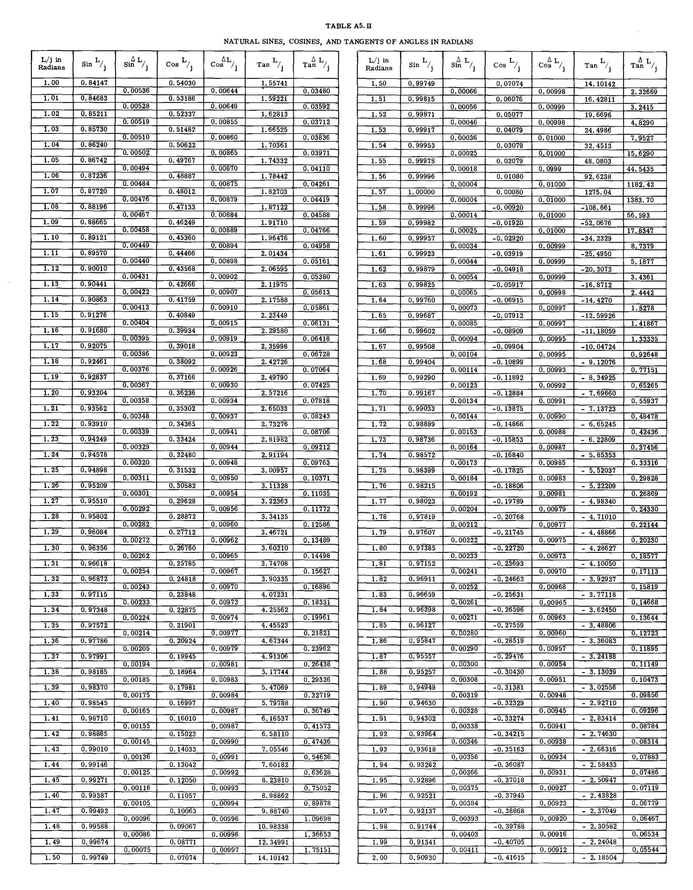

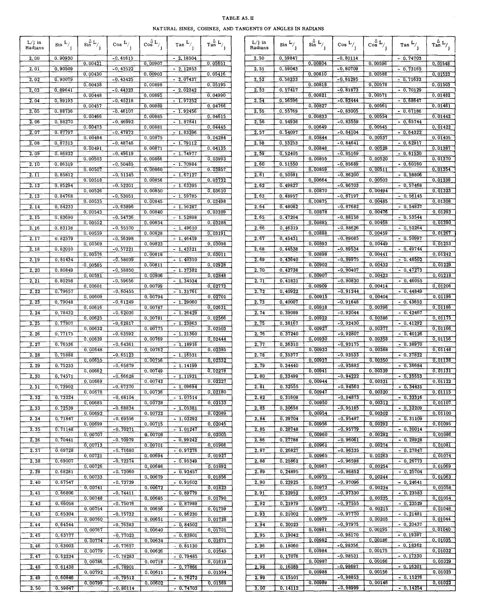

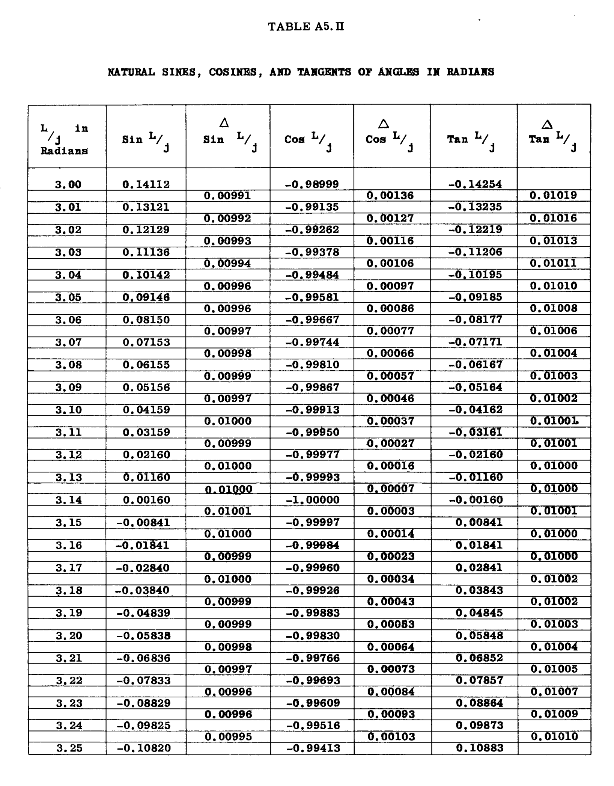

# A5.28 梁－柱 (BEAM -- COLUMNS)

表の冒頭に示されている  $M$  の一般式におけるこれらの値は、表の最上部で計算される。  

梁－柱部材において、曲げモーメントは荷重の増加に直接比例して変化しない。したがって、荷重に対するモーメントの直接比例に基づく安全率は不正確であり、危険側に位置することを学生は認識すべきである。  

計算には4桁の有効数字を使用し、いわゆる精密式を用いることが推奨される。なぜなら、多くの場合、結果には大きな数値間の小さな差が含まれるからである。  

## A5.28 例題*

### 例題 #1
図 A5.67 は、複葉機の典型的な上部外側パネル翼梁を示している。点 (1) と (2) の間の最大負曲げモーメント（一般に最大スパンモーメントと呼ばれる）を求める必要がある。梁の真の曲げモーメントを得るためには、梁のたわみに影響を与えるため、点 (1) および (2) における端部モーメントと同様に、軸方向の梁荷重が必要である。  

**解法：**  
リフトストラット荷重の水平成分  $T_h$  を求めるために、梁の左端にあるヒンジ点まわりのモーメントをとる。  

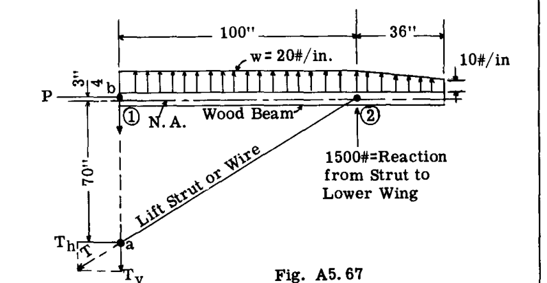

$$ 
\sum M_b = - 2000 \times 50 - 540 \times 116 - 1500 \times 100 + 70.75 T_h = 0 
$$ 

したがって、  
 $T_h = 4420 \#$   

点 (2) においてリフトストラットによって誘発される軸方向圧縮荷重は、 $- 4420 \#$  に等しい。  
図 A5.67 の荷重系に対して  $\sum H = 0$  とすると、 $P = - T_h = 4420 \#$  が得られる。点 (1) における梁の端部モーメントは、端部荷重に、中立軸からのヒンジの偏心を乗じたものに等しい。  

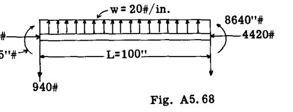

または、梁の  $4420 \times .75 = 3315 \#$  インチ正モーメントである。なぜなら、それは上部繊維に圧縮を生じさせるからである。  
点 (2) におけるモーメントは、片持ち梁のオーバーハングによるもので、 $\frac{(20 + 10)}{2} 36 \times 16 = 8640 \#$  インチに等しい。図 A5.68 は、点 (1) と (2) の間の梁部分を自由体として示している。  

Art. A5.25 より、端部圧縮荷重を伴う横方向等分布荷重を受ける梁に対して、以下の精密式が得られている。  

$$ 
\tan \frac{x}{j} = \frac{D_2 - D_1 \cos \frac{L}{j}}{D_1 \sin \frac{L}{j}} 
$$ 
--- (A)  

および  

$$ 
M_{max} = \frac{D_1}{\cos \frac{x}{j}} + wj^2 
$$ 
--- (B)  

これらの式に代入するための項を評価すると、以下が得られる。  

 $M_1 = 3315 \#$  インチ  
 $M_2 = 8640 \#$  インチ  
 $P = 4420 \#$  圧縮  
 $I = 10 \text{ in}^4$  既知であり、スパン全体で一定と仮定する。  

$$ 
j = \sqrt{\frac{1.3 \times 10^8 \times 10}{4420}} = \sqrt{2941} = 54.23 
$$ 

 $wj^2 = 20 \times 2941 = 58820$   
 $D_1 = M_1 - wj^2 = 3315 - 58820 = - 55505$   
 $D_2 = M_2 - wj^2 = 8640 - 58820 = - 50180$   
 $\frac{L}{j} = \frac{100}{54.23} = 1.844$   

表 A5.II より  $\sin \frac{L}{j} = .96290$  および  $\cos \frac{L}{j} = - .26981$   

式 (A) に代入すると、  

$$ 
\tan \frac{x}{j} = \frac{- 50180 - (- 55505 \times - .26981)}{- 55505 \times .96290} = \frac{- 65156}{- 53441} = 1.2192 
$$ 

 $\frac{x}{j} = \tan^{-1} 1.2192 = .88383$   

したがって、 $x = .88383 \times 54.23 = 48$  インチであり、これは梁の左端から最大スパンモーメントの点までの距離に等しい。  

$$ 
M_{max} = \frac{D_1}{\cos \frac{x}{j}} + wj^2 
$$ 

表 A5.II より  $\cos \frac{x}{j} = .63419$   

したがって、  

$$ 
M_{max} = \frac{- 55505}{.63419} + 58820 = - 28,700 \# 
$$ 

二次曲げモーメントの大きさ、つまり、側方梁のたわみに軸方向荷重を乗じたことによるモーメントについての概念を得るために、点 48 インチにおける一次曲げモーメントは、左端から次のように計算される。  
 $M_{s} = 3315 + 48 \times 20 \times 24 - 940 \times 48 = - 18765 \#$  インチ  

したがって、二次曲げモーメントは  $- 28700 + 18765 = - 9935 \#$  インチに等しく、これは一次モーメントの大きな割合を占めている。最大スパンモーメントの点における梁の横方向たわみは、 $- \frac{9935}{4420} = 2.25$  インチ上方である。  

### スパンに沿った任意の点における曲げモーメント
点 (2) から 10 インチの位置にあるモーメントを求める。この場合、 $x = 100 - 10 = 90$  である。  

 $M = D_1 [ \tan \frac{x_m}{j} \cdot \sin \frac{x}{j} + \cos \frac{x}{j} ] + wj^2$  (式 A5.7 参照)  

 $\frac{x}{j} = \frac{90}{54.23} = 1.6596, \sin \frac{x}{j} = .99605$   
 $\cos \frac{x}{j} = - .08867$   
 $\tan \frac{x_m}{j} = 1.2192$  （最大曲げモーメントの点における  $x$  の値）  

したがって、  
 $M = - 55505 [ (1.2192 \times .99605) + (- .08867) ] + 58820 = - 3664 \#$   

### 例題 #2
図 A5.69 は、車軸に  $12000 \#$  の垂直荷重を受ける簡略化された着陸装置構造を示している。部材 ABC は B を通って連続しており、C でピン留めされている。部材 BC の中間点における曲げモーメントと、12000# の垂直設計荷重によるその横方向たわみを求める必要がある。  

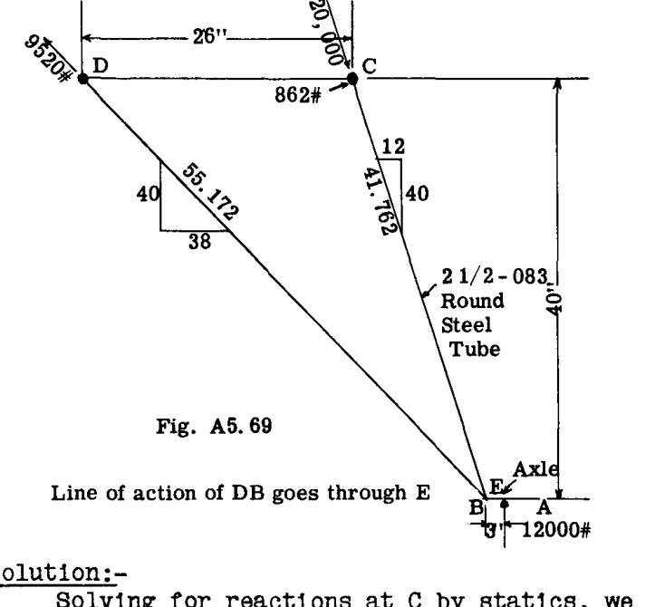

**解法：**  
静力学により C における反力を求めると、BC の軸方向荷重  $P = - 20000$  が得られる。車輪荷重の 3 インチの偏心による B における曲げモーメントは、 $3 \times 12000 = 36000 \#$  インチである。  
図 A5.70 は部材 ABC の BC 部分の自由体を示している。表 A5.I より  

 $M = C_1 \sin \frac{x}{j} + C_2 \cos \frac{x}{j} + f(w)$   

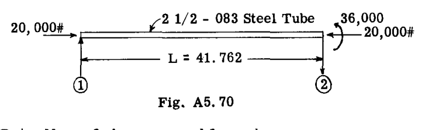

表 A5.I から  $C_1, C_2, f(w)$  の値を上式に代入すると：  

$$ 
M = \frac{(M_2 - M_1 \cos \frac{L}{j}) \sin \frac{x}{j}}{\sin \frac{L}{j}} + M_1 \cos \frac{x}{j} 
$$ 

しかし、我々の問題では  $M_1 = 0$  であるため、  

$$ 
M = \frac{M_2 \sin \frac{x}{j}}{\sin \frac{L}{j}} 
$$ 

$$ 
j = \sqrt{\frac{EI}{P}} = \sqrt{\frac{29 \times 10^6 \times .46}{20000}} = \sqrt{667} = 25.826 
$$ 

 $\frac{L}{j} = \frac{41.762}{25.826} = 1.617$  ---  $\sin \frac{L}{j} = .99892$   
 $x = \frac{L}{2} = 20.881$   
 $\frac{x}{j} = \frac{20.881}{25.80} = .8085$  ---  $\sin \frac{x}{j} = .72327$   

 $M$  の上式に代入すると、  

$$ 
M = \frac{36000 \times .72327}{.99892} = 26066 \# 
$$ 

これは一次モーメント  $36000 / 2 = 18000 \#$  インチと比較される。BC の中間点におけるたわみは  $\frac{26066 - 18000}{20000} = .403$  インチである。  
最大モーメントは次式で与えられる：  
 $M_{max} = \frac{M_2}{\sin \frac{L}{j}}$  であり、それは  $x = \frac{\pi j}{2}$  で発生する（表 A5.I 参照）。  

## A5.29 材料の比例限度応力を超える応力*

本章で提示した式は、 $E$  が一定であること、換言すれば応力が弾性範囲内にあることを前提としている。航空機の構造設計では、永久変形を伴わずに作用荷重または制限荷重に耐えなければならないため、そのような荷重下では  $E$  は一定である。しかし、航空機構造は、制限荷重に安全率（通常 1.5）を乗じた値に等しい設計荷重に、故障することなく耐えなければならない。多くの場合、材料の剛性が低下し一定ではなくなる塑性域の応力下で構造破壊が発生する。  

有効係数  $E'$  の良好な近似値は次のように得られる：  

(1) 与えられた数値に対して  $F_c = P/A$  を計算する。  

(2) この  $F_c$  の値を用いて、与えられた材料の基本的な柱曲線図（端部固定度  $C=1$  の場合）に入り、応力  $F_c$  に対応する  $L' / \rho$  の値を求める。  

(3) これらの  $L' / \rho$  と  $F_c$  の値を用いて、次式を計算する。  

$$ 
E' = \frac{F_c}{\pi^2} \left( \frac{L'}{\rho} \right)^2 
$$ 

(4) 次に  $j = \left( \frac{E' I}{P} \right)^{1/2}$   

様々な材料の基本的な柱曲線は、本書の別の章に記載されている。  

## A5.30 演習問題*

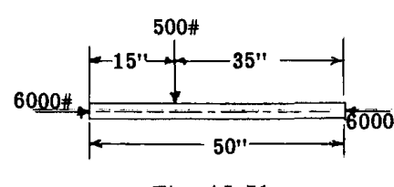
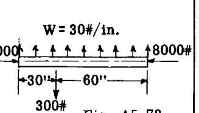

(1) 図 A5.71 は、 $1-1/2 - .065$  鋼管が両端荷重と横荷重の両方を受けていることを示している。管の最大曲げモーメントを求めよ。その結果を横荷重のみによる曲げモーメントと比較せよ。 $E = 29 \times 10^6$  psi。管の  $I = .075 \text{ in}^4$ 。最大曲げモーメントの点における横方向たわみを計算せよ。管の断面積  $= 0.293 \text{ sq. in.}$   

(2) 図 A5.72 の梁－柱部材は 24ST アルミニウム合金製である。部材の曲げモーメントの曲線を計算してプロットせよ。また、横荷重のみによる曲げモーメントもプロットせよ。 $E = 10.3 \times 10^6$  psi、 $I = 5.0 \text{ in}^4$ 。  

(3) 図 A10.9 の木製翼梁と荷重について、最大曲げモーメントを求めよ。梁断面の  $I = 17 \text{ in}^4$ 、 $E = 1.3 \times 10^6$ 。  

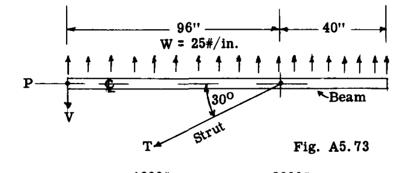
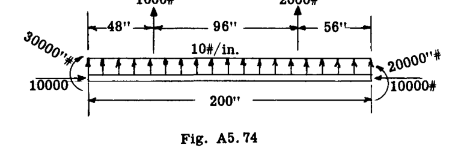

(4) 図 A10.10 に示されている梁－柱の中心線における曲げモーメントを求めよ。 $EI = 64,000,000 \text{ lb. in}^2$  と仮定せよ。  

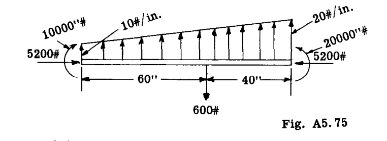

(5) 図 A5.75 の梁－柱について、部材の中心線における曲げモーメントを計算せよ。 $E = 1,300,000$  psi および  $I = 10 \text{ in}^4$  と仮定せよ。  

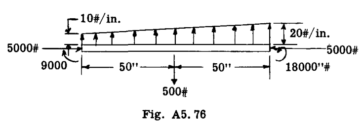

(6) 図 A5.76 の梁－柱荷重について、梁の中心点における曲げモーメントを計算せよ。 $E = 1,200,000$  psi および  $I = 10 \text{ in}^4$  とせよ。  

## A5.31 連続構造における梁－柱

特定の部材内の梁－柱の作用による二次モーメントは、連続構造の隣接部材のたわみにも影響を及ぼす。このかなり複雑な問題は、第 A11 章の Art. A11.12 から 15、および第 C2 章の Part F で説明および図示されているモーメント分配法によって、非常に簡単かつ迅速に処理できる。  

断面が変化したり、軸荷重が変化したりするような梁－柱の数値的手順は、第 C2 章の Part K および L で提示され、図示されている。  

弾性支点上の梁－柱については、第 C2 章の Part M で説明されている。