# 第A6章
# ねじり - 応力とたわみ

## A6.1 序論
ねじりに関する問題は、航空機構造において一般的である。金属で覆われた飛行機の主翼や胴体は、基本的には薄肉の管状構造であり、特定の飛行条件や着陸条件において大きなねじりモーメントを受ける。飛行機内の様々な機械制御システムは、しばしば運用条件下でねじり力を受ける様々な断面形状のユニットを含んでいるため、航空機構造設計において部材のねじり応力と歪みの知識が必要となる。

## A6.2 円形断面部材のねじり
ねじり応力と歪みの式の誘導において、以下の条件が想定される：
(1) 部材は円形、中実または中空の丸棒シリンダーである。
(2) トルク印加後も断面は円形のままである。
(3) 断面のねじれ後も直径は直線のままである。
(4) 材料は均質、等方性、および弾性的である。
(5) 加えられた荷重は、シャフトまたはシリンダーの軸に垂直な平面内に存在する。

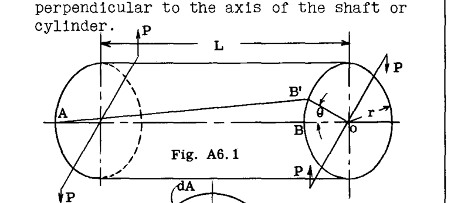

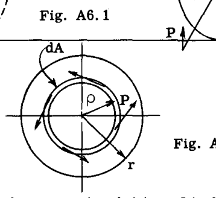

Fig. A6.1は、2つの等しく反対方向のねじり偶力を受ける直線状の円柱棒を示している。棒はねじれ、各断面はせん断応力を受ける。左端を棒の残りの部分に対して固定されていると仮定すると、表面上の線  $AB$  はこれらのせん断応力の下で  $AB'$  へ移動し、任意の断面におけるこの回転は、固定支持部からの距離に比例する。移動時に任意の半径方向の線は角度変位のみを受ける、すなわち  $OB$  は  $OB'$  へ移動する際に直線のままであると想定される。

距離  $L$  における単位せん断歪みは、次のように表される。

$$ \epsilon = \frac{BB'}{AB} = \frac{r \theta}{L} $$ 

 $G$  を材料の剛性率とし、 $\tau$  を断面の最外縁部における単位せん断応力とする。

したがって、 $\tau = \epsilon G = \frac{r \theta G}{L}$  --- (1)

Fig. A6.2において、中心  $O$  から距離  $\rho$  にある円環状のストリップ  $dA$  上の単位せん断応力を  $\tau_\rho$  とすると、次のように表される。

$$ \tau_\rho = \frac{\rho}{r} \tau = \frac{\rho r \theta G}{r L} = \frac{\rho \theta G}{L} $$ 

棒の軸  $O$  の周りの円環ストリップ  $dA$  上のせん断応力のモーメントは、次のように表される。

$$ dM = \tau_\rho \rho dA = \frac{\rho^2 \theta G dA}{L} $$ 

したがって、全内部ねじり抵抗モーメントは、

$$ M_{int} = \int \frac{\rho^2 G \theta dA}{L} $$ 

平衡状態では、内部抵抗モーメントは外部ねじりモーメント  $T$  に等しく、 $\frac{G \theta}{L}$  は定数であるため、次のように書くことができる。

$$ T = M_{int} = \frac{G \theta}{L} \int_0^r \rho^2 dA = \frac{G \theta J}{L} $$ --- (2)

ここで  $J$  はシャフト断面の極慣性モーメントであり、直径に関する慣性モーメントの2倍に等しい。

式(1)より、 $\frac{G \theta}{L} = \frac{\tau}{r}$  である。

したがって、$$ T = \frac{\tau J}{r} $$ --- (3)

または $$ \tau = \frac{Tr}{J} $$ --- (4)

また、式(2)より、ねじれ角  $\theta$  について解くと、

$$ \theta = \frac{TL}{GJ} $$ --- (5)

( $\theta$  はラジアン単位である)

## A6.3 円柱シャフトによる動力伝達
ねじり偶力  $T$  が角度変位を移動する際に行われる仕事は、偶力の大きさとラジアン単位の角度変位の積に等しい。角度変位が1回転の場合、行われる仕事は  $2 \pi T$  に等しい。  $T$  が inch-pounds で表され、  $N$  が 1分間あたりの回転数（rpm）である場合、回転シャフトによって伝達される馬力（horsepower）は次のように書ける。

$$ H.P. = \frac{2 \pi N T}{396000} $$ --- (6)

ここで、396000は1分間あたりの1馬力の仕事量を inch-pounds で表したものである。式(6)は次のように書き換えることができる。

$$ T = \frac{H.P. \times 396000}{2 \pi N} = \frac{63025 H.P.}{N} $$ --- (7)

## 例題

**問題 1.**
Fig. A6.3は、従来の操縦桿とトルクチューブの操作ユニットを示している。グリップにかかる 150 lbs の横荷重に対して、補助翼トルクチューブのせん断応力と、点AとBの間のねじれ角を求めよ。

**解法:**
操縦桿の 150 lbs の力によるチューブABへのねじりモーメント：
 $T = 150 \times 26 = 3900 \text{ in. lb.}$  

このトルクに対する抵抗は、補助翼の作動システムによって提供され、ホーンの牽引力は  $3900 / 11 = 356 \text{ lb}$  に等しい。

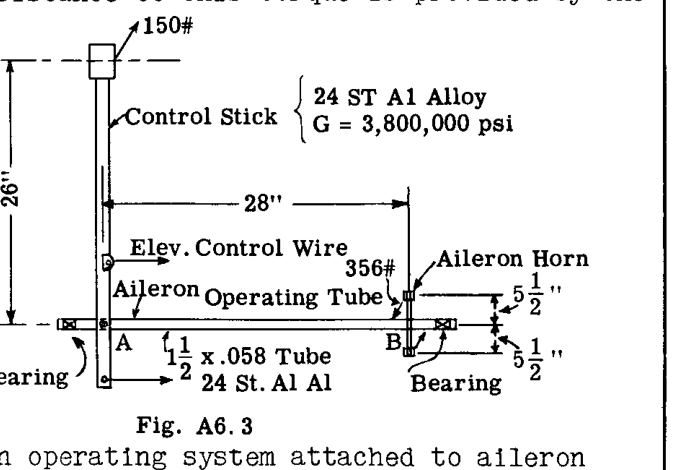

外径  $1 \frac{1}{2}$  インチ、肉厚 0.058 インチの丸棒チューブの極慣性モーメントは  $J = 0.1368 \text{ in}^4$  である。

最大せん断応力：
 $\tau = Tr/J = (3900 \times 0.75) / 0.1368 = 21400 \text{ psi}$  

点AとBの間のチューブの角度変位は次のように求められる。

$$ \theta = \frac{TL}{GJ} = \frac{3900 \times 28}{3,800,000 \times 0.1368} = 0.21 \text{ radians} $$ 

または 12度。

**問題 2.**
Fig. A6.4は、3つのヒンジブラケットで支持され、中央の支持ブラケットの上でトルクチューブに取り付けられたコントロールロッド金具を備えた、円形トルクチューブ（サイズ  $1 \frac{1}{4} - .049$ ）で構成される補助翼制御面を示している。補助翼上の空気荷重が Fig. A6.4 に示される通りである場合、チューブ内の最大ねじりせん断応力を求め、またホーンセクションと補助翼端の間のチューブのねじれ角を計算せよ。

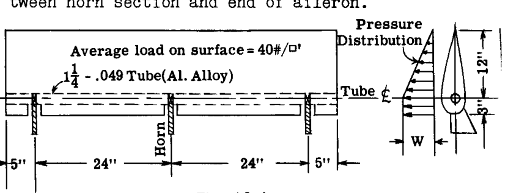

**解法:**
表面の空気荷重は補助翼をトルクチューブの周りに回転させようとするが、中央の支持ブラケット上にあるトルクチューブに取り付けられたコントロールロッドによって移動が阻止または生成される。

1インチ幅の補助翼ストリップ上の全荷重  $= 40 (15 \times 1 / 144) = 4.16 \text{ lb.}$  

 $w$  を補助翼の前縁部における補助翼スパンの1インチあたりの荷重強度とする（Fig. A6.4 の圧力分布図を参照）。

すると、 $3w + (0.5w)12 = 4.16$  

ゆえに  $w = 0.463 \text{ lb./in.}$  

トルクチューブ中心線より前方の全荷重  $P_1 = 0.463 \times 3 = 1.389 \text{ lb.}$  
ヒンジラインより後方の補助翼部分の全荷重  $P_2 = 0.463 \times 0.5 \times 12 = 2.778 \text{ lb.}$  

トルクチューブのランニングインチあたりのねじりモーメント：
 $= -1.389 \times 1.5 + 2.778 \times 4 = 9.0 \text{ in. lb.}$  

したがって、補助翼の中央で発生する最大トルクは  $9.0 \times 29 = 261 \text{ in. lb.}$  である。

$$ \tau(max.) = \frac{Tr}{J} = \frac{261 \times 0.625}{0.06678} = 2450 \text{ psi} $$ 

( $J = 0.06678 \text{ in}^4$ ) 

チューブ断面は一定であり、トルクは補助翼の端からの距離に正比例して変化するため、ねじれ角  $\theta$  は、ホーンの片側または距離  $L = 29"$  のチューブの全長に作用する平均トルクを使用して計算できる。したがって、

$$ \theta = \frac{TL}{GJ} = \frac{261 \times 29}{2 \times 3800000 \times 0.06678} \times 57.3 = 0.86 \text{ degrees} $$ 

## A6.4 非円形断面部材のねじり
Art. A6.2で導出された式は、仮定が成り立たないため、非円形形状には使用できない。純粋なねじりを受ける円形シャフトでは、せん断応力分布は Fig. A6.5 に示す通りであり、すなわち、最大せん断応力は棒の中心線軸から最も離れた繊維に位置し、応力点への半径に対して垂直である。回転軸から特定の距離において、せん断応力は Fig. A6.5 に示されるように両方向で一定である。これは、棒がねじれる際にその端部セグメントが互いに平行なままであること、言い換えれば、棒がねじれる際に断面が平面から外れて歪まない（反らない）ことを意味する。

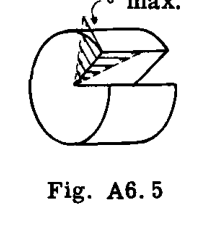

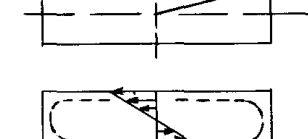

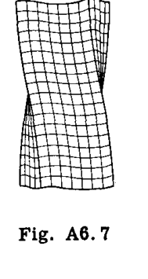

もし Fig. A6.5 の条件を Fig. A6.6 の長方形の棒に適用すると、最も応力を受ける繊維は角にあり、応力は示されているように方向付けられることになる。その場合、応力は表面に垂直な成分と表面に沿った成分を持つことになるが、これは正しくない。弾性理論によれば、最大せん断応力は Fig. A6.6 に示されるように長辺の中心線で発生し、角での応力はゼロであることが示されている。したがって、長方形の棒がねじれるとき、せん断応力は回転軸からの距離が同じであっても一定ではなく、したがって棒を切り取ったセグメントの端は、棒がねじれるときに互いに平行なままではなく、言い換えれば、断面が平面から外れて反る（歪む）現象が発生する。Fig. A6.7 は、ねじられた長方形の棒におけるこの動作を示している。棒の端部は反っているか、元の無応力状態の平面に対して垂直な歪みを受けている。

非円形断面のせん断応力とねじれを決定するためのさらなる議論と式の要約は、Art. A6.6 で与えられる。

## A6.5 弾性膜相似（メンブレン・アナロジー）
ねじりにおける非円形断面の反った断面の形状は弾性理論による解析で必要とされるが、結果として長方形、楕円、三角形などの少数の形状のみが理論的アプローチによって解かれている。しかし、膜相似を利用することで、ほぼあらゆる断面形状に対して実験的に非常に近い近似を行うことができる。

プランク（Prandtl）によって、棒のねじり方程式と一様な圧力を受ける膜のたわみ方程式が同じ形式を持つことが指摘された。したがって、考慮されている棒の断面と同じ形状を持つ開口部の上に弾性膜を張り、膜の両側にわずかな圧力差を与えてたわませると、得られた膜のたわみ形状は、理論式で使用できる特定の量を提供する。しかし、膜理論の主な利点は、ねじりを受ける棒の複雑な断面全体にわたって応力状態がどのように変化するかを、かなりの精度で視覚化する方法を提供することにある。

膜相似は、たわんだ膜とねじられた棒の間に以下の関係を提供する。

(1) 膜上の等たわみ線（等高線）は、ねじられた棒のせん断応力線に対応する。
(2) 膜表面の任意の点における等高線への接線は、ねじられた棒の断面の対応する点における合成せん断応力の方向を与える。
(3) 端部支持面に対する膜表面の任意の点における最大傾斜は、ねじられた棒の断面の対応する点におけるせん断応力の大きさに等しい。
(4) ねじられた棒に加えられるねじり（トルク）は、たわんだ膜と支持端を通る平面との間に含まれる体積の2倍に比例する。

例として、Fig. A6.8 に示すような長方形断面の棒を考える。同じ形状の開口部の上に薄い膜を張り、わずかな一様圧力によって断面に垂直にたわませる。このたわんだ膜の等たわみ曲線は、Fig. A6.9 に示すような形状になる。ねじられた棒のせん断応力の方向に対応するこれらの等高線は、棒の中心領域付近ではほぼ円形であるが、棒の境界に近づくにつれて境界の形状をとる傾向がある。Fig. A6.9a は、Fig. A6.9 の線 1-1, 2-2, 3-3 に沿った等高線、すなわちたわんだ膜の断面を示している。線 1-1 に沿ったたわみ表面の傾斜が、線 2-2 または 3-3 に沿った傾斜よりも大きくなることは明らかである。このことから、線 1-1 上の任意の点におけるせん断応力は、線 2-2 および 3-3 上の対応する点におけるせん断応力よりも大きくなると結論づけることができる。最大傾斜、したがって最大せん断応力は線 1-1 の端で発生する。たわんだ膜の傾斜は、膜の中心および4つの角でゼロになり、したがってこれらの点でのせん断応力はゼロになる。

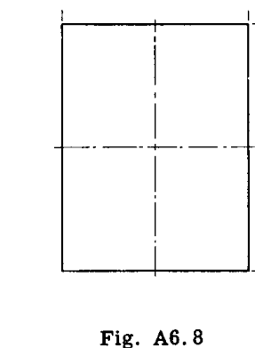

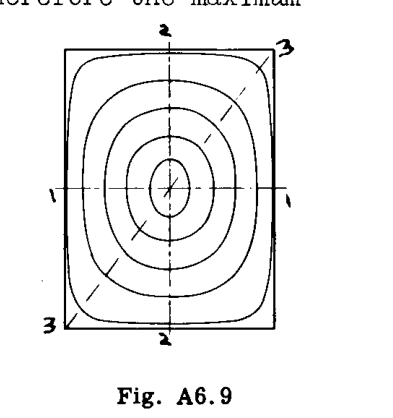

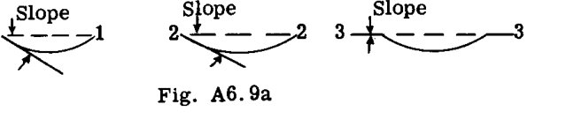

## A6.6 薄板で構成された開断面のねじり
アングル、チャンネル、ティー形状など、細長いまたは薄い長方形の要素で構成された断面を持つ部材は、航空機構造においてねじり荷重を支えるために時折使用される。
幅  $b$ 、厚さ  $t$  の長方形断面の棒について、数学的弾性解析により、単位長さあたりの最大せん断応力とねじれ角について以下の式が得られる。

$$ \tau_{MAX} = \frac{T}{\alpha b t^2} $$ --- (6)

$$ \theta = \frac{T}{\phi b t^3 G} \text{ (単位: ラジアン)} $$ --- (7)

 $\alpha$  と  $\phi$  の値は Table A6.1 に示されている。

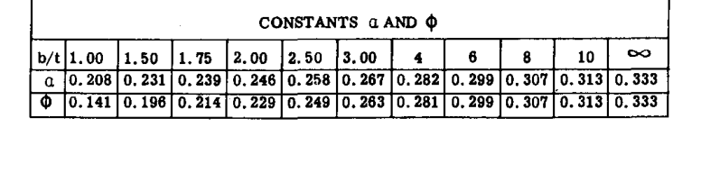

Table A6.1 から、 $b/t$  の値が大きくなると、定数の値が 1/3 に近づくことがわかる。したがって、このような細長い長方形の場合、式(6)と(7)は次のように簡略化される。

$$ \tau_{MAX} = \frac{3T}{bt^2} $$ --- (8)

$$ \theta = \frac{3T}{bt^3G} $$ --- (9)

式(8)と(9)は細長い長方形形状のために導出されたものだが、Fig. A6.10 に示すような薄い長方形部材で構成された形状の近似解析にも適用できる。フィレットやコーナーの半径が大きくなるほど、これらの接合部における応力集中は小さくなり、したがってこれらの近似式の精度は高くなる。したがって、Fig. (a) に示すような連続した板で構成される断面の場合、幅  $b$  は断面の全長としてとることができる。Fig. A6.10 のティーセクションやHセクションのような断面の場合、極慣性モーメント  $J$  は  $\sum bt^3/3$  とすることができる。したがって、Fig. A6.10 のティーセクションについては以下のようになる。

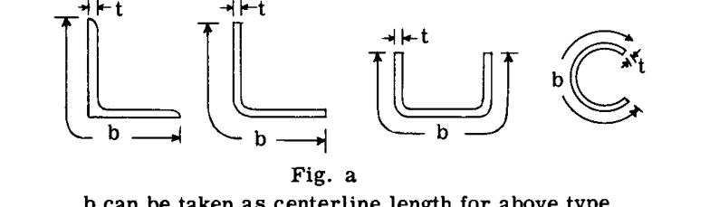

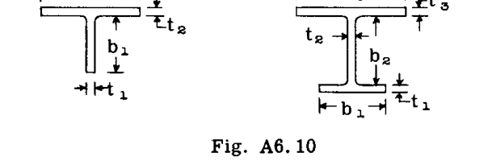

$$ \theta = \frac{T}{GJ} = \frac{3T}{G \sum bt^3} $$ 

$$ = \frac{3T}{G(b_1t_1^3 + b_2t_2^3)} $$ 

脚  $b_1$  上の最大せん断応力については、

$$ \tau_{b1} = \frac{Tt_1}{J} = \frac{3Tt_1}{\sum bt^3} = \frac{3Tt_1}{b_1t_1^3 + b_2t_2^3} $$ --- (10)

また板  $b_2$  については、

$$ \tau_{b2} = \frac{Tt_2}{J} = \frac{3Tt_2}{b_1t_1^3 + b_2t_2^3} $$ --- (11)

もし  $t_1 = t_2 = t$  ならば、

$$ \theta = \frac{3T}{Gt^3(b_1 + b_2)} $$ --- (12)

$$ \tau = \frac{3T}{t^2(b_1 + b_2)} $$ --- (13)

## 例題：閉じた薄肉チューブと開いた（またはスリット入り）チューブのねじり剛性の比較
Fig. A6.11a は壁厚 0.035 インチの 1 インチ径チューブを示し、Fig. A6.11b は同じチューブだが壁に切り込みを入れて開断面にしたものを示している。
丸棒チューブの場合、 $J_1 = 0.02474 \text{ in}^4$ 。

開いたチューブの場合、
$$ J_2 = \frac{1}{3} \times 3.14 \times .035^3 = 0.000045 $$ 

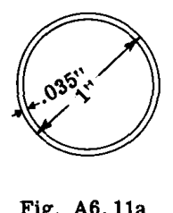

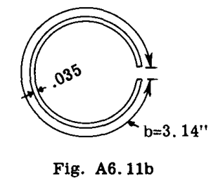

 $\theta_1$  を閉じたチューブのねじれ角、 $\theta_2$  を開いたチューブのねじれ角（等しいトルクの下で）とする。ねじれ角は  $J$  に反比例する（ $\theta = \frac{T}{JG}$  より）。

したがって、閉じたチューブは  $J_1/J_2 = 0.02474 / 0.000045 = 550$  倍、開いたチューブよりも剛性が高い。この結果は、ねじりたわみに対して開断面が効率的なねじり部材ではない理由を示している。

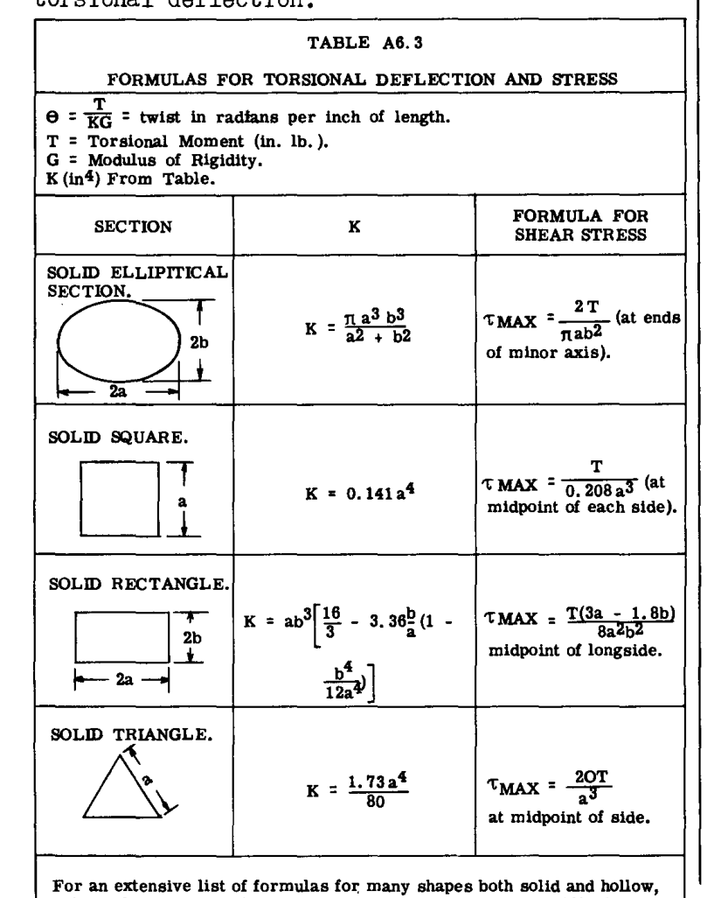

## A6.7 固体非円形形状および厚肉管状形状のねじり
Table A6.3 は、いくつかの形状についてのねじりたわみと応力の式をまとめている。これらの式は、断面が自由に反る（端部の拘束がない）という仮定に基づいている。材料は均質であり、応力は弾性範囲内にあるとする。

## A6.8 薄肉閉断面のねじり
飛行機の翼、胴体、制御面の構造は、本質的に1つまたは複数のセルを持つ薄肉チューブである。飛行荷重や着陸荷重はしばしばこれらの主要構造ユニットにねじり力を生じさせるため、そのような構造の航空機構造解析および設計において、ねじり応力と変形の決定は重要な役割を果たす。
Fig. A6.12 は、純粋なねじりモーメントを受けている薄肉円筒チューブの一部を示している。チューブには端部拘束がなく、言い換えれば、チューブの端部および断面は平面から自由に反ることができる。

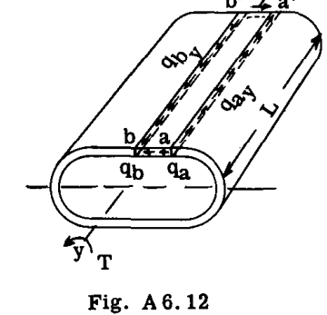

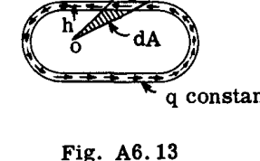

 $q_a$  を断面上の点 (a) におけるせん断力強度とし、 $q_b$  を点 (b) における強度とする。
ここで、Fig. A6.12 に示すように、チューブ壁のセグメント  $aa'bb'$  を自由体として考える。セグメントの y 軸に平行な縁に沿った適用せん断力強度は、Fig. A6.12 に示すように  $q_{ay}$  および  $q_{by}$  という値で与えられる。純粋なせん断状態にある板の場合、ある平面内の点におけるせん断応力は、最初の平面に対して直角な平面内の応力に等しい。したがって、 $q_a = q_{ay}$  および  $q_b = q_{by}$  である。
チューブの断面は自由に反ることができるため、チューブ壁には縦方向の応力は存在しない。Y方向のセグメントの平衡を考えると、
 $\sum F_y = 0 = q_a L - q_b L = 0$ 、したがって  $q_a = q_b$ 。言い換えれば、チューブ壁の周囲のせん断力強度は一定である。任意の点におけるせん断応力  $\tau = q/t$  である。壁の厚さ  $t$  が変化するとせん断応力は変化するが、せん断力  $q$  は変化しない、すなわち

$$ \tau_a t_a = \tau_b t_b = \text{定数} $$ 

積  $\tau t$  は一般に「せん断流（Shear Flow）」と呼ばれ、記号  $q$  が与えられる。せん断流という名称は、方程式  $\tau t = \text{定数}$  が流体の流れの連続方程式  $q S = \text{定数}$ （ここで  $q$  は流速、  $S$  は管の断面積）に似ていることからきている。
次に、ある点  $(O)$  の周りのチューブ断面上のせん断流  $q$  のモーメントをとる。Fig. A6.13 において、壁要素上の力  $dF$  は  $dF = q ds$  である。想定されたモーメント中心  $(O)$  からのその腕は  $h$  である。したがって、 $(O)$  の周りの  $dF$  のモーメントは  $q h ds$  である。しかし、 $ds \times h$  は Fig. A6.13 の網掛けされた三角形の面積の2倍である。
したがって、力  $dT$  の要素  $ds$  上のねじりモーメントは次のように表される。

$$ dT = q h ds = 2q dA $$ 

したがって、チューブ壁全体のせん断流に対する全トルクは以下のようになる。

$$ T = \int_A 2q dA $$ 

 $q$  は定数であるため、

$$ T = q 2A $$ --- (14)

または

$$ q = \frac{T}{2A} $$ --- (15)

ここで  $A$  はチューブ壁の中立面の囲まれた面積である。
チューブ壁の任意の点におけるせん断応力  $\tau$  は  $q$  に等しく、壁の1インチあたりのせん断力をこの1インチの長さの面積、すなわち  $1 \times t$  または単に  $t$  で割ったものである。

$$ \tau = q/t = \frac{T}{2At} $$ --- (16)

### チューブのねじれ
Fig. A6.14 に示すように、チューブ壁から切り出され自由体として扱われる小さな要素を考える。 $ds$  はチューブ断面の平面内にあり、単位長さはチューブ軸に平行である。せん断応力の下で、板要素は Fig. A6.15 に示すように変形する。すなわち、面  $a-a$  は面  $2-2$  に対して距離  $\delta$  だけ移動する。縁  $a-a$  上の力は  $q ds$  に等しく、それは距離  $\delta$  だけ移動する。

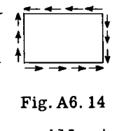

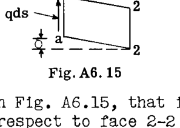

この要素に蓄えられた弾性歪みエネルギー  $dU$  は、したがって次のように表される。

$$ dU = \frac{q ds}{2} \delta $$ 

しかし、せん断歪み  $\delta$  は次のように書ける。

$$ \delta = \frac{\tau}{G} = \frac{q}{Gt} $$ (ただし  $q = \frac{T}{2A}$  であるため)

ゆえに、$$ dU = \frac{T^2}{8A^2Gt} ds $$ 

または $$ U = \oint \frac{T^2}{8A^2Gt} ds $$ 

この積分  $\oint$  はチューブの外周に沿った線積分である。第A7章のカスティリアノの定理より、

$$ \theta = \frac{\partial U}{\partial T} = \oint \frac{T}{4A^2Gt} ds $$ --- (17)

 $t$  以外のすべての値は定数であるため、式(17)は次のように書ける。

$$ \theta = \frac{T}{4A^2G} \oint \frac{ds}{t} $$ --- (18)

また  $T = 2qA$  であるため、次のようにも書ける。

$$ \theta = \frac{q}{2AG} \oint \frac{ds}{t} $$ --- (19)

ここで  $\theta$  はチューブの1インチあたりのラジアン単位のねじれ角である。チューブの長さ  $L$  に対しては、

$$ \theta = \frac{qL}{2AG} \oint \frac{ds}{t} $$ --- (20)

## A6.9 多セル閉断面における内部せん断流システムによるねじりモーメントの表現
Fig. A6.16 は、外部トルクを受けた際の2セル薄肉チューブの内部せん断流パターンを示している。 $q_1$ 、 $q_2$ 、および  $q_3$  は、セル壁の3つの異なる部分における1インチあたりのせん断荷重を表す。
内部ウェブと外壁の接合点におけるせん断力の平衡より、次のことがわかる。

$$ q_1 = q_2 + q_3 $$ --- (21)

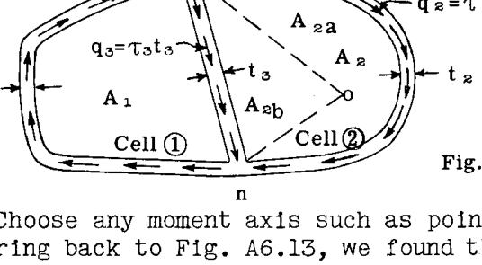

点  $(O)$  のような任意のモーメント軸を選択する。Fig. A6.13 に戻ると、点  $(O)$  の周りの壁の長さ  $ds$  に沿って作用する一定のせん断力  $q$  のモーメントは、半径によって形成される幾何学的形状の面積の2倍にせん断流  $q$  を乗じたものに等しいことがわかった。
 $T_O$  を点  $(O)$  の周りのせん断流のモーメントとする。すると Fig. A6.16 より、

$$ T_O = 2q_1(A_1 + A_{2b}) + 2q_2 A_{2a} - 2q_3 A_{2b} $$ 

$$ = 2q_1 A_1 + 2q_1 A_{2b} + 2q_2 A_{2a} - 2q_3 A_{2b} $$ --- (22)

しかし、式(21)より、 $q_3 = q_1 - q_2$  である。これを式(22)の  $q_3$  に代入すると、

$$ T_O = 2q_1 A_1 + 2q_1 A_{2b} + 2q_2 A_{2a} - 2q_1 A_{2b} + 2q_2 A_{2b} $$ 

ここで  $A_2 = A_{2a} + A_{2b}$  であるため、

$$ T_O = 2q_1 A_1 + 2q_2 A_2 $$ --- (23)

ここで  $A_1 =$  セル(1)の面積、  $A_2 =$  セル(2)の面積である。したがって、純粋なねじり応力を支える多セルチューブの内部せん断システムのモーメントは、各セルの囲まれた面積の2倍に、そのセルの外壁に存在する1インチあたりのせん断荷重を乗じたものの合計に等しい（注：ウェブ  $mn$  はいずれかのセルの内壁として参照される）。

## A6.10 多セル薄肉閉断面におけるねじりせん断応力の分布とねじれ角

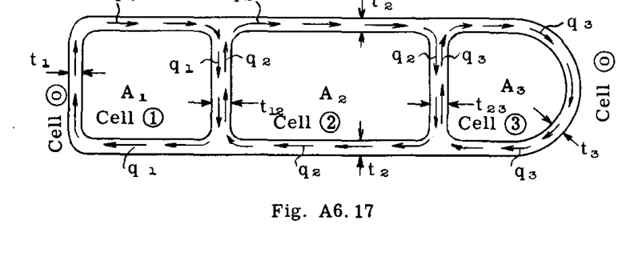

Fig. A6.17 は、チューブに加えられた純粋なトルク荷重によって生じる 3セルチューブの一般的な内部せん断流パターンを示している。セルには (1), (2), (3) の番号が振られ、チューブの外側の領域はセル (0) と指定される。したがって、セル(1)の外壁を指定するために、それをセル 1-0 の間にあるものとして参照し、セル(2)の外壁については 2-0、セル(1)と(2)の間のウェブについては 1-2 などとする。
 $q_1 =$  外壁セル(1)における1インチあたりのせん断荷重  $= 	au_1 t_1$ （ここで  $au_1$  は単位応力、  $t_1$  は壁厚）。同様に  $q_2 = 	au_2 t_2$  および  $q_3 = 	au_3 t_3$  は、それぞれセル(2)および(3)の外壁における1インチあたりのせん断荷重である。内部ウェブと外壁の接合点におけるせん断力の平衡により、ウェブ 1-2 では  $(q_1 - q_2)$  、ウェブ 2-3 では  $(q_2 - q_3)$  に等しい1インチあたりのせん断荷重が得られる。
平衡状態では、内部せん断システムのねじりモーメントは、その特定の断面におけるチューブへの外部トルクに等しくなければならない。したがって、Art. A6.9 の結論から、次のように書ける。

$$ T = 2q_1 A_1 + 2q_2 A_2 + 2q_3 A_3 $$ --- (24)

弾性的連続性のために、各セルのねじれは等しくなければならない。すなわち  $heta_1 = 	heta_2 = 	heta_3$  である。
式(19)より、セルの角度変位は次の通りである。

$$ 	heta = rac{q}{2AG} rac{ds}{t} \text{ または } 2G	heta = rac{q}{A} rac{ds}{t} $$ --- (25)

したがって、多セル構造の各セルについて、式  $rac{q}{A} rac{ds}{t}$  を記述し、一定値  $2G	heta$  に等置することができる。  $a_{10}$  をセル壁 1-0 の線積分  $rac{ds}{t}$  とし、 $a_{12}, a_{20}, a_{23}, a_{30}$  を 3セルチューブの他の外壁および内部ウェブ部分の線積分  $rac{ds}{t}$  とする。任意のセルにおける壁のせん断応力の時計回りの方向を正の符号とする。今、式(25)に代入すると、以下のようになる。

セル(1): $$ rac{1}{A_1} [q_1 a_{10} + (q_1 - q_2) a_{12}] = 2G	heta $$ --- (26)

セル(2): $$ rac{1}{A_2} [(q_2 - q_1) a_{12} + q_2 a_{20} + (q_2 - q_3) a_{23}] = 2G	heta $$ --- (27)

セル(3): $$ rac{1}{A_3} [(q_3 - q_2) a_{23} + q_3 a_{30}] = 2G	heta $$ --- (28)

式(24), (26), (27), (28) は  $q_1, q_2, q_3$  および  $heta$  の真の値を決定するのに十分である。
したがって、多セル構造におけるねじり応力分布を決定するために、各セルに対して式(25)を記述し、これらの式を一般的なトルク方程式（式(24)に類似）とともに用いることで、せん断応力とねじれ角の解のための十分な条件が得られる。

## A6.11 2セル薄肉閉断面の応力分布とねじれ角
2セルチューブの場合、式を簡略化して  $q_1, q_2$  および  $heta$  の値を直接得ることができる。3つ以上のセルを持つチューブの場合、式はあまりに複雑になるため、式を同時に解く必要がある。
2セルチューブ（Fig. A6.18）の式は以下の通りである。

$$ q_1 = rac{1}{2} rac{(a_{20} A_1 + a_{12} A) T}{a_{20} A_1^2 + a_{12} A^2 + a_{10} A_2^2} $$ --- (29)

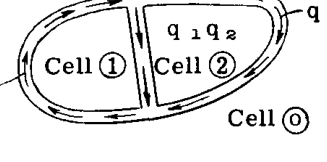

$$ q_2 = rac{1}{2} rac{(a_{10} A_2 + a_{12} A) T}{a_{20} A_1^2 + a_{12} A^2 + a_{10} A_2^2} $$ --- (30)

$$ J = 4 rac{a_{20} A_1^2 + a_{12} A^2 + a_{10} A_2^2}{a_{10} a_{12} + a_{12} a_{20} + a_{20} a_{10}} $$ --- (31)

$$ 	heta = rac{T}{GJ} $$ --- (32)

ここで  $A = A_1 + A_2$  である。

## A6.12 多セル薄肉チューブにおけるねじり応力の例題
**例題 1 - 非対称2セルチューブのねじり応力**
Fig. A6.19 は、従来の翼形状によって形成され、1つの内部ウェブを持つ典型的な2セル管状断面を示している。示されているように作用する 83450 in. lb. の外部印加トルク  $T$  を想定する。内部せん断抵抗パターンが求められている。

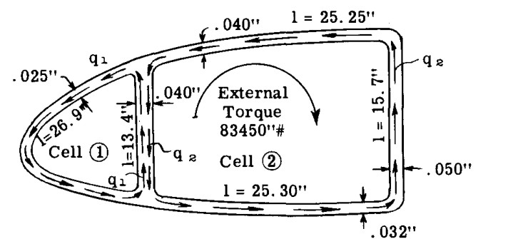

**セル定数の計算**
セル面積：
 $A_1 = 105.8 \text{ sq. in.}$  
 $A_2 = 387.4 \text{ sq. in.}$  
 $A = 493.2 \text{ sq. in.}$  

線積分  $a = rac{ds}{t}$  ：
 $a_{10} = rac{26.9}{.025} = 1075$  
 $a_{12} = rac{13.4}{.04} = 335$  
 $a_{20} = rac{25.25}{.04} + rac{15.7}{.05} + rac{25.3}{.032} = 1735$  

各セルの角度変位を等置することによる解。
一般式  $2G	heta = rac{q}{A} rac{ds}{t}$ 。  $q$  の時計回りの流れを正とする。

セル 1 を一般式に代入：
$$ 2G	heta = rac{1}{105.8} [-q_1 	imes 1075 + (-q_1 + q_2) 335] = -13.33 q_1 + 3.165 q_2 $$ --- (33)

セル 2 について：
$$ 2G	heta = rac{1}{387.4} [-(q_2 - q_1) 335 - 1735 q_2] = .865 q_1 - 5.34 q_2 $$ --- (34)

式(33)と(34)を等置すると、
 $-14.195 q_1 + 8.505 q_2 = 0$  --- (35)

外部および内部抵抗トルクの合計はゼロでなければならない。
 $83450 - 2 	imes 105.8 q_1 - 2 	imes 387.4 q_2 = 0$  --- (36)

式(35)と(36)を解くと、 $q_1 = 55.6 \text{ lb/in.}$ 、 $q_2 = 92.5 \text{ lb/in.}$ 。結果が正で出たため、想定された反時計回りの方向は  $q_1$  および  $q_2$  に対して正しかった、すなわち真の符号は  $q_1 = -55.6$  および  $q_2 = -92.5$  である。
 $q_{12} = -55.6 + 92.5 = 36.9 \text{ lb/in.}$ （セル 1 から見た場合）。
Fig. A6.20 は得られたせん断パターンを示している。

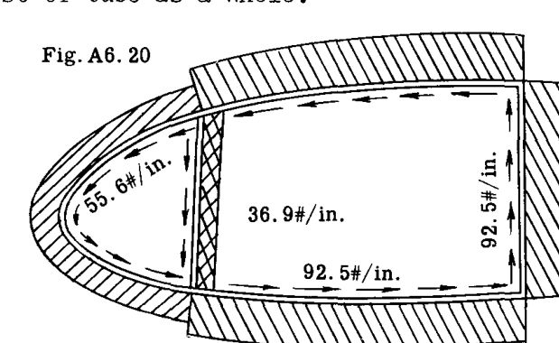

## A6.13 例題 3 - 3セルチューブ
Fig. A6.22 は、3つのセルで構成された薄肉管状断面を示している。示されているように 100,000 lbs の外部トルクに抵抗する内部せん断流パターンが決定される。

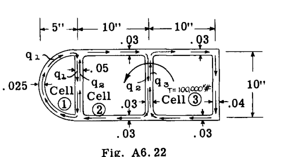

**解法:**
セル定数の計算
セル面積：
 $A_1 = 39.3 \text{ sq. in.}$  
 $A_2 = 100 \text{ sq. in.}$  
 $A_3 = 100 \text{ sq. in.}$  

線積分  $a = rac{ds}{t}$  ：
 $a_{10} = rac{\pi 	imes 10}{2 	imes .025} = 629$  
 $a_{12} = rac{10}{.05} = 200$  
 $a_{20} = rac{20}{.03} = 667$  
 $a_{23} = rac{10}{.03} = 333$  
 $a_{30} = rac{20}{.03} + rac{10}{.04} = 917$  

外部トルクを内部抵抗トルクと等置する：
 $2q_1 A_1 + 2q_2 A_2 + 2q_3 A_3 + T = 0$  

代入すると：
 $78.6 q_1 + 200 q_2 + 200 q_3 - 100,000 = 0$  --- (37)

各セルの角度変位の式を記述する：
セル (1)
 $2G	heta = rac{1}{A_1} [q_1 a_{10} + (q_1 - q_2) a_{12}]$  

代入すると：
 $2G	heta = rac{1}{39.3} [629 q_1 + 200 q_1 - 200 q_2]$  --- (38)

セル (2)
 $2G	heta = rac{1}{A_2} [(q_2 - q_1) a_{12} + q_2 a_{20} + (q_2 - q_3) a_{23}]$  

代入すると：
 $2G	heta = rac{1}{100} [200 q_2 - 200 q_1 + 667 q_2 + 333 q_2 - 333 q_3]$  --- (39)

セル (3)
 $2G	heta = rac{1}{A_3} [(q_3 - q_2) a_{23} + q_3 a_{30}]$  

代入すると：
 $2G	heta = rac{1}{100} [333 q_3 - 333 q_2 + 917 q_3]$  --- (40)

式(37)から(40)を解くと、以下の結果が得られる。
 $q_1 = 143.4 \text{ lb/in.}$  
 $q_2 = 234.1 \text{ lb/in.}$  
 $q_3 = 208.8 \text{ lb/in.}$  
 $q_2 - q_1 = 90.7 \text{ lb/in.}$  
 $q_2 - q_3 = 25.3 \text{ lb/in.}$  

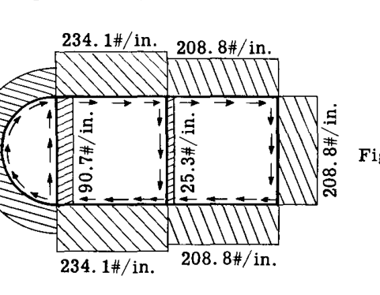

Fig. A6.23 は得られた内部せん断流パターンを示している。

## A6.14 逐次補正式による多セルビームのねじりせん断流
特に高速飛行機における飛行機主翼構造設計の傾向は、Fig. A6.24 に示されるように、比較的多数のセルで構成される主翼断面のような多セル配置に向かっている。
各セルに対して1つの未知のせん断流  $q$  がある場合、前述の方程式による解法は非常に骨が折れるものになる。
逐次補正式は、純粋なねじり下での多セル内のせん断流を見つけるための、シンプルで迅速な方法を提供する。

**逐次補正式の解説**
Fig. a に示すような2セルチューブを考える。
a. 最初に、各セルが独立して作用していると想定し、各セル (1) にせん断流  $q_1$  を与えて  $2G	heta_1 = 1$  となるようにする。式(19)より、次のように書ける。
 $2G	heta = rac{q}{A} rac{ds}{t}$  

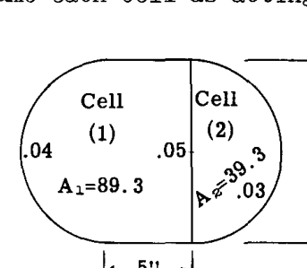

今、 $2G	heta = 1$  と想定すると、
$$ q = rac{2A}{rac{ds}{t}} $$ 

実際上、すべてのセル状航空機ビームは各特定のユニットに対して一定の厚さの壁およびウェブパネルを持っているため、項  $rac{ds}{t}$  は簡略化のために  $\sum \frac{L}{t}$  と記述される。ここで  $L$  は壁またはウェブパネルの長さ、 $t$  はその厚さである。したがって、次のように書くことができる。

$$ q = rac{2A}{\sum_{cell} \frac{L}{t}} $$ --- (41)

したがって、Fig. a のセル (1) に対して  $2G	heta_1 = 1$  と想定すると、式(41)より次のように書ける。

$$ q_1 = rac{2A_1}{\sum \frac{L}{t}} = rac{2 \times 89.3}{\frac{25.7}{.04} + rac{10}{.05}} = rac{178.6}{842} = 0.212 \text{ lb./in.} $$ 

同様に、セル (2) にせん断流  $q_2$  を与えて  $2G	heta_2 = 1$  となるように想定すると、

$$ q_2 = rac{2A_2}{\sum \frac{L}{t}} = rac{2 \times 39.3}{rac{10}{.05} + rac{15.7}{.03}} = rac{78.6}{723} = 0.109 \text{ lb./in.} $$ 

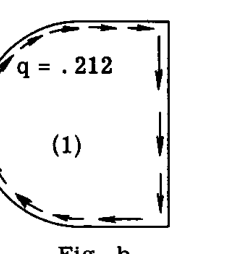 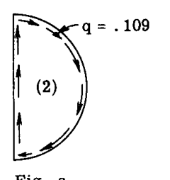

次に、2つのセルが内部ウェブ (1-2) を共通部分として結合されていると想定する。Fig. d を参照。内部ウェブは、セル(1)からの  $q_1 = 0.212$  とセル(2)からの  $q_2 = 0.109$  の合成せん断流を受ける。すなわち  $q_1 - q_2 = .212 - .109 = .103 \text{ lb/in.}$  である。明らかに、内部ウェブ上のせん断流のこの変化は、セルが独立して作用していたときと同じではなく、各セルのセルねじれを異ならせる原因となる。

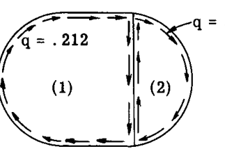

セル(1)について、 $2G	heta_1$  を計算すると：

$$ 2G	heta_1 = rac{1}{2A_1} \sum q rac{L}{t} = rac{1}{2 \times 89.3} [0.212 \times rac{25.7}{.04} + (.212 - .109) rac{10}{.05}] = 0.875 $$ 

セル(2)について：

$$ 2G	heta_2 = rac{1}{2A_2} \sum q rac{L}{t} = rac{1}{2 \times 39.3} [0.109 \times rac{15.7}{.03} - (.212 - .109) rac{10}{.05}] = 0.466 $$ 

断面が元の形状から歪まないためには、 $\theta_1$  は  $\theta_2$  に等しくなければならないため、上記のせん断流は、2つのセルがユニットとして結合して作用する場合には真のものではないことが明らかである。

## A6.15 逐次補正による解法を整理するための演算テーブルの使用
演算テーブル 1 は、補正せん断流を扱うステップを最小限の思考で迅速に実行できるように整理するものである。

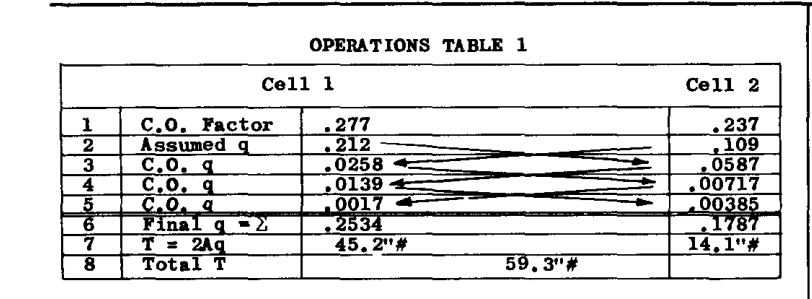

演算テーブル 1 の解説：
1行目は、前述の通り各セルのキャリーオーバー係数を与える。2行目は、各セルが独立して作用し、単位ねじれ角を受けると想定したときの、各セルに必要な一定のせん断流  $q$  を与える。
3行目は、各セルに追加する最初の一定の補正せん断流のセットを与える。

**例題 1 (2セル)**
Fig. A6.25 の 2セルチューブが 20,000 in. lbs. のトルクを受けたときの内部せん断流システムを求めよ。

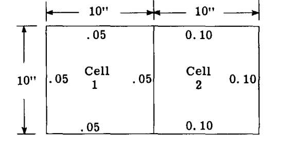

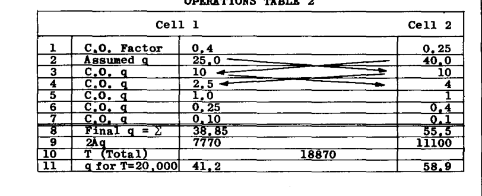

## A6.16 閉じた形式の補強材を持つ薄肉円筒のねじり
飛行機の薄肉構造は、通常、Fig. A6.28 および A6.29 に示されるように、外壁の周りに配置された縦方向の補強材（ストリンガー）を含んでいる。

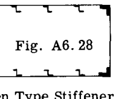 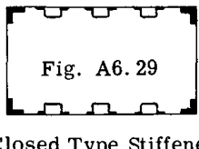

Fig. A6.28 に示されるような開断面タイプの補強材の場合、薄肉セルと比較した個々の補強材のねじり剛性は非常に小さいため無視できる。しかし、閉断面タイプの補強材は本質的に小型のチューブであり、その剛性は同サイズの開断面よりもはるかに大きい。したがって、外壁に取り付けられた閉断面タイプの補強材を持つセルは、各補強材が周囲のセルと共通の壁を持つセルとして機能する多セル構造として扱うことができる。

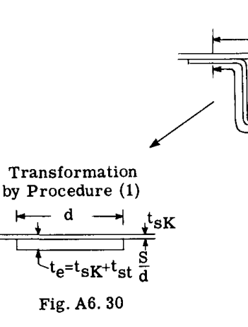 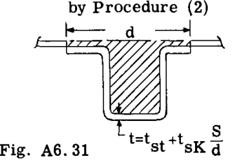

## A6.17 部材の端部拘束がねじりに与える影響
本章の前の部分で導出された式は、ねじり部材の長さ全体の断面が平面から自由に反ることができ、したがって断面に垂直な応力が存在しないことを前提としていた。実際の構造では、この自由な反りに対する拘束がしばしば存在する。たとえば、飛行機の片持ち翼は、かなり剛性のある胴体構造への取り付け部において、翼と胴体の結合点での反りが拘束されている。

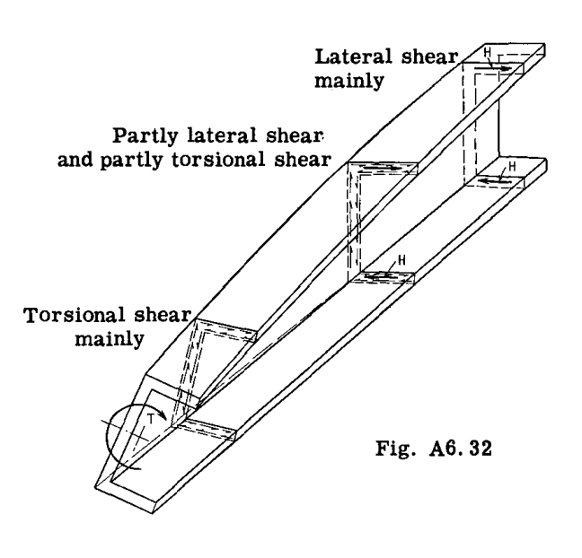

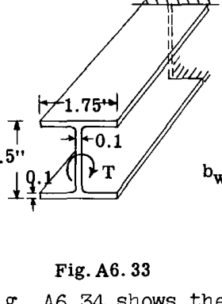 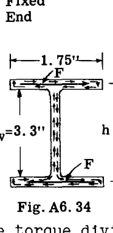 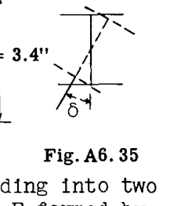

## A6.19 問題

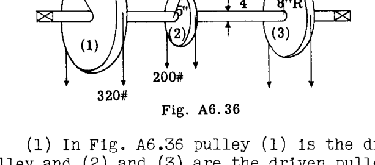

(1) Fig. A6.36 において、プーリー (1) は駆動プーリー、 (2) と (3) は従動プーリーである。シャフトは一定速度で回転する。プーリーの両側のベルト張力の差が図に示されている。プーリー (1) と (2) の間、および (2) と (3) の間の  $1 \frac{3}{4}$  インチシャフト内の最大ねじりせん断応力を計算せよ。

(2) 1000 RPM で動作する 1/2 HP モーターが、主翼フラップを操作するためのギア機構を駆動する長さ 30 インチの  $3/4 - .035$  アルミニウム合金トルクチューブを回転させる。全馬力および回転数におけるトルクシャフト内の最大ねじり応力を求めよ。30 インチの長さにおけるシャフトの角度変位を求めよ。チューブの極慣性モーメント  $= 0.01 \text{ in}^4$ 、剛性率  $G = 3,800,000 \text{ psi}$  とする。

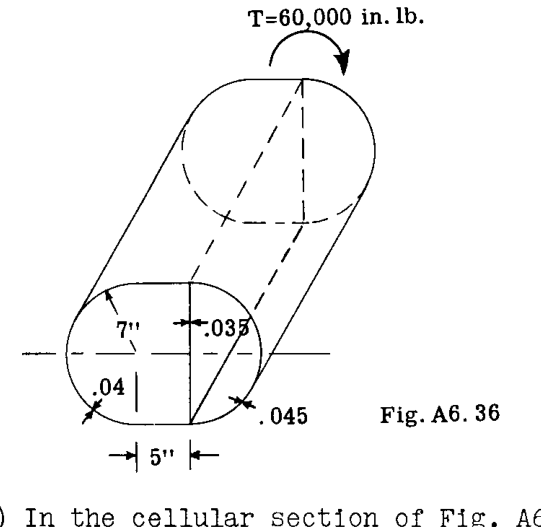

(3) Fig. A6.36 のセル断面において、60,000 in. lb. の外部トルクに抵抗する内部せん断流を決定せよ。壁厚は図に示されている。チューブの長さは 100 インチとし、ねじりたわみを求めよ。材料はアルミニウム合金（ $G = 3,800,000 \text{ psi}$ ）とする。

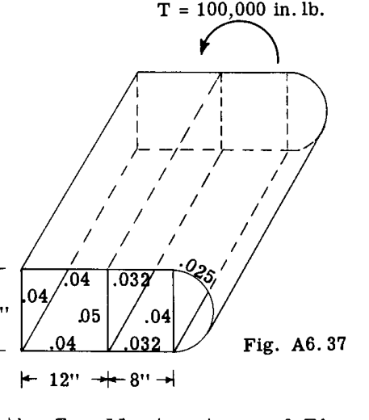

(5) Fig. A6.37 の 3セル構造において、100,000 in. lb. の外部トルクによる内部抵抗せん断流を決定せよ。長さ 100 インチに対して、 $G$  が 3,800,000 psi と想定される場合のセル構造のねじれを計算せよ。

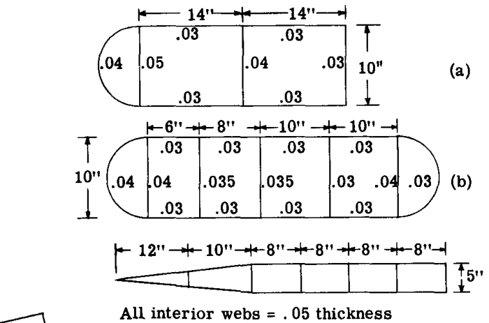

(8) Fig. A6.38 の各セル構造が 120,000 in. lbs. のねじりモーメントを受ける。逐次補正法を用いて、抵抗せん断流パターンを計算せよ。

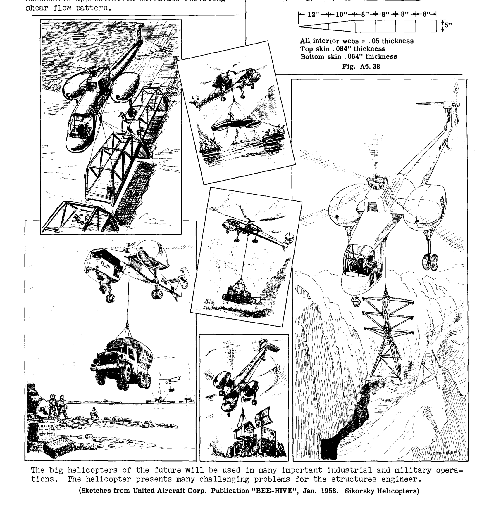

将来の大型ヘリコプターは、多くの重要な産業および軍事作戦で使用されるだろう。ヘリコプターは、構造エンジニアに多くの挑戦的な課題を提示している。
（1958年1月、ユナイテッド・エアクラフト社出版物「BEE-HIVE」より、シコルスキー・ヘリコプターのスケッチ）"}