# 第A6章
# ねじり - 応力とたわみ

### A6.1 はじめに
ねじりが関わる問題は航空機の構造において一般的である。金属で覆われた航空機の主翼や胴体は基本的に薄肉の管状構造であり、特定の飛行条件や着陸条件において大きなねじりモーメントを受ける。航空機内の様々な機械的制御システムは、動作条件下でねじり力を受ける様々な断面形状のユニットを含むことが多いため、航空機の構造設計において部材のねじり応力と歪みの知識が必要不可欠である。

### A6.2 円形断面部材のねじり
ねじり応力と歪みの式を導き出す際に、以下の条件が想定される：

(1) 部材は円形、中実、または中空の丸いシリンダーである。
(2) トルクを加えた後も、断面は円形のままである。
(3) 断面がねじれた後も、直径は直線のままである。
(4) 材料は均質、等方性、かつ弾性体である。
(5) 加えられる荷重は、シャフトまたはシリンダーの軸に垂直な平面内にある。

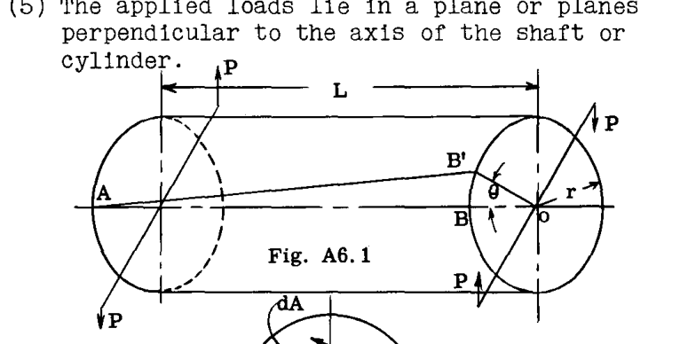

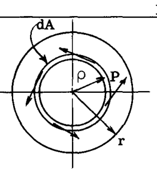

Fig. A6.1は、2つの等しく反対方向のねじり偶力を受ける真っ直ぐな円柱状のバーを示している。バーはねじれ、各断面はせん断応力を受ける。左端をバーの残りの部分に対して固定されていると仮定すると、表面上の線  $AB$  はこれらのせん断応力の下で  $AB'$  へ移動し、任意の断面におけるこの回転は固定端からの距離に比例する。中心からの任意の放射状の線は角度変位のみを受ける、すなわち  $OB$  は  $OB'$  に移動しても直線のままであると仮定される。

距離  $L$  における単位せん断ひずみは、次のように表される。

$$ 
\varepsilon = \frac{BB'}{AB} = \frac{r \theta}{L} 
$$ 

材料の剛性率を  $G$  とし、断面の外縁における単位せん断応力を  $\tau$  とすると、次式が成り立つ。

$$ 
\tau = \varepsilon G = \frac{r \theta G}{L} \quad \text{--- (1)} 
$$ 

Fig. A6.2において、中心  $O$  から距離  $\rho$  の位置にある円環状の帯  $dA$  における単位せん断応力を  $\tau_{\rho}$  とする。このとき、

$$ 
\tau_{\rho} = \frac{\rho}{r} \tau = \frac{\rho}{r} \frac{r \theta G}{L} = \frac{\rho \theta G}{L} 
$$ 

バーの軸である中心  $O$  の周りの、円環帯  $dA$  上のせん断応力のモーメントは、次のように表される。

$$ 
dM = \tau_{\rho} \rho dA = \frac{\rho^{2} \theta G dA}{L} 
$$ 

したがって、全内部ねじり抵抗モーメントは次のようになる。

$$ 
M_{int.} = \int \frac{G \theta \rho^{2} dA}{L} 
$$ 

平衡状態では、内部抵抗モーメントは外部ねじりモーメント  $T$  に等しく、 $\frac{G \theta}{L}$  は定数であるため、次のように書ける。

$$ 
T = M_{int.} = \frac{G \theta}{L} \int \rho^{2} dA = \frac{G \theta J}{L} \quad \text{--- (2)} 
$$ 

ここで、 $J$  はシャフト断面の極慣性モーメントであり、直径に関する慣性モーメントの2倍に相当する。

式(1)より、 $\frac{G \theta}{L} = \frac{\tau}{r}$  である。

よって、

$$ 
T = \frac{\tau J}{r} \quad \text{--- (3)} 
$$ 

または

$$ 
\tau = \frac{Tr}{J} \quad \text{--- (4)} 
$$ 

また、式(2)より、ねじれ角  $\theta$  について解くと、

$$ 
\theta = \frac{TL}{GJ} \quad \text{--- (5)} 
$$ 

（  $\theta$  はラジアン単位）

### A6.3 円筒シャフトによる動力の伝達
ねじり偶力  $T$  が角度変位を生じさせる際になされる仕事は、偶力の大きさとラジアン単位の角度変位の積に等しい。角度変位が1回転の場合、なされる仕事は  $2 \pi T$  に等しい。  $T$  がインチ・ポンドで表され、  $N$  が毎分回転数（rpm）である場合、回転シャフトによって伝達される馬力は次のように書ける。

$$ 
H.P. = \frac{2 \pi N T}{396000} \quad \text{--- (6)} 
$$ 

ここで、396000は1分間に1馬力がなすインチ・ポンド単位の仕事を表す。式(6)は次のように書き換えることができる。

$$ 
T = \frac{H.P. \times 396000}{2 \pi N} = \frac{63025 H.P.}{N} \quad \text{--- (7)} 
$$ 

### 例題

**例題 1.**
Fig. A6.3は、一般的な操縦桿・トルクチューブ操作ユニットを示している。操縦桿のグリップに150 lbsの横方向荷重が加わった場合、補助翼トルクチューブのせん断応力と点A・B間のねじれ角を求めよ。

**解法:**
操縦桿に加わる150 lbsの力によるチューブABのねじりモーメントは、
 $150 \times 26 = 3900$  in. lb. である。このトルクに対する抵抗は、補助翼ホーンに取り付けられた補助翼操作システムによって提供され、ホーンの牽引力は  $3900 / 11 = 356$  lb. に等しい。

 $1\frac{1}{2} - 0.058$  丸型チューブの極慣性モーメントは  $0.1368 \text{ in}^{4}$  である。

最大せん断応力  $\tau = \frac{Tr}{J} = (3900 \times 0.75) / 0.1368 = 21400 \text{ psi}$  。

点AとBの間のチューブの角度変位は次のように計算される。

$$ 
\theta = \frac{TL}{GJ} = \frac{3900 \times 28}{3,800,000 \times 0.1368} = 0.21 \text{ radians} 
$$ 

すなわち12度である。

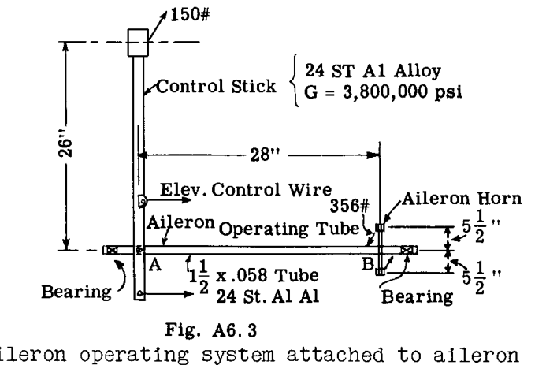

**例題 2.**
Fig. A6.4は、3つのヒンジブラケットで支持され、中央の支持ブラケットの上にトルクチューブに取り付けられたコントロールロッド金具を備えた、円形トルクチューブ（サイズ  $1\text{-}1/4 - .049 \text{ in}$ ）で構成される補助翼制御面を示している。補助翼上の空気荷重がFig. A6.4に示す通りである場合のチューブ内の最大ねじりせん断応力を求め、またホーン部分と補助翼端の間のチューブのねじれ角を計算せよ。

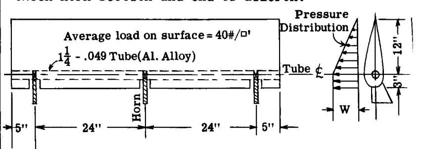

**解法:**
表面の空気荷重は補助翼をトルクチューブの周りに回転させようとするが、中央の支持ブラケット上のトルクチューブに取り付けられたコントロールロッドによって動きが阻止または生成される。

幅1インチの補助翼ストリップ上の全荷重  $= 40(15 \times 1/144) = 4.16 \text{ lb.}$  となる。
 $w$  を補助翼表面の前縁における補助翼スパン1インチあたりの荷重強度とする（Fig. A6.4の圧力線図を参照）。

このとき、  $3w + (0.5 w) 12 = 4.16$  、よって  $w = 0.463 \text{ lb./in.}$  である。

トルクチューブ中心線より前方の全荷重  $P_{1} = 0.463 \times 3 = 1.389 \text{ lb.}$  およびヒンジ線より後方の補助翼部分の荷重  $P_{2} = 0.463 \times 0.5 \times 12 = 2.778 \text{ lb.}$  である。

トルクチューブの走行1インチあたりのねじりモーメント：
 $= -1.389 \times 1.5 + 2.778 \times 4 = 9.0 \text{ in. lb.}$  である。したがって、補助翼の中央で発生する最大トルクは、  $9.0 \times 29 = 261 \text{ in. lb.}$  に等しい。

$$ 
\tau (max.) = \frac{Tr}{J} = \frac{261 \times 0.625}{0.06678} = 2450 \text{ psi} 
$$ 

( $J = 0.06678 \text{ in}^{4}$ ) 

チューブの断面が一定であり、トルクが補助翼の端からの距離に正比例して変化するため、ねじれ角  $\theta$  は、ホーンの一方の側、すなわち  $L = 29"$  の距離にあるチューブの全長に作用する平均トルクを使用して計算できる。

$$ 
\theta = \frac{TL}{GJ} = \frac{261 \times 29}{2 \times 3800000 \times 0.06678} = 57.3 = 0.86 \text{ degrees} 
$$ 

### A6.4 非円形断面部材のねじり
A6.2節で導出された公式は、前提条件が成り立たないため、非円形形状には使用できない。中実の円形シャフトが純ねじりを受ける場合、せん断応力分布はFig. A6.5に示すようになる。すなわち、最大せん断応力はバーの中心軸から最も遠い位置にあり、その点への半径に対して垂直である。回転軸からの特定の距離において、せん断応力はFig. A6.5に示されるように両方向で一定であり、これはバーがねじれてもバーの端部のセグメントは互いに平行なままであること、換言すれば、バーがねじれても断面が平面から外れて歪む（反る）ことはないことを意味している。

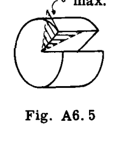

Fig. A6.5の条件をFig. A6.6の矩形バーに適用すると、最も応力を受ける箇所は角（コーナー）になり、応力は図示のように向けられる。その場合、応力は表面に沿う成分だけでなく表面に垂直な成分も持つことになるが、これは正しくない。弾性理論によれば、最大せん断応力はFig. A6.6に示されるように長辺の中心線で発生し、角での応力はゼロであることが示されている。したがって、矩形バーがねじれるとき、せん断応力は回転軸から同じ距離であっても一定ではなく、したがってバーを貫くセグメントの端部はバーがねじれるときに互いに平行なままではなく、すなわち、断面の平面外への歪み、つまり「反り（Warping）」が発生する。Fig. A6.7は、ねじれた矩形バーにおけるこの作用を示している。バーの端部は、元の歪みのない平面に対して垂直方向に反り、または歪みを受ける。

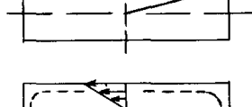 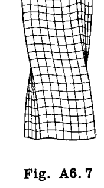

非円形断面のせん断応力およびねじれを決定するためのさらなる議論と公式の要約は、A6.6節で提供される。

### A6.5 弾性膜相似（メンブレン・アナロジー）
ねじりにおける非円形断面の反った断面の形状は弾性理論による解析で必要とされるが、結果として、理論的アプローチで解決されているのは長方形、楕円、三角形などの少数の形状のみである。しかし、膜相似法を用いることで、ほぼあらゆる形状の断面に対して実験的に密接な近似を行うことができる。

プランドルは、バーのねじりの方程式と、均一な圧力を受ける膜のたわみの方程式が同じ形式を持つことを指摘した。したがって、検討対象のバーの断面と同じ形状の開口部の上に弾性膜を張り、膜の両側にわずかな圧力差を与えて膜をたわませると、その結果得られる膜のたわんだ形状は、理論式で使用できる特定の測定量を提供する。しかし、膜相似理論の主な利点は、おそらく、ねじりを受けるバーの複雑な断面全体にわたって応力状態がどのように変化するかを、かなりの精度で視覚化する方法を提供することにある。

膜相似法は、たわんだ膜とねじられたバーの間に以下の関係を提供する：

(1) 膜上の等たわみ線（等高線）は、ねじられたバーのせん断応力線に対応する。
(2) 膜表面の任意の点における等高線への接線は、ねじられたバーの断面の対応する点における合成せん断応力の方向を与える。
(3) 端部支持平面に対する膜表面の任意の点における最大勾配は、ねじられたバーの断面の対応する点におけるせん断応力の大きさに等しい。
(4) ねじられたバーに加えられるトルクは、たわんだ膜と支持端部を通る平面の間の体積の2倍に比例する。

例として、Fig. A6.8に示すような長方形断面のバーを考える。同じ形状の開口部の上に薄い膜を張り、小さな均一な圧力によって断面に垂直にたわませる。このたわんだ膜の等たわみ等高線は、Fig. A6.9に示すような形状になる。ねじれたバーのせん断応力の方向に対応するこれらの等高線は、バーの中央付近ではほぼ円形であるが、バーの境界に近づくにつれて境界の形状に近づく傾向がある。

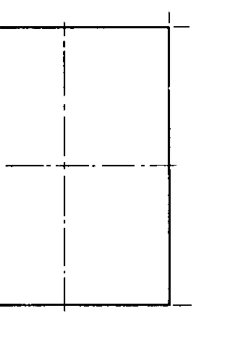 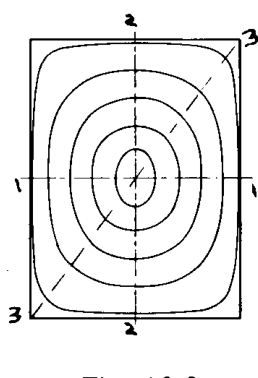

Fig. A6.9aは、Fig. A6.9の線1-1、2-2、および3-3に沿った等高線、すなわちたわんだ膜の断面を示している。線1-1に沿ったたわんだ表面の勾配が、線2-2または3-3に沿った勾配よりも大きくなることは明らかである。このことから、線1-1上の任意の点におけるせん断応力は、線2-2および3-3上の対応する点におけるせん断応力よりも大きくなると結論づけることができる。最大勾配、したがって最大せん断応力は、線1-1の両端で発生する。たわんだ膜の勾配は、膜の中心および4つの角でゼロになり、したがってこれらの点でのせん断応力はゼロになる。

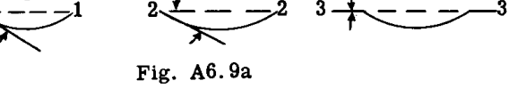

### A6.6 薄板で構成される開断面のねじり
アングル、チャンネル、ティーなどのねじり荷重を支えるために、細長い長方形要素で構成された断面を持つ部材が航空機構造で時折使用される。

幅  $b$  および厚さ  $t$  の長方形断面のバーについて、数学的な弾性解析により、最大せん断応力および単位長さあたりのねじれ角に関する以下の式が得られる。

$$ 
\tau_{MAX} = \frac{T}{\alpha b t^{2}} \quad \text{--- (6)} 
$$ 

$$ 
\theta = \frac{T}{\phi b t^{3} G} \quad \text{--- (7)} 
$$ 

（  $\theta$  はラジアン単位）

 $\alpha$  および  $\phi$  の値は、Table A6.1に示されている。

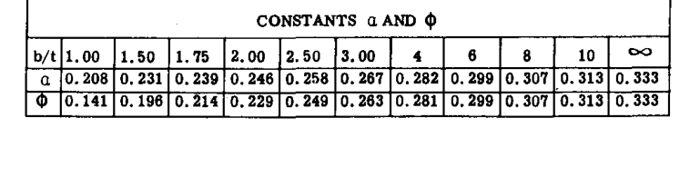

Table A6.1から、  $b/t$  の値が大きくなると、定数の値は  $1/3$  に近づくことがわかる。したがって、このような細長い長方形の場合、式(6)および(7)は次のように簡略化される。

$$ 
\tau_{MAX} = \frac{3T}{bt^{2}} \quad \text{--- (8)} 
$$ 

$$ 
\theta = \frac{3T}{bt^{3}G} \quad \text{--- (9)} 
$$ 

式(8)および(9)は細長い長方形形状のために導出されたものであるが、Fig. A6.10に示されるような薄い長方形部材で構成される形状の近似解析に適用することができる。フィレットまたはコーナーの半径が大きくなるほど、これらの接合部での応力集中は小さくなり、したがって、これらの近似式の精度は高くなる。したがって、Fig. A6.10に示されるような連続したプレートで構成される断面の場合、幅  $b$  は断面の全長として取ることができる。Fig. A6.10のティー断面やH断面のような断面の場合、極慣性モーメント  $J$  は  $\sum bt^{3}/3$  として取ることができる。したがって、Fig. A6.10のティー断面については：

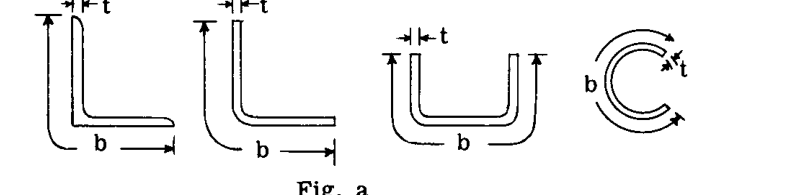

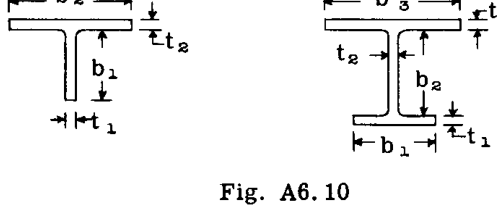

$$ 
\theta = \frac{T}{GJ} = \frac{3T}{G \sum bt^{3}} 
$$ 

$$ 
= \frac{3T}{G(b_{1}t_{1}^{3} + b_{2}t_{2}^{3})} 
$$ 

脚  $b_{1}$  における最大せん断応力については、

$$ 
\tau_{b1} = \frac{T t_{1}}{J} = \frac{3 T t_{1}}{\sum bt^{3}} = \frac{3 T t_{1}}{b_{1}t_{1}^{3} + b_{2}t_{2}^{3}} \quad \text{--- (10)} 
$$ 

また、プレート  $b_{2}$  については、

$$ 
\tau_{b2} = \frac{T t_{2}}{J} = \frac{3 T t_{2}}{b_{1}t_{1}^{3} + b_{2}t_{2}^{3}} \quad \text{--- (11)} 
$$ 

もし  $t_{1} = t_{2} = t$  ならば、

$$ 
\theta = \frac{3 T}{G t^{3}(b_{1} + b_{2})} \quad \text{--- (12)} 
$$ 

$$ 
\tau = \frac{3 T}{t^{2}(b_{1} + b_{2})} \quad \text{--- (13)} 
$$ 

### 閉口薄肉管と比較したねじり剛性を示す例題

**開口管またはスリット入り管について:**

Fig. A6.11aは壁厚 .035 インチの直径1インチのチューブを示しており、Fig. A6.11bは同じチューブであるが壁に切り込みを入れて開断面にしたものを示している。

丸型チューブの場合、  $J_{1} = 0.02474 \text{ in}^{4}$  である。

開口チューブの場合、 
$$ J_{2} = \frac{1}{3} \times 3.14 \times .035^{3} = 0.000045 $$

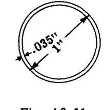 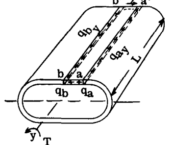

 $\theta_{1}$  を閉口チューブのねじれ角、  $\theta_{2}$  を開口チューブの等しいねじれ角とする。  $\theta = \frac{T}{JG}$  であるため、ねじれは  $J$  に反比例する。したがって、閉口チューブは開口チューブに比べて  $J_{1}/J_{2} = 0.02474 / 0.000045 = 550$  倍剛性が高い。この結果は、ねじり変形に対して開断面がなぜ効率的なねじり部材ではないかを示している。

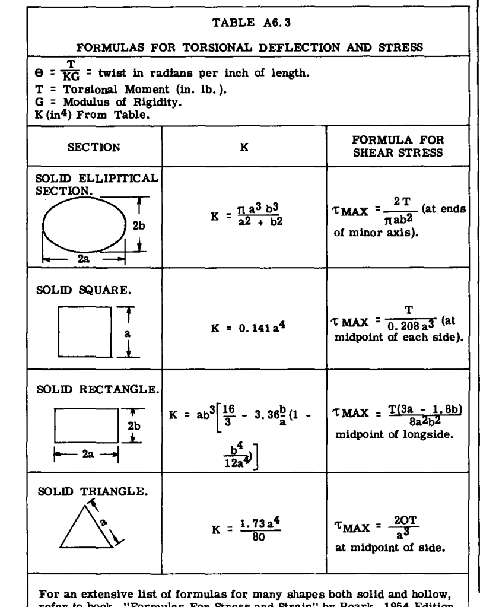

### A6.7 中実非円形形状および厚肉管状形状のねじり
Table A6.3は、いくつかの形状についてのねじりたわみと応力の公式をまとめたものである。これらの公式は、断面が自由に反ることができる（端部の拘束がない）という仮定に基づいている。材料は均質であり、応力は弾性範囲内にあるものとする。

### A6.8 薄肉閉断面のねじり
航空機の翼、胴体、操縦面の構造は、本質的に1つ以上のセルを持つ薄肉チューブである。飛行や着陸の荷重は、これらの主要な構造ユニットにねじり力を生じさせることが多いため、航空機の構造解析および設計において、そのような構造のねじり応力と変形を決定することは重要な役割を果たす。

Fig. A6.12は、純ねじりモーメントを受けている薄肉円筒チューブの一部を示している。チューブには端部拘束がなく、換言すれば、チューブの端部および断面は自由に平面外に反ることができる。

 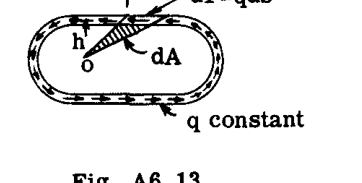

断面上の点  $(a)$  におけるせん断力強度を  $q_{a}$ 、点  $(b)$  におけるせん断力強度を  $q_{b}$  とする。
ここで、Fig. A6.12に示すように、チューブ壁のセグメント  $aa'b'b$  を自由体として考える。セグメントの端部において  $y$  軸に平行に作用するせん断力強度は、Fig. A6.12に示されるように  $q_{ay}$  および  $q_{by}$  という値を持つ。純せん断状態にあるプレートにおいて、一方の平面内のある点におけるせん断応力は、最初の平面に対して直角な平面内の応力に等しいため、  $q_{a} = q_{ay}$  および  $q_{b} = q_{by}$  となる。

チューブ断面は自由に反ることができるため、チューブ壁に縦方向の応力は生じない。  $Y$  方向のセグメントの平衡を考えると、

$$ 
\sum F_{y} = 0 = q_{ay} L - q_{by} L = 0 
$$ 

したがって、  $q_{ay} = q_{by}$  であり、ゆえに  $q_{a} = q_{b}$  となる。換言すれば、チューブ壁周辺のせん断力強度は一定である。任意の点におけるせん断応力  $\tau = q/t$  である。もし壁厚  $t$  が変化すればせん断応力  $\tau$  も変化するが、せん断力  $q$  は変化しない。すなわち、

$$ 
\tau_{a} t_{a} = \tau_{b} t_{b} = \text{定数} 
$$ 

積  $\tau t$  は一般に「せん断流（Shear Flow）」と呼ばれ、記号  $q$  が与えられる。「せん断流」という名称は、おそらく方程式  $\tau t = \text{定数}$  が、流体の流れの連続の方程式  $qS = \text{定数}$  （ここで  $q$  は流速、  $S$  は管の断面積）に似ていることから名付けられたのであろう。

次に、チューブ断面のチューブ中心  $(o)$  の周りのせん断流  $q$  のモーメントを考える。Fig. A6.13において、壁要素上の力  $dF$  は  $dF = q ds$  である。想定されるモーメント中心  $(o)$  からのその腕（アーム）は  $h$  である。したがって、  $(o)$  の周りの  $dF$  のモーメントは  $q h ds$  である。しかし、  $ds \times h$  はFig. A6.13の網掛けされた三角形の面積の2倍である。

したがって、要素  $ds$  上の力のねじりモーメント  $dT$  は次のように表される。

$$ 
dT = q h ds = 2 q dA 
$$ 

よって、チューブ壁全体のせん断流による全トルクは、  $q$  が一定であるため、次のように計算される。

$$ 
T = \int_{A} 2 q dA 
$$ 

$$ 
T = q 2A \quad \text{--- (14)} 
$$ 

または

$$ 
q = \frac{T}{2A} \quad \text{--- (15)} 
$$ 

ここで  $A$  はチューブ壁の中立面の周長によって囲まれた面積である。
チューブ壁の任意の点におけるせん断応力  $\tau$  は  $q$  に等しく、壁の1インチあたりのせん断力を、この1インチの長さの面積、すなわち  $1 \times t$  または  $t$  で割ったものである。

$$ 
\tau = q/t = \frac{T}{2At} \quad \text{--- (16)} 
$$ 

### チューブのねじれ (TUBE TWIST)
Fig. A6.14に示すようなチューブ壁から切り出され、自由体として扱われる小さな要素を考える。  $ds$  はチューブ断面の平面内にあり、単位長さはチューブ軸に平行である。せん断応力の下で、プレート要素はFig. A6.15に示すように変形する。すなわち、面  $a-a$  は面  $2-2$  に対して距離  $\delta$  だけ移動する。エッジ  $a-a$  上の力は  $q ds$  に等しく、距離  $\delta$  だけ移動する。

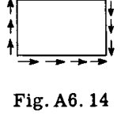 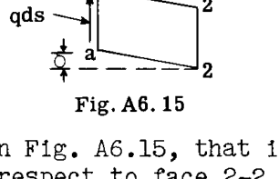

この要素に蓄えられた弾性ひずみエネルギー  $dU$  は、したがって、

$$ 
dU = \frac{q ds}{2} \delta 
$$ 

しかし、せん断ひずみ  $\delta$  は次のように書ける。

$$ 
\delta = \frac{\tau}{G} = \frac{q}{Gt} \quad \text{であるが } q = \frac{T}{2A} 
$$ 

したがって、

$$ 
dU = \frac{T^{2}}{8 A^{2} G t} ds 
$$ 

または

$$ 
 U = \oint \frac{T^{2}}{8 A^{2} G t} ds 
$$ 

積分  $\oint$  はチューブの外周に沿った線積分である。第A7章のカスティリアノの定理より、

$$ 
\theta = \frac{\partial U}{\partial T} = \oint \frac{T}{4 A^{2} G t} ds \quad \text{--- (17)} 
$$ 

 $t$  以外のすべての値は一定であるため、式(17)は次のように書ける。

$$ 
\theta = \frac{T}{4 A^{2} G} \oint \frac{ds}{t} \quad \text{--- (18)} 
$$ 

また  $T = 2 q A$  であるため、次のようにも書ける。

$$ 
\theta = \frac{q}{2 A G} \oint \frac{ds}{t} \quad \text{--- (19)} 
$$ 

ここで  $\theta$  は、チューブの1インチあたりのラジアン単位のねじれ角である。チューブの長さ  $L$  に対しては、

$$ 
\theta = \frac{q L}{2 A G} \oint \frac{ds}{t} \quad \text{--- (20)} 
$$ 

### A6.9 多セル閉断面の内部せん断流システムによるねじりモーメントの表現
Fig. A6.16は、外部トルクを受けた際の、2セル薄肉チューブの内部せん断流パターンを示している。  $q_{1}$ 、  $q_{2}$ 、および  $q_{3}$  は、3つの異なるセル壁部分における1インチあたりのせん断荷重を表している。

内部ウェブと外壁の接合部におけるせん断力の平衡から、次のようにわかる。

$$ 
q_{1} = q_{2} + q_{3} \quad \text{--- (21)} 
$$ 

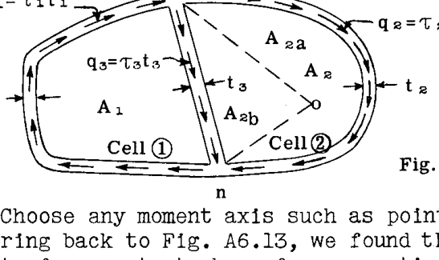

点  $(o)$  のような任意のモーメント軸を選択する。Fig. A6.13を振り返ると、点  $(o)$  の周りの壁の長さ  $ds$  に沿って作用する一定のせん断力  $q$  のモーメントは、回転中心から壁要素  $ds$  の端部までの半径によって形成される幾何学的形状の面積の2倍に、せん断流  $q$  を乗じたものに等しいことがわかった。

点  $(o)$  の周りのせん断流のモーメントを  $T_{o}$  とする。するとFig. A6.16より、

$$ 
T_{o} = 2 q_{1}(A_{1} + A_{2b}) + 2 q_{2} A_{2a} - 2 q_{3} A_{2b} 
$$ 

$$ 
= 2 q_{1} A_{1} + 2 q_{1} A_{2b} + 2 q_{2} A_{2a} - 2 q_{3} A_{2b} \quad \text{--- (22)} 
$$ 

しかし、式(21)より、  $q_{3} = q_{1} - q_{2}$  である。式(22)に  $q_{3}$  の値を代入すると、

$$ 
T_{o} = 2 q_{1} A_{1} + 2 q_{1} A_{2b} + 2 q_{2} A_{2a} - 2 q_{1} A_{2b} + 2 q_{2} A_{2b} 
$$ 

$$ 
\text{ここで } A_{2} = A_{2a} + A_{2b} 
$$ 

したがって、

$$ 
T_{o} = 2 q_{1} A_{1} + 2 q_{2} A_{2} \quad \text{--- (23)} 
$$ 

ここで  $A_{1} =$  セル(1)の面積、  $A_{2} =$  セル(2)の面積である。したがって、純ねじりせん断応力を受ける多セルチューブの内部せん断システムのモーメントは、各セルの囲まれた面積の2倍に、そのセルの外壁に存在する1インチあたりのせん断荷重を乗じたものの合計に等しい（注：ウェブ  $mn$  は、どちらかのセルの内壁と呼ばれる）。

### A6.10 多セル薄肉閉断面におけるねじりせん断応力の分布。ねじれ角。

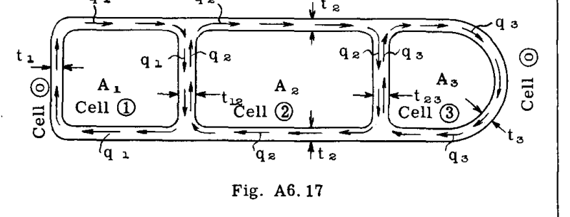

Fig. A6.17は、一般に、チューブに加えられた純トルク荷重によって生じる3セルチューブ上の内部せん断流パターンを示している。セルには(1)、(2)、(3)の番号が付けられており、チューブの外側の領域はセル(0)として指定されている。したがって、セル(1)の外壁を指定するために、セル1-0の間にあるものとして言及する。セル2の外壁については2-0、セル(1)と(2)の間のウェブについては1-2、などとする。

 $q_{1} =$  セル(1)の外壁における1インチあたりのせん断荷重  $= 	au_{1} t_{1}$ 、ここで  $au_{1}$  は単位応力を、  $t_{1}$  は壁厚を表す。同様に、  $q_{2} = 	au_{2} t_{2}$  および  $q_{3} = 	au_{3} t_{3} =$  それぞれセル(2)および(3)の外壁における1インチあたりのせん断荷重である。内部ウェブと外壁の接合点におけるせん断力の平衡について、ウェブ1-2については  $(q_{1} - q_{2})$  に等しいせん断荷重があり、ウェブ2-3については  $(q_{2} - q_{3})$  である。

平衡状態では、内部せん断システムのねじりモーメントは、この特定の断面におけるチューブ上の外部トルクに等しくなければならない。したがって、A6.9節の結論から、次のように書ける。

$$ 
T = 2 q_{1} A_{1} + 2 q_{2} A_{2} + 2 q_{3} A_{3} \quad \text{--- (24)} 
$$ 

弾性連続性のため、各セルのねじれは等しくなければならない。すなわち、  $\theta_{1} = \theta_{2} = \theta_{3}$  である。

式(19)より、あるセルの角度変位は次の通りである。

$$ 
\theta = \frac{q}{2AG} \oint \frac{ds}{t} 
$$ 

または

$$ 
2G\theta = \frac{q}{A} \oint \frac{ds}{t} \quad \text{--- (25)} 
$$ 

したがって、多セル構造の各セルに対して、式  $\frac{q}{A} \oint \frac{ds}{t}$  を記述し、それを定数値  $2G\theta$  に等しいと置くことができる。  $a_{10}$  をセル壁1-0に対する線積分  $\oint \frac{ds}{t}$  とし、  $a_{12}$ 、  $a_{20}$ 、  $a_{23}$ 、および  $a_{30}$  を3セルチューブの他の外壁および内壁部分に対する線積分  $\oint \frac{ds}{t}$  とする。任意のセルにおける壁のせん断応力の時計回り方向を符号の正とする。ここで、式(25)に代入すると次が得られる：

$$ 
\text{セル(1)} \quad \frac{1}{A_{1}} [q_{1} a_{10} + (q_{1} - q_{2}) a_{12}] = 2 G \theta \quad \text{--- (26)} 
$$ 

$$ 
\text{セル(2)} \quad \frac{1}{A_{2}} [(q_{2} - q_{1}) a_{12} + q_{2} a_{20} + (q_{2} - q_{3}) a_{23}] = 2 G \theta \quad \text{--- (27)} 
$$ 

$$ 
\text{セル(3)} \quad \frac{1}{A_{3}} [(q_{3} - q_{2}) a_{23} + q_{3} a_{30}] = 2 G \theta \quad \text{--- (28)} 
$$ 

方程式(24, 26, 27, 28)は、  $q_{1}$ 、  $q_{2}$ 、  $q_{3}$ 、および  $\theta$  の真の値を決定するのに十分である。

このように、多セル構造におけるねじり応力分布を決定するために、各セルに対して式(25)を記述し、これらの方程式を一般的なトルク方程式（式(24)と同様）と共に用いることで、せん断応力とねじれ角の解を求めるための十分な条件が得られる。

### A6.11 2セル薄肉閉断面の応力分布とねじれ角
2セルチューブの場合、  $q_{1}$ 、  $q_{2}$ 、および  $\theta$  の値を直接与えるように方程式を簡略化することができる。2つ以上のセルを持つチューブの場合、方程式は非常に複雑になるため、方程式を同時に解く必要がある。2セルチューブに対する方程式（Fig. A6.18）：

$$ 
q_{1} = \frac{1}{2} \left[ \frac{(a_{20} A_{1} + a_{12} A)}{a_{20} A_{1}^{2} + a_{12} A^{2} + a_{10} A_{2}^{2}} \right] T \quad \text{--- (29)} 
$$ 

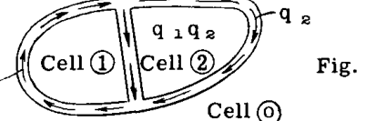

$$ 
q_{2} = \frac{1}{2} \left[ \frac{a_{10} A_{2} + a_{12} A}{a_{20} A_{1}^{2} + a_{12} A^{2} + a_{10} A_{2}^{2}} \right] T \quad \text{--- (30)} 
$$ 

$$ 
J = 4 \left[ \frac{a_{20} A_{1}^{2} + a_{12} A^{2} + a_{10} A_{2}^{2}}{a_{10} a_{12} + a_{12} a_{20} + a_{20} a_{10}} \right] \quad \text{--- (31)} 
$$ 

$$ 
\theta = \frac{T}{G J} \quad \text{--- (32)} 
$$ 

ここで  $A = A_{1} + A_{2}$  である。

### A6.12 多セル薄肉チューブにおけるねじり応力の例題

**例 1 - 非対称2セルチューブにおけるねじり応力**
Fig. A6.19は、一般的な翼形状で形成され、1つの内部ウェブを持つ典型的な2セル管状断面を示している。  $83450 \text{ in. lb.}$  の外部トルク  $T$  が図示のように作用すると仮定する。内部せん断抵抗パターンが求められる。

**セル定数の計算**
セル面積：
 $A_{1} = 105.8 \text{ sq. in.}$ 
 $A_{2} = 387.4 \text{ sq. in.}$ 
 $A = 493.2 \text{ sq. in.}$ 

線積分  $a = \oint \frac{ds}{t}$  :
 $a_{10} = 26.9 / .025 = 1075$ 
 $a_{12} = 13.4 / .04 = 335$ 
 $a_{20} = 25.25 / .04 + 15.7 / .05 + 25.3 / .032 = 1735$ 

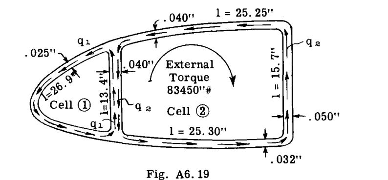

**各セルの角度変位を等しくすることによる解法**
一般式  $2G\theta = \frac{q}{A} \oint \frac{ds}{t}$  。  $q$  の時計回りの流れを正とする。
セル1を一般式に代入：

$$ 
2G\theta = \frac{1}{105.8} [-q_{1} \times 1075 + (-q_{1} + q_{2}) 335] = 
$$ 

$$ 
-13.33 q_{1} + 3.165 q_{2} \quad \text{--- (33)} 
$$ 

セル2：

$$ 
2G\theta = \frac{1}{387.4} [-(q_{2} - q_{1}) 335 - 1735 q_{2}] = 
$$ 

$$ 
.865 q_{1} - 5.34 q_{2} \quad \text{--- (34)} 
$$ 

式(33)と(34)を等しく置くと、

$$ 
-14.195 q_{1} + 8.505 q_{2} = 0 \quad \text{--- (35)} 
$$ 

外部および内部の抵抗モーメントの合計はゼロでなければならない。

$$ 
83450 - 2 \times 105.8 q_{1} - 2 \times 387.4 q_{2} = 0 \quad \text{--- (36)} 
$$ 

方程式(35)と(36)を解くと、  $q_{1} = 55.6 \#/in.$  および  $q_{2} = 92.5 \#/in.$  となる。結果が正で得られたため、想定された反時計回りの方向は  $q_{1}$  および  $q_{2}$  に対して正しかった、すなわち、真の符号は  $q_{1} = -55.6$  および  $q_{2} = -92.5$  である。

 $q_{12} = -55.6 + 92.5 = 36.9 \#/in.$  （セル1から見た場合）。

Fig. A6.20は得られたせん断パターンを示している。完全なセルのねじれ角は、  $q_{1}$  と  $q_{2}$  の値を式(33)または(34)のいずれかに代入することによって求められる。各セルのねじれは同じであり、チューブ全体のねじれに等しくなければならないためである。

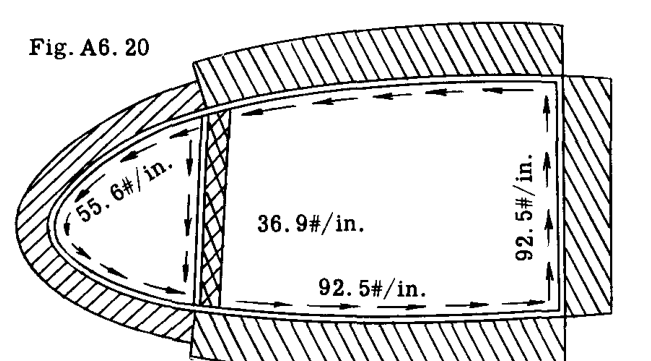

**式(29)および(30)に代入することによる解法**

$$ 
q_{1} = \frac{1}{2} \left[ \frac{1735 \times 105.8 + 335 \times 493.2}{1735 \times 105.8^{2} + 335 \times 493.2^{2} + 1075 \times 387.4^{2}} \right] T = 
$$ 

$$ 
= .000665 T = .000665 \times 83450 = 55.6 \#/in. 
$$ 

$$ 
q_{2} = \frac{1}{2} \left[ \frac{1075 \times 387.4 + 335 \times 493.2}{1735 \times 105.8^{2} + 335 \times 493.2^{2} + 1075 \times 387.4^{2}} \right] T = 
$$ 

$$ 
= .001107 T = .001107 \times 83450 = 92.5 \#/in. 
$$ 

**例題 2.**
トルク  $T$  を受けた際の、Fig. A6.21の対称2セル断面におけるねじりせん断応力を求めよ。ねじりモーメントに抵抗する際のストリンガーの抵抗は無視せよ。

**解法:**

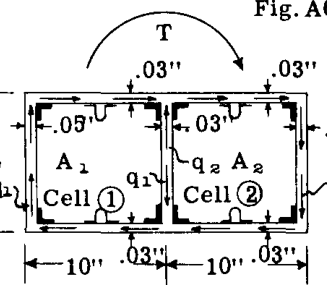

定数の計算：
セル面積：  $A_{1} = 100$ 、  $A_{2} = 100$ 、  $A = A_{1} + A_{2} = 200$ 
線積分  $a = \oint \frac{ds}{t}$  ：
 $a_{10} = 10/.05 + 20/.03 = 866.7$ 
 $a_{12} = 10/.03 = 333.3$ 
 $a_{20} = 20/.03 + 10/.04 = 916.7$ 

A6.11節の方程式の解：

$$ 
q_{1} = \frac{1}{2} \left[ \frac{916.7 \times 100 + 333.3 \times 200}{916.7 \times 100^{2} + 333.3 \times 200^{2} + 866.7 \times 100^{2}} \right] T 
$$ 

$$ 
= .002540 T 
$$ 

$$ 
q_{2} = \frac{1}{2} \left[ \frac{866.7 \times 100 + 333.3 \times 200}{916.7 \times 100^{2} + 333.3 \times 200^{2} + 866.7 \times 100^{2}} \right] T 
$$ 

$$ 
= .002456 T 
$$ 

$$ 
J = 4 \left[ \frac{916.7 \times 100^{2} + 333.3 \times 200^{2} + 866.7 \times 100^{2}}{866.7 \times 333.3 + 333.3 \times 916.7 + 916.7 \times 866.7} \right] = 89.76 
$$ 

$$ 
\theta = \frac{T}{JG} = \frac{T}{G \times 89.76} = .01116 \frac{T}{G} \text{ (rad.) 単位長さあたり} 
$$ 

### A6.13 例題 3 - 3セルチューブ
Fig. A6.22は、3つのセルで構成された薄肉管状断面を示している。図示のような  $100,000 \#$  の外部トルクに抵抗する際の内部せん断流パターンを決定する。

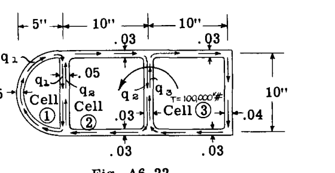

**解法:**
セル定数の計算：
セル面積：  $A_{1} = 39.3$ 、  $A_{2} = 100$ 、  $A_{3} = 100$ 

線積分  $a = \oint \frac{ds}{t}$  ：
 $a_{10} = \frac{\pi \times 10}{2 \times .025} = 629$ 
 $a_{12} = 10 / .05 = 200$ 
 $a_{20} = 20 / .03 = 667$ 
 $a_{23} = 10 / .03 = 333$ 
 $a_{30} = 20 / .03 + 10 / .04 = 917$ 

外部トルクと内部抵抗モーメントを等しく置くと：

$$ 
2 q_{1} A_{1} + 2 q_{2} A_{2} + 2 q_{3} A_{3} + T = 0 
$$ 

代入：

$$ 
78.6 q_{1} + 200 q_{2} + 200 q_{3} - 100,000 = 0 \quad \text{--- (37)} 
$$ 

各セルのねじれ角の式を記述する：

セル(1)

$$ 
2G\theta = \frac{1}{A_{1}} [q_{1} a_{10} + (q_{1} - q_{2}) a_{12}] 
$$ 

代入：

$$ 
2G\theta = \frac{1}{39.3} [629 q_{1} + 200 q_{1} - 200 q_{2}] \quad \text{--- (38)} 
$$ 

セル(2)

$$ 
2G\theta = \frac{1}{100} [200 q_{2} - 200 q_{1} + 667 q_{2} + 333 q_{2} - 333 q_{3}] \quad \text{--- (39)} 
$$ 

セル(3)

$$ 
2G\theta = \frac{1}{A_{3}} [(q_{3} - q_{2}) a_{23} + q_{3} a_{30}] 
$$ 

代入：

$$ 
2G\theta = \frac{1}{100} [333 q_{3} - 333 q_{2} + 917 q_{3}] \quad \text{--- (40)} 
$$ 

方程式(37)から(40)を解くと次が得られる：
 $q_{1} = 143.4 \#/in.$ 
 $q_{2} = 234.1 \#/in.$ 
 $q_{3} = 208.8 \#/in.$ 
 $q_{2} - q_{1} = 90.7 \#/in.$ 
 $q_{2} - q_{3} = 25.3 \#/in.$ 

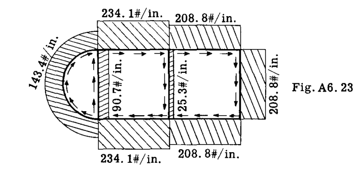

Fig. A6.23は得られた内部せん断流パターンを示している。ねじれ角は、必要であれば、方程式(38)から(40)のいずれかにせん断流の値を代入することによって求められる。

### A6.14 逐次修正法による多セルビームのねじりせん断流
航空機の翼構造設計の傾向、特に高速機における傾向は、Fig. A6.24に示されるような、比較的多数のセルで構成される翼断面など、多セル配置へと向かっている。

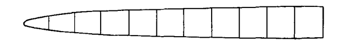

各セルに対して1つの未知のせん断流  $q$  がある場合、前述の方程式による解法は非常に骨の折れる作業となる。
逐次修正法（Successive Approximations）は、純ねじり下での多セル内のせん断流を見つけるための、シンプルで迅速な方法を提供する。

**逐次修正法の説明**
Fig. a に示すような2セルチューブを考える。

a. まず、各セルが独立して動作していると仮定し、セル(1)に  $G\theta_{1} = 1$  となるようなせん断流  $q_{1}$  を与える。
式(19)より、次のように書ける。

$$ 
G\theta = \frac{q}{2A} \oint \frac{ds}{t} 
$$ 

ここで  $G\theta = 1$  と仮定すると、

$$ 
q = \frac{2A}{\oint \frac{ds}{t}} 
$$ 

実用上、ほぼすべてのセルラー航空機ビームは、各特定のユニットに対して一定の厚さを持つ壁とウェブパネルを備えているため、項  $\oint \frac{ds}{t}$  は簡略化のために  $\sum \frac{L}{t}$  と記述される。ここで  $L$  は壁またはウェブパネルの長さを、  $t$  はその厚さを表す。したがって、次のように書ける。

$$ 
q = \frac{2 A}{\sum_{cell} \frac{L}{t}} \quad \text{--- (41)} 
$$ 

したがって、Fig. a のセル(1)に対して  $G\theta_{1} = 1$  と仮定すると、式(41)より次のように書ける。

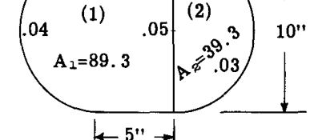

* S. U. Benscoter, "Numerical Transformation Procedures for Shear Flow Calculations", Journal, Institute of Aeronautical Sciences, Aug. 1946. に基づく。