A6.11  

$$ q_1 = \frac{\Sigma \frac{2A_1}{L}}{\frac{L}{t}} = \frac{178.6}{842} = 0.212 \, \text{lb./in.} $$  

図bにその結果を示す。  

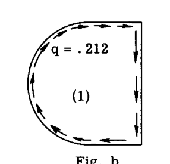  

同様にして、セル(2)にせん断流  $q_a$  を与えて  $G\theta_2 = 1$  になると仮定する。すると、  

$$ q_a = \frac{2A_2}{\sum \frac{L}{t}} = \frac{2 \times 39.3}{\frac{10}{.05} + \frac{15.7}{.03}} = \frac{78.6}{723} = 0.109 \#/\text{in.} $$  

図cにその結果を示す。  

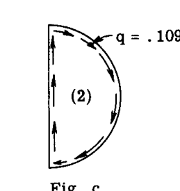  

次に、図dに示すように、2つのセルが内部ウェブ(1-2)を両方のセルの共通部分として結合されていると仮定する。  
図dを参照。内部ウェブは現在、  $q_1 - q_a = (.212 - .109) = .103 \#/\text{in.}$  の合成せん断流を受けている。  
明らかに、この内部ウェブ上のせん断流の変化は、セルが個別に作用していると考えられた場合と同じではなく、各セルでねじれが異なる原因となる。この結論を検証するために、 $G\theta$  の項で測定されるねじれを各セルについて計算する。  

セル (1):  
$$ G\theta_1 = \frac{1}{2A_1} \Sigma q \frac{L}{t} = $$  
$$ = \frac{1}{2 \times 89.3} \left[ .212 \times \frac{25.7}{.04} + (.212 - .109) \frac{10}{.05} \right] = 0.875 $$  

セル (2):  
$$ G\theta_2 = \frac{1}{2A_2} \Sigma q \frac{L}{t} = $$  
$$ = \frac{1}{2 \times 39.3} \left[ .109 \times \frac{15.7}{.03} - (.212 - .109) \frac{10}{.05} \right] = 0.466 $$  

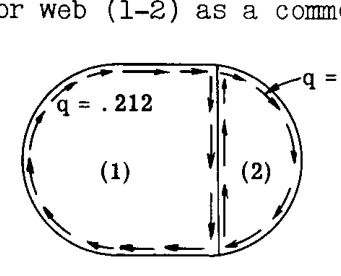  

断面が元の形状から歪まないためには  $\theta_1$  が  $\theta_2$  と等しくなければならないため、2つのセルが一体となって作用する場合、上記のせん断流は真のものではないことが明らかである。  

ここで、図dのセル(1)を考える。セル(2)を持ってきて取り付ける際、共通ウェブ(1-2)はせん断流  $q_a = -.109 \#/\text{in.}$ （セル(1)に対して反時計回りであり、したがって負）を受ける。これはセル(1)のせん断流  $q_1 = .212$  に加わるものである。ウェブ(1-2)上の負のせん断流  $q_a = -.109$  は、上述のように計算されたセル(1)のねじれを減少させ、結果として  $G\theta_1$  の値は開始時の 1.0 ではなく 0.875 となる。  

したがって、  $G\theta_1$  を再び 1 にするためには、セル(1)に一定のせん断流  $q'_1$  を加える必要があり、これはウェブ(1-2)に作用する  $q_a$  による負のねじれを打ち消すことになる。セル(1)のみを考慮しているため、式(41)において  $2A$  の項は一定であるから、ねじれの代わりにセル壁の歪みを比較することができる。  

したがって、ウェブ(1-2)上の  $q_a$  の影響を打ち消すために一定のせん断流  $q'_1$  を加えると、次のように書ける：  

$$ q'_1 \left( \Sigma \frac{L}{t} \right) \text{ cell (1)} - q_a \left( \frac{L}{t} \right) \text{ web 1-2} = 0 $$  

よって、  

$$ q'_1 = q_a \frac{\left( \frac{L}{t} \right) \text{ web 1-2}}{\left( \Sigma \frac{L}{t} \right) \text{ cell (1)}} \quad \dots \dots (42) $$  

式(42)に値を代入すると、  

$$ q'_1 = q_a \frac{\frac{10}{.05}}{\frac{25.7}{.04} + \frac{10}{.05}} = \frac{200}{842} q_a = .237 q_a $$  

このように、  $G\theta_1$  を 1 に等しくするためには、セル(1)のせん断流を、セル(2)のせん断流  $q_a$  の .237 倍に等しい一定のせん断流を加えることによって修正しなければならない。これは  $.237 \times .109 = .0258 \#/\text{in.}$  に等しい。  
このせん断流は隣接するセルのせん断流  $q_a$  の項で表されるため、これを修正キャリーオーバーせん断流と呼び、キャリーオーバー修正係数に  $q_a$  を乗じたものとして構成される。  

したがって、セル(2)からセル(1)へのキャリーオーバー係数は次のように書ける：  

$$ C.O.F. \, (2 \text{ to } 1) = \frac{\left( \frac{L}{t} \right) \text{ web (1-2)}}{\left( \Sigma \frac{L}{t} \right) \text{ cell (1)}} $$  

これは、式(42)の代入で見つかったように 0.237 に等しい。  

次に、図dのセル(2)を考える。セル(1)を持ってきて取り付ける際、共通ウェブ(2-1)は  $q_1 = -0.212 \#/\text{in.}$  のせん断流（セル2から見て反時計回りであり、したがって負）を受ける。この追加のせん断流は、セル(2)の  $G\theta_2$  ねじれを、1.0 ではなく 0.4375 という相対値に変化させる（以前の  $G\theta_2$  計算を参照）。したがって、  $G\theta_2$  を再び 1.0 にするために、セル(2)に補正用一定せん断流  $q'_2$  を追加して、ウェブ(2-1)上の  $q_1 = 0.212$  のねじれの影響を打ち消さなければならない。したがって、次のように書ける：  

$$ q'_2 \left( \Sigma \frac{L}{t} \right) \text{ cell (2)} - q_1 \left( \frac{L}{t} \right) \text{ web (2-1)} = 0 $$  

よって、  

$$ q'_2 = \frac{q_1 \left( \frac{L}{t} \right) \text{ web (2-1)}}{\left( \Sigma \frac{L}{t} \right) \text{ cell (2)}} \quad \dots \dots (43) $$  

式(43)に代入すると：  

$$ q'_2 = q_1 \left( \frac{200}{723} \right) = .277 q_1 = .277 \times .212 = .0587 \#/\text{in.} $$  

したがって、 $G\theta_2 = 1$  にするための  $q_1$  に関するセル(1)からセル(2)へのキャリーオーバー係数は、次のように書ける：  

$$ C.O.F. \, (1 \text{ to } 2) = \frac{\left( \frac{L}{t} \right) \text{ web (2-1)}}{\left( \Sigma \frac{L}{t} \right) \text{ cell (2)}} = \frac{200}{723} = .277 $$  

図eは、各セルの  $G\theta = 1$  を維持するために追加された一定のせん断流  $q'_1$  と  $q'_2$  を示している。  

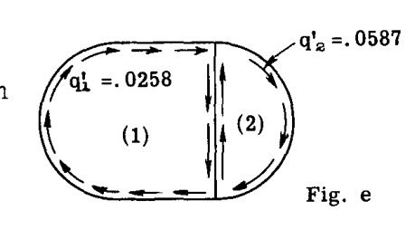  

しかし、これらの補正せん断流は、セルが再び互いに独立しているか、あるいは共通のウェブ(1-2)を持たないと仮定して追加されたものである。したがって、再びセルを結合すると、内部ウェブは  $q'_1 - q'_2$  の合成せん断流を受けることになる。言い換えれば、図dのせん断流に図eのせん断流を加えたとしても、  $G\theta_1$  と  $G\theta_2$  が 1 に等しくなるわけではない。得られる値は、図dのせん断流システムで見つかった値よりも 1.0 に近くなる。  

図eを考慮して、次に第2セットの補正せん断流  $q''_1$  と  $q''_2$  を、それぞれ独立して作用するセル(1)と(2)に追加して、  $G\theta_1$  と  $G\theta_2 = 1$  にする。  
以前と同じ推論で、セル(1)を考慮すると：  

$$ q''_1 \left( \Sigma \frac{L}{t} \right) \text{ cell (1)} - q'_2 \left( \frac{L}{t} \right) \text{ web 1-2} = 0 $$  

したがって、  

$$ q''_1 = \frac{q'_2 \left( \frac{L}{t} \right) 1-2}{\left( \Sigma \frac{L}{t} \right) \text{ cell (1)}} = .0587 \times .237 = .0139 \#/\text{in.} $$  

または  

$$ q''_1 = (C.O.F.) \, 2 \text{ to } 1 \text{ times } q'_2 = .237 \times .0587 = .0139 $$  

セル(2)を考慮すると：  

$$ q''_2 = q'_1 (C.O.F.) \, 1 \text{ to } 2 = .0258 \times .277 = .00717 \#/\text{in.} $$  

図fは、各セルに対する結果としての第2セットの補正用一定せん断流を示している。補正せん断流は急速に小さくなっているため、プロセスの継続は最終結果に求める精度の程度に依存する。もう1セットの補正用一定せん断流  $q'''_1$  と  $q'''_2$  を追加すると仮定しよう。以前に見つけたキャリーオーバー修正係数を使用して、以下を得る：  

$$ q'''_1 = .237 \times .00717 = .0017 \#/\text{in.} $$  
$$ q'''_2 = .277 \times .0139 = .00385 \#/\text{in.} $$  

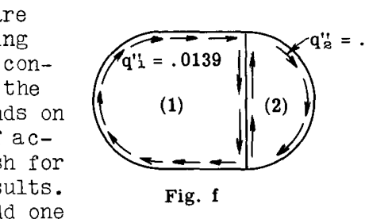  

図gにその結果を示す。  

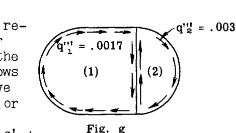  

最終的な、すなわち合成されたセルせん断流は、元のせん断流にすべての補正セルせん断流を加えたものに等しくなる、すなわち：  

$$ q_1 \, (\text{final}) = q_1 + q'_1 + q''_1 + q'''_1 $$  
$$ q_2 \, (\text{final}) = q_2 + q'_2 + q''_2 + q'''_2 $$  

図hに最終的な結果を示す。  

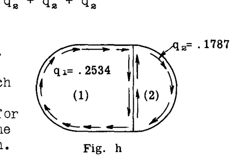  

各セルの最終的なねじれをチェックするために、図hの  $q$  値を使用して各セルの  $G\theta$  値を計算する。  

セル (1):  
$$ G\theta_1 = \frac{1}{2 \times 89.3} \left[ .2534 \times \frac{25.7}{.04} + .0747 \times \frac{10}{.05} \right] = .997 $$  

$$ G\theta_2 = \frac{1}{2 \times 39.3} \left[ .1787 \times \frac{15.7}{.03} - .0747 \times \frac{10}{.05} \right] = .997 $$  

### A6.15 逐次補正法を整理するための操作表の使用  
操作表1は、補正せん断流を扱うステップを、最小限の思考で迅速に実行できるように整理したものである。  

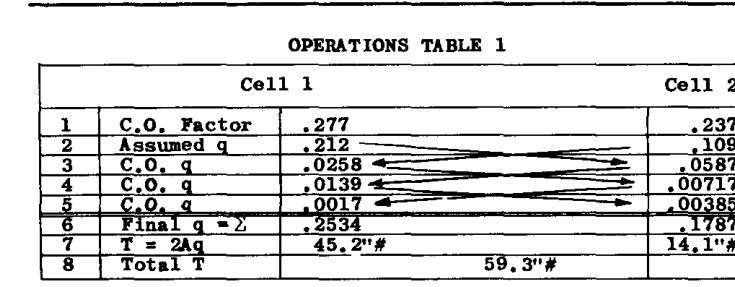  

**操作表1の説明**  
1行目は、前述のように計算された各セルのキャリーオーバー係数を示す。2行目は、各セルが独立して作用し、 $G\theta = 1$  となるような各セルの必要な一定せん断流  $q$  を示す。3行目は、各セルに追加する補正用一定せん断流の最初のセットを示す。表内の補正  $q$  （または  $C.O.q$ ）は、隣接するセルの  $q$  にそのセルの  $C.O.$  係数を乗じたもので構成される。  
したがって、  $.237 \times .109 = .0258$  はセル(2)からセル(1)へのキャリーオーバーであり、  $.277 \times .212 = .0587$  はセル(1)からセル(2)へのキャリーオーバーである。  
4行目は補正せん断流の第2セット、すなわち  $.277 \times .0258 = .00717$  （セル(2)へ）および  $.237 \times .0587 = .0139$  （セル(1)へ）を示す。5行目は補正キャリーオーバープロセスをもう一度繰り返す。6行目は、元の  $q$  にすべてのキャリーオーバー  $q$  値を加えた最終的な  $q$  値を示す。  

### 例題1 (2セル)  
図A6.25の2セルチューブが 20,000 in. lbs. のトルクを受けた時の内部せん断流システムを求めよ。  

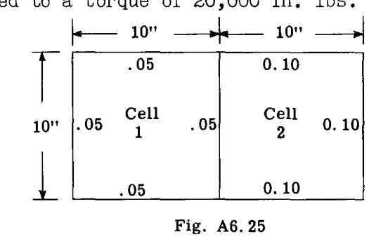  

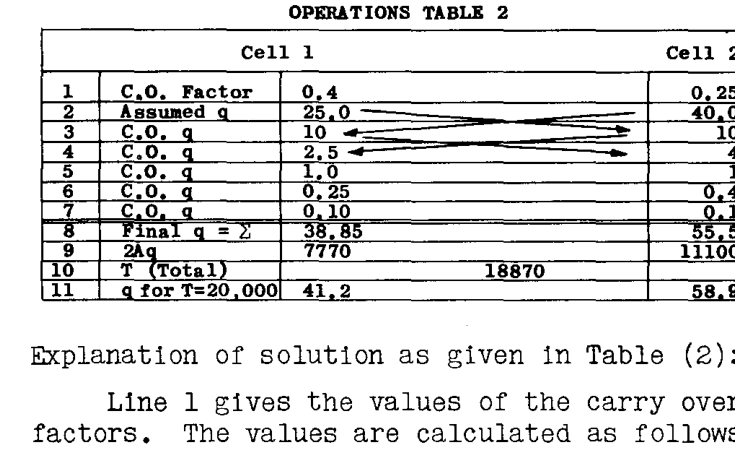  

**表(2)に示す解の説明：**  
1行目はキャリーオーバー係数の値を示す。値は次のように計算される：  
セル(1)からセル(2)への  $C.O.$  係数：  
$$ C.O. \, (1-2) = \frac{\left( \frac{L}{t} \right) \text{ web 1-2}}{\Sigma \left( \frac{L}{t} \right) \text{ cell 2}} = \frac{\frac{10}{.05}}{\frac{10}{.05} + \frac{30}{0.1}} = .40 $$  

$$ C.O. \, (2-1) = \frac{\left( \frac{L}{t} \right) \text{ web 2-1}}{\Sigma \left( \frac{L}{t} \right) \text{ cell 1}} = \frac{\frac{10}{.05}}{\frac{40}{.05}} = .25 $$  

2行目は、各セルが独立して作用し、  $G\theta = 1$  の単位ねじれ率を受けると仮定したときの、各セルのせん断流  $q$  を与える。  
 $q$  値の計算は以下の通り：  
セル(1)の場合  
$$ q_1 = \frac{2A_1}{\Sigma \left( \frac{L}{t} \right) \text{ cell 1}} = \frac{2 \times 100}{\frac{40}{.05}} = .25 $$  

セル(2)の場合  
$$ q_2 = \frac{2A_2}{\Sigma \left( \frac{L}{t} \right) \text{ cell 2}} = \frac{2 \times 100}{\frac{10}{.05} + \frac{30}{0.1}} = .4 $$  

 $A_1$  と  $A_2$  はそれぞれセル(1)と(2)のセル面積に等しい。  $L$  は壁要素の長さであり、  $t$  はそれに対応する厚さである。  

小数点の  $q$  値から開始しないように、上記の値を任意に100倍して  $q_1 = 25 \#/\text{in.}$  および  $q_2 = 40 \#/\text{in.}$  とする。項の相対的な値のみが必要なので、これは許容される。これらの値は表(2)の2行目に示されている。適切な補正キャリーオーバープロセスは、表(2)の3行目から開始される。セル(1)において、  $q_1 = 25$  からセル(2)へキャリーオーバーされる量は、  $C.O.$  係数に 25 を乗じたもの、すなわち  $0.4 \times 25 = 10$  であり、これはセル(2)の下の垂直線に沿って書き込まれる。同様にセル(2)において、  $q_2 = 40$  からセル(1)へキャリーオーバーされる量は、  $C.O.$  係数に  $q_2$  を乗じたもの、すなわち  $.25 \times 40 = 10$  であり、これはセル(1)の下の垂直線に書き込まれる。  

補正用一定せん断流の第2セットは表(2)の4行目に示されており、したがって、  $q_1 = 10$  の .4 である 4.0 がセル(2)にキャリーオーバーされ、  $.25 \times q_2 = 10$  の値である 2.5 がセル(1)にキャリーオーバーされる。5行目はプロセスを繰り返し、すなわち  $0.4 \times 2.5 = 1$  をセル(2)へ、  $.25 \times 4 = 1.0$  をセル(1)へキャリーオーバーする。  

この  $q$  の値をキャリーオーバーするプロセスは、値が小さくなるか無視できるようになるまで続けられる。8行目は、想定された  $q$  値に  $q$  のすべてのキャリーオーバー値を加算した、各セルの最終的な  $q$  値を与える。したがって、セル(1)では  $q = 38.85 \#/\text{in.}$ 、セル(2)では  $q = 55.5$  である。9行目は、これらのセルせん断流の値が生み出すことができるトルクを与える。  

$$ T = 2Aq $$  

セル(1)の場合  $T = 2 \times 100 \times 38.85 = 7770 \, \text{in. lb.}$   
セル(2)の場合  $T = 2 \times 100 \times 55.5 = 11100 \, \text{in. lb.}$   

10行目は、上記の2つの値の合計を与え、これは  $18870 \, \text{in. lb.}$  に等しい。  
問題の元々の要件は、  $20,000\"\#$  のトルクに対するせん断流システムであった。したがって、必要な  $q$  値は直接比例によって得られ、そこから：  

$$ q_1 = \frac{20000}{18870} \times 38.85 = 41.2 \#/\text{in.} $$  
$$ q_2 = \frac{20000}{18870} \times 55.5 = 58.9 \#/\text{in.} $$  

これらの値は表2の11行目に示されている。最終的な  $q$  値の下でのセルのねじれのチェックを行う。各セルの周囲の相対的な全歪みは、セルについての項  $\frac{1}{A} \Sigma q \frac{L}{t}$  によって与えられる。  

したがって、セル(1)の場合：  
$$ \frac{1}{A_1} \Sigma q \frac{L}{t} = \frac{1}{100} \left[ 41.2 \left( \frac{30}{.05} \right) + (41.2 - 58.9) \frac{10}{.05} \right] = 212 $$  

セル(2)の場合：  
$$ \frac{1}{A_2} \Sigma q \frac{L}{t} = \frac{1}{100} \left[ (58.9 - 41.2) \frac{10}{.05} + 58.9 \times \left( \frac{30}{0.1} \right) \right] = 212 $$  

したがって、両方のセルのねじれは同じである。  
上記の計算では、  $q_1$  と  $q_2$  は各セル内で時計回りに作用するため、内部の共通ウェブ上のせん断流は2つの  $q$  値の差となる。  

### 例題2 3セル  
図A6.26の3セル構造は  $100,000 \, \text{in. lb.}$  の外部トルクを受ける。内部抵抗せん断流パターンを求めよ。  

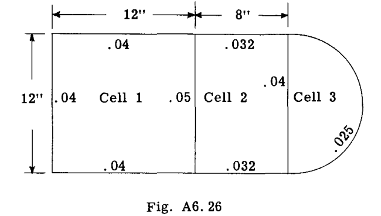  

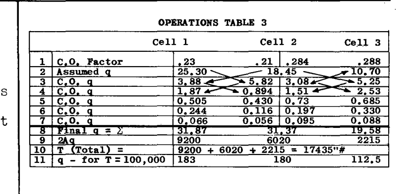  

**表3に示す解の説明：**  
セル(1)  $A_1 = 144$ 、 $\Sigma \frac{L}{t} = 1140$   
セル(2)  $A_2 = 96$ 、 $\Sigma \frac{L}{t} = 1040$   
セル(3)  $A_3 = 56.5$ 、 $\Sigma \frac{L}{t} = 1055$   

各セルが独立して作用する場合の  $G\theta = 1$  に対するせん断流  $q$  ：  
セル(1)  $q = \frac{2A_1}{\Sigma \frac{L}{t}} = \frac{288}{1140} = .253$   
セル(2)  $q = \frac{2A_2}{\Sigma \frac{L}{t}} = \frac{192}{1040} = .1845$   
セル(3)  $q = \frac{2A_3}{\Sigma \frac{L}{t}} = \frac{113}{1055} = .107$   

小さな数値を避けるために、これらの  $q$  の値に100を乗じて表の2行目に入力する。表の1行目に示すキャリーオーバー係数の計算。  

セル(1)から(2)へ  
$$ C.O. \, (1-2) = \frac{\left( \frac{L}{t} \right) \text{ web 1-2}}{\Sigma \left( \frac{L}{t} \right) \text{ cell 2}} = \frac{240}{1040} = .23 $$  

セル(2)から(1)へ  
$$ C.O. \, (2-1) = \frac{\left( \frac{L}{t} \right) \text{ web 2-1}}{\Sigma \left( \frac{L}{t} \right) \text{ cell 1}} = \frac{240}{1140} = .21 $$  

セル(2)から(3)へ  
$$ C.O. \, (2-3) = \frac{\left( \frac{L}{t} \right) \text{ web 2-3}}{\Sigma \left( \frac{L}{t} \right) \text{ cell 3}} = \frac{300}{1055} = .284 $$  

セル(3)から(2)へ  
$$ C.O. \, (3-2) = \frac{\left( \frac{L}{t} \right) \text{ web 2-3}}{\Sigma \left( \frac{L}{t} \right) \text{ cell 2}} = \frac{300}{1040} = .288 $$  

表3の残りの解法や手順は、表(2)の例題1で説明したものと同じである。2つのセルの間にあるセル(2)は、両方の隣接するセルから  $q$  値のキャリーオーバーを受け、これら2つの値は、隣接するセルに再び分配またはキャリーオーバーされる前に加算されることに注意すべきである。  
例えば、表(3)の3行目とセル(2)を考える。  $q$  値 5.82（  $.23 \times 25.3$  を表す）はセル(1)から持ち込まれ、  $q$  値  $3.08 = .288 \times 10.70$  はセル(3)から持ち込まれる。これら2つの値が加算されて  $5.82 + 3.08 = 8.90$  となる。セル(1)へのキャリーオーバー  $q$  は  $.21 \times 8.90 = 1.87$  であり、セル(3)へのキャリーオーバー  $q$  は  $.284 \times 8.90 = 2.53$  である。  

8行目において、セル(2)の最終的な  $q$  は、元の  $q$  である 18.45 に、各隣接セルからのすべてのキャリーオーバー  $q$  値を加えたものに等しい。  
表(3)の10行目は、得られた内部せん断流によって発生する総トルクが  $17435\"\#$  であることを示している。問題はトルク  $100,000 \, \text{in. lb.}$  に対するせん断流システムを求めることであったため、8行目の  $q$  の値に係数  $100,000/17435$  を乗じなければならない。11行目は最終的な  $q$  値を示している。  

### 例題3 4セル  
図A6.27の4セル構造が  $100,000 \, \text{in. lb.}$  のねじりモーメントを受けた時の内部せん断流システムを求めよ。  

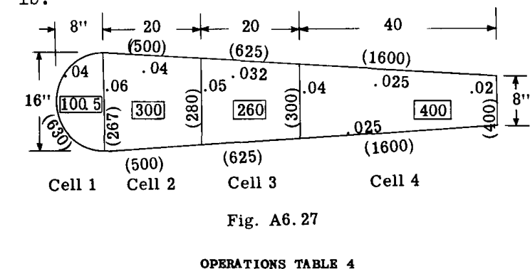  

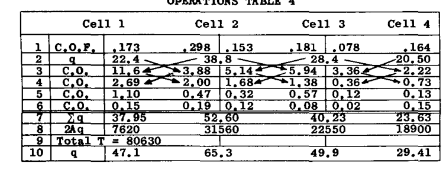  

図A6.27において、長方形内の数値はセル面積を表す。カッコ内の数値は特定の壁またはウェブの  $L/t$  値を表す。例題1と2を学習した後であれば、表4に示されている値をチェックするのに問題はないはずである。10行目は、  $100,000\"\#$  の抵抗トルクを発生させるための  $q$  値の補正を示している。乗数は  $100,000/80630$  である。  

### A6.16 閉じたタイプの補強材（スティフナー）を持つ薄肉円筒のねじり  
航空機の薄肉構造には通常、図A6.28およびA6.29に示すように、外壁の周りに配置された縦方向の補強材が含まれている。  

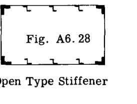  
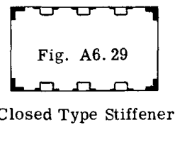  

図A6.28に示されるオープンタイプスティフナーの場合、個々のスティフナーのねじり剛性は薄肉セルのねじり剛性と比較して非常に小さいため、無視できる。しかし、クローズドタイプスティフナーは本質的に小さなサイズのチューブであり、その剛性は同程度のサイズのオープンセクションよりもはるかに大きい。したがって、外壁に取り付けられたクローズドタイプスティフナーを持つセルは、各スティフナーが外部の周囲セルと共通の壁を持つセルとして機能するマルチセル構造として扱うことができる。一般に補強材によって提供される剛性はセル全体と比較して比較的小さいため、KuhnによるNACA T.N. 542に示されている近似的な簡略化手順を使用して、通常は十分な精度を得ることができる。この近似法では、薄肉チューブとクローズドスティフナーは、以下のいずれかの手順でクローズドスティフナーを修正することにより、単一の薄肉チューブに変換または変換される：  

(1) 各クローズドスティフナーを、有効厚さ  $t_e = t_{ST} s/d$  を持つダブラープレートに置き換え、これらのダブラープレートを配置した状態で  $\oint ds/t$  を計算する。ねじりチューブの囲まれた面積は元のまま（A）である。図A6.30参照。  

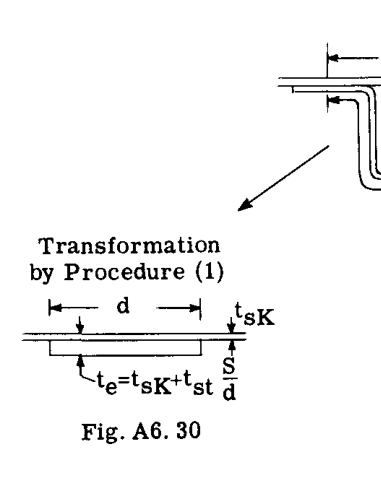  

(2) 各スティフナーの上のスキンを、厚さ  $t_e = t_{SK} d/s$  を持つスティフナー内の「ライナー」に置き換える（図A6.31参照）。セルの囲まれた面積（A）は、元の面積から図A6.31でクロスハッチングされた面積を引いたものになる。  

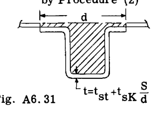  

手順(1)は補強材の剛性効果をわずかに過大評価し、手順(2)はわずかに過小評価する。  
補強されたセルのコーナー部材は通常、オープンまたはソリッドセクションであるため、それらのねじり抵抗は薄肉の全体セルのねじり剛性に単純に加算することができる。  

### A6.17 ねじりを受ける部材の端部拘束の影響  
本章の前の部分で導出された式は、ねじり部材の全長にわたる断面が面外に自由に反り（ワープ）が生じ、したがって断面に垂直な応力が発生しないことを前提としていた。しかし、実際の構造物では、この断面の自由な反りに対する拘束がしばしば存在する。例えば、航空機の片持ち翼は、かなり剛性の高い胴体構造への取り付け部において、翼と胴体の結合点での反りが拘束されている。拘束のもう一つの例は、着陸装置や動力装置の反力を受けるような重い翼隔壁（バルクヘッド）である。これらの重い隔壁のフランジは、しばしばかなりの横曲げ剛性を持ち、そのため翼断面の反りを防ぐ傾向がある。  
部材に加えられる力としてねじり力のみが考慮されているため、部材の断面に垂直に生じる応力、すなわち引張と圧縮は、平衡のために合計がゼロにならなければならない。したがって、加えられたトルクは、部材の純粋なねじり作用と、部材の断面に垂直な縦方向の応力の一部によって運ばれる。各作用によって運ばれる全トルクの割合は、断面の寸法と形状、および部材の長さに依存する。  
図A6.32は、オープンセクション、すなわち自由端に純粋なねじり力  $T$  を受け、他端または支持端で固定されたチャンネルセクションの歪みを示している。固定端の近くでは、加えられたトルクは、図に示されているように、H力で偶力を形成する短い片持ち梁として作用するチャンネルの上下の脚の横曲げによって、実質的にすべて抵抗される。部材の自由端の近くでは、これらの上下の脚は非常に長い片持ち梁になり、その曲げ剛性は小さくなるため、この領域における断面の純粋なねじり剛性は、チャンネル脚の曲げ剛性よりも大きくなる。  

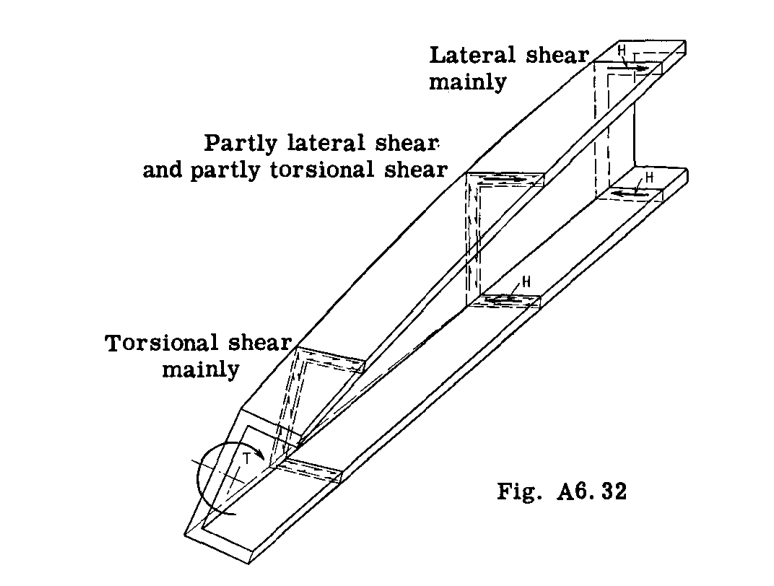  

### A6.18 ねじりを受ける部材の端部拘束の影響を説明する例題  
図A6.33は、自由端にねじりモーメント  $T$  を受けるIビームを示している。問題は、Iビームの固定端からそれぞれ10インチと40インチの2つの異なる断面において、トルク  $T$  のどの割合がフランジの曲げによって受け持たれ、どの割合が純粋なせん断によって受け持たれるかを決定することである。  

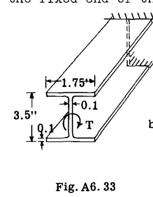  
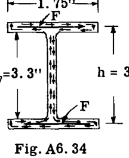  
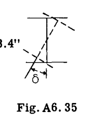  

図A6.34は、トルクが2つの部分、すなわちIビームのフランジの曲げによって形成される偶力  $F-F$  と、断面上の純粋なせん断応力システムに分かれていることを示している。図A6.35は、断面が距離  $\delta$  だけねじれていることを示している。  
解法は、2つの応力条件下でのねじれ角  $\theta$  を計算し、それらを等置することからなる。  
図A6.34の偶力  $F-F$  を形成する曲げにおいて、フランジによって運ばれる全トルク  $T$  の割合を  $T_B$  とする。図A6.35から、ねじれ角は次のように書ける：  

$$ \theta_B = \frac{\delta}{0.5h} = \frac{F L^3}{3 EI \cdot 0.5h} = \frac{2 T_B L^3}{3 h^2 EI} $$  

注：片持ち梁の端部に荷重  $F$  を受けた時のたわみは  $FL^3/3EI$  であり、中心軸に関する長方形の慣性モーメント  $I = tb^3/12$  である。  

したがって、  
$$ \theta_B = \frac{8 L^3}{E b^3 h^2} T_B $$  

ここで、純粋なねじりにおいて部材によって運ばれる全トルクの部分を  $T_t$  とする。Art. A6.6の式(12)に示されている長方形要素で構成されるオープンセクションの近似解が使用される。  

$$ \theta_t = \frac{3 T_t L}{G t^3 (b + b_w)} $$  

 $\theta_B$  と  $\theta_t$  を等置すると、次のように書ける：  

$$ \frac{T_B}{T_t} = \frac{3 E h^2 b^3}{8 L^2 G t^3 (2b + b_w)} $$  

 $L = 10$  インチの値を代入すると：  

$$ \frac{T_B}{T_t} = \frac{3 \times 10.5 \times 10^6 \times 3.4^2 \times 1.75^3}{8 \times 10^2 \times 3.7 \times 10^6 \times 0.1^2 (2 \times 1.75 + 3.3)} = 9.65 $$  

したがって、フランジの曲げによって受け持たれる全ねじり  $T$  の割合は以下の通り：  

$$ \frac{T_B}{T_B + T_t} (100) = \frac{T_B}{T_B + \frac{T_B}{9.65}} (100) = 90.5 \% $$  

固定端から40インチの断面を考える場合、  $L = 40$  インチである。したがって、上記の代入において  $10^2$  の代わりに  $40^2$  を置くと、  $T_B/T_t$  の結果は 0.602 となり、曲げで運ばれるトルクの割合は、支持部から10インチの 90.5% に対して 36 となる。したがって、一般に、端部拘束の影響は  $L$  の値が大きくなるにつれて急速に減少する。  
縦方向の補強材を持つ薄肉チューブに対する端部拘束の影響は、より複雑な問題であり、このような簡略化された方法で処理することはできない。この問題については他の章で検討する。  

### A6.19 練習問題  
(1) 図A6.36において、プーリ(1)は駆動プーリであり、(2)と(3)は従動プーリである。シャフトは一定速度で回転する。プーリの両側のベルト張力の差を図に示す。1-3/4インチのシャフトにおいて、プーリ(1)と(2)の間、および(2)と(3)の間の最大ねじりせん断応力を計算せよ。  

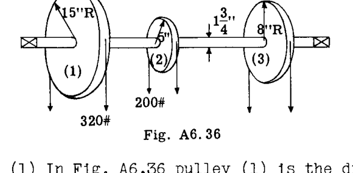  

(2) 1000 RPMで動作する 1/2 HP モーターが、翼フラップを動作させるためのギア機構を駆動する、長さ30インチの 3/4-.035 アルミニウム合金ねじりチューブを回転させる。フルパワーおよび定格回転数におけるねじりシャフト内の最大ねじり応力を求めよ。30インチの長さにおけるシャフトの角たわみを求めよ。チューブの極慣性モーメント  $J = .01 \, \text{in}^4$ 、剛性率  $G = 3,800,000 \, \text{psi}$  とする。  

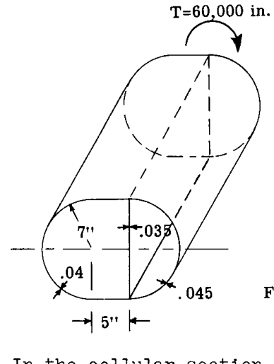  

(3) 図A6.36のセル状断面において、  $60,000 \, \text{in. lb.}$  の外部トルクに抵抗するねじりせん断流を求めよ。ウェブと壁の厚さは図に示されている。チューブの長さを 100 インチとし、ねじりたわみを求めよ。材料はアルミニウム合金（  $G = 3,800,000 \, \text{psi}$  ）とする。  

(4) 図A6.36において内部の .035 ウェブを取り除き、ねじりせん断流とたわみを計算せよ。  

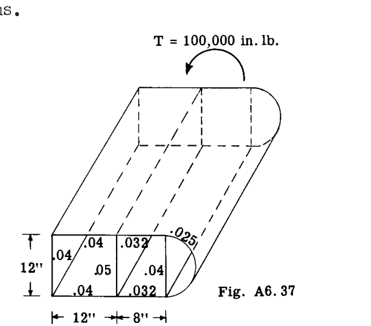  

(5) 図A6.37の3セル構造において、  $100,000 \, \text{in. lb.}$  の外部トルクによる内部抵抗せん断流を求めよ。長さ 100 インチに対し、  $G$  を  $3,800,000 \, \text{psi}$  と仮定してセル構造のねじれを計算せよ。  

(6) 図A6.37の .05 内部ウェブを取り除き、せん断流とねじれを計算せよ。  

(7) 図A6.37の両方の内部ウェブを取り除き、せん断流とねじれを計算せよ。  

(8) 図A6.38の各セル状構造は  $120,000 \, \text{in. lb.}$  のねじりモーメントを受ける。逐次近似法を使用して、抵抗せん断流パターンを計算せよ。  

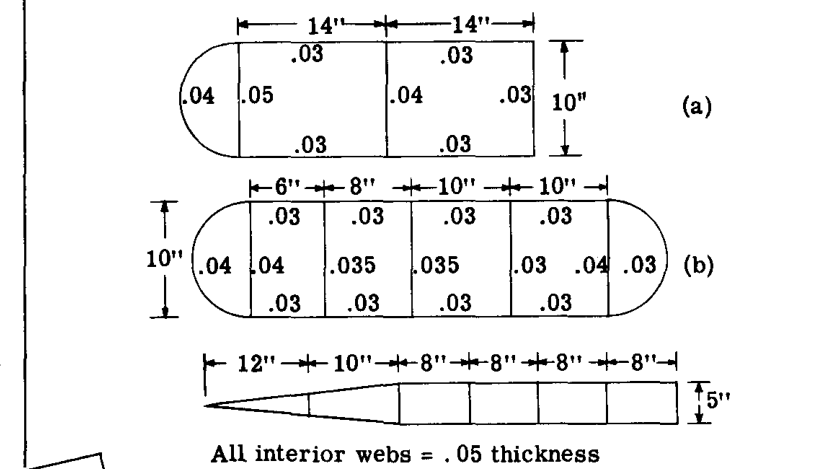  

将来の大型ヘリコプターは、多くの重要な産業および軍事作戦に使用されるだろう。ヘリコプターは構造エンジニアにとって多くの困難な課題を提示する。  
（1958年1月、United Aircraft Corp.の出版物「BEE-HIVE」のスケッチ。シコルスキー・ヘリコプター）