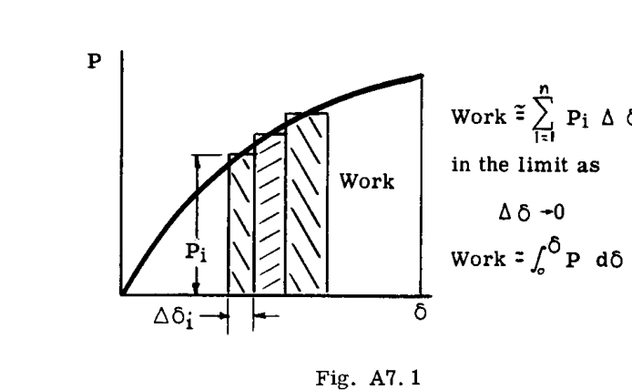
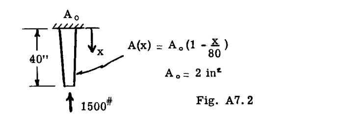
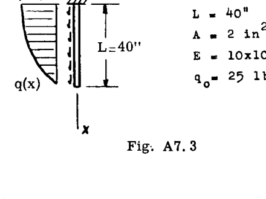
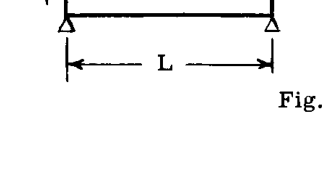
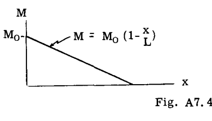
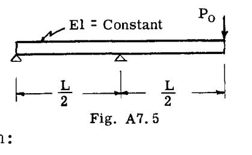
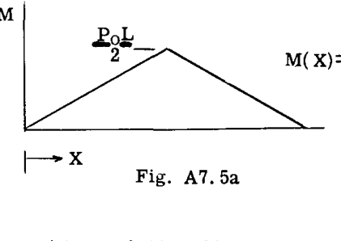
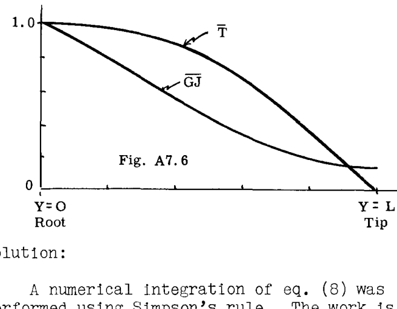
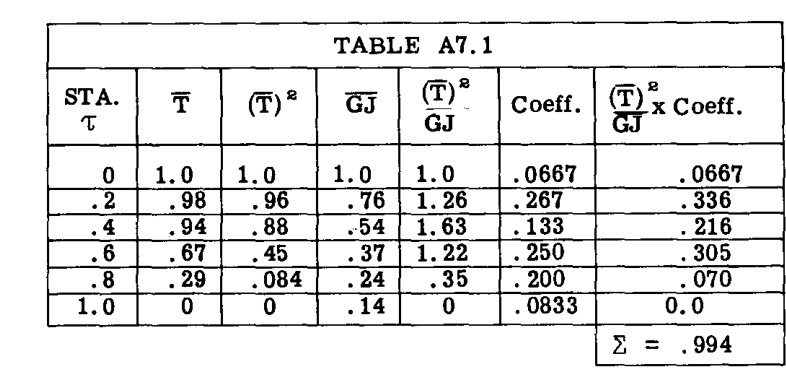

# 第 A7 章 構造物のたわみ  
ALFRED F. SCHMITT  

## A7.1 はじめに  
構造物のたわみの計算は、主に次の 2 つの理由から重要である：  

(1) 飛行機の荷重-変形特性に関する知識は、航空機の性能に対する構造的柔軟性の影響を研究する上で極めて重要である。  

(2) たわみの計算は、複雑な冗長構造物の内部荷重分布を解くために必要である。  

荷重下の構造物の弾性たわみは、構造物を構成する個々の要素のひずみ変形の累積的な結果である。そのため、全たわみの解法の 1 つとして、これらの個々の寄与のベクトル加算が含まれる可能性がある。しかし、ほとんどの実用的な構造物の複雑な形状により、そのようなアプローチは法外に困難になる。  

複雑な構造物の場合、より一般的な手法はベクトル的ではなく解析的なものである。それらは、たわみそのものではない量（物理量）を直接扱うが、適切な操作によってたわみを得ることができる。ここでたわみ計算のために採用される手法は、本質的に解析的なものである。  

## A7.2 仕事とひずみエネルギー  
力学で定義される仕事は、力と距離の積である。力が距離に対して変化する場合、仕事は積分法によって計算される。したがって、物体を  $δ$  だけ変形させる際に変化する力  $P$  によって行われる仕事は、次のようになる：  

$$ 
Work = \int_{0}^{δ} P dδ 
$$ 

であり、Fig. A7.1 に示すように、荷重-変形（P-δ）曲線の下の面積で表される。  

  

変形した物体が完全に弾性的である場合、物体に蓄えられたエネルギーは完全に回収され、物体は荷重増加時にたどったのと同じ P-δ 曲線に沿って除荷される。このエネルギーは変形の弾性ひずみエネルギー（以下、簡潔にひずみエネルギーと呼ぶ）と呼ばれ、記号  $U$  で表される。したがって、  

$$ 
U = \int_{0}^{δ} P dδ 
$$  

である。物体が線形弾性（構造解析で扱われるほとんどの物体がそうであるように）である場合、荷重-変形曲線は方程式  $P = kδ$  で表される直線となり、ひずみエネルギーは容易に次のように計算される：  

$$ 
U = \frac{kδ^2}{2} \text{、または同様に } U = \frac{P^2}{2k} 
$$  

## A7.3 さまざまな荷重に対するひずみエネルギーの式  
### 引張のひずみエネルギー  
長さ  $L$ 、断面積  $A$ 、弾性係数  $E$  の均一な棒の端に作用する引張荷重  $S$  は、次のような変形  $δ$  を引き起こす：  
 $δ = SL/AE$ 。したがって、 $S = \frac{AE}{L} δ$  であり、  

$$ 
U = \int_{0}^{δ} S dδ = \frac{AE}{L} \frac{δ^2}{2} \quad \cdots \cdots \cdots \cdots \cdots (1) 
$$  

あるいは、  

$$ 
U = \frac{S^2 L}{2AE} \quad \cdots \cdots \cdots \cdots \cdots (2) 
$$  

式 (1) と (2) は均一な棒のひずみエネルギーを表す等価な式であり、前者は変形  $δ$  の項で  $U$  を表し、後者は荷重  $S$  の項で表している。2 番目の形式の式は一般的な使用により便利であり、以降のひずみエネルギーの公式はこの形式で提示される。  

不均一な特性（変化する  $AE$ ）を持つ引張棒、または軸荷重  $S$  が変化する場合、ひずみエネルギーは積分法によって計算される。したがって、微小な長さ  $dx$  の要素内のエネルギーは、式 (2) より次のように与えられる：  

$$ 
dU = \frac{S^2 dx}{2AE} 
$$  

ここで、 $S$  および  $AE$  は要素の長さ全体の平均値である。棒全体の全エネルギーは、棒の長さにわたって合算することで得られる。  

$$ 
U = \int dU = \int \frac{S^2 dx}{2AE} \quad \cdots \cdots \cdots \cdots \cdots (3) 
$$  

### 例題 1  
線形にテーパーがついたアルミニウム棒が、Fig. A7.2 に示すように 1500 lbs の軸荷重を受けている。 $U$  を求めよ。  

  

**解：**  
静力学より、すべての断面における内部荷重  $S = -1500^\#$  である。  

$$ 
U = \int_{0}^{L} \frac{S^2 dx}{2AE} = \int_{0}^{40} \frac{(-1500)^2 dx}{4(1 - \frac{x}{80}) 10 \times 10^6} 
$$  

（便宜上、 $τ = x/40$  を導入すると）  

$$ 
= \frac{2(-1500)^2}{10^6} \int_{0}^{1} \frac{dτ}{2-τ} = 4.5 \ln 2 \text{ inch lbs.} 
$$  

注： $P$  は負（圧縮）の荷重であったが、ひずみエネルギーは正のままである。  

### 例題 2  
分布荷重  $q = q_0 \cos \frac{πx}{2L}$  を受ける均一な棒の  $U$  を求めよ（Fig. A7.3）。  

  

**解：**  
 $S(x)$  の方程式は静力学によって求められた。  

$$ 
S(x) = \int_{x}^{L} q dx = \int_{x}^{L} q_0 \cos \frac{πx}{2L} dx 
$$  

$$ 
= q_0 \frac{2L}{π} \sin \frac{πx}{2L} \Big|_{x}^{L} = q_0 \frac{2L}{π} (1 - \sin \frac{πx}{2L}) 
$$  

式 (3) への代入により、  

$$ 
U = \frac{2q_0^2 L^2}{π^2 AE} \int_{0}^{L} (1 - \sin \frac{πx}{2L})^2 dx 
$$  

$$ 
= \frac{2(25)^2 (40)^2}{9.87(2)(10 \times 10^6)} (.227)(40) = 0.0920 \text{ in lbs.} 
$$  

### 曲げのひずみエネルギー  
純粋なモーメント（偶力）の作用下にある長さ  $L$  の均一な梁は、モーメントに比例した角回転を受けます。したがって、材料力学の基礎から：  

$$ 
Θ = \frac{L}{EI} M 
$$  

  

ここで、定数  $EI$ （弾性係数と断面二次モーメントの積）は「曲げ剛性」と呼ばれます。回転  $Θ$  は  $M$  と共に線形に増加するため、蓄えられるひずみエネルギーは：  

$$ 
U = \frac{1}{2} MΘ 
$$  

または、  

$$ 
U = \frac{1}{2} \frac{M^2 L}{EI} \quad \cdots \cdots \cdots \cdots \cdots (4) 
$$  

不均一な特性（変化する  $EI$ ）を持つ梁、および/または梁に沿って  $M$  が変化する梁の場合、ひずみエネルギーは積分法によって計算されます。式 (4) から、微小な長さの梁要素におけるひずみエネルギーは：  

$$ 
dU = \frac{1}{2} \frac{M^2 dx}{EI} 
$$  

したがって、梁全体で合算して全ひずみエネルギーを得ると：  

$$ 
U = \int dU = \int \frac{1}{2} \frac{M^2 dx}{EI} \quad \cdots \cdots \cdots \cdots \cdots (5) 
$$  

### 例題 3  
Fig. A7.4 の梁について、 $M_0$  の関数としてひずみエネルギーの式を導出せよ。  

  

**解：**  
曲げモーメント図（Fig. A7.4a）が求められ、 $M$  の解析的な式が書かれた。  

  

$$ 
U = \frac{1}{2EI} \int_{0}^{L} M_0^2 (1 - \frac{x}{L})^2 dx = \frac{M_0^2 L}{6EI} 
$$  

### 例題 4  
Fig. A7.5 の梁の曲げひずみエネルギーを決定せよ。せん断ひずみエネルギーは無視する。  

  

**解：**  
まず曲げモーメント図が描かれ（Fig. A7.5a）、 $M$  の解析的な式が書かれた。  

  

図の検討から、梁の右半分の曲げエネルギーは左半分のそれと同一である必要があることがわかった。したがって：  

$$ 
U = 2 \cdot \frac{1}{2EI} \int_{0}^{L/2} (P_o x)^2 dx = \frac{P_o^2 L^3}{24 EI} 
$$  

### ねじりのひずみエネルギー  
トルク  $T$  を受ける均一な円形シャフトは、トルクに比例した長さ  $L$  における全ねじれ  $φ$  を経験する。材料力学の基礎より：  

$$ 
φ = \frac{L}{GJ} T \quad \cdots \cdots \cdots \cdots \cdots (6) 
$$  

ここで定数  $GJ$ （材料のせん断弾性係数と断面積極慣性モーメントの積）は「ねじり剛性」と呼ばれる。ねじれ  $φ$  は  $T$  と共に線形に増加するため、蓄えられるひずみエネルギーは：  

$$ 
U = \frac{1}{2} Tφ 
$$  

または、  

$$ 
U = \frac{1}{2} \frac{T^2 L}{GJ} \quad \cdots \cdots \cdots \cdots \cdots (7) 
$$  

特性が不均一で、荷重が変化するシャフトの場合：  

$$ 
U = \int \frac{T^2 dx}{2GJ} \quad \cdots \cdots \cdots \cdots \cdots (8) 
$$  

ちなみに、航空機の翼のような非円形シャフトまたは梁のねじり剛性に対して、グループ記号 "GJ" が使われることがよくある。そのような場合、ねじり剛性は文字通り  $G \times J$  として計算されるのではなく、むしろ式 (6) によって定義される、すなわちトルクとねじれ率の比として定義される。  

### 例題 5  
特定の飛行条件において、空気力学的荷重による飛行機の翼へのトルクが Fig. A7.6 にグラフィカルに示されている。ねじり剛性  $GJ$  の変化も同様に与えられている。蓄えられたひずみエネルギーを求めよ。  

  

**解：**  
式 (8) の数値積分はシンプソンの公式を使用して実行された。その作業は Table A7.1 に表形式で示されている。  

