# 第A7章

# 構造物のたわみ

ALFRED F. SCHMITT

## A7.1 序論

構造物のたわみの計算は、以下の2つの理由から重要である：  

(1) 航空機の荷重-変形特性の知識は、航空機の性能に対する構造的柔軟性の影響に関する研究において、一次的な重要性を持つ。  

(2) たわみの計算は、複雑な冗長構造物の内部荷重分布を解くために必要である。  

荷重下における構造物の弾性たわみは、構造物を構成する個々の要素のひずみ変形の累積的な結果である。そのため、全たわみを求める一つの解法としては、これらの個々の寄与をベクトル的に加算することが考えられる。しかし、ほとんどの実用的な構造物の形状は複雑であるため、そのようなアプローチは極めて困難である。  

複雑な構造物に対しては、ベクトル的な手法よりも解析的な手法がより一般的である。これらは、それ自体はたわみではない量、しかし適切な演算によってたわみが得られる量を直接扱う。本章でたわみ計算に採用される手法は、その性質上、解析的なものである。  

## A7.2 仕事とひずみエネルギー

力学で定義される仕事（Work）は、力と距離の積である。もし力が距離に対して変化する場合、仕事は積分法によって計算される。したがって、物体を  $\delta$  だけ変形させる際に、変化する力  $P$  によってなされる仕事は、次のようになる：  

$$ 
\text{Work} = \int_0^{\delta} P d\delta 
$$ 

これは、Fig. A7.1 に示されるように、荷重-変形（P-δ）曲線の下の面積で表される。  

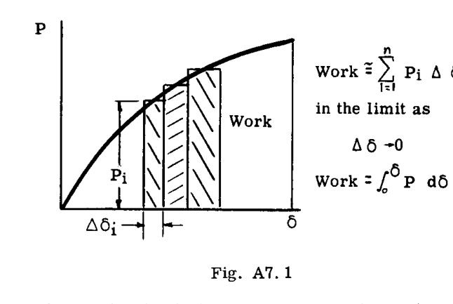

変形した物体が完全に弾性的であれば、体内に蓄えられたエネルギーは完全に回復し、荷重を減少させる際には、荷重を増加させたときと同じ P-δ 曲線に沿って戻る。このエネルギーは変形の弾性ひずみエネルギー（以下、簡潔にひずみエネルギーと呼ぶ）と呼ばれ、記号  $U$  で表される。したがって、次のようになる：  

$$ 
U = \int_0^{\delta} P d\delta 
$$ 

もし物体が線形弾性的（構造解析で扱われるほとんどの物体がそうであるように）であれば、荷重-変形曲線は直線となり、その方程式は  $P = k\delta$  であり、ひずみエネルギーは容易に次のように計算される：  

$$ 
U = \frac{k\delta^2}{2} \text{ または、同様に } U = \frac{P^2}{2k} 
$$ 

## A7.3 様々な荷重条件におけるひずみエネルギーの式

### 引張のひずみエネルギー

長さ  $L$ 、断面積  $A$ 、弾性係数  $E$  の一様な棒の端部に作用する引張荷重  $S$  は、変形  $\delta = SL/AE$  を引き起こす。したがって、 $S = \frac{AE}{L} \delta$  であり、次のようになる：  

$$ 
U = \int_0^{\delta} S d\delta = \frac{AE}{L} \frac{\delta^2}{2} 
$$ 

あるいは、次のように表される：  

$$ 
U = \frac{S^2L}{2AE} 
$$ 

式(1)と(2)は、一様な棒におけるひずみエネルギーの同等な表現であり、前者は変形  $\delta$  の項で  $U$  を表し、後者は荷重の項で  $U$  を表している。2番目の表現形式の方が一般的によく使われ、以後のひずみエネルギーの公式もこの形式で提示する。  

不均一な特性（ $AE$  が変化する）を持つ引張棒、あるいは軸荷重  $S$  が変化する場合、ひずみエネルギーは微積分によって計算される。したがって、微小長さ  $dx$  の要素におけるエネルギーは、式(2)より次のようになる：  

$$ 
dU = \frac{S^2dx}{2AE} 
$$ 

ここで、 $S$  および  $AE$  は要素の長さにおける平均値である。棒全体の全エネルギーは、棒の長さにわたって合算することで得られる。  

$$ 
U = \int dU = \int \frac{S^2dx}{2AE} 
$$ 

#### 例題 1

線形にテーパーがついたアルミニウムの棒が、Fig. A7.2 に示すように 1500 lbs の軸荷重を受けている。 $U$  を求めよ。  

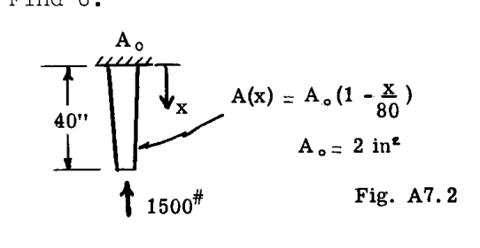

**解：**  
静力学より、すべての断面における内部荷重は  $S = -1500^{\#}$  である。  

$$ 
U = \int_0^L \frac{S^2dx}{2AE} = \int_0^{40} \frac{(-1500)^2 dx}{2 \cdot 4(1 - \frac{x}{80}) 10 \times 10^6} 
$$ 

$$ 
= \frac{2(-1500)^2}{10^6} \int_0^1 \frac{d\tau}{2-\tau} = 4.5 \ln 2 \text{ inch lbs.} 
$$ 

( $\tau = x/40$  を便宜上導入した)  

注： $P$  は負（圧縮）の荷重であったが、ひずみエネルギーは正のままである。  

#### 例題 2

分布荷重  $q = q_0 \cos \frac{\pi x}{2L}$  (Fig. A7.3) を受ける一様な棒の  $U$  を求めよ。  

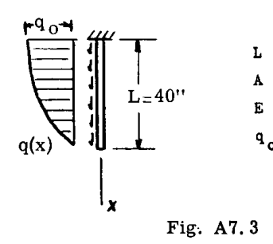

**解：**  
 $S(x)$  の式は静力学によって求められた。  

$$ 
S(x) = \int_x^L q dx = \int_x^L q_0 \cos \frac{\pi x}{2L} dx 
$$ 

$$ 
= q_0 \frac{2L}{\pi} \left[ \sin \frac{\pi x}{2L} \right]_x^L = q_0 \frac{2L}{\pi} \left( 1 - \sin \frac{\pi x}{2L} \right) 
$$ 

式(3)への代入により、  

$$ 
U = \frac{2q_0^2L^2}{\pi^2AE} \int_0^L \left( 1 - \sin \frac{\pi x}{2L} \right)^2 dx = 
$$ 

$$ 
\frac{2(25)^2(40)^2}{9.87(2)(10 \times 10^6)}(.227)(40) = 0.0920 \text{ in lbs.} 
$$ 

### 曲げのひずみエネルギー

長さ  $L$  の一様な梁が純粋な偶力（カップル）の作用下にあるとき、偶力に比例した角回転が生じる。したがって、材料力学の基礎より：  

$$ 
\Theta = \frac{L}{EI} M 
$$ 

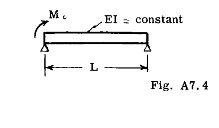

ここで定数  $EI$ （弾性係数と断面二次モーメントの積）は「曲げ剛性」と呼ばれる。回転  $\Theta$  は  $M$  に対して線形に増加するため、蓄えられるひずみエネルギーは次のようになる：  

$$ 
U = \frac{1}{2} M\Theta 
$$ 

あるいは、  

$$ 
U = \frac{1}{2} \frac{M^2L}{EI} 
$$ 

不均一な特性（ $EI$  が変化する）を持つ梁、および/または梁に沿って  $M$  が変化する場合、ひずみエネルギーは微積分によって計算される。式(4)より、微小長さの梁要素におけるひずみエネルギーは次のようになる：  

$$ 
dU = \frac{1}{2} \frac{M^2dx}{EI} 
$$ 

梁全体にわたって合算して全ひずみエネルギーを求めると、次のようになる：  

$$ 
U = \int dU = \frac{1}{2} \int \frac{M^2dx}{EI} 
$$ 

#### 例題 3

Fig. A7.4 の梁について、 $M_0$  の関数としてひずみエネルギーの式を導け。  

**解：**  
曲げモーメント図 (Fig. A7.4a) が求められ、 $M$  に関する解析的な式が書かれた。  

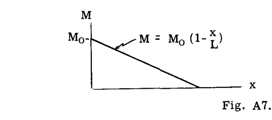

$$ 
M = M_0 \left( 1 - \frac{x}{L} \right) 
$$ 

すると、  

$$ 
U = \frac{1}{2EI} \int_0^L M_0^2 \left( 1 - \frac{x}{L} \right)^2 dx 
$$ 

$$ 
= \frac{M_0^2L}{6EI} 
$$ 

#### 例題 4

Fig. A7.5 の梁の曲げひずみエネルギーを決定せよ。せん断ひずみエネルギーは無視する。  

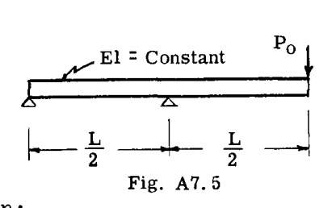

**解：**  
まず曲げモーメント図 (Fig. A7.5a) が描かれ、 $M$  の解析的な式が書かれた。  

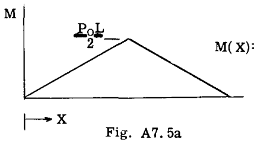

$$ 
M(X) = P_0X \quad 0 < X > \frac{L}{2} 
$$ 

図を調べると、梁の右半分の曲げエネルギーは左半分のそれと同一であるはずであることがわかった。したがって、  

$$ 
U = 2 \cdot \frac{1}{2EI} \cdot \int_0^{L/2} (P_0x)^2 dx 
$$ 

$$ 
= \frac{P_0^2L^3}{24EI} 
$$ 

### ねじりのひずみエネルギー

トルク  $T$  を受ける一様な円形シャフトは、トルクに比例した長さ  $L$  における全ねじれ角を経験する。したがって、材料力学の基礎より：  

$$ 
\phi = \frac{L}{GJ} T 
$$ 

ここで定数  $GJ$ （せん断弾性係数と断面極二次モーメントの積）は「ねじり剛性」と呼ばれる。ねじれ角  $\phi$  は  $T$  に対して線形に増加するため、蓄えられるひずみエネルギーは次のようになる：  

$$ 
U = \frac{1}{2} T\phi 
$$ 

あるいは、  

$$ 
U = \frac{1}{2} \frac{T^2L}{GJ} 
$$ 

不均一な特性および変化する荷重を持つシャフトに対しては、次のように表される：  

$$ 
U = \int \frac{T^2 dx}{2GJ} 
$$ 

ついでに述べておくと、航空機の翼のような非円形シャフトや梁のねじり剛性に対して、グループ記号「 $GJ$ 」が使用されるのをよく見かける。そのような場合、ねじり剛性は文字通り  $G \times J$  として計算されるのではなく、式(6)によって定義される。すなわち、トルクとねじれ率の比である。  

#### 例題 5

ある飛行条件において、空気力学的荷重による航空機の翼へのトルクが Fig. A7.6 にグラフィカルに示されている。ねじり剛性  $GJ$  の変化も同様に示されている。蓄えられるひずみエネルギーを求めよ。  

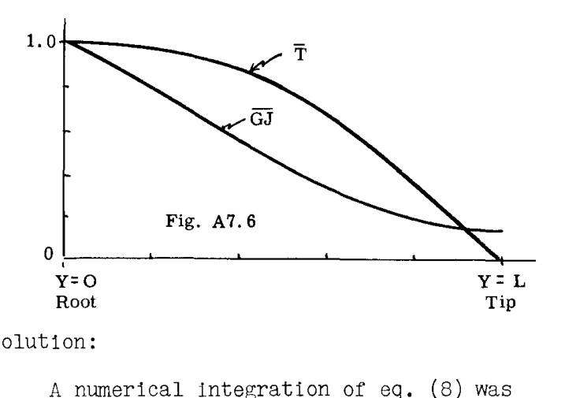

**解：**  
式(8)の数値積分が Simpson の公式を用いて行われた。その作業は Table A7.1 に表形式で示されている。  
選択された翼ステーションにおける  $T$  と  $GJ$  の値は提供されたグラフから読み取られ、表に入力された。数値作業を扱う便宜上、すべての変数は無次元形式で扱われ、式(8)は次のように変更された：  

$$ 
U = \int \frac{1}{2} \frac{T^2}{GJ} dy = \frac{1}{2} \frac{LT_R^2}{GJ_R} \int_0^1 \frac{(\overline{T})^2}{\overline{GJ}} d\tau 
$$ 

ここで、  

$$ 
\overline{T} \equiv T/T_R, \quad \tau = y/L 
$$ 

$$ 
\overline{GJ} \equiv GJ/GJ_R 
$$ 

添字  $R$  は「翼根（root）」の値 ( $y=0$ ) を表す。奇数  $n$  に対する Simpson の公式の係数は、次の式から取られた。  

$$ 
I = \frac{\Delta\tau}{3} (f_0 + 4f_1 + 2f_2 + 4f_3 + \dots + \frac{15}{4}f_{n-2} + 3f_{n-1} + \frac{5}{4}f_n) 
$$ 

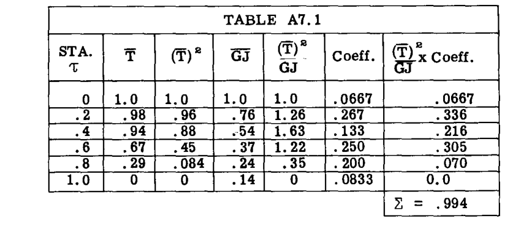

したがって、ひずみエネルギーは次のようになった：  

$$ 
2U = \frac{LT_R^2}{GJ_R} \times .994 
$$ 

### せん断のひずみエネルギー

厚さ  $t$ 、幅  $dx$ 、高さ  $dy$  の矩形要素が、一様なせん断応力  $\tau$  (psi) を受けている様子が Fig. A7.6a に示されている。  
材料力学の基礎より、せん断ひずみ角  $\gamma$  は、次のようにせん断応力  $\tau$  に比例する：  

$$ 
\gamma = \frac{\tau}{G} 
$$ 

ここで  $G$  は材料のせん断弾性係数である。スケッチに示されている変位に対して、左側の辺の下向き荷重のみが仕事をなす。（一般に4辺すべてが移動するが、ここで行ったように、要素の隣接する2辺に沿った軸に変位を関連付ければ、導出は簡略化される）。この荷重は  $\tau \times dy \times t$  に等しく、量  $\gamma \times dx$  だけ移動する。すると、  

$$ 
dU = \frac{1}{2} \tau \gamma t dx dy 
$$ 

$$ 
= \frac{1}{2} \frac{\tau^2}{G} t dx dy 
$$ 

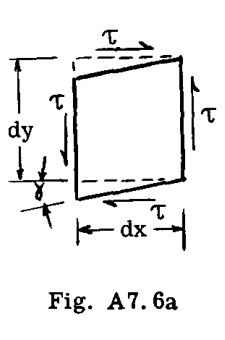

式(9)は、梁におけるせん断ひずみエネルギーを計算するために使用できる。  
横せん断荷重  $V$ (lbs)* を受けている梁のせん断ひずみエネルギーについて考える。この目的のために、 $V = \tau \times dy \times t$  とし、 $t \times dy$  は梁の断面積  $A$  と呼ばれる。したがって、  

$$ 
dU = \frac{V^2dx}{2AG} 
$$ 

となり、したがって梁全体の弾性せん断ひずみエネルギーは次のように与えられる：  

$$ 
U = \int \frac{V^2dx}{2AG} 
$$ 

*スケッチは、全高  $dy$  の梁から取り出した長さ  $dx$  の要素の側面図として視覚化されている。  

#### 例題 6

例題4の梁におけるせん断ひずみエネルギーを決定せよ。  

**解：**  
まず右端からせん断荷重図が描かれた。  

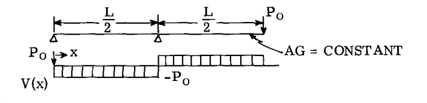

すると、  

$$ 
U = \frac{1}{2AG} \times 2 \times \int_0^{L/2} P_0^2 dx = \frac{P_0^2L}{2AG} 
$$ 

式(9)は、薄いシートにおけるせん断ひずみエネルギーを計算するために使用することができる。要素  $dx \times dy$  は、シート内の多くの要素の一つとして視覚化され、全エネルギーは合算（積分）によって得られる。したがって、  

$$ 
U = \iint \frac{\tau^2 t dx dy}{2G} 
$$ 

ここでは二重積分が必要であり、合算はシートの両方向に対して行われる。薄いシートを扱う場合、せん断流  $q \equiv \tau t$  を使用することがしばしば便利であり、式(11)は次のように書き換えられる：  

$$ 
U = \iint \frac{q^2 dx dy}{2Gt} 
$$ 

非常に重要な特殊なケースは、均質な一定厚さのシートが解析され、 $q$  がいたるところで一定であると仮定される場合である。この場合、次のようになる：  

$$ 
U = \frac{q^2}{2Gt} \iint dxdy = \frac{q^2S}{2Gt} 
$$ 

ここで、 $S = \iint dxdy$  はシートの表面積である。  

#### 例題 7

トルク  $T$  を受ける一様な矩形断面のカンチレバー・ボックス梁に蓄えられるせん断ひずみエネルギーを求めよ (Fig. A7.8)。  

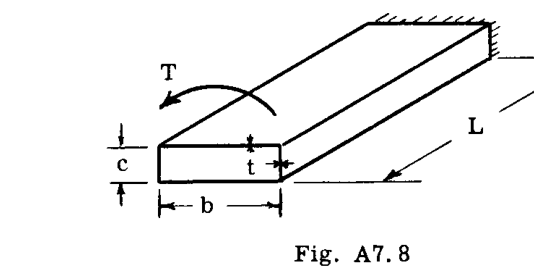

**解：**  
せん断流は Bredt の公式（Ref. Chapter A-6）によって与えられると仮定された：  

$$ 
q = \frac{T}{2A} = \frac{T}{2bc} 
$$ 

これは断面の周囲にわたって一定である。すると、  

$$ 
U = \sum \frac{q^2S}{2Gt} = \frac{T^2}{8G b^2 c^2 t} 2L(b+c) = \frac{T^2L(b+c)}{4Gb^2c^2t} 
$$ 

## 構造物の全弾性ひずみエネルギー

ひずみエネルギーはその定義により、常に正の量である。また、それはスカラー量（大きさを持つが方向を持たない）である。したがって、様々な荷重を受ける多様な要素を持つ複合構造物の全エネルギーは、単純な和として容易に求められる。  

$$ 
U_{TOT} = \int \frac{S^2dx}{2AE} + \int \frac{M^2dx}{2EI} + \int \frac{T^2dx}{2GJ} + \int \frac{V^2dx}{2AG} + \iint \frac{q^2dxdy}{2Gt} 
$$ 

積分記号および積分の指標としての「x」の一般的な使用は、あまりに文字通りに受け取るべきではない。これらの項は「積分」としてではなく、「構造物全体にわたるこれこれの和」として読むのがおそらく最善である。なぜなら、多くの場合、微積分に頼らずに単純な和として形成されるからである。微積分は、いくつかの用途において補助としてのみ使用される。  

式(13)のすべての項が計算に用いられることは稀である。実際に荷重が存在していても、その多くは局所的であったり二次的な性質のものであったりして、そのエネルギーの寄与は無視できる場合がある。  

## A7.4 仮想仕事の原理と最小ポテンシャルエネルギーの原理

荷重と変形の間の重要な関係は、仕事とひずみエネルギーの定義から直接導かれる。Fig. A7.9(a) を考えよ。  

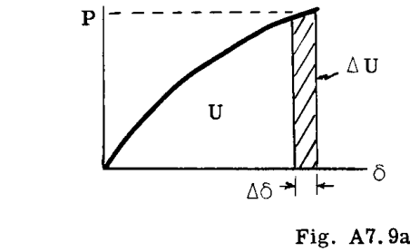

$$ 
\Delta U = P \Delta \delta 
$$ 

$$ 
\text{Limit } \Delta \delta \to 0, 
$$ 

$$ 
dU = P d\delta 
$$ 

したがって、  

$$ 
\frac{dU}{d\delta} = P 
$$ 

言葉で表すと、  
「変位に関するひずみエネルギーの変化率は、関連する荷重に等しい」。  

式(14)および上記の引用文は、仮想仕事の原理（Theorem of Virtual Work）の記述である。読者は、剛体体学の文献においてこの定理がかなり異なって述べられているのを見つけるかもしれないが、表現はそれにもかかわらず互換性があることを確信できるはずである。上記の定理の有用な言い換えは、式(14)を次のように書き換えることで得られる：  

$$ 
dU - P d\delta = 0 
$$ 

次に、もし変位の変化  $d\delta$  が十分に小さければ、荷重  $P$  は実質的に一定のままであると主張され、したがって、  

$$ 
dU - d(P\delta) = 0 
$$ 

$$ 
d(U - P\delta) = 0 
$$ 

量  $U - P\delta$  は系の全ポテンシャル（Total Potential）と呼ばれ、関数の最小値の数学的条件に似ている式(15)は、最小ポテンシャルエネルギーの原理（Theorem of Minimum Potential）の記述であると言われる。  
前述のことから、最小ポテンシャルエネルギーの原理は仮想仕事の原理の言い換えであることが明らかである。  
構造解析において、これらの定理の最も重要な用途は、座屈の不安定性やその他の非線形性に関する問題においてなされる。この時点では、具体的な適用例は示さない。  

## A7.5 相補エネルギーの原理とカスティリアノの定理

再び弾性体の場合について、荷重-変形曲線の上側の面積を調べると、この面積（相補エネルギー（Complementary Energy） $U^*$  と呼ばれる）の増分は、荷重と変形によって次のように関連付けられることがわかる（Fig. A7.9(b) を参照）。  

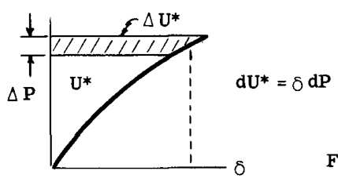

$$ 
dU^* = \delta dP 
$$ 

したがって、  

$$ 
\frac{dU^*}{dP} = \delta 
$$ 

これが相補エネルギーの原理（Theorem of Complementary Energy）である。  
ここで、線形弾性体については、Fig. A7.9(c) より非常に重要な定理が導かれる。  

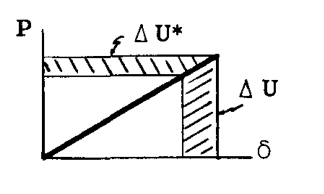

$$ 
dU = dU^* \text{ なので } 
$$ 

$$ 
\frac{dU}{dP} = \delta 
$$ 

言葉で表すと、  
「荷重に関するひずみエネルギーの変化率は、関連するたわみに等しい」。  
式(17)および上記の引用文は、カスティリアノの定理（Castigliano's Theorem）の記述である。  
複数の荷重が同時に作用している物体の下では、定理は個々の荷重とその関連するたわみに個別に適用されるように次のように書かれる*：  

$$ 
\frac{\partial U}{\partial P_i} = \delta_i 
$$ 

式(17a)の偏微分記号は、ひずみエネルギーの増分が、他のすべての荷重を一定に保ったまま、特定の荷重  $P_i$  の小さな変化によるものであることを示している。  
「荷重」と「たわみ」によって以下のものが意味され得ることに注意せよ。  

| 荷重 | 関連するたわみ |
| :--- | :--- |
| 力 (lbs.) | 変位 (inches) |
| モーメント (in. lbs.) | 回転 (radians) |
| トルク (in. lbs.) | 回転 (radians) |
| 圧力 (lbs/in²) | 体積 (in³) |
| せん断流 (lbs/in) | 面積 (in²) |

「力」と「たわみ」の定義のいかなる一般化も、それらの積がひずみエネルギーの単位 (in. lbs) を生み出すような単位である限りにおいてのみ可能である。  
強調のために繰り返すが、式(14)と(17)の相補的な性質は明らかであるが、式(17)（カスティリアノの定理）の使用は、線形弾性構造物に限定される。簡単な例が、考えられる落とし穴のイラストレーションとして役立つだろう。  
軸荷重  $P$  を受け、半正弦波にたわんだ初期に直立した一様な柱に蓄えられるひずみエネルギーは、次のようになる：  

$$ 
U = \frac{P^2 \delta L^2}{\pi^2 EI} 
$$ 

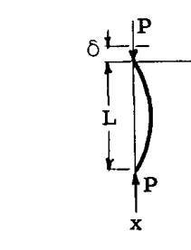

ここで  $\delta$  はたわみによる端部の短縮である。たわみが臨界（座屈）荷重に近づくにつれて急速に増大するため、問題は非線形である。 $U$  の計算の詳細は Fig. A7.10 とともに示されている。  
さて、仮想仕事の原理 (式14) によれば、  

$$ 
\frac{dU}{d\delta} = P 
$$ 

であるが、  

$$ 
\frac{dU}{d\delta} = \frac{P^2 L^2}{\pi^2 EI} 
$$ 

したがって、  

$$ 
\frac{P^2 L^2}{\pi^2 EI} = P 
$$ 

あるいは、  

$$ 
P = \frac{\pi^2 EI}{L^2} 
$$ 

（一様な柱のオイラー公式）。これが正しい結果である。  
カスティリアノの定理 (式17) を適用すると、誤った結果が導かれる：  

$$ 
\frac{dU}{dP} = \delta 
$$ 

$$ 
\frac{dU}{dP} = \frac{2P \delta L^2}{\pi^2 EI} = \delta 
$$ 

$$ 
P = \frac{\pi^2 EI}{2L^2} \quad (\text{誤り}) 
$$ 

教訓：非線形問題にカスティリアノの定理を使用してはならない。  
幸いなことに、カスティリアノの定理の使用に対する上記の制限は、それほど深刻なものではない。日常的な構造問題の大部分は線形だからである。カスティリアノの定理は、たわみ計算の実行に非常に有用であり、以下のセクションで多様なアプリケーションが示される。  

*複数の荷重の場合の定理の証明は、一般により厳密に定式化されており、Fig. A7.9c のような単純な図に頼ることはあまり効果的ではない。例えば、S. Timoshenko による "Theory of Elasticity" を参照のこと。  
**この方程式の詳細な導出については、第A-17章のArt. A17.6を参照のこと。  

## A7.6 カスティリアノの定理による構造物のたわみ計算

Art. A7.3 の例が示したように、構造物のひずみエネルギーは、内部荷重または応力分布が計算可能であれば、外部荷重の関数として表現することができる。ひずみエネルギーがそのように表現されれば、荷重作用点におけるたわみは式(17)（カスティリアノの定理）の助けを借りて決定することができる。  
以下の例では、様々な静定構造物のたわみを計算する。不静定構造物の取り扱いについては、後の記事で検討する。  

#### 例題 8

Fig. A7.11 のクレーンの荷重作用点における垂直たわみを求めよ。各部材の断面積が与えられている。より線のケーブルは、有効弾性係数  $13.5 \times 10^6$  psi を持つ。他の部材については  $E = 29,000,000$  である。  

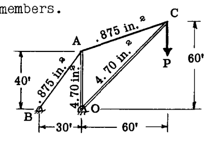

**解：**  
ここで考慮されるひずみエネルギーは、4つの各部材における軸荷重によるものであった。荷重分布は静力学から得られ、エネルギー計算は次のように表形式で行われた：  

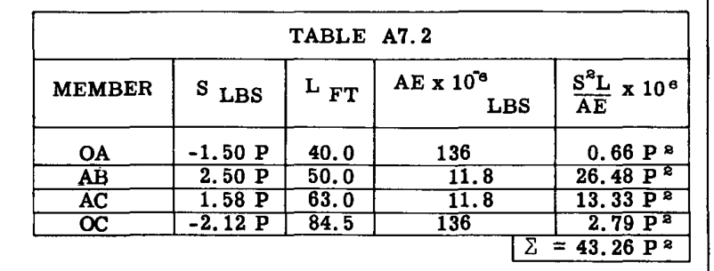

すると、  

$$ 
2U = 43.26 \times 10^{-6} P^2 \text{ LB FT} 
$$ 

$$ 
\delta_P = \frac{dU}{dP} = 43.26 \times 10^{-6} P \text{ ft.} 
$$ 

この問題において、微積分が使用されたのは微分操作においてのみであることに注意せよ。式(2)にあるように、 $U$  を形成するために単純な和が使用された。  

#### 例題 9

中空の閉じた薄肉チューブのねじれ率に関する Bredt の公式を導出せよ。  

$$ 
\Theta = \frac{T}{4A^2 G} \oint \frac{ds}{t} \quad \text{Ref. chap. A6.} 
$$ 

**解：**  
ひずみエネルギーは次のようにせん断として蓄えられる：  

$$ 
U = \frac{1}{2} \iint \frac{q^2 dx dy}{Gt} 
$$ 

無視された二次的な影響を除けば、これが唯一蓄えられたエネルギーである。与えられた断面において  $q$  は一定であり、Bredt の方程式によって与えられる。  

$$ 
q = \frac{T}{2A} 
$$ 

ここで  $A$  はチューブの囲まれた面積である (Ref. Chap. A.5)。  
単位長さあたりのねじれが求められていたため、単位長さあたりのひずみエネルギーのみが書かれた。したがって、軸方向を  $y$  と仮定すると、 $y$  に関する積分は行われなかった。残りの方向への積分は、チューブの周囲にわたって行われるべきであるため、指標は「x」からより適切な「s」に変更された。したがって（例題7と比較せよ）：  

$$ 
U = \frac{1}{2G} \oint \frac{q^2 ds}{t} = \frac{T^2}{8A^2 G} \oint \frac{ds}{t} 
$$ 

記号  $\oint$  は、チューブの周囲にわたって積分が行われることを意味する。したがって、  

$$ 
\Theta = \frac{dU}{dT} = \frac{T}{4A^2 G} \oint \frac{ds}{t} 
$$ 

## 仮想荷重の使用

以下の例では、求めたいれたいたわみが、荷重が加えられていない棒の自由端にある。計算の目的のために、仮想荷重（Fictitious Load）が追加される。この仮想荷重に関するひずみエネルギーの変化率が求められ、その後に荷重がゼロに設定される。この手法は、たとえ荷重自体がゼロであっても、たわみが荷重に関するひずみエネルギーの変化率に等しく、そのような変化率が存在するという事実に基づき、所望の結果を与える。  

#### 例題 10

Fig. A7.12 のテーパー棒の自由端の軸方向運動を計算せよ。  

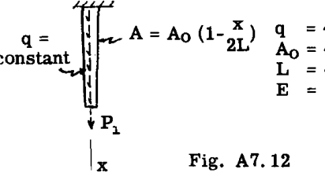

**解：**  
仮想的な端部荷重  $P_1$  を加えた後、静力学から軸荷重は次のようになることがわかった：  

$$ 
S(x) = P_1 + q(L - x) 
$$ 

したがって、引張以外の荷重は二次的な性質のものであるため、  

$$ 
U = \frac{1}{2} \int_0^L \frac{S^2 dx}{AE} \quad - \text{ 式3を参照} 
$$ 

$$ 
= \frac{1}{2 A_0 E} \int_0^L \frac{[P_1 + q(L - x)]^2 dx}{(1 - \frac{x}{2L})} 
$$ 

$$ 
= \frac{P_1^2}{2 A_0 E} \int_0^L \frac{dx}{(1 - \frac{x}{2L})} + \frac{P_1 q}{A_0 E} \int_0^L \frac{(L - x) dx}{(1 - \frac{x}{2L})} + \frac{q^2}{2 A_0 E} \int_0^L \frac{(L - x)^2 dx}{(1 - \frac{x}{2L})} 
$$ 

積分を評価する前に、この後のステップ（ $U$  を  $P_1$  に関して微分し、その後に  $P_1 = 0$  と置く）において、最初と最後の項が脱落することが観察された。したがって、第2項のみが評価された。  

$$ 
U = X + \frac{2L^2 Rq}{A_0 E} (1 - \ln 2) + X 
$$ 

すると、  

$$ 
\delta = \frac{dU}{dP_1} = \frac{2L^2 q}{A_0 E} (1 - \ln 2) 
$$ 

## 積分記号下での微分

カスティリアノの定理によるたわみの計算において、大幅な手間の節約が得られる可能性がある。  
この種の問題で発生するひずみエネルギー積分において、たわみが求められる対象となる荷重  $P_1$  は、積分における独立したパラメータとして機能する。関数の連続性に関する特定の要件が満たされている限り（そしてこれらの問題では不変的に満たされている）、 $P$  に関する微分は、積分が行われる「前」に実行することができる。結果として得られる積分は、一般に評価が容易である。  

#### 例題 11

Fig. A7.13 の梁の点 B におけるたわみを求めよ。  

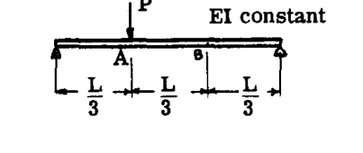

**解：**  
点 B に仮想荷重  $P_1$  が追加され、曲げモーメント図が2つの部分に分けて描かれた。  

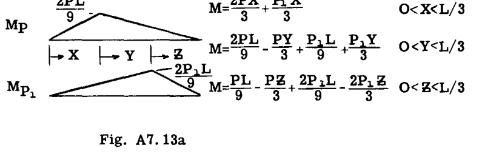

次に、せん断のエネルギーが小さいとして無視すると*、  

$$ 
U = \frac{1}{2EI} \int_0^{L/3} \left[ (2P + P_1) \frac{x}{3} \right]^2 dx 
$$ 

$$ 
+ \frac{1}{2EI} \int_0^{L/3} \left[ \frac{P}{9} (2L - 3y) + \frac{P_1}{9} (L + 3y) \right]^2 dy 
$$ 

$$ 
+ \frac{1}{2EI} \int_0^{L/3} \left[ \frac{(P + 2P_1)}{9} (L - 3z) \right]^2 dz 
$$ 

 $P_1$  に関する積分記号下での微分により、次が得られた：  

$$ 
\delta_B = \frac{\partial U}{\partial P_1} = \frac{1}{EI} \int_0^{L/3} \left[ (2P + P_1) \frac{x}{3} \right] \frac{x}{3} dx 
$$ 

$$ 
+ \frac{1}{EI} \int_0^{L/3} \left[ \frac{P}{9} (2L - 3y) + \frac{P_1}{9} (L + 3y) \right] \frac{(L + 3y)}{9} dy 
$$ 

$$ 
+ \frac{1}{EI} \int_0^{L/3} \left[ \frac{P + 2P_1}{9} (L - 3z) \right] \frac{2(L - 3z)}{9} dz 
$$ 

*通常の長さ対深さの比が大きい梁では、せん断ひずみエネルギーは曲げのエネルギーと比較して小さい。せん断エネルギーを無視することは、せん断たわみの寄与を無視することと同等である。(p. A7.14 を参照)  

仮想荷重  $P_1$  は、その目的を果たしたので、作業を完了する前にゼロに設定された。  

$$ 
\delta_B = \frac{1}{EI} \cdot \frac{2P}{9} \int_0^{L/3} x^2 dx 
$$ 

$$ 
+ \frac{1}{EI} \frac{P}{81} \int_0^{L/3} (2L - 3y)(L + 3y) dy 
$$ 

$$ 
+ \frac{1}{EI} \frac{2P}{81} \int_0^{L/3} (L - 3z)^2 dz 
$$ 

$$ 
\delta_B = \frac{7}{486} \frac{PL^3}{EI} 
$$ 

#### 例題 12

Fig. A7.14 は、直径  $D$  の円形ロッドを四分円に成形し、トルク  $T_0$  を作用させたカンチレバーを示している。自由端の垂直運動を求めよ。  

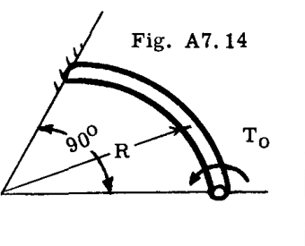

**解：**  
Fig. A7.14a は、梁要素における作用トルク  $T_0$  のベクトル分解を示している。 $T_1(\theta) = T_0 \cos \theta$ 、およびモーメント  $M_1(\theta) = T_0 \sin \theta$  である。所望のたわみの点に仮想的な垂直荷重  $P$ （下向き）を適用すると、Fig. A7.14b に示す荷重が得られた。  

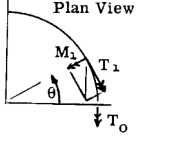
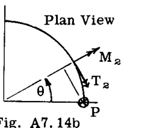

全荷重は以下の通りであった：  

$$ 
M = M_1 + M_2 = (T_0 - PR) \sin \theta 
$$ 

$$ 
T = T_1 + T_2 = T_0 \cos \theta + PR (1 - \cos \theta) 
$$ 

したがって、  

$$ 
U = \frac{1}{2EI} \int_0^{\pi/2} (T_0 - PR)^2 \sin^2 \theta R d\theta 
$$ 

$$ 
+ \frac{1}{2GJ} \int_0^{\pi/2} [T_0 \cos \theta + PR (1 - \cos \theta)]^2 R d\theta 
$$ 

（微分梁要素の長さとして "dx" の代わりに "Rdθ" を使用していることに注意）。積分記号下での微分により、  

$$ 
\frac{\partial U}{\partial P} = - \frac{(T_0 - PR)R^2}{EI} \int_0^{\pi/2} \sin^2 \theta d\theta 
$$ 

$$ 
+ \frac{R^2}{GJ} \int_0^{\pi/2} [T_0 \cos \theta + PR (1 - \cos \theta)](1 - \cos \theta) d\theta 
$$ 

仮想荷重  $P$  をゼロに置き、積分を行うと、  

$$ 
\delta_{VERT} = \frac{\partial U}{\partial P} = \frac{T_0 R^2}{4} \left( \frac{4}{GJ} - \frac{\pi}{GJ} - \frac{\pi}{EI} \right) 
$$ 

 $J = 2I$  および  $G = E/2.6$  であるため、たわみは負（上向き）であった。  

## A7.7 単位荷重法（仮想荷重法）による構造物のたわみ計算

Art. A7.6 のようにカスティリアノの定理を厳密に微積分に適用すると、大規模で複雑な構造物の解法には適さない、煩雑なテクニックが数多く生じる。改良された「帳簿付け」テクニックに適した、より柔軟なアプローチは、J. C. Maxwell (1864) および O. Z. Mohr (1874) によって独立して開発された単位荷重法（Method of Dummy-Unit Loads）である。  
単位荷重法の式が多くの方法で導出できることは、文献においてこの方法に付けられた非常に多様な名前によって証明されている*。以下には、異なる視点から生じる2つの導出が示されている。一方の導出は、カスティリアノの定理の記号を再解釈することによって式を得るもので、本質的にはひずみエネルギーの概念に訴えるものである。他方の導出は、剛体体学の原理を使用する。それらは共通の一貫した仮定に基づいているため、すべての方法は当然ながら同じ結果をもたらす。  

### 単位荷重法（仮想荷重法）の式の導出

#### I - カスティリアノの定理から

ひずみエネルギーの一般的な式、式(13)から始める。  

#### II - 仮想仕事の原理から

合力がゼロである力の系（平衡状態にある系）が変位したとき...  

*Maxwell-Mohr法、仮想速度法、仮想仕事法、補助荷重法、単位荷重法、仕事法など様々に呼ばれる。