仮想荷重  $P_1$  はその目的を果たした後、作業を完了する前にゼロに設定された。

$$
\delta_B = \frac{1}{EI} \cdot \frac{2P}{9} \int_0^{L/3} 3x^2 dx + \frac{1}{EI} \frac{P}{81} \int_0^{L/3} (2L - 3y)(L + 3y) dy + \frac{1}{EI} \frac{2P}{81} \int_0^{L/3} (L - 3z)^2 dz
$$

$$
\delta_B = \frac{7}{486} \frac{PL^3}{EI}
$$

### 例題 12
図 A7.14 は、直径  $D$  の丸棒で作られた片持ち梁が四分円の形状をしており、トルク  $T_o$  が作用している様子を示している。自由端の垂直方向の移動量を求めよ。

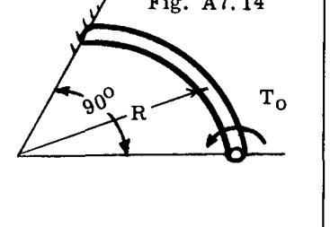

**解法:**

図 A7.14a は、梁要素に作用するトルク  $T_o$  のベクトル分解を示している。 $T_1(\theta) = T_o \cos\theta$  および曲げモーメント  $M_1(\theta) = T_o \sin\theta$  である。求めたいたわみの位置に仮想の垂直荷重  $P$ （下向き）を適用すると、図 A7.14b に示すような荷重状態が得られる。

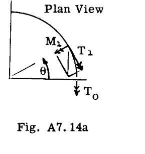

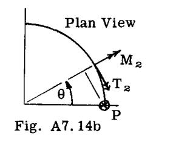

全荷重は以下の通りである：
 $M = M_1 - M_2 = (T_o - PR) \sin\theta$ 
 $T = T_1 + T_2 = T_o \cos\theta + PR(1 - \cos\theta)$ 

したがって、

$$
U = \frac{1}{2EI} \int_0^{\pi/2} (T_o - PR)^2 \sin^2\theta R d\theta + \frac{1}{2GJ} \int_0^{\pi/2} [T_o \cos\theta + PR(1 - \cos\theta)]^2 R d\theta
$$

（微分梁要素の長さとして "dx" の代わりに " $Rd\theta$ " を使用していることに注意）。積分記号の下で微分を行うと：

$$
\frac{\partial U}{\partial P} = -\frac{(T_o - PR)R^2}{EI} \int_0^{\pi/2} \sin^2\theta d\theta + \frac{R^2}{GJ} \int_0^{\pi/2} [T_o \cos\theta + PR(1 - \cos\theta)](1 - \cos\theta) d\theta
$$

仮想荷重  $P$  をゼロとして積分を行うと：

$$
\delta_{VERT} = \frac{\partial U}{\partial P} = \frac{T_o R^2}{4} \left( \frac{4}{GJ} - \frac{\pi}{GJ} - \frac{\pi}{EI} \right)
$$

 $J = 2I$  および  $G = E/2.6$  であるため、たわみは負（上向き）であった。

---

### A7.7 ダミー荷重法（仮想荷重法）による構造変位の計算
Art. A7.6 のようにカスティリアーノの定理を厳密に計算に適用すると、大規模で複雑な構造物の解法には不向きな、煩雑な手法が多くなる。より柔軟なアプローチとして、改良された「記帳（book keeping）」手法に容易に適合するのが、J. C. Maxwell (1864) と O. Z. Mohr (1874) によって独立して開発されたダミー荷重法（Method of Dummy-Unit Loads）である。

ダミー荷重法の公式が多くの方法で導出できることは、文献においてこの手法に適用されている非常に多様な名称によって証明されている $^\ast$ 。以下に、異なる視点から生じる2つの導出を示す。一つの導出は、カスティリアーノの定理の記号を再解釈することによって式を得るもので、本質的にはひずみエネルギーの概念に訴えるものである。もう一つの導出は、剛体の力学の原理を使用する。共通の整合性のある仮定のセットに基づいているため、すべての方法は当然、同じ結果をもたらさなければならない。

**ダミー荷重法（仮想荷重法）の公式の導出**

#### I - カスティリアーノの定理より
ひずみエネルギーの一般式、式 (13) から始めると：

$$
U = \frac{1}{2} \int \frac{S^2 dx}{AE} + \frac{1}{2} \int \frac{M^2 dx}{EI} + \frac{1}{2} \int \frac{T^2 dx}{GJ} + \dots \text{ etc.}
$$

 $P_i$  に関して積分記号の下で微分すると、次が得られる：

$$
\delta_i = \int \frac{S \frac{\partial S}{\partial P_i} dx}{AE} + \int \frac{M \frac{\partial M}{\partial P_i} dx}{EI} + \dots \text{ etc.}
$$

記号を検討する：
 $\frac{\partial S}{\partial P_i}, \frac{\partial M}{\partial P_i}, \frac{\partial T}{\partial P_i}, \dots \text{ etc.}$ 

これらはそれぞれ「 $P_i$  に関する～の変化率」、あるいは「 $P_i$  が単位量変化したときに～がどれだけ変化するか」、あるいは同様に「単位荷重  $P_i$  に対する～の荷重」である。

したがって、これらの偏微分項を計算するには、目的のたわみの点に加えられた単位荷重（仮想荷重）による内部荷重を計算するだけでよい。例えば、項  $\partial M/\partial P_1$  は図 A7.15a に示す2つの方法のいずれかで計算できる。

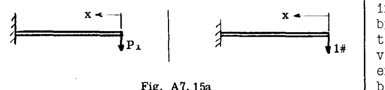

同様に、図 A7.15b のジョイント  $c$  に加えられた荷重  $P_c$ （実荷重または仮想荷重）に対する  $\partial S/\partial P_c$  は、示されているように単位荷重に対して与えられる。

実際には、単位荷重の使用が最も便利である。以下の表記を使用すると：
 $u = \frac{\partial S}{\partial P_i}, m = \frac{\partial M}{\partial P_i}, t = \frac{\partial T}{\partial P_i}, v = \frac{\partial V}{\partial P_i}, \bar{q} = \frac{\partial q}{\partial P_i}$ 

単位荷重に対して、たわみの式は次のようになる：

$$
\delta_i = \int \frac{Su dx}{AE} + \int \frac{Mm dx}{EI} + \int \frac{Tt dx}{GJ} + \int \frac{Vv dx}{AG} + \iint \frac{q \bar{q} dx dy}{Gt} \dots (18)
$$

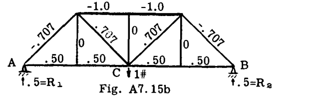

#### II - 仮想仕事の原理より
合力がゼロである力のシステム（平衡状態にあるシステム）が、平衡バランスを乱すことなく微小量変位したとき、行われる仕事はゼロである。当然、合力がゼロの力が距離を移動しても、仕事はゼロである。

今、図 A7.15(b) のトラスに適用された一連の平衡力を考えてみよう。このセットは2つの部分に分けることができる。「外部システム」は、たわみを求めたい点に適用された単位荷重と基準線を固定する2つの反力で構成され、「内部システム」は平衡を保つためにトラス部材に作用する軸荷重で構成される。後者は記号 " $u$ " で示される。この一連の力は、その後に続く主要な実荷重のセットが適用されている間の構造物の実際の挙動に影響を与えないほど十分に小さいと考えられる。この単位荷重セットは数学的な理由のみで存在し、「仮想荷重」または「ダミー荷重」と呼ばれる。

ここで、一連の実荷重の適用により構造物が変形し、仮想荷重がそれに「追従する」と仮定する。構造物の各部材は  $\Delta$  で示される変形を受ける $^\ast$ 。仮想荷重システムは、仮定により平衡状態（合力ゼロ）であるため、行われる仕事（「仮想仕事」）はゼロに等しい。あるいは、仮想荷重システムの分割を考慮すると、外部仮想荷重によって行われる仕事は、内部仮想荷重によって吸収される仕事に等しくなければならない。外部仮想力によって行われる仕事は、1ポンドにジョイント  $C$  でのたわみ  $\delta_c$  を乗じたものに等しく、反力  $R_1$  と  $R_2$  は移動しない。すなわち、
外部仮想仕事 =  $1^\# \times \delta_c$ 
内部仮想仕事は、構造全体にわたる部材の仮想荷重  $u$  と部材の歪み  $\Delta$  の積の合計である。すなわち、
内部仮想仕事 =  $\sum u \cdot \Delta$ 

これらの仕事を等置すると、
 $1 \times \delta_c = \sum u \cdot \Delta$ 

変形  $\Delta$  が実部材荷重  $S$  による弾性ひずみの結果である場合、各部材について  $\Delta = SL/AE$  であり、次が得られる：
 $\delta_c = \sum u \frac{SL}{AE}$ 

上記の議論は、実モーメント ( $M$ )、トルク ( $T$ )、せん断荷重 ( $V$ )、およびせん断流 ( $q$ ) による変形中に行われる仮想曲げモーメント ( $m$ )、ねじり荷重 ( $t$ )、せん断荷重 ( $v$ )、およびせん断流 ( $\bar{q}$ ) の内部仮想仕事を包含するように迅速に拡張できる。一般式は次のようになる：

$$
\delta_i = \int \frac{Su dx}{AE} + \int \frac{Mm dx}{EI} + \int \frac{Tt dx}{GJ} + \int \frac{Vv dx}{AG} + \iint \frac{q \bar{q} dx dy}{Gt} \dots (18)
$$

---

### A7.11
式 (18) を適用する際、たわみ計算の手間は便利にいくつかのステップに分けられる：

1. 実際の（実荷重）荷重分布 ( $S, M, T$  など) の計算
2. 求めたいたわみの点に適用され、基準点で反力を受ける単位（仮想）荷重による、単位（仮想）荷重分布 ( $u, m, t$  など) の計算
3. 柔軟性  $1/AE, 1/EI$  などの計算
4. 合計および/または積分

ここでも、「荷重」および「たわみ」という用語の一般的な性質に注意せよ。（A7.6 ページ参照）
以下の例題は、絶対的および相対的なたわみ（回転と移動の両方）の決定にダミー荷重法を適用したものである。

### 例題 13
図 A7.16 のピン結合トラスに、図示された外部荷重システムが作用している。部材荷重を図に示す。部材の特性は表 A7.3 に示されている。ジョイント  $G$  の垂直移動量とジョイント  $H$  の水平移動量を求めよ。

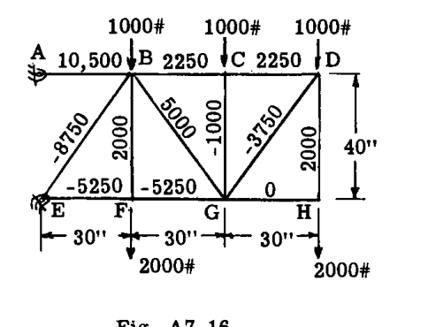

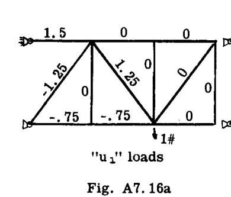
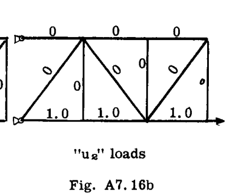

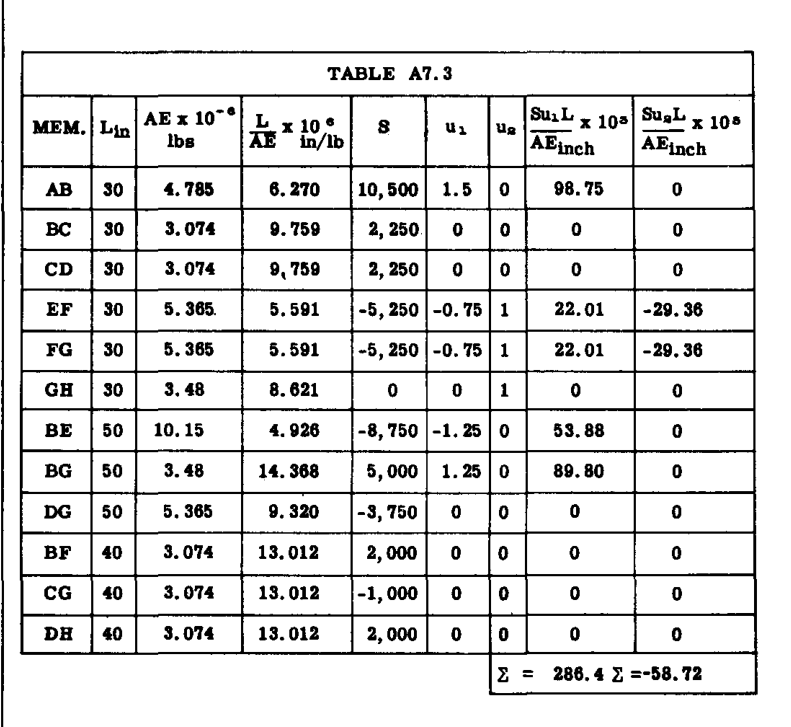

**解法:**

部材の軸荷重のエネルギーのみを考慮した。単位（仮想）荷重をジョイント  $G$  と  $H$  に順次適用した（図 A7.16a および A7.16b に示す通り）。すべての  $S$  および  $u$  荷重を表 A7.3 に記入し、 $\delta = \int \frac{Su dx}{AE}$  の計算は、トラス部材の  $SuL/AE$  項の合計を形成することによって行われた。すなわち、 $\delta = \sum \frac{SuL}{AE}$ 

**解答:**  $\delta_{G_{VER}} = 0.286"$ 
 $\delta_{H_{HOR}} = -0.0587"$  （負の符号は、図 A7.16b で単位荷重が右向きに描かれていたため、ジョイントが左に移動することを意味する）。

### 例題 14
図 A7.16 のトラスについて、ジョイントの以下の相対変位を求めよ：
c)  $C$  と  $F$  を結ぶ対角線の方向におけるジョイント  $C$  の移動。
d) ジョイント  $G$  の、点  $F$  と  $H$  を結ぶ線に対する相対移動。

相対たわみは、たわみが求められる点に単位（仮想）荷重を適用し、そのような単位荷重システムを運動の基準点によって支持することによって決定される。したがって、パート (c) の解決のために、図 A7.16c に示すような単位荷重システムが適用され、パート (d) のためには、図 A7.16d の単位荷重システムが使用された。表 A7.4 が解、実荷重、および部材の柔軟性 ( $L/AE$  は例題 13 と同じ) を完成させる。

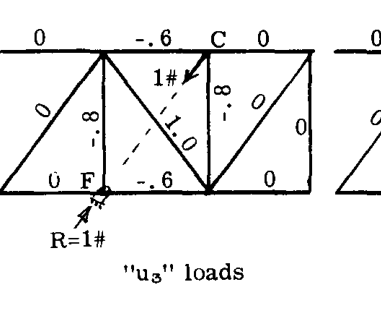
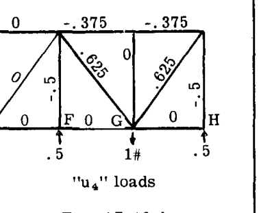

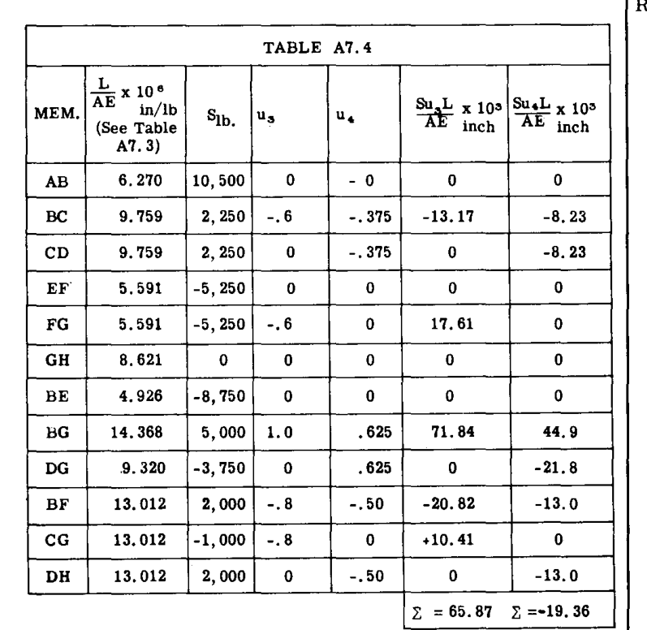

したがって、ジョイント  $c$  のジョイント  $F$  に向かう移動は  $\delta = .06587$  インチであり、ジョイント  $G$  の  $F$  と  $H$  を結ぶ線に対する移動は  $\delta = -.0194$  インチであった。負の符号は上向きの運動を示している。

### 例題 15
図 A7.16 のトラスについて、以下を決定せよ：
e) 部材  $DG$  の絶対回転量
f) 部材  $BG$  の部材  $CG$  に対する相対回転量

絶対回転と相対回転の両方は、回転を求めたい部材または構造物の部分に単位（仮想）モーメント（カップル）を適用することによって決定される。単位モーメントは、回転の基準線上に配置された反力によって抵抗される。したがって、図 A7.16e および A7.16f は、それぞれパート (e) および (f) の単位（仮想）荷重を示している。表 A7.5 が計算、実荷重、および部材の柔軟性 ( $L/AE$  は例題 13 と同じ) を完成させる。

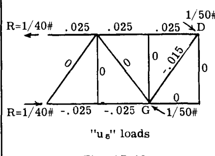
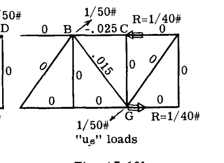

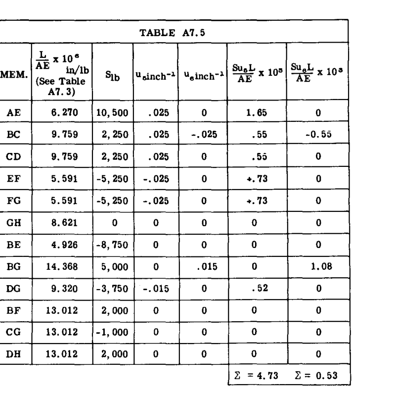

したがって、部材  $DG$  の絶対回転は  $\theta_{DG} = .00473$  ラジアンであり、 $BG$  の  $CG$  に対する回転は  $\theta_{BG-CG} = .00053$  ラジアンであった。

### 例題 16
集中荷重  $P$  を端部に受ける図 A7.17 の片持ち梁について、点  $C$  の垂直たわみを求めよ。また、 $C$  における弾性曲線の傾斜も求めよ。

**解法:**

$$
\delta_C = \int \frac{Mm dx}{EI}
$$

 $B$  を原点とすると：
 $M = -Px$  (図 A7.17)
仮想荷重に対して (図 A7.17a)：
 $m = 0, \text{ for } x < b$ 
 $m = -1(x - b), \text{ for } x > b$ 

したがって、 $Mmdx = -Px(-x + b)dx = (Px^2 - Pbx)dx$ 

ゆえに、

$$
\delta_C = \frac{P}{EI} \int_b^L (x^2 - bx) dx = \frac{P}{EI} \left[ \frac{x^3}{3} - \frac{bx^2}{2} \right]_b^L = \frac{P}{3EI} \left[ L^3 - \frac{3L^2b}{2} + \frac{b^3}{2} \right]
$$

もし  $b = 0$  ならば、 $\delta_B = PL^3/3EI$ 

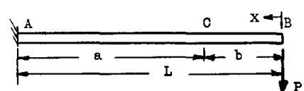
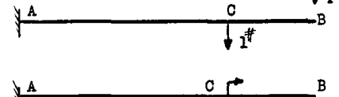
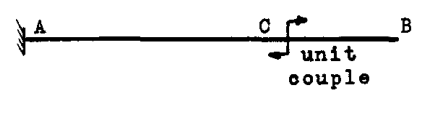

傾斜については：

$$
\theta_C = \int \frac{Mm dx}{EI}
$$

仮想荷重については図 A7.17b を参照：
 $m = 0, x < b, m = -1, x > b$ 
したがって、 $Mmdx = (-Px)(-1) dx = Px dx$ 

$$
\therefore \theta_C = \int \frac{Mmdx}{EI} = \frac{P}{EI} \int_b^L x dx = \frac{PL^2}{2EI} (L^2 - b^2)
$$

もし  $b = 0$  ならば、 $\theta_B = \frac{PL^2}{2EI}$ 

### 例題 17
図 A7.18 の等分布荷重を受けた片持ち梁について、梁の弾性曲線上の点  $C$  と  $E$  を結ぶ線に対する点  $D$  のたわみを求めよ。これは、航空工学における実際の問題の代表的なもので、 $AB$  が後方翼梁を表し、点  $C, D, E$  が補助翼やフラップの取り付け点を表す可能性がある。翼梁のたわみは、補助翼支持ブラケットを介して  $D$  に荷重を適用することにより、補助翼またはフラップ構造を曲げる。この力を知るためには、線  $CE$  に対する  $D$  点での翼梁のたわみを知る必要がある。

**解法:**

 $B$  を原点とする：

$$
M = 30x \cdot \frac{x}{2} = 15x^2
$$

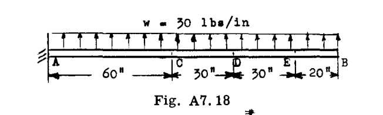
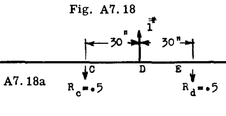

 $m = 0, x < 20$ 
 $m = -.5(x - 20) = -.5x + 10, \text{ when } x = 20 \text{ to } 50$ 
 $m = -.5(x - 20) + 1(x - 50) = .5x - 40, \text{ when } x = 50 \text{ to } 80$ 

$$
\delta_{D(CE)} = \int \frac{Mm dx}{EI} = \frac{1}{EI} \int_{20}^{50} 15x^2 (-.5x + 10) dx + \frac{1}{EI} \int_{50}^{80} 15x^2 (.5x - 40) dx
$$

$$
= \frac{1}{EI} \left[ \frac{-7.5x^4}{4} + \frac{150x^3}{3} \right]_{20}^{50} + \frac{1}{EI} \left[ \frac{7.5x^4}{4} - \frac{600x^3}{3} \right]_{50}^{80}
$$

$$
= \frac{10^6}{EI} [-11.72 + 6.25 + .300 - .400 + 76.8 - 102.4 - 11.72 + 25.0] = -\frac{17.9 \times 10^6}{EI}
$$

したがって、線  $CE$  を結ぶ線に対する点  $D$  のたわみは下向きである。なぜなら結果が負となり、仮想荷重の方向と反対になるからである。

### 例題 18

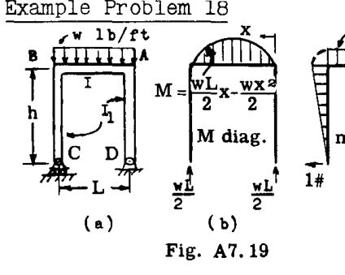
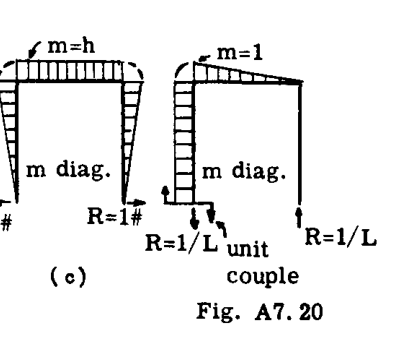

図 A7.19 のフレームと荷重について、点  $C$  の水平移動量を求めよ。また、線  $CD$  に対する  $C$  の回転角も求めよ。

**解法:**
図 b は与えられた荷重に対する静止モーメント曲線を示し、図 c は  $C$  に適用され  $D$  で抵抗される単位水平荷重に対する仮想モーメント図を示している。

$$
\delta_{C(H)} = \int \frac{Mm dx}{EI} ; M = \frac{wLx}{2} - \frac{wx^2}{2} ; m = h
$$
ゆえに

$$
\delta_C = \int_0^L \frac{(\frac{wLx}{2} - \frac{wx^2}{2})h dx}{EI} = \left[ \frac{wLx^2}{4} - \frac{wx^3}{6} \right]_0^L \frac{h}{EI} = \frac{whL^3}{12EI}
$$

 $C$  における回転角を求めるには、 $C$  と  $D$  に反力を持つ単位仮想モーメントを図 A7.20 のように  $C$  に適用する。

$$
\theta_C = \int_0^L \frac{Mm dx}{EI} = \frac{1}{EI} \int_0^L \left( \frac{wLx}{2} - \frac{wx^2}{2} \right) \frac{x}{L} dx = \frac{1}{EI} \int_0^L \left( \frac{wLx^2}{2L} - \frac{wx^3}{2L} \right) dx
$$

$$
= \frac{1}{EI} \left[ \frac{wx^3}{6} - \frac{wx^4}{8L} \right]_0^L = \frac{wL^3}{24EI}
$$

### 仮想仕事によるせん断に起因する梁の直線たわみ
一般的に言えば、梁のせん断たわみは曲げによるたわみに比べて小さく（比較的短い梁を除く）、そのため通常はたわみ計算では無視される。弾性係数を曲げの場合よりわずかに小さくし、曲げたわみの式を使用することで、密接な近似が行われることがある。

梁のせん断たわみの式は、前の導出と同じ推論から導かれる。せん断デトルージョン  $dy$ （図 A7.21）のみを考慮した仮想単位荷重システムの仮想仕事方程式は、 $1 \times \delta = v dy$  である。ここで  $v$  は点  $O$  における単位仮想荷重による断面のせん断であり、 $dy$  は任意の荷重システムまたは他の原因による要素  $dx$  のせん断デトルージョンである。

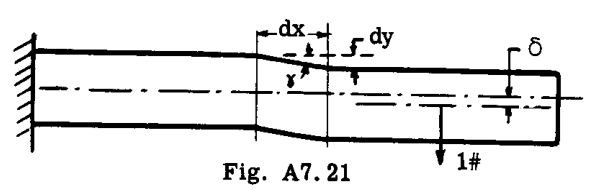

 $dy = \gamma dx$  および  $\gamma = \frac{V}{AE_s}$  である。ここで  $A$  は断面の断面積、 $E_s$  は剛性率である。また、せん断応力  $V/A$  は断面全体で均一であると仮定する。したがって、 $1 \times \delta = \int \frac{Vv dx}{AE_s}$ 。すると、梁のすべての要素のせん断滑りによる全たわみは次のように等しくなる：

$$
\delta_{total} = \int_0^L \frac{Vv dx}{AE_s} \dots (a)
$$

ここで  $V$  は実荷重による任意の断面におけるせん断、 $v$  はたわみを求めたい点に求めたい方向に作用する単位仮想荷重による任意の断面におけるせん断である。単位仮想荷重に対する反力は、たわみの基準線を固定する。

 $A$  は断面積、 $E_s$  は剛性率である。式 (a) は、せん断応力が断面全体で均一ではない（例：矩形断面では放物線状）ため、わずかに誤差がある。しかし、平均せん断応力を使用することで密接な結果が得られる。
単位長さあたり  $w$  の等分布荷重の場合、単純支持梁の中央のたわみは：

$$
\delta_{center} = 2 \int_0^{L/2} \frac{Vv dx}{AE_s} = 2 \int_0^{L/2} \frac{(\frac{wL}{2} - wx) \cdot \frac{1}{2}}{AE_s} dx = \frac{wL^2}{8AE_s}
$$

単純支持梁に等分布荷重がかかった場合の曲げたわみは  $\frac{5wL^4}{384EI}$  である。ゆえに、

$$
\frac{\frac{wL^2}{8AE_s}}{\frac{5wL^4}{384EI}} = 24 \left( \frac{r}{L} \right)^2, E_s = .4E \text{ を使用}, r = \text{回転半径}
$$

I形鋼やチャンネル鋼の場合、 $r$  は約  $1/2 d$  である。矩形断面の場合は  $r = d/\sqrt{12}$  （ $d$  = 深さ）。航空機構造では  $d/L$  の比が  $1/12$  を超えることはめったにない。したがって、曲げたわみに対するせん断たわみの割合は、I形鋼セクションで  $d/L$  比が  $1/12$  の場合に 4.1%、矩形セクションで 1.4% である。

### 例題 19
図 A7.22 の梁について、自由端  $A$  のせん断変形による垂直たわみを求めよ。せん断応力は断面全体で均一とし、 $AE_s$  は一定とする。

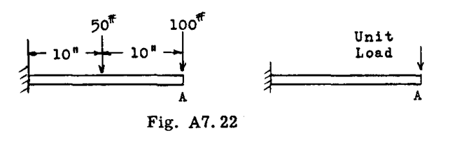

**解法:**
 $\delta_A = \int \frac{Vv dx}{AE_s}$ 
 $x = 0$  から 10 では  $V = 100^\#$ 
 $x = 10$  から 20 では  $V = 150^\#$ 
 $x = 0$  から 20 では  $v = 1$ 

ゆえに

$$
\delta_A = \frac{1}{AE_s} \int_0^{10} 100 \cdot 1 dx + \frac{1}{AE_s} \int_{10}^{20} 150 \cdot 1 dx = \frac{1}{AE_s} [100x]_0^{10} + \frac{1}{AE_s} [150x]_{10}^{20} = \frac{2500}{AE_s}
$$

### 円形棒のねじりに適用される仮想仕事法
ねじりモーメントによる円形軸のねじれ角は、曲げやせん断力によるたわみを求めるための前の記事で使用されたものと同様の推論によって見つけることができる。得られる式は以下の通りである：

$$
\delta = \int \frac{Tt dx}{E_s J} \dots (A)
$$

$$
\theta = \int \frac{Tt dx}{E_s J} \dots (B)
$$

式 (A) において、直線移動（変位）については：
 $T$  = 加えられたねじり力による任意の断面におけるねじりモーメント。
 $t$  = たわみを求めたい点に、求めたい変位の方向に適用された仮想単位荷重（1 lb.）による任意の断面におけるねじりモーメント。(in lbs/lb)
 $E_s$  = 材料のせん断弾性係数（"G" とも呼ばれる）。
 $J$  = 円形断面の極慣性モーメント。

式 (B) において、回転変位については：
 $\theta$  = 軸線に垂直な平面内の加えられたねじりモーメントによるねじれ角。ラジアン単位。
 $t$  = ねじれ角を求めたい断面に作用し、求めたい変位の平面内で作用する単位仮想モーメント（カップル）による任意の断面におけるねじりモーメント。(inch lbs/inch lb)

### 例題 20
図 A7.23 は、 $XY$  平面にある片持ちのランディングギア支柱・車軸ユニット  $ABC$  を示している。1000ポンドの荷重が、 $XY$  平面に垂直な点  $A$  で車軸に適用される。 $XY$  平面に垂直な点  $A$  のたわみを求めよ。支柱と車軸は管状で一定の断面であると仮定する。

**解法:**
図示された荷重は、支柱・車軸ユニットの曲げとねじれの両方を引き起こす。まず、1000ポンドの荷重による車軸と支柱の曲げおよびねじりモーメントを求める。

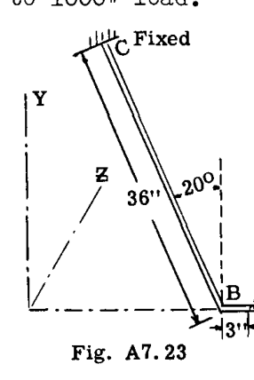
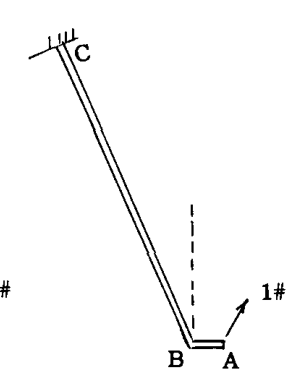

$$
\delta = \int \frac{Mm dx}{EI} + \int \frac{Tt dx}{E_s J}
$$

部材  $AB$ :  $M = 1000x, (x = 0 \text{ to } 3), T = 0$ 
部材  $BC$ :  $M_{BC} = 3000 \sin 20^\circ + 1000x, (x = 0 \text{ to } 36), T_{BC} = 3000 \cos 20^\circ \text{ (BとCの間で一定)}$ 

次に、図 A7.24 に示すように、 $XY$  平面に垂直な  $A$  に単位  $1^\#$  の力を加え、この  $1^\#$  の力による曲げおよびねじりモーメントを求める。

部材  $AB$ :  $m = 1 \cdot x = x, (x = 0 \text{ to } 3), t = 0$ 
部材  $BC$ :  $m = 3 \sin 20^\circ + 1 \cdot x, (x = 0 \text{ to } 36), t = 3 \cos 20^\circ \text{ (BとCの間で一定)}$ 

代入すると：

$$
\delta = \frac{1}{EI} \int_0^3 1000x \cdot x dx + \frac{1}{EI} \int_0^{36} (1000x + 1026)(x + 1.026) dx + \frac{1}{E_s J} \int_0^{36} (2820)(2.82) dx
$$

$$
= \frac{1}{EI} \left[ \frac{1000}{3} x^3 \right]_0^3 + \frac{1}{EI} \int_0^{36} (1000x^2 + 2052x + 1052.6) dx + \frac{1}{E_s J} [7952.4]_0^{36}
$$

$$
= \frac{1}{EI} (16,925,000) + \frac{1}{E_s J} (286,200)
$$

注：実際のランディングギア支柱は、変数  $I$  および  $J$  を伴うテーパーまたは補強セクションを含み、積分はグラフィックまたは数値的に行う必要があるだろう。

### 例題 21
図 A7.25 の薄肉アルミニウム梁について、図示された荷重下での点  $G$  のたわみを求めよ。ストリンガーの断面積は図に示されている。

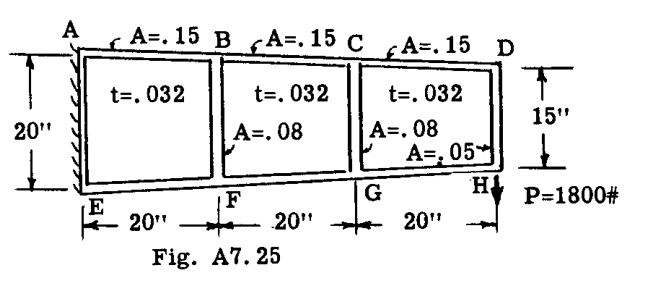

**解法:**
ウェブは座屈せず、せん断のみを負担すると仮定した。図 A7.26 は、静力学によって決定された内部実荷重を示す梁の展開図である。

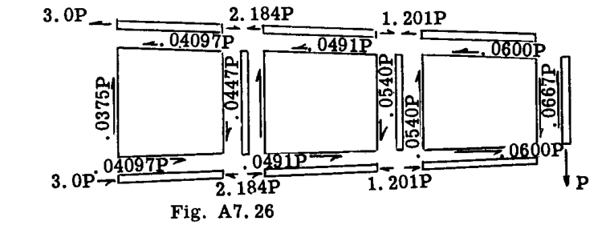

ウェブパネルの（ほぼ）水平な縁に示されているせん断流は平均値である。図 A7.27 は、単位（仮想）荷重を示す梁の展開図である。

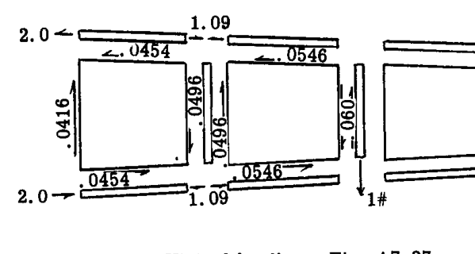

軸荷重とせん断流の両方が考慮されたため、たわみ式の形式は次のようになった：

$$
\delta_G = \sum \frac{SuL}{AE} + \iint \frac{q \bar{q} dx dy}{Gt}
$$

フランジの積分は、荷重の線形変化を仮定して行われた。実荷重が  $S_i$  から  $S_j$  まで変化し、仮想荷重が  $u_i$  から  $u_j$  まで変化する長さ  $L$  の均一なフランジにわたって行われるこのような積分は、次をもたらす：

$$
\int_0^L \frac{Su dx}{AE} = \frac{L}{AE} \left( \frac{S_i u_i}{3} + \frac{S_j u_j}{3} + \frac{S_i u_j}{6} + \frac{S_j u_i}{6} \right)
$$

台形シートパネルの積分は、（ほぼ）水平な側のせん断流を平均値として使用し、パネル全体で一定であると仮定して行われた。この簡略化により：

$$
\iint \frac{q_{AV} \bar{q}_{AV} dx dy}{Gt} = q_{AV} \bar{q}_{AV} \frac{S}{Gt}
$$

ここで  $S$  はパネルの面積である。計算は表 A7.6 で完了した。

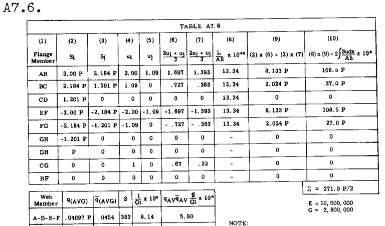

$$
\delta_G = \frac{(271.0 + 13.4) P \times 10^{-6}}{2} = .147 (1800) 10^{-3} \text{ in} = .265 \text{ in.}
$$

### A7.8 熱ひずみによるたわみ
ダミー荷重たわみ式の「仮想仕事の導出」で述べたように、構造物の実際の内部ひずみは、熱的影響を含むいかなる原因によるものであってもよい。したがって、構造物の温度分布と熱的特性がわかれば、ダミー荷重法は熱たわみを計算するための容易な手段を提供する。

### 例題 22
図 A7.28 に示す定常状態の温度分布をもたらす、固定端への加熱による均一な棒の自由端の軸方向移動量を求めよ。材料特性は温度の関数ではないと仮定せよ。

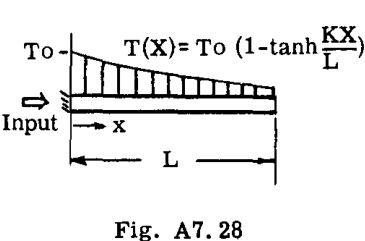

**解法:**
棒材料の熱膨張係数は  $\alpha$  であった。したがって、長さ  $dx$  の棒要素は  $\Delta = \alpha \cdot T \cdot dx$  の熱変形を受けた。棒の端に単位荷重を適用すると  $u = 1$  が得られた。したがって、

$$
\delta = \int u \cdot \alpha \cdot T \cdot dx = \alpha T_o \int_0^L (1 - \tanh \frac{Kx}{L}) dx = \alpha T_o L \left[ 1 - \frac{1}{K} (\ln \cosh K) \right]
$$

### 例題 23
図 A7.29a の理想化された2フランジ片持ち梁において、上部フランジが下部フランジの温度よりも高い温度  $T$  まで、スパン全体にわたって均一に急速加熱される。その結果生じる自由端の変位を求めよ。

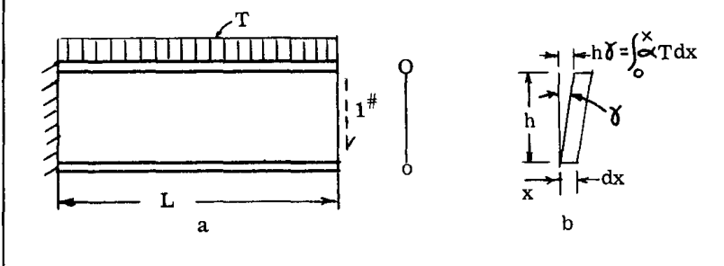

**解法:**
上部フランジ（添え字  $U$ ）の微小要素の軸変形は  $\Delta_U = \alpha T dx$  で与えられると仮定された。ここで  $\alpha$  は材料の熱膨張係数である。加熱を受けていない下部フランジは膨張しなかった。
熱膨張はすべての方向で均一であるため、材料要素にせん断ひずみは発生しない。したがって、ウェブにはせん断ひずみは発生しない。ここでの明らかな異常（ウェブ要素がせん断変形  $\gamma = \frac{\alpha Tx}{h}$  （図 A7.29b）を受けるように見えること）は、次のように説明される：温度は梁の深さにわたって線形に変化する。したがって、さまざまな水平方向の梁「ファイバー」は、図 A7.29b のように線形に変化する軸変形を受け、見かけのせん断変形をもたらす。ウェブには軸方向の仮想応力は伝達されないため、このウェブ変形中に仮想仕事は行われない。
自由端に単位（仮想）荷重を加えると、フランジに得られた仮想荷重は次の通りであった：

$$
u_U = \frac{L - x}{h} (= -u_L)$$

すると、たわみ方程式は：

$$
\delta = \int u_U \Delta_U + \int u_L \Delta_L = \int_0^L \frac{L - x}{h} \cdot \alpha T dx + 0 = \frac{\alpha T L^2}{2h}
$$

### 例題 24
閉じたリング（3次の不静定）の熱応力を計算する最初のステップは、リングを切断して静定にし、2つの切断端の相対移動を求めることである。
図 A7.30a は、内面が外面よりも温度  $T$  だけ高く加熱された均一な円形リングを示している。温度は円周方向で一定であり、...