$$\therefore \delta_G = \frac{(271.0 + 13.4) P \times 10^{-6}}{2} = .147 (1800) 10^{-3} \text{ in} = .265 \text{ in.}$$

# A7.8 熱ひずみによるたわみ

ダミー単位荷重法によるたわみ方程式の「仮想仕事の導出」で述べたように、構造物の実際の内部ひずみは、熱的影響を含むあらゆる原因によるものであり得る。したがって、構造物の温度分布と熱特性が既知であれば、ダミー単位荷重法は熱たわみを計算するための容易な手段を提供する。

### 例題 22
固定端への熱適用により、Fig. A7.28 に示す定常状態の温度分布が生じた場合の、一様な棒の自由端における軸方向の移動を求めよ。材料特性は温度の関数ではないと仮定する。

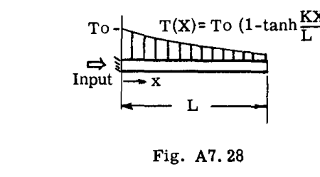

 $T = \text{周囲温度を超える温度}$ 
 $T(X) = T_0 (1 - \tanh \frac{KX}{L})$ 
 $K = \text{熱特性と熱添加率に依存する実験定数}$ 

**解：**

棒材料の熱膨張係数を  $\alpha$  とする。長さ  $dx$  の棒要素は、 $\Delta = \alpha \cdot T \cdot dx$  の熱変形を受ける。棒の端に単位荷重を適用すると  $u = 1$  となる。したがって、

$$\delta = \int u \cdot \alpha \cdot T \cdot dx = \alpha T_0 \int_0^L (1 - \tanh \frac{KX}{L}) dx$$

$$= \alpha T_0 L \left[ 1 - \frac{1}{K} (\ln \cosh K) \right]$$

### 例題 23
Fig. A7.29a の理想化された 2 フランジ片持ち梁において、上部フランジが下部フランジよりも高い温度  $T$ （スパン方向に一様）まで急速に加熱される。自由端の変位を求めよ。

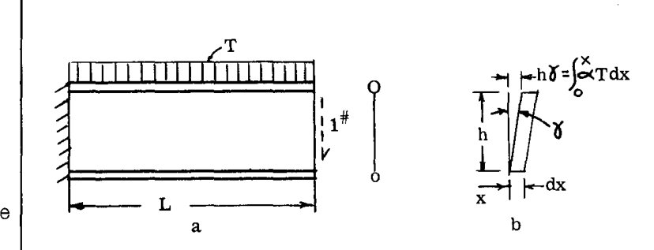

**解：**

上部フランジ（添字  $U$ ）の微分要素の軸方向変形は  $\Delta_U = \alpha T dx$  で与えられると仮定した。ここで  $\alpha$  は材料の熱膨張係数である。加熱されていない下部フランジは膨張しなかった。

熱膨張は全方向に一様であるため、材料要素にせん断ひずみは発生しない。したがって、ウェブにはせん断ひずみは発生しない。ここでの見かけ上の矛盾——ウェブ要素がせん断変形  $\gamma = \frac{\alpha Tx}{h}$  (Fig. A7.29b) を受けるように見えること——は次のように説明される：温度は梁の深さ方向にわたって線形に変化する。したがって、さまざまな水平方向の梁「ファイバー」は、Fig. A7.29b のように線形に変化する軸方向変形を受け、見かけ上のせん断変形を与える。ウェブでは軸方向の仮想応力は負担されないため、このウェブ変形中に仮想仕事は行われない。

自由端に単位（仮想）荷重を加えると、フランジに得られる仮想荷重は次の通りであった：

$$u_U = \frac{L - x}{h} (= -u_L)$$

すると、たわみ方程式は次のようになる：

$$\delta = \int u_U \Delta_U + \int u_L \Delta_L = \int_0^L \frac{L - x}{h} \cdot \alpha T dx + \int 0$$

$$\delta = \frac{\alpha T L^2}{2h}$$

### 例題 24
閉じたリング（3 次不静定）の熱応力を計算する最初のステップは、リングを切断して静定にし、2 つの切断面の相対移動を求めることである。

Fig. A7.30a は、内面が外面よりも高い温度  $T$  まで加熱された一様な円形リングを示している。温度は円周方向には一定であり、断面の深さ方向には線形に変化すると仮定される。Fig. A7.30b に示す切断面の相対移動を求めよ。

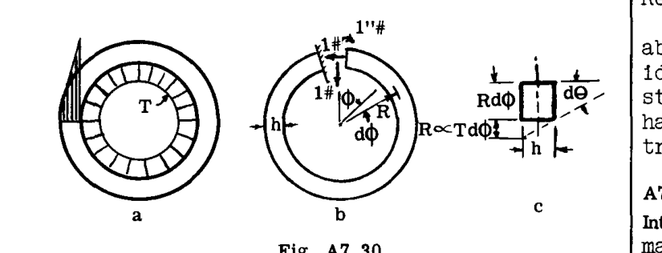

**解：**

長さ  $Rd\phi$  の梁の要素を Fig. A7.30c に示す。線形な温度変化により、要素には角度変化  $d\theta = \frac{R\alpha T}{h} d\phi$  が生じた。断面の中央線（図心）の長さの変化は  $\Delta = \frac{R\alpha T}{2} d\phi$  であった。Fig. A7.30b に示すように切断面に単位冗長荷重を適用し、リング周囲の以下の単位荷重を得た。

単位冗長モーメント (X) より
 $m_x = 1$  （リングを開こうとする場合に正）
 $u_x$  （軸荷重）  $= 0$  （引張を正とする）

単位冗長軸（水平）荷重 (Y) より
 $m_y = -R(1 - \cos \phi)$ 
 $u_y = \cos \phi$ 

単位冗長せん断（垂直）荷重 (Z) より
 $m_z = -R \sin \phi$ 
 $u_z = -\sin \phi$ 

ダミー単位荷重法によるたわみ方程式は：

$$\delta = \int u \cdot \Delta + \int m \cdot d\theta$$

すると、

$$\delta_x = \int_0^{2\pi} 0 \cdot \Delta + \int_0^{2\pi} 1 \cdot \frac{R\alpha T}{h} d\phi = 2\pi \frac{R\alpha T}{h}$$

$$\delta_y = \int_0^{2\pi} \cos \phi \frac{R\alpha T}{2} d\phi + \int_0^{2\pi} (-) R(1 - \cos \phi) \frac{R\alpha T}{h} d\phi$$

$$= - \frac{2\pi R^2 \alpha T}{h} \text{ (負の符号は右方向への移動を示す)}$$

$$\delta_z = \int_0^{2\pi} (-\!\sin \phi) \frac{R\alpha T}{2} d\phi + \int_0^{2\pi} (-R \sin \phi) \frac{R\alpha T}{h} d\phi = 0$$

**備考：**
上記の 3 つの初等的な例では、理想化によって荷重が加わっていない状態で応力が発生しない静定構造が得られたため、応力は発生しなかった。不静定構造については第 A.8 章で扱う。

# A7.9 たわみ計算における行列法

**序論：** 複雑な構造物の応力およびたわみ計算の過程で生じる多量のデータを扱うには、行列法の使用を強く推奨する。データは高速デジタルコンピュータの日常的な計算手順での使用に適した形式で提示される。プログラムの単純な拡張によって追加の関連問題の解決を可能にする柔軟性が備わっている。表記法自体が、理論的アプローチと作業分担の両方において、新しく改善された方法を示唆している。

ここで、および以降で採用されている方法と表記法は、本質的に Wehle と Lansing がダミー単位荷重法を行列表記に適応させる際に提示したものである。その他の適切な参考文献は参考文献リストに記載されている。

### 行列計算の基礎
解析対象の構造物が、集中荷重  $P_m$  または  $P_n$ （それぞれ異なる数値を持つ）として加えられる外力が作用する、ロッド、バー、チューブ、およびパネル（シート）のトラスのような組立構造に理想化されていると仮定する。

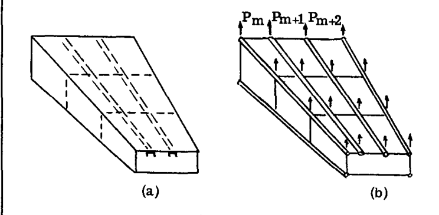

下付き文字。したがって、Fig. A7.31a のシステムは Fig. A7.31b のものに理想化される。

上記の理想化により、たわみ計算を体系化するための改善された手法が採用される。以下のステップは、以降のセクションで詳細に説明される手順を要約したものである。

I. 内部応力分布を記述するために、 $q_i$  または  $q_j$ （ $i, j$  は異なる数値の添字）で表される一連の**内部一般化力**を使用する。 $q$  は軸荷重、モーメント、せん断力などを表す。部材柔軟性係数  $a_{ij}$  のセットと組み合わせて、 $q$  はひずみエネルギー  $U$  を表現するために使用される。 $a_{ij}$  は、点  $j$  における単位力あたりの点  $i$  の変位を与える。*

II. 内部一般化力  $q_i, q_j$  を外部荷重  $P_m$  または  $P_n$  に関連付けるために、つり合い条件を使用する。この関係を用いて、I で得られたひずみエネルギー式を変換し、 $P$  の関数としての  $U$  を得る。

III. カスティリアノの定理を使用してたわみを計算する。

### 一般化力の選択
例えば、Fig. A7.32a の段付き片持ち梁の（曲げの）ひずみエネルギーを書く問題を考える。外力は A および B に横方向の集中荷重として加えられるものとする。Fig. A7.32b の内部一般化力のセットは、梁要素内の曲げモーメント分布を完全に決定し、したがってひずみエネルギーを決定する。したがって、セット (b) は一般化力の適切な選択である。

セット (b) が唯一のセットではないことに注意すべきである。その他の適切な選択（すべてではない）が Fig. A7.32c, d, e に示されている。最終的な選択は、利便性や個人の好みに基づいて行うことができる。

各要素における重要な荷重を決定するために必要な数だけの一般化力を使用することに注意せよ。

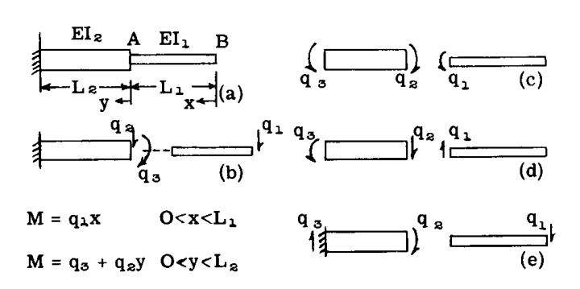

# ひずみエネルギー (THE STRAIN ENERGY)

次に、ひずみエネルギーを  $q$  の関数として記述したい。例題を続けて、次のように書く：

$$U = \int_0^{L_1} \frac{M^2 dx}{2EI_1} + \int_0^{L_2} \frac{M^2 dy}{2EI_2}$$

$$= \frac{1}{2} q_1^2 \int_0^{L_1} \frac{x^2 dx}{EI_1} + \frac{1}{2} q_2^2 \int_0^{L_2} \frac{y^2 dy}{EI_2}$$

$$+ 2 \times \frac{1}{2} q_2 q_3 \int_0^{L_2} \frac{y dy}{EI_2} + \frac{1}{2} q_3^2 \int_0^{L_2} \frac{dy}{EI_2}$$

上記の式の各積分項は、構造要素の特性（ $EI$  の変化）および関連する一般化力の性質（変数の指数）であることがわかる。表記法を導入すると：

$$a_{11} \equiv \int_0^{L_1} \frac{x^2 dx}{EI_1} \quad a_{22} \equiv \int_0^{L_2} \frac{y^2 dy}{EI_2}$$

$$a_{23} \equiv \int_0^{L_2} \frac{y dy}{EI_2} \quad a_{33} \equiv \int_0^{L_2} \frac{dy}{EI_2}$$

ひずみエネルギーは次のようになる：

$$U = \frac{1}{2} q_1^2 a_{11} + \frac{1}{2} q_2^2 a_{22} + 2 \times \frac{1}{2} q_2 q_3 a_{23} + \frac{1}{2} q_3^2 a_{33} \quad \dots (19)$$

式 (19) は、物理的考察から直ちに記述できたはずの  $U$  の式である。各係数  $a_{ij}$  は、点  $j$  における単位力の変化あたりの点  $i$  における変位である。この恒等式は、式 (19) にカスティリアノの定理を適用することで容易に理解できる。この解釈により、式 (19) の最初の項は、外側の梁部分に蓄えられたひずみエネルギーを表し、Art. A7.3 の式 (2) ( $U = \frac{1}{2} \frac{S^2 L}{AE}$ ) との類似性によって記述される。残りの 3 つの項は、内側の梁セグメントに  $q_2$  および  $q_3$  によって蓄えられたエネルギーを表しており、一方の力が他方に及ぼす交差影響（「 $a_{23} q_2 q_3$ 」項）を適切に考慮して、同様に容易に記述される。

次の点に注意せよ：

$$a_{ij} = \frac{\partial^2 U}{\partial q_i \partial q_j} = \frac{\partial^2 U}{\partial q_j \partial q_i} = a_{ji} \quad \dots (20)$$

したがって、 $a_{ij} = a_{ji}$  （マクスウェルの相反定理）。

ひずみエネルギー表現の一般形式は次のようになる（式 (19) を帰納法により展開）：

$$2U = q_1 q_1 a_{11} + q_1 q_2 a_{12} + \dots + q_1 q_N a_{1N}$$
$$+ q_2 q_1 a_{21} + q_2 q_2 a_{22} + \dots$$
$$+ q_3 q_1 a_{31} + q_3 q_2 a_{32} + \dots$$
$$+ q_N q_1 a_{N1} + \dots + q_N q_N a_{NN}$$

行列表記では、この方程式は次のように記述される（付録参照）：

$$2U = \begin{bmatrix} q_1 & q_2 & \dots & q_N \end{bmatrix} \begin{bmatrix} a_{11} & a_{12} & \dots & a_{1N} \\ a_{21} & a_{22} & \dots & \\ \vdots & & & \vdots \\ a_{N1} & & & a_{NN} \end{bmatrix} \begin{Bmatrix} q_1 \\ q_2 \\ \vdots \\ q_N \end{Bmatrix} \quad \dots (21)$$

または、より簡潔に、

$$2U = \lfloor q_j \rfloor \left[ a_{ij} \right] \{ q_j \}$$

行列  $[a_{ij}]$  では、要素の多く（すべてではないにせよ）がゼロである。具体的な例では、式 (21) は次のように記述される：

$$2U = \begin{bmatrix} q_1 & q_2 & q_3 \end{bmatrix} \begin{bmatrix} a_{11} & 0 & 0 \\ 0 & a_{22} & a_{23} \\ 0 & a_{32} & a_{33} \end{bmatrix} \begin{Bmatrix} q_1 \\ q_2 \\ q_3 \end{Bmatrix}$$

さまざまな  $a_{ij}$  の計算と集計の問題については、後ほど詳細に検討する。

### 内部一般化力と外部荷重の関連付け
本章で検討する静定構造物の場合、内部荷重は静定つり合い方程式を用いて外部荷重に関連付けられる。一連の線形方程式が得られる。したがって、検討した具体的な例で、 $P_1$  および  $P_2$  が Fig. A7.32f に示すように加えられた外部荷重である場合、静定条件により（Fig. A7.32b を参照）：

 $Q_1 = P_1$ 
 $Q_2 = P_1 + P_2$ 
 $Q_3 = P_1 L_1$ 

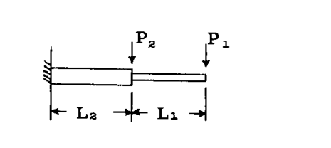

行列表記では：

$$\begin{Bmatrix} q_1 \\ q_2 \\ q_3 \end{Bmatrix} = \begin{bmatrix} 1 & 0 \\ 1 & 1 \\ L_1 & 0 \end{bmatrix} \begin{Bmatrix} P_1 \\ P_2 \end{Bmatrix}$$

記号的には、これらの関係は次のように記述される：

$$\{ q_i \} = [G_{im}] \{ P_m \} \quad \dots (22)$$

行列  $[G_{im}]$  は「単位荷重分布」と呼ばれ、 $[G_{im}]$  の任意の 1 つの列、例えば第  $m$  列は、荷重  $P_m$  の単位値に対する一般化力（ $q$ ）の値を与え、他のすべての外部荷重はゼロである。

### 外部荷重によるひずみエネルギー
式 (22) とその転置を行列式 (21) の  $q_i$  に代入すると、次のようになる：

$$2U = \lfloor P_m \rfloor [G_{mi}] [a_{ij}] [G_{jn}] \{ P_n \} \quad \dots (23)$$

ここでの表記では、 $i$  と  $j$  は  $m$  と  $n$  と同様に互換的に使用される。また、 $[G_{mi}]$  は  $[G_{im}]$  の転置であり、すなわち添字の入れ替えは転置を意味する（付録参照）。

式 (23) の行列の三連積が形成され、次のように定義される場合：

$$[A_{mn}] \equiv [G_{mi}] [a_{ij}] [G_{jn}] \quad \dots (24)$$

すると、

$$2U = \lfloor P_m \rfloor [A_{mn}] \{ P_n \} \quad \dots (25)$$

式 (25) は、外部荷重の関数としてひずみエネルギーを表している。使用されている具体的な例では：

$$[A_{mn}] \equiv \begin{bmatrix} 1 & 1 & L_1 \\ 0 & 1 & 0 \end{bmatrix} \begin{bmatrix} a_{11} & 0 & 0 \\ 0 & a_{22} & a_{23} \\ 0 & a_{32} & a_{33} \end{bmatrix} \begin{bmatrix} 1 & 0 \\ 1 & 1 \\ L_1 & 0 \end{bmatrix}$$

### カスティリアノの定理によるたわみ
カスティリアノの定理を式 (25) に適用すると、

$$\left\{ \frac{\partial U}{\partial P_m} \right\} = \{ \delta_m \} = [A_{mn}] \{ P_n \} \quad \dots (26)$$

が得られる。

式 (26) への移行手順は、例えば 3 つの荷重のセット ( $m, n = 1, 2, 3$ ) に対して式 (25) を書き出し、 $P_1, P_2, P_3$  で順次微分し、再び行列形式にまとめることで容易に実証できる。

行列  $[A_{mn}]$  は、荷重  $P_n$  の単位値に対する外部点  $m$  におけるたわみを与え、したがって定義により、**影響係数行列**である。

### ダミー単位荷重法方程式との比較
式 (26) を次のように書き出すことは有益である：

$$\{ \delta_m \} = [G_{mi}] [a_{ij}] [G_{jn}] \{ P_n \} \quad \dots (26a)$$

そして、これをダミー単位荷重法の方程式の典型的な項、例えば  $\delta = \sum u \frac{SL}{AE}$  と比較する。行列方程式 (26a) において、 $[G_{mi}]$  は単純な和における記号「 $u$ 」に対応する単位（仮想）行列である。 $[a_{ij}]$  は  $\frac{L}{AE}$  に対応する部材柔軟性である。行列積  $[G_{jn}] \{ P_n \}$  は、実際の加えられた荷重による部材荷重分布を与え、したがってこれらは「 $S$ 」荷重である。最後に行列乗算の操作自体が、計算を完了するための総和を与える。

この最後の議論から、行列表記でダミー単位荷重法方程式 (Art. A7.7) を定式化することによっても、式 (26a) が導出され得ることが明らかである。

これまでに提示された行列法の適用を説明するために、すでに開発されたツールを使用して、簡潔で初等的な例題を解く。

### 例題 25
Fig. A7.33 の一様な片持ち梁の、示された 3 つの点における横荷重に対する影響係数行列を求めよ。

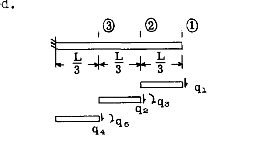

**解：**

一般化力の選択と番号付けを図に示す。これらの力は、以前に導出された  $a$  の式が使用できるように配置された。以下の部材柔軟性係数が計算された。混合添字（ $i 
eq j$ ）の非ゼロ係数は、要素に共通の荷重に対するものであることに注意せよ。

$$a_{11} = \int_0^{L/3} \frac{x^2 dx}{EI} = \frac{L^3}{81EI} = a_{22} = a_{44}$$

この式は、先行する説明用例題の片持ち梁セグメントの横せん断力に対して開発されたものから採用された。

$$a_{33} = a_{55} = \int_0^{L/3} \frac{dy}{EI} = \frac{L}{3EI}$$

この式は、片持ち梁セグメント（長さ  $L/3$ ）の端部におけるモーメントに対するものである。

$$a_{23} = a_{45} = \int_0^{L/3} \frac{y dy}{EI} = \frac{L^2}{18EI}$$

この式は、片持ち梁セグメントにおけるモーメントとせん断力の交差影響に対するものである。行列形式にまとめると、

$$[a_{ij}] = \frac{L^3}{3EI} \begin{bmatrix} \frac{1}{27} & 0 & 0 & 0 & 0 \\ 0 & \frac{1}{27} & \frac{1}{6L} & 0 & 0 \\ 0 & \frac{1}{6L} & \frac{1}{L^2} & 0 & 0 \\ 0 & 0 & 0 & \frac{1}{27} & \frac{1}{6L} \\ 0 & 0 & 0 & \frac{1}{6L} & \frac{1}{L^2} \end{bmatrix}$$

単位荷重行列  $[G_{im}]$  は、点 1、2、および 3 に順次単位荷重を加え、静定条件によって  $q$  の値を計算することで求められた。

$$[G_{im}] = \begin{bmatrix} 1 & 0 & 0 \\ 1 & 1 & 0 \\ L/3 & 0 & 0 \\ 1 & 1 & 1 \\ 2L/3 & L/3 & 0 \end{bmatrix}$$

 $[G_{im}]$  の最初の列は、他の荷重を加えずに点 "1" における単位荷重に対して得られた  $q$  の値を与えることに注意せよ。第 2 列は点 "2" のみの単位荷重に対する  $q$  の値を与え、以下同様である。

最後に、

$$[A_{mn}] = \frac{L^3}{3EI} \begin{bmatrix} 1 & 1 & L/3 & 1 & 2L/3 \\ 0 & 1 & 0 & 1 & L/3 \\ 0 & 0 & 0 & 1 & 0 \end{bmatrix} \times \dots \text{ (中間行列積)}$$

乗算すると（付録参照）、

$$[A_{mn}] = \frac{L^3}{162EI} \begin{bmatrix} 54 & 28 & 8 \\ 28 & 16 & 5 \\ 8 & 5 & 2 \end{bmatrix}$$

3 つの点におけるたわみを求める場合は、次のような形式をとる：

$$\begin{Bmatrix} \delta_1 \\ \delta_2 \\ \delta_3 \end{Bmatrix} = \frac{L^3}{162EI} \begin{bmatrix} 54 & 28 & 8 \\ 28 & 16 & 5 \\ 8 & 5 & 2 \end{bmatrix} \begin{Bmatrix} P_1 \\ P_2 \\ P_3 \end{Bmatrix}$$

式 (26) の通りである。行列  $[A_{mn}]$  は、マクスウェルの相反定理  $A_{mn} = A_{nm}$  (式 (20) 参照) により、主対角線に関して対称であることがわかる。

# A7.10 部材柔軟性係数：ライブラリの作成

さまざまな部材や荷重に対して、いくつかの部材柔軟性係数を以下に導出する。より包括的なリストは、前述の Wehle と Lansing の論文にある。

### 棒 (BARS)
変化する軸力下の一様な棒 (Fig. A7.34) のエネルギーは：

$$U = \frac{1}{2AE} \int_0^L \left[ q_i + \frac{q_j - q_i}{L} x \right]^2 dx$$

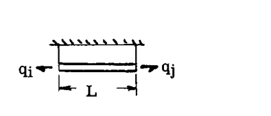

すると、式 (20) を参照して、

$$a_{11} = \frac{\partial^2 U}{\partial q_i^2} = \frac{1}{AE} \int_0^L \left( 1 - \frac{x}{L} \right)^2 dx = \frac{L}{3AE} (= a_{jj})$$

および、

$$a_{ij} = \frac{\partial^2 U}{\partial q_i \partial q_j} = \frac{1}{AE} \int_0^L \frac{x}{L} \left( 1 - \frac{x}{L} \right) dx = \frac{L}{6AE} (= a_{ji})$$

上記の場合の一般化力の等しくありそうな選択肢が Fig. A7.34a に示されている。ひずみエネルギーは（ $x$  は自由端から測定）：

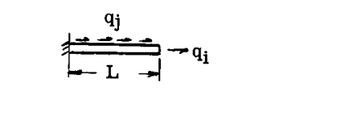

$$U = \frac{1}{2AE} \int_0^L [q_i + q_j x]^2 dx$$

$$a_{11} = \frac{\partial^2 U}{\partial q_1^2} = \frac{1}{AE} \int_0^L dx = \frac{L}{AE}$$

$$a_{jj} = \frac{\partial^2 U}{\partial q_j^2} = \frac{1}{AE} \int_0^L x^2 dx = \frac{L^3}{3AE}$$

$$a_{ij} = \frac{\partial^2 U}{\partial q_i \partial q_j} = \frac{1}{AE} \int_0^L x dx = \frac{L^2}{2AE}$$

テーパー部材の場合、係数は次の形式の積分を評価することによって決定される：

$$a_{ij} = \frac{1}{E} \int_0^L \frac{f(x) dx}{A(x)}$$

このような数値積分は、これらの問題で常に行うことができる。線形テーパー棒の場合、結果は端面積比の関数として得られる。したがって、Wehle と Lansing は次のように示している：

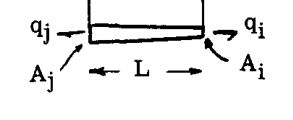

 $a_{11} = \frac{L}{3A_i E} \cdot \phi_{11} \quad a_{ij} = \frac{L}{6A_i E} \cdot \phi_{ij} \quad a_{jj} = \frac{L}{3A_j E} \cdot \phi_{jj}$ 

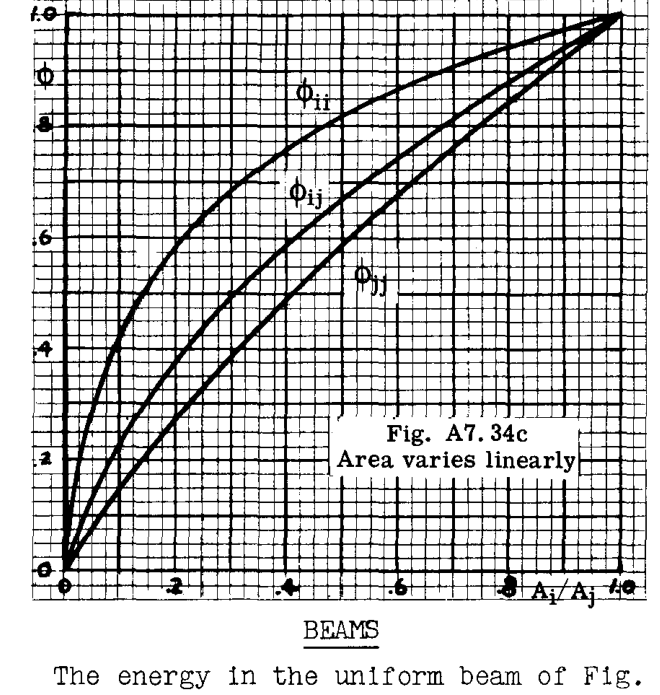

### 梁 (BEAMS)
Fig. A7.34d の一様な梁のエネルギーは次のように与えられる：

$$U = \frac{1}{2EI} \int_0^L \left[ q_i + \left( \frac{q_j - q_i}{L} \right) x \right]^2 dx$$

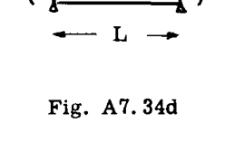

すると、

$$a_{11} = \frac{\partial^2 U}{\partial q_1^2} = \frac{L}{3EI} (= a_{jj})$$

$$a_{ij} = \frac{\partial^2 U}{\partial q_i \partial q_j} = \frac{L}{6EI} (= a_{ji})$$

Fig. A7.34d の梁に対する一般化力の別の選択肢が Fig. A7.34e に示されている。

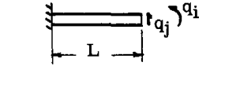

$$U = \frac{1}{2EI} \int_0^L [q_i + q_j x]^2 dx$$

これから次が得られる：

 $a_{11} = \frac{L}{EI} \quad a_{ij} = a_{ji} = \frac{L^2}{2EI} \quad a_{jj} = \frac{L^3}{3EI}$ 

**注：** 棒と梁の係数は直接的に類似している（いくつかのケースを比較せよ）。したがって、テーパー梁については、 $AE$  の代わりに  $EI$  を用いたテーパー棒の結果を使用する。

### せん断パネル (SHEAR PANELS)
すべての辺に一様なせん断流  $q_i$  を持つ矩形せん断パネル (Fig. A7.34f) の場合：

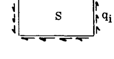

$$U = \frac{q_i^2}{2Gt} S \quad (S = \text{表面積})$$

$$a_{11} = \frac{S}{Gt}$$

台形せん断パネル (Fig. A7.34g) は、非平行な辺の平均せん断流をシート全体で一定であるかのように使用することで近似的に扱われる。したがって：

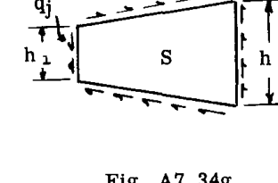

$$U = \frac{q_i^2}{2Gt} S \quad (S = \text{表面積})$$

$$a_{11} = \frac{S}{Gt}$$

静定条件により  $q_j = \frac{h_2}{h_1} q_i$  であるため、一般化力の別の選択肢として  $q_j$  を使用することもでき、その場合：

$$a_{jj} = \left( \frac{h_1}{h_2} \right)^2 \frac{S}{Gt}$$

### ねじり棒 (TORSION BAR)
トルク  $q_1$  を受ける一様な軸のひずみエネルギーは：

$$U = \frac{q_1^2 L}{2GJ} \quad \text{すると } a_{11} = \frac{L}{GJ}$$

# A7.11 さまざまな構造物への行列法の適用

### 例題 26
Fig. A7.35 の鋼管トラスを解析し、いくつかの荷重条件下で点 E および F における垂直たわみを求める。各荷重条件では、A および D を除くすべてのジョイントに垂直荷重が加えられる。チューブ部材の断面積は図に示されている。たわみの行列表現をセットアップせよ。

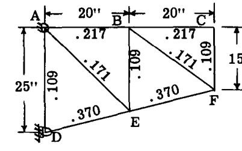
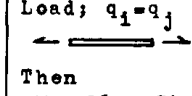

**解：**

一定軸荷重下の一般化された棒の部材柔軟性係数は  $L/AE$  である。Fig. A7.36a は部材と  $q$  に適用される番号付けを示している（所定の部材において  $q$  は一定であるため、これらは同一である）。Fig. A7.36b は外部荷重ポイントに採用された番号付けを示している。

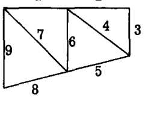
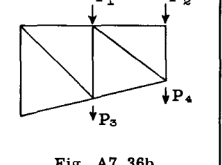

部材柔軟性係数は次のような行列形式で収集された：

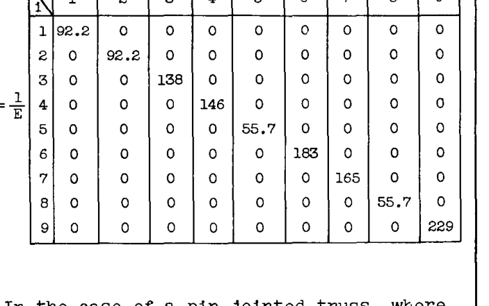

単位荷重分布は、外部荷重ポイント 1、2、3、および 4 に順次単位荷重を配置することによって得られた (Fig. A7.36b)。結果は次のような行列形式にまとめられた：

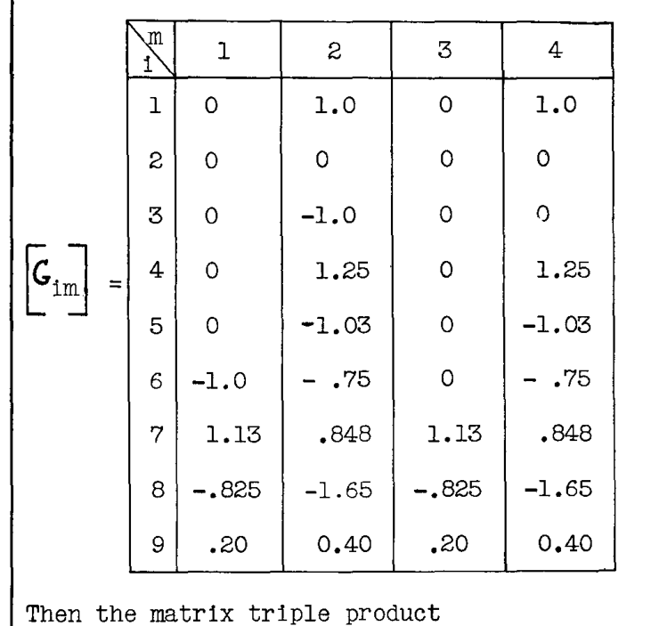

次に、行列の三連積  $[A_{mn}] = [G_{mi}] [a_{ij}] [G_{jn}]$  が形成され、式 (26) に基づいて次が得られた：

$$\begin{Bmatrix} \delta_1 \\ \delta_2 \\ \delta_3 \\ \delta_4 \end{Bmatrix} = \frac{1}{E} \begin{bmatrix} 440 & 389 & 257 & 389 \\ 389 & 927 & 252 & 789 \\ 257 & 252 & 257 & 252 \\ 389 & 789 & 252 & 789 \end{bmatrix} \begin{Bmatrix} P_1 \\ P_2 \\ P_3 \\ P_4 \end{Bmatrix} \text{ インチ}$$

ここでの結果は、4 つの点すべてにおけるたわみを与えている。点 3 と 4 のたわみのみが必要であったため、 $[A_{mn}]$  の最初の 2 行は削除してもよい。同じ結果は、 $[G_{mi}]$  の最初の 2 行（ $[G_{im}]$  の転置）を除外することによっても達成できたはずである。

上記の行列形式の方程式は、多数の異なる荷重条件に対するたわみ計算を整理するのに役立つ。したがって、さまざまな荷重条件に対応する数セットの外部荷重  $P_n$  がある場合、各セットは列形式で配置され、矩形行列  $[P_{nk}]$ （ $k$  個の異なる荷重条件に対する数値添字）として荷重を与える。行列積

$$[\delta_{mk}] = [A_{mn}] [P_{nk}] \quad \dots (26b)$$

は、さまざまな荷重条件 ( $k$ ) に対する各点 ( $m$ ) におけるたわみを与える。

### 例題 27
Fig. A7.35 のトラスの点 1、2、3、および 4 におけるたわみを、以下の荷重条件に対して求めよ：

| 条件番号 |  $P_1$  |  $P_2$  |  $P_3$  |  $P_4$  |
| :--- | :--- | :--- | :--- | :--- |
| 1 | 2500 | 2000 | 800 | 450 |
| 2 | -1200 | -800 | -2100 | -1750 |
| 3 | 1800 | 1470 | -1200 | -1100 |

**解：**

式 (26b) に従って形成された行列積は次のようにセットアップされた：

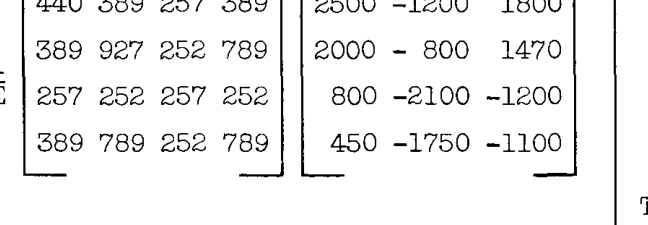

### 例題 28
例題 20 (Fig. A7.23) のランディングギアユニットについて、点 A に作用する揚力および抗力荷重によるたわみ、および車軸 A-B 周りのトルクに関連する影響係数行列を求めよ。

**解：**

構造は要素に分割され、Fig. A7.37a に示すように内部一般化力のセットが適用された（トルクとモーメントは右手の法則によりベクトルで示されている）。C-B における軸応力は無視された。

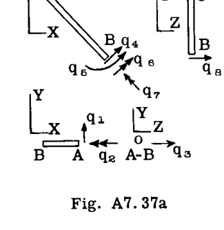
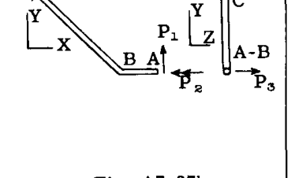

以下の部材柔軟性係数が決定された：

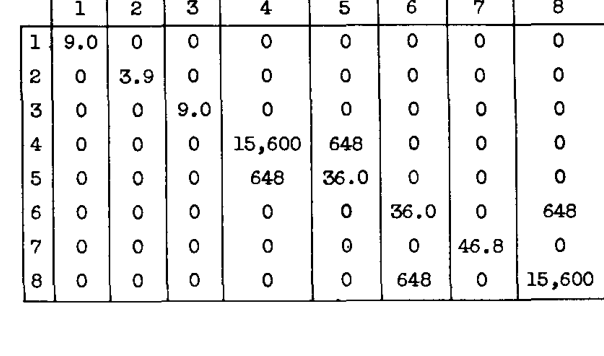

単位荷重分布  $[G_{im}]$  は、Fig. A7.37b に示すように番号付けおよび方向付けされた単位外部荷重を適用することによって得られた。

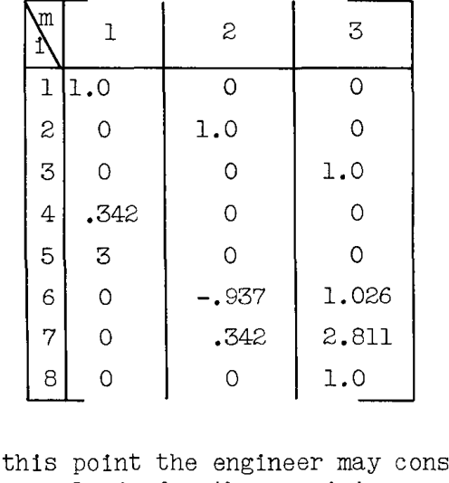

この時点で、残りの計算は日常的な操作であるため、エンジニアは問題が解決されたと見なすことができる：

$$[A_{mn}] = [G_{mi}] [a_{ij}] [G_{jn}]$$

### 例題 30
不静定構造物のたわみは、真の内部応力分布への近似を得るために何らかの補助的な手段が採用されるならば、本章の方法によってうまく計算できることが多い。正確な内部力分布は、たわみ計算において必ずしも必要ではない。というのも、このような計算は構造全体にわたる積分に相当し、誤差を平均化する傾向があるからである。したがって、梁の工学理論 (E.T.B.)、実験データ、以前の経験などを使用して、単位荷重に対する内部力分布の合理的な推定値を得ることができる。

以下の問題では、E.T.B. を使用して、単一セル、3 ベイのボックス梁（3 次不静定）の影響係数行列を決定する。Fig. A7.39a は、理想化された二重対称単一セル片持ちボックス梁を示している。示された 6 つの点における影響係数行列を求めよ。

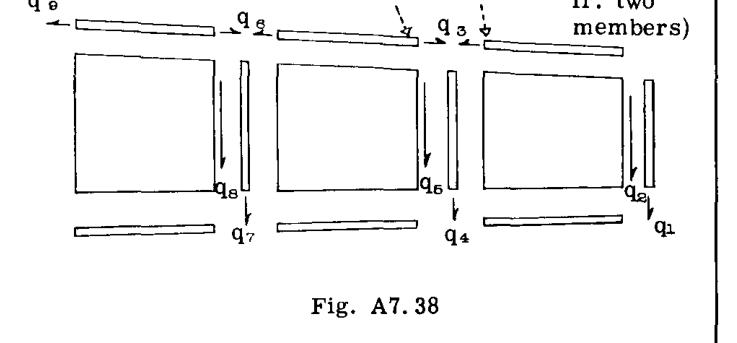
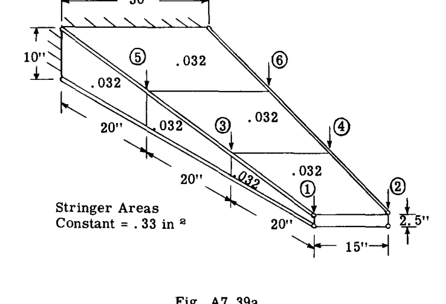

**解：**

Fig. A7.38 は、一般化力の選択と番号付けを示している。対称性のため、下部フランジ要素には荷重が加えられていないものとした。これらは上部フランジのものと等しいことがわかっている。入力は行列形式で以下の通り行われた。 $a_{33}$  および  $a_{66}$  のエントリは、上下の 2 つの同一の部材で発生するため、4 倍にされた。 $a_{36}, a_{69}, a_{99}$  のエントリは 2 倍にされた。

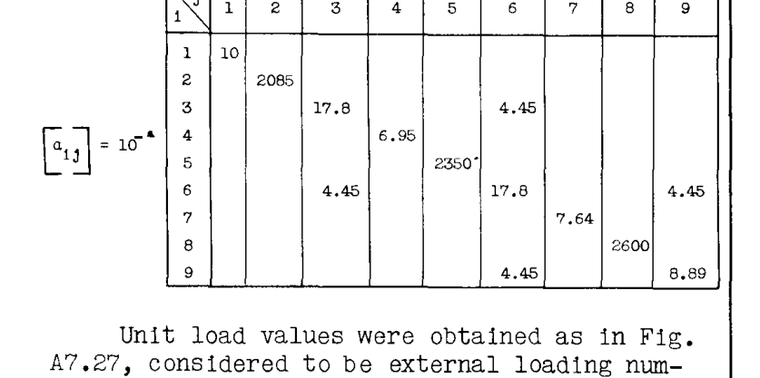

単位荷重値は Fig. A7.27 と同様に得られた。同様の図が点「1」(H) および「3」(F) における単位荷重に対しても作成された。

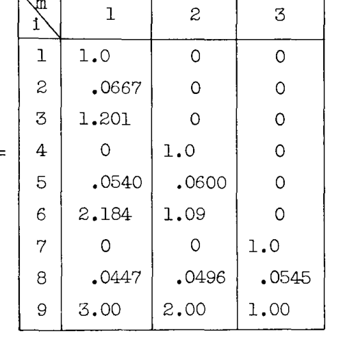

行列の三連積  $[A_{mn}] = [G_{mi}] [a_{ij}] [G_{jn}]$  が計算を完了する。