A7.26 構造物のたわみ

点 F、G、H に対する影響係数を求める。

解答：

図 A7.38 は、一般化力の選択と番号付けを示している。

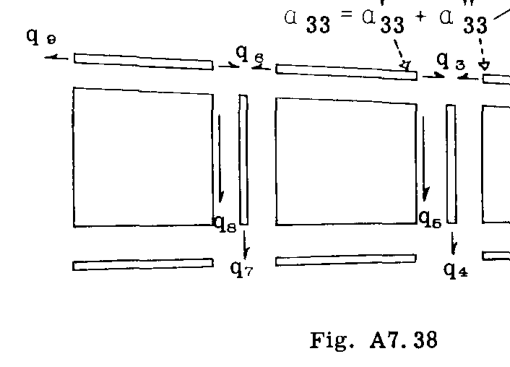

対称性のため、下フランジ要素には力は示されていないが、これらは上フランジの力と等しいことがわかっている。  $a_{ij}$  の入力は、以下のように行列形式で行われた。  $a_{33}$  と  $a_{66}$  の入力は、これらが上面と下面のそれぞれに2つの同一の部材に発生するため、4倍にされた。  $a_{36}$  、  $a_{63}$  、  $a_{66}$  の入力は2倍にされた。（係数の公式については Art. A7.10 を参照）。

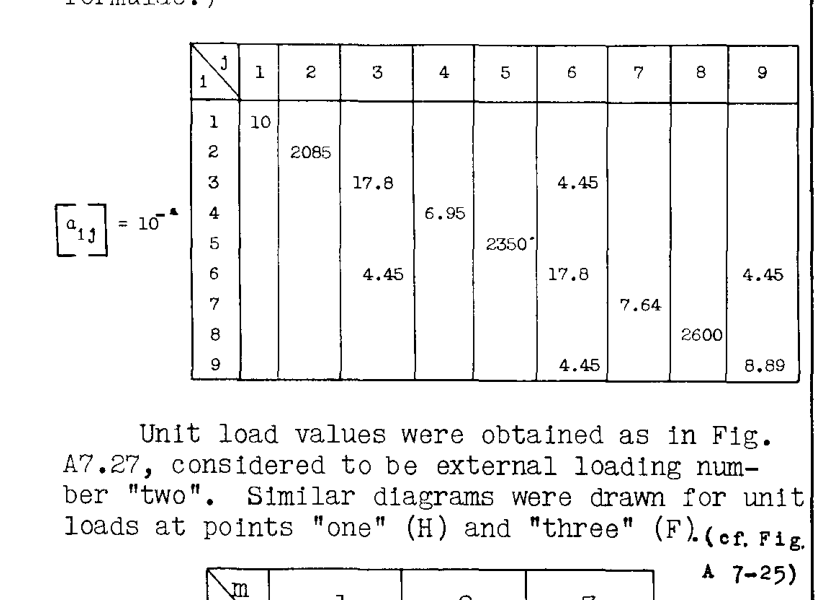

単位荷重値は図 A7.27 と同様に得られ、外部荷重番号「2」とみなされる。同様の図が、点「1」（H）および点「3」（F）での単位荷重に対しても作成された（図 A7-25 参照）。

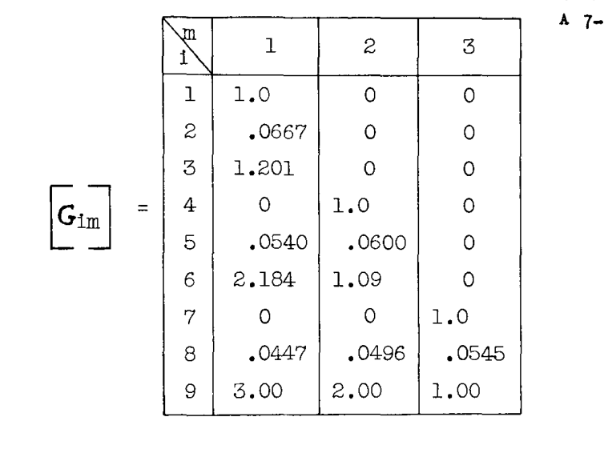

行列の3つの積

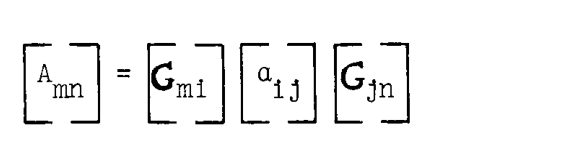

により計算が完了する。

例題 30
静的不静定構造物のたわみは、真の内部力分布に対する近似を得るための補助的な手段が採用されるならば、本章の方法によってうまく計算できることが多い。たわみの計算を行う際に正確な内部力分布は必ずしも必要ではない。なぜなら、そのような計算は構造物全体の積分に相当し、誤差を平均化する傾向があるからである。したがって、単位荷重に対する内部力分布の妥当な推定値を得るために、梁の工学的曲げ理論（E.T.B.）、実験データ、過去の経験などを用いることができる。

以下の問題では、E.T.B. を用いて、シングルセル、3ベイ・ボックス梁（3次不静定）の影響係数行列を決定する。

図 A7.39a は、3つのベイを持つ理想化された二重対称シングルセル片持ちボックス梁を示している。示されている6点のネットに対する影響係数行列を求めよ。

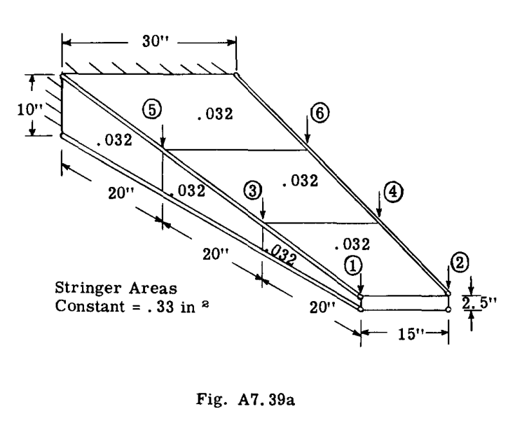

解答：

図 A7.39b は、内部一般化力の配置と番号付けを示す梁の展開図である。対称性により、梁の上面のみに番号が振られ、下面は同一であることに注意せよ。

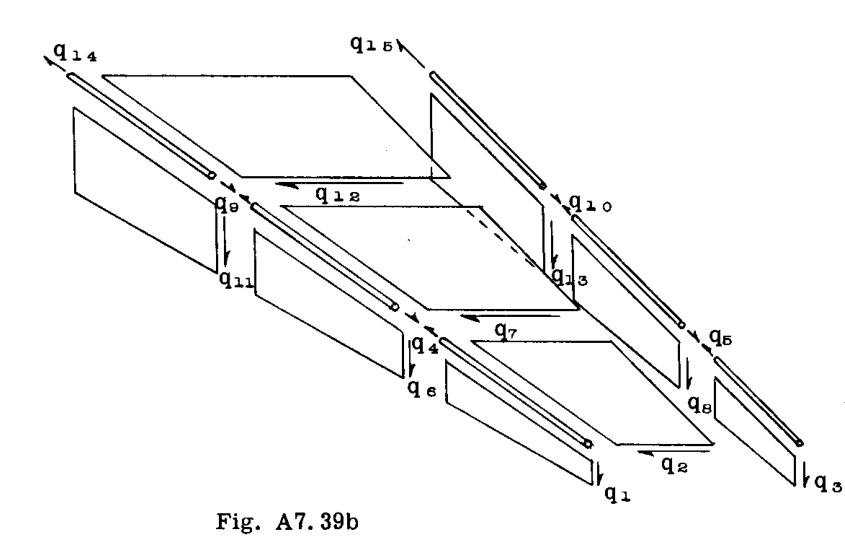

部材の柔軟性係数は Art. A7.10 の公式によって計算され、以下のように行列形式で入力された。梁の下面に対応する荷重があるすべての入力は2倍にされた。これにより、梁の全ひずみエネルギーが考慮された。また、  $q_4$  、  $q_5$  、  $q_9$  、  $q_{10}$  のそれぞれが2つの（同一の）部材に作用するため、  $a_{44}$  、  $a_{55}$  、  $a_{99}$  、  $a_{10,10}$  の入力も再度2倍にされた。

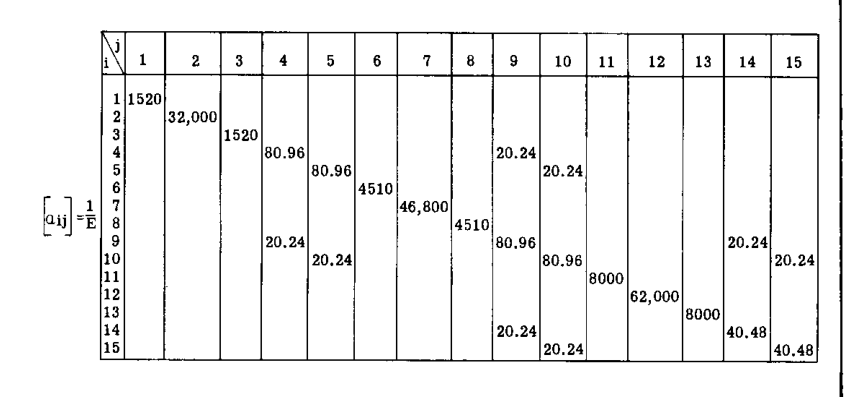

注：空白はゼロを示す。

単位荷重分布は、点1から6（図 A7.39a）への単位荷重の連続的な適用に対して得られた。E.T.B. によって予測された、せん断中心（対称性のため梁の中心）を通る荷重に対する内部力は、荷重を片側に伝達する際に生じるトルクによる均一なせん断流（  $q = \frac{T}{2A}$  ）に重ね合わされた。

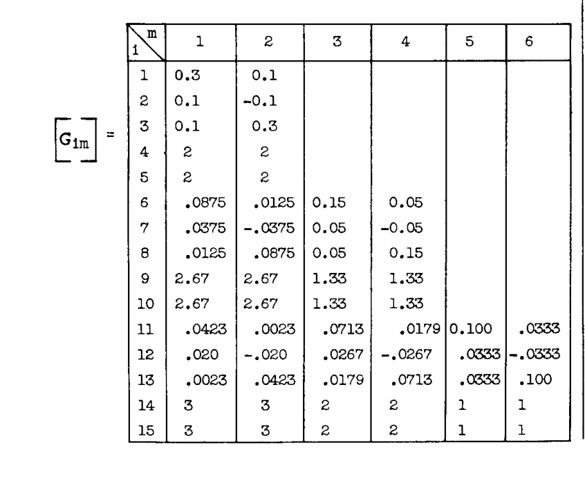

行列の3つの積

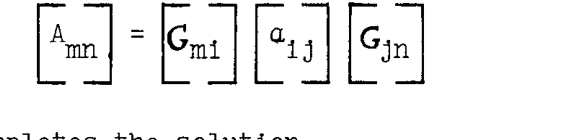

により計算が完了する。

A7.12 「弾性荷重法」（モールの方法）による単純梁の弾性曲線のたわみと角変化。

構造物のたわみの計算には、初等関数の単純な積分特性を伴う多くのステップが発生する。弾性荷重法（および Art. A7.14 で述べるモーメント面積法）が広く普及しているのは、解析者が単純な幾何学的図形の特性に精通していることに依存して、これらの積分特性の多くをほぼ目視で書き留めることができるという事実に大きく起因している。

支持点を結ぶ線に対する単純支持梁上の点のたわみを見つけるために、弾性荷重法は次のように述べている：

単純支持梁の弾性曲線上の点 A におけるたわみは、分布梁荷重として作用する  $\frac{M}{EI}$  図による A 点での曲げモーメントに等しい。

手順の詳細は以下の通り：

i - 適用された梁荷重によって発生する  $\frac{M}{EI}$  図を描く。

ii - この図を、所望のたわみの参照点（共役梁）で支持された第2の梁上の荷重として視覚化する。

iii - この共役梁において、元の梁のたわみが求められた位置での曲げモーメントを求める。この曲げモーメントは所望のたわびに等しい。

定理を証明するために、ダミー単位荷重（仮想仕事）の式を考える。

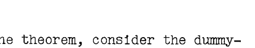

$$
1^{\#} \cdot \delta = \int m \cdot d\theta = \int m \cdot \frac{Mdx}{EI}
$$

この式は、ある点に適用された単位荷重によって行われる外部仮想仕事  $1 \cdot \delta$  を、角変化  $d\theta = \frac{Mdx}{EI}$  を経験する梁要素上の内部仮想仕事に等しいとしている。梁全体にわたるこのような式の和（積分）は、その点における全たわみを与える（式 18 参照）。ここで、上記の式を用いたたわみの表現が、「弾性荷重」  $\frac{Mdx}{EI}$  を載荷した単純梁の曲げモーメントの表現と同じであることを示す。

図 A7-40 において、(a) の荷重は (b) の実際のモーメントを生じさせる。 A 点にある梁要素（図 A7-40c）の角変化  $\frac{Mdx}{EI}$  による点 B および C のたわみを考える。

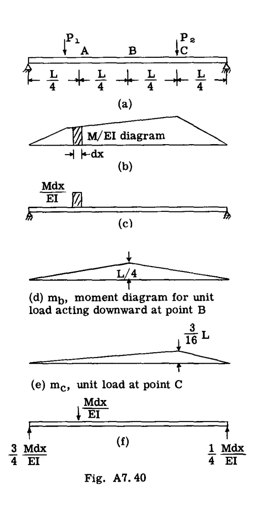

図 f において、単純支持梁上の荷重として  $\frac{Mdx}{EI}$  を考え、点 a に作用する  $\frac{Mdx}{EI}$  による点 b および c での曲げモーメントを求める。

$$
M_b = \frac{Mdx}{4EI} \cdot \frac{L}{2} = \frac{MLdx}{8EI}
$$

$$
M_c = \frac{Mdx}{4EI} \cdot \frac{L}{4} = \frac{MLdx}{16EI}
$$

点 b および c におけるこれらの梁曲げモーメントの値は、仮想仕事の式による点 b および c でのたわみと同一である。点 b および c における単位荷重に対するモーメント図 m（図 d および e）は、数値的に点 b および c に対するモーメントの影響線と全く同じである。

したがって、単純支持梁のたわみは、  $\frac{M}{EI}$  曲線を仮想的な梁の荷重として考慮することによって決定できる。この  $\frac{M}{EI}$  荷重による任意の点での曲げモーメントは、与えられた荷重下での梁のその点でのたわみに等しい。

同様に、単純支持梁の任意の断面における角変化は、梁荷重として作用する  $\frac{M}{EI}$  図によるその断面におけるせん断力に等しいことが容易に証明される。

A7.13 例題

例題 31. 図 A7.41 に示す梁と荷重について、点 a および b の垂直たわみと傾斜を求めよ。下の図は、単純梁の中心に作用する荷重 P に対するモーメント図を示している。

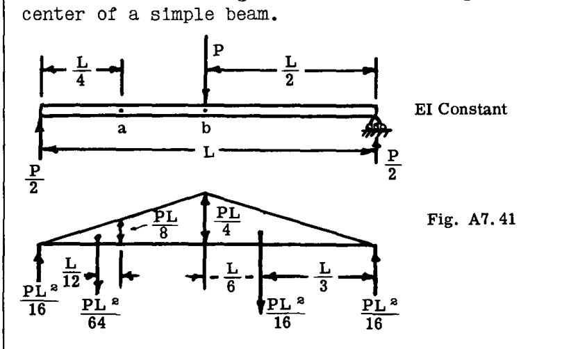

点 b での単位荷重に対して、図 d は m 図を示している。  $dx$  の中点（点 A）における m の値は  $L/8$  である。したがって

$$
\delta_b = \frac{Mdx}{EI} \cdot \frac{L}{8} = \frac{MLdx}{8EI}
$$

点 c のたわみについては、単位荷重を C に置いて m 図を描く（図 e 参照）。要素  $dx$  上の m の値は  $L/16$  である。

したがって

$$
\delta_c = \frac{Mdx}{EI} \cdot \frac{L}{16} = \frac{MLdx}{16EI}
$$

*簡略化のため、点 A、B、C は 1/4 スパン位置に配置された。読者は、点 A、B、C の位置を  $x_A$  、  $x_B$  、  $x_C$  に置き換えて一般的な証明を行い、再度その議論に従うことで納得できるだろう。

点 a におけるたわみは、荷重としての M 図による曲げモーメントを EI で割ったものに等しい（図 A7.41 の下の図を参照）。

$$
\delta_a = \left( \frac{PL^2}{16} \cdot \frac{L}{4} - \frac{PL^2}{64} \cdot \frac{L}{12} \right) \frac{1}{EI} = \frac{11PL^3}{768EI}
$$

$$
\delta_b = \left( \frac{PL^2}{16} \cdot \frac{L}{2} - \frac{PL^2}{16} \cdot \frac{L}{6} \right) \frac{1}{EI} = \frac{1PL^3}{48EI}
$$

任意の点における角変化は、荷重としての M/EI 図によるせん断力に等しい。

$$
\alpha_a = \left( \frac{PL^2}{16} - \frac{PL^2}{64} \right) \frac{1}{EI} = \frac{3PL^2}{64EI}
$$

$$
\alpha_b = \left( \frac{PL^2}{16} - \frac{PL^2}{16} \right) \frac{1}{EI} = 0
$$

（勾配は水平であるか、元の梁軸の方向から変化がない。）

例題 32. 図 A7.42 に示すように、等分布荷重を受けた単純梁のたわみを求めよ。等分布荷重に対する曲げモーメントの式は  $M = \frac{wlx}{2} - \frac{wx^2}{2}$  または放物線であり、図 A7.42a に示されている。中央点におけるたわみは、荷重としての M 図による曲げモーメントに等しい。

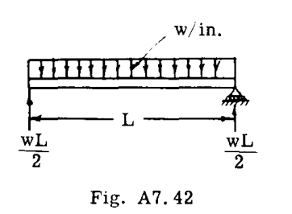

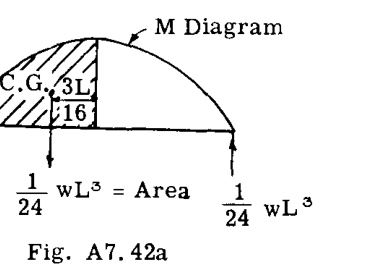

$$
\delta_{center} = \left( \frac{1}{24} wL^3 \cdot \frac{L}{2} - \frac{1}{24} wL^3 \cdot \frac{3}{8} \frac{L}{2} \right) \frac{1}{EI} = \frac{5wL^4}{384EI}
$$

$$
\alpha_{center} = \left( \frac{1}{24} wL^3 - \frac{1}{24} wL^3 \right) \frac{1}{EI} = 0
$$

支持点での勾配 = 反力 =  $\frac{1}{24} \frac{wL^3}{EI}$ 

例題 33.
図 A7.43 は、片持ち翼の半分側の平面図を示している。補助翼（エルロン）は、自動調心軸受を備えた点 D、E、F のブラケットで支えられている。ブラケットは、点 A、B、C で翼の後部桁に取り付けられている。翼が空気荷重で曲がると、補助翼は3点で翼に接続されているため、同様に曲がらなければならない。補助翼の梁の設計において、また同様に翼フラップの場合において、このたわみは臨界曲げモーメントを生じさせる。後部桁に分配された走行荷重が図に示されているように一体となって曲がると仮定して、点 A と C を結ぶ直線に対する点 B のたわみを求めよ。ブラケットのたわみが無視される場合、これは D と F を結ぶ直線に対する E のたわみとなる。 A と C の間の後部桁の慣性モーメントは、表 A7.6 に示されているように変化する。

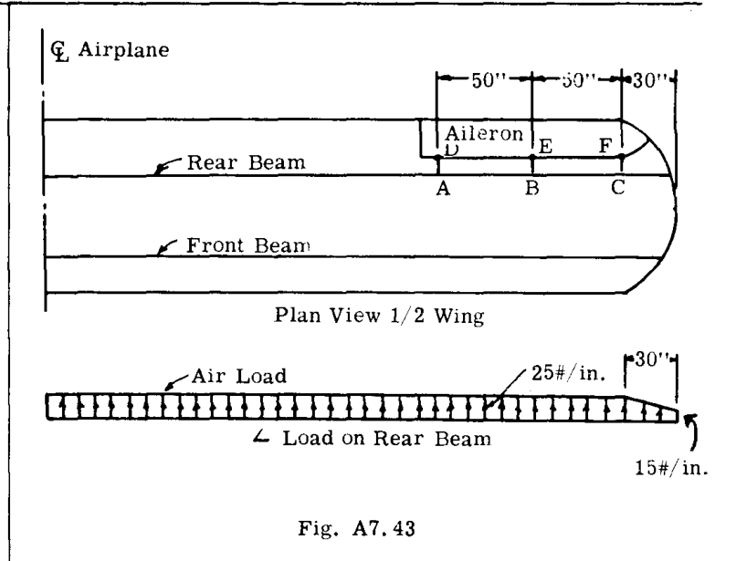

解答：梁の慣性モーメントが変化するため、 A と C の間の梁の長さはそれぞれ10インチの10個の等しい断片に分割される。各断片の中点における曲げモーメント M が計算される。各断片の弾性荷重は  $\frac{M ds}{I}$  に等しく、ここで  $ds = 10"$  であり、  $I$  は断片の中点における慣性モーメントである。これらの弾性荷重は、長さ AC の仮想梁上の荷重として考慮され、 A および C で単純支持される。この仮想梁の点 B における曲げモーメントは、 AC を結ぶ線に対する B のたわびに等しくなる。

 C 点における曲げモーメント =  $15 \times 30 \times 15 + 10 \times 15 \times 10 = 8250\#$ 

 C 点におけるせん断荷重 =  $\frac{(15 + 25) \times 30}{2} = 600\#$ 

 C 点と A 点の間の曲げモーメントの式は、  $M = 8250 + 600X + 12.5X^2$  となり、ここで  $x = 0$  から  $100$  である。

表 A7.6 は、断片の弾性荷重の詳細な計算を示している。想定される I 値は、与えられた荷重を運ぶアルミニウム合金梁の典型的な値である。ヤング率  $E = 10 \times 10^6$  は一定であり、最終計算まで省略できる。表の下の図は、仮想梁上の弾性荷重を示している。

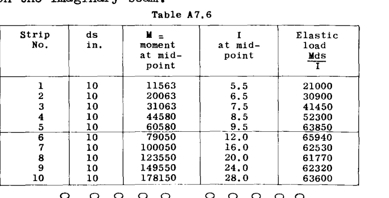

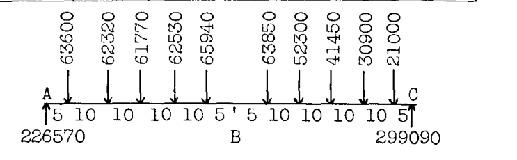

上記の弾性荷重による B 点の曲げモーメント = 7,100,000。したがって、 AC 線に対する B 点のたわみは

$$
\delta = \frac{7,100,000}{E = 10,000,000} = 0.71 \text{ インチ}
$$

例題 34
図 A7.43a は、片持ち翼の水上機の断面を示している。翼の梁は、点 A および B で船体に取り付けられている。翼の荷重により、翼は取り付け点 AB に対して垂直方向にたわむ。したがって、配管、制御装置などの設置は、 A と B の間の翼のたわみを妨げないように配置しなければならない。説明のために、図に示すように簡略化された荷重が想定されている。 EI は一定と想定されているが、実際の場合は I が変化する。与えられた荷重に対して、支持点 A および B に対する点 C のたわみを求めよ。また、先端点 D および E の垂直たわみを求めよ。

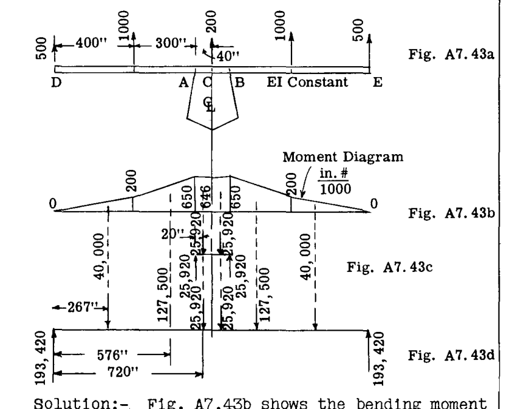

解答：図 A7.43b は、与えられた翼荷重の曲げモーメント図を示している。 AB を結ぶ線に垂直な C のたわみを求めるために、モーメント図を長さ AB の仮想梁上の荷重として扱い、 A および B で単純支持する（図 A7.43c 参照）。 C 点のたわみは、この仮想梁上の曲げモーメントに数値的に等しい。

したがって  $EI \delta_c = 25920 \times 40 - 25920 \times 20$ 

または  $\delta_c = \frac{518000}{EI}$ 

先端のたわみを求めるために、先端 D および E で単純支持された仮想梁上に弾性荷重（モーメント図の面積）を置く（図 A7.43d 参照）。この仮想梁上の点 A または B における曲げモーメントは、先端点 D および E に対するこれらの点のたわみに数値的に等しくなり、点 A および B は実際には移動しないため、このたわみは梁の支持点に対する先端点の動きとなる。

 A 点における曲げモーメント =  $193420 \times 700 - 40000 \times 433 - 127500 \times 124 = 102200000$ 。  $\therefore \delta_{tip} = \frac{102,200,000}{EI}$ 

A7.14 モーメント面積法による梁のたわみ*

特定のタイプの梁の問題では、モーメント面積法には利点があり、この方法はルーチン分析で頻繁に使用される。

角変化の原理。図 A7.44 は片持ち梁を示している。任意の与えられた荷重による、弾性曲線上の点 A と B の間の角変化を求める必要があるとする。仮想仕事の式から、次が得られる。

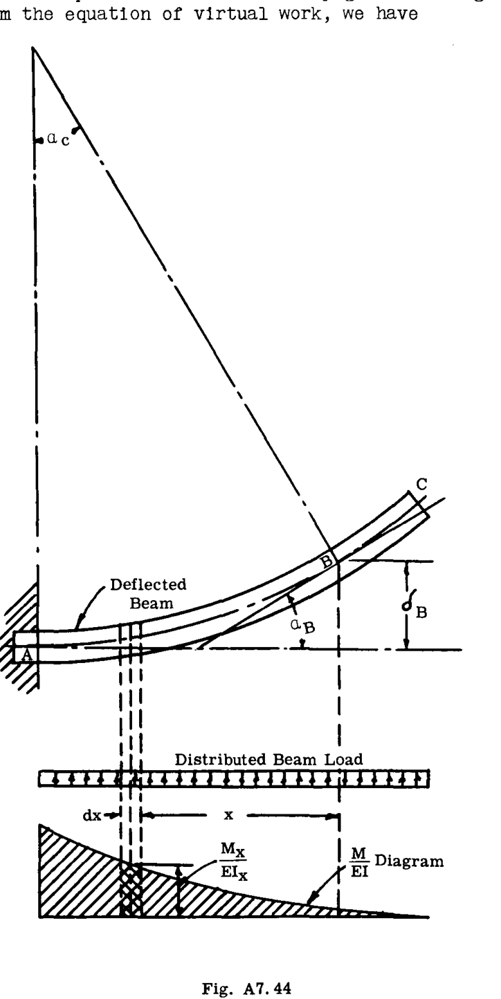

$$
\alpha_B = \int_B^A \frac{M dx}{EI} m
$$

ここで、 m は、 B に適用された単位仮想偶力による、 B から距離 x にある任意の断面におけるモーメントである。しかし、 B と A の間のすべての点で  $m = unity$  である。

したがって
$$
\alpha_B = \int_B^A \frac{M dx}{EI}
$$

（*モーメント面積法は、1874年に C. E. Greene 教授によって最初に開発され、発表された。）

図 A7.44 を参照すると、この式は B と A の間の M 図の面積を EI で割ったものを表している。したがって、第1原理：「梁の弾性曲線上の任意の2点 A と B の間の勾配の変化は、これら2点間の  $\frac{M}{EI}$  図の面積に数値的に等しい。」

たわみの原理
図 A7.44 において、 A における弾性曲線の接線に垂直な点 B のたわみを決定する。図 A7.44 では、 A における弾性曲線の接線が水平であるため、このたわみは垂直となる。

仮想仕事の式より  $\delta_B = \int_B^A \frac{M dx}{EI} m$ 

ここで、 m は、 B に作用する単位仮想垂直荷重による、 B から距離 x にある任意の断面におけるモーメントである。したがって、 B と A の間の任意の点に対して  $m = 1.x = x$  である。 

したがって
$$
\delta_B = \int_B^A \frac{M dx}{EI} \cdot x
$$

この式は、 B を通る垂直線まわりの  $\frac{M}{EI}$  図の1次モーメントを表している。したがって、モーメント面積法のたわみの原理は次のように述べることができる：「曲げを受けた梁の弾性曲線上の点 A の、点 B における弾性曲線の接線に垂直な方向のたわみは、 A と B の間の  $\frac{M}{EI}$  面積の A 点まわりの静モーメントに数値的に等しい。」

例題

例題 35. 図 A7.45 に示す片持ち梁の自由端 B における傾斜と垂直たわみを求めよ。 EI は一定である。

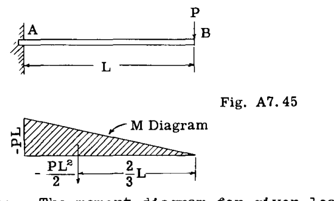

解答：与えられた荷重に対するモーメント図は、図 A7.45 に示すように三角形である。梁は A で固定されているため、 A における弾性曲線は水平、つまり勾配はゼロである。したがって、 B における真の勾配は、 A と B の間の角変化に等しく、これは A と B の間のモーメント図の面積を EI で割ったものに等しい。

したがって
$$
\alpha_B = (-PL \cdot L/2) \frac{1}{EI} = -\frac{PL^2}{2EI}
$$

 B における垂直たわみは、 A における弾性曲線の接線が固定支持により水平であるため、 B まわりのモーメント図の1次モーメントを EI で割ったものに等しい。

したがって
$$
\delta_B = \left( -\frac{PL^2}{2} \cdot \frac{2}{3} L \right) \frac{1}{EI} = -\frac{PL^3}{3EI}
$$

例題 36
図 A7.46 は、例題 34 で使用されたものと同じ簡略化された翼と荷重を示している。支持点 A および B を結ぶ線に垂直な点 C のたわみを求めよ。また、支持点 A および B に対する先端点 D および E の相対的なたわみも求めよ。

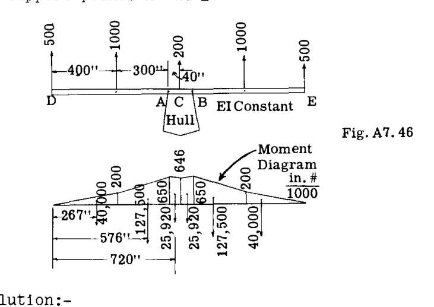

解答：荷重の対称性により、飛行機の中心線におけるたわんだ弾性曲線の接線は水平である。したがって、点 C におけるたわんだ梁の水平接線からの点 A または B のたわみを求める。これは、線 AB に対する点 C の垂直たわみと同等である。

したがって、 C に対する A の水平接線に関する垂直たわみを求めるために、 A と C の間の M 図の面積を荷重として、 C まわりの A 点のモーメントをとる。

ここで
$$
\frac{\delta_A}{1000} (\text{Cでの接線}) = \frac{1}{EI} \left( \frac{650 + 646}{2} \right) 40 \times 20 = \frac{1}{EI} (518400) = \text{ABに垂直なCのたわみ}
$$

 AB 線に対する先端点 D の垂直たわみを求めるために、まず C における水平接線に対する D のたわみを求め、 C に対する接線に関する A のたわみを引く。

$$
\frac{\delta_D}{1000} (\text{Cでの接線に関する}) = \frac{1}{EI} (40000 \times 267 + 127500 \times 576 + 25920 \times 720) = \frac{1}{EI} (102,700,000)
$$

（ M/EI 図の面積とモーメントアームについては図 A7.46 を参照）。上で求めた C に対する A のたわみを引くと、次が得られる。

$$
\frac{\delta_D}{1000} (\text{AB線に関する}) = \frac{1}{EI} (102,700,000 - 518,400) = \frac{1}{EI} (102,180,000)
$$