# A7.32 構造物のたわみ

## A7.15 面積モーメント法による梁の固定端モーメント

Art. A7.14で示された面積モーメントの2つの原理から、弾性曲線のたわみと傾きは、曲げモーメントの面積の量とその位置、つまり重心に依存することは明らかである。  

Fig. A7.47は、両端が固定され、図のように単一の荷重  $P$  を受ける梁を示している。 (c)に示される曲げモーメントは、2つの部分から構成されていると考えることができる。すなわち、単純支持梁に作用する荷重  $P$  に対するもので、荷重位置でのモーメントの値が  $Pa(L-a)/L$  となる三角形の図と、次に、支点AおよびBにおいて弾性曲線の傾きをゼロまたは水平にするような大きさの、 $M_A$  および  $M_B$  の値を持つ負の符号の台形モーメント図である。梁はAおよびBで固定されていると考えられるためである。  

端部モーメント  $M_A$  および  $M_B$  は静的に不定であるが、2つの面積モーメントの原理を使用することで容易に決定できる。 Fig. bにおいて、AおよびBにおける弾性曲線の傾きはゼロまたは水平であるため、AとBの間の傾きの変化はゼロである。第1面積モーメントの原理により、これはAとBの間のモーメント面積の代数和がゼロであることを意味する。 したがって、Fig. cにおいて

$$
\frac{(-M_A - M_B)}{2} L + \frac{Pa(L-a)}{L} \cdot \frac{L}{2} = 0
$$

--- (A)

Fig. bにおいて、Aにおける弾性曲線の接線からのBのたわみはゼロであり、またBにおける弾性曲線の接線からのAのたわみもゼロである。  

したがって、面積モーメントの原理により、点AまたはBのまわりのFig. cのモーメント図のモーメントはゼロである。  

点Aのまわりのモーメントをとると：

$$
\Sigma M_A = \frac{Pa^2(L-a)}{2L} \cdot \frac{2a}{3} + \frac{Pa(L-a)^2}{2L} \cdot (a + \frac{L-a}{3}) + \frac{M_A L}{2} \cdot \frac{L}{3} + \frac{M_B L}{2} \cdot \frac{2L}{3} = 0
$$

--- (B)

 $M_A$  と  $M_B$  について方程式AとBを解くと、

$$
M_A = -\frac{Pab^2}{L^2} \text{ および } M_B = -\frac{Pba^2}{L^2} \text{ （ここで } b = L - a\text{）}
$$

断面二次モーメントが変化する梁の固定端モーメントを求めるには、モーメント図の代わりに  $M/I$  図を使用する。  

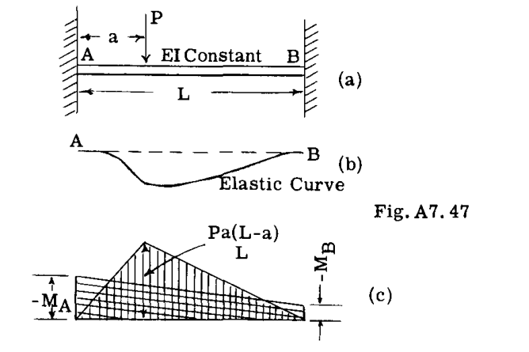

### 例題 37
Fig. A7.48は、2つの集中荷重を受ける固定端梁を示している。 固定端モーメント  $M_A$  および  $M_B$  を求めよ。  

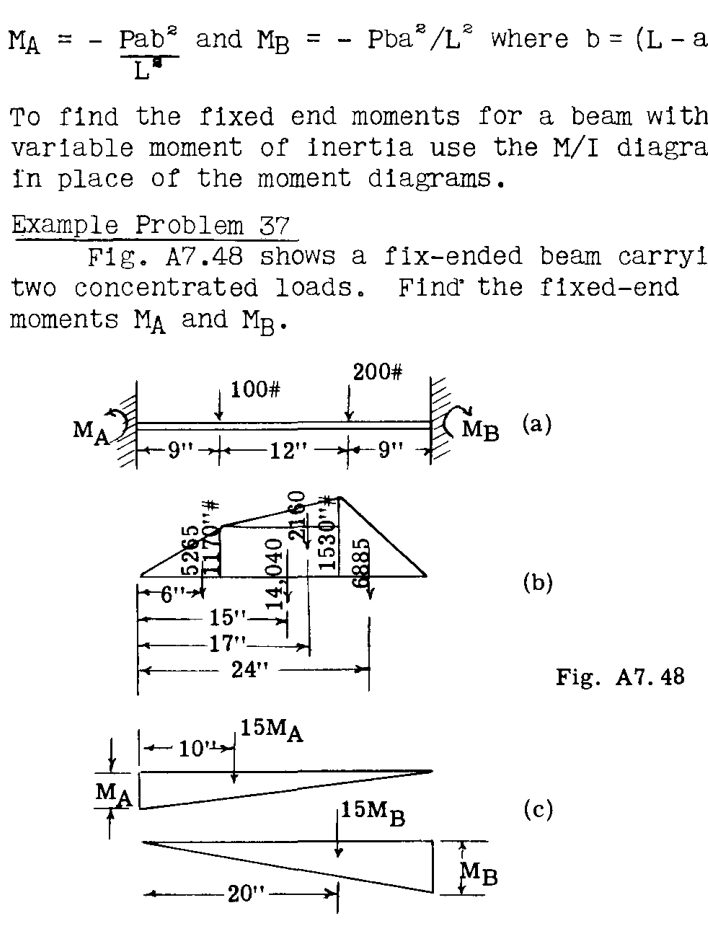

**解：**  
Fig. bは、梁がAおよびBで単純支持されていると仮定した静的モーメント図を示している。面積の算出とモーメント面積のモーメント計算を容易にするため、モーメント図は図のように4つの単純な形状に分割されている。各部分の重心が、重心位置に作用する集中荷重として示された面積と共に示されている。  

Fig. cは、未知のモーメント  $M_A$  および  $M_B$  によるモーメント図を示している。これらの三角形の面積は、重心位置に作用する集中荷重として示されている。  

AとBの間の弾性曲線の傾きの変化はゼロであるため、これらのモーメント図の面積の和はゼロでなければならない。したがって、

 $5265 + 14040 + 2160 + 6885 + 15M_A + 15M_B = 0$ 

または

 $15M_A + 15M_B + 28350 = 0$  --- (1)

Bにおける接線からの点Aのたわみはゼロであるため、点Aのまわりのモーメント図の1次モーメントはゼロに等しい。 したがって、

 $5265 \times 6 + 15 \times 14040 + 17 \times 2160 + 24 \times 6885 + 150M_A + 300M_B = 0$   
または  
 $150M_A + 300M_B + 444600 = 0$  --- (2)

方程式(1)と(2)を解くと、次が得られる。  
 $M_A = -816 \text{ in. lb.}$   
 $M_B = -1074 \text{ in. lbs.}$   

端部モーメントが既知となれば、AとBの間の弾性曲線上の任意の点のたわみまたは傾きは、面積モーメントの2つの原理を使用して見つけることができる。  

## A7.16 弾性荷重法によるトラスのたわみ

トラス構造の複数の、あるいはすべての接点のたわみが必要な場合、弾性荷重法（Method of Elastic Weights）を用いることで、本章の前の記事で使用した仮想仕事法よりも大幅に時間を節約できる場合がある。この方法は、一般に、トラスの各部材について、与えられた荷重や条件による歪みから生じる弾性荷重の大きさと位置を求め、これらを仮想的な梁に集中荷重として載せることで構成される。この弾性荷重による仮想梁上の曲げモーメントは、数値的に元のトラス構造のたわみに等しくなる。  

Fig. A7.49の図(1)のトラスを考える。図(2)は、部材  $bc$  の  $\Delta L$  の短縮に対するトラスのたわみ曲線を示しており、他のすべての部材は剛体であるとみなしている。このたわみ図は、仮想仕事の式  $\delta = u \Delta L$  によって決定できる。したがって、接点Oのたわみについては、接点Oに下向きの単位鉛直荷重を作用させる。この単位荷重による部材  $bc$  の応力  $m$  は  $2/3 \cdot 2P/r = 4P/3r$  である。 したがって、

$$
\delta_O = \Delta L_{bc} \cdot \frac{4P}{3r}
$$

他の下弦材接点のたわみも、同様の方法でそれらの接点に単位荷重を置くことで求めることができる。図(2)は、結果として得られるたわみ曲線を示している。この図は、部材  $bc$  の応力に対する影響線に  $\Delta L_{bc}$  を乗じたものであることは明らかである。  

図(3)は、部材  $bc$  の応力を得るためのモーメント中心である接点Oを通る鉛直線上を作用する弾性荷重  $\Delta L_{bc}/r$  が載荷された仮想梁を示している。この弾性荷重に対する梁の反力も示されている。図(4)は、接点Oにおける弾性荷重による梁の曲げモーメント図を示している。このモーメント図が、図(2)に示されたトラスのたわみ図と同一であることに気づく。  

したがって、部材の弾性荷重は、部材の変形をそのモーメント中心までの腕の長さ  $r$  で割ったものに等しい。この弾性荷重がトラスの下弦材に対応する仮想梁に作用する場合、この仮想梁上の曲げモーメントは、実際のトラスのたわみに等しくなる。  

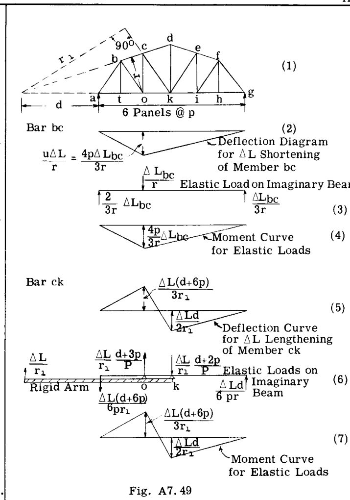

Fig. A7.49の図5、6、7は、部材  $CK$  の  $\Delta L$  の伸びについて、同様の研究と結果を示している。この斜材の応力モーメント中心は点 O' にあり、これはトラスの外側にある。点 O' における弾性荷重  $\Delta L/r_1$  は、図(6)に示すように、仮想梁上の点  $o$  および  $k$  における等価なシステムに置き換えることができる。これらの弾性荷重は、図(5)のたわみ図と同一の曲げモーメント図（図7）を生成する。  

Table A7.7は、トラスの弦材およびウェブ部材の弾性荷重に関する式の要約を、その位置および符号と共に示している。  

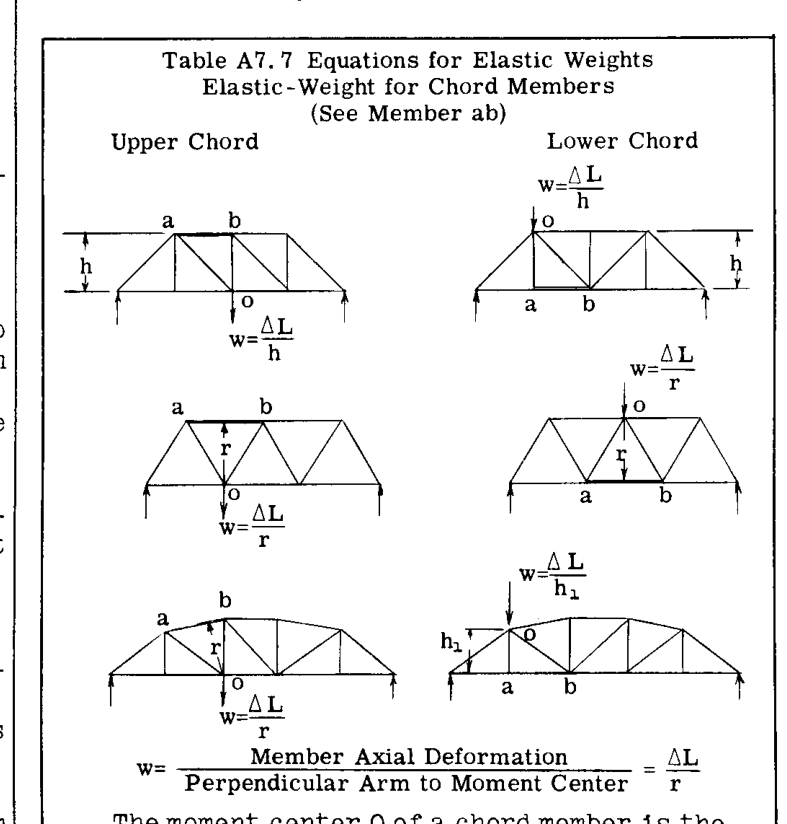

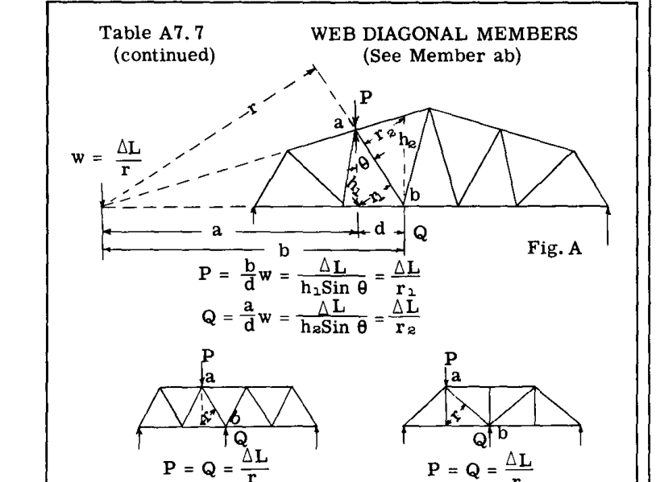

トラスの斜材については、弾性荷重  $P$  と  $Q$  は反対の符号を持ち、部材が圧縮か引張かに応じて、互いに向かう方向、または互いに離れる方向を向くと想定される。図aにおいて、 $P$  は  $Q$  よりも大きく、 $P$  はモーメント中心 O に最も近い斜材の端部に位置する。下向きの弾性荷重はプラスである。  

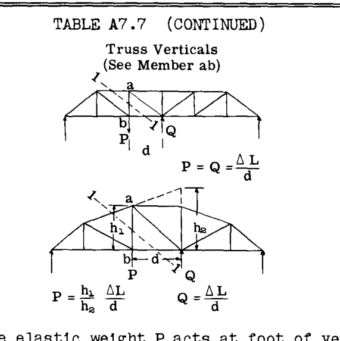

弾性荷重  $P$  は、垂直材が引張の場合、垂直材の脚部に下向きに作用する。 $Q$  は、 $ab$  の応力を断面法で求める際に使用される示標断面 1-1 によって切断される弦部材の遠端の点 P に、 $P$  と反対に作用する。  

弦部材のモーメント中心 O は、モーメント法によってその部材の荷重を決定する際に使用される断面によって切断される他の2つの部材の交点である。  

弦部材の弾性荷重  $w$  の符号は、その作用点のたわみを下向きにする傾向がある場合にプラスとなる。したがって、単純トラスでは、上弦材の圧縮または下弦材の引張は、下向きまたは正の弾性荷重を生じさせる。  

$$
w = \frac{\text{部材の軸方向変形}}{\text{モーメント中心までの垂線腕}} = \frac{\Delta L}{r}
$$

## A7.17 例題の解法

トラスのたわみに適用される弾性荷重法は、いくつかの単純な典型的なトラスの解法によって最もよく説明できる。  

### 例題 38
Fig. A7.50は、対称的に荷重がかかった単純支持トラスを示している。すべての部材の軸方向変形を求める必要があるため、最初のステップは、与えられた荷重によるすべての部材の荷重を見つけることである。このステップの結果を図に示し、応力は各部材の隣に記されている。次のステップは、部材の弾性荷重、その位置、および向きを計算することである。Table A7.8 および A7.9 にこれらの計算を示す。  

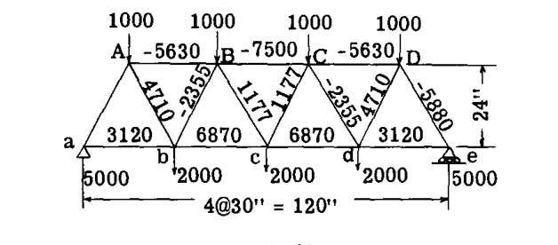

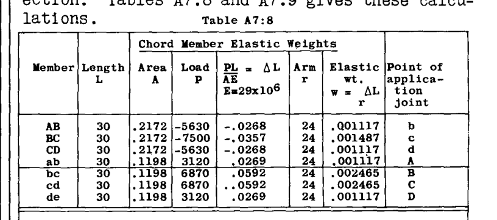

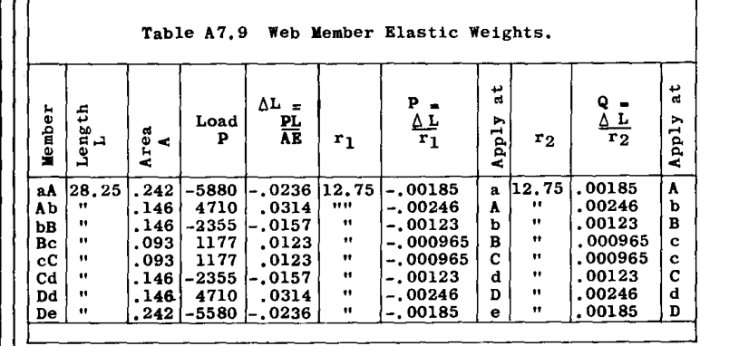

Fig. A7.51は、Table 8および9から得られた弾性荷重を、与えられたトラスのスパンに等しいスパンを持つ仮想梁に適用したものである。これらの弾性荷重は、各トラス接点に作用する弾性荷重の代数和である。  

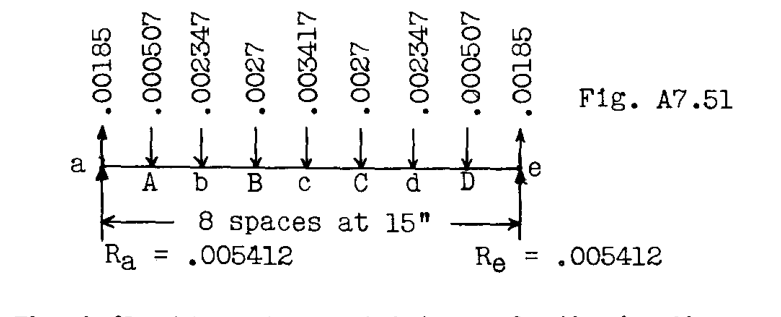

任意の接点におけるたわみは、Fig. A7.51の仮想梁上の曲げモーメントに等しい。  
接点Aにおけるたわみ =  $(.005412 + .00185)15 = .007262 \times 15 = .109"$   
接点bにおけるたわみ =  $.109 + (.007262 - .000507)15 = .109 + .006755 \times 15 = .209"$   
接点Bにおけるたわみ =  $.209 + (.006755 - .002347)15 = .209 + .004408 \times 15 = .275"$   
接点cにおけるたわみ =  $.275 + (.004408 - .0027)15 = .301"$   
トラス接点における弾性曲線の傾きは、Fig. A7.51の梁のこれらの点におけるせん断力に等しい。  

### 例題 39
Fig. A7.52に示すプラットトラスの接点の鉛直たわみを求めよ。与えられた荷重による各部材の部材変形  $\Delta L$  は、各部材の隣に記されている。Table A7.10は部材弾性荷重の計算を示している。Fig. A7.53は、Table A7.10からの弾性荷重が載荷された仮想梁を示している。たわみは、この梁の曲げモーメントに数値的に等しい。  

$$
\delta_b = .01855 \times 25 = .465"
$$
$$
\delta_B = .465 + .053 (\Delta L \text{ in Bar Bb}) = .518"
$$
$$
\delta_c = .01855 \times 50 - .00387 \times 25 = .833"
$$
$$
\delta_C = .833 + .031 (\Delta L \text{ of Cc}) = .864"
$$
$$
\delta_D = .01855 \times 75 - .00387 \times 50 - .00623 \times 25 = 1.03"
$$

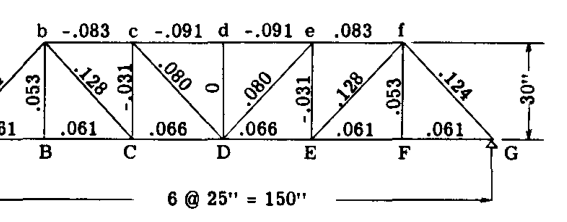

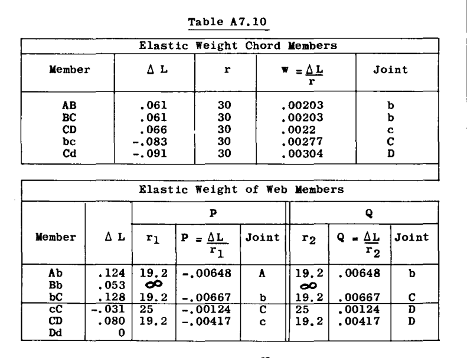

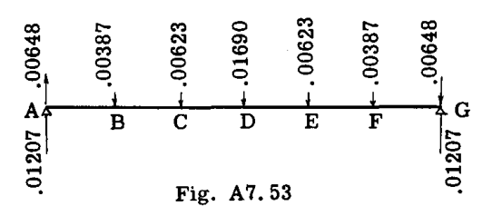

### 例題 40
Fig. A7.54の非対称荷重トラスの鉛直接点たわみを求めよ。すべての部材の  $\Delta L$  変形を図に示す。Table A7.11は、弾性荷重、その符号、および作用点の計算を示している。Fig. A7.55は、Table A7.11からの弾性荷重が載荷された仮想梁を示している。Table A7.12は接点たわみの計算を示している。  

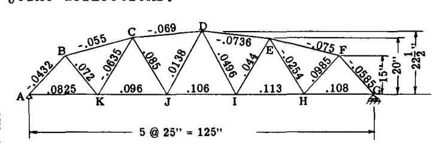

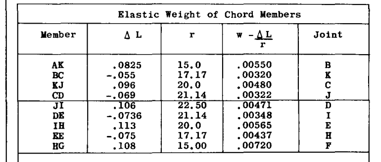

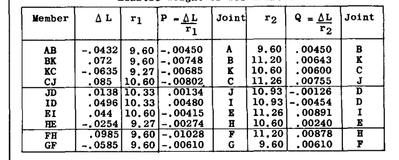

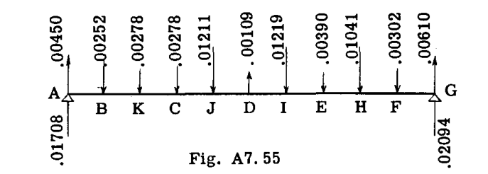

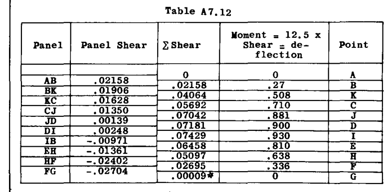

### 例題 41
Fig. A7.56は、両端に片持ちの張り出し（オーバーハング）を持つ単純支持トラスを示している。この簡略化されたトラスは、胴体への取り付け位置が e および e' であるような片持ち翼梁の代表である。与えられた外部荷重による各トラス部材の  $\Delta L$  変形を図に示す。完全なトラス弾性荷重を決定する。弾性荷重が分かれば、様々な基準線からのトラスのたわみが容易に決定される。  

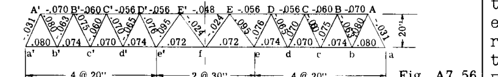

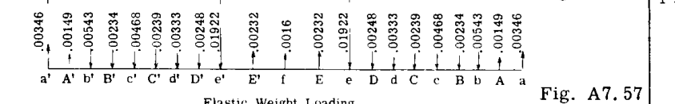

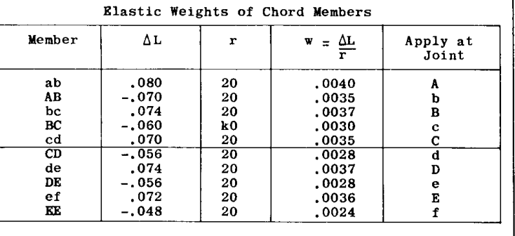

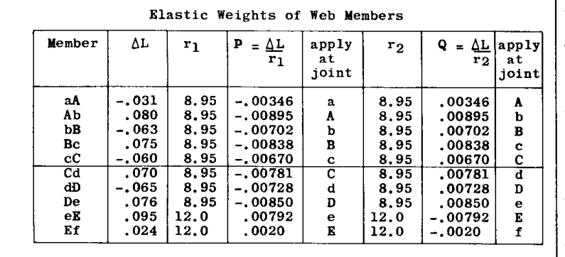

Table A7.13は、部材弾性荷重の大きさの計算を示している。符号および弾性荷重を配置するための接点位置も示されている。Table A7.13からの各接点の弾性荷重を代数的に組み合わせることで、Fig. A7.57に示す梁の弾性荷重が得られる。  

まず、トラス支持点 e および e' に対する接点 f の鉛直たわみを決定することが求められる。  
支持点 e および e' の間のトラスのたわみを決定するには、これらの点の間にある弾性荷重のみを考慮すればよい。Fig. A7.58は、これらの点の間のFig. A7.57の仮想梁の部分を示している。線 ee' に対する f におけるたわみは、接点 e および e' の間で単純支持された仮想梁の部分の、f における曲げモーメントに等しい。  

したがって、f におけるたわみ =  $-.00312 \times 30 + .00232 \times 15 = .0586"$  （マイナスは上向きなので、上向き）。  

次に、支持点 e および e' に対するトラスの片持ち張り出し部分の鉛直たわみを求める。  
片持ち部分は e において固定されていない（拘束が e' と e の間のトラスによって決定されるため）ため、片持ち部分を載荷する際にこの事実を考慮しなければならない。Fig. A7.58の梁の反力は、e と e' の間の弾性荷重による e における傾きを表している。したがって、逆方向に作用するこの弾性反力は、Fig. A7.59に示すように、e と a の間の仮想梁に荷重として適用される。  

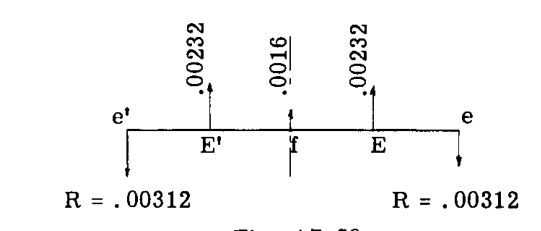

たわみを求める際、この張り出した弾性荷重部分は a で固定、e で自由であるとみなされる。この梁上の任意の点における曲げモーメントは、その点における鉛直たわみの大きさに等しい。  

したがって、トラス端（接点 a）のたわみを求めるには、Fig. A7.59の仮想梁の点 a における曲げモーメントを求める。  
したがって、  
a におけるたわみ =  $\Sigma M_a$  （反時計回りを正とする）。  
 $= (.01922 - .00312) \cdot 80 + .00248 \times 70 + .00333 \times 60 + .00239 \times 50 + .00468 \times 40 + .00234 \times 30 + .00543 \times 20 - .00149 \times 10 = 2.13"$  上向き。  
トラスの形状と荷重の対称性により、トラスの中心線における弾性曲線の傾きは水平またはゼロであることがわかっている。したがって、接点 f を基準とした任意の点のたわみを求めるには、面積モーメント法のたわみの原理を利用できる。  
したがって、Fig. A7.60において、接点 f に対する例えば接点 a の鉛直たわみは、a と f の間にあるすべての弾性荷重の a のまわりのモーメントに等しい。  

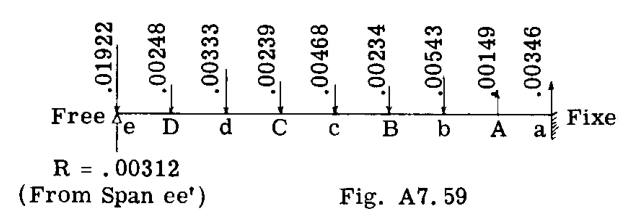

 $\Sigma M_a = 2.077"$  （学生が計算を行うべきである）。以前に e に対する f のたわみは  $-.0586"$  であることがわかった。したがって、点 e に対する a のたわみ =  $2.077 + .0586 = 2.135"$  となり、上で求めた値と一致する。  
接点 b と d を結ぶ線に対する接点 c のたわみを求めることが求められているとする。  

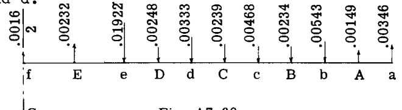