この問題では、b点とd点で支持された単純梁上の荷重として、点bとdの間の弾性荷重のみを考慮する必要がある（図 A7.61参照）。たわんだトラスの線 bd に対する c 点でのたわみは、図 A7.61 の荷重を受けた梁の c 点における曲げモーメントに等しい。  
したがって、  
 $\delta_c = .004743 \times 20 - .00239 \times 10 = .07$  インチ  

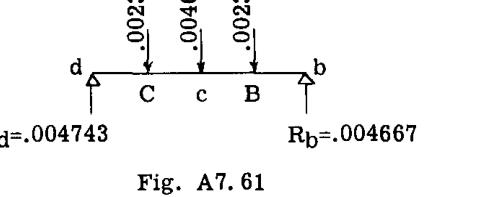

### A7.18 問題

(1) 図 A7.62 の構造物について、節点 B の垂直および水平方向のたわみを求めよ。  
AB の面積 =  $0.2$  sq. in.、BC =  $0.3$ 。 $E = 10,000,000$  psi。  

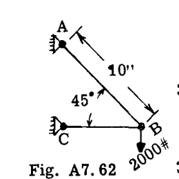

(2) 図 A7.63 のトラスについて、節点 C の垂直たわみを計算せよ。各部材の  $AE$  は  $2 \times 10^7$  とする。  

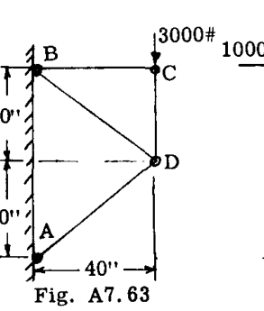

(3) 図 A7.64 のトラスについて、節点 E の水平たわみを決定せよ。各トラス部材の面積 =  $1$  sq. in.、 $E = 10,000,000$  psi。  

(4) 図 A7.64 のトラスの節点 E の垂直たわみを決定せよ。  

(5) 図 A7.64 のトラスにおいて、節点 C と E を結ぶ線に対して垂直な、節点 D のたわみを決定せよ。  

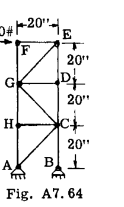

(6) 図 A7.65 のトラスにおいて、節点 B の荷重による節点 C の垂直変位を計算せよ。部材 a, b, c, h の断面積はそれぞれ  $20$  sq. in. である。部材 d, e, f, g, i の断面積はそれぞれ  $2$  sq. in. である。 $E = 30,000,000$  psi。  

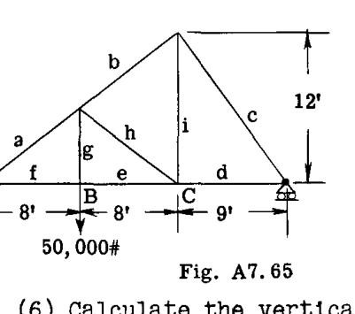

(7) 図 A7.66 のトラスについて、方向 CE に沿った節点 C のたわみを計算せよ。 $E = 30,000,000$  psi。  

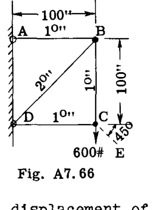

(8) 図 A7.67 のトラスについて、節点 C および D の垂直および水平変位を求めよ。引張を受けるすべての部材の断面積を各  $2$  sq. in.、圧縮を受ける部材の断面積を各  $5$  sq. in. とせよ。 $E = 30,000,000$  psi。  

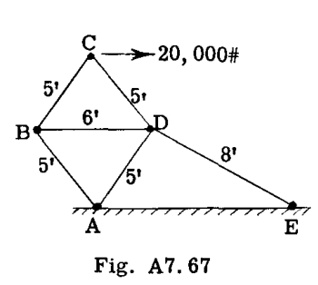

(9) 図 A7.68 のトラスについて、点 C および B の水平変位を決定せよ。 $E = 28,000,000$  psi。  

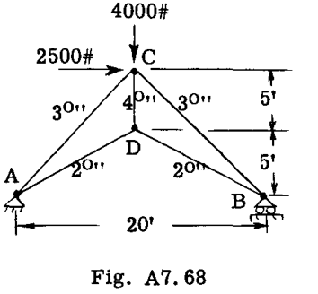

(10) 図 A7.69 のトラスについて、節点 D の垂直たわみを求めよ。トラスの高さ =  $180"$ 。各パネルの幅は  $180"$  である。各トラス部材の断面積は、図中の各部材に示された数値で表されている。 $E = 30,000,000$  psi。また、部材 DE の回転角を計算せよ。  

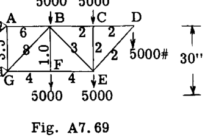

(11) 図 A7.70 のトラスについて、節点 A および B の垂直および水平変位を計算せよ。引張部材の断面積を各  $1$  sq. in.、圧縮部材を各  $2$  sq. in. と仮定せよ。 $E = 10,300,000$  psi。  

(12) 図 A7.70 のトラスについて、与えられたトラス荷重下での部材 AB の回転角を計算せよ。  

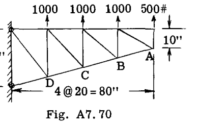

(13) 図 A7.71 の梁について、弾性重量法を用いて点 A および B におけるたわみを求めよ。また、これらの点における弾性曲線の勾配を決定せよ。 $E = 1,000,000$  psi および  $I = 1296$  in. $^4$  とせよ。  

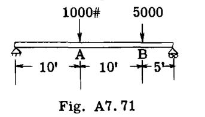

(14) 図 A7.72 の梁について、点 A および E におけるたわみを求めよ。また、点 C における弾性曲線の勾配を求めよ。 $EI$  は  $5,000,000$  lb-in. $^2$  に等しいと仮定せよ。  

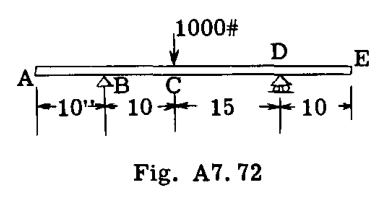

# 構造物のたわみ

(15) 図 A7.73 は、フラップ梁 ABCDE 上の空気荷重を示している。フラップ梁は B 点と D 点で支持されており、C 点に  $500$  ポンドのホーン荷重が作用している。梁は  $1"-.049$  のアルミニウム合金丸管で作られている。 $I = .01659$  in. $^4$ 、 $E = 10,300,000$  psi である。点 C および E におけるたわみ、および B 点における弾性曲線の勾配を計算せよ。  

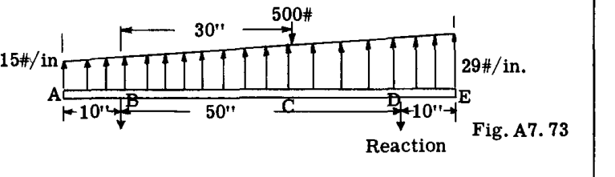

(16) 図 A7.74 の梁について、点 C および D におけるたわみを、一定である  $EI$  を用いて表せ。また、これらの点における弾性曲線の勾配も決定せよ。  

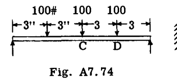

(17) 図 A7.75 の片持ち梁について、点 A および B における弾性曲線のたわみと勾配を決定せよ。 $EI$  は一定とし、結果を  $EI$  を用いて表せ。  

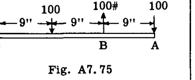

(18) 図 A7.76 の荷重を受けた梁について、固定端モーメント  $M_A$  および  $M_B$  の値を決定せよ。 $EI$  は一定である。また、点 C および D におけるたわみを  $EI$  を用いて求めよ。  

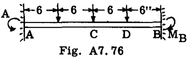

(19) 図 A7.77 において、固定端モーメント  $M_A$  の大きさと、単純支持  $R_B$  を決定せよ。  

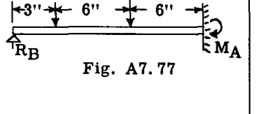

(20) 図 A7.78 において、 $EI$  は全体にわたって一定である。点 A の垂直たわみと回転角を計算せよ。  

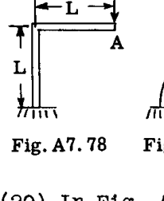

(21) 図 A7.79 の曲がり梁について、点 A の垂直たわみと回転角を求めよ。 $EI$  は一定とする。  

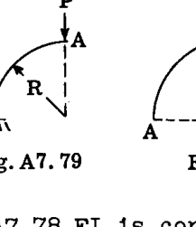

(22) 図 A7.80 の荷重を受けた曲がり梁について、点 A の垂直たわみと回転角を決定せよ。 $EI$  は一定とする。  

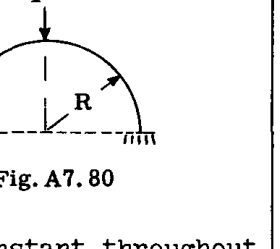

(23) 図 A7.81 において、点 A の垂直移動量と回転角を求めよ。 $EI = 12,000,000$  とする。  

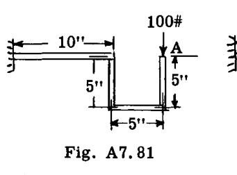

(24) 図 A7.82 の構造物について、点 A の垂直たわみを決定せよ。 $EI = 14,000,000$  である。  

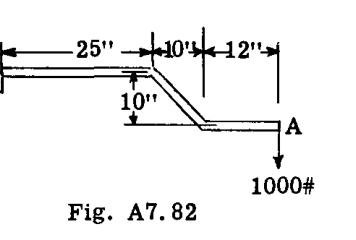

(25) 図 A7.83 の片持ち梁は、図示のようにそれぞれ  $100$  ポンドの 2 つの荷重によって、紙面に垂直な方向に荷重を受けている。仮想仕事法により、紙面に垂直な方向の点 A のたわみを求めよ。管の矩形慣性モーメントは  $0.0277$  in. $^4$ 、 $E = 29,000,000$  である。  

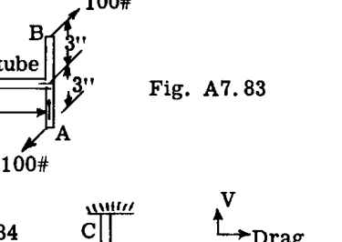

(26) 図 A7.84 の片持ち着陸装置支柱は、点 A において抗力方向に  $500$  ポンドの荷重を受け、また図示のように A 点において  $2000$  in. lb. のねじりモーメントを受けている。抗力方向における点 A の変位を決定せよ。管のサイズは、CB 部分が  $2"-.083$ 、BA 部分が  $2"-.065$  の丸管である。材料はスチールで、 $E = 29,000,000$  psi である。  

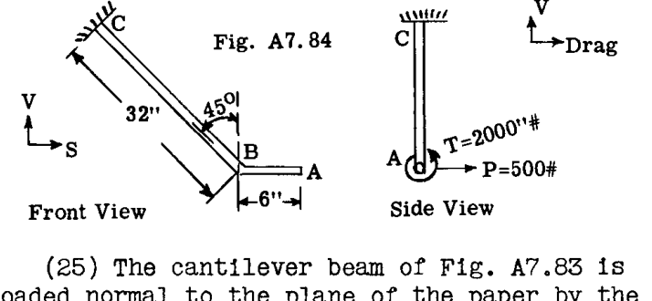

(27) マトリクス方程式 

$$
2U = [q_i] [a_{ij}] \{q_j\}
$$

を用いて、図 A7.63 のトラス（問題 2）のひずみエネルギーを計算せよ。一様な軸荷重を受ける部材の部材柔軟性係数は  $L/AE$  である（図 A7.35a 参照）。  
答:  $U = 22.4$  lb. in.  

(28) マトリクス方程式 (23) を用いて、図 A7.71 の梁のひずみエネルギーを計算せよ。注：一般化力の選択は、p. A7.19 の式による部材柔軟性係数の計算を可能にするように行われるべきである。  
答:  $U = 3533$  lb. in.  

(29) 例題 25 の問題を、点 "2" で  $I$  が 2 倍になり、点 "3" でさらに 2 倍になる段付き片持ち梁について再度解け。（固定端側が最も重い断面となる。）  

(30) 図 A7.85 のトラスについて、図示のように適用された荷重  $P_1, P_2, P_3, P_4$  による垂直たわみを関連付ける影響係数行列を決定せよ。部材断面積は図に示されている。  

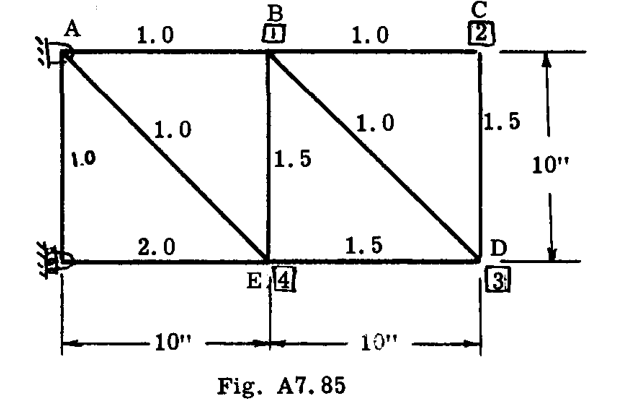

答.

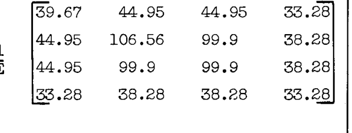

(31) 問題 (30) のトラスについて、次の 2 つの荷重条件のうちどちらが点 4 のたわみを最大にするか決定せよ（すべての荷重はポンド単位）。  

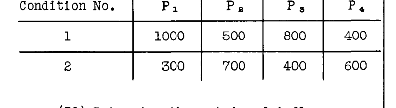

(32) 問題 26 のギア支柱アセンブリの自由端に適用される、抗力（後方正）、制動トルク（機首上げ正）、および V-S 平面内のモーメント（右翼下げ正）を関連付ける影響係数マトリクスを決定せよ。  

答.

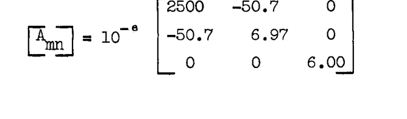

(33) 図 A7.86 の片持ちパネルに適用された荷重のたわみを求めよ（ウェブは座屈しないものと仮定する）。行列記法を使用せよ。  
答:  $\delta = 7.94 \times 10^{-3}$  インチ  

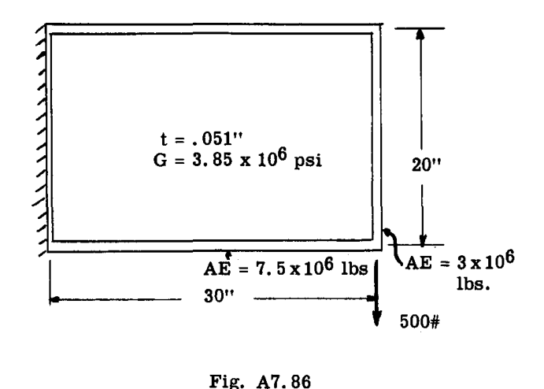

(34) 図 A7.87 の単純支持梁の点 1 および 2 におけるたわみを関連付ける影響係数を求めよ。行列法を使用せよ。  

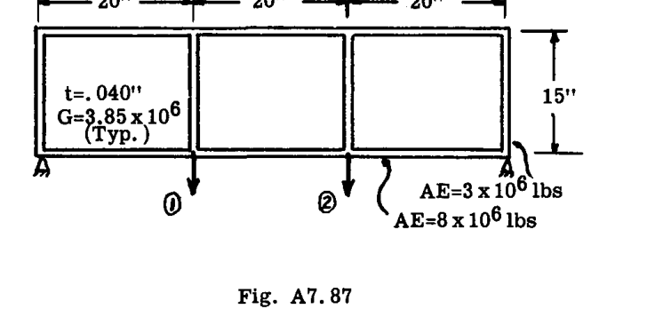

答.

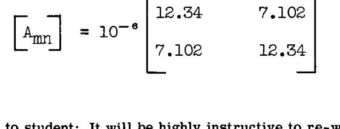

学生への注意：最初の解答で使用したものとは異なる、ストリンガー内の一般化力の選択肢を使用して、問題 33 および 34 をやり直すことは非常に有益である。ストリンガー上の代替一般化力については、p. A7.22 を参照のこと。  

第 A7 章、A8 章の参考文献。  

構造理論の教科書  
- "Advanced Mechanics of Materials", F. Seely and J. O. Smith, 2nd Ed., John Wiley, New York.  
- "Advanced Strength of Materials", J. P. Den Hartog, McGraw-Hill, N. Y.  
- "Theory of Elasticity", S. Timoshenko, McGraw-Hill, N. Y.  

マトリクス応用を含む教科書  
- "Elementary Matrices", R. A. Frazer, W. J. Duncan and A. R. Collar, Cambridge University Press.  
- "Introduction to the Study of Aircraft Vibration and Flutter", R. Scanlan and R. Rosenbaum, Mac Millan, New York.  

技術論文  
- Benscoter, S. U., "The Partitioning of Matrices in Structural Analysis", Journ. of Appl. Mechs. Vol. 15, 1948.  
- Wehle, L. and Lansing, W., "A Method for Reducing the Analysis of Complex Redundant Structures to a Routine Procedure", Journ. of Aero. Sci. Vol. 19, 1952.  
- Langefors, B., "Analysis of Elastic Structures by Matrix Transformation with Special Regard to Semi Monocoque Structures", Journ. of Aero. Sci. 19, 1952.  
- Langefors, B., "Matrix Methods for Redundant Structures", Journ. of Aero. Sci. Vol. 20, 1953.  
- Falkenheiner, H. "Systematic Analysis of Redundant Elastic Structures by Means of Matrix Calculus", Journ. of Aero. Sci., 20, 1953.  
- Argyris, J. and Kelsey, S., "Energy Theorems in Structural Analysis", Aircraft Engineering, Oct. 1954, et. seq.  

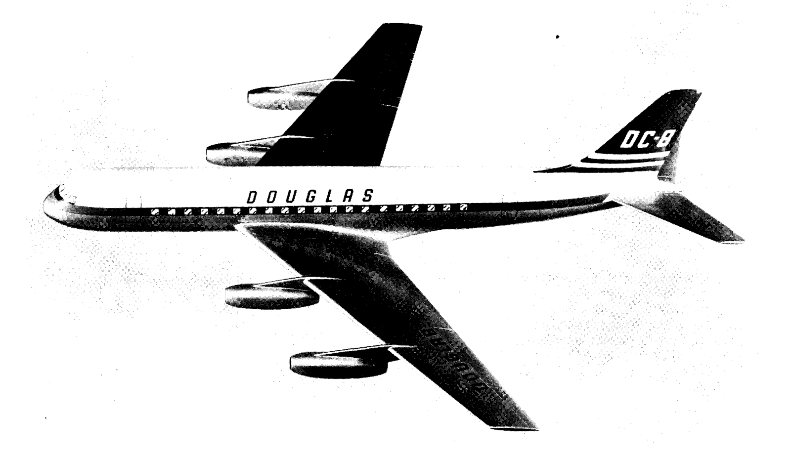

ダグラス DC-8 のような大型の近代航空機の構造設計においては、たわみの計算を伴う多くの問題に遭遇する。