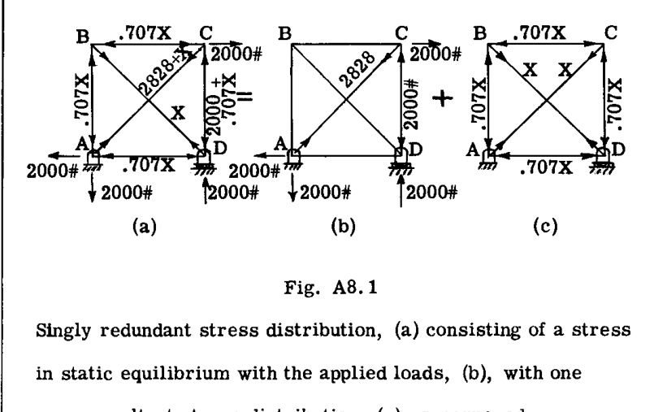
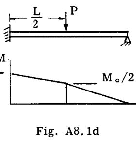
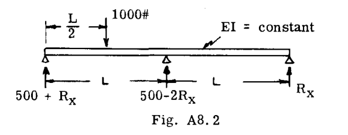
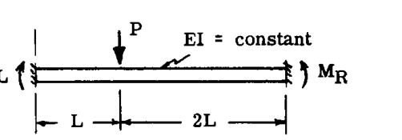
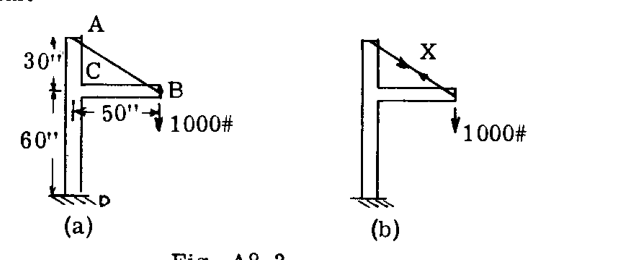

# 第A8章  
# 静的不静定構造物  
### ALFRED F. SCHMITT  

**A8.00 はじめに**  
静的不静定（冗長）問題とは、静的釣合方程式だけでは内部応力分布を決定するのに不十分な問題のことである。解を得るためには、変位間の追加の関係式を記述しなければならない。  

「弾性理論」によれば、詳細に分析した場合、すべての構造物は静的に不不静定である。しかし、エンジニアは多くの場合、問題を静定にするような多くの仮定や粗い近似を行うことができる。さらに、Engineering Theory of Bending ( $M/I$ ) や一定せん断流の経験則 ( $q = T/2A$ )（第A-5、A-6、A-13からA-15章を参照）などの補助的な手段も利用可能である。これらは厳密には「静力学」の法則ではないが、エンジニアは応力分布を得るためにこれらを頻繁に使用するため、これらが使用される問題は「静定」であると考えられることが多い。  

航空機の構造解析においては、効率的な設計が求められるため、必要な精度を犠牲にすることなく静定問題を得ることはできない場合が多い。弾性理論は、そのような場合に解を可能にする十分な数の補助条件の存在を保証する。  

本章では、第A-7章の手法を拡張して、典型的な冗長問題の解を導く。特定の構造構成を扱う特別な手法については、後の章で示す。  

**A8.0 重ね合わせの原理**  
重ね合わせの一般原理によれば、同時に作用する一群の荷重または原因の結果としての効果は、個別に作用する効果の代数和に等しい。この原理は、結果としての効果が線形関数として変化するという条件に制限される。したがって、部材材料が比例限度を超えて応力を受けた場合や、部材の応力が部材のたわみや変形に依存する場合（例えば、曲げ荷重と軸方向荷重を同時に受ける柱梁など）には、この原理は適用されない。  

**A8.1 静的不静定問題**  
静的不静定問題のいくつかの特徴（およびその解釈）を指摘することができる。これらの特徴は、それぞれ解法の基礎を形成する上で有用である。  

[A] 構造物には、加えられた荷重を支えるために必要な数以上の部材がある。安定した構造を維持したまま  $n$  個の部材を取り除く（切断する）ことができる場合、元の構造は「 $n$  次の不静定（冗長）」であると言われる。  

-系-  
 $n$  次の不静定構造物において、 $n$  個の部材の力の大きさは、加えられた荷重と釣り合う応力を確立しながら、任意に割り当てることができる。したがって、図A8.1（1次の不静定構造物）において、(a)の内部力分布は、部材BDの力である  $X$  のいかなる値に対しても外荷重と釣り合っている。  

  

**Fig. A8.1**  
1次の冗長応力分布。(a) 外荷重と静的平衡状態にある応力 (b) と、合力がゼロの応力分布 (c) を重ね合わせたもの。  

外荷重を釣り合わせるために実際に必要なのはシステム (b) だけである（ $X = 0$  に対応）。システム (c) は外部合力がゼロであることに注目されたい。  

[B] 静的平衡を満たすすべての可能な応力（力）分布の中で、唯一の正しい解は、運動学的に可能な歪み（変位）をもたらすもの、すなわち構造の連続性を維持するものである。  

したがって、例えば、図A8.1d では、 $M_0$  が任意の値を取りうるため、静的平衡を満たす曲げモーメント分布は無限に存在する。これらのうち、その点での支持との構造的連続性を維持するために必要な、右端の梁先端のたわみがゼロになるものは1つだけである。  

  

**Fig. A8.1d**  
静力学では未定の根元曲げモーメント  $M_0$  を持つ1次の冗長梁。  

-系-  
外荷重との平衡を保ちながら  $n$  個の部材荷重が任意に割り当てられた場合、要素の相対的な移動が生じ、 $n$  個の点で連続性が損なわれる。その後、 $n$  個の合力ゼロの応力（力）分布を重ね合わせて、相対的な運動をゼロにすることができる。その結果得られる応力分布が正しいものである。  

**A8.2 最小仕事の定理**  
冗長問題の解決に非常に有用な定理は、カスティリアノの定理から得ることができる。まず、3つの支持点を持つ梁（図A8.2）のような冗長反力の問題を考える。反力の1つは静力学では求めることができない。  

  

**Fig. A8.2**  
1つの反力に任意の値を指定した1次の冗長梁 ( $R_x$ )。  

未知の反力（例えば、一番右側の反力）に記号  $R_x$  を与えると、残りの反力と曲げモーメントは静力学から決定できる。ひずみエネルギー  $U$  は  $R_x$  の関数、すなわち  $U = f(R_x)$  として記述できる。次に以下の形式をとる。  

$$ 
\frac{\partial U}{\partial R_x} = \delta_{R_x} 
$$ 

これは  $R_x$  による  $R_x$  点でのたわみである。しかし、支持部は剛体であるため、これもゼロでなければならない。したがって、  

$$ 
\frac{\partial U}{\partial R_x} = 0 
$$ 

式(1)は、固定支持部で発生するすべての不静定反力に対して真である。これは関数の最小値の数学的条件に対応するため、式(1)は**最小仕事の定理**を述べていると言われる。言葉で言えば、「固定された冗長反力に関するひずみエネルギーの変化率はゼロである」となる。  

**A8.2.1 最小仕事による不静定反力の決定**  

**例題 A**  
図解として、図A8.2で提示された問題を最後まで進める。曲げモーメントは（ $x, y, z$  は3つの梁区間の左端から測定）以下のように与えられた。  

$$ 
M = (500 + R_x)x \quad 0 < x < L/2 
$$ 

$$ 
M = \frac{(500 + R_x)L}{2} + (R_x - 500)y \quad 0 < y < L/2 
$$ 

$$ 
M = R_x(L - z) \quad 0 < z < L 
$$ 

このとき、  

$$ 
U = \frac{1}{2} \int \frac{M^2 dx}{EI} = \frac{1}{2EI} \int_0^{L/2} (500 + R_x)^2 x^2 dx 
$$ 

$$ 
+ \frac{1}{2EI} \int_0^{L/2} \left[ \frac{(500 + R_x)L}{2} + (R_x - 500)y \right]^2 dy 
$$ 

$$ 
+ \frac{1}{2EI} \int_0^L R_x^2 (L - z)^2 dz 
$$ 

積分記号下で微分すると（p. A7.8を参照）、  

$$ 
\frac{\partial U}{\partial R_x} = \frac{1}{EI} \int_0^{L/2} (500 + R_x) x^2 dx 
$$ 

$$ 
+ \frac{1}{EI} \int_0^{L/2} \left[ \frac{(500 + R_x)L}{2} + (R_x - 500)y \right] \left( \frac{L}{2} + y \right) dy 
$$ 

$$ 
+ \frac{1}{EI} \int_0^L R_x (L - z)^2 dz 
$$ 

$$ 
\frac{\partial U}{\partial R_x} = 0 = (500 + R_x) \int_0^{L/2} x^2 dx 
$$ 

$$ 
+ \frac{(500 + R_x)L}{2} \int_0^{L/2} \left( \frac{L}{2} + y \right) dy + (R_x - 500) \int_0^{L/2} y \left( \frac{L}{2} + y \right) dy + R_x \int_0^L (L - z)^2 dz 
$$ 

計算を完了すると、  

$$ 
R_x = - \frac{1500}{16} \text{ lbs.} = - 93.8 \text{ lbs.} 
$$ 

となり、負の符号は  $R_x$  が下向きであることを示している。  

**例題 B**  
図A8.2aの梁について、不静定な固定端モーメントを求めよ。  

  

**Fig. A8.2a**  
2つの反力に任意の値を与えた2次の冗長梁。  

**解:**  
左右の梁端の不静定モーメントをそれぞれ  $M_L$  と  $M_R$  とし、図のように正の方向をとる。2つの梁部分のモーメント方程式（ $x$  は左端から、 $y$  は右端から）は以下の通りであった。  

$$ 
M = M_L + \frac{M_R + 2PL - M_L}{3L} x \quad 0 < x < L 
$$ 

$$ 
M = M_R + \frac{M_L + PL - M_R}{3L} y \quad 0 < y < 2L 
$$ 

このとき、  

$$ 
U = \frac{1}{2EI} \int_0^L \left[ M_L + \frac{M_R + 2PL - M_L}{3L} x \right]^2 dx + \frac{1}{2EI} \int_0^{2L} \left[ M_R + \frac{M_L + PL - M_R}{3L} y \right]^2 dy 
$$ 

積分記号下で微分すると（p. A7-8の備考を参照）、  

$$ 
\frac{\partial U}{\partial M_L} = 0 = \int_0^L \left[ M_L + \frac{M_R + 2PL - M_L}{3L} x \right] \left( 1 - \frac{x}{3L} \right) dx + \int_0^{2L} \left[ M_R + \frac{M_L + PL - M_R}{3L} y \right] \frac{y}{3L} dy 
$$ 

積分を評価し、連立方程式を解くと以下の結果が得られた。  

$$ 
M_L = - \frac{4}{9} PL 
$$ 

$$ 
M_R = - \frac{2}{9} PL 
$$ 

**A8.2.2 最小仕事による不静定応力**  
最小仕事の定理は、静的不静定構造物内の不静定部材力を決定する問題にも適用できる。したがって、 $n$  次の不静定構造物において、不静定部材力に記号  $X, Y, Z$  等を割り当てた場合、構造の連続性のためにこれらの力が取らなければならない値は、これらの力に関連する変位（不連続性）がゼロになるような値である。したがって、不静定反力に用いられた議論と同様に、次のように記述できる。  

$$ 
\frac{\partial U}{\partial X} = 0, \quad \frac{\partial U}{\partial Y} = 0, \dots 
$$ 

言葉で言えば、「不静定力に関するひずみエネルギーの変化率はゼロである」となる。これらの式は、不静定反力の式と同様に、最小仕事の定理の声明である。これらは  $n$  次の不静定構造物に対して  $n$  個の方程式を提供する。これらの連立方程式を解くことで、問題の所望の解が得られる。  

**例題 C**  
図A8.3(a)のカントリバー梁とケーブルのシステムは1次の冗長である。最小仕事の定理を用いて部材荷重を求めよ。  

  

**Fig. A8.3**  
1つの部材力に任意の値 ( $X$ ) を与えた1次の冗長構造。  

**解:**  
ケーブル内の引張荷重を不静定荷重として扱い、記号  $X$  を与えた（図A8.3(b)）。考慮されたひずみエネルギーは、部分AC、CD、BCの曲げによるものと、ケーブルABの引張によるものである。梁部分の軸力によるエネルギーは無視できるものとされた。  

BC（原点はB）の曲げモーメントは次の通りであった。  

$$ 
M_{BC} = \left( 1000 - \frac{30}{58.3} X \right) x 
$$ 

AC（原点はA）において、  

$$ 
M_{AC} = \frac{50}{58.3} X \cdot y 
$$ 

CDにおいて、  

$$ 
M_{CD} = 50,000 
$$ 

ひずみエネルギーはしたがって、  

$$ 
U = \frac{X^2}{2} \left( \frac{L}{AE} \right)_{AB} + \frac{1}{2EI_{BC}} \int_0^{50} \left( 1000 - \frac{30}{58.3} X \right)^2 x^2 dx + \dots 
$$ 

CDの荷重は  $X$  に依存せず、したがって問題に関与しないため、CDのエネルギーを考慮する必要がないことは明らかである。積分記号下で微分すると、  

$$ 
\frac{\partial U}{\partial X} = \frac{58.3 X}{EA_{AB}} - \frac{30}{58.3 EI_{BC}} \int_0^{50} \left( 1000 - \frac{30}{58.3} X \right) x^2 dx + \dots = 0 
$$ 

数値を代入して解くと、  

$$ 
X = 613 \text{ lbs.} 
$$ 

が得られた。  