# 第A8章

# 不静定構造物

### アルフレッド・F・シュミット

**A8.00 はじめに**

不静定（冗長）問題とは、静止平衡の方程式だけでは内部応力分布を決定するのに十分ではない問題のことである。解を得るためには、変位間の追加の関係式を記述しなければならない。

「弾性理論」によれば、微細に分析した場合、すべての構造物は不静定である。しかし、エンジニアは多くの場合、問題を静定にするような多数の仮定や粗い近似を行うことができる。さらに、曲げの工学理論（ $\frac{MY}{I}$ ）や、一定せん断流の経験則（ $q = T/2A$ ）などの補助的な手段も利用可能である（第A-5、A-6、およびA-13からA-15章を参照）。これらは厳密には「静力学」の法則ではないが、エンジニアはこれらを応力分布を得るために頻繁に使用するため、これらが使用される問題は「静定」であると考えられることが多い。

航空機の構造解析においては、効率的な設計の要件に鑑み、必要な精度を犠牲にすることなく静定問題を得ることができない場合が頻繁にある。弾性理論は、そのような場合に解を可能にする十分な数の補助条件の存在を保証する。

本章では、典型的な不静定問題を解決するために、第A-7章の手法の拡張を採用する。特定の構造構成を扱うための特別な手法は、後の章で示される。

**A8.0 重ね合わせの原理**

重ね合わせの一般原理は、同時に作用する一連の荷重または原因の合成効果は、別々に作用する効果の代数和に等しいと述べている。この原理は、合成効果が線形関数として変化するという条件に限定される。したがって、部材材料が比例限度を超えて応力を受けた場合、または部材の応力が部材のたわみや変形に依存する場合（例えば、曲げ荷重と軸荷重を同時に受ける柱である梁-柱など）、この原理は適用されない。

**A8.1 不静定問題**

不静定問題のいくつかの特徴（およびその解釈）を指摘することができる。これらの特徴は、それぞれ解法の基礎を形成するのに有用である。

A. 構造物には、加えられた荷重を支えるために必要な数よりも多くの部材がある。安定した構造を残したまま  $n$  個の部材を取り除く（切断する）ことができる場合、元の構造は「 $n$  次の不静定（冗長）」であると言われる。

---系---

 $n$  次の不静定構造物において、 $n$  個の部材の力の大きさは、加えられた荷重と平衡する応力を確立しながら任意に割り当てることができる。したがって、図A8.1（1次の不静定構造物）において、(a)の内部力分布は、部材BDの力  $X$  のいかなる値に対しても外部荷重と平衡している。

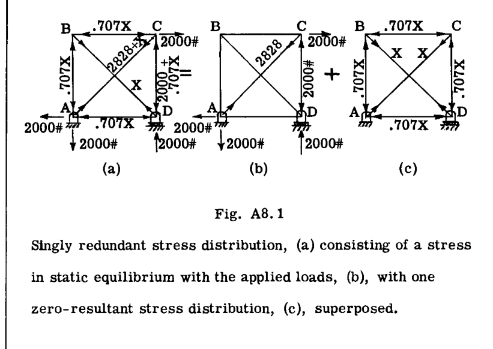

システム(b)のみが、実際に外部荷重を釣り合わせるために必要である（ $X = 0$  に対応）。システム(c)は外部合力がゼロであることに注意せよ。

B. 静止平衡を満たすすべての可能な応力（力）分布の中で、唯一の正しい解は、運動学的に可能な歪み（変位）をもたらすもの、すなわち構造の連続性を維持するものである。

したがって、例えば、図A8.1(d)において静止平衡を満たす曲げモーメント分布は、 $M_0$  が任意の値を取り得るため、無限に存在する。これらのうち、その点での支持との構造的連続性を維持するために必要な、右側の梁の先端のたわみをゼロにするものは1つだけである。

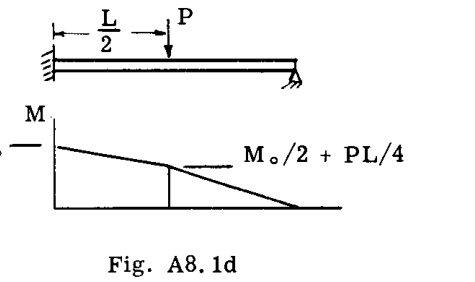

---系---

外部荷重との平衡を確立しながら  $n$  個の部材荷重が任意に割り当てられた場合、要素の相対的な動きが生じ、 $n$  個の点で連続性が損なわれる。その後、 $n$  個の合力ゼロの応力（力）分布を重ね合わせて、相対的な動きをゼロにすることができる。得られた応力分布が正しいものである。

**A8.2 最小仕事の定理**

不静定問題の解決に極めて有用な定理が、カスティリアノの定理から得られる。まず、図A8.2に示すような3つの支持点を持つ梁の不静定反力の問題を考えてみよう。反力の1つは静力学では得られない。

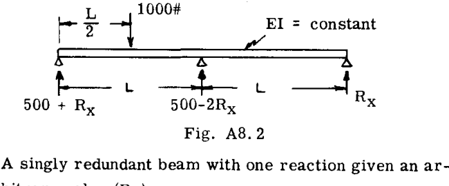

未知の反力（例えば一番右のもの）を記号  $R_x$  とすると、残りの反力と曲げモーメントは静力学から決定できる。ひずみエネルギー  $U$  は  $R_x$  の関数、すなわち  $U = f(R_x)$  として記述できる。次の形式をとる：

$$
\frac{\partial U}{\partial R_x} = \delta_{R_x}
$$

これは  $R_x$  による  $R_x$  点でのたわみである。しかし、支持は剛体であるため、これもゼロでなければならない。したがって、

$$
\frac{\partial U}{\partial R_x} = 0 \quad \dots \dots \dots \dots \dots \dots (1)
$$

式(1)は、固定支持で発生するすべての不静定反力に対して真である。これは関数の最小値の数学的条件に対応するため、式(1)は最小仕事の定理（Theorem of Least Work）を述べていると言われる。言葉で言えば、「固定された不静定反力に関するひずみエネルギーの変化率はゼロである」となる。

**A8.2.1 最小仕事による不静定反力の決定**

**例題 A**
図解として、図A8.2で提示された問題を完了まで進める。曲げモーメントは、（ $x, y, z$  は3つの梁区間の左端から測定される）によって与えられた。

$$
M = (500 + R_x)x \quad (0 < x < L/2)
$$

$$
M = \frac{(500 + R_x)L}{2} + (R_x - 500)y \quad (0 < y < L/2)
$$

$$
M = R_x(L - z) \quad (0 < z < L)
$$

このとき、

$$
U = \frac{1}{2} \int \frac{M^2 dx}{EI} = \frac{1}{2EI} \int_0^{L/2} (500 + R_x)^2 x^2 dx
$$

$$
+ \frac{1}{2EI} \int_0^{L/2} \left[ \frac{(500 + R_x)L}{2} + (R_x - 500)y \right]^2 dy
$$

$$
+ \frac{1}{2EI} \int_0^L R_x^2(L - z)^2 dz
$$

積分記号下での微分を行うと（p. A7.8 参照）：

$$
\frac{\partial U}{\partial R_x} = \frac{1}{EI} \int_0^{L/2} (500 + R_x) x^2 dx
$$

$$
+ \frac{1}{EI} \int_0^{L/2} \left[ \frac{(500 + R_x)L}{2} + (R_x - 500)y \right] \left[ \frac{L}{2} + y \right] dy
$$

$$
+ \frac{1}{EI} \int_0^L R_x(L - z)^2 dz
$$

$$
\frac{\partial U}{\partial R_x} = 0 = (500 + R_x) \int_0^{L/2} x^2 dx
$$

$$
+ \frac{(500 + R_x)L}{2} \int_0^{L/2} \left( \frac{L}{2} + y \right) dy + (R_x - 500) \int_0^{L/2} y \left( \frac{L}{2} + y \right) dy + R_x \int_0^L (L - z)^2 dz
$$

計算を完了すると、以下のようになった：

$$
R_x = -\frac{1500}{16} \text{ lbs.} = -93.8 \text{ lbs.}
$$

負の符号は、 $R_x$  が下向きであることを示している。

**例題 B**
図A8.2(a)の梁について、不静定な固定端モーメントを求めよ。

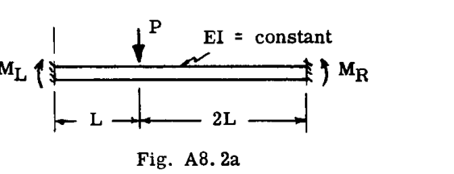

**解法:**
不静定端モーメントを左端および右端の梁端に対してそれぞれ  $M_L$  および  $M_R$  と指定し、図のように正とした。2つの梁部分のモーメント方程式（ $x$  は左端から、 $y$  は右端から）は以下の通りであった。

$$
M = M_L + \frac{M_R + 2PL - M_L}{3L} x \quad (0 < x < L)
$$

$$
M = M_R + \frac{M_L + PL - M_R}{3L} y \quad (0 < y < 2L)
$$

このとき、

$$
U = \frac{1}{2EI} \int_0^L \left[ M_L + \frac{M_R + 2PL - M_L}{3L} x \right]^2 dx
$$

$$
+ \frac{1}{2EI} \int_0^{2L} \left[ M_R + \frac{M_L + PL - M_R}{3L} y \right]^2 dy
$$

積分記号下での微分を行うと（p. A7-8 の備考参照）：

$$
\frac{\partial U}{\partial M_L} = 0 = \int_0^L \left[ M_L + \frac{M_R + 2PL - M_L}{3L} x \right] \left( 1 - \frac{x}{3L} \right) dx
$$

$$
+ \int_0^{2L} \left[ M_R + \frac{M_L + PL - M_R}{3L} y \right] \frac{y}{3L} dy
$$

$$
\frac{\partial U}{\partial M_R} = 0 = \int_0^L \left[ M_L + \frac{M_R + 2PL - M_L}{3L} x \right] \frac{x}{3L} dx
$$

$$
+ \int_0^{2L} \left[ M_R + \frac{M_L + PL - M_R}{3L} y \right] \left( 1 - \frac{y}{3L} \right) dy
$$

積分の評価と連立方程式の解法により、以下の結果が得られた：

$$
M_L = -\frac{4}{9} PL
$$

$$
M_R = -\frac{2}{9} PL
$$

**A8.2.2 最小仕事による不静定応力**

最小仕事の定理は、不静定構造物内の不静定部材力を決定する問題にも適用できる。したがって、 $n$  次の不静定構造物において、不静定部材力に記号  $X, Y, Z, \dots$  などが割り当てられた場合、構造の連続性のためにこれらの力が取らなければならない値は、これらの力に関連する変位（不連続部）がゼロになるような値である。したがって、不静定反力に用いられた議論と並行して、次のように記述できる。

$$
\left. \begin{aligned} \frac{\partial U}{\partial X} &= 0 \\ \frac{\partial U}{\partial Y} &= 0 \\ &\dots \\ &\text{etc.} \end{aligned} \right\} \quad \dots \dots (2)
$$

言葉で言えば、「不静定力に関するひずみエネルギーの変化率はゼロである」となる。

式(2)は、式(1)と同様に、最小仕事の定理の言明である。これらは  $n$  次の不静定構造物に対して  $n$  個の方程式を提供する。これらの方程式の連立解により、問題の所望の解が得られる。

**例題 C**
図A8.3(a)の片持ち梁とケーブルのシステムは1次の不静定である。最小仕事の定理を用いて部材荷重を求めよ。

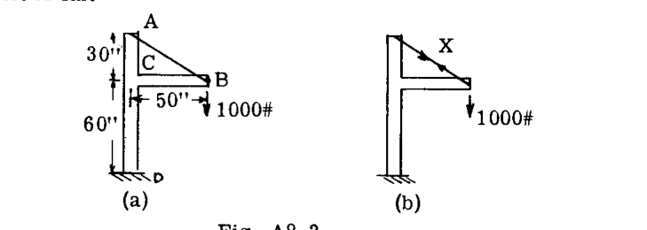

**解法:**
ケーブルの引張荷重を不静定荷重として扱い、記号  $X$  を与えた（図A8.3(b)）。考慮されたひずみエネルギーは、部分 AC、CD、BC の曲げエネルギーとケーブル AB の引張エネルギーであった。梁部分の軸力によるエネルギーは無視できるものとされた。

BC における曲げモーメント（原点は B）は次の通りであった：

$$
M_{BC} = \left( 1000 - \frac{30}{58.3} X \right) x
$$

AC において（原点は A）：

$$
M_{AC} = \frac{50}{58.3} X \cdot y
$$

CD において：

$$
M_{CD} = 50,000
$$

ひずみエネルギーはしたがって、

$$
U = \frac{X^2}{2} \left( \frac{L}{AE} \right)_{AB} + \frac{1}{2EI_{BC}} \int_0^{50} \left( 1000 - \frac{30}{58.3} X \right)^2 x^2 dx
$$

$$
+ \frac{1}{2EI_{AC}} \int_0^{30} \left( \frac{50}{58.3} X \right)^2 y^2 dy + \frac{1}{2EI_{CD}} \int_0^{60} (50,000)^2 dz
$$

明らかに、CD の荷重は  $X$  に依存せず、したがって問題に関与しないため、CD のエネルギーを考慮する必要はなかった。積分記号下での微分を行うと：

$$
\frac{\partial U}{\partial X} = \frac{58.3 X}{EA_{AB}} - \frac{30}{58.3 EI_{BC}} \int_0^{50} \left( 1000 - \frac{30}{58.3} X \right) x^2 dx + \left( \frac{50}{58.3} \right)^2 \frac{X}{EI_{AC}} \int_0^{30} y^2 dy = 0
$$

$$
\frac{58.3 X}{EA_{AB}} + \frac{11,032 X}{EI_{BC}} + \frac{6620 X}{EI_{AC}} = \frac{21.44 \times 10^6}{EI_{BC}}
$$

以下を代入：

 $A_{AB} = 0.025 \text{ in}^2$ 

 $I_{BC} = 8.0 \text{ in}^4$ 

 $I_{AC} = 10.0 \text{ in}^4$ 

により次が得られた：

 $X = 613 \text{ lbs.}$ 

このとき、

 $M_{BC} = \left[ 1000 - \frac{30}{58.3} (613) \right] x = 685x$ 

 $M_{AC} = \frac{50}{58.3} (613) \cdot y = 526y$ 

**例題 D**
半円形のピン端一様リングが、図A8.3(c)に示すように支持および荷重されている。第一近似として、水平フロアタイは軸方向に剛であると仮定する。リング内の曲げモーメント分布を求めよ。

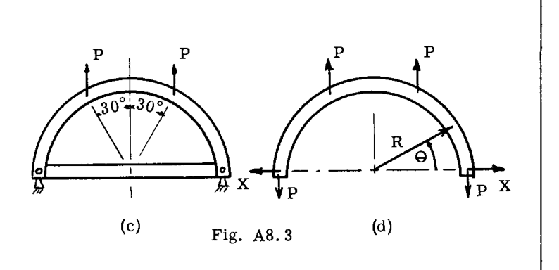

**解法:**
フロア内の軸荷重が不静定として扱われた（フロアは剛と仮定されたため、これは固定支持からの不静定フロア反力と考えることもできた）。荷重は図A8.3(d)に示されている。

曲げモーメント分布は：

 $M = X R \sin \theta - PR(1 - \cos \theta) \quad (0 < \theta < 60^\circ)$ 

 $M = X R \sin \theta - PR/2 \quad (60^\circ < \theta < 90^\circ)$ 

軸荷重は：

 $S = P \cos \theta + X \sin \theta \quad (0 < \theta < 60^\circ)$ 

 $S = X \sin \theta \quad (60^\circ < \theta < 90^\circ)$ 

ひずみエネルギーは（構造の半分のみについて）以下の通りであった*：

$$
U = \frac{1}{2EI} \int_0^{60^\circ} [X R \sin \theta - PR(1 - \cos \theta)]^2 R d\theta
$$

$$
+ \frac{1}{2EI} \int_{60^\circ}^{90^\circ} [X R \sin \theta - PR/2]^2 R d\theta
$$

$$
+ \frac{1}{2AE} \int_0^{60^\circ} [P \cos \theta + X \sin \theta]^2 R d\theta + \frac{1}{2AE} \int_{60^\circ}^{90^\circ} [X \sin \theta]^2 R d\theta
$$

* 剛体フロアにおけるひずみエネルギーはゼロ（ $AE \to \infty$ ）。

積分記号下での微分：

$$
\frac{\partial U}{\partial X} = \frac{R^3}{EI} X \int_0^{60^\circ} \sin^2 \theta d\theta - \frac{R^3 P}{EI} \int_0^{60^\circ} (1 - \cos \theta) \sin \theta d\theta
$$

$$
+ \frac{R^3 X}{EI} \int_{60^\circ}^{90^\circ} \sin^2 \theta d\theta - \frac{R^3 P}{2EI} \int_{60^\circ}^{90^\circ} \sin \theta d\theta
$$

$$
+ \frac{PR}{AE} \int_0^{60^\circ} \cos \theta \sin \theta d\theta + \frac{XR}{AE} \int_0^{60^\circ} \sin^2 \theta d\theta + \frac{XR}{AE} \int_{60^\circ}^{90^\circ} \sin^2 \theta d\theta = 0
$$

評価すると、

$$
\frac{\partial U}{\partial X} = 0 = \frac{\pi}{4} X \left( \frac{R^3}{EI} + \frac{R}{AE} \right) + \frac{3}{8} P \left( \frac{R}{AE} - \frac{R^3}{EI} \right)
$$

したがって、

$$
X = \frac{3P}{2\pi} \frac{\left( \frac{R^3}{EI} - \frac{R}{AE} \right)}{\left( \frac{R^3}{EI} + \frac{R}{AE} \right)}
$$

**例題 E**
図A8.3(e)のポータルフレームは3次の不静定である。不静定力の連立方程式を立てよ。各セグメントの相対的な曲げ剛性は図に示されている。

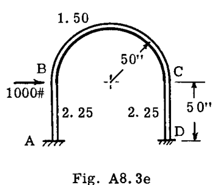

**解法:**
選択された不静定力は、すべて点 A における曲げモーメント、横せん断力、および軸力であった。図A8.3(f)から図A8.3(i)までの4つの図は、加えられた荷重による構造の曲げモーメント図と、不静定力が個別に作用することによる曲げモーメント図を示している（このように荷重を計算する方が容易である）。完全な荷重は重ね合わせによって得られた。

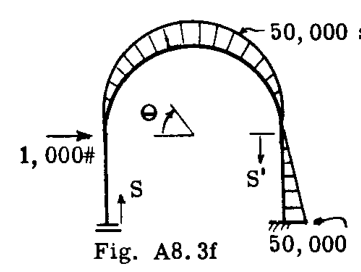 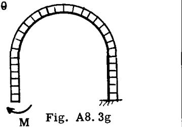
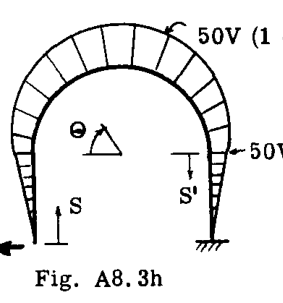 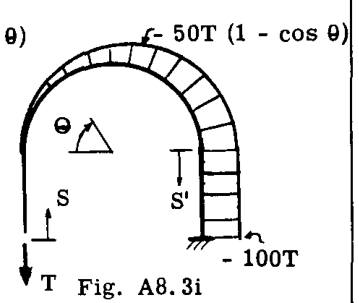

 $s, \theta, s'$  の関数としての合成曲げモーメントは以下の通りであった。

 $M_{AB} = M + Vs$ 

 $M_{BC} = -50,000 \sin \theta + M + 50 V + 50 V \sin \theta - 50 T (1 - \cos \theta)$ 

 $M_{CD} = 1000 s' + M - V s' + 50 V - 100 T$ 

このとき、

 $U = \frac{1}{2} \int \frac{M^2 ds}{EI}$  および  $\frac{\partial U}{\partial M} = \frac{\partial U}{\partial V} = \frac{\partial U}{\partial T} = 0$ 

より、次が得られる。

$$
\frac{\partial U}{\partial M} = 0 = \int_0^{50} \frac{(M + Vs)}{2.50} ds
$$

$$
+ \int_0^\pi \frac{[-50,000 \sin \theta + M + 50 V (1 + \sin \theta) - 50 T (1 - \cos \theta)]}{1.50} 50 d\theta
$$

$$
+ \int_0^{50} \frac{(1000 s' + M - V s' + 50 V - 100 T)}{2.25} ds' = 0
$$

$$
\frac{\partial U}{\partial V} = 0 = \int_0^{50} \frac{(M + V s) s}{2.25} ds
$$

$$
+ \int_0^\pi \frac{[-50,000 \sin \theta + M + 50 V (1 + \sin \theta) - 50 T (1 - \cos \theta)]}{1.50} (1 + \sin \theta) 50 d\theta
$$

$$
+ \int_0^{50} \frac{(1000 s' + M - V s' + 50 V - 100 T) (50 - s')}{2.25} ds' = 0
$$

$$
\frac{\partial U}{\partial T} = 0 = \int_0^{50} \frac{(1000 s' + M - V s' + 50 V - 100 T) (-100)}{2.25} ds'
$$

$$
+ \int_0^\pi \frac{[-50,000 \sin \theta + M + 50 V (1 + \sin \theta) - 50 T (1 - \cos \theta)]}{1.50} (\cos \theta - 1) 50 d\theta = 0
$$

積分の評価後、得られた方程式は以下の通りであった。

$$
\begin{cases} .1492 M + 9.682 V - 7.459 T = 2.778 \times 10^3 \\ 9.682 M + 763.1 V - 484.0 T = 288.3 \times 10^3 \\ -7.459 M - 484.0 V + 614.9 T = -111.15 \times 10^3 \end{cases}
$$

**A8.3 ダミー単位荷重法による不静定問題**

最小仕事の定理は不静定問題解析の基礎となり得るが、Art. A8-2.1 および A8-2.2 のように微積分を直接適用することはしばしば非実用的である。大部分の問題において、作業はダミー単位荷重法のテクニックによって促進される。

以下の導出は、2次不静定のトラス構造に関するものである。軸力に加えて他の荷重（曲げ、ねじり、せん断）が存在する、より一般的な  $n$  次不静定構造への拡張については後述する。

図A8.4(a)の2次不静定トラスを考える。示されている対角部材のような2つの部材を「切断」することで、静定にすることができる。この静定（「切断」された）構造に外部荷重を適用すると、静止平衡を満たすことで計算される荷重分布  $S$  が得られる。このとき、発生した歪みにより、切断部  $x$  および  $y$  に不連続が生じる。

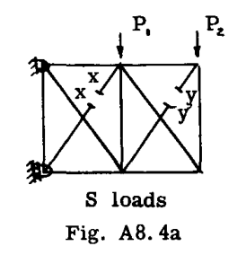 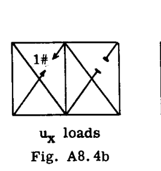 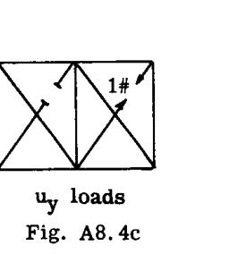

これらの変位およびその後の変位を計算するために、ダミー単位荷重法（Art. A7-7）を使用することができる。この目的のために、図A8.4(b)および(c)のように、 $x$  および  $y$  の切断部に仮想荷重が交互に配置される。ダミー単位荷重方程式から、

$$
\left. \begin{aligned} \delta_{xo} &= \sum \frac{S u_x L}{AE} \\ \delta_{yo} &= \sum \frac{S u_y L}{AE} \end{aligned} \right\} \quad \dots (3)
$$

ここで  $u_x$  および  $u_y$  は、図A8.4(b), (c) に示されている単位不静定応力分布である。添字「0」は、これらの相対変位が「元の」応力分布を持つ静定（「切断」された）構造で発生することを示している。

次に、図A8.4(d)のように、 $x$  および  $y$  の切断部にそれぞれ不静定荷重  $X$  および  $Y$  を適用して、不連続部を閉じる。荷重  $X$  は応力分布  $X u_x$  を生じ、同様に荷重  $Y$  は分布  $Y u_y$  を生じる。不静定荷重  $X$  による切断部  $x$  での相対変位は  $\delta_{xx}$ （「 $X$  による  $x$  での変位」と読む）で与えられる。

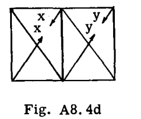

$$
\delta_{xx} = \sum \frac{X u_x \cdot u_x L}{AE} = X \sum \frac{u_x^2 L}{AE}
$$

また、切断部  $y$  では（ $\delta_{yx}$  を「 $X$  による  $y$  での変位」と読む）：

$$
\delta_{yx} = \sum \frac{X u_x \cdot u_y L}{AE} = X \sum \frac{u_x u_y L}{AE}
$$

同様に、荷重  $Y$  は切断部  $y$  および  $x$  にそれぞれ以下の変位を生じさせる。

$$
\delta_{yy} = \sum \frac{Y u_y \cdot u_y L}{AE} = Y \sum \frac{u_y^2 L}{AE}
$$

および

$$
\delta_{xy} = \sum \frac{Y u_y \cdot u_x L}{AE} = Y \sum \frac{u_y u_x L}{AE}
$$

ここで、3つの応力システム  $S, X \cdot u_x$  および  $Y \cdot u_y$  の同時作用下での各切断部における純相対変位は、

$$
\delta_{xo} + \delta_{xx} + \delta_{xy} = \sum \frac{S u_x L}{AE} + X \sum \frac{u_x^2 L}{AE} + Y \sum \frac{u_x u_y L}{AE}
$$

および

$$
\delta_{yo} + \delta_{yx} + \delta_{yy} = \sum \frac{S u_y L}{AE} + X \sum \frac{u_x u_y L}{AE} + Y \sum \frac{u_y^2 L}{AE}
$$

連続性のために、これらの純相対変位はゼロでなければならない。上記の各式をゼロに等しいと置き、再配置すると、連立方程式が得られる。

$$
\left. \begin{aligned} X \sum \frac{u_x^2 L}{AE} + Y \sum \frac{u_x u_y L}{AE} &= - \sum \frac{S u_x L}{AE} \\ X \sum \frac{u_y u_x L}{AE} + Y \sum \frac{u_y^2 L}{AE} &= - \sum \frac{S u_y L}{AE} \end{aligned} \right\} \quad \dots (4)
$$

式(4)は、2つの未知数  $X$  および  $Y$  に関する2つの連立方程式である。 $X$  および  $Y$  を解くと、真の応力分布は次のように計算される。

 $S_{TRUE} = S + X u_x + Y u_y \quad \dots \dots \dots (5)$ 

構造が1次不静定のみである場合、式(4)および(5)は  $Y = 0$  と置くことで適用され、以下が得られる。

$$
X \sum \frac{u_x^2 L}{AE} = - \sum \frac{S u_x L}{AE}
$$

または単に、

$$
X = - \frac{\sum \frac{S u_x L}{AE}}{\sum \frac{u_x^2 L}{AE}} \quad \dots \dots \dots (4a)
$$

および、

 $S_{TRUE} = S + X u_x \quad \dots \dots \dots (5a)$ 

**A8.4 例題 - 1次不静定のトラス**

**例題 #1**

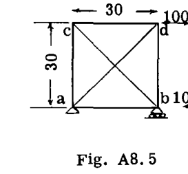 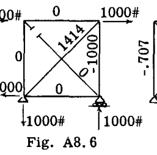 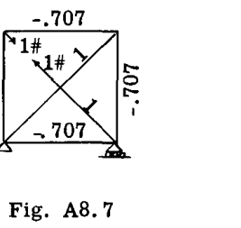

図A8.5は、単一ベイのピン結合トラスを示している。このトラスは外部反力に関しては静定であるが、内部部材荷重に関しては不静定である。なぜなら、どのジョイントにおいても3つの未知数があるのに対し、同時力システムに対して利用可能な静止平衡方程式は2つだけだからである。したがって、トラスは1次の不静定である。解法の一般的な手順は、部材の1つを切断してトラスを静定にすることである。図A8.6では部材  $bc$  が不静定部材として選択され、図のように切断されている。図A8.6のトラスの部材応力  $S$  が決定され、その結果が部材上に記録され、表A8.1にも入力される。図A8.7では、不静定部材  $bc$  の切断部に単位 1# の引張ダミー荷重が適用され、この単位荷重によるすべての部材の荷重が計算される。結果は図に記録され、表A8.1の  $u$  応力の列にも入力される。不静定部材  $bc$  における不静定荷重  $X$  の解は、表A8.1の下部に示されている。任意の部材における真の荷重は、 $S$  応力に  $X$  倍の  $u$  応力を加えたものに等しい。

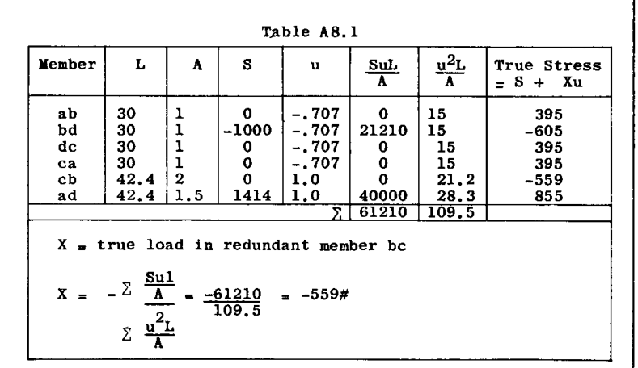

 $X$  = 不静定部材  $bc$  における真の荷重

 $X = - \frac{\sum \frac{SuL}{A}}{\sum \frac{u^2 L}{A}} = - \frac{-61210}{109.5} = -559#$ 

**例題 #2**
図A8.8は、1次不静定の3部材フレームを示している。部材荷重を求めよ。部材面積は図に示されている。

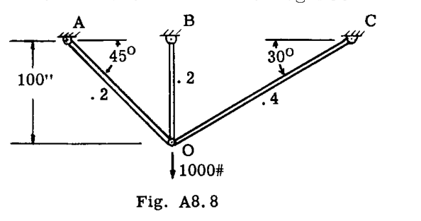

**解法:** 部材 OC が不静定として選択され、図A8.9のように  $S$  荷重を計算する際に切断された。図A8.10は  $u$  荷重の計算を示している。表は計算を完了させる。

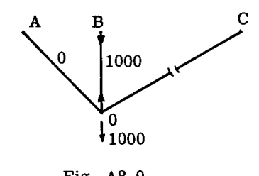 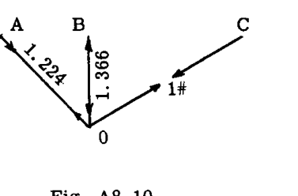

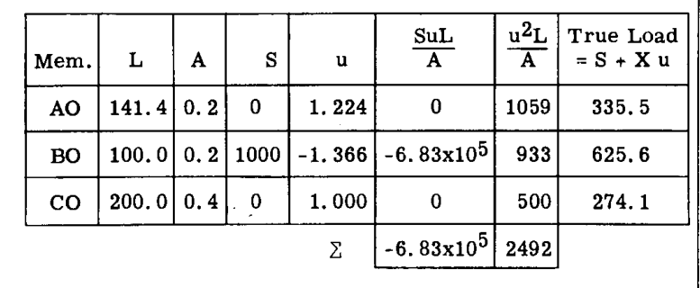

$$
X = - \frac{\sum \frac{SuL}{A}}{\sum \frac{u^2 L}{A}} = 274.1 \text{ lb.}
$$

**例題 #1-A; 不静定トラスのたわみ計算**

不静定構造物の荷重下でのたわみの計算は、第A-7章の手法の適用によって行われる。しかし、符号に関しては特定の落とし穴があり、またいくつかの重要な特別なテクニックもあるため、以下の例をここで示す。この手法のより複雑な構造への拡張は直接的であり、本章ではこれ以上の不静定構造物のたわみに関する作業は行わない（Art. A8.10 以降のマトリックス法の場合を除く）。

例題#1の点 "d" の、そこに加えられた荷重下での水平方向の動きを求めよ。

**解法:** たわみを求めるために使用される方程式は、第A-7章の式(18)である。トラスのたわみに適用するために記述すると（例題13、p. A7.11 参照）：

$$
\delta = \sum \frac{S u L}{AE} \quad \dots \dots (A)
$$

たわみ計算において、記号 "S" と "u" は不静定応力計算における意味から慎重に再解釈されなければならない。上記の式(A)の記号は、たわみ計算において次を意味する： "S-荷重" は、実際の外部荷重の適用による不静定構造物の真の荷重である。 "u-荷重" は、たわみが望まれる外部点に、望まれるたわみの方向に適用されたダミー単位（仮想）荷重による荷重である。

したがって、式(A)で使用する "S荷重" は、例題#1の真の応力（解）である。

"u荷重" は、一般的には別の不静定応力計算を必要とするように思われる追加情報を表している。これから見るように、幸いなことにそうではない。現在の問題では、ダミー単位荷重は 1000# の実荷重と全く同じように適用されるため、 $u$  荷重は単に適切にスケールダウンされた "S荷重" に等しい。以下の表は計算を完了させる。

| Mem. | L | A |  $S^*$  |  $u^{**}$  |  $SuL/A$  |
|---|---|---|---|---|---|
| ab | 30 | 1 | 395 | .395 | 4,680 |
| bd | 30 | 1 | -605 | -.605 | 10,980 |
| dc | 30 | 1 | 395 | .395 | 4,680 |
| ca | 30 | 1 | 395 | .395 | 4,680 |
| cb | 42.4 | 2 | -559 | -.559 | 6,620 |
| ad | 42.4 | 1.5 | 855 | .855 | 20,660 |
| | | | |  $\sum$  | 52,300 |

* 表A8.1の「真の応力」と同じ。
** ダミー単位荷重が 1000# の実荷重と全く同じように適用されるため、単に "S荷重" の 1/1000。

$$
\therefore \delta = \frac{52,300}{E}
$$

**例題 #2-A.**
図A8.8に示す垂直 1000# 荷重の適用下での、例題#2の点 O の水平たわみを求めよ。

**解法:** たわみを計算するには次を使用する：

$$
\delta = \sum \frac{SuL}{AE}
$$

ここでも、記号 "S" と "u" は例題#1-Aで説明したようにたわみ計算のために再解釈される。 "S荷重" は、上記の例題#2で計算された「真の荷重」である。 "u荷重" は、点 O に水平方向に作用するダミー単位荷重を配置することによる荷重である。この荷重は不静定構造物に作用するため、別の不静定応力計算が必要であるかのように思われる。しかし、これは必要ではない。

**定理：たわみ計算における  $u$  荷重については、ダミー単位荷重と静止平衡にあるいかなる応力（荷重）のセットも使用でき、最も単純な「切断」構造のものであってもよい。**

この定理は、このたわみ計算のために、3つの部材のいずれかを「切断」し、単純な静力学によって満足のいく  $u$  荷重のセットを得ることができると述べている。定理を証明する前に、図のように表形式で計算を完了する。 "u荷重" は、部材 OC を切断し、O に水平方向の単位荷重を適用することによって得られた。

| Mem. | L | A |  $S^*$  |  $u$  |  $SuL/A$  |
|---|---|---|---|---|---|
| AO | 141.4 | .2 | 335.5 |  $\sqrt{2}$  |  $3.355 \times 10^5$  |
| BO | 100 | .2 | 625.6 | -1 |  $-3.128 \times 10^5$  |
| CO | 200 | .4 | 274.1 | 0 | 0 |
| | | | | |  $0.227 \times 10^5$  |

$$
\therefore \delta = \frac{22,700}{E}
$$

* 例題#2からの真の荷重。

実演として、別の  $u$  荷重のセット（ $u'$  と呼ぶ）がこの同じ問題に対して見出された。今回は部材 OA を切断した。対応する計算は以下の通りである：

| S |  $u'$  |  $Su'L/A$  |
|---|---|---| 
| 335.5 | 0 | 0 |
| 625.6 | .578 |  $1.808 \times 10^5$  |
| 274.1 | -1.155 |  $-1.583 \times 10^5$  |
| |  $\sum$  |  $0.225 \times 10^5$  |

結果は（丸め誤差を許容すれば）同一である。

**定理の証明**

上記の定理を証明するために、仮想仕事の原理と、第A-7章のダミー単位荷重たわみ方程式（式(18)）が導出された議論に戻る（p. A7.10 参照）。たわみは、実荷重による歪み（ $\Delta$ ）の中を移動する内部仮想荷重（ $u$  荷重）によって行われる仕事、すなわち  $\delta = \sum u \Delta$  に等しいことが示されたことを思い出されたい。内部仮想荷重とは、所望のたわみの点に作用する単位荷重による荷重である。

さて、不静定構造物の場合、これらの内部仮想荷重（ $u$  荷重）は、単位荷重が構造の外部点に適用されるため、一般に不静定である。しかし、次のことを思い出す：

i - 「加えられた荷重」と静止平衡にあるいかなる応力分布も（今はダミー単位荷重を「加えられた荷重」と考えている）、外部合力がゼロである応力分布（p. A8.1）によってのみ、正しい（真の）分布と異なる。

ii - 変位のセットの中を移動する合力ゼロの応力分布は、仕事をしない。

数学的に表現すると、以下のようになる：

i.  $u_{TRUE} = u_{STATIC} + u_{R=0}$ 

ここで  $u_{STATIC}$  は、外部に適用されたダミー単位荷重の作用下で、単純な「切断」構造において静力学から得られた  $u$  荷重分布であり、 $u_{R=0}$  は、真の  $u$  荷重分布を与えるために重ね合わせなければならない合力ゼロの  $u$  荷重システムである。

ii.  $\sum \Delta \cdot u_{R=0} = 0$ 

したがって、外部に適用されたダミー単位荷重と静止平衡にあるいかなる  $u$  荷重のセットも、構造が歪みを受けたときに、不静定応力計算によって計算された "真の"  $u$  荷重のセットと同じ量の仮想仕事を行うことになる。すなわち、

$$
\delta = \sum \Delta \cdot u_{TRUE} =
$$

$$
\sum \Delta \cdot (u_{STATIC} + u_{R=0}) =
$$

$$
\sum \Delta \cdot u_{STATIC} + \sum \Delta \cdot u_{R=0} =
$$

$$
\sum \Delta \cdot u_{STATIC}
$$

Q.E.D.

**A8.5 2次不静定のトラス**

2次不静定のトラスは、式(4)によって直接扱われる。図解として、式(4)が導出された図A8.4の構造を、 $P_1 = 2000#$  および  $P_2 = 1000#$  の荷重に対して解く。不静定の選択は図A8.4aのものと同一にされた。図A8.11、A8.12、およびA8.13は、それぞれ  $S, u_x, u_y$  荷重の計算を示している。

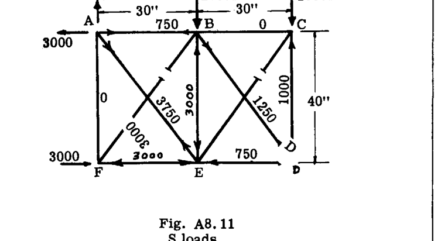

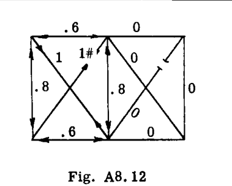 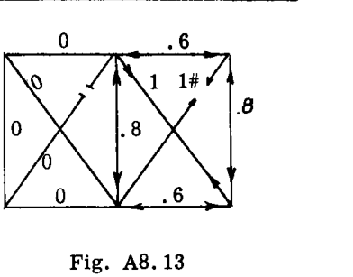

ここで、平面ピン結合トラスの不静定次数を決定するための規則に注目する。 $p$  個のジョイントを持つ  $m$  個の部材のトラスの場合、トラスは  $n$  次不静定であり、ここで  $n = m - (2p - 3)$  である。空間トラス（3次元トラス）の場合、 $n = m - (3p - 6)$  である。

本問題では、 $n = 11 - (12 - 3) = 2$  である。

計算は表A8.2に表形式で行われる。部材寸法は表に示されている。

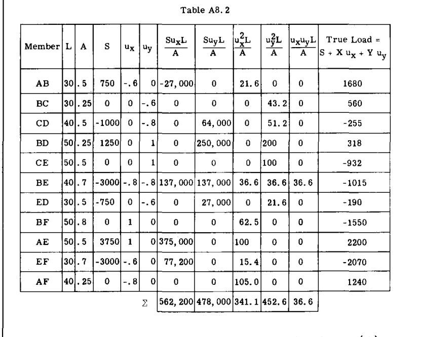

表から式(4)に代入すると、次が得られる（共通因子  $E$  は除外）：

$$
\begin{cases} X \sum \frac{u_x^2 L}{A} + Y \sum \frac{u_x u_y L}{A} = - \sum \frac{S u_x L}{A} \\ X \sum \frac{u_x u_y L}{A} + Y \sum \frac{u_y^2 L}{A} = - \sum \frac{S u_y L}{A} \end{cases}
$$

$$
\begin{cases} 341.1 X + 36.6 Y = - 562,000 \\ 36.6 X + 452.6 Y = - 478,000 \end{cases}
$$

解くと、

 $X = -1550#$ 

 $Y = -932#$ 

最後に（表A8.2参照）：

真の荷重  $= S + X u_x + Y u_y$ 