# A8  静的不定構造物

## A8.5 二重冗長トラス（続き）

### 例題 3

図 A8.14 は、2000ポンドの荷重を支える4つの共面部材で構成される構造を示している。併力系に対する静力学方程式は2つしか利用できないため、部材内の荷重に関しては、この構造は2次の冗長性（不定次数）を持つ。  
  
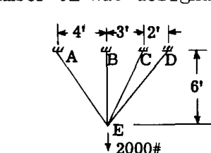  
  
**解法:**  
図 A8.15 は、仮定された静定構造を示している。2つの部材 CE と DE が冗長部材として選ばれ、図に示すように点 x と y で切断された。この構造と荷重に対する部材応力は部材上に記録されている。図 A8.16 と 図 A8.17 は、切断面 x と y に加えられた単位（1ポンド）引張荷重による  $u_x$  および  $u_y$  部材応力を示している。表 A8.3 は、式 (4) および (5) のための完全な計算を示している。冗長部材 CE の荷重を  $X$ 、DE の荷重を  $Y$  と指定した。  
  
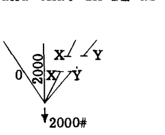  
  
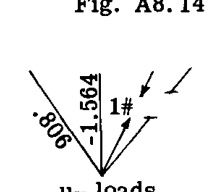  
  
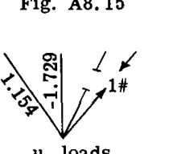  
  
$$ 
X \sum \frac{u_x^2 L}{A} + Y \sum \frac{u_x u_y L}{A} = -\sum \frac{S u_x L}{A} 
$$ 
  
表の値を代入すると：  
  
$$ 
2446 X + 2350 Y = 2,253,000 
$$ 
  
$$ 
X \sum \frac{u_x u_y L}{A} + Y \sum \frac{u_y^2 L}{A} = -\sum \frac{S u_y L}{A} 
$$ 
  
代入すると：  
  
$$ 
2350 X + 3039 Y = 2,488,000 
$$ 
  
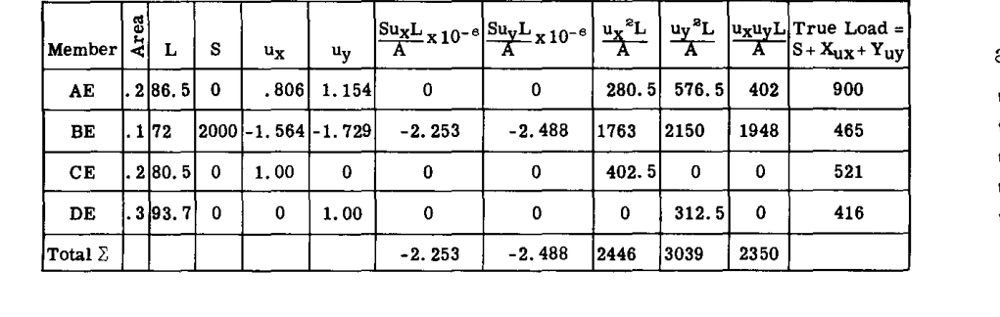  
  
 $X$  と  $Y$  に関する2つの方程式を解くと、 $X = 521\#$  および  $Y = 416\#$  が得られる。任意の部材における真の荷重  $= S + X u_x + Y u_y$  であり、これにより表の最終列の値が与えられた。  
  
## A8.6 多重冗長トラス

帰納法により、式 (4) は3次以上の冗長性を持つトラスに拡張できる。したがって、3次の冗長性に対しては：  
  
$$ 
\begin{aligned} 
X \sum \frac{u_x^2 L}{AE} + Y \sum \frac{u_x u_y L}{AE} + Z \sum \frac{u_x u_z L}{AE} &= -\sum \frac{S u_x L}{AE} \\ 
X \sum \frac{u_x u_y L}{AE} + Y \sum \frac{u_y^2 L}{AE} + Z \sum \frac{u_y u_z L}{AE} &= -\sum \frac{S u_y L}{AE} \\ 
X \sum \frac{u_x u_z L}{AE} + Y \sum \frac{u_y u_z L}{AE} + Z \sum \frac{u_z^2 L}{AE} &= -\sum \frac{S u_z L}{AE} 
\end{aligned} \quad \cdots (6) 
$$ 
  
そして  $X, Y, Z$  について解いた後、  
  
$$ 
\text{真の応力} = S + X u_x + Y u_y + Z u_z \quad \cdots (7) 
$$ 
  
## A8.7 軸力以外の荷重を受ける部材を含む冗長構造物

式 (6) は、曲げ、ねじり、せん断荷重が発生する問題にも容易に拡張される。したがって、3次の冗長構造物に対しては：  
  
$$ 
\begin{aligned} 
X a_{xx} + Y a_{xy} + Z a_{xz} &= -\delta_{x0} \\ 
X a_{yx} + Y a_{yy} + Z a_{yz} &= -\delta_{y0} \\ 
X a_{zx} + Y a_{zy} + Z a_{zz} &= -\delta_{z0} 
\end{aligned} \quad \cdots (8) 
$$ 
  
ここで  
  
$$ 
a_{xx} = \sum \frac{u_x^2 L}{AE} + \int \frac{m_x^2 dx}{EI} + \int \frac{t_x^2 dx}{GJ} + \iint \frac{\bar{q}_x^2 dx dy}{Gt} 
$$ 
  
$$ 
a_{xy} = a_{yx} = \sum \frac{u_x u_y L}{AE} + \int \frac{m_x m_y dx}{EI} + \int \frac{t_x t_y dx}{GJ} + \iint \frac{\bar{q}_x \bar{q}_y dx dy}{Gt} 
$$ 
  
$$ 
a_{yy} = \sum \frac{u_y^2 L}{AE} + \int \frac{m_y^2 dx}{EI} + \cdots \text{等} 
$$ 
  
$$ 
\delta_{x0} = \sum \frac{S u_x L}{AE} + \int \frac{M m_x dx}{EI} + \int \frac{T t_x dx}{GJ} + \iint \frac{q \bar{q}_x dx dy}{Gt} 
$$ 
  
$$ 
\delta_{y0} = \sum \frac{S u_y L}{AE} + \int \frac{M m_y dx}{EI} + \int \frac{T t_y dx}{GJ} + \iint \frac{q \bar{q}_y dx dy}{Gt} 
$$ 
  
等。  
  
ここで、  
 $S, M, T, q$  は静定構造における実荷重である。  
 $u_x, m_x, t_x, \bar{q}_x$  は切断部  $x$  における単位（仮想）荷重による単位荷重である。  
 $u_y, m_y, t_y, \bar{q}_y$  は切断部  $y$  における単位荷重によるものである。  
冗長力は軸力である必要はなく、モーメントやトルク等でもよい。冗長力を解いた後、真の軸力は：  
  
$$ 
\text{真の軸力} = S + X u_x + Y u_y + Z u_z 
$$ 
  
$$ 
\text{真の曲げモーメント} = M + X m_x + Y m_y + Z m_z \quad \cdots (9) 
$$ 
  
等。  
  
### 例題 4

図 A8.18 の対称なシートストリンガーパネルを解析し、ストリンガー間の荷重  $P$  の分布を求める。第一近似として、シートパネル内のせん断流は一定であると仮定する。すべてのストリンガーの断面積は等しい。  
  
**解法:**  
シートパネル内のせん断流が冗長力として選ばれた。対称性のため、問題は1次冗長のみとなる。図 A8.19 は、冗長せん断流  $X=1$  による  $u_x$  および  $\bar{q}_x$  荷重を示している。静定構造における実荷重は、中央のストリンガーのみに定荷重  $P$  がかかっている。解かれた方程式は（式 (8) 参照）：  
  
$$ 
X \left( \int \frac{u_x^2 dx}{AE} + \iint \frac{\bar{q}_x^2 dx dy}{Gt} \right) = -\left( \int \frac{S u_x dx}{AE} + \iint \frac{q \bar{q}_x dx dy}{Gt} \right) 
$$ 
  
ここで：  
実荷重：  
- 中央ストリンガーで  $S = P = \text{一定}$   
- サイドストリンガーで  $S = 0$   
-  $q = 0$   
  
仮想荷重：  
- サイドストリンガーで  $u_x = L - x$   
- 中央ストリンガーで  $u_x = 2(x - L)$   
-  $\bar{q}_x = 1.0$   
  
評価すると（重積分は単に定数にパネル面積を掛けたものになる）：  
  
$$ 
X \left( 2 \frac{L^3}{AE} + \frac{2b L}{Gt} \right) = -\left( \frac{-P L^2}{AE} \right) 
$$ 
  
$$ 
X = \frac{P}{2L} \left( \frac{1}{1 + \frac{b AE}{Gt L^2}} \right) 
$$ 
  
したがって、真の応力は：  
  
$$ 
P_{\text{ROOT}} = P - 2LX = P \frac{1}{1 + \frac{L^2 Gt}{AE b}} \quad (\text{中央ストリンガー}) 
$$ 
  
$$ 
P_{\text{ROOT}} = LX = \frac{P}{2} \frac{1}{1 + \frac{AE b}{L^2 Gt}} \quad (\text{サイドストリンガー}) 
$$ 
  
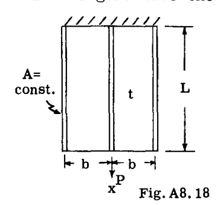  
  
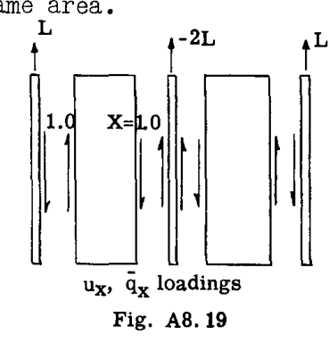  
  
### 例題 5

図 A8.19 の問題は、図に示すように2次冗長である。曲げモーメント分布を決定せよ。両方の部材は等しい断面特性を持つ。  
  
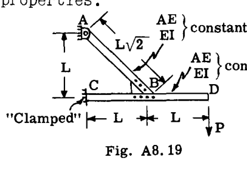  
  
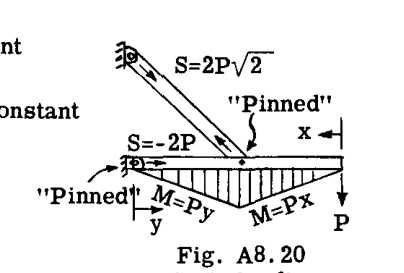  
  
**解法:**  
部材 CBD の点 C における曲げモーメントと、部材 AB の点 B における曲げモーメントが冗長力として選ばれ、（切断したときに）図 A8.20 のピン結合静定構造が得られた。仮想荷重は図 A8.21 および A8.22 に示されている。  
  
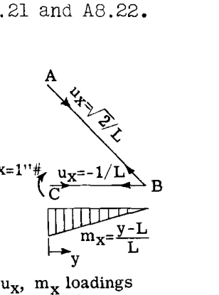  
  
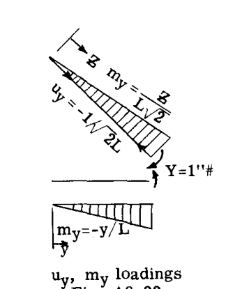  
  
図 A8.22 では、単位冗長荷重が単位カップルの自己平衡セットとして適用されたことに注意。実荷重および仮想荷重は以下の通りであった：（仮想荷重を持たない部材部分 BD は省略された。これは計算に関与し得ない。）  
  
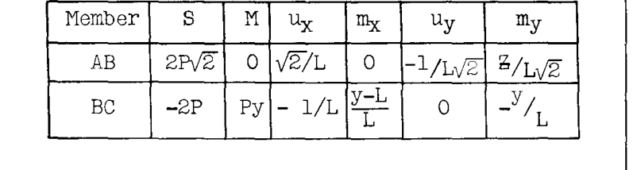  
  
解かれた方程式は（式 (8) 参照）：  
  
$$ 
X \left( \frac{u_x^2 L}{AE} + \int \frac{m_x^2 dx}{EI} \right) + Y \left( \frac{u_x u_y L}{AE} + \int \frac{m_x m_y dx}{EI} \right) = -\left( \frac{S u_x L}{AE} + \int \frac{M m_x dx}{EI} \right) 
$$ 
  
$$ 
X \left( \frac{u_x u_y L}{AE} + \int \frac{m_x m_y dx}{EI} \right) + Y \left( \frac{u_y^2 L}{AE} + \int \frac{m_y^2 dx}{EI} \right) = -\left( \frac{S u_y L}{AE} + \int \frac{M m_y dx}{EI} \right) 
$$ 
  
積分の評価と  $L^2$  による乗算の後、これらは次のようになる：  
  
$$ 
X \left( (1 + 2\sqrt{2}) \frac{L}{AE} + \frac{L^3}{3EI} \right) + Y \left( \frac{L\sqrt{2}}{AE} + \frac{L^3}{6EI} \right) = -P L \left( \frac{(2 + 4\sqrt{2})L}{AE} - \frac{L^3}{6EI} \right) 
$$ 
  
$$ 
X \left( \frac{L\sqrt{2}}{AE} + \frac{L^3}{6EI} \right) + Y \left( \frac{L}{\sqrt{2} AE} + \frac{(1 + \sqrt{2})L^3}{3EI} \right) = -P L \left( \frac{2L\sqrt{2}}{AE} - \frac{L^3}{3EI} \right) 
$$ 
  
特定のケースとして、 $\frac{AE}{L} = 100 \frac{EI}{L^3}$  と仮定すると、次が得られる：  
  
$$ 
\begin{aligned} 
.3716 X + .1526 Y &= .09011 PL \\ 
.1526 X + .8121 Y &= .3616 PL 
\end{aligned} 
$$ 
  
$$ 
\begin{cases} X = .0645 PL \\ Y = .456 PL \end{cases} 
$$ 
  
その後は通常通り：  
真の応力  $= S + X u_x + Y u_y$   
真のモーメント  $= M + X m_x + Y m_y$   
  
## A8.8 初期応力

冗長構造物において、組み立て時に適合性の欠如のために特定の部材を無理に所定の位置に押し込まなければならない場合、初期応力が発生する。状況によっては、荷重下でより良好な応力分布を得るために（「プレストレス」）、意図的な不適合が採用される。  
もし 図 A8.4(a) において、"x 切断" を持つ冗長部材が当初オーバーサイズ（長すぎ）で、その量が  $\delta_{x1}$ （正の X 方向の歪みに相当するオーバーサイズは正の  $\delta_{x1}$ ）であった場合、x 切断における連続性の修正条件は以下のようになる（式 (4) の直前の方程式と比較せよ）。  
  
$$ 
\delta_{x0} + \delta_{x1} + \delta_{xx} + \delta_{xy} = 0 
$$ 
  
同様に、Y 冗長部材が長すぎた場合は：  
  
$$ 
\delta_{y0} + \delta_{y1} + \delta_{yx} + \delta_{yy} = 0 
$$ 
  
次に、以前の表記を使用すると、冗長力に対する適切な方程式は：  
  
$$ 
\begin{aligned} 
X \frac{u_x^2 L}{AE} + Y \frac{u_x u_y L}{AE} &= -\frac{S u_x L}{AE} - \delta_{x1} \\ 
X \frac{u_x u_y L}{AE} + Y \frac{u_y^2 L}{AE} &= -\frac{S u_y L}{AE} - \delta_{y1} 
\end{aligned} \quad \cdots (10) 
$$ 
  
式 (10) の「S 荷重」は、加えられた外力のために存在する。これらは問題によってはゼロである場合もあるし、そうでない場合もある。  
  
### 例題 6

例題 3 において、部材 CE が組み立て前に 0.01 インチ短すぎた場合、組み立ておよび荷重適用後の応力分布を決定せよ。  
  
**解法:**  
前の問題から得られたデータが、以下の値と共に式 (10) に代入された。  
 $\delta_{x1} = -.01"$ （短すぎるため負）  
 $\delta_{y1} = 0$   
  
次が得られる：  
$$ 
\begin{cases} 
2446 X + 2350 Y = 2.253 \times 10^6 + .01 E \\ 
2350 X + 3039 Y = 2.488 \times 10^6 
\end{cases} 
$$ 
  
 $E = 29 \times 10^6$  とすると、冗長力は：  
 $X = 985$  lbs.  
 $Y = 57$  lbs.  
  
その後は通常通り、真の応力  $= S + X u_x + Y u_y$ 。  
  
### 例題 7

例題 5 の構造において、部材 AB と CBD の間の結合部 B で角度の不適合が発生し、AB の端部を組み立てに適合させるために時計回りに 2.7° 回転させなければならなかったと仮定する。外力を加えない状態で発生するモーメントを決定せよ。  
  
**解法:**  
初期不適合は  $\delta_{y1} = - 2.7 / 57.3 = - .0471$  ラジアンであった。  
符号は、元の不適合が冗長カップル  $Y$  の負の方向にあったことに注目して決定された。  
前の問題から使用された方程式は（そこでは方程式に  $L^2 \times EI / L^3 = EI / L$  が掛けられていたことに注意）：  
  
$$ 
\begin{cases} 
.3716 X + .1526 Y = 0 \\ 
.1526 X + .8121 Y = .0471 \frac{EI}{L} 
\end{cases} 
$$ 
  
解くと：  
 $X = - .0258 EI / L$   
 $Y = .0630 EI / L$   
真の初期応力およびモーメントは通常通り決定された。  
  
不適合の数が冗長性の数を超える場合、または不適合が選択された冗長切断箇所と一致せず他の場所で発生する場合、仮想仕事の原理を使用して、冗長切断箇所自体に対するこれらの不適合の影響を計算することができる。したがって、ダミー単位荷重方程式の「仮想仕事」の派生（第 A7 章）を参照すると、次が得られる：  
  
$$ 
\delta_{x1} = \sum u_x \Delta_1 \quad \cdots (11) 
$$ 
  
ここで  $\delta_{x1}$  は、構造全体の初期不完全（初期歪みに相当） $\Delta_1$  による、X 冗長切断における静定構造の初期不適合である。 $u_x$  は以前と同様、切断部 x における仮想荷重による単位荷重である。式 (11) および  $Y, Z$  等の切断に対する同様の表現を式 (10) に挿入することができる。  
  
### 例題 8

例題 3 および 6 を参照し、部材 BE が 0.025" 長すぎると仮定する。他の部材が適切な長さで外力が加えられない場合の初期応力を決定せよ。  
  
**解法:**  
例題 3 と同じ方程式を使用するために、そこで使用されたのと同じ x および y 切断で発生する初期不完全を計算した。この場合、BE の初期伸びによるものである。したがって：  
  
$$ 
\delta_{x1} = \sum u_x \Delta_1 = (-1.564)(.025") = -.0391" 
$$ 
  
$$ 
\delta_{y1} = \sum u_y \Delta_1 = (-1.729)(.025) = -.0432" 
$$ 
  
次に、式 (10) において以前に計算された係数を使用すると、次が得られる：  
$$ 
\begin{aligned} 
2446 X + 2350 Y &= .0391 E \\ 
2350 X + 3039 Y &= .0432 E 
\end{aligned} 
$$ 
  
 $E = 29 \times 10^6$  psi とすると、  
 $X = 263$  lbs.  
 $Y = 209$  lbs.  
  
最後に、真の初期応力  $= S + X u_x + Y u_y$ 。  
  
## A8.9 熱応力

冗長構造物に熱歪みによって誘発される応力は、上記の方法を適用して計算できる。問題は、熱歪みによって引き起こされる静定構造の切断部における相対運動を計算し、次に冗長部材力を適用して連続性を回復するという観点からアプローチできる。  
具体的には、図 A8.4(a) のような二重冗長トラスを考える。構造を静定にするために切断 "x" および "y" を行った後、温度分布の適用を想定する。 $\delta_{xT}$  および  $\delta_{yT}$  で示される相対変位が切断部で発生する。  
これらの変位は、第 A7 章の A7.8 節に示されているダミー単位荷重法によって計算できる。この計算が完了した後、問題は A8.8 節の初期歪みの場合と同様に進む。したがって、切断部における連続条件は（式 (4) の直前の方程式と比較し、簡単のために外力が存在せず  $\delta_{x0} = \delta_{y0} = 0$  と仮定する）以下のようになる：  
  
$$ 
\begin{cases} 
\delta_{xT} + \delta_{xx} + \delta_{xy} = 0 \\ 
\delta_{yT} + \delta_{yx} + \delta_{yy} = 0 
\end{cases} 
$$ 
  
トラスにおいて、熱歪みは、ダミー単位荷重方程式の「仮想仕事」の派生（第 A7 章 A7.7 および A7.8 節参照）によって与えられる切断部での相対変位を生じさせる。  
  
$$ 
\begin{cases} 
\delta_{xT} = \int u_x \alpha T dx \\ 
\delta_{yT} = \int u_y \alpha T dx 
\end{cases} \quad \cdots (12) 
$$ 
  
ここで  $\alpha$  は材料の熱膨張係数、 $T$  は周囲温度を上回る温度、 $u_x$  および  $u_y$  はそれぞれ x および y 切断における仮想荷重による単位荷重分布である。部材に沿った、および部材間での  $\alpha$  と  $T$  の変化の可能性を考慮して、式 (12) の和は有限の和ではなく積分として書かれている。すると、二重冗長トラスにおける熱応力の最終的な方程式は以下のようになる：  
  
$$ 
\begin{aligned} 
X \sum \frac{u_x^2 L}{AE} + Y \sum \frac{u_x u_y L}{AE} &= -\int u_x \alpha T dx \\ 
X \sum \frac{u_x u_y L}{AE} + Y \sum \frac{u_y^2 L}{AE} &= -\int u_y \alpha T dx 
\end{aligned} \quad \cdots (13) 
$$ 
  
式 (13) は、もちろん、トラス以外の構造物への適用にも拡張できる。他の荷重に適した表現は、本章の式 (8) 以降、および A7.8 節の他の方程式ですでに開発されている。  
  
### 例題 9

図 A8.23 のトラスの端部の直立部が、示されている温度分布に加熱されている。発生する応力と反力を決定せよ。  
  
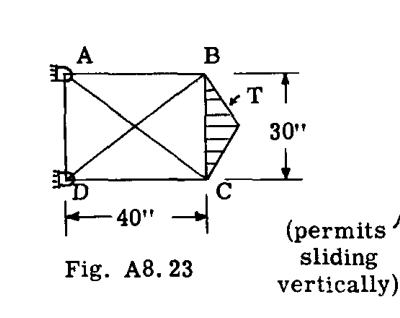  
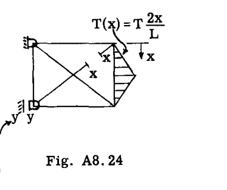  
  
**解法:**  
図 A8.24 のように切断 x および y を行うことで構造を静定にした。単位荷重は 図 A8.25 に示されている。  
  
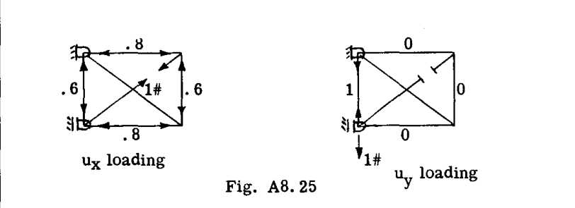  
  
熱係数  $\alpha$  は一定であると仮定された。計算は表形式で設定された。  
  
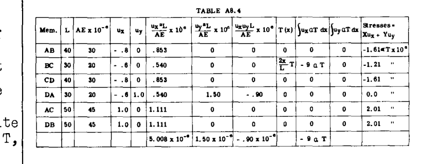  
  
式 (13) に代入すると：  
$$ 
\begin{cases} 
5.008 X - .90 Y = 9 \alpha T \times 10^6 \\ 
-.90 X + 1.50 Y = 0 
\end{cases} 
$$ 
  
解くと：  
 $X = 2.01 \alpha T \times 10^6$   
 $Y = 1.21 \alpha T \times 10^6$   
真の応力は 表 A8.4 に示されている。  
  
### 例題 10

図 A8.26a の固定梁の上面が均一な温度  $T$  に加熱されている。梁の厚さを通じて温度は下面（ $T=0$ ）まで線形に変化する。軸方向の拘束と軸力の影響を無視して、発生する端部モーメントを決定せよ。  
  
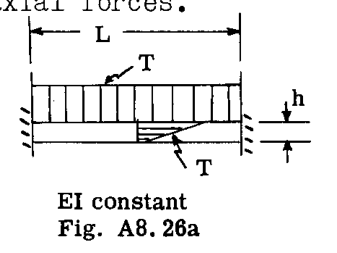  
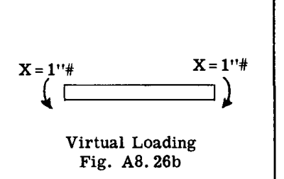  
  
**解法:**  
対称性のため、問題は1次冗長のみであり、端部の曲げ拘束を切断することで静定化された。単位カップルの適用（図 A8.26b）により  $m=1=\text{定数}$  が得られた。すると（第 A7 章 A7.8 節の例題 24 参照）「切断部」における熱たわみは：  
$$ 
\delta_{xT} = \int_0^L m d\theta = \int_0^L 1 \cdot \frac{T \alpha dx}{h} = \frac{T \alpha L}{h} 
$$ 
  
冗長モーメント方程式は（式 (13) との類推により）：  
$$ 
X \int \frac{m_x^2 dx}{EI} = -\delta_{xT} 
$$ 
  
したがって：  
$$ 
X \frac{L}{EI} = - \frac{T \alpha L}{h} 
$$ 
$$ 
X = - \frac{T \alpha EI}{h} 
$$ 
冗長モーメントは、予想通り上面の繊維を圧縮する。  
  
### 例題 11

第 A7 章 A7.8 節の例題 24 で開始した問題を完了せよ。すなわち、内面が外面より一様に温度  $T$  だけ高く加熱されている閉じたリングの熱応力を計算する問題である。  
  
**解法:**  
図 A7.30(b) のように上部を切断することでリングを静定にした。単位荷重と熱たわみは、参照された例題で決定された。以前に行われたたわみ計算の結果は：  
 $\delta_{xT} = \frac{2\pi R \alpha T}{h}$   
 $\delta_{yT} = -\frac{2\pi R^2 \alpha T}{h}$   
 $\delta_{zT} = 0$   
  
次に、式 (13) に対応する方程式が書かれた（式 (8) も参照）。  
$$ 
\begin{aligned} 
X \left( \int \frac{u_x^2 ds}{AE} + \int \frac{m_x^2 ds}{EI} \right) + Y \left( \int \frac{u_x u_y ds}{AE} + \int \frac{m_x m_y ds}{EI} \right) + Z \left( \int \frac{u_x u_z ds}{AE} + \int \frac{m_x m_z ds}{EI} \right) &= -\delta_{xT} \\ 
X \left( \int \frac{u_x u_y ds}{AE} + \int \frac{m_x m_y ds}{EI} \right) + Y \left( \int \frac{u_y^2 ds}{AE} + \int \frac{m_y^2 ds}{EI} \right) + Z \left( \int \frac{u_y u_z ds}{AE} + \int \frac{m_y m_z ds}{EI} \right) &= -\delta_{yT} \\ 
X \left( \int \frac{u_x u_z ds}{AE} + \int \frac{m_x m_z ds}{EI} \right) + Y \left( \int \frac{u_y u_z ds}{AE} + \int \frac{m_y m_z ds}{EI} \right) + Z \left( \int \frac{u_z^2 ds}{AE} + \int \frac{m_z^2 ds}{EI} \right) &= -\delta_{zT} 
\end{aligned} 
$$ 
  
評価すると、方程式は：  
$$ 
\begin{aligned} 
\frac{1}{EI} X - \frac{R}{EI} Y + 0 \cdot Z &= + \frac{\alpha T}{h} \\ 
-\frac{R}{EI} X + \frac{1}{2} \left( \frac{1}{AE} + \frac{R^2}{EI} \right) Y + 0 \cdot Z &= - \frac{\alpha R T}{h} \\ 
0 \cdot X + 0 \cdot Y + \left( \frac{1}{AE} + \frac{R^2}{EI} \right) Z &= 0 
\end{aligned} 
$$ 
  
これらの方程式の最後から、リングの対称性のために当然そうあるべきであるように、 $Z = 0$  であることがわかる。最初の2つの方程式を解くと：  
 $X = \frac{\alpha T E I}{h}$   
 $Y = 0$   
 $Y$  がゼロでない値であれば、変化する曲げモーメントが発生することになるが、対称性からそれはあり得ない。したがって、この結果も合理的である。  
  
## A8.10 マトリックス法による冗長問題の応力計算

以下のセクションでは、不定構造問題がマトリックス記法で定式化される。読者は、A7.9 節のマトリックスの応用、およびマトリックス記法と演算の要素（付録参照）に精通していることが想定される。  
構造物の応力分布は、一連の内部一般化力  $q_i, q_j^*$ （A7.9 節参照）によって指定される。静定構造とは異なり、これらの  $q_i, q_j$  は... 

* 不定構造物の場合、支持反力の一部も冗長となる可能性があり、これらの反力も  $q$  で示される（例題 13a 参照）。

次章の概要：本資料では、静的不定構造物の解析手法について、トラスやフレームを例に、冗長力の選定、仮想仕事の原理を用いた適合条件式の構築、さらには初期歪みや熱応力の影響を含めた詳細な計算手順が解説されています。