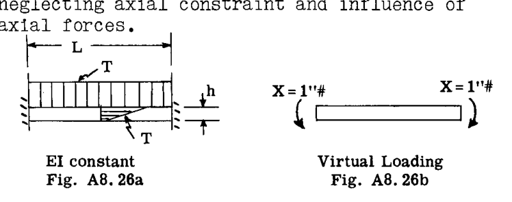
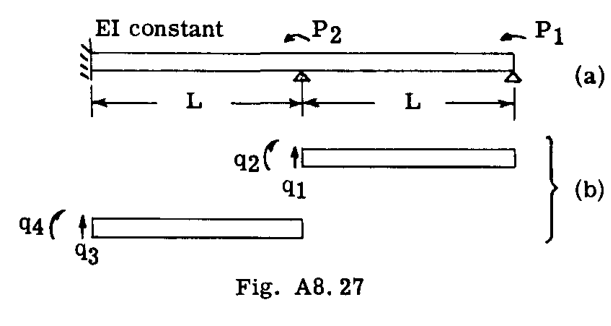
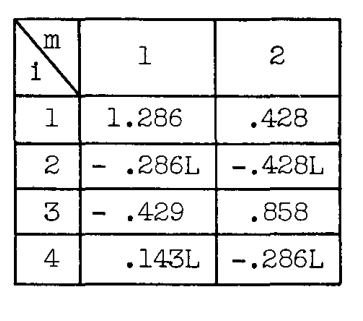
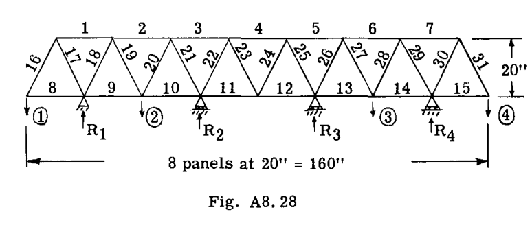
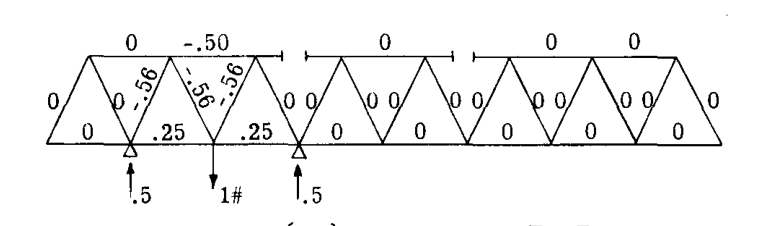
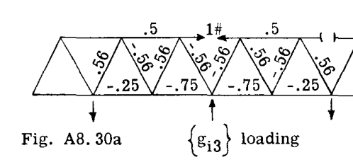
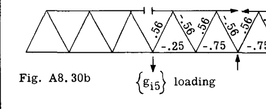
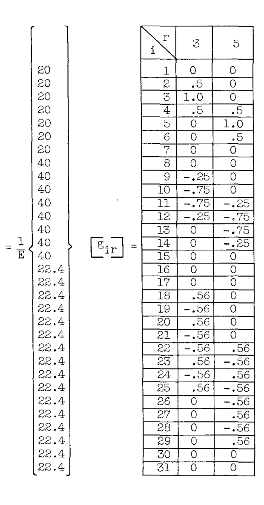
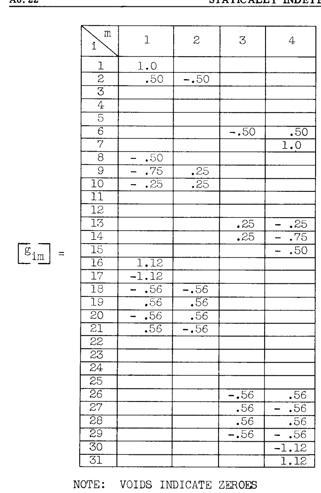
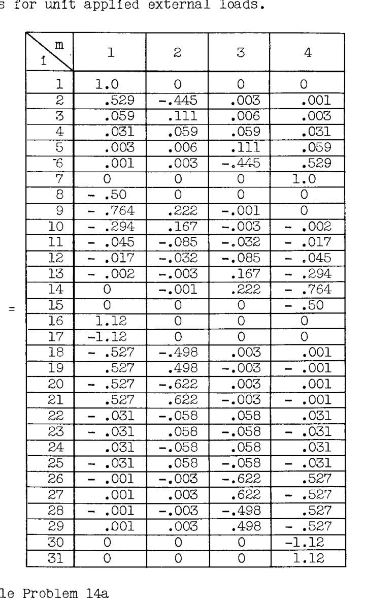

# A8.16 静的不定構造物

梁の深さを通じて、温度は下面の法線（ $T=0$ ）に対して線形に変化する。軸方向の拘束および軸力の影を無視して、発生する端部モーメントを求めよ。  

**解法:**  

この問題は、端部の曲げ拘束を切断して静定にすることで、1次不定となる。単位偶力（Fig. A8.26b）を適用すると、 $m=1=\text{const.}$  となる。次に（例題24、Art. A7.8を参照）、"切断点"における熱たわみは以下の通りであった。  

$$
\delta_{xT} = \int_{0}^{L} m d\theta = \int_{0}^{L} 1 \cdot \frac{T\alpha dx}{h} = \frac{T\alpha L}{h}
$$

冗長モーメント方程式は（式13の類推により）次のようになる。  

$$
X \int \frac{m_x^2 dx}{EI} = -\delta_{xT}
$$

したがって、  

$$
X \frac{L}{EI} = -\frac{T\alpha L}{h}
$$

$$
X = -\frac{T\alpha EI}{h}
$$

冗長モーメントは、予想通り上縁の繊維を圧縮する。  

### 例題11
例題24 Art. A7.8で開始した問題を完成させよ。すなわち、内面が外面より一様に温度  $T$  だけ高く加熱された閉じたリングに生じる熱応力を計算せよ。  

**解法:**  

リングは、Fig. A7.30(b)のように上部を切断することで静定とされた。単位荷重および熱たわみは、参照した例題で決定されている。以前に行われたたわみ計算の結果は以下の通りであった。  

$$
\delta_{xT} = \frac{2\pi R\alpha T}{h}
$$

$$
\delta_{yT} = -\frac{2\pi R^2 \alpha T}{h}
$$

$$
\delta_{zT} = 0
$$

その後、式(13)に対応する方程式が立てられた（式(8)も参照）。  

$$
X \left( \int \frac{u_x^2 ds}{AE} + \int \frac{m_x^2 ds}{EI} \right) + Y \left( \int \frac{u_x u_y ds}{AE} + \int \frac{m_x m_y ds}{EI} \right) + Z \left( \int \frac{u_x u_z ds}{AE} + \int \frac{m_x m_z ds}{EI} \right) = -\delta_{xT}
$$

$$
X \left( \int \frac{u_x u_y ds}{AE} + \int \frac{m_x m_y ds}{EI} \right) + Y \left( \int \frac{u_y^2 ds}{AE} + \int \frac{m_y^2 ds}{EI} \right) + Z \left( \int \frac{u_y u_z ds}{AE} + \int \frac{m_y m_z ds}{EI} \right) = -\delta_{yT}
$$

$$
X \left( \int \frac{u_x u_z ds}{AE} + \int \frac{m_x m_z ds}{EI} \right) + Y \left( \int \frac{u_y u_z ds}{AE} + \int \frac{m_y m_z ds}{EI} \right) + Z \left( \int \frac{u_z^2 ds}{AE} + \int \frac{m_z^2 ds}{EI} \right) = -\delta_{zT}
$$

評価された方程式は以下の通りであった。  

$$
\frac{1}{EI} X - \frac{R}{EI} Y + 0 \cdot Z = +\frac{\alpha T}{h}
$$

$$
-\frac{R}{EI} X + \frac{1}{2} \left( \frac{1}{AE} + \frac{R^2}{EI} \right) Y + 0 \cdot Z = -\frac{\alpha RT}{h}
$$

$$
0 \cdot X + 0 \cdot Y + \left( \frac{1}{AE} + \frac{R^2}{EI} \right) Z = 0
$$

これらの方程式の最後から、リングの対称性のために当然であるが、 $Z=0$  であることに注意されたい。最初の2つの方程式を解くと、  

$$
X = \frac{\alpha TEI}{h}
$$

$$
Y = 0
$$

 $Y$  がゼロでない値を持つと、変化する曲げモーメントが発生することになるが、これは対称性のためにあり得ない。したがって、この結果も合理的である。  

---

### A8.10 行列法による冗長系の応力計算

以下のセクションでは、不定構造問題を行列記法で定式化する。読者は Art. A7.9 の行列の応用、および行列の記法と演算の基本（付録参照）に精通しているものと想定する。  

構造物の応力分布は、一連の**内部一般化力**  $q_i, q_j^*$ （Art. A7.9 参照）によって規定される。静定構造物の場合とは異なり、これらの  $q_i, q_j$  は、静力学の方程式によって外部荷重と直接関連付けることはできない。  

\* 不定構造物の場合、支持反力の一部も冗長となる可能性があり、これらの反力も  $q$  で表記される（例題13a参照）。  

--- 

# A8.17

したがって、 $q_i, q_j$  の特定のサブセットが冗長であり、 $q_r, q_s$ （ $r, s$  は異なる数値添字）で表記される。最終的に、冗長力  $q_r, q_s$  が（連続性を満足させることによって）計算されると、すべての  $q_i, q_j$  の真の値を静力学によって求めることができる。  

### 記号 (SYMBOLS)

-  $q_i, q_j$ ：構造要素に作用する内部一般化力および支持点における反力。  
-  $q_r, q_s$ ：冗長一般化力および冗長反力。  
-  $P_m, P_n$ ：適用された外部荷重。  
-  $g_{im} (= g_{jn})$ ：静定構造物において、単位外部荷重  $P_m = 1 (P_n = 1)$  を適用したときの  $q_i (q_j)$  の値。  
-  $g_{ir} (= g_{js})$ ：静定構造物において、単位冗長力  $q_r = 1 (q_s = 1)$  を適用したときの  $q_i (q_j)$  の値。  
-  $G_{im} (= G_{jn})$ ：荷重  $P_m = 1 (P_n = 1)$  を適用したときの、冗長構造物における  $q_i (q_j)$  の真の値。  
-  $G_{rm} (= G_{sn})$ ：単位外部荷重  $P_m = 1 (P_n = 1)$  に対する  $q_r (q_s)$  の真の値。  
-  $a_{ij}$ ：部材柔軟性係数：単位力  $q_j = 1$  に対する点  $i$  でのたわみ（Art. A7.9, 10 参照）。  
-  $a_{mn}$ ：静定構造物の影響係数：単位荷重  $P_n = 1$  に対する外部荷重荷重点  $m$  での変位。( $a_{mn} = a_{nm}$ )  
-  $a_{rn} (= a_{sm})$ ：静定構造物の影響係数：単位荷重  $P_n = 1 (P_m = 1)$  に対する冗長切断点  $r (s)$  での変位。( $a_{rn} = a_{nr}$ )  
-  $a_{rs}$ ：静定（"切断"）構造物の影響係数：単位冗長力  $q_s = 1$  に対する冗長切断点  $r$  での変位。( $a_{rs} = a_{sr}$ )  
-  $A_{mn}$ ：完全な冗長構造物の影響係数：単位適用荷重  $P_n = 1$  に対する外部荷重点  $m$  でのたわみ。( $A_{mn} = A_{nm}$ )  
-  $T_i, T_j$ ：点  $i, j$  における温度（通常より高い温度）。  
-  $\Delta_{iT}, \Delta_{jT}$ ： $q_i, q_j$  に関連する部材の熱歪み。  

Art. A8.3 以降の記法では、応力の最終的な真の値は次のように表現された（式(5) Art. A8.3）。  

$$
S_{\text{TRUE}} = S + Xu_x + Yu_y - - - - - - - - - - (5)
$$

ここで採用される記法では、この方程式は次のように書き換えられる。  

$$
\{q_i\} = [g_{im}] \{P_m\} + [g_{ir}] \{q_r\} - - - - - - - - - - (14)
$$

ここで：  

 $[g_{im}] (= [g_{jn}]^*)$  は、外部荷重点に単位（仮想）荷重を適用することによって得られる、静定（"切断"）構造物の単位荷重応力分布の行列である。  
積  $[g_{im}] \{P_m\}$  は、式(5)の "S" 荷重に対応する、静定構造物における実際の荷重を与える。  

 $[g_{ir}] (= [g_{js}])$  は、静定（"切断"）構造物の冗長切断点に単位（仮想）力を適用することによって得られる、単位荷重応力分布の行列である。したがって、これは  $u_x, u_y$  等の荷重の行列である。  
もちろん、 $\{q_r\}$  は  $X, Y$  等に対応する。  

 $[g_{im}]$  および  $[g_{ir}]$  行列は、Art. A7.9 の  $[G_{im}]$  とほぼ同じ方法で計算され配置された荷重分布であることに注意されたい。小文字の "g" は、"切断" 構造物における荷重分布を示すために使用される。  

例として、Art. A8.5 の例題3の最終結果を以下に示す。まず、式(5)の形式で：  

真の応力 (True Stresses)  $= S + X(u_x) + Y(u_y)$   

 $AE = 0 + 521(0.806) + 416(1.154)$   
 $BE = 2000 + 521(-1.564) + 416(-1.729)$   
 $CE = 0 + 521(1.00) + 416(0)$   
 $DE = 0 + 521(0) + 416(1.00)$   

\* 添字記号の各セット（(i, j), (r, s), (m, n)）内では、記号は互換的に使用できる場合があることに注意されたい。  

--- 

# A8.18 静的不定構造物

第二に、式(14)の形式で：  

$$
\begin{Bmatrix} q_1 \\ q_2 \\ q_3 \\ q_4 \end{Bmatrix} = \begin{Bmatrix} 0 \\ 1 \\ 0 \\ 0 \end{Bmatrix} \cdot 2000 + \begin{Bmatrix} .806 & 1.154 \\ -1.564 & -1.729 \\ 1.00 & 0 \\ 0 & 1.00 \end{Bmatrix} \begin{Bmatrix} 521 \\ 416 \end{Bmatrix}
$$

この場合、外部荷重が1つしかなかったため、 $[g_{im}]$  は1列のみで構成されていたことに注意されたい。  
Art. A7.9 において、ひずみエネルギーは次のように書かれた。  

$$
2U = \lfloor q_i \rfloor [a_{ij}] \{q_j\} - - - - - - - - - - (15)
$$

ここで  $[a_{ij}]$  は部材柔軟性係数の行列である（Art. A7.10）。今、式(14)とその転置を用いて(15)に代入すると、式は次のようになる（(i,j), (r,s), (m,n) の互換的な使用に注意）。  

$$
2U = \left( \lfloor P_m \rfloor [g_{im}] + \lfloor q_r \rfloor [g_{ir}] \right) [a_{ij}] \left( [g_{js}] \{q_s\} + [g_{jn}] \{P_n\} \right)
$$

展開すると：  

$$
2U = \lfloor P_m \rfloor [g_{mi}] [a_{ij}] [g_{jn}] \{P_n\} + 2 \lfloor q_r \rfloor [g_{ri}] [a_{ij}] [g_{jn}] \{P_n\} + \lfloor q_r \rfloor [g_{ri}] [a_{ij}] [g_{js}] \{q_s\} - - - - - - (19)
$$

読者は、 $[a_{ij}]$  の対称性により、上記の結果の中間の "交差項" が正しいことを確認できる。  

$$
\lfloor q_r \rfloor [g_{ri}] [a_{ij}] [g_{jn}] \{P_n\} = \lfloor P_m \rfloor [g_{mi}] [a_{ij}] [g_{js}] \{q_s\}
$$

上記の式に現れる様々な行列の三項積には、それぞれ Art. A7.9 の式(24)と比較して、以下の記号と解釈が割り当てられる。  

$$
[a_{mn}] \equiv [g_{mi}] [a_{ij}] [g_{jn}] - - - - - - - - - (16)
$$
- "切断" 構造物における外部点影響係数の行列：点  $n$  における単位荷重による点  $m$  でのたわみ。  

$$
[a_{rn}] \equiv [g_{ri}] [a_{ij}] [g_{jn}] - - - - - - - - - (17)
$$
- "切断" 部における相対変位を外部荷重に関連付ける影響係数の行列：点  $n$  における単位荷重による切断部  $r$  での変位。  

$$
[a_{rs}] \equiv [g_{ri}] [a_{ij}] [g_{js}] - - - - - - - - - (18)
$$
- "切断" 部における相対変位を冗長荷重に関連付ける影響係数の行列：切断部  $s$  における単位冗長力による切断部  $r$  での変位。  

上記の記法を用いると、次のように書ける。  

$$
2U = \lfloor P_m \rfloor [a_{mn}] \{P_n\} + 2 \lfloor q_r \rfloor [a_{rn}] \{P_n\} + \lfloor q_r \rfloor [a_{rs}] \{q_s\} - - - - - - (19)
$$

ここで、最小仕事の定理によれば、連続性のために  $\partial U/\partial q_r = 0$  である。したがって、式(19)を微分すると：  

$$
\frac{\partial U}{\partial q_r} = 0 = [a_{rn}] \{P_n\} + [a_{rs}] \{q_s\} - - - - - - - (20)
$$

この最終結果は、式(19)を展開形式で書き、微分してから行列形式で再結合することによって確認できる。整理すると、式(20)は次を与える。  

$$
[a_{rs}] \{q_s\} = - [a_{rn}] \{P_n\} - - - - - - - - - (21)
$$

式(21)は、冗長内部力  $q_r, q_s$  に関する一連の連立方程式である。これは Art. A8.6 の式(6)に対応し、比較することができる。式(21)は、そこに示されている形式から直接解くことも、係数行列の逆行列  $[a_{rs}]^{-1}$  を計算することによってその解を得ることもできる。  

$$
\{q_s\} = - [a_{rs}]^{-1} [a_{rn}] \{P_n\} - - - - - - - - - (22)
$$

行列の積  $-[a_{rs}]^{-1} [a_{rn}]$  は、外部荷重の単位値に対する冗長力の値を与える。これには記号  $[G_{sn}]$  を与えることができ、その結果：  

$$
\{q_s\} = [G_{sn}] \{P_n\} - - - - - - - - - - (22a)
$$

--- 

# A8.19

式(22)を式(14)に代入すると（ $r$  を  $s$  に、 $m$  を  $n$  に入れ替えて）、次が得られる。  

$$
\{q_i\} = [g_{im}] \{P_m\} - [g_{ir}] [a_{sr}]^{-1} [a_{sm}] \{P_m\}
$$

$$
= ([g_{im}] - [g_{ir}] [a_{sr}]^{-1} [a_{sm}]) \{P_m\}
$$

$$
= ([g_{im}] + [g_{ir}] [G_{rm}]) \{P_m\}
$$

括弧内の行列セットは、外部荷重の単位値あたりの内部力分布を与える。それは記号  $[G_{im}]$  で与えられる。  

$$
[G_{im}] = [g_{im}] - [g_{ir}] [a_{sr}]^{-1} [a_{sm}] - - - - - (23)
$$

$$
\equiv [g_{im}] + [g_{ir}] [G_{rm}]
$$

したがって、  

$$
\{q_i\} = [G_{im}] \{P_m\} - - - - - - - - - - (24)
$$

式(23), (24)は主要な結果を構成し、不定構造物における内部力分布を計算するための手段を提示する。  

### 例題13
Fig. A8.27(a) の2次不定梁を曲げモーメント分布について解析する。梁には図のように支持点上に偶力がかかっている。  

**解法:**  

内部一般化力の選択を Fig. A8.27(b) に示す。適切な部材柔軟性係数は行列形式で次のように配置された（係数式については Art. A7.10 参照）。  

$$
[a_{ij}] = \frac{L}{EI} \begin{bmatrix} L^2/3 & L/2 & 0 & 0 \\ L/2 & 1 & 0 & 0 \\ 0 & 0 & L^2/3 & L/2 \\ 0 & 0 & L/2 & 1 \end{bmatrix}
$$

モーメント  $q_2$  と  $q_4$  が冗長として採用された。これらをゼロに設定し、 $P_1$  と  $P_2$  の単位値の適用による内部力分布を決定し、以下を得た。  

$$
[g_{im}] = \begin{bmatrix} 1/L & 0 \\ 0 & 0 \\ 0 & 1/L \\ 0 & 0 \end{bmatrix}
$$

適用された荷重をゼロに設定し、冗長の単位値を適用して以下を得た。  

(r =) (2) (4)  

$$
[g_{ir}] = \begin{bmatrix} -1/L & 0 \\ 1 & 0 \\ 1/L & -1/L \\ 0 & 1 \end{bmatrix}
$$

冗長荷重  $q_2$  は、梁の両半分に作用する自己平衡内部偶力として適用されたことに注意されたい。  
以下の行列積が形成された。  

$$
[a_{rs}] = [g_{ri}] [a_{ij}] [g_{js}]
$$

$$
= \frac{L}{EI} \begin{bmatrix} -1/L & 1 & 1/L & 0 \\ 0 & 0 & -1/L & 1 \end{bmatrix} \begin{bmatrix} L^2/3 & L/2 & 0 & 0 \\ L/2 & 1 & 0 & 0 \\ 0 & 0 & L^2/3 & L/2 \\ 0 & 0 & L/2 & 1 \end{bmatrix} \begin{bmatrix} -1/L & 0 \\ 1 & 0 \\ 1/L & -1/L \\ 0 & 1 \end{bmatrix}
$$

$$
= \frac{L}{6EI} \begin{bmatrix} 4 & 1 \\ 1 & 2 \end{bmatrix}
$$

$$
[a_{rn}] = [g_{ri}] [a_{ij}] [g_{jn}]
$$

$$
= \frac{L}{EI} \begin{bmatrix} -1/L & 1 & 1/L & 0 \\ 0 & 0 & -1/L & 1 \end{bmatrix} \begin{bmatrix} L^2/3 & L/2 & 0 & 0 \\ L/2 & 1 & 0 & 0 \\ 0 & 0 & L^2/3 & L/2 \\ 0 & 0 & L/2 & 1 \end{bmatrix} \begin{bmatrix} 1/L & 0 \\ 0 & 0 \\ 0 & 1/L \\ 0 & 0 \end{bmatrix}
$$

$$
= \frac{L}{6EI} \begin{bmatrix} 1 & 2 \\ 0 & 1 \end{bmatrix}
$$

--- 

# A8.20 静的不定構造物

 $[a_{rs}]$  の逆行列が求められた（付録参照）。  

$$
[a_{rs}]^{-1} = \frac{6EI}{7L} \begin{bmatrix} 2 & -1 \\ -1 & 4 \end{bmatrix}
$$

次に、単位冗長荷重分布が求められた（式(22)）。  

$$
[G_{sn}] = - [a_{rs}]^{-1} [a_{rn}] = - \frac{1}{7} \begin{bmatrix} 2 & 3 \\ -1 & 2 \end{bmatrix}
$$

$$
= \begin{bmatrix} -0.286 & -0.428 \\ 0.143 & -0.286 \end{bmatrix}
$$

最後に、真の単位応力分布が計算された。  

$$
[G_{im}] = [g_{im}] + [g_{ir}] [G_{rm}]
$$

$$
= \begin{bmatrix} 1/L & 0 \\ 0 & 0 \\ 0 & 1/L \\ 0 & 0 \end{bmatrix} + \begin{bmatrix} -1/L & 0 \\ 1 & 0 \\ 1/L & -1/L \\ 0 & 1 \end{bmatrix} \begin{bmatrix} -0.286 & -0.428 \\ 0.143 & -0.286 \end{bmatrix}
$$

（上記の行列  $[G_{im}]$  の表形式の提示は、添字表記スキームの機能を明確に示すためにのみここで使用されている。一般的には、表形式が役立つ可能性のある大きな行列を除いて、このように添字を書き出す必要はないはずである。）  

### 例題13a
Fig. A8.27 の冗長梁問題を、冗長**反力**を未知数として再解決せよ。  

**解法:**  

荷重  $P_1$  および  $P_2$  の下での支持反力には、それぞれ  $q_5$  および  $q_6$  という記号が与えられ、上向きを正とした。これらの力はひずみエネルギー式に入らなかった。そのため、部材柔軟性係数の行列は  $6 	imes 6$  に拡張されたが、 $q_5$  および  $q_6$  の係数はゼロであった。したがって、  

$$
[a_{ij}] = \frac{L}{EI} \begin{bmatrix} L^2/3 & L/2 & 0 & 0 & 0 & 0 \\ L/2 & 1 & 0 & 0 & 0 & 0 \\ 0 & 0 & L^2/3 & L/2 & 0 & 0 \\ 0 & 0 & L/2 & 1 & 0 & 0 \\ 0 & 0 & 0 & 0 & 0 & 0 \\ 0 & 0 & 0 & 0 & 0 & 0 \end{bmatrix}
$$

冗長  $q_5$  および  $q_6$  をゼロに設定すると、単位外部偶力  $P_1$  および  $P_2$  の連続した適用により、以下の応力分布が得られた。  

$$
[g_{im}] = \begin{bmatrix} 0 & 0 \\ 1 & 0 \\ 0 & 0 \\ 1 & 1 \\ 0 & 0 \\ 0 & 0 \end{bmatrix}
$$

また、 $P_1$  および  $P_2$  をゼロにして、単位冗長力  $q_5$  および  $q_6$  を順次適用すると以下が得られた。  

$$
[g_{ir}] = \begin{bmatrix} -1 & 0 \\ L & 0 \\ -1 & -1 \\ 2L & L \\ 1 & 0 \\ 0 & 1 \end{bmatrix}
$$

次に、式(17)および(18)に従って三項積を計算する。  

$$
[a_{rn}] = \frac{L^2}{2EI} \begin{bmatrix} 4 & 3 \\ 1 & 1 \end{bmatrix}
$$

$$
[a_{rs}] = \frac{L^3}{6EI} \begin{bmatrix} 16 & 5 \\ 5 & 2 \end{bmatrix}
$$

逆行列が求められた。  

$$
[a_{rs}]^{-1} = \frac{6EI}{7L^3} \begin{bmatrix} 2 & -5 \\ -5 & 16 \end{bmatrix}
$$

最後に、  

$$
[G_{im}] = [g_{im}] - [g_{ir}] [a_{sr}]^{-1} [a_{sm}]
$$

--- 

# A8.21

$$
= \frac{1}{L} \begin{bmatrix} 1.286 & 0.428 \\ -0.286L & -0.428L \\ -0.428 & 0.857 \\ 0.143L & -0.286L \\ -1.286 & -0.428 \\ 1.714 & -0.428 \end{bmatrix}
$$

（例題13の解と比較せよ）。  

### 例題14
Fig. A8.28 の連続トラスは2次不定である。示された4つの外部点に適用される集中垂直荷重の様々な荷重条件下での応力分布についてこれを解析したい。  

**解法:**  

採用された内部一般化力  $(q_i, q_j)$  は、様々な部材の軸力であった。これらは図に示されているように1から31まで番号が振られた。この場合の部材柔軟性係数は  $a_i = L/AE$  の形式であった（Ref. Fig. A7.35a）。係数は以下の列行列として書かれている。（これらは行列の乗算において正方行列の対角要素として採用されたが、スペースを節約するためにここでは列として書かれている。）  

部材荷重  $q_3$  と  $q_5$  が冗長として選択された。 $q_3$  と  $q_5$  をゼロ（"切断"）に設定して、外部荷重点1から4に単位荷重を順次適用し、それによって得られた4つの応力分布を4列に配置して行列  $[g_{im}]$ （下記）を得た。例示として、 $[g_{im}]$  の第2列を得るために使用された荷重図を Fig. A8.29 に示す。  

次に、Fig. A8.30a および A8.30b に示すように、冗長切断部 "3" および "5" に単位力を順次適用した。これらの荷重を2列に配置して行列  $[g_{ir}]$  を得た。  

--- 

# A8.22 静的不定構造物

注：空白はゼロを示す。  

三項積の計算結果：  

$$
[a_{rs}] = [g_{ri}] [a_{ij}] [g_{js}] = \frac{1}{E} \begin{bmatrix} 136 & -8.0 \\ -8.0 & 136 \end{bmatrix}
$$

$$
[a_{rn}] = [g_{ri}] [a_{ij}] [g_{jn}]
$$

$$
= \frac{1}{E} \begin{bmatrix} -8.0 & -15.0 & 0 & 0 \\ 0 & 0 & -15.0 & -8.0 \end{bmatrix}
$$

 $[a_{rs}]$  の逆行列が求められた（付録参照）。  

$$
[a_{rs}]^{-1} = \frac{E}{18,432} \begin{bmatrix} 136 & 8.0 \\ 8.0 & 136 \end{bmatrix}
$$

次に、適用荷重の単位値に対する冗長力の値を式(22)により求めた。  

$$
[G_{sn}] = - [a_{rs}]^{-1} [a_{rn}]
$$

$$
= \begin{bmatrix} 0.059 & 0.111 & 0.0065 & 0.0035 \\ 0.0035 & 0.0065 & 0.111 & 0.059 \end{bmatrix}
$$

計算は式(23)に従って完了し、単位外部荷重に対する部材力の値  $[G_{im}]$  が得られた。  

### 例題14a
Fig. A8.31 は、図のように適用された3つの集中荷重に分解される尾部空気荷重を受ける鋼管製尾部胴体トラスの2つのベイを示している。取付点ステーション（A-E-F-K）の胴体バルクヘッドは十分に重いため、自平面内で剛であると仮定できる。したがって、トラスは図のように A-E-F-K から片持ち梁として解析できる。すべての部材は鋼管であり、その長さと面積を以下の表にまとめる。  

**解法:**  

一般化力は部材軸力として採用され、これらは下の表のように番号が振られた。部材柔軟性係数  $L/A$ （便宜上  $E$  を1に設定）も表にまとめられた。