# 不静定構造 (STATICALLY INDETERMINATE STRUCTURES)

![[gim] Matrix Table](p1_table_01.png)

注：空白はゼロを示す。

掛け合わせると以下が得られた：

![[ars] Matrix Equation](p1_fig_01.png)

![[arn] Matrix](p1_fig_02.png)

適用された外部単位荷重に対する部材力の値  $[G_{rs}]$  の逆行列  $[a_{rs}]$  が求められた（付録参照）。

![[ars^-1] Inverse Matrix](p1_fig_03.png)

次に、式 (22) に基づき、適用荷重の単位値に対する冗長力の値が求められた。

$$
[G_{sn}] = -[a_{rs}^{-1}] [a_{rn}]
$$

計算は式 (23) に従って完了し、適用された外部単位荷重に対する部材力の値  $[G_{im}]$  が得られた。

![[Gim] Member Force Values](p1_table_02.png)

## 例題 14a

図 A8.31 は、示されているように 3 つの集中荷重に分解される尾部空気荷重を受ける、鋼管製の尾部胴体トラスの 2 つのベイを示している。取り付け点ステーション (A-E-F-K) の胴体バルクヘッドは、その面内で剛体であると仮定できるほど十分に重い。したがって、トラスは図のように A-E-F-K から片持ち支持されているものとして解析できる。すべての部材は鋼管であり、その長さと面積は以下の表にまとめられている。

### 解法：
一般化力は部材の軸荷重として採用され、これらは以下の表のように番号付けされた。部材の柔軟性係数  $L/A$  ( $E$  は便宜上 1 とした) も表にまとめられた。

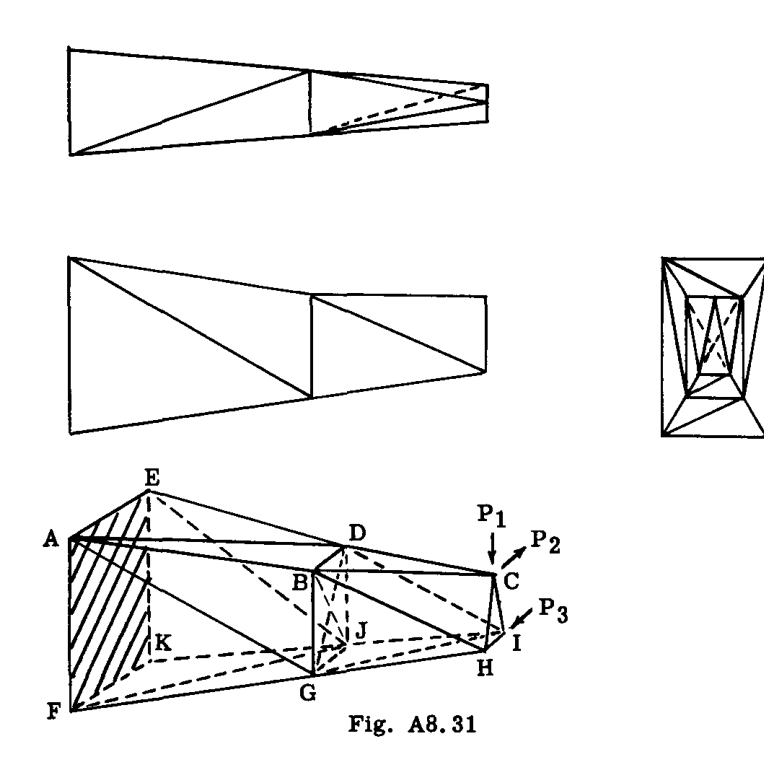

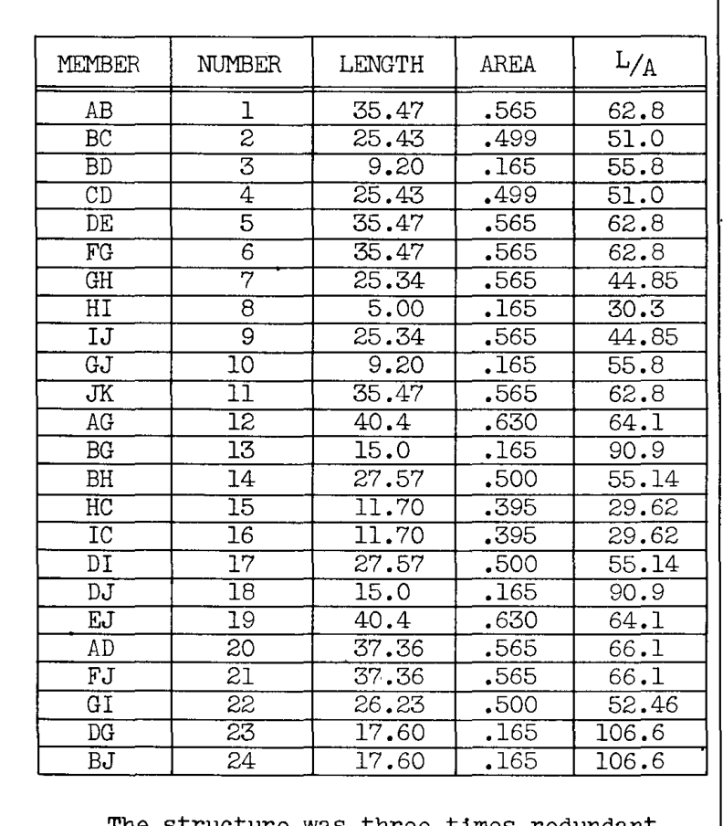

この構造は 3 次不静定であった。 $p$  個の節点を持つ空間骨組では、  $3p-6$  個の独立した静的釣合方程式を書くことができる (p. A8.10 参照)。しかし、ここでは面 AEKF の応力の詳細は考慮せず、この面内の 2 方向の正味の力のみを合計した 6 つの方程式が失われる。  $3 \times 11 - 6 - 6 = 21$  個の方程式が得られ、24 個の部材未知数が存在する。部材 22, 23, 24 が切断された。

次のステップは、単位応力分布  $[g_{im}]$  および  $[g_{ir}]$  を計算することであった。点  $m = 1, 2, 3$  および  $r = 22, 23, 24$  において連続して単位荷重と力を適用し、各荷重を構造全体に伝えるよりも、大規模で複雑な構造に適した別の手順が採用された。

使用された方法では、7 つの節点のそれぞれについて静的釣合方程式が作成された。各節点における 3 方向の力の合計により、24 個の  $q$  (未知数) に関する 21 個の方程式と、3 つの適用荷重  $P_1, P_2, P_3$  が得られた。得られたいくつかの典型的な方程式は以下の通りであった：

節点 C における  $\sum F$  より：

$$
\begin{cases}
.21368 q_{18} - .21368 q_{19} + .18334 q_{4} - .18334 q_{5} = -P_2 \\
q_{4} + q_{5} = 0 \\
q_{18} + q_{19} = -1.0236 P_1
\end{cases}
$$

節点 B における  $\sum F$  より：

$$
\begin{cases}
.081759 q_1 - .18334 q_3 - q_3 - .07617 q_{18} = .5227 q_{22} \\
q_1 - q_3 - .91593 q_{18} = 0 \\
-.1410 q_1 + q_{13} + .4146 q_{18} = -.8523 q_{23}
\end{cases}
$$

他の節点についても同様である。各ケースにおいて、方程式は適用荷重 ( $P_n$ ) と冗長力  $q$  ( $q_{22}, q_{23}, q_{24}$ ) が等号の右辺にまとめられるように整理されたことに注意せよ。この配置は 21 個の方程式すべてに対して行われ、その後、方程式は次のような行列形式で配置された：

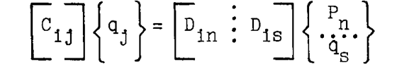

$$
\begin{aligned}
i, j &= 1, 2, \dots, 24 \\
n &= 1, 2, 3 \\
s &= 22, 23, 24
\end{aligned}
$$

(ここで 24 個の方程式があったことに注意せよ。追加の 3 つの方程式は恒等式  $q_{22} = q_{22}, q_{23} = q_{23}, q_{24} = q_{24}$  である。)

上記行列方程式の右辺では、行列は「分割 (partitioned)」されて示されている。  $[D]$  の最初の 3 列は  $P_n$  の係数であり、最後の 3 列は  $q_s$  の係数である。

行列方程式は、  $[C_{ij}]$  の逆行列を求めることによって  $q_j$  について解かれた (付録参照)。したがって、

$$
\{q_j\} = [g_{jn} : g_{js}] \begin{Bmatrix} P_n \\ q_s \end{Bmatrix}
$$

ここで

$$
[g_{jn} : g_{js}] = [C_{ij}^{-1}] [D_{in} : D_{is}]
$$

このように、静定構造における単位応力分布は、作業を日常的な数学的演算に還元することを主な利点とする手順によって求められた。この作業の遂行にあたっては、適切な標準化された技術が採用される場合がある。*

この場合の結果は以下の通りであった：

![[gin : gjs] Table](p3_table_01.png)

部材の柔軟性係数  $L/A$  は、行列  $[a_{ij}]$  の対角要素として配置された。次に、式 (17) および (18) に従って計算すると：

![[arn] Matrix Result](p3_fig_01.png)

![[ars] Matrix Result](p3_fig_02.png)

逆行列が求められた (付録参照)：

![[ars^-1] Inverse Matrix Result](p3_fig_03.png)

次に (式 (22) および (22a) を参照)：

![[Gsn] Matrix Result](p3_fig_04.png)

最後に、完全な単位応力分布が以下のように得られた：

$$
[G_{im}] = [g_{im}] + [g_{ir}] [G_{rm}]
$$

![[Gim] Final Stress Distribution](p3_table_02.png)

## 例題 15

図 A8.32 の二重対称 4 フランジ理想化ボックス梁を、示された 6 点における荷重適用による応力について解析する。フランジ面積 * は翼根から翼端にかけて直線的にテーパーしており、板厚は各パネル内で一定である。梁は翼根で剛に固定されており、ねじり荷重による翼根断面のワーピング (反り) に対して完全な拘束を与えている。

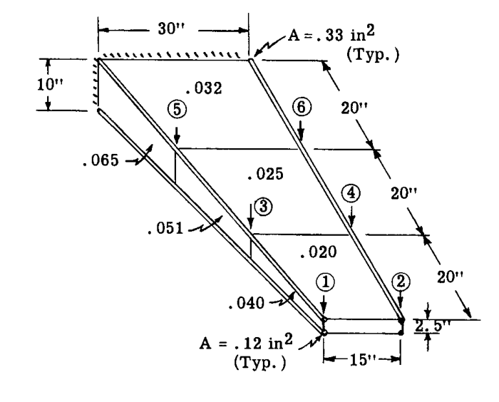

### 解法：
採用された一般化力は、分解図である図 A8.33 に示されている。下面については、対称性のため、その部材と力は上面のものと等しいので、力は示されていない。  $[a_{ij}]$  行列において、この事実は上面部材の柔軟性係数を 2 倍にすることで考慮された。

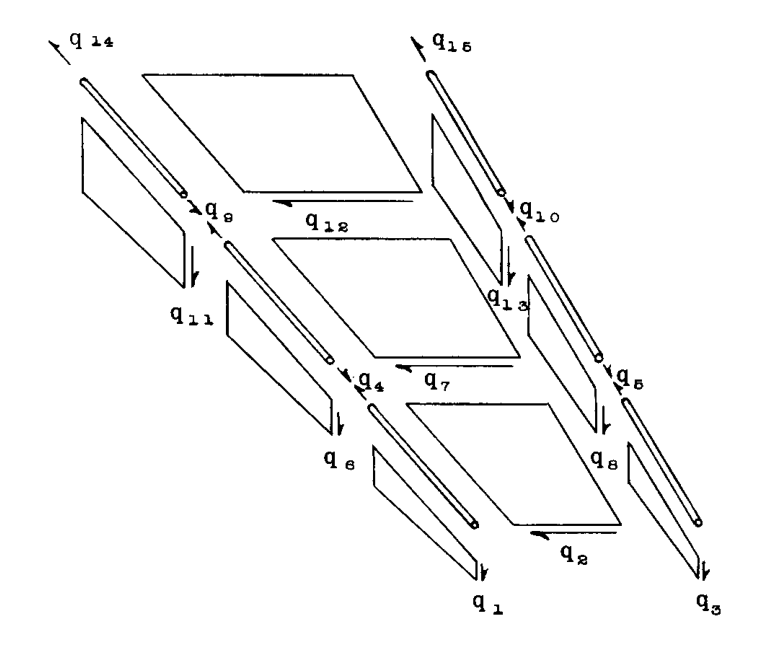

部材の柔軟性係数は、以下に示すように行列形式で収集された。  $a_{44}, a_{66}, a_{99}, a_{10,10}$  のエントリは、それぞれ 2 つのストリンガーから収集された (また上述のように 2 倍にされている) ことに注意せよ。これらのテーパーしたストリンガーの係数は、Art. A7.10 の公式から計算された。

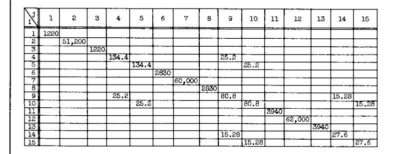

カバーシートのせん断流  $q_2, q_7, q_{12}$  が冗長力として選択された。これらをゼロに設定し、荷重ポイント「1」から「6」に単位荷重を順次適用することで、  $[g_{im}]$  行列が得られた。カバーシートが「切断」されると、2 つのウェブは平面ウェブ梁として独立して動作する。このような梁の応力計算の詳細は例題 21、Art. A7.7 のものと同様であり、ここでは示さない。

![[gim] Table Result](p4_table_02.png)

 $[g_{ir}]$  の計算は、冗長力  $q_2, q_7, q_{12}$  に順次単位値を割り当てることによって行われた。計算は、図 A8.34 のエンドベイの分解図によって例示されており、  $q_2 = 1$  の場合の構造のその部分における計算を示している。  $q_2 = 1$  は、「切断部」の両側に 1 つずつ作用する自己釣合したせん断流のペアとして適用されたことに注意せよ。リブは自身の面内で剛であるとみなされた。

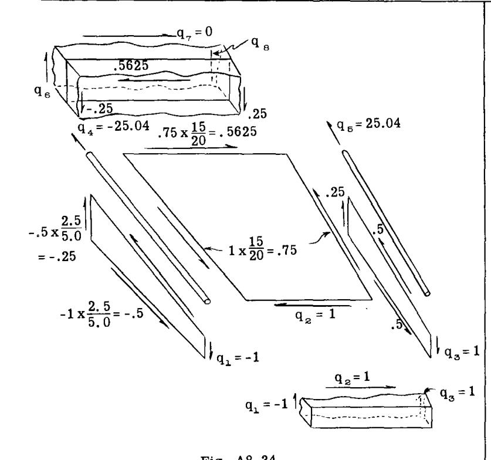

 $q_2 = 1$  とすると、エンドリブの平衡より ( $\sum M, \sum F$ )：

$$
\begin{aligned}
q_4 &= -1.0 \\
q_3 &= 1.0
\end{aligned}
$$

第 2 リブの平衡より：

$$
\begin{aligned}
q_8 &= -(.5625 - .25) = -.3125 \\
q_6 &= .3125 \\
q_7 &= 0 \quad (仮定による)
\end{aligned}
$$

同様に、次のベイへと進む。ここで使用される理想化では、リブは自身の面に垂直な方向には剛性を持たないため、軸方向のフランジ荷重は隣接するベイのフランジ端に直接伝達される (図 A8.33 の  $q_4, q_7, q_8, q_{10}$  を参照)。

![[gir] Table Result](p5_table_01.png)

以下の行列積が形成された：

式 (18) より：

![Matrix Product [ars]](p5_fig_02.png)

式 (17) より：

![Matrix Product [arn]](p5_fig_03.png)

 $[a_{rs}]$  の逆行列が求められた (付録参照)：

![Inverse [ars^-1]](p5_fig_04.png)

次に、

![[Gsn] Matrix](p5_fig_05.png)

最後に、真の応力は以下の通りであった (式 23 より)：

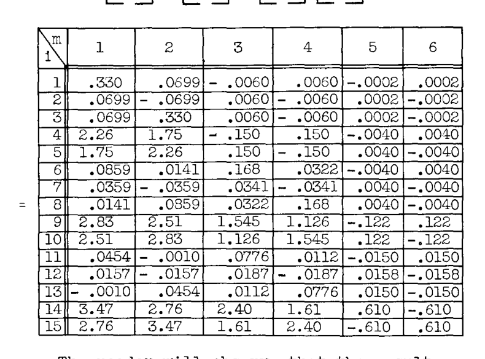

読者は、結果が「ねじりによる曲げ応力」、すなわち、翼根がワーピングに対して拘束されている場合に、ねじりを受ける梁の翼根付近で軸方向フランジ応力が増大することを示していることに気づくだろう。

 $P_1 = 1$  および  $P_2 = -1$  に対する応力を重ね合わせることによって求められた。したがって、この条件下では、15 インチポンドのトルクに対して、以下の翼根フランジ荷重が存在することがわかる。

 $q_{14} = 3.47 - 2.76 = 0.71 \text{ lbs.}$ 

## A8.11 行列法による不静定問題のたわみ計算
たわみ (特に影響係数行列) は、Art. A8.10 の結果から容易に計算される。冗長力  $\{q_s\}$  が式 (22) から決定されていると仮定する。外部荷重ポイントの全たわみは、(1) 「切断された」構造に作用する外部荷重によるたわみ  $[a_{mn}] \{P_n\}$  (式 16 参照) と、(2) この同じ切断構造に作用する冗長力によるたわみ  $[a_{ms}] \{q_s\}$  (式 17 参照) の和として容易に計算される。したがって、

$$
\{\delta_m\} = [a_{mn}] \{P_n\} + [a_{ms}] \{q_s\}
$$

式 (22) を代入すると、

$$
\begin{aligned}
\{\delta_m\} &= [a_{mn}] \{P_n\} - [a_{ms}] [a_{rs}^{-1}] [a_{rn}] \{P_n\} \\
&= ([a_{mn}] - [a_{ms}] [a_{rs}^{-1}] [a_{rn}]) \{P_n\}
\end{aligned}
$$

上記の括弧内の行列式は、単位値の適用荷重に対するたわみを与えるものであり、影響係数行列である。以下のように置くと、

$$
[A_{mn}] \equiv [a_{mn}] - [a_{ms}] [a_{rs}^{-1}] [a_{rn}] \tag{25}
$$

したがって、

$$
\{\delta_m\} = [A_{mn}] \{P_n\} \tag{26}
$$

## 例題 16
例題 14 の冗長トラスの影響係数行列を求めよ。

### 解法：
以前の作業から、以下の行列積が形成された：

![[amn] Matrix](p6_fig_01.png)

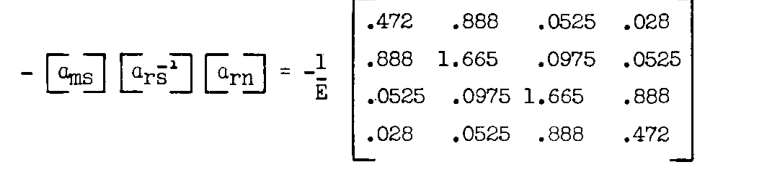

最後に、これら 2 つの行列の和により以下が得られた：

![Summed [Amn] Matrix](p6_fig_03.png)

## 例題 17
例題 15 のボックス梁の影響係数行列を求めよ。

### 解法：
式 (25) に示されたものとは別の手順がとられた。影響係数行列は、第 A-7 章 Art. A7.9 のように、積によって形成された：

$$
[A_{mn}] = [G_{mi}] [a_{ij}] [G_{jn}]
$$

この積は、例題 15 から  $[G_{im}]$  が利用可能であったため、容易に形成された。結果は以下の通りであった：

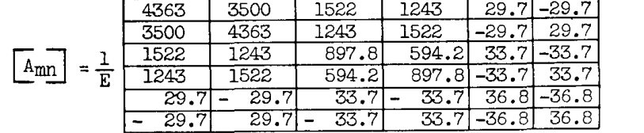

## A8.12 不静定計算における精度と正確さ
精度の問題は、構造の幾何学的形状を扱う際に得られ保持される有効数字の桁数と、算術演算が行われる際の注意深さに依存する。正確さの問題は、定式化の方法によって影響を受ける、最終的な回答で得られる有効数字の数に関係する。正確さに影響を与える 2 つの要因は、しばしば「冗長力の選択」という見出しの下で一緒に考慮される。それらは：

I - 冗長力係数行列  $[a_{rs}]$  の逆行列の解において保持され得る有効数字の数 (式 21)。

II - 静定力の大きさと比較した冗長力の大きさ。

これらは式 21、すなわち

$$
[a_{rs}] \{q_s\} = -[a_{rn}] \{P_n\}
$$

の左辺と右辺にそれぞれ関係しており、以下で詳しく説明する。

### I -  $[a_{rs}]$  の逆行列の正確さ；行列の状態 (コンディション)。
逆行列を計算できる正確さを決定する行列の特性は、その「状態」である。行列の状態は、主対角成分に対する非対角成分の大きさの指標である。非対角成分の相対的なサイズが小さいほど、行列の状態は良くなる。状態の良い行列は、状態の悪い行列よりも正確に逆行列を求めることができる。

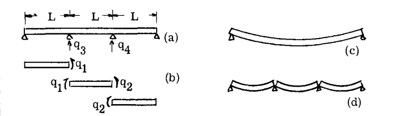

![[aij] Matrix](p7_fig_02.png)

![[gir] Table](p7_table_01.png)

![[ars] Matrix Result 1](p8_fig_01.png)

この冗長行列の状態は悪い。物理的には、点「3」における単位荷重は、点「3」自体とほぼ同じだけのたわみを点「4」に引き起こす。相互干渉 (クロスカップリング) が大きい。

第二に、モーメント  $q_1$  と  $q_2$  が冗長力として選択されたと仮定する。単位冗長力  $q_1 = 1$  および  $q_2 = 1$  を適用すると以下が得られた：

![[gir] Matrix Table](p8_table_01.png)

![[ars] Matrix Result 2](p8_fig_02.png)

この冗長行列の状態は、最初の冗長力の選択で得られたものよりも明らかに良好である。冗長力間の相互干渉が少ない。このように、解析者は冗長力を選択することによって、行列の状態を決定する。

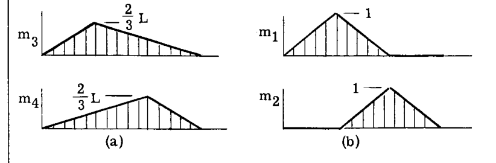