# 不静定構造

A8.22

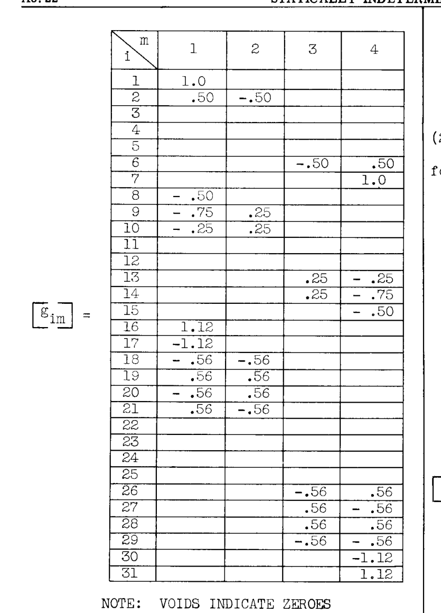

注：空欄はゼロを示す

掛け合わせの結果、以下が得られた：

$$
[a_{rs}] = [g_{ri}] [a_{ij}] [g_{js}] = \frac{1}{E} \begin{bmatrix} 136 & -8.0 \\ -8.0 & 136 \end{bmatrix}
$$

$$
[a_{rn}] = [g_{ri}] [a_{ij}] [g_{jn}]
$$

$$
= \frac{1}{E} \begin{bmatrix} -8.0 & -15.0 & 0 & 0 \\ 0 & 0 & -15.0 & -8.0 \end{bmatrix}
$$

 $[a_{rs}]$  の逆行列が求められた（付録参照）：

$$
[a_{rs}^{-1}] = \frac{E}{18,432} \begin{bmatrix} 136 & 8.0 \\ 8.0 & 136 \end{bmatrix}
$$

次に、単位荷重に対する冗長力の値が式(22)に従って求められた。

$$
[G_{sn}] = - [a_{rs}^{-1}] [a_{rn}]
$$

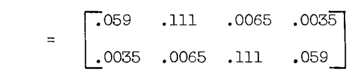

式(23)に従って計算が完了し、単位外部荷重に対する部材力の値  $[G_{im}]$  が得られた。

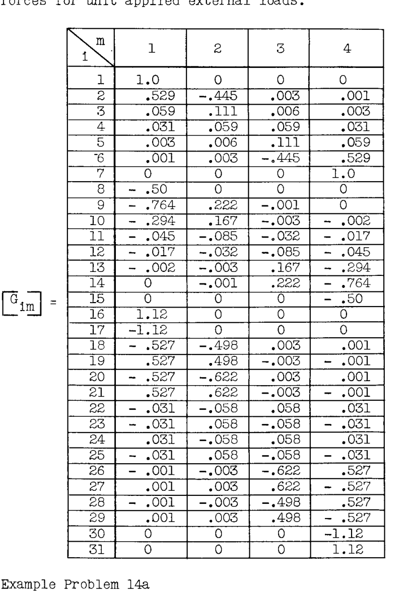

## 例題 14a
図 A8.31 は、図示のように 3 つの集中荷重に分解される尾翼空気荷重を受ける鋼管製尾部胴体トラスの 2 ベイを示している。取付点ステーション (A-E-F-K) の胴体バルクヘッドは、それ自体の平面内で剛体であると仮定できるほど十分に重い。したがって、トラスは図示のように A-E-F-K から片持ちで支持されているものとして解析できる。すべての部材は鋼管であり、その長さと断面積は下の表にまとめられている。

### 解答
一般化された力は部材の軸荷重とされ、これらは下の表のように番号付けされた。部材の柔軟性係数  $L/A$ （便宜上  $E$  を 1 と置く）も表にまとめられた。

---

AS 23

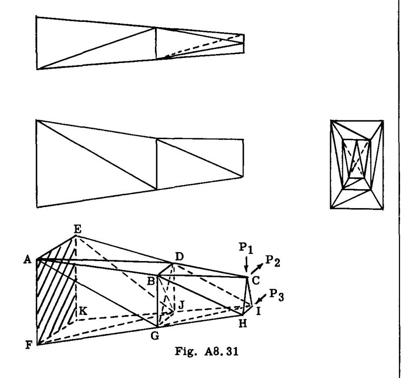

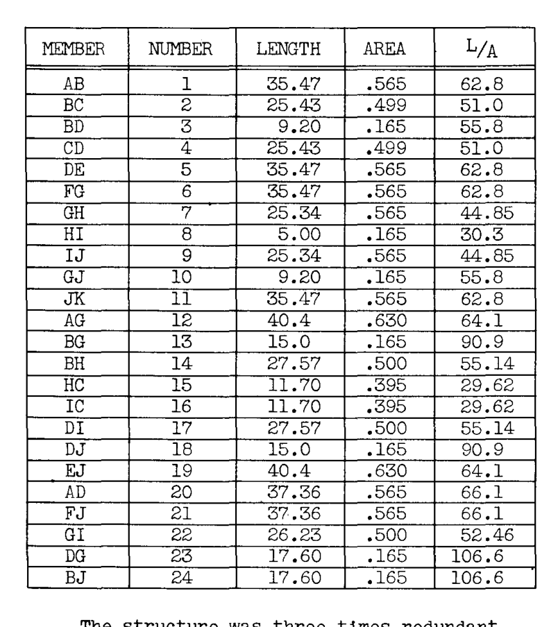

この構造は 3 次の不静定であった。 $p$  個の節点を持つ空間骨組において、3p-6 個の独立した静力学平衡方程式を書くことができる (p. A8.10)。しかし、ここでは AEKF 平面内の応力の詳細は無視される。この平面では 2 方向の正味の力しか合計できないため、6 つの方程式が失われる。  
 $3 \times 11 - 6 - 6 = 21$  本の方程式、24 本の部材未知数。部材 22, 23, 24 が切断された。

次のステップは、単位応力分布  $[g_{im}]$  および  $[g_{ir}]$  を計算することであった。点  $m = 1, 2, 3$  および  $r = 22, 23, 24$  において連続して単位荷重と力を適用し、各荷重を構造全体に伝えるのではなく、大規模で複雑な構造に適した別の手順が採用された。

使用された方法では、7 つの節点それぞれの静的平衡方程式が書かれた。* 各節点での 3 方向の力の合計により、24 個の  $q$ （未知数）に関する 21 本の方程式と、3 つの適用荷重  $P_{1}, P_{2}, P_{3}$  が得られた。得られたいくつかの典型的な方程式は以下の通りである：

節点 C での  $\Sigma F$  より：

$$
\begin{cases} .21368 q_{18} - .21368 q_{19} + .18334 q_{4} - .18334 q_{3} = -P_{2} \\ q_{4} + q_{3} = 0 \\ q_{19} + q_{18} = -1.0236 P_{1} \end{cases}
$$

節点 B での  $\Sigma F$  より：

$$
\begin{cases} .081759 q_{1} - .18334 q_{3} - q_{8} - .07617 q_{18} = .5227 q_{22} \\ q_{1} - q_{3} - .91593 q_{14} = 0 \\ -.1410 q_{1} + q_{13} + .4146 q_{14} = -.8523 q_{22} \end{cases}
$$

他の節点についても同様である。  
各ケースにおいて、方程式は適用荷重 ( $P_{n}$ ) と冗長力  $q$  ( $q_{22}, q_{23}, q_{24}$ ) が等号の右側にグループ化されるように配置されたことに注意されたい。この配置は全 21 本の方程式について行われ、その後、方程式は次のような行列形式に配置された：

$$
[C_{ij}] \{q_{j}\} = [D_{in} \vdots D_{is}] \begin{Bmatrix} P_{n} \\ \cdots \\ q_{s} \end{Bmatrix}
$$

$$
i, j = 1, 2, \dots, 24 \\
n = 1, 2, 3 \\
s = 22, 23, 24
$$

（ここでは 24 本の方程式があったことに注意。追加の 3 本の方程式は恒等式である）

$$
\begin{cases} q_{22} = q_{22} \\ q_{23} = q_{23} \\ q_{24} = q_{24} \end{cases}
$$

上記の行列方程式の右辺では、行列は「分割」されて示されている。 $[D]$  の最初の 3 列は  $P_{n}$  の係数であり、最後の 3 列は  $q_{s}$  の係数である。

* トラス以外の構造物では、平衡方程式は様々な構造要素に対して書かれ、節点のみの平衡は不適切になる場合がある。

---

AB.24

行列方程式は、 $[C_{ij}]$  の逆行列を求めることによって  $q_{j}$  について解かれた（付録参照）。したがって、

$$
\{q_{j}\} = [g_{jn} \vdots g_{js}] \begin{Bmatrix} P_{n} \\ \cdots \\ q_{s} \end{Bmatrix}
$$

ここで、

$$
[g_{jn} \vdots g_{js}] = [C_{ij}^{-1}] [D_{in} \vdots D_{is}]
$$

このようにして、静定構造における単位応力分布は、作業を日常的な数学的操作に還元することを主な利点とする手順によって求められた。この作業の遂行にあたっては、適切な標準化された技術が採用され得る。*  
このケースでの結果は以下の通りであった：

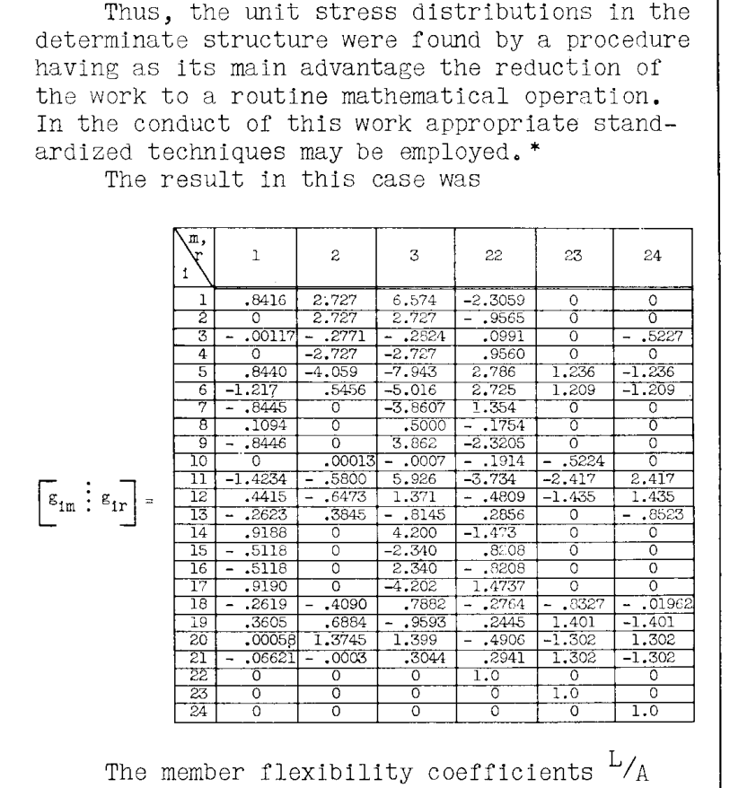

部材柔軟性係数  $L/A$  は行列  $[a_{ij}]$  の対角要素として配置された。次に、式(17)および(18)に従って掛け合わせると、

$$
[a_{rn}] = \begin{bmatrix} 177.9 & -1137.0 & -6430.3 \\ 195.0 & -151.7 & -2263.0 \\ -154.4 & 161.6 & 2273.3 \end{bmatrix}
$$

$$
[a_{rs}] = \begin{bmatrix} 2970 & 1150 & -1148 \\ 1150 & 1221 & -1035 \\ -1148 & -1035 & 1224 \end{bmatrix}
$$

逆行列が求められた（付録参照）：

$$
[a_{rs}^{-1}] = 10^{-3} \begin{bmatrix} .5555 & -.2880 & .2775 \\ -.2880 & 3.0412 & 2.3015 \\ .2775 & 2.3015 & 3.023 \end{bmatrix}
$$

次に（式(22)および(22a)を参照して）：

$$
[G_{sn}] = - [a_{rs}^{-1}] [a_{rn}] = 10^{-3} \begin{bmatrix} .18 & 543 & 2289 \\ -186.4 & -238 & -201.0 \\ 31.4 & 176 & 121.3 \end{bmatrix}
$$

最後に、完全な単位応力分布は次のように得られた：

$$
[G_{im}] = [g_{im}] + [g_{ir}] [G_{rm}]
$$

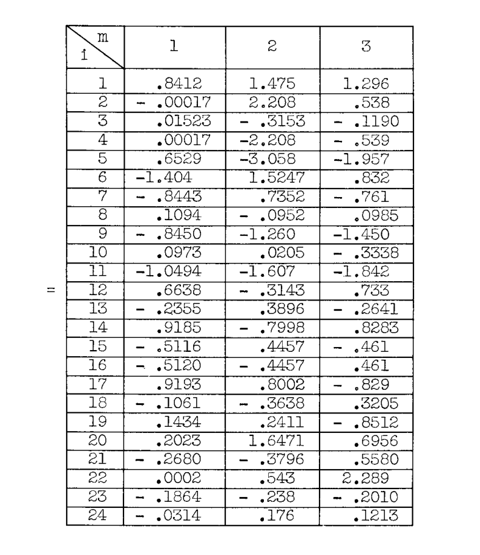

## 例題 15
図 A8.32 の二重対称 4 フランジ理想化ボックス梁を、示された 6 つの点における荷重適用による応力について解析する。フランジ面積* は根元から先端まで線形にテーパーしているが、各パネルのシート厚さは一定である。梁は根元で剛に取付けられ、ねじり荷重による根元断面の反りに対して完全な拘束を提供している。

* これらは「有効面積」であり、フランジ面積に隣接する有効カバーシート面積、およびウェブ面積の 6 分の 1 を加えたものである（6 分の 1 という係数は、分散されたウェブ面積と同じ慣性モーメントを与える）。

---

AB.25

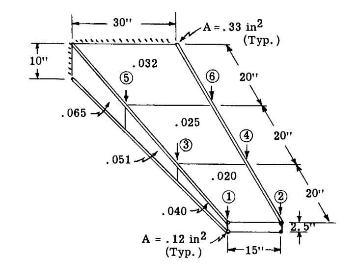

### 解答
採用された一般化された力は、分解図である図 A8.33 に示されている。下面については、対称性のため、その部材と力は上面のものと等しく、力は示されていない。 $[a_{ij}]$  行列において、この事実は上面の部材の柔軟性係数を 2 倍にすることで考慮された。

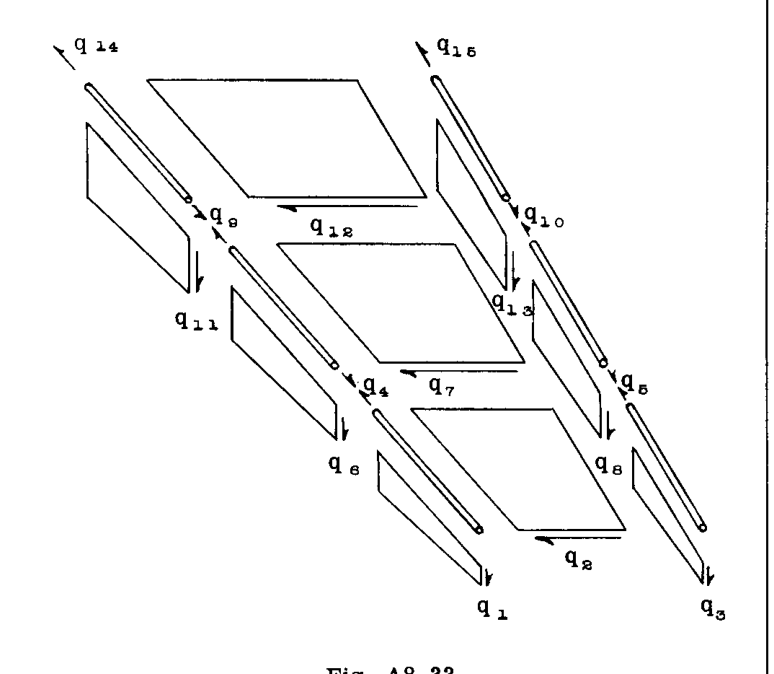

部材柔軟性係数は、以下に示すように行列形式で収集された。 $a_{44}, a_{88}, a_{99}, a_{10,10}$  のエントリは、それぞれ 2 つのストリンガーから収集されたものである（また、前述のように 2 倍にされている）ことに注意されたい。これらのテーパーストリンガーの係数は、Art. A7.10 の公式から計算された。

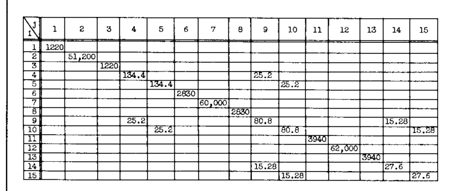

注：空欄はゼロを示す。 $E = 1, G = .385$ 

カバーシートのせん断流  $q_{2}, q_{7}, q_{12}$  が冗長力として選択された。これらをゼロに設定し、載荷点「1」から「6」に順次単位荷重を置くことで、 $[g_{im}]$  行列が得られた。カバーシートが「切断」されると、2 つのウェブは平面ウェブビームとして独立して機能する。そのような梁の応力計算の詳細は、例題 21, Art. A7.7 のものと同様であり、ここでは示さない。

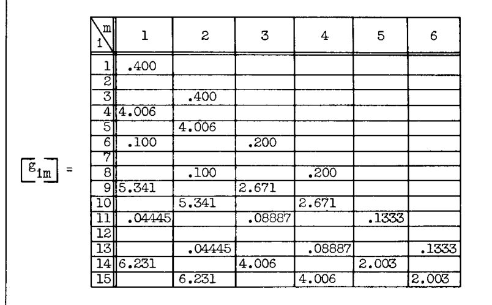

注：空欄はゼロを示す。

 $[g_{ir}]$  の計算は、冗長力  $q_{2}, q_{7}, q_{12}$  に順次単位値を割り当てることによって行われた。計算は図 A8.34 のエンドベイの分解図によって示されており、 $q_{2} = 1$  に対する構造のその部分の計算を示している。 $q_{2} = 1$  は「切断部」の各側に作用するせん断流の自己平衡ペアとして適用されたことに注意されたい。リブはそれ自体の平面内で剛体であると見なされた。

$$q_{2} = 1$$ と置く。

端部リブの平衡より：  $(\Sigma M, \Sigma F)$ 