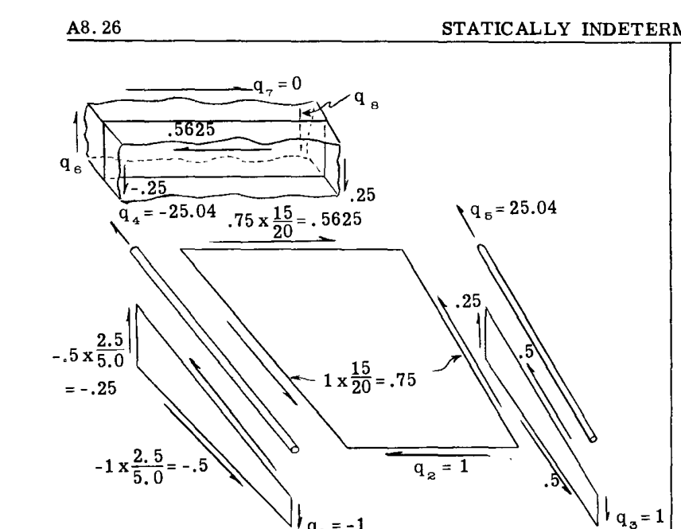
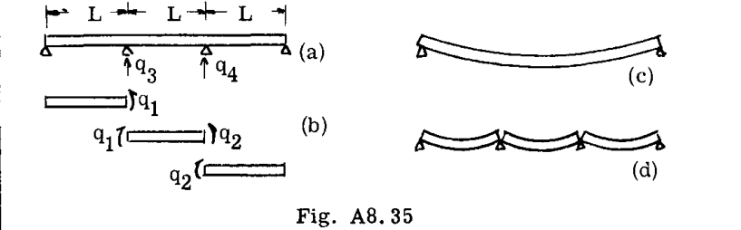
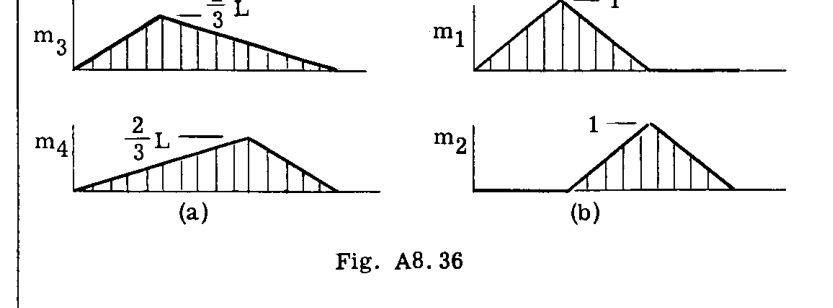

# A8.26 静定不定構造物  

  

 $q_1 = -1.0$   
 $q_3 = 1.0$   

第2リブの平衡条件より：  
 $q_5 = -(.5625 - .25) = -.3125$   
 $q_6 = .3125$   
 $q_7 = 0$  （仮定による）  

このようにして、次のベイへと続く。ここで用いられる理想化では、リブは自身の平面に対して垂直な剛性がゼロであるとされており、そのため軸方向のフランジ荷重は、隣接するベイのフランジ端に直接伝達される（Fig. A8.33の  $q_4, q_7, q_9, q_{10}$  を参照）。  

![[G_ir]](p1_tab_01.png)  

注：空欄はゼロを示す。  

以下の行列の積が形成された。  
式(18)より：  

$$ 
 [q_{rs}] = \frac{10^6}{E} \begin{bmatrix} .3774 & .1789 & .0520 \\ .1789 & .2678 & .07322 \\ .0520 & .07322 & .1254 \end{bmatrix} 
 $$  

式(17)より：  

$$ 
 [a_{rn}] = \frac{10^6}{E} \begin{bmatrix} -.03356 & .03356 & -.009318 & .009318 & -.001605 & .001605 \\ -.02324 & .02324 & -.01156 & .01156 & -.002259 & .002259 \\ -.008216 & .008216 & -.005150 & .005150 & -.002278 & .002278 \end{bmatrix} 
 $$  

 $[q_{rs}]$  の逆行列が求められた（付録参照）。  

$$ 
 [q_{rs}^{-1}] = \frac{E}{10^6} \begin{bmatrix} 3.882 & -2.562 & -.1137 \\ -2.562 & 6.137 & -2.521 \\ -.1137 & -2.521 & 9.499 \end{bmatrix} 
 $$  

したがって、  

$$ 
 [G_{sn}] = - [q_{rs}^{-1}] [a_{rn}] 
 $$  

$$ 
 = \begin{bmatrix} .0699 & -.0699 & .00598 & -.00598 & .00016 & -.00016 \\ .03593 & -.03593 & .03409 & -.03409 & .00403 & -.00403 \\ .01568 & -.01568 & .01872 & -.01872 & .01578 & -.01578 \end{bmatrix} 
 $$  

最後に、真の応力は以下の通りであった（式23より）。  

![[G_im]](p1_tab_02.png)  

読者は、この結果が「ねじれによる曲げ応力」、すなわち、梁の根元が反り（ワーピング）に対して拘束されている場合に、ねじれを受ける梁の根元付近で軸方向フランジ応力が増大することを示していることに気づくだろう。トルクを適用するための解は、 $P_1 = 1$  と  $P_2 = -1$  の応力を重ね合わせることで容易に得られる。したがって、この条件下では以下のような根元フランジ荷重が存在することがわかる。  

 $q_{14} = 3.47 - 2.76 = 0.71 \text{ lbs.}$   
15インチ・ポンドのトルクに対して。  

## A8.11 行列法による冗長系のたわみ計算  

たわみ（特に影響係数行列）は、Art. A8.10の結果から容易に計算される。  
冗長力  $\{q_s\}$  が式(22)から決定されたと仮定する。このとき、外部荷重作用点の全たわみは、(1)「切断」構造に作用する外部荷重によるたわみ  $[a_{mn}]\{P_n\}$ （式16参照）と、(2)同じ切断構造に作用する冗長力によるたわみ  $[a_{ms}]\{q_s\}$ （式17参照）の和として容易に計算される。したがって、  

$$ 
 \{\delta_m\} = [a_{mn}]\{P_n\} + [a_{ms}]\{q_s\} 
 $$  

式(22)より代入すると：  

$$ 
 \{\delta_m\} = [a_{mn}]\{P_n\} - [a_{ms}][q_{rs}^{-1}][a_{rn}]\{P_n\} 
 $$  

$$ 
 = ([a_{mn}] - [a_{ms}][q_{rs}^{-1}][a_{rn}])\{P_n\} 
 $$  

上記の括弧内の行列式は、単位荷重に対するたわみを与えるものであり、影響係数行列である。これを  $[A_{mn}]$  とおくと、  

$$ 
 [A_{mn}] \equiv [a_{mn}] - [a_{ms}][q_{rs}^{-1}][a_{rn}] \quad \dots (25) 
 $$  

となり、したがって  

$$ 
 \{\delta_m\} = [A_{mn}]\{P_n\} \quad \dots (26) 
 $$  

### 例題 16  
例題14の冗長トラスの影響係数行列を決定せよ。  

**解法：**  
前回の作業から、以下の行列積が形成された。  

$$ 
 [a_{mn}] = [G_{mi}][\alpha_{ij}][G_{jn}] = \frac{1}{E} \begin{bmatrix} 144 & -15.0 & 0 & 0 \\ -15.0 & 38.0 & 0 & 0 \\ 0 & 0 & 38.0 & -15.0 \\ 0 & 0 & -15.0 & 144 \end{bmatrix} 
 $$  

$$ 
 [a_{ms}][q_{rs}^{-1}][a_{rn}] = -\frac{1}{E} \begin{bmatrix} .472 & .888 & .0525 & .028 \\ .888 & 1.665 & .0975 & .0525 \\ .0525 & .0975 & 1.665 & .888 \\ .028 & .0525 & .888 & .472 \end{bmatrix} 
 $$  

最後に、上記の2つの行列の和により以下が得られた。  

$$ 
 [A_{mn}] = \frac{1}{E} \begin{bmatrix} 144 & -15.9 & -.052 & -.028 \\ -15.9 & 36.3 & -.098 & -.052 \\ -.052 & -.098 & 36.3 & -15.9 \\ -.028 & -.052 & -15.9 & 144 \end{bmatrix} 
 $$  

### 例題 17  
例題15のボックス梁の影響係数行列を決定せよ。  

**解法：**  
式(25)に示されたものとは別の手順が取られた。影響係数行列は、Chapter A-7, Art. A7.9のように、以下の積によって形成された。  

$$ 
 [A_{mn}] = [G_{mi}][\alpha_{ij}][G_{jn}] 
 $$  

例題15から  $[G_{im}]$  が利用可能であったため、この積は容易に形成された。結果は以下の通りである。  

$$ 
 [A_{mn}] = \frac{1}{E} \begin{bmatrix} 4363 & 3500 & 1522 & 1243 & 29.7 & -29.7 \\ 3500 & 4363 & 1243 & 1522 & -29.7 & 29.7 \\ 1522 & 1243 & 897.8 & 594.2 & 33.7 & -33.7 \\ 1243 & 1522 & 594.2 & 897.8 & -33.7 & 33.7 \\ 29.7 & -29.7 & 33.7 & -33.7 & 36.8 & -36.8 \\ -29.7 & 29.7 & -33.7 & 33.7 & -36.8 & 36.8 \end{bmatrix} 
 $$  

## A8.12 冗長系応力計算における精度と正確さ  

精度の問題は、構造の幾何学を扱う際に得られ、保持される有効数字の数と、算術演算が行われる際の注意深さに依存する。以下の議論では、計算の精度に関して当然の注意が払われているものと仮定する。  
正確さの問題は、問題の定式化の仕方によって影響を受ける、最終的に得られる回答の有効数字の数に関係している。結果の正確さは多くの要因に影響される可能性があるが、ここではそのうち最も重要な2つについて議論する。  
正確さに影響を与える2つの要因は、しばしば「冗長系の選択」という見出しの下で一括して考慮される。それらは以下の通りである：  

- I - 冗長力係数行列  $[q_{rs}]$ （式21）の逆行列の解において保持され得る有効数字の数。  
- II - 静定力（決定力）の大きさと比較した冗長力の大きさ。  

これら2つの要因は、それぞれ式21の左辺と右辺に関係している。すなわち、  

$$ 
 [q_{rs}]\{q_s\} = -[a_{rn}]\{P_n\} 
 $$  

これらについては、以下で詳しく説明する。  

## I -  $[q_{rs}]$  の逆行列計算の精度；行列の条件（コンディション）  

逆行列を計算できる精度を決定する行列  $[q_{rs}]$  の特性は、その「条件（コンディション）」である。行列の条件は、対角要素（左上から右下）に対する非対角要素の大きさの目安となる。対角要素に対する非対角要素の相対的なサイズが小さいほど、行列の条件は良くなる。条件の良い行列は、条件の悪い行列よりも正確に逆行列を求めることができる。例として、2つの極端なケースを挙げる。  

a) 対角行列。その非対角要素はゼロであるため、理想的な条件である。したがって、以下の逆行列は：  

$$ 
 \begin{bmatrix} 2 & 0 & 0 \\ 0 & 7 & 0 \\ 0 & 0 & -3 \end{bmatrix} 
 $$  

以下のように容易かつ正確に得られる。  

$$ 
 \begin{bmatrix} 1/2 & 0 & 0 \\ 0 & 1/7 & 0 \\ 0 & 0 & -1/3 \end{bmatrix} 
 $$  

b) 各行のすべての要素が等しい行列。対角線外のすべての要素が対角要素と等しい。このような行列の行列式はゼロであり、したがってその逆行列は見つけられない（付録参照）。その条件は最悪である。例：  

$$ 
 \begin{bmatrix} 2 & 2 & 2 \\ 7 & 7 & 7 \\ -3 & -3 & -3 \end{bmatrix} 
 $$  

行列  $[q_{rs}]$  において、非対角要素はある冗長力と別の冗長力との間の構造的な相互干渉（クロスカップリング）の尺度である。この相互干渉の強さは、構造を静定にするための「切断」における冗長力の選択に依存する。  
例えば、Fig. A8.35(a)の二重冗長梁は、任意の2つの拘束を「切断」することによって静定にすることができる。  

  

Fig. A8.35(b)は一般化された力の選択を示している。ひずみエネルギーを記述するために必要なのは2つの力（ $q_1$  と  $q_2$ ）だけであるが、議論の便宜上、中央の支点反力にも記号が与えられている。その場合、  

$$ 
 [\alpha_{ij}] = \frac{L}{EI} \begin{bmatrix} 2/3 & 1/6 & 0 & 0 \\ 1/6 & 2/3 & 0 & 0 \\ 0 & 0 & 0 & 0 \\ 0 & 0 & 0 & 0 \end{bmatrix} 
 $$  

まず、支点反力  $q_3$  と  $q_4$  を冗長力として選択して梁を静定にしたと仮定する。この場合の「切断構造」は、中央の支点が取り除かれたFig. A8.35(c)の梁として視覚化できる。単位冗長力  $q_3 = 1$  および  $q_4 = 1$  を適用すると、以下が得られた。  

![[G_ir] (q3, q4)](p3_tab_01.png)  

計算すると、  

$$ 
 [q_{rs}] = [G_{ri}][\alpha_{ij}][G_{js}] = \frac{L^3}{18EI} \begin{bmatrix} 8 & 7 \\ 7 & 8 \end{bmatrix} \quad (r, s = 3, 4) 
 $$  

この行列の条件は悪い。物理的には、点「3」における単位荷重は、点「4」において自身とほぼ同じ大きさのたわみを引き起こす。相互干渉（クロスカップリング）が大きいのである。  
次に、モーメント  $q_1$  と  $q_2$  が冗長力として選択されたと仮定する。この場合の「切断構造」は、Fig. A8.35(d)のように視覚化される。単位冗長力  $q_1 = 1$  および  $q_2 = 1$  を適用すると、以下が得られた。  

![[G_ir] (q1, q2)](p4_tab_01.png)  

計算すると、  

$$ 
 [q_{rs}] = [G_{ri}][\alpha_{ij}][G_{js}] = \frac{L}{6EI} \begin{bmatrix} 4 & 1 \\ 1 & 4 \end{bmatrix} \quad (r, s = 1, 2) 
 $$  

この冗長行列の条件は、最初の冗長力の選択で得られたものよりも明らかに良好である。冗長力間の相互干渉が少なくなっている。  
このように、解析者は冗長力を選択することによって行列の条件を決定する。高度な冗長構造の場合、この選択は非常に重要になる可能性がある。初期データから得られる有効数字の数が限られている場合、大規模で条件の悪い行列を反転させることは不可能であることが判明するかもしれないからである。以下の記述と経験則は、高度な冗長問題の処理に役立つだろう。  

(1) 相互干渉が最小（実際にはゼロ）になるような冗長力のセットを見つけることは常に可能である。理論的には、適切な冗長力の選択によって、行列  $[q_{rs}]$  を対角行列（理想的な条件）に縮小することができる。  
(1a) 相互干渉がゼロになる冗長力の選択（「直交関数」）は、一般には容易に見つからない。しかし、リングやフレームなどの一部の特殊な構造では、直交する冗長力を単純に選択できる場合がある。しかし、ほとんどの構造では、直交する冗長力のセットを探すために伴う追加の労力は報われない。  
(2) 条件の良い冗長行列を与える冗長力のセットを選択する際には、元の構造の特性をできるだけ多く保持した静定構造を残すような「切断」を行うのが最善である。したがって、Fig. A8.35(d)の構造は、Fig. A8.35(c)の構造よりも元の連続梁構造の特徴を多く保持していると考えることができる。  
(3) ある冗長力が別の冗長力に影響を与える度合い（相互干渉の範囲）は、それらの個別の単位荷重図がどの程度「重なり合う」かを観察することによって視覚化できる。  
この最後の点について詳しく説明するために、上記の例示的な例をもう一度参照する。 $q_3$  と  $q_4$  の相互干渉は、それらの単位荷重図が下のFig. A8.36(a)のように描かれる場合、大きくなることが予想される。このような相互干渉項のダミー単位荷重方程式が以下の形式であることを思い出せば、この推論は容易に導かれる。  

$$ 
 \int \frac{m_3 m_4 \, dx}{EI} 
 $$  

これは明らかに  $m_3, m_4$  に対して大きい。厳密には、比較は行列  $[q_{rs}]$  の対角要素を形成する以下の項に対して行われる。  

$$ 
 \int \frac{m_3^2 \, dx}{EI}, \int \frac{m_4^2 \, dx}{EI} 
 $$  

  

冗長力の選択  $q_1, q_2$ （Fig. A8.36b）に対する単位荷重図を調べると、ここでは相互干渉が小さいはずであることがわかる。なぜなら、以下の形式の積分は  

$$ 
 \int \frac{m_1 m_2 \, dx}{EI} 
 $$  

中央のスパンからのみ寄与を受けるからである。したがって、  

$$ 
 \int \frac{m_1 m_2 \, dx}{EI} 
 $$  

は明らかに  

$$ 
 \int \frac{m_1^2 \, dx}{EI} \text{ または } \int \frac{m_2^2 \, dx}{EI} 
 $$  

よりもかなり小さい。したがって、Fig. A8.36を目視で確認すると、 $q_1, q_2$  の方が  $q_3, q_4$  よりも冗長力の選択として優れていることがわかる。  

* Art. A8.7の式(8)を参照。