# A8.30 静定不定構造物

(4) 余剰力の組み合わせを採用することで、最初から選ばれた個々の余剰力によるものほど広範囲に「オーバーラップ」しない、新しい単位余剰力応力分布を得ることができる。  

例えば、前の例題において、余剰力として  $q_3$ 、 $q_4$  が最初に選ばれ、Fig. A8.37(a) の単位荷重図が得られたと仮定する。図を検討すると、強い程度のクロス結合（相互干渉）が予想されるため、新しい余剰力のセットが求められる。新しい「切断」を選択するために構造に戻るのではなく、 $m_3$  と  $m_4$  の図の組み合わせを探し、それらが「オーバーラップ」が少なく、したがってクロス結合が少なくなるようにする。  

目視による検討から、適切な組み合わせによって  $m_3$ 、 $m_4$  図から望ましい特性を持つ2つの新しい応力分布が形成できることがわかる。したがって、 $m_4$  図の半分を  $m_3$  図から引いて1つの新しい応力分布を形成し、 $m_3$  図の半分を  $m_4$  図から引いてもう1つの新しい応力分布を形成すると、結果は Fig. A8.37(b) に示すようになる。これらの新しい組み合わせでは、図の「オーバーラップ」が明らかに少なくなっている。

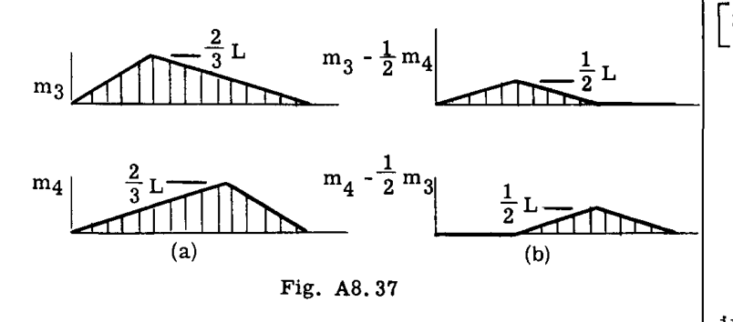
**Fig. A8.37 前の分布(a)を組み合わせることによって得られた新しい単位余剰力応力分布(b)。**

このようにして、線形結合によって2つの新しい未知数が導入される。行列表示では、古い応力分布  $[g_{ir}]$  は、次のようにして新しいセット  $[g_{i
ho}]$  に変換される：

$$
[g_{i
ho}] = [g_{ir}] [B_{r
ho}]
$$

$$
= \left[\begin{array}{cc} -\frac{2}{3}L & -\frac{1}{3}L \\ -\frac{1}{3}L & -\frac{2}{3}L \\ 1 & 0 \\ 0 & 1 \end{array}\right] \left[\begin{array}{cc} 1 & -1/2 \\ -1/2 & 1 \end{array}\right]
$$

変換行列  $[B_{r
ho}]$  は、積  $[g_{ir}] [B_{r
ho}]$  がまさに望み通りの結果、すなわち「 $q_3$  列の1倍から  $q_4$  列の1/2倍を引いて、新しい分布  $[g_{i
ho}]$  の第1列を与える」ようになるように書かれている。次に、「 $q_3$  列の-1/2倍に  $q_4$  列の1倍を足して、新しい分布  $[g_{i
ho}]$  の第2列を与える」ようにする。  

上記の例で計算を実行すると：

$$
[g_{i
ho}] = \left[\begin{array}{cc} -\frac{1}{2}L & 0 \\ 0 & -\frac{1}{2}L \\ 1 & -\frac{1}{2} \\ -\frac{1}{2} & 1 \end{array}\right]
$$

ここで、新しい未知数（添字  $\rho$ 、 $\sigma$ ； $[g_{i
ho}] = [g_{j
ho}]$ ）に対する余剰力係数の行列を形成する：

$$
[a_{
ho
ho}] \equiv [g_{
ho i}] [a_{ij}] [g_{j
ho}]
$$

$$
= \frac{L^3}{24EI} \left[\begin{array}{cc} 4 & 1 \\ 1 & 4 \end{array}\right]
$$

この行列の状態は、以前に計算された  $q_3$ 、 $q_4$  単独の場合に得られたものよりも大幅に改善されている。すなわち：

$$
[a_{rs}] = L^3 / 18EI \left[\begin{array}{cc} 8 & 7 \\ 7 & 8 \end{array}\right] \quad (r,s = 3,4)
$$

（ここで得られた  $[a_{
ho
ho}]$  行列が、前の例の  $q_1$ 、 $q_2$  で得られたものとたまたま似ているのは偶然である。）  

変換が実行され、新しい単位余剰行列  $[g_{i
ho}]$  が得られたら、問題は「 $\rho, \sigma$  システム」で完了させることができる。適切な方程式は、式(14)、(21)、(23)、(25)のすべての "r, s" を " $\rho, \sigma$ " に置き換えるだけで得られる。したがって：

$$
\{q_i\} = [g_{im}] \{P_m\} + [g_{i
ho}] \{q_
ho\} \quad \dots \dots \dots (29)
$$

ここで、余剰力  $q_
ho (= q_
ho)$  は次の方程式の解である：

$$
[a_{
ho
ho}] \{q_
ho\} = - [a_{
ho n}] \{P_n\} \quad \dots \dots \dots (30)
$$

そして、ここで：

$$
[a_{
ho
ho}] \equiv [g_{
ho i}] [a_{ij}] [g_{j
ho}] \quad \dots \dots \dots (30a)
$$

$$
[a_{
ho n}] \equiv [g_{
ho i}] [a_{ij}] [g_{jn}] \quad \dots \dots \dots (30b)
$$

最終的な単位荷重分布は：

$$
[G_{im}] = [g_{im}] - [g_{i
ho}] [a_{
ho
ho}]^{-1} [a_{
ho n}] \quad \dots \dots \dots (31)
$$

そして影響係数の行列は次のように与えられる：

$$
[A_{mn}] = [a_{mn}] - [a_{m
ho}] [a_{
ho
ho}]^{-1} [a_{
ho n}] \quad \dots \dots \dots (32)
$$

## 余剰力の大きさ； $[a_{rn}]$  内の要素のサイズ

式(14)または(29)を検討すると、余剰力は、最初に仮定された静定応力分布（ $[g_{im}]$ ）に対する補正の性質として作用することがわかる。これらの補正が大きい場合、余剰力の不正確さ（ $[a_{rs}]$  または  $[a_{
ho
ho}]$  の正確な逆行列化における固有の困難から生じる）が、最終的な応力分布の精度に重大な影響を与えることは明らかである。したがって、一般的な慣行として、余剰力の大きさはできるだけ小さく保つことが望ましい。  

これから直ちに、静定応力分布には最小限の補正を必要とするもの、すなわち、真の応力分布をできるだけ密接に近似する静定応力分布を選択すべきであることがわかる。  

「余剰力の選択」（上記のルール2）に関連して与えられたルールは、静定応力分布の適切な選択を行うための助けとなる。示唆されているように、元の構造と似た特性を持つシステムを残すような「切断」を行うことで静定構造が得られるならば、そこで静力学によって得られる応力分布は、最終的な真の応力分布の良好な近似となるはずである。  

しかし、静定応力分布は外部から加えられた荷重と静的に釣り合っている必要があるだけで、適切な補助的なルール、試験情報、あるいは最終的な真の分布に近い分布を導く直感的な推測の助けを借りて決定してもよいことを認識することは、さらに重要である。静定分布を確立する際に、余剰（切断）部材の力をゼロに設定する必要はない。代わりに、それらに対して妥当な近似値を用いてもよい。（これらの値に対する補正が、未知の余剰力となる！）  

数学的には、余剰力の大きさは、式(21)または(30)の右辺にある行列  $[a_{rn}]$  または  $[a_{
ho n}]$  の要素の大きさに直接依存する。（このような連立方程式の右辺は、非斉次項と呼ばれる。）したがって、いくつかの可能な静定応力分布の相対的な利点は、各々に対して行列積  $[a_{rn}]$  を形成し、結果を比較することによって判断できる。  

例えば、Art. A8.5 の例題3の2次不静定構造が、行列形式で  $[g_{ir}]$  および  $[a_{ij}]$  行列を定式化された場合（番号付けスキームについては Fig. A8.38 を参照）。

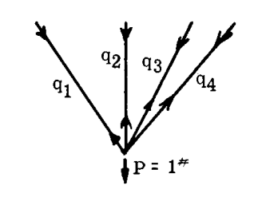
**Fig. A8.38 例題における一般化力番号付けスキーム。 $q_3$  と  $q_4$  が余剰力として選択されている。**

$$
[a_{ij}] = \frac{1}{E} \left[\begin{array}{cccc} 432 & 0 & 0 & 0 \\ 0 & 720 & 0 & 0 \\ 0 & 0 & 402 & 0 \\ 0 & 0 & 0 & 312 \end{array}\right]
$$

$$
[g_{ir}] = \left[\begin{array}{cc} .806 & 1.154 \\ -1.564 & -1.729 \\ 1.0 & 0 \\ 0 & 1.0 \end{array}\right]
$$

いくつかの可能な静定応力分布  $[g_{im}]$  が試される。まず、「切断」された構造（ $q_3 = q_4 = 0$ ）において静力学のみによって得られた応力分布：

$$
\{g_{im}\}_{CUT} = \left\{\begin{array}{c} 0 \\ 1 \\ 0 \\ 0 \end{array}\right\}
$$

(これは明らかに最終的な応力分布に対する貧弱な近似である)。計算すると、

$$
\{a_{rn}\}_{CUT} = [g_{ri}] [a_{ij}] \{g_{jn}\}_{CUT} = \left\{\begin{array}{c} -1126 \\ -1245 \end{array}\right\} \frac{1}{EI}
$$

第二に、 $q_1$  と  $q_3$  に対して 0.40 lbs の荷重が推測された応力分布。(2次不静定構造では、静的平衡を満たしながら任意の2つの力を任意の値に割り当てることができる)。 $q_2$ 、 $q_4$  は静力学によって求められた。したがって、

$$
\{g_{im}\}_{GUESS} = \left\{\begin{array}{c} 0.40 \\ 0.258 \\ 0.40 \\ 0.0672 \end{array}\right\}
$$

計算すると、

$$
\{a_{rn}\}_{GUESS} = \left\{\begin{array}{c} 9.49 \\ -101 \end{array}\right\}
$$

応力分布に対する妥当な推測によって、「切断」構造の使用によって得られたもののわずか10分の1の大きさの非斉次項が得られたことに注目されたい。余剰力の大きさもそれに応じて減少する。  

第三に、興味深い事項として、例題3で得られた真の応力分布を使用した。結果：

$$
\{g_{im}\}_{TRUE} = \left\{\begin{array}{c} .450 \\ .232 \\ .260 \\ .280 \end{array}\right\} ; \{a_{rn}\}_{TRUE} = \left\{\begin{array}{c} .16 \\ -.16 \end{array}\right\} \frac{1}{E}
$$

非斉次項は、本来あるべき姿の通り、実質的にゼロである*。余剰力もまたゼロになるであろう。

---
* ここでの実演は、余剰力計算の最終結果に対する有用なチェックを示唆している。最終的な真の応力  $[G_{im}] (= [G_{jn}])$  を得た後、次を形成し：
$$
[a_{rn}]_{TRUE} = [g_{ri}] [a_{ij}] [G_{jn}]
$$
以前に計算された行列と要素ごとに結果を比較する。
$$
[a_{rn}] = [g_{ri}] [a_{ij}] [g_{jn}]
$$
 $[G_{im}]$  にエラーがなければ、「真の行列」要素はゼロ、あるいはそれに近いはずである。

### 例題 18
ボックス梁、例題 15 の場合において計算精度を高めることが望まれている。その問題の初期データが、精度の向上を正当化するのに十分精密であると仮定される。

**解法:**
最初にとられたステップは、 $q_2$ 、 $q_7$ 、および  $q_{12}$  を余剰力として以前に選択して得られた単位余剰力応力分布の検討であった。3つの単位余剰力応力分布は、Fig. A8.39 のようにグラフで表された。

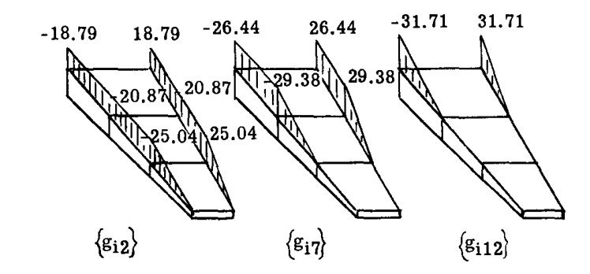
**Fig. A8.39 単位余剰力応力分布 - 軸方向フランジ力。**

図を検討すると、以下の分布の組み合わせによって、「オーバーラップ」がかなり少なくなる可能性が高い新しい分布が得られることが示された。

(1) ----  $1 \times \{g_{i2}\} - \frac{20.87}{29.38} \{g_{i7}\} + 0 \times \{g_{i,12}\}$ 
(2) ----  $0 \times \{g_{i2}\} + 1 \times \{g_{i7}\} - \frac{26.44}{31.71} \{g_{i,12}\}$ 
(3) ----  $0 \times \{g_{i2}\} + 0 \times \{g_{i7}\} + 1 \times \{g_{i,12}\}$ 

行列形式では、変換は：

$$
[g_{i
ho}] = [g_{ir}] \left[\begin{array}{ccc} 1 & 0 & 0 \\ -.7103 & 1 & 0 \\ 0 & -.8330 & 1 \end{array}\right]
$$

以前に計算された  $[g_{ir}]$  を使用して、乗算を行うと次が得られた：

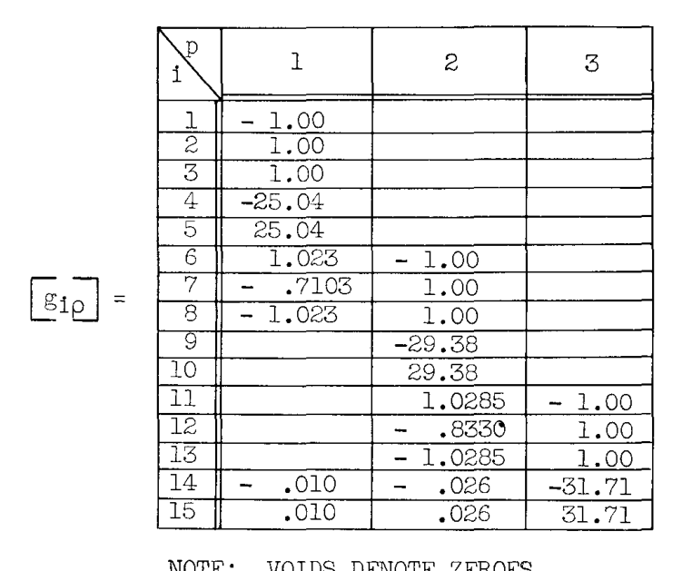

注：空白はゼロを示す。

Fig. A8.39a は、これらの新しい分布のプロットを示しており、これらは「オーバーラップ」が大幅に減少している（Fig. A8.39 と比較）。

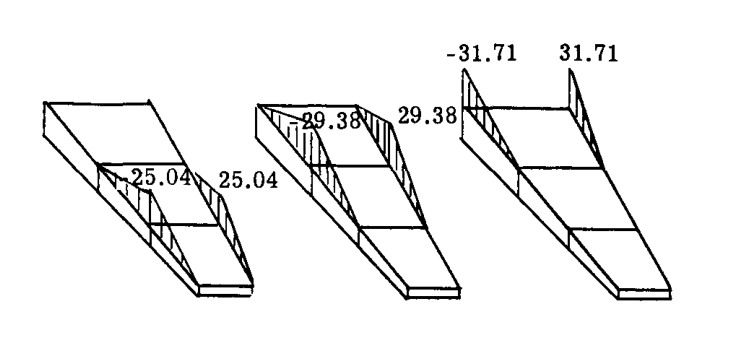
**Fig. A8.39a 新しい単位余剰力応力分布、 $[g_{i
ho}]$ **

新しい余剰力係数行列  $[a_{
ho
ho}]$  は、式(30a)に従って計算することで得られた。

$$
[a_{
ho
ho}] = \frac{10^6}{E} \left[\begin{array}{ccc} .2584 & -.01132 & .0000175 \\ -.01132 & .2566 & -.03124 \\ .0000175 & -.03124 & .1254 \end{array}\right]
$$

この行列は非常によく条件付けられており、もともと例題 15 で見つかった  $[a_{rs}]$ 、すなわち、

$$
[a_{rs}] = \frac{10^6}{E} \left[\begin{array}{ccc} .3774 & .1789 & .0520 \\ .1789 & .2678 & .07322 \\ .0520 & .07322 & .1254 \end{array}\right]
$$

よりも大幅に改善されている。  

余剰力の大きさを減少させるような静定応力分布を選択することが残されていた。この目的のために、単位外部荷重の各適用に対して平衡を満たす応力分布を計算するために、曲げの工学理論が採用された。結果は以下の通りであった（Art. A7.11 の例題 30 を参照）。

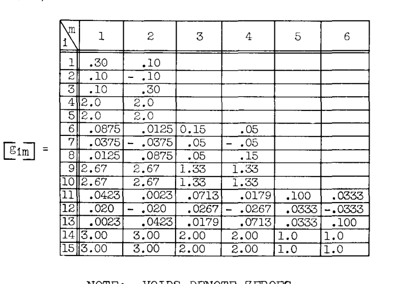

注：空白はゼロを示す。

次に、行列  $[a_{
ho n}]$  が式(30b)に従って計算することによって得られた。

$$
[a_{
ho n}] = \frac{1}{E} \left[\begin{array}{cccccc} 3495 & -3495 & -1841 & 1841 & 0 & 0 \\ 1167 & -1167 & 1554 & -1554 & -1450 & 1450 \\ 1082 & -1082 & 1445 & -1445 & 1802 & -1802 \end{array}\right]
$$

この結果は、以前に得られた  $[a_{rn}]$  と比較して、要素が2分の1から10分の1の大きさであり、非常に良好であった。  

解は、式(31)および(32)の行列  $[g_{i
ho}]$ 、 $[a_{
ho
ho}]$ 、 $[g_{im}]$ 、および  $[a_{
ho n}]$  を使用して、「 $\rho, σ$  システム」で完了させることができる。

## A8.13 行列法による熱応力計算

熱応力問題は、上記で提示された手法の拡張により、行列表記で便利に定式化される。  

まず、式(21)を次の形式で考える。

$$
[a_{rs}] \{q_s\} + [a_{rn}] \{P_n\} = 0
$$

 $[a_{rs}]$  および  $[a_{rn}]$  に与えられた物理的解釈に照らして、この方程式は、余剰切断部における連続性の条件を行列形式で述べたものであることがわかる。すなわち、余剰力によって引き起こされた各切断部における変位に、外部荷重によって引き起こされた各切断部における変位を加えたものは、ゼロに等しくなければならない。熱応力のためにこの方程式を修正するには、熱変位に対する適切な式を各切断部に追加する必要がある。Art. A8.9 で使用された議論に従って、次のように書く：

$$
\{\delta_{rT}\} + [a_{rs}] \{q_s\} + [a_{rn}] \{P_n\} = 0
$$

ここで  $\delta_{rT}$  は、静定構造における熱歪みによる  $r$  番目の切断部での変位である。この項の明示的な形式は以下で導出される。書き直すと、

$$
[a_{rs}] \{q_s\} = - [a_{rn}] \{P_n\} - \{\delta_{rT}\} \quad \dots \dots \dots (33)
$$

式(33)は式(21)の修正形であり、外部荷重と温度分布の両方の適用下にある不静定構造における余剰力をその解として与える。  

 $\delta_{rT}$  の明示的な式を導出するために、仮想仕事の概念を有利に用いることができる。したがって、たわみのための「仮想仕事」導出（Art. A7.7, A7.8）の議論に従うと、 $r$  番目の余剰切断部における熱たわみは、熱歪みによって引き起こされた歪みを通じて移動する、 $r$  番目の余剰力仮想応力（単位  $r$  番目の余剰力による）によって行われる内部仮想仕事の合計に等しくなければならない。  

内部応力分布は内部一般化力  $q_i, q_j$  で表されるので、歪みの仮想仕事を記述する際にこれらの  $q$  を用いるのが便利である。 $\Delta_{iT}$  を熱歪みによる内部一般化力  $q_i$  の変位とすると、単一の一般化力による仮想仕事は  $q_i \Delta_{iT}$  である。量  $\Delta_{iT}$  は、**部材の熱歪み**と呼ばれる。構造全体にわたる総仮想仕事は合計することによって得られ、行列積として  $r$  番目の切断部におけるたわみを与える：

$$
\delta_{rT} = \sum g_{ri} \Delta_{iT} \quad \dots \dots \dots (34)
$$

ここで  $g_{ri}$  は、切断部  $r$  における単位（仮想）荷重による  $q_i$  の値である。項  $\Delta_{iT}$  は、複数の寄与の合計からなる場合がある（ $q_i$  が複数の部材に作用する場合）。  

 $\delta_{rT}$  は各余剰切断部で求められるため、式(34)は次のように書くことで拡張される：

$$
\{\delta_{rT}\} = [g_{ri}] \{\Delta_{iT}\} \quad \dots \dots \dots (35)
$$

 $[g_{ri}]$  はもちろん、静定構造における単位余剰力応力分布  $[g_{ir}]$  の転置である。式(35)を式(33)に代入すると、次が得られる：

$$
[a_{rs}] \{q_s\} = - [a_{rn}] \{P_n\} - [g_{ri}] \{\Delta_{iT}\} \quad \dots \dots \dots (36)
$$

式(36)の解は余剰力  $q_s$  の値を与え、その後、問題は通常通りに完了させることができる、すなわち：

$$
\{q_i\} = [G_{im}] \{P_m\} + [g_{ir}] \{q_r\}^*
$$

余剰力の組み合わせ（Art. A8.12 の " $\rho, σ$ " システム）の使用が可能であることは明らかである。式(36)において、 $[g_{ir}]$  の代わりに  $[g_{i
ho}]$ 、 $[a_{rn}]$  の代わりに  $[a_{
ho n}]$  などを直接代入する。

### 部材の熱歪み

残るのは  $\Delta_{iT}$  の形式を確立することである。  
均質材料の微小要素における熱歪みは、一様な法線方向の伸びのみを引き起こし、せん断歪みは発生しない。したがって、内部仮想仕事の計算において、法線方向（せん断方向ではなく）の仮想応力のみを考慮すればよい。曲げに関連する法線応力も含める必要があることに注意されたい。したがって、軸荷重のかかった棒や曲げを受ける梁においてのみ、仮想仕事を考慮すればよい。したがって、パネル上のせん断流やシャフト上のトルクであるすべての  $q_i$  に対して、 $\Delta_{iT}$  はゼロである。

#### 棒 (BARS)
変化する温度  $T$  下の棒における仮想軸荷重  $u$  によって行われる仮想仕事の一般的な式は：

$$
W = \int u \cdot \alpha T dx
$$

ここで  $\alpha$  は材料の熱膨張係数である。

---
* 機械荷重  $P_n$  がゼロの場合の式(36)の解を  $q_{ST}$  と指定すると、そのような場合の応力は純粋に「熱的」なものとなり、後で便利である。

いくつかの具体的なケースをここで扱う。  
線形に変化する荷重と線形に変化する温度を受ける棒を Fig. A8.40 に示す。  
この場合、

$$
u = q_j + \frac{q_i - q_j}{L} x
$$

$$
T = T_j + \frac{T_i - T_j}{L} x
$$

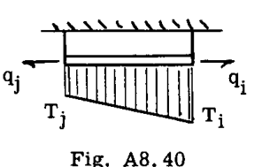
**Fig. A8.40**

 $\\alpha$  が一定であると仮定すると、

$$
W = \alpha \int_0^L \left( q_j + \frac{q_i - q_j}{L} x \right) \left( T_j + \frac{T_i - T_j}{L} x \right) dx
$$

$$
= \alpha L \frac{2T_i + T_j}{6} q_i + \alpha L \frac{T_i + 2T_j}{6} q_j
$$

この式は次の形式に置くことができる：

$$
W = q_i \Delta_{iT} + q_j \Delta_{jT}
$$

ここで、

$$
\Delta_{iT} = \alpha L \frac{2T_i + T_j}{6}
$$

$$
\Delta_{jT} = \alpha L \frac{T_i + 2T_j}{6}
$$

棒の断面積の変化は歪み  $\Delta_{iT}, \Delta_{jT}$  に影響を与えないことに注意されたい。  
変化する軸荷重下の棒に対する一般化力の別の選択を Fig. A8.41 に示す。上記と同様の導出により、次が得られる：

$$
W = q_i \Delta_{iT} + q_j \Delta_{jT}
$$

ここで、

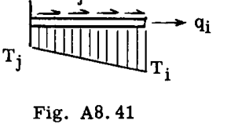
**Fig. A8.41**

$$
\Delta_{iT} = \alpha L \frac{T_i + T_j}{2}
$$

$$
\Delta_{jT} = \alpha L^2 \frac{T_i + 2T_j}{6}
$$

一様荷重（ $q_i = u = \text{constant}$ ）および一様温度（ $T_i = T_j = T$ ）のより単純なケースは、上記の形式の特殊化によって直ちに従う。例えば、一定荷重  $q_i = q_j$  および一定温度  $T_i = T_j = T$  の棒の場合、 $\Delta_{iT} = \alpha LT$  となる。

#### 梁 (BEAMS)
梁の場合、梁の深さ方向に線形に変化する上面と底面の温度差  $\delta T$  による熱歪み中に行われる仮想仕事の一般式は次式のとおりである（Art. A7.8, 例題 24 参照）。

$$
W = \alpha \int m \cdot \frac{\delta T dx}{h}
$$

ここで、
 $m = \text{仮想モーメント（上面の圧縮を正とする）}$ 
 $\delta T = T_{BOTTOM} - T_{TOP}$ 
 $h = \text{梁の深さ}$ 

Fig. A8.42 のケースに適用すると次が得られる：

$$
W = \frac{\alpha}{h} \int_0^L \left( q_j + \frac{q_i - q_j}{L} x \right) \left( \delta T_j + \frac{\delta T_i - \delta T_j}{L} x \right) dx
$$

$$
= \frac{\alpha L}{h} \left( \frac{2\delta T_i + \delta T_j}{6} \right) q_i + \frac{\alpha L}{h} \left( \frac{\delta T_i + 2\delta T_j}{6} \right) q_j
$$

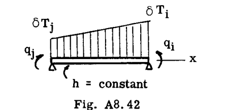
**Fig. A8.42**

または、

$$
W = q_i \Delta_{iT} + q_j \Delta_{jT}
$$

ここで、

$$
\Delta_{iT} = \frac{\alpha L}{h} \left( \frac{2\delta T_i + \delta T_j}{6} \right)
$$

$$
\Delta_{jT} = \frac{\alpha L}{h} \left( \frac{\delta T_i + 2\delta T_j}{6} \right)
$$

変化する深さの梁に対する熱歪み式の特別な形式は、必要に応じて容易に導出できる。

### 例題 19
Fig. A8.43 の梁の上面は、下面の温度よりも  $\delta T$  だけ高い温度にさらされており、図のように線形に変化している（すなわち、温度は左端で等しく、右端で  $\delta T_e$  だけ異なる）。 $\alpha$  を一定と仮定して、中央の反力を求めよ。

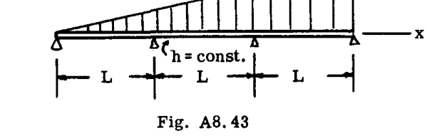
**Fig. A8.43**

**解法:**
Art. A8.12 の例示的な例において、この構造は、中央支点上の曲げモーメント  $q_1$  および  $q_2$  を一般化内部力として採用することによって解析された（Fig. A8.35 参照）。2つの中央反力は  $q_3$  と  $q_4$  で示された。余剰力として  $q_1$  と  $q_2$  を考慮した余剰係数の行列（より良い選択であることを思い出してほしい）は以下の通りであった（Art. A8.12 参照）。

$$
[a_{rs}] = \frac{L}{6EI} \left[\begin{array}{cc} 4 & 1 \\ 1 & 4 \end{array}\right]
$$

 $q_1 = 1$  および  $q_2 = 1$  に対する単位余剰荷重分布は次のように得られた：

$$
[g_{ir}] = \left[\begin{array}{cc} 1 & 0 \\ 0 & 1 \\ -\frac{2}{L} & \frac{1}{L} \\ \frac{1}{L} & -\frac{2}{L} \end{array}\right]
$$

部材の熱歪みが計算された。（以前に採用された慣例に従って、 $\delta T$  は負であったことに注意）。

$$
\Delta_{1T} = \frac{\alpha L}{h} (-) \frac{2 \times \frac{1}{3} \delta T_e}{6} + \frac{\alpha L}{h} (-) \left( \frac{\frac{2}{3} \delta T_e + 2 \times \frac{1}{3} \delta T_e}{6} \right)
$$

$$
= - \frac{\alpha L}{3h} \delta T_e
$$

$$
\Delta_{2T} = \frac{\alpha L}{h} (-) \left( \frac{2 \times \frac{2}{3} \delta T_e + \frac{1}{3} \delta T_e}{6} \right) + \frac{\alpha L}{h} (-) \left( \frac{\delta T_e + 2 \times \frac{2}{3} \delta T_e}{6} \right)
$$

$$
= - \frac{2}{3} \frac{\alpha L}{h} \delta T_e
$$

次に、式(36)から：

$$
\frac{L}{6EI} \left[\begin{array}{cc} 4 & 1 \\ 1 & 4 \end{array}\right] \left\{\begin{array}{c} q_1 \\ q_2 \end{array}\right\} = (-) \left[\begin{array}{cc} 1 & 0 \\ 0 & 1 \\ -\frac{2}{L} & \frac{1}{L} \\ \frac{1}{L} & -\frac{2}{L} \end{array}\right]^T \left\{\begin{array}{c} - \frac{\alpha L \delta T_e}{3h} \\ - \frac{2\alpha L \delta T_e}{3h} \\ 0 \\ 0 \end{array}\right\}
$$

$$
\left[\begin{array}{cc} 4 & 1 \\ 1 & 4 \end{array}\right] \left\{\begin{array}{c} q_1 \\ q_2 \end{array}\right\} = \frac{2EI \alpha \delta T_e}{h} \left\{\begin{array}{c} 1 \\ 2 \end{array}\right\}
$$

これを解くと：

$$
\left\{\begin{array}{c} q_1 \\ q_2 \end{array}\right\} = \frac{EI \alpha \delta T_e}{h} \left\{\begin{array}{c} .267 \\ .933 \end{array}\right\}
$$

最終的な応力分布は：

$$
\{q_i\} = [g_{im}] \{P_m\} + [g_{ir}] \{q_r\}
$$

$$
= 0 + \frac{EI \alpha \delta T_e}{h} \left[\begin{array}{cc} 1 & 0 \\ 0 & 1 \\ -\frac{2}{L} & \frac{1}{L} \\ \frac{1}{L} & -\frac{2}{L} \end{array}\right] \left\{\begin{array}{c} .267 \\ .933 \end{array}\right\}
$$

$$
\{q_i\} = \frac{EI \alpha \delta T_e}{h} \left\{\begin{array}{c} .267 \\ .933 \\ .399/L \\ -1.60/L \end{array}\right\}
$$

したがって、反力は：

$$
q_3 = .399 \frac{EI \alpha \delta T_e}{Lh}
$$

$$
q_4 = -1.60 \frac{EI \alpha \delta T_e}{Lh} \text{（負は下向きを示す）}
$$

### 例題 20
Fig. A8.44(a) の対称なシートストリンガーパネルを、2つの外側ストリンガーを中央のストリンガーより一様な温度  $T$  だけ高く加熱することによって生じる熱応力について解析する。 $G = 0.385E$  と仮定する。

**解法:**
パネルは便宜上、3つのベイに分割された。一般化力の番号付けと配置は Fig. A8.44(b) に示されている。横方向部材（リブ、図には示されていない）は、自身の平面内で剛であると見なされた。これは対称パネルに対して満足のいく仮定である。対称性のため、パネルの半分のみが処理された。すべての部材柔軟性係数と熱歪みは、適切な場合には2倍にされた。  
柔軟性係数の行列は次のように設定された（空白はゼロを示す）：

$$
[a_{ij}] = \frac{1}{E} \left[ \text{Matrix in PDF} \right]
$$

部材熱歪みの行列は以下の通りであった：

$$
\{\Delta_{iT}\} = \alpha T \left\{\begin{array}{c} 40 \\ 40 \\ 20 \\ 0 \\ 0 \\ 0 \\ 0 \\ 0 \\ 0 \end{array}\right\}
$$

ここで、例えば  $\Delta_{1T} = 2 \times 2 \times 10 = 40$  である（ $q_1$  が2つのストリンガー端に作用するため2倍にされ、パネルのもう半分を考慮するためさらに2倍にされた）。

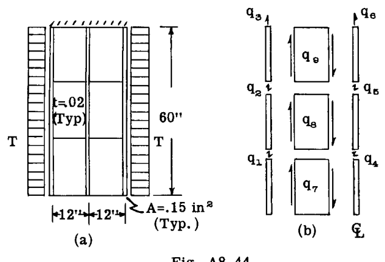
**Fig. A8.44**

構造は3次不静定であった。ストリンガー荷重  $q_4, q_5, q_6$  が余剰力として選択された。Fig. A8.45 は、 $q_4 = 1, q_5 = 1, q_6 = 1$  に対する単位余剰荷重スケッチを示している。

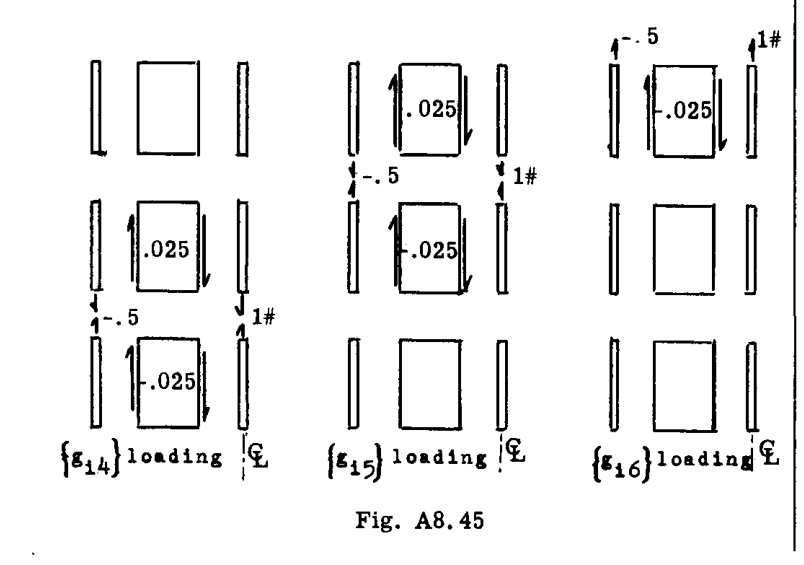
**Fig. A8.45**

次に、

$$
[g_{ir}] = \left[ \text{Matrix in PDF} \right]
$$

式(18)に従って計算すると、

$$
[a_{rs}] = \frac{1}{E} \left[\begin{array}{ccc} 211.2 & -5.7 & 0 \\ -5.7 & 211.2 & -5.7 \\ 0 & -5.7 & 105.6 \end{array}\right]
$$

そして、

$$
[g_{ri}] \{\Delta_{iT}\} = \alpha T \left\{\begin{array}{c} -20 \\ -20 \\ -10 \end{array}\right\}
$$

次に、式(36)による余剰方程式は以下の通りであった：

$$
\frac{1}{E} \left[\begin{array}{ccc} 211.2 & -5.7 & 0 \\ -5.7 & 211.2 & -5.7 \\ 0 & -5.7 & 105.6 \end{array}\right] \left\{\begin{array}{c} q_4 \\ q_5 \\ q_6 \end{array}\right\} = 10 \alpha T \left\{\begin{array}{c} 2 \\ 2 \\ 1 \end{array}\right\}
$$

解くと、

$$
\{q_{rT}\} = \alpha TE \left\{\begin{array}{c} 0.0974 \\ 0.100 \\ 0.100 \end{array}\right\}
$$

最後に、完全な熱応力分布は：

$$
\{q_{iT}\} = [g_{ir}] \{q_{rT}\} = \alpha T E \times 10^{-3} \left\{\begin{array}{c} -48.7 \\ -50.0 \\ -50.0 \\ 97.4 \\ 100.0 \\ 100.0 \\ -2.44 \\ -0.065 \\ 0 \end{array}\right\}
$$