# A8.38 静定不定構造物

この結果は、ストリンガー荷重に関する限り、同じ仮定の下で行われた「正確な」解（ref. NACA TN 2240）と良好に一致している。せん断流の結果は、主としてこの解析で使用された「ベイ（区間）」が少なすぎたことが原因で、あまり満足のいくものではない。

## 例題 21
図 A8.46a の均一な4フランジ・ボックス梁について、一方のフランジを他の3つのフランジよりも高い温度  $T$ （スパン方向に均一）に加熱したときに発生する熱応力を解析せよ。

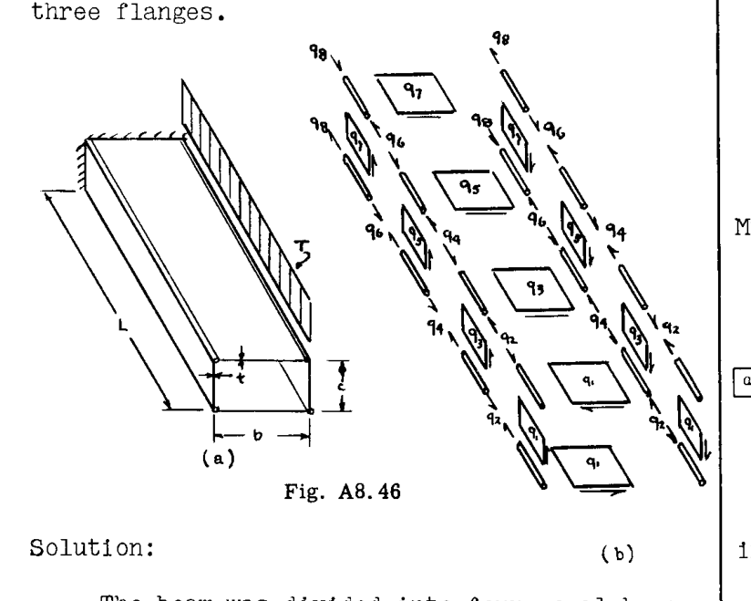

**解：**

梁は4つの等しいベイに分割され、4次の冗長問題となる。4つの自己平衡（合力ゼロ）な独立した応力分布が未知数として採用され、これらは図 A8.46(b) に示されている。このような合力ゼロの応力分布は、外部荷重が印加されていない構造物においてのみ可能である。*

部材の柔軟性係数行列は、いくつかの部材からの係数を収集することによって形成された。単位冗長応力分布が用意され、  $q_1$ 、  $q_3$ 、  $q_5$ 、  $q_7$  を冗長力として取り、これらを順次1に等しく設定した。

![[a_{ij}] 柔軟性係数行列](p1_table_01.png)

ここで  $k^2 = Gt / AE (b + c)$  である。

\* 外部荷重が印加されないため、静力学から、隣接するウェブとカバーシートの一般化力は等しく、任意のステーションにおける前後のスパーキャップの荷重も等しいことになる。したがって、一般化力の体系において番号付けの簡略化が可能である。荷重が等しいことがわかっている複数の部材に同じ記号を用いることができるため、データ処理の手間が大幅に省ける。

式(18)に従って掛け合わせると、

![[g_{1r}] 行列](p1_table_02.png)

特定のケースとして  $k^2 L^2 = 1$  とすると、逆行列は次のように計算された。

![[a_{rs}] 逆行列](p1_table_03.png)

部材の熱変形（  $\Delta_{iT}$  ）は、荷重  $q_2$ 、  $q_4$ 、  $q_6$ 、  $q_8$  に対して計算され、加熱された1つのフランジのみから収集された。

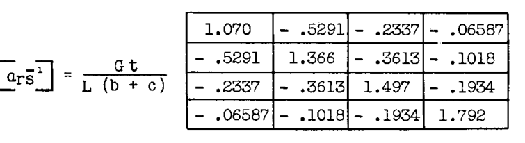

（注：隣接する2つのフランジが等しく加熱される場合、対応する  $\Delta_{iT}$  をゼロに設定しなければならない。これは、隣接するフランジの仮想荷重が反対の符号を持ち、仮想仕事が相殺される必要があるためである）。

掛け合わせると：

![[g_{r1}]{\Delta_{iT}} 結果](p1_table_05.png)

次に、式(36)への解は次のように書かれた。

$$
\{q_{sT}\} = - [a_{rs}^{-1}] [g_{r1}] \{\Delta_{iT}\}
$$

これを掛け合わせると次が得られた。

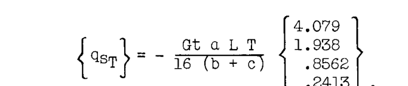

最後に、熱応力の完全なセットは以下の通りであった（引き続き  $k^2 L^2 = 1$  のケース）。

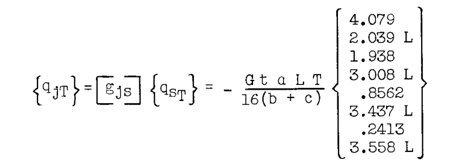

この結果は、フランジ応力に関する限り、正確な解（NACA TN 2240）と良好に一致しており、根元での誤差は1パーセント未満である。シート内のせん断流の値は、各梁の4分の1におけるせん断が一定であるという（比較的）粗い仮定のため、それほど満足のいくものではない。

# A8.14 行列法による熱変形

## A. 静定構造物
静定構造物の熱変形の問題は、以前に Art. A7.8 で非行列形式で検討された。冗長力を切断した熱変形の計算のために提示された行列法は、静定構造物の外点の熱変形を計算する問題にも同様に適用できることが、導出から明らかであるはずである。
したがって、

$$
\{\delta_{mT}\} = [G_{m1}] \{\Delta_{iT}\} \quad \text{--- (37)}
$$

ここで  $\delta_{mT}$  は外点  $m$  の熱変形であり、  $[G_{m1}]$  は単位荷重応力分布  $[G_{1m}]$  の転置である（式 35 と比較）。

## B. 冗長構造物
冗長構造物の場合、発生する熱応力により追加の歪みが存在する。これらの歪みが外点の変形に与える影響を計算に含めなければならない。
適切な方程式は、その作用を2つの段階で視覚化することによって最も簡単に導き出される。第一に、冗長構造物を「切断」して静定にし、その後、温度分布を適用して熱変形を発生させる。

$$
\{\delta_{mT1}\} = [g_{m1}] \{\Delta_{iT}\}
$$

これは外点におけるものである（式 35 および 37 と比較）。同時に、冗長な切断部は相対変位を経験する。
第二に、冗長力を加えることによって冗長な切断部をゼロ変位に復元する（この問題は Art. A8.13 で解決された）。  $q_s$  は式(36)によって与えられる。これらは点  $m$  に追加の変形を生じさせる。

$$
\{\delta_{mT2}\} = [g_{ms}] \{q_{sT}\}
$$

点  $m$  の全変形は次のようになる。

$$
\{\delta_{mT}\} = [g_{m1}] \{\Delta_{iT}\} + [g_{ms}] \{q_{sT}\}
$$

しかし、

$$
[g_{ms}] = [g_{mi}] [a_{ij}] [g_{js}]
$$

したがって、

$$
\{\delta_{mT}\} = [g_{m1}] \{\Delta_{iT}\} + [g_{mi}] [a_{ij}] [g_{js}] \{q_{sT}\}
$$

あるいは、

$$
\{\delta_{mT}\} = [g_{m1}] \left( \{\Delta_{iT}\} + [a_{ij}] \{q_{jT}\} \right) \quad \text{--- (38)}
$$

括弧内の行列量は、全歪み（熱歪みプラス「力学的」歪み）である。
明確な理由により、熱変形の方程式は、式(36)からの代入によって得られる可能性のあるより洗練された形式ではなく、式(38)の形式で残されている。第一に、熱応力  $q_{jT}$  は、おそらく以前に解かれており、明示的な形式ですぐに利用可能である。第二に、そして労働節約の観点からはるかに重要なことに、式(38)で使用される単位荷重分布  $[g_{im}]$  （その転置が使用される）は、「切断」構造物における静力学を満足する任意の都合の良い応力分布でよい。冗長な熱応力計算で採用されたのと同じ  $[g_{im}]$  分布（および同じ「切断」の選択）を使用する必要さえない。より都合の良い切断の選択を採用してもよい。原理的には、式(38)の単位荷重に対して静力学的に等価な任意の応力分布を  $[g_{im}]$  に使用することができる（p. A8.9 参照）。

## 例題 22
図 A8.43 の梁の右端で発生する回転を計算せよ。

**解：**
回転を計算するために、右端に単位偶力（反時計回りを正とする）を適用した。追加の一般化力  $q_5$  もその点に追加された。すると、

$$
\Delta_{5T} = \frac{\alpha L}{h} (-) \left( \frac{\frac{2}{3} \delta T_o + 2 \delta T_o}{6} \right) = \frac{-4 \alpha L \delta T_o}{9h}
$$

そして、例題 19 のいくつかの結果を用いると、

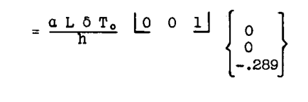

 $i = 1, 2, 5$  である。
中間支点反力である  $q_3$  と  $q_4$  は考慮から外されていることに注意。それらは構造物の内部仮想仕事の式に入ってこない。あるいは同様に、それらは構造物の歪みエネルギーを記述するために使用されない。したがって、全歪みを記述する際には含まれない。（それらの  $\Delta_{iT}$  はゼロである）。

部材柔軟性係数行列は以下の通りであった。

![[a_{ij}] 行列 Ex 22](p3_table_02.png)

例題 19 より、真の熱応力分布は以下の通りであった。

$$
\{q_1\} = \frac{EI \alpha \delta T_o}{h} \begin{Bmatrix} .267 \\ .933 \\ 0 \end{Bmatrix} \quad i = 1, 2, 5
$$

（  $q_6$  は観察によりゼロであった）。
 $[g_{im}]$  を決定するために、単位偶力  $q_5 = 1$  が適用された。「切断」構造物として  $q_1 = q_2 = 0$  のものを取ると、単純に次が得られる。

$$
\{g_{im}\} = \begin{Bmatrix} 0 \\ 0 \\ 1 \end{Bmatrix}; \quad [g_{m1}] = \begin{bmatrix} 0 & 0 & 1 \end{bmatrix}
$$

次に式(38)に代入すると、

$$
\{\delta_{mT}\} = \begin{bmatrix} 0 & 0 & 1 \end{bmatrix} \left( \frac{\alpha L \delta T_o}{9h} \begin{Bmatrix} 3 \\ 6 \\ 4 \end{Bmatrix} + \frac{L}{6EI} \begin{bmatrix} 4 & 1 & 0 \\ 1 & 4 & 1 \\ 0 & 1 & 2 \end{bmatrix} \frac{EI \alpha \delta T_o}{h} \begin{Bmatrix} .267 \\ .933 \\ 0 \end{Bmatrix} \right)
$$

$$
= \frac{\alpha L \delta T_o}{h} \begin{bmatrix} 0 & 0 & 1 \end{bmatrix} \begin{Bmatrix} 0 \\ 0 \\ -.289 \end{Bmatrix}
$$

$$
\delta_T = -.289 \frac{\alpha L \delta T_o}{h}
$$

上記  $[g_{im}]$  において、冗長モーメント  $q_1$ 、  $q_2$  の値は、結果に影響を与えることなく任意に選べたことが明らかである。ここでは明らかに、想定される任意の「切断」構造物に対する  $\{g_{im}\}$  は同じ結果をもたらし、すべての場合において  $q_5$  は1に等しくなる。

## 例題 23
図 A8.44 のパネルの中央ストリンガーの自由端の軸方向移動を計算せよ。

**解：**
追加の一般化力  $q_{10}$  が、中央ストリンガーの自由端に軸方向に加えられた（図 A8.44b 参照）。すると、

![[a_{ij}] 例題 23 用の大型行列](p3_table_03.png)

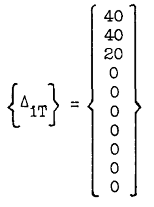

例題 20 で得られた  $q_{jT}$  を使用して（  $q_{10} = 0$  として）、次の積が形成された。

![[a_{ij}]{q_{jT}} の計算結果](p3_table_05.png)

次に、式(38)に代入すると、

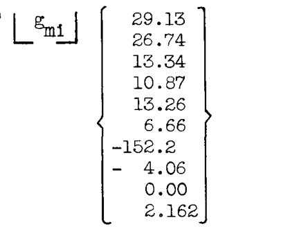

 $q_{10} = 1$  に対する静定応力分布を見つけることが残っている。
静定分布  $\{g_{im}\}$  として、  $q_1 = q_2 = q_3 = 0$  のときに得られる「切断」構造物で、単位荷重  $q_{10} = 1$  による応力を計算した。（これは例題 20 で熱応力を計算する際に採用された冗長切断とは異なる選択であることに注意）。したがって、

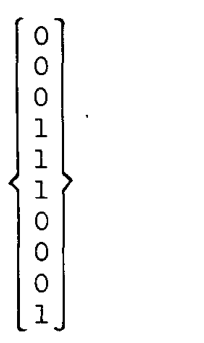

そして最後に、

$$
\delta_{mT} = \alpha T \begin{bmatrix} 0 & 0 & 0 & 1 & 1 & 1 & 0 & 0 & 0 & 1 \end{bmatrix} \begin{Bmatrix} 29.13 \\ 26.74 \\ 13.34 \\ 10.87 \\ 13.26 \\ 6.66 \\ -152.2 \\ 4.06 \\ 0.00 \\ 2.162 \end{Bmatrix}
$$

$$
= 33.0 \alpha T \quad (\text{回答})
$$

興味深いことに、異なる「切断」の選択を用いて、別の単位応力分布が採用された。力  $q_4$ 、  $q_5$ 、  $q_6$  をゼロに設定した場合（「切断」）、単位荷重  $q_{10} = 1$  を加えると次が得られる（転置  $[g_{m1}]$  を記述）。

$$
[g_{m1}] = \begin{bmatrix} .50 & .50 & .50 & 0 & 0 & 0 & .025 & 0 & 0 & 1 \end{bmatrix}
$$

次に熱変形を掛け合わせると：
 $\delta_{mT} = 33.0 \alpha T$  （同じ回答）。

上記の結果から、  $[g_{im}]$  を計算するには最も単純な静定（「切断」）構造物を使用すべきであることが明らかである。それは完全に適切である。

# 結言 (CLOSURE)
一般的な熱応力問題は、材料特性  $E$ 、  $G$ 、  $\alpha$  が温度とともに変化するという事実によって複雑になる。それによって生じる問題は、主に帳簿付けの問題、つまり、温度によって特性が点ごとに異なる構造物に対して、部材柔軟性係数（  $a_{ij}$  ）と部材熱変形（  $\Delta_{iT}$  ）を計算することである。  $E$ 、  $G$ 、  $\alpha$  の温度  $T$  による変化は、当然、試験データから既知である必要がある。

ここでは考慮されていない2つの追加の複雑な要因は、加熱による降伏点の低下（およびそれに伴う非弾性歪み発生の可能性の増加）と「クリープ」現象（定常荷重下での非弾性歪みの時間依存の発達）である。

複数の温度分布に対して熱応力を解析する必要がある場合、部材熱変形行列  $\{\Delta_{iT}\}$  は次のような矩形形式に簡単に一般化できる。

![[a_{1R}] 一般化行列](p4_table_03.png)

ここで  $\Delta_{iR}$  は、熱荷重条件  $R$  による力  $q_i$  に関連付けられた部材熱変形である。部材熱係数の行列  $[C_{ij}]$  は、以前に提示された  $\Delta_{iT}$  の式の中の定数係数で構成され、  $T_{jR}$  は条件  $R$  における  $q_j$  に関連付けられた温度である。（式(26b)、Art. A7.11 と比較）。

# AS.15 問題
注：以下の問題(1)から(9)は、最小仕事の原理またはダミー単位荷重法のいずれによっても解くことができる。学生は比較のために両方の方法でいくつかの問題を解いてみることが推奨される。

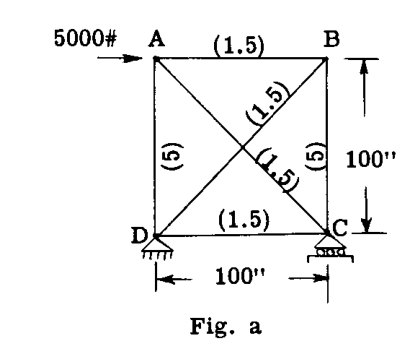

(1) 図(a)に示す荷重を受けたトラスのすべての部材の荷重を決定せよ。部材上の括弧 ( ) 内の数値は、その部材の断面積（sq. in.）を表す。すべての部材は同一材料である。

(2) 図(b)の構造物について、点 B における 700# の荷重に対する各部材の荷重を決定せよ。部材の面積は各部材の ( ) 内の数値で与えられている。すべての部材は同一材料で作られている。

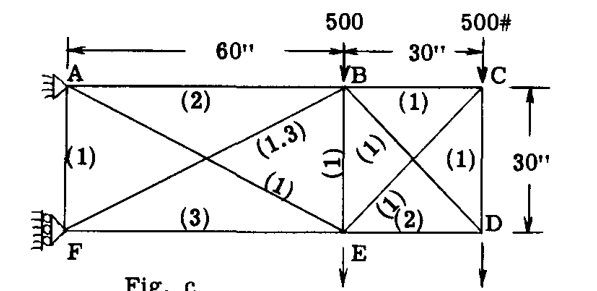

(3) 図(c)の荷重を受けたトラスについて、すべての部材の軸荷重を決定せよ。部材に隣接する括弧内の数値は相対的な面積を表す。  $E$  はすべての部材で一定である。

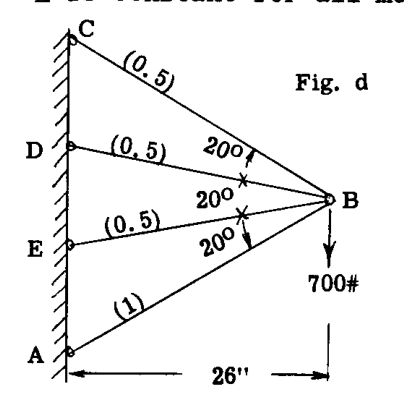

(4) 図(d)の構造物について、すべての部材の軸荷重を計算せよ。部材に隣接する括弧内の数値は相対的な面積を表す。  $E$  は一定であるか、すべての部材で同じである。

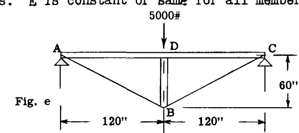

(5) 図(e)の「キングポスト」トラスについて、部材 BD の荷重を計算せよ。部材 AB、BC、BD の面積は各 2 sq. in. である。連続部材 ADC の面積は 9.25 sq. in. で、慣性モーメントは 216 in $^4$  である。  $E$  はすべての部材で同じである。

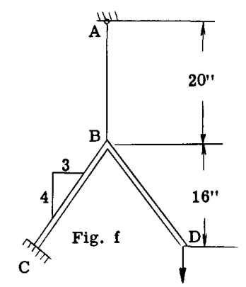

(6) 図(f)において、AB は断面積 0.50 sq. in. の鋼線である。鋼製アングルフレーム CBD は 4 in. 四方の断面を持つ。部材 AB の荷重を決定せよ。  $E = 30,000,000$  psi である。

(7) 図(g)において、2本のタイロッド BD と CE の荷重を求めよ。  $I_{ac} = 72$  in $^4$ ;  $A_{bd} = 0.05$  sq. in.;  $A_{ce} = 0.15$  sq. in. である。  $E$  はすべての部材で同じである。

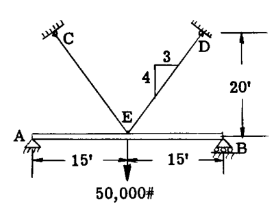

(8) 図(h)の構造物について、点 A、B における反力を決定せよ。部材 CE と ED は面積 1 sq. in. の鋼製タイロッドである。部材 AB は 12" x 12" 断面の木製梁である。  $E_{\text{steel}} = 30,000,000$  psi,  $E_{\text{wood}} = 1,300,000$  psi である。

(9) 図(i)の構造物について、各部材の軸荷重、曲げモーメント、およびせん断力を決定せよ。構造物は点 D で連続している。部材 AB、BC はワイヤーである。部材の面積は AB = 1.2, BC = 0.6; CD = 6.0; BDE = 10.0 である。慣性モーメントは部材 CD = 60.0 in $^4$ ; BDE = 140 in $^4$  である。

(10) p. A8.15 の例題 10 を、一端の2つの拘束（モーメントと横力）を冗長力として使用して再試行せよ。この方法で解くと、構造物の対称性が利用されないため、問題は2次冗長となる。

(11) 図 A7.85（第 A-7 章）のトラスに、2つの追加部材、対角線 FB と EC（それぞれの面積 1.0 in $^2$ ）を追加せよ。この影響係数の行列を求めよ。

**答:**

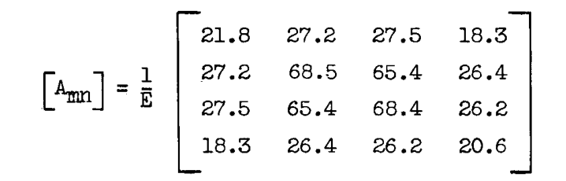

(12) p. A8.3 の例題 B の2次冗長梁を行列法で再試行せよ。冗長反力は "q" 記号で与えられるべきである（p. A8.20 の例題 13a 参照）。

(13) p. A8.12 の例題 5 を行列法で再試行せよ。簡略化のため、一般化力の選択は、例題で X および Y として指定されているものを含めて行い、図 A8.21 および A8.22 を  $g_{1r}$  荷重を与えるために使用できるようにせよ。

(14) 行列法により、パネルに沿って3つの等しいベイ分割（3次冗長）を用いて、p. A8.12 の例題 4 を再試行せよ。p. A8.36 の例題 20 と同じ構造寸法を使用せよ。結果を例題 4 で開発された公式から得られたものと比較せよ。

(15) 行列方程式(21)が、Art. A8.8 の問題に対応するために次のように修正されることを示せ。

$$
[a_{rs}] \{q_s\} = - [a_{rn}] \{P_n\} - [g_{r1}] \{\Delta_1\}
$$

ここで  $\Delta_1$  は力  $q_1$  に関連する初期不整である。Art. A8.8 の式(11)に至る議論を参照せよ。

(16) 上記の問題(15)の方程式を用いて、p. A8.14 の例題 6 を再試行せよ。

(17) 上記の問題(15)の方程式を用いて、p. A8.14 の例題 7 を再試行せよ。

(18) Art. A8.13 の行列法を用いて、p. A8.15 の例題 9 を再試行せよ。

(19) p. A8.24 の例題 15 の二重対称4フランジ・ボックス梁について、一方のフランジが温度 T（スパン方向に均一）に加熱され、構造物の残りの部分は加熱されない場合の冗長応力  $q_2$ 、  $q_7$ 、  $q_{12}$  を決定せよ。

**答:**

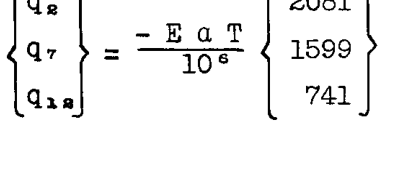

### 参考文献
Chapter A-7 の末尾にある参考文献を参照。

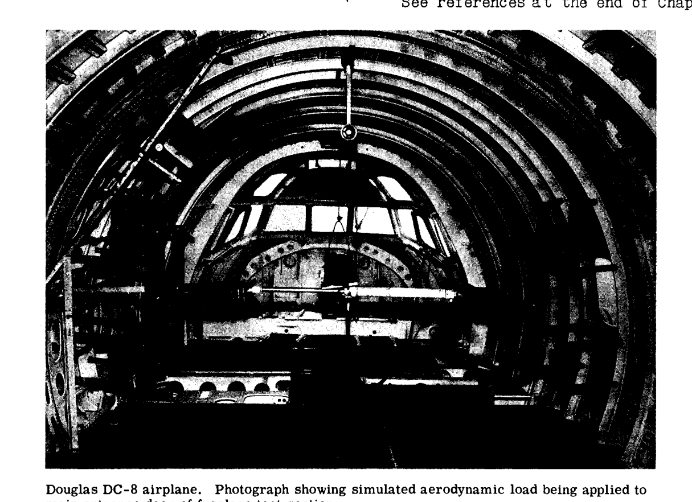

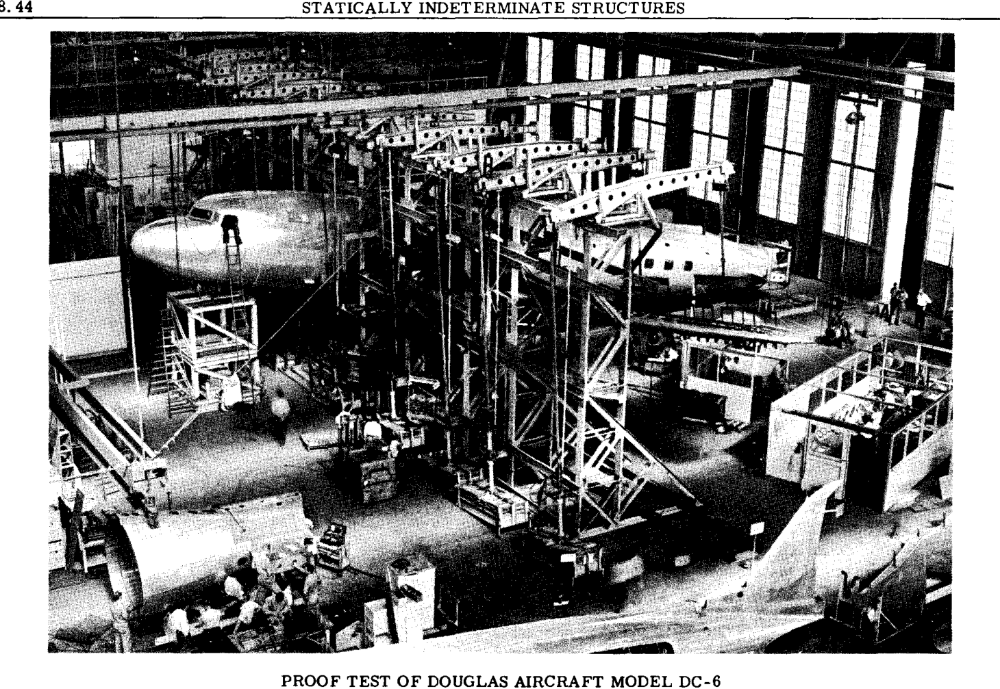

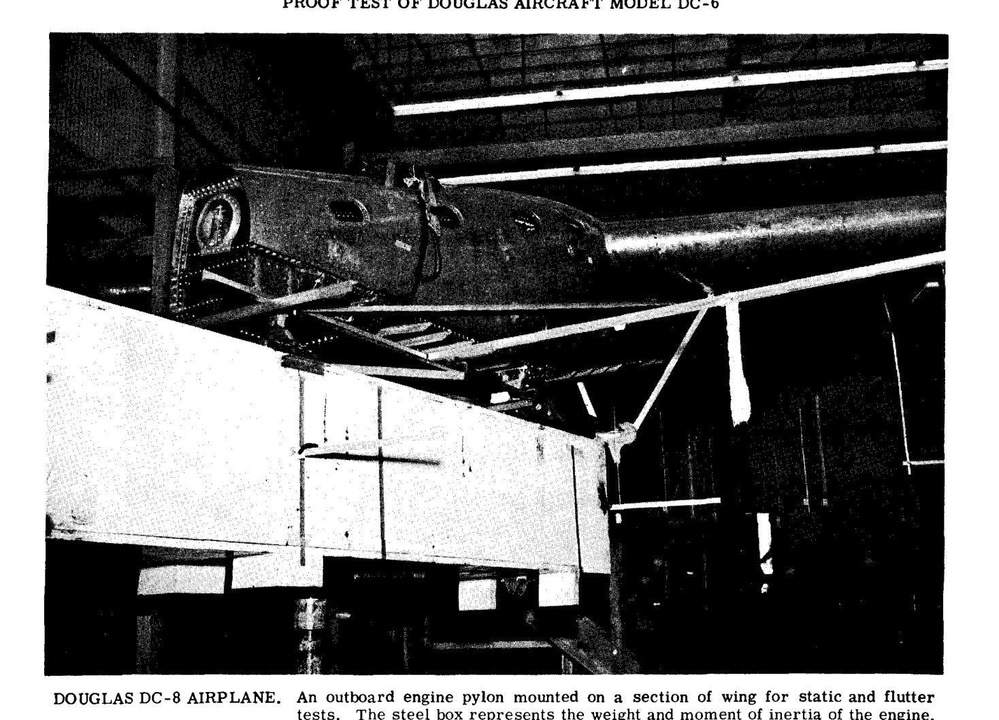