# 第A9章
# 弾性中心法によるフレームとリングの曲げモーメント

## A9.1 はじめに

飛行機の胴体や水上機の船体の内部を観察すると、多数の構造リングや閉じたフレームが見える。いくつかは非常に軽量であり、主に機体の金属外殻の形状を維持し、縦方向の外殻ストリンガーに安定した支持を提供するために使用される。胴体と尾翼、主翼動力装置、着陸装置などの間で大きな荷重集中が転送される箇所では、比較的重いフレームが観察される。船体構造では、底部構造外枠が着陸時の水圧を底部船体フレームに転送し、それがさらに荷重を船体外殻に転送する。

一般に、フレームは、適用された荷重を飛行機本体の他の抵抗部分に転送する際に、これらのフレームまたはリングが曲げ力を受けるような形状および荷重分布特性を持っている。これらの曲げ力は、一般にフレームの強度配分において非常に重要となるフレーム応力を発生させるため、そのような曲げ力の合理的で近似的な計算が必要である。

このようなフレームは、内部抵抗応力に対して静的に不定であるため、内部抵抗力の分布の解を得るためには、断面特性や物理的特性を考慮しなければならない。

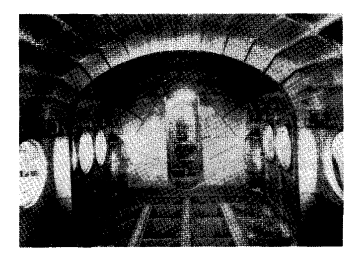

### 一般的な解析方法：

閉じたリングやフレーム、ベントにおける冗長力の解を得るために、連続性の原理を適用する方法は数多くある。著者は、一般に「弾性中心（Elastic Center）」法と呼ばれる方法を好み、長年ルーチンの飛行機設計に使用してきた。この方法は、Muller-Breslauによって考案された。この方法が他のほとんどの解法と異なる主な点は、冗長力がフレームの弾性中心と呼ばれる特殊な点に作用すると仮定することで、冗長力に関する結果の方程式が互いに独立したものになることである。

### 仮定

以下の導出では、軸力および剪断力による歪みは無視される。一般に、これらの歪みはフレームの曲げ歪みに比べて小さいため、誤差は小さい。

歪みの計算において、平面断面は曲げ後も平面のままであると仮定される。これは、フレームの曲率がフレーム断面積上の曲げ応力の線形分布を変化させるため、厳密には正しくない（曲率の影響に関する修正は第A13章に示されている）。

さらに、応力は歪みに比例すると仮定される。飛行機の応力解析者はフレームの極限強度を計算しなければならないため、フレームの破壊応力が材料の比例限度を超えている重いフレームの場合、この仮定は明らかに成立しない。

この章では、弾性中心法によるフレームおよびリングの曲げモーメントの理論的解析のみを扱う。機体フレーム設計の実際的な問題については、後の章でカバーする。

次の水上機の船体構造の一部を示す写真は、軽量フレームと重量フレームの両方を示している。

## A9.2 方程式の導出。非対称フレーム。

Fig. A9.1は、両端（A）と（B）が固定され、いくつかの外荷重  $P_1$ 、 $P_2$  などを運ぶ非対称の曲線梁を示している。この構造は、端部（A）と（B）における反力が、大きさ、方向、作用線の3つの未知要素を持ち、合計6つの未知数に対して静的釣合方程式が3つしかないため、3次の静的不定である。

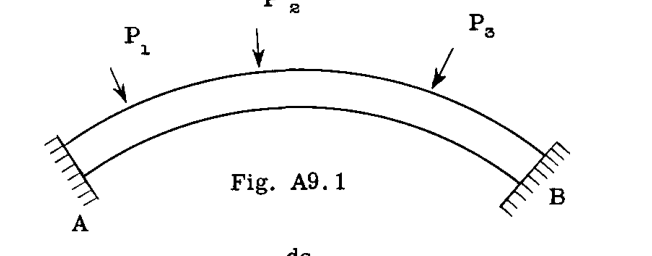

Fig. A9.2では、（A）における反力が、3つの成分、すなわち力  $X_A$  と  $Y_A$ 、およびモーメント  $M_A$  に置き換えられており、構造は端部（B）で固定され、端部（A）で冗長荷重を受け、既知の外荷重  $P_1$ 、 $P_2$  などを運ぶ片持ち梁として扱われている。結合部（A）は実際には固定されているため、構造が荷重を受けても移動や回転は生じない。したがって、Fig. A9.2の荷重条件下での端部（A）の移動はゼロでなければならない。したがって、点（A）の水平、垂直、および回転のたわみがゼロに等しくなければならないという3つの方程式を書くことができる。

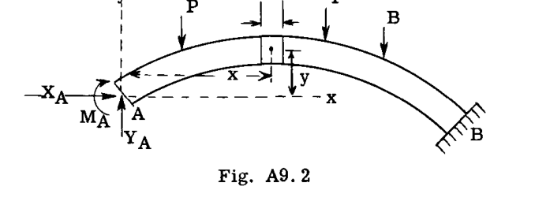

Fig. A9.2に示すように、曲線梁の微小要素  $ds$  を考える。 $M_s$  を、与えられた外荷重系によるこの微小要素  $ds$  上の曲げモーメントとする。要素  $ds$  上の全曲げモーメント  $M$  は、次のように等しくなる。

$$ 
 M = M_s + M_A - X_A y + Y_A x 
 $$ --- (1)

（フレームの内側繊維に引張を引き起こすモーメントを正のモーメントと見なす。）

点（A）に対する次のたわみ方程式はゼロに等しくなければならない：

 $\theta = 0$  （(A)の回転角 = ゼロ）  
 $Δx = 0$  （(A)のx方向への移動 = 0）  
 $Δy = 0$  （(A)のy方向への移動 = 0）

たわみ理論を扱った第A7章から、点（A）の移動に関して次の方程式が得られる：

$$ 
 \theta = \sum \frac{M m ds}{EI} 
 $$ --- (2)

$$ 
 Δx = \sum \frac{M m ds}{EI} 
 $$ --- (3)

$$ 
 Δy = \sum \frac{M m ds}{EI} 
 $$ --- (4)

方程式(2)において、項  $m$  は点（A）に適用された単位モーメントによる要素  $ds$  上の曲げモーメントである（Fig. A9.3参照）。したがって、曲げモーメントはフレームのすべての  $ds$  要素に対して1または単位に等しい。

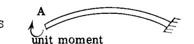

次に、方程式(2)に代入し、方程式(1)の  $M$  の値を使用すると、次が得られる。

$$ 
 \theta = \sum \frac{M_s ds}{EI} + M_A \sum \frac{1 \cdot ds}{EI} - X_A \sum \frac{1 \cdot y ds}{EI} + Y_A \sum \frac{1 \cdot x ds}{EI} = 0 
 $$

ゆえに、

$$ 
 \theta = \sum \frac{M_s ds}{EI} + M_A \sum \frac{ds}{EI} - X_A \sum \frac{y ds}{EI} + Y_A \sum \frac{x ds}{EI} = 0 
 $$ --- (5)

方程式(3)において、項  $m$  は点（A）に適用され、x方向に作用する単位荷重による要素  $ds$  上の曲げモーメントを表す。これはFig. A9.4に示されている。

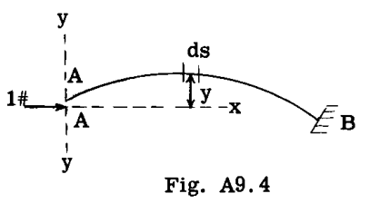

適用された単位荷重は、右向きに作用すると仮定されているため、正の符号を持つ。 $ds$  要素までの距離  $y$  は、x-x軸から上方に測定された場合は正の距離となる。しかし、示されている  $ds$  要素上の曲げモーメントは負（上部繊維に引張）であるため、 $m = -(1) y = -y$  となる。曲げモーメントに正しい符号を与えるためには、マイナス符号が必要である。

方程式(3)に代入し、方程式(1)の  $M$  を用いると：

$$ 
 Δx = - \sum \frac{M_s y ds}{EI} - M_A \sum \frac{y ds}{EI} + X_A \sum \frac{y^2 ds}{EI} - Y_A \sum \frac{xy ds}{EI} = 0 
 $$ --- (6)

方程式(4)において、項  $m$  は点（A）に適用され、Y方向に作用する単位荷重による要素  $ds$  上の曲げモーメントを表す。これはFig. A9.5に示されている。したがって、 $m = 1(x) = x$  である。方程式(4)に代入し、方程式(1)の  $M$  を用いると、次が得られる。

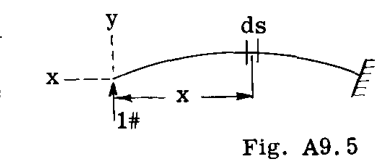

$$ 
 Δy = \sum \frac{M_s x ds}{EI} + M_A \sum \frac{x ds}{EI} - X_A \sum \frac{xy ds}{EI} + Y_A \sum \frac{x^2 ds}{EI} = 0 
 $$ --- (7)

これらの方程式(5)、(6)、(7)は、冗長力  $M_A$ 、 $X_A$ 、および  $Y_A$  を解くために使用できる。これらの値が既知であれば、構造上の任意の点における真の曲げモーメントは、方程式(1)から求められる。

## 冗長力を弾性中心に関連付ける

方程式(5)、(6)、(7)を簡略化するために、Fig. A9.6に示すように、端部Aが点(o)で終わる非弾性アームに取り付けられていると仮定する。点(o)は構造の  $ds/EI$  値の図心（セントロイド）と一致する。基準軸xおよびyは点(o)を原点とする。冗長反力は、非弾性ブラケットの端である点(o)に配置される。実際の構造では点Aは移動しないため、点(o)は剛性アームによって点(A)に接続されているため、点(o)も移動してはならない。

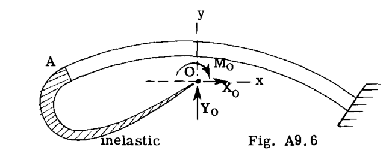

したがって、方程式(5)、(6)、および(7)は、それぞれ  $X_A$ 、 $Y_A$ 、および  $M_A$  の代わりに、冗長力  $X_o$ 、 $Y_o$ 、および  $M_o$  を使用して書き直すことができる。

点(o)を通る軸xおよびyは、構造の  $ds/EI$  値の図心軸である。この事実は、次の総和がゼロであることを意味する。

$$ 
 \sum \frac{y ds}{EI} = 0 \text{ および } \sum \frac{x ds}{EI} = 0 
 $$

項  $\sum \frac{x^2 ds}{EI}$ 、 $\sum \frac{y^2 ds}{EI}$ 、および  $\sum \frac{xy ds}{EI}$  も方程式(6)および(7)に現れる。これらの項は、弾性中心を通るxおよびy軸に関するフレームの弾性慣性モーメントおよび弾性相乗慣性モーメントと呼ばれ、簡略化のために次の記号が与えられる。

$$ 
 \sum \frac{x^2 ds}{EI} = I_y, \quad \sum \frac{y^2 ds}{EI} = I_x, \quad \sum \frac{xy ds}{EI} = I_{xy} 
 $$

方程式(5)、(6)、および(7)は、点(o)における冗長力を使用して次のように書き直される。

$$ 
 \theta = \sum \frac{M_s ds}{EI} + M_o \sum \frac{ds}{EI} = 0 
 $$

ゆえに、

$$ 
 M_o = \frac{- \sum \frac{M_s ds}{EI}}{\sum \frac{ds}{EI}} 
 $$ --- (8)

$$ 
 Δx = - \sum \frac{M_s y ds}{EI} + X_o I_x - Y_o I_{xy} = 0 
 $$ --- (9)

項  $M_o \sum \frac{y ds}{EI}$  は、 $\sum \frac{y ds}{EI}$  がゼロであるためゼロであり、したがって  $M_o$  は方程式(6)に代入したときに消去される。

$$ 
 Δy = \sum \frac{M_s x ds}{EI} - X_o I_{xy} + Y_o I_y = 0 
 $$ --- (10)

項  $M_s ds/EI$  は、一定の静的モーメント  $M_s$  が作用したときの  $ds$  要素の端面間の角度変化を表す。この角度変化は、実際には要素  $ds$  上の  $M_s/EI$  図の面積に等しく、記号  $ϕ_s$ 、すなわち  $ϕ_s = M_s ds/EI$  が与えられる。この記号の代入により、方程式(8)、(9)、(10)は次のように書き直すことができる。

$$ 
 M_o = - \frac{\sum ϕ_s}{\sum ds/EI} 
 $$ --- (11)

$$ 
 - \sum ϕ_s y + X_o I_x - Y_o I_{xy} = 0 
 $$ --- (12)

$$ 
 \sum ϕ_s x - X_o I_{xy} + Y_o I_y = 0 
 $$ --- (13)

方程式(12)および(13)を冗長力  $X_o$  および  $Y_o$  について解くと、次が得られる。

$$ 
 X_o = \frac{\sum ϕ_s y - \sum ϕ_s x (\frac{I_{xy}}{I_y})}{I_x (1 - \frac{I_{xy}^2}{I_x I_y})} 
 $$ --- (14)

$$ 
 Y_o = \frac{- [\sum ϕ_s x - \sum ϕ_s y (\frac{I_{xy}}{I_x})]}{I_y (1 - \frac{I_{xy}^2}{I_x I_y})} 
 $$ --- (15)

## A9.3 弾性中心を通る1つの対称軸を持つ構造の方程式

構造が、弾性中心を通るx軸またはy軸のいずれかが対称軸である場合、相乗慣性モーメント  $\sum xy ds/EI = I_{xy}$  はゼロになる。したがって、方程式(11)、(14)、および(15)において  $I_{xy} = 0$  とすると、次が得られる。

$$ 
 M_o = \frac{- \sum ϕ_s}{\sum ds/EI} 
 $$ --- (16)

$$ 
 X_o = \frac{\sum ϕ_s y}{I_x} 
 $$ --- (17)

$$ 
 Y_o = \frac{- \sum ϕ_s x}{I_y} 
 $$ --- (18)

## A9.4 例題。少なくとも1つの対称軸を持つ構造。

### 例題 1

Fig. A9.7は、点AおよびDで固定支持され、図に示すように単一の荷重を受ける長方形フレームを示している。問題は、この荷重下での曲げモーメント図を決定することである。

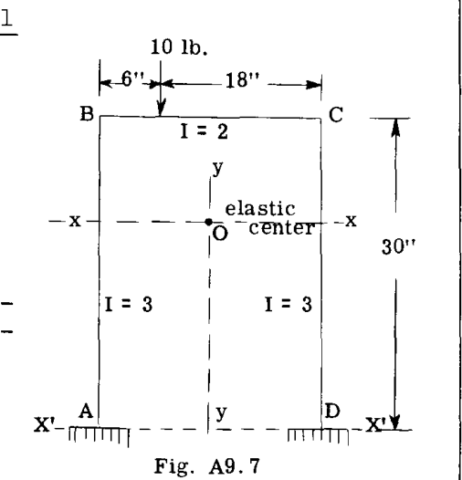

解法の最初のステップは、フレームの弾性中心の位置と、慣性モーメント  $I_x$  および  $I_y$  を見つけることである。

構造がY軸に関して対称であるため、図心のY軸はフレームの両側の間に位置し、したがって弾性中心(o)はこの軸上にある。

Table A9.1は、弾性中心の位置と慣性モーメントを決定するために必要な計算の一部を示している。基準軸は  $x^1 - x^1$  および  $y - y$  である。

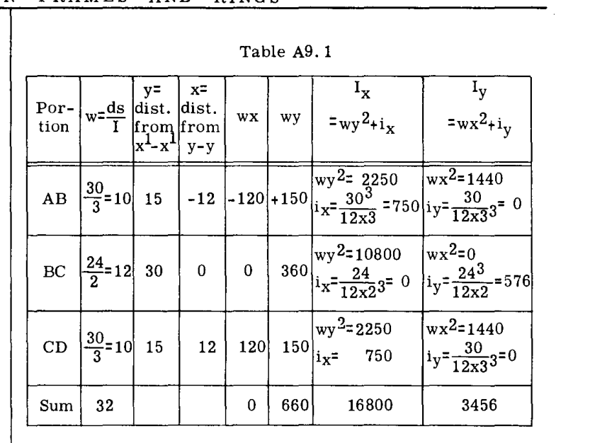

項  $i_x$  および  $i_y$  は、図心を通るx軸およびy軸に関するフレームの各部分の弾性慣性モーメントである。 $I$  は各部分にわたって一定であるため、各部分の図心慣性モーメントは、その図心軸に関する長方形の慣性モーメントと同一である。

部材ABについて説明すると：

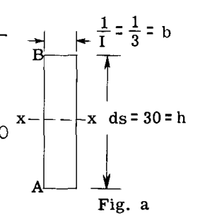

Fig. aを参照すると、

$$ 
 i_x = \frac{1}{12} b h^3 = \frac{1}{12} \times \frac{1}{3} \times 30^3 = 750 
 $$

Fig. bを参照すると、

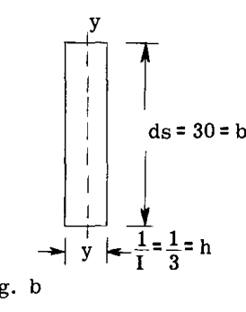

$$ 
 i_y = \frac{1}{12} b h^3 = \frac{1}{12} \times 30 \times \frac{1}{3^3} = .09 \text{（無視可能）} 
 $$

2つの基準軸から弾性中心までの距離は、次のように計算できる。

$$ 
 \bar{y} = \frac{\sum wy}{\sum w} = \frac{660}{32} = 20.625 \text{ in.} 
 $$

$$ 
 \bar{x} = \frac{\sum wx}{\sum w} = \frac{0}{32} = 0 
 $$

軸  $x^1 - x^1$  に関する慣性モーメントがわかれば、平行軸の定理を使用して、フレームの図心軸xxに関する値を求めることができる。

$$ 
 I_x = I_{x'} - \sum w(\bar{y}^2) = 16800 - 32 \times 20.625^2 = 3188 
 $$

$$ 
 I_y = I_{y'} - \sum w(\bar{x}^2) = 3456 - 32(0) = 3456 
 $$

問題は、弾性中心における冗長力についての方程式(16)、(17)、(18)を解くことになる。

$$ 
 M_o = \frac{- \sum ϕ_s}{\sum ds/I} = \frac{\text{静的 M/I 図の面積}}{\text{構造の全弾性重量}} 
 $$

$$ 
 X_o = \frac{\sum ϕ_s y}{I_x} = \frac{\text{x軸に関する静的 M/I 図のモーメント}}{\text{x軸に関する弾性慣性モーメント}} 
 $$

$$ 
 Y_o = \frac{- \sum ϕ_s x}{I_y} = \frac{\text{y軸に関する静的 M/I 図のモーメント}}{\text{y軸に関する弾性慣性モーメント}} 
 $$

したがって、これら3つの方程式を解くためには、与えられたフレームと荷重に一致する静的なフレーム条件を仮定しなければならない。一般に、選択できる静的条件はいくつかある。例えば、この問題では、Fig. A9.8のケース1から5に示されている静定条件の1つを選択することができる。

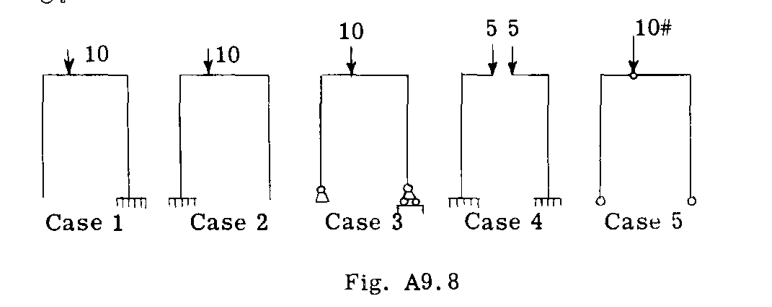

異なる静的条件の使用を説明するために、それぞれ異なる静的条件を使用した3つの解法を提示する。

### 解法 No. 1

この解法では、静的フレーム条件としてケース3を使用する。この静的フレーム条件に対するフレーム上の曲げモーメントは、Fig. A9.9に示されている。

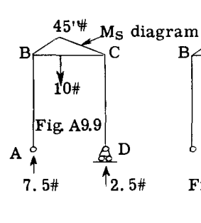

冗長力の方程式には、 $M_s/I$  図の面積である  $ϕ_s$  が必要である。Fig. A9.10は、 $M_s/I$  曲線を示している。これは、Fig. A9.9の値を、問題で与えられた部材BCの慣性モーメントである項2で割ることによって得られる。 $X_o$  および  $Y_o$  の方程式には、フレームの弾性中心を通る軸に関する荷重としての  $M_s/I$  図のモーメントが必要であるため、 $M_s/I$  図の面積は、図の図心において、フレームの中心線に沿って、またはより正確にはフレーム部材の中立軸に沿って集中する。

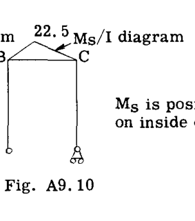

Fig. A9.10において、 $M_s/I$  図の面積は  $ϕ_s = 22.5 \times 24/2 = 270$  に等しい。この三角形の図心は、簡単な計算により、Bから10インチのところにある。Fig. A9.11は、 $M_s/I$  荷重または  $ϕ_s$  荷重を伴うフレームを示している。 $M_s$  が正であるため、 $ϕ_s$  も正である。次のステップは、弾性中心における冗長力の方程式を解くことである。弾性中心のx軸およびy軸からの距離xおよびyの符号は、慣習に従う。

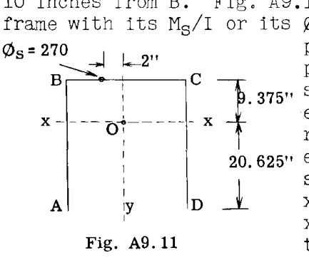

したがって、

$$ 
 M_o = \frac{- \sum ϕ_s}{\sum ds/I} = \frac{-(270)}{32 \text{（Table A9.1より）}} = -8.437 \text{ in.lb.} 
 $$

$$ 
 X_o = \frac{\sum ϕ_s y}{I_x} = \frac{270(9.375)}{3188} = 0.7939 \text{ lb.} 
 $$

$$ 
 Y_o = \frac{- \sum ϕ_s x}{I_y} = \frac{-(270)(-2)}{3456} = 0.1562 \text{ lb.} 
 $$

Fig. A9.12は、弾性中心に作用するこれらの冗長力の値を示している。

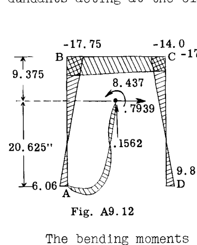

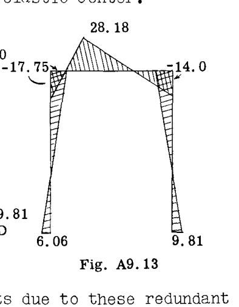

これらの冗長力による曲げモーメントが計算される。

$$ M_A = - 8.437 - .1562 \times 12 + .7939 \times 20.625 = 6.06 \text{ in. lb.} $$
$$ M_B = - 8.437 - .7939 \times 9.375 - .1562 \times 12 = -17.75 \text{ in.lb.} $$
$$ M_C = - 8.437 - .7939 \times 9.375 + .1562 \times 12 = -14.00 \text{ in.lb.} $$
$$ M_D = - 8.437 + .7939 \times 20.625 + .1562 \times 12 = 9.81 \text{ in. lb.} $$

これらの結果の値は、弾性中心における冗長力による曲げモーメント図を与えるためにFig. A9.12にプロットされている。

Fig. A9.9の静的曲げモーメント図にこの曲げモーメント図を加えると、Fig. A9.13の最終的な曲げモーメント図が得られる。

任意の点における最終的なモーメントは、点(A)の代わりに添字(o)を使用して方程式(1)に直接代入することによっても得られる。すなわち、

$$ 
 M = M_s + M_o - X_o y + Y_o x 
 $$ --- (19)

例えば、点Bにおける曲げモーメントを決定する。

点Bでは、 $x = -12$  および  $y = 9.375$ 、 $M_s = 0$ 。方程式(19)に代入すると、

$$ M_B = 0 + (-8.437) - .7939 \times 9.375 + .1562 (-12) = -17.75 $$ 
となり、以前に求められた値と同じである。

点Dでは、 $x = 12$ 、 $y = -20.625$ 、 $M_s = 0$ 。

$$ M_D = 0 + (-8.437) - .7939 (-20.625) + .1562 \times 12 = 9.81 \text{ in.lb.} $$

### 解法 No. 2

この解法では、仮定された静的条件としてケース4（Fig. A9.8参照）を使用する。これは、外部荷重の半分、つまり5 lb.が各片持ち梁に作用する2つの片持ち梁である。Fig. A9.14は静的曲げモーメント図を、Fig. A9.15は  $M_s/I$  図を示している。

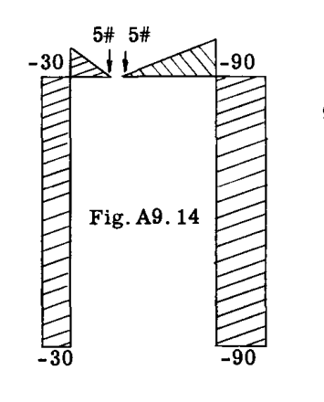

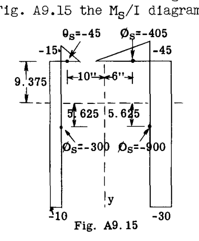

Fig. A9.15は、  $M_s/I$  図の各部分の  $ϕ_s$  値とその図心位置を計算した結果も示している。冗長力の方程式に代入すると、次が得られる。

$$ 
 M_o = \frac{- \sum ϕ_s}{\sum ds/I} = \frac{-(-45 - 405 - 300 - 900)}{32} = 51.56 \text{ in.lb.} 
 $$

$$ 
 X_o = \frac{\sum ϕ_s y}{I_x} = \frac{(-45 - 405)9.375 + (-900 - 300)(-5.625)}{3188} = 0.7939 \text{ lb.} 
 $$

$$ 
 Y_o = \frac{- \sum ϕ_s x}{I_y} = \frac{- [-45(-10) - 405 \times 6 - 300(-12) - 900 \times 12]}{3456} 
 $$

$$ 
 = \frac{-(-9180)}{3456} = 2.656 \text{ lb.} 
 $$

任意の点における最終的なモーメントは、方程式(19)によって求めることができる。

点Bを考える：

Fig. A9.14より  $M_s = -30$  
 $x = -12$ 、 $y = 9.375$  

方程式(19)に代入：

$$ M_B = -30 + 51.56 - .7939 \times 9.375 + 2.656(-12) = -17.75 \text{ in.lb.} $$ 
となり、これは最初の解法と一致する。

点Dを考える：

 $M_s = -90$ 、 $x = 12$ 、 $y = -20.625$  

方程式(19)に代入：

$$ M_D = -90 + 51.56 - .7939(-20.625) + 2.656 \times 12 = 9.80 \text{ in. lb.} $$

### 解法 No. 3

この解法では、仮定された静的条件としてケース5（Fig. A9.8参照）、すなわちFig. A9.16に示すように、点A、DおよびEに3つのヒンジを持つフレームを使用する。

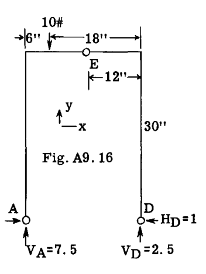