# 第A9章
# 弾性中心法によるフレームおよびリングの曲げモーメント

著者：ELASTIC CENTER METHOD

## A9.1 はじめに

飛行機の胴体や水上機の船体の内部を観察すると、多数の構造リングや閉じたフレームが見られる。中には非常に軽量で、主に機体の金属外殻の形状を維持し、縦方向の外殻ストリンガーに安定した支持を与えるために使用されるものもある。胴体と尾部、主翼、動力装置、着陸装置などの間で大きな荷重集中が伝達される箇所では、比較的重量のあるフレームが観察される。船体構造において、底部の構造骨組みは着陸時の水圧を船体フレームの下部に伝達し、それがさらに荷重を外板に伝達する。

一般に、フレームの形状や荷重分布は、適用された荷重を機体の他の抵抗部分に伝達する際に、これらのフレームやリングに曲げ力が作用するような特性を持っている。これらの曲げ力は一般に、フレームの強度配分において非常に重要となるフレーム応力を発生させるため、そのような曲げ力を適度な精度で近似することが必要である。

このようなフレームは内部抵抗応力に関して静的に不定であるため、内部抵抗力の分布の解を得るためには、断面特性や物理的特性を考慮しなければならない。

### 一般的な解析方法：

閉じたリングやフレーム、ベントにおける冗長力の解を得るために、連続性の原理を適用する方法は数多くある。著者は、一般に「弾性中心（Elastic Center）」法と呼ばれる方法を好んでおり、長年にわたって日常の航空機設計に使用してきた。この方法は、Müller-Breslau①によって考案された。他の多くの解法と比較したこの方法の主な違いは、冗長力がフレームの弾性中心と呼ばれる特殊な点に作用すると仮定されることであり、これにより冗長力に対する、互いに独立した結果の方程式が得られることである。

①Müller-Breslau, H., Die Neueren Methoden der Festigkeitslehre und der Statik der Baukonstruktionen. Leipzig, 1886.

### 仮定

以下の導出において、軸力および剪断力による変形は無視される。一般に、これらの変形はフレームの曲げ変形に比べて小さいため、誤差は小さい。

変形を計算する際、平面断面は曲げ後も平面を維持すると仮定される。フレームの曲率がフレーム断面上の曲げ応力の線形分布を変化させるため、これは厳密には正しくない（曲率の影響に対する補正は、第A13章に記載されている）。

さらに、応力は歪みに比例すると仮定される。航空機の応力解析担当者はフレームの終局強度を計算しなければならないが、フレームの破断応力が材料の比例限度を超える重量フレームの場合、この仮定は明らかに成立しない。

本章では、弾性中心法によるフレームおよびリングの曲げモーメントの理論的解析のみを扱う。機体フレーム設計の実践的な問題については、後の章で扱う。

水上機の船体の構造骨組みの一部の次の写真は、軽量および重量フレームの両方を示している。

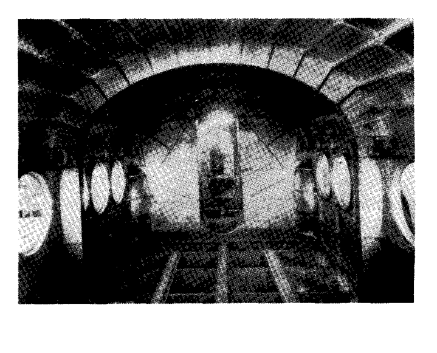

## A9.2 方程式の導出：非対称フレーム

Fig. A9.1は、両端(A)および(B)で固定され、外部荷重  $P_1$ 、 $P_2$  などを受ける非対称な曲線梁を示している。この構造は静的に3次不定である。なぜなら、(A)および(B)における反力には大きさ、方向、作用線の3つの未知要素があり、利用可能な静力学的な平衡方程式が3つしかないのに対し、計6つの未知数があるからである。

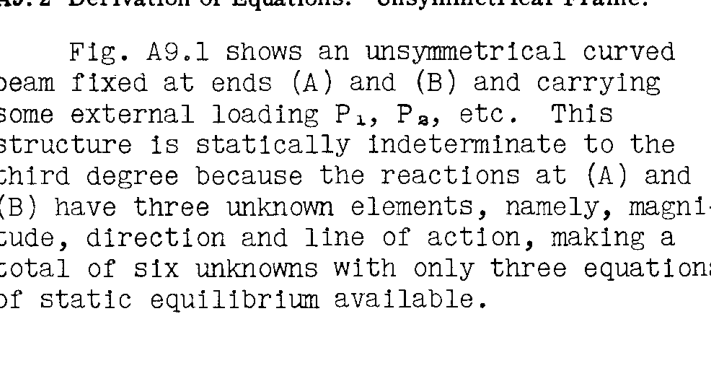

Fig. A9.2では、(A)における反力が3つの成分、すなわち力  $X_A$ 、 $Y_A$  およびモーメント  $M_A$  に置き換えられ、構造は端部(B)で固定され、(A)における冗長荷重および既知の外部荷重  $P_1$ 、 $P_2$  などを受ける片持ち梁として扱われる。点(A)は実際には固定されているため、構造に荷重がかかっても移動や回転は生じない。したがって、Fig. A9.2の荷重システム下での端部(A)の移動はゼロでなければならない。したがって、点(A)の水平方向、垂直方向、および角度の変位がゼロに等しくなければならないという3つの方程式を書くことができる。

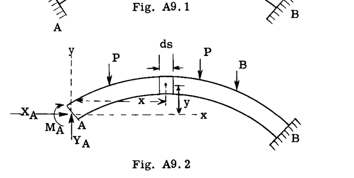

Fig. A9.2に示すように、曲線梁の微小要素  $ds$  を考える。外部荷重系によるこの微小要素上の曲げモーメントを  $M_s$  とする。要素  $ds$  上の全曲げモーメント  $M$  は、次のように表される。

$$
M = M_s + M_A - X_A y + Y_A x
$$ (1)

（フレームの内側の繊維に引張を生じさせるモーメントを正のモーメントとする。）

点(A)に関する次のたわみ方程式はゼロに等しくなければならない。

$$
\theta = 0 \quad (A \text{の角回転} = 0)
$$
$$
\Delta x = 0 \quad (x \text{方向の} A \text{の移動} = 0)
$$
$$
\Delta y = 0 \quad (y \text{方向の} A \text{の移動} = 0)
$$

変形理論を扱った第A7章より、点(A)の移動について次の方程式が得られる。

$$
\theta = \sum \frac{M m ds}{EI}
$$ (2)
$$
\Delta x = \sum \frac{M m ds}{EI}
$$ (3)
$$
\Delta y = \sum \frac{M m ds}{EI}
$$ (4)

方程式(2)において、項  $m$  は点(A)に加えられた単位モーメントによる要素  $ds$  上の曲げモーメントである（Fig. A9.3参照）。したがって、曲げモーメントはフレームのすべての  $ds$  要素について 1 または単位量に等しい。

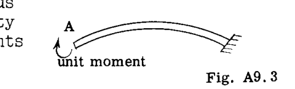

次に、方程式(2)に代入し、方程式(1)の  $M$  の値を使用すると、次式が得られる。

$$
\theta = \sum \frac{M_s ds}{EI} + M_A \sum \frac{1 \cdot ds}{EI} - X_A \sum \frac{1 \cdot y ds}{EI} + Y_A \sum \frac{1 \cdot x ds}{EI} = 0
$$

これより、

$$
\theta = \sum \frac{M_s ds}{EI} + M_A \sum \frac{ds}{EI} - X_A \sum \frac{y ds}{EI} + Y_A \sum \frac{x ds}{EI} = 0
$$ (5)

方程式(3)において、項  $m$  は点(A)に加えられ  $x$  方向に作用する単位荷重による要素  $ds$  上の曲げモーメントを表し、これは Fig. A9.4 に示されている。

点(A)に向かって右向きに作用すると仮定されているため、加えられた単位荷重は正の符号を持つ。 $ds$  要素までの距離  $y$  は、軸  $x-x$  から(A)を通って上方に測定されるため、正の距離である。しかし、示されている  $ds$  要素上の曲げモーメントは負（上部繊維に引張）であるため、 $m = -(1) y = -y$  となる。正しい曲げモーメントの符号を与えるためには、マイナス記号が必要である。

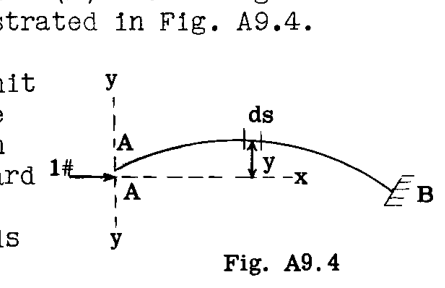

方程式(3)に代入し、方程式(1)の  $M$  を用いると、次式が得られる。

$$
\Delta x = - \sum \frac{M_s y ds}{EI} - M_A \sum \frac{y ds}{EI} + X_A \sum \frac{y^2 ds}{EI} - Y_A \sum \frac{xy ds}{EI} = 0
$$ (6)

方程式(4)において、項  $m$  は点(A)に加えられ  $Y$  方向に作用する単位荷重による要素  $ds$  上の曲げモーメントを表す（Fig. A9.5 参照）。したがって、 $m = 1(x) = x$  となる。方程式(4)に代入し、方程式(1)の  $M$  を用いると、次式が得られる。

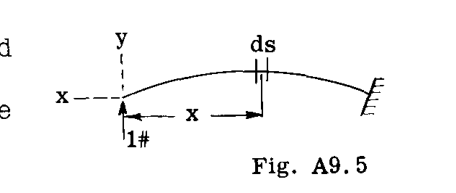

$$
\Delta y = \sum \frac{M_s x ds}{EI} + M_A \sum \frac{x ds}{EI} - X_A \sum \frac{xy ds}{EI} + Y_A \sum \frac{x^2 ds}{EI} = 0
$$ (7)

方程式(5)、(6)、(7)を用いて、冗長力  $M_A$ 、 $X_A$ 、 $Y_A$  を解くことができる。これらの値が分かれば、構造上の任意の点における真の曲げモーメントは方程式(1)から求められる。

## 弾性中心への冗長力の移行

方程式(5)、(6)、(7)を簡略化するために、端部  $A$  が Fig. A9.6 に示すような点(o)で終わる非弾性アームに取り付けられていると仮定する。点(o)は、構造の  $ds/EI$  値の重心と一致する。参照軸  $x$  および  $y$  は、点(o)を原点として設定する。冗長反力は、非弾性ブラケットの端点である点(o)に配置される。実際の構造では点  $A$  は移動しないため、点(o)は剛性アームによって点(A)に接続されているので、点(o)も移動してはならない。

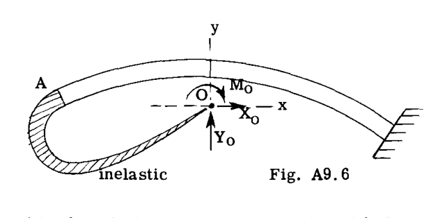

したがって、方程式(5)、(6)、(7)は、 $X_A$ 、 $Y_A$ 、 $M_A$  の代わりに冗長力  $X_o$ 、 $Y_o$ 、 $M_o$  を使用して書き直すことができる。

点(o)を通る軸  $x$  および  $y$  は、構造の  $ds/EI$  値に対する図心軸である。この事実は、次の総和がゼロであることを意味する。

$$
\sum \frac{y ds}{EI} = 0 \quad \text{および} \quad \sum \frac{x ds}{EI} = 0
$$

方程式(6)および(7)には、 $\sum x^2 ds/EI$ 、 $\sum y^2 ds/EI$ 、および  $\sum xy ds/EI$  という式も現れる。これらの項は、弾性中心を通るフレームの  $y$  軸および  $x$  軸に関する弾性慣性モーメントおよび弾性相乗モーメントと呼ばれ、簡略化のために次の記号が与えられる。

$$
\sum \frac{x^2 ds}{EI} = I_y, \quad \sum \frac{y^2 ds}{EI} = I_x, \quad \sum \frac{xy ds}{EI} = I_{xy}
$$

方程式(5)、(6)、(7)は、点(o)における冗長力を用いて次のように書き換えられる。

$$
\theta = \sum \frac{M_s ds}{EI} + M_o \sum \frac{ds}{EI} = 0
$$

ゆえに、

$$
M_o = \frac{- \sum \frac{M_s ds}{EI}}{\sum \frac{ds}{EI}}
$$ (8)

$$
\Delta x = - \sum \frac{M_s y ds}{EI} + X_o I_x - Y_o I_{xy} = 0
$$ (9)

項  $M_o \sum y ds/EI$  は  $\sum y ds/EI$  がゼロであるためゼロとなり、したがって方程式(6)に代入すると  $M_o$  は消える。

$$
\Delta y = \sum \frac{M_s x ds}{EI} - X_o I_{xy} + Y_o I_y = 0
$$ (10)

項  $M_s ds/EI$  は、一定の静的モーメント  $M_s$  が作用したときの要素  $ds$  の端面間の角度変化を表す。この角度変化は、実際には要素  $ds$  上の  $M_s/EI$  図の面積に等しく、記号  $\phi_s$  すなわち  $\phi_s = M_s ds / EI$  が与えられる。この記号代入により、方程式(8)、(9)、(10)は次のように書き直すことができる。

$$
M_o = - \frac{\sum \phi_s}{\sum \frac{ds}{EI}}
$$ (11)

$$
- \sum \phi_s y + X_o I_x - Y_o I_{xy} = 0
$$ (12)

$$
\sum \phi_s x - X_o I_{xy} + Y_o I_y = 0
$$ (13)

方程式(12)および(13)を冗長力  $X_o$  および  $Y_o$  について解くと、次式が得られる。

$$
X_o = \frac{\sum \phi_s y - \sum \phi_s x (\frac{I_{xy}}{I_y})}{I_x (1 - \frac{I_{xy}^2}{I_x I_y})}
$$ (14)

$$
Y_o = \frac{-[\sum \phi_s x - \sum \phi_s y (\frac{I_{xy}}{I_x})]}{I_y (1 - \frac{I_{xy}^2}{I_x I_y})}
$$ (15)

### A9.3 弾性中心を通る1つの対称軸を持つ構造の方程式

もし構造が、弾性中心を通る  $x$  軸または  $y$  軸のいずれかが対称軸であるようなものであれば、相乗モーメント  $\sum xy ds/EI = I_{xy} = 0$  となる。したがって、方程式(11)、(14)、(15)において  $I_{xy} = 0$  とすると、次式が得られる。

$$
M_o = \frac{- \sum \phi_s}{\sum \frac{ds}{EI}}
$$ (16)

$$
X_o = \frac{\sum \phi_s y}{I_x}
$$ (17)

$$
Y_o = \frac{- \sum \phi_s x}{I_y}
$$ (18)

## A9.4 例題の解法：少なくとも1つの対称軸を持つ構造

### 例題 1

Fig. A9.7は、点 A および D で固定支持され、図示のように単一の荷重を受ける矩形フレームを示している。問題は、この荷重下での曲げモーメント図を決定することである。

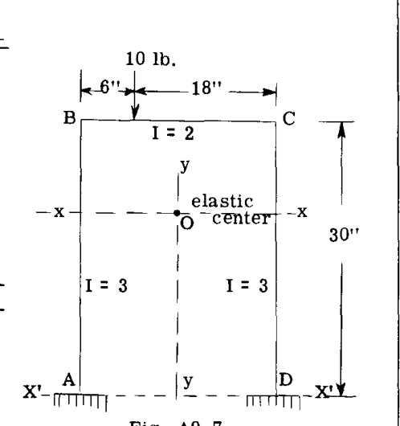

解法の第一歩は、フレームの弾性中心の位置と弾性慣性モーメント  $I_x$  および  $I_y$  を見つけることである。

構造が  $Y$  軸に関して対称であるため、図心  $Y$  軸はフレームの側面の中間に位置し、したがって弾性中心(o)はこの軸上に存在する。

Table A9.1 は、弾性中心の位置と弾性慣性モーメントを決定するために必要な計算の一部を示している。使用される参照軸は  $x^1-x^1$  および  $y-y$  である。

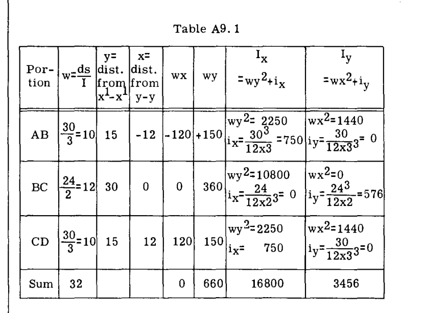

項  $i_x$  および  $i_y$  は、図心  $x$  軸および  $y$  軸に関するフレームの各部分の弾性慣性モーメントである。 $I$  は各部分にわたって一定であるため、各部分の図心慣性モーメントは、その図心軸に関する長方形の慣性モーメントと同じである。

部材 AB について説明すると：

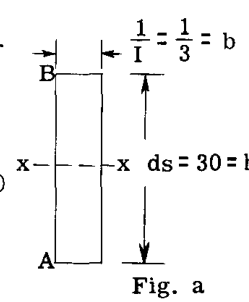

Fig. a を参照して、

$$
i_x = \frac{1}{12} b h^3 = \frac{1}{12} \times \frac{1}{3} \times 30^3 = 750
$$

Fig. b を参照して、

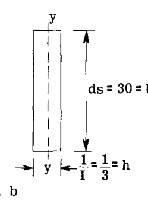

$$
i_y = \frac{1}{12} b h^3 = \frac{1}{12} \times 30 \times \frac{1}{3^3} = .09 \quad (\text{無視可能})
$$

2つの参照軸から弾性中心までの距離は、次のように計算できる。

$$
\bar{y} = \frac{\sum w y}{\sum w} = \frac{660}{32} = 20.625 \text{ in.}
$$

$$
\bar{x} = \frac{\sum w x}{\sum w} = \frac{0}{32} = 0
$$

軸  $x^1-x^1$  に関する慣性モーメントが分かったので、平行軸の定理を用いて、フレームの図心軸  $xx$  に関する値を求めることができる。

$$
I_x = I_x - \sum w (\bar{y}^2) = 16800 - 32 \times 20.625^2 = 3188
$$

$$
I_y = I_y - \sum w (\bar{x}^2) = 3456 - 32(0) = 3456
$$

問題は次に、弾性中心における冗長力についての方程式(16)、(17)、(18)を解くことである。すなわち、

$$
M_o = \frac{- \sum \phi_s}{\sum ds/I} = \frac{\text{静的 } M/I \text{ 図の面積}}{\text{構造の全弾性重量}}
$$

$$
X_o = \frac{\sum \phi_s y}{I_x} = \frac{x \text{ 軸に関する静的 } M/I \text{ 図のモーメント}}{x \text{ 軸に関する弾性慣性モーメント}}
$$

$$
Y_o = \frac{- \sum \phi_s x}{I_y} = \frac{y \text{ 軸に関する静的 } M/I \text{ 図のモーメント}}{y \text{ 軸に関する弾性慣性モーメント}}
$$

これら3つの方程式を解くためには、与えられたフレームと荷重に適合する静的フレーム条件を仮定しなければならない。一般に、選択できる静的条件は数多くある。例えば、この問題では、Fig. A9.8のケース1から5に示されている静的に定まった条件の1つを選択することができる。

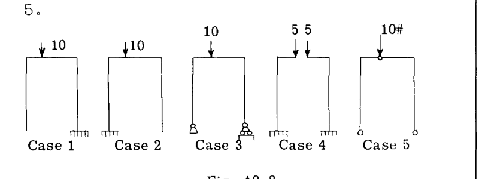

異なる静的条件の使用を説明するために、それぞれ異なる静的条件を用いた3つの解法を提示する。

### 解法 No. 1

この解法では、静的フレーム条件としてケース3を使用する。この静的フレーム条件に対するフレーム上の曲げモーメントを Fig. A9.9 に示す。

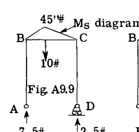
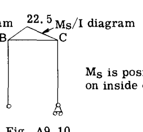

冗長力の方程式には  $\phi_s$ 、すなわち  $M_s/I$  図の面積が必要である。Fig. A9.10 は  $M_s/I$  曲線を示しており、これは Fig. A9.9 の値を、問題で与えられた部材 BC の慣性モーメントである項 2 で割ることによって得られる。 $X_o$  および  $Y_o$  の方程式は  $M_s/I$  図のフレームの弾性中心を通る軸に関するモーメントとしての荷重を必要とするため、 $M_s/I$  図の面積は図の重心において、かつフレームの中心線に沿って、より正確にはフレーム部材の中立軸に沿って集中する。

Fig. A9.10 において、 $M_s/I$  図の面積は  $\phi_s = 22.5 \times 24 / 2 = 270$  に等しい。この三角形の単純な計算による重心は、B から 10 インチのところに落ちる。Fig. A9.11 は現在、その  $M_s/I$  またはその  $\phi_s$  荷重を伴うフレームを示している。 $\phi_s$  は  $M_s$  が正であるため正である。

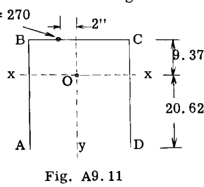

次のステップは、弾性中心における冗長力の方程式を解くことである。軸  $x$  および  $y$  からの距離  $x$  および  $y$  の符号は、慣習に従う。

したがって、

$$
M_o = \frac{- \sum \phi_s}{\sum ds/I} = \frac{-(270)}{32 \text{ (Table A9.1より)}} = -8.437 \text{ in.lb.}
$$

$$
X_o = \frac{\sum \phi_s y}{I_x} = \frac{270(9.375)}{3188} = 0.7939 \text{ lb.}
$$

$$
Y_o = \frac{- \sum \phi_s x}{I_y} = \frac{-(270)(-2)}{3456} = 0.1562 \text{ lb.}
$$

Fig. A9.12 は、弾性中心に作用するこれらの冗長力の値を示している。

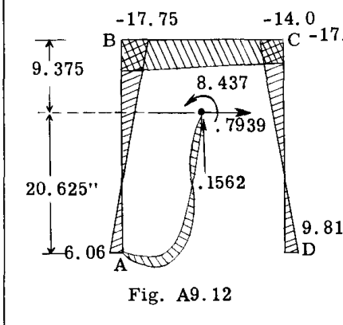
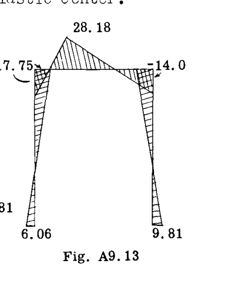

これらの冗長力による曲げモーメントを計算する。

$$
M_A = - 8.437 - .1562 \times 12 + .7939 \times 20.625 = 6.06 \text{ in.lb.}
$$

$$
M_B = - 8.437 - .7939 \times 9.375 - .1562 \times 12 = -17.75 \text{ in.lb.}
$$

$$
M_C = - 8.437 - .7939 \times 9.375 + .1562 \times 12 = -14.00 \text{ in.lb.}
$$

$$
M_D = - 8.437 + .7939 \times 20.625 + .1562 \times 12 = 9.81 \text{ in.lb.}
$$

これらの結果の値を Fig. A9.12 にプロットして、弾性中心における冗長力による曲げモーメント図を得る。

この曲げモーメント図を Fig. A9.9 の静的曲げモーメント図に加えると、Fig. A9.13 の最終的な曲げモーメント図が得られる。

最終的な曲げモーメントは、(A)の代わりに添字(o)を使用して方程式(1)に直接代入することによっても得ることができる。すなわち、

$$
M = M_s + M_o - X_o y + Y_o x
$$ (19)

例えば、点 B における曲げモーメントを決定する。

点 B について、 $x = -12$  および  $y = 9.375$ 、 $M_s = 0$  を方程式(19)に代入すると、

$$
M_B = 0 + (-8.437) - .7939 \times 9.375 + .1562 (-12) = -17.75
$$

これは以前に求められた通りである。

点 D において、 $x = 12$ 、 $y = -20.625$ 、 $M_s = 0$ 。

$$
M_D = 0 + (-8.437) - .7939 (-20.625) + .1562 \times 12 = 9.81 \text{ in.lb.}
$$

### 解法 No. 2

この解法では、仮定された静的条件としてケース4（Fig. A9.8参照）を使用する。つまり、外部荷重の半分、すなわち 5 lb. が各片持ち梁に作用する2つの片持ち梁である。Fig. A9.14 は静的曲げモーメント図を示し、Fig. A9.15 は  $M_s/I$  図を示している。

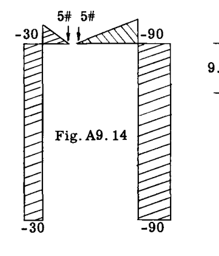
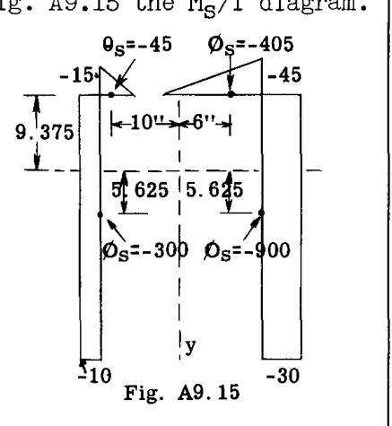

Fig. A9.15 は、 $M_s/I$  図の各部分に対する  $\phi_s$  値の計算結果とその重心位置も示している。冗長力の方程式に代入すると、次式が得られる。

$$
M_o = \frac{- \sum \phi_s}{\sum ds/I} = \frac{-(-45 - 405 - 300 - 900)}{32} = 51.56 \text{ in.lb.}
$$

$$
X_o = \frac{\sum \phi_s y}{I_x} = \frac{(-45 - 405) 9.375 + (-900 - 300) (-5.625)}{3188} = 0.7939 \text{ lb.}
$$

$$
Y_o = \frac{- \sum \phi_s x}{I_y} = \frac{-[-45(-10) - 405 \times 6 - 300(-12) - 900 \times 12]}{3456} = \frac{-(-9180)}{3456} = 2.656 \text{ lb.}
$$

任意の点における最終モーメントは、方程式(19)によって求めることができる。

点 B を考える：

Fig. A9.14 より  $M_s = -30$ 
 $x = -12, y = 9.375$ 

方程式(19)に代入：

$$
M_B = -30 + 51.56 - .7939 \times 9.375 + 2.656 (-12) = -17.75 \text{ in.lb.}
$$

これは最初の解法と一致する。

点 D を考える：

 $M_s = -90, x = 12, y = -20.625$ 

方程式(19)に代入：

$$
M_D = -90 + 51.56 - .7939 (-20.625) + 2.656 \times 12 = 9.80 \text{ in.lb.}
$$

### 解法 No. 3

この解法では、仮定された静的条件としてケース5（Fig. A9.8）を使用する。すなわち、Fig. A9.16 に示すように、点 A、D、および E に3つのヒンジを持つフレームである。

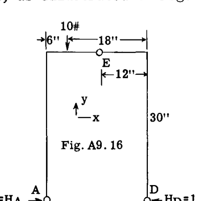

曲げモーメント図を計算する前に、A および D における反力を求める必要がある。

 $V_D$  を求めるために、点 A に関するモーメントをとる。

$$
\sum M_A = 10 \times 6 - 24 V_D = 0
$$

ゆえに、 $V_D = 2.5$ 

 $V_A$  を求めるために  $\sum F_y = 0$  とすると、 $-10 + 2.5 + V_A = 0$  となり、したがって  $V_A = 7.5$  である。

 $H_D$  を求めるために、E のヒンジに関する E の右側のすべての力のモーメントをとり、ゼロに等置する。

$$
\sum M_E = -2.5 \times 12 + 30 H_D = 0 \quad \text{したがって } H_D = 1
$$

次に、全フレームに対して  $\sum F_x = 0$  を用いると、 $\sum F_x = -1 + H_A = 0$  となり、したがって  $H_A = 1$  を得る。

フレームの静的曲げモーメント図を計算し、Fig. A9.17 に示すように描くことができる。

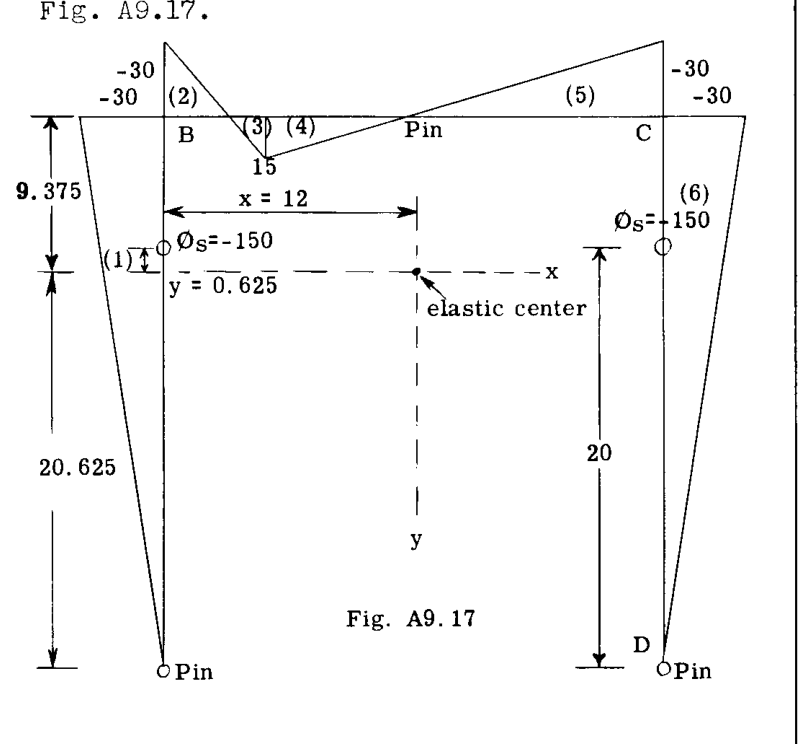

モーメント図は、各部分の小さな円内の数値で示されるように、1 から 6 の 6 つの部分にラベル付けされている。この点からの計算のほとんどは、Table A9.2 に示すように表形式で便利に行うことができる。

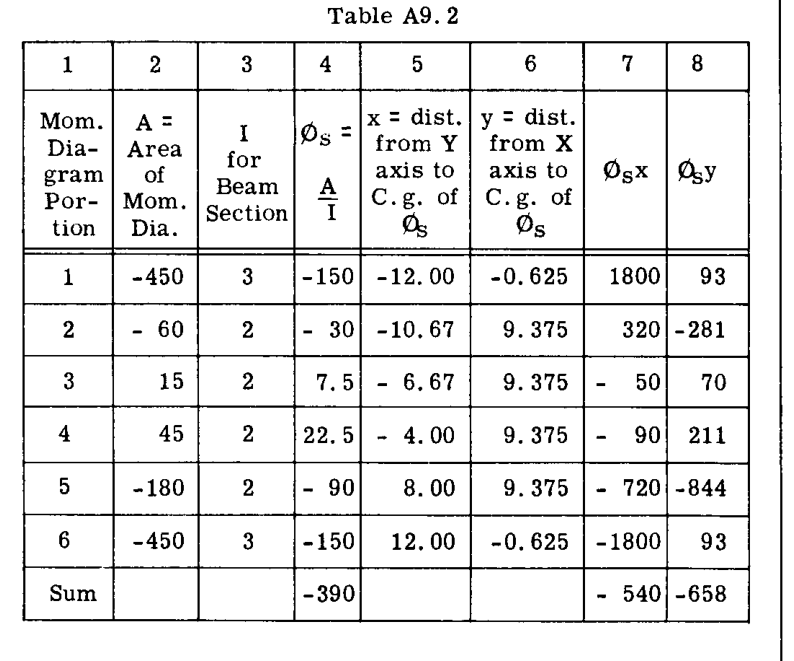

表の列(4)の  $\phi_s$  値のモーメントをとるために、図の各部分の重心を決定しなければならない。例えば、1 および 6 と記された 2 つの三角形の曲げモーメント部分の重心は、Fig. A9.17 に示すように、下端から  $.667 \times 30$ 、すなわち 20 インチのところにある。したがって、フレームの弾性中心を通る軸に対する、この  $\phi_s$  位置からの距離  $x$  および  $y$  は、それぞれ -12 および -0.625 インチと計算される。

$$
M_o = \frac{- \sum \phi_s}{\sum ds/I} = \frac{-(-390)}{32} = 12.19 \text{ in.lb.}
$$

$$
X_o = \frac{\sum \phi_s y}{I_x} = \frac{-648}{3188} = -0.203 \text{ lb.}
$$

$$
Y_o = \frac{- \sum \phi_s x}{I_y} = \frac{-(-540)}{3456} = 0.1562 \text{ lb.}
$$

任意の点における最終モーメントは、方程式(19)を用いて求めることができる。

点 B を考える：

 $x = -12, y = 9.375, M_s = -30$ 

代入すると：

$$
M_B = -30 + 12.19 - (-0.203) 9.375 + 0.1562(-12) = -17.76 \text{ in.lb.} \quad (\text{以前の解法と一致})
$$

点 D を考える：

 $x = 12, y = -20.625, M_s = 0$ 

方程式(19)に代入：

$$
M_D = 0 + 12.19 - (-0.203) (-20.625) + 0.1562 \times 12 = 9.82 \text{ in.lb.} \quad (\text{以前の解法と一致})
$$

最終的な完全な曲げモーメント図は、当然ながら解法 No. 1 の結果である Fig. A9.13 に描かれたものと同じになる。

### 例題 2

Fig. A9.18 は、点 A および B で支持され、図示のように外部荷重を受ける矩形密閉フレームを示している。点 D における反力はローラーのため垂直である。フレームは点 A でジョイントを貫通して連続しているが、反力はジョイントの中心にあるピンを通して加えられる。問題は曲げモーメント図を決定することである。

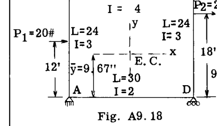
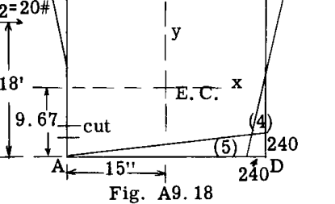

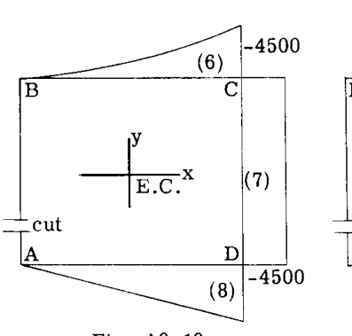
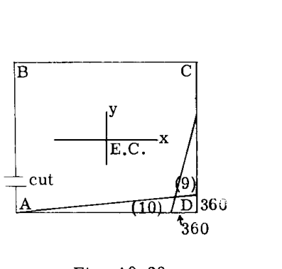

解法：

第一歩は、フレームの弾性中心の位置を見つけることである。フレームの  $y$  軸に関する対称性のため、弾性中心はフレームの中央を通る  $y$  軸上にある。AD を通る軸から測定した垂直距離  $\bar{y}$  は次式に等しい。

$$
\bar{y} = \frac{\sum (\frac{ds}{I}) y}{\sum \frac{ds}{I}} = \frac{\frac{30}{4} \times 24 + \frac{24}{3} \times 12 \times 2}{\frac{30}{4} + (\frac{24}{3}) 2 + \frac{30}{2}} = \frac{372}{38.5} = 9.67"
$$

次のステップは、弾性中心を通る  $x$  軸および  $y$  軸に関するフレームの弾性慣性モーメントを決定することである。

 $x$  軸に関する慣性モーメント  $= I_x$  ：

部材 AB および DC、

$$
I_x = (\frac{1}{3} \times \frac{1}{3} \times 14.33^3) 2 = 653.9
$$
$$
(\frac{1}{3} \times \frac{1}{3} \times 9.67^3) 2 = 200.9
$$

部材 BC および AD

$$
I_x = (30/4)(14.33^2) = 1540.0
$$
$$
(30/2)(9.67^2) = 1402.7
$$

$$
I_x = 3797.5
$$

 $y$  軸に関する慣性モーメント  $= I_y$  ：

部材 AD および BC、

$$
I_y = \frac{1}{12} \times \frac{1}{4} \times 30^3 = 563
$$
$$
\frac{1}{12} \times \frac{1}{2} \times 30^3 = 1126
$$

部材 AB、CD、

$$
I_y = (\frac{24}{3} \times 15^2) 2 = 3600
$$

$$
I_y = 5289
$$

次のステップは、静的フレーム条件を選択し、静的 ( $M_s$ ) 曲げモーメント図を決定することである。この解法では、Fig. A9.18、19、および 20 に示すように、点 A のすぐ上の部材 AB でフレームが切断されていると仮定する。簡略化のために、構造上の 3 つの外部荷重のそれぞれを個別に考慮して、静的モーメント曲線を 3 つの部分に分けて描いている。Fig. A9.18、19、20 は、これらの結果として得られる曲げモーメント曲線を示している。これらの曲げモーメント図の 1 から 10 と番号付けられた部分は、各部分の括弧内に示されている。

解法の次のステップは、 $M_s/I$  図の面積と、弾性中心に関するこれらの図の一次モーメントを求めることである。これらの単純な計算は、Table A9.3 に示すように表形式で最適に行うことができる。

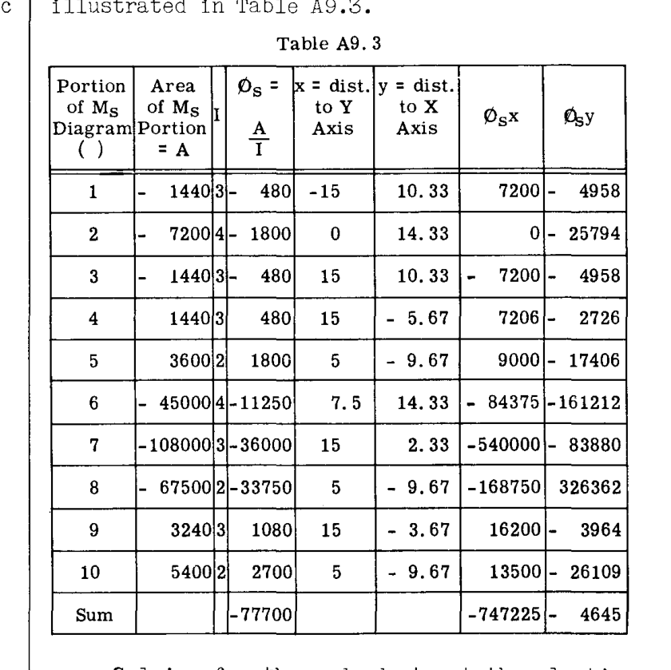

弾性中心における冗長力を解く。

$$
M_o = - \frac{\sum \phi_s}{\sum ds/I} = - \frac{(-77700)}{38.5} = 2018 \text{ in.lb.}
$$

$$
X_o = \frac{\sum \phi_s y}{I_x} = \frac{-4645}{3797} = -1.22 \text{ lb.}
$$

$$
Y_o = - \frac{\sum \phi_s x}{I_y} = - \frac{(-747225)}{5289} = 141.28 \text{ lb.}
$$

Fig. A9.21 は、弾性中心に作用するこれらの冗長力を示している。Fig. A9.22 は、これらの冗長力による曲げモーメント図を示している。