# 第A9.9節 フレームとリングの曲げモーメント

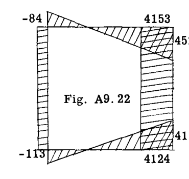
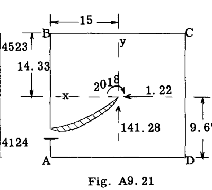

$$
M_A = 2018 - 141.28 \times 15 - 1.22 \times 9.67 = -113
$$
$$
M_B = 2018 - 141.28 \times 15 + 1.22 \times 14.33 = -84
$$
$$
M_C = 2018 + 141.28 \times 15 + 1.22 \times 14.33 = 4153
$$
$$
M_D = 2018 + 141.28 \times 15 - 1.22 \times 9.67 = 4124
$$

Fig. A9.18, 19, 20 の曲げモーメント図を Fig. A9.22 と組み合わせると、真の、あるいは最終的な曲げモーメント図が得られる。

### 例題3. 円形リング

Fig. A9.23 は、図示されたような対称荷重を受ける一定断面の円形リングを示している。問題は、曲げモーメント図を決定することである。

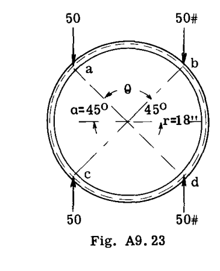

**解法.** リング構造の対称性により、弾性中心はリングの中心に位置する。リングは一定の断面であると仮定されているため、  $I$  には相対値の 1 を使用する。

リングの全弾性重量 =
$$
\sum \frac{ds}{I} = \frac{\pi(36)}{1} = 113.1
$$

リングの中心点を通る x および y 軸まわりの弾性慣性モーメントは、各軸に対して同じであり、等しい。
$$
I_x = I_y = \pi r^3 = \pi \times 18^3 = 18300
$$

解法の次のステップは、静的なリング状態を仮定し、静的モーメント ( $M_s$ ) 図を決定することである。一般に、  $M_s$  図が弾性中心を通る x 軸または y 軸の一方、あるいは可能であれば両方に対して対称となるような静的状態を仮定するのが良い習慣である。これにより、不静定量  $X_o$  および  $Y_o$  の一方または両方をゼロにすることができ、問題の解決のための数値計算量を大幅に削減できる。

 $M_s$  図、および  $I$  が一定であるため  $M_s/I$  図の対称性を得るために、Fig. A9.24 に示されるような静的条件を仮定する。すなわち、(e) 点をピン、(f) 点をローラーとする。点 (a), (b), (c), (d) における静的曲げモーメントは、大きさが同じで等しく、次のようになる。

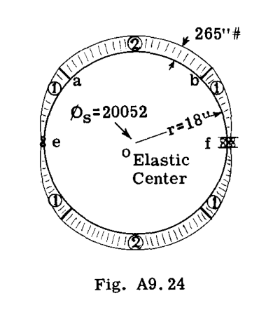

$$
M_s = 50(18 - 18 \cos 45^\circ) = 265 \text{ in. lb.}
$$

符号が正であるのは、曲げモーメントがリングの内側に引張を生じさせるためである。

次のステップは、  $\Phi_s, \Phi_{sX}$  および  $\Phi_{sY}$  の値を決定することである。

 $\Phi_s$  は  $M_s/I$  図の面積であるが、  $I$  が 1 であるため、  $M_s$  図の面積となる。Fig. A9.24 の静的  $M_s$  図は、(1) および (2) と記された同様の部分に分割される。したがって、

$$
\Phi_{s(1)} = \text{部分 (1) の面積} = P r^2 (\alpha - \sin \alpha)
$$
ここで  $P = 50 \text{ lb.}$ 、  $\alpha = 45^\circ$  である。

(1) と記された部分は 4 つあるため、4 倍して代入すると、
$$
\Phi_{s(1)} = 4 [50 \times 18^2 (0.785 - 0.707)] = 5052
$$

(2) と記された部分の面積は次のように等しい。
$$
P r^2 \theta (1 - \cos \alpha)
$$

(2) の領域は 2 つあるため、次のようになる。
$$
\Phi_{s(2)} = 2 [50 \times 18^2 \times \frac{\pi}{2} (1 - 0.707)] = 15000
$$

したがって、合計  $\Phi_s = 15000 + 5052 = 20052$  となる。

両方の x 軸および y 軸に関する対称性により  $M_s$  図の図心が弾性中心と一致するため、項  $\sum \Phi_{sX}$  および  $\sum \Phi_{sY}$  はゼロとなる。

弾性中心における不静定量を決定するために代入すると、次のようになる。
$$
M_o = - \frac{\sum \Phi_s}{\sum ds/I} = - \frac{20052}{113.1} = -177 \text{ in. lb.}
$$
$$
X_o = \frac{\sum \Phi_{sY}}{I_x} = \frac{20052(0)}{18300} = 0
$$
$$
Y_o = - \frac{\sum \Phi_{sX}}{I_y} = - \frac{(20052)(0)}{18300} = 0
$$

Fig. A9.25 は弾性中心に作用する値と、これらの力によって生じる曲げモーメント図を示している。Fig. A9.25 の曲げモーメント図（フレーム全体にわたって定数値 -177）を Fig. A9.24 の静的モーメント図に加えると、Fig. A9.26 に示すような最終的な曲げモーメント図が得られる。

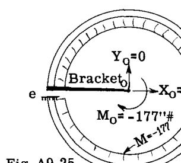
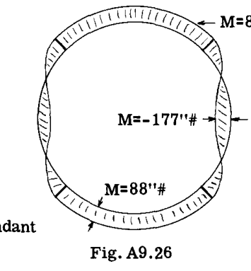

### 例題4. 船体フレーム

Fig. A9.27 は、図示された荷重を受ける閉じたフレームを示している。問題は、曲げモーメント図を決定することである。

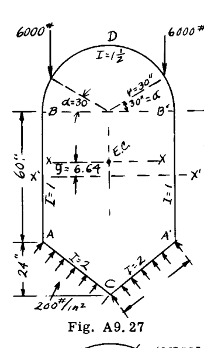

**解法:**
最初のステップは、フレームの弾性中心と弾性慣性モーメントを決定することである。Table A9.4 に計算結果を示す。基準軸 x'-x' は、辺 AB の中点に選択された。不静定  $Y_o$  がこの対称性によりゼロになるため、弾性中心を通る y 軸に対して  $M_s$  図を対称にするような静的フレーム条件が選択されている（Fig. A9.28 参照）。したがって、  $I_y$  を決定する必要はない。

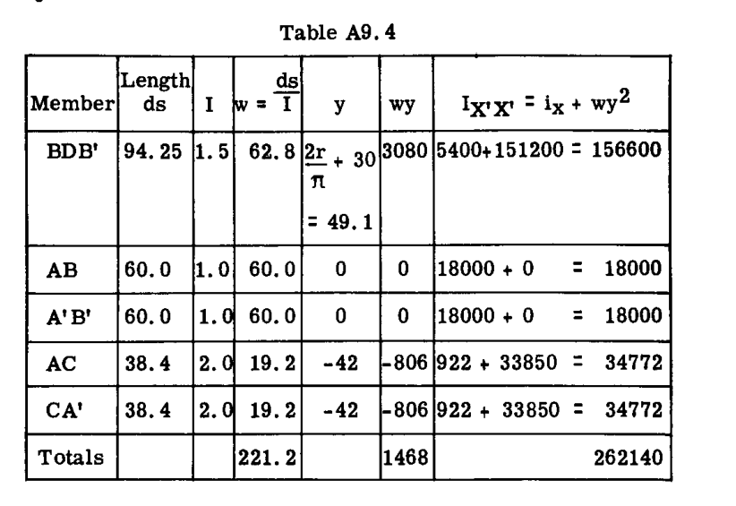

Table A9.4 の最後の列において、項  $i_x$  は、特定の部材自身の図心を通る x 軸まわりの慣性モーメントである。したがって、部材 BDB' については、

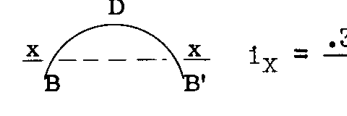
$$
i_x = \frac{0.3 \pi r^3}{I} = 0.3 \times 30^3 / 1.5 = 5400
$$

部材 AC および CA については、

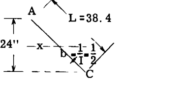
$$
i_x = \frac{1}{12} b L h^2 = \frac{1}{12} \times \frac{1}{2} \times 38.4 \times 24^2 = 922
$$

 $\bar{y}$  = X'X' 基準軸から図心弾性軸 X-X までの距離とする。
$$
\bar{y} = \frac{\sum wy}{\sum w} = \frac{1468}{221.2} = 6.64 \text{ in.}
$$

平行軸の定理により、
$$
I_x = I_{x'} - 6.64^2 (\sum w)
$$
$$
I_x = 262140 - 6.64^2 (221.2) = 252400
$$

解法の次のステップは、静的モーメント弾性重量  $\Phi_s$  とその図心位置を計算することである。Fig. A9.28 において、仮定された静的フレーム条件は、点 A をピン、点 A' をローラーとしたものであり、これにより図に示されるような静的モーメント曲線の一般的な形状が得られる。

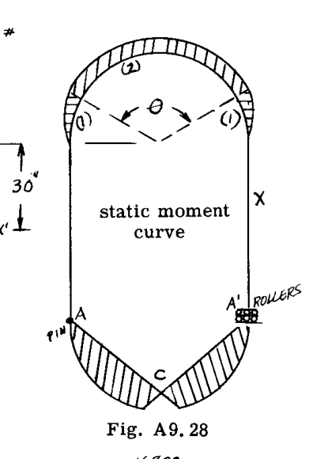

部材 BDB' を考える。
曲げモーメント曲線は、(1) および (2) の 2 つの部分に分けて考えられる。項  $\Phi_s$  は  $M_s/I$  図の面積を表す。

したがって、部分 (1) および (1') については、
$$
\Phi_{s(1)} + \Phi_{s(1')} = 2 \left[ \frac{P r^2}{I} (\alpha - \sin \alpha) \right]
$$
$$
= 2 \left[ \frac{6000 \times 30^2}{1.5} (0.524 - 0.5) \right] = 172800
$$

部分 (1) および (1') についての  $M_s$  曲線の図心から線 BB' までの垂直距離  $y$  は、次の通りである。
$$
y = \frac{r(1 - \cos \alpha - \frac{\sin^2 \alpha}{2})}{\alpha - \sin \alpha} = \frac{30(1 - 0.867 - \frac{0.5^2}{2})}{0.524 - 0.5} = 10 \text{ in.}
$$

 $M_s$  図の部分 (2) について、面積  $\Phi_s$  を算出する  $M_s/I$  図の面積は、
$$
\Phi_{s(2)} = \frac{P r^2 \theta}{I} (1 - \cos \alpha) = \frac{6000 \times 30^2 \times 2.1}{1.5} (1 - 0.867) = 1,007,000
$$

部材 AC について考える。
Fig. A9.31 に示すフレーム下部の自由体図から、曲げモーメントの方程式は次のようになる。

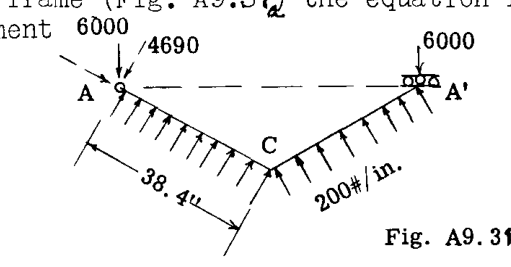

部材 AC 上の  $M_x = 4690 x - 100 x^2$ 

 $I = 2$  のとき、A と C の間の  $M/I$  曲線の面積は、次と等しい。
$$
\frac{1}{2} \int_{0}^{38.4} (4690 x - 100 x^2) dx = \frac{1}{2} \left[ \frac{4690 x^2}{2} - \frac{100 x^3}{3} \right]_0^{38.4} = 784000
$$

A から AC 線に沿った  $M/I$  曲線の図心までの距離  $\bar{x}$  は、
$$
\bar{x} = \frac{\frac{1}{2} \int_{0}^{38.4} (4690 x - 100 x^2) x dx}{784000} = \frac{\frac{1}{2} \left[ \frac{4690 x^3}{3} - \frac{100 x^4}{4} \right]_0^{38.4}}{784000} = 21.77 \text{ in.}
$$

線 AA' から図心までの垂直距離 =  $21.77 \times 24 / 38.4 = 13.6 \text{ in.}$  である。A'C' の静的モーメント重量は AC と同じであるため、
$$
\Phi_{AC} + \Phi_{A'C'} = 2 \times 784000 = 1568000
$$

Fig. A9.29 は、図心に配置されたモーメント重量  $\Phi_s$  と、弾性中心における不静定力  $M_o$  および  $X_o$  を持つフレームを示している。フレームをどこで切断して残留片持ち梁を形成するかは重要ではない。切断された面の一方が弾性中心に接続され、もう一方が固定されていると見なされる。弾性特性と既知のモーメント重量を用いて、不静定量を次のように解くことができる。

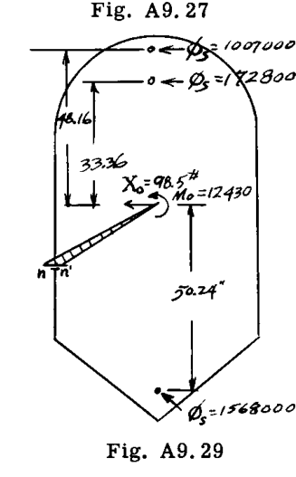

$$
M_o = - \frac{\sum \Phi_s}{\sum w} = - \frac{(1007000 + 172800 + 1568000)}{221.2} = -12430 \text{ lb. in.}
$$
$$
X_o = \frac{\sum \Phi_{sY}}{I_{xx}} = \frac{1007000 \times 48.16 + 172800 \times 33.36 + 1568000 \times -5.24}{252400} = -98.5 \text{ lb.}
$$

 $Y_o$  は、フレームと荷重が対称であるためゼロである。任意の一点における最終的または真の曲げモーメントは次と等しい。
$$
M = M_s + M_o - X_o Y
$$

したがって、点 B については
$$
M_B = 0 + (-12430) - (-98.5 \times 23.36) = -10130 \text{ lb. in.}
$$

点 C については
点 C における  $M_s = 4690 \times 38.4 - 200 \times (38.4)^2 / 2 = 32700$ 
したがって、 $M_C = 32700 - 12430 - (-98.5 \times -60.64) = 14300 \text{ lb. in.}$ 

Fig. A9.30 は、真のフレーム曲げモーメント図の一般的な形状を示している。

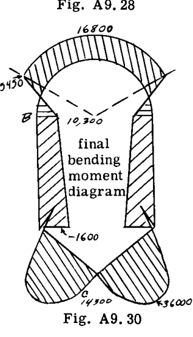

### 例題5.

Fig. A9.31 は、実際の水上機で使用された対称的な船体フレームの半分を示している。このようなフレームにかかる主な外部荷重は、船体底板にかかる水圧である。船体底部のストリンガーは、図示のように底部圧力を集中荷重としてフレーム底部に伝える。フレームの輪郭に接線方向の荷重を及ぼす船体の金属外皮によって、フレームへのこの底部の突き上げ荷重に対する抵抗が提供される。これらの抵抗力の分布に関する問題は、後の章で議論される。この問題では、船体シート内の抵抗せん断流は、チャイン点と上部の重いロンジロンの間で一定であると仮定されている。分析の目的で、フレームは 20 のストリップに分割されている。フレーム断面の中立軸上に位置するこれらのストリップの図心は、Fig. A9.21 において 1 から 20 の番号が付けられている。接線方向の表皮抵抗力は、フレームストリップ #6 から #16 への集中荷重として示されている。図では、これらの接線荷重は水平および垂直成分に置き換えられている。垂直成分の合計は、底部の水圧の垂直成分と等しくなければならない。

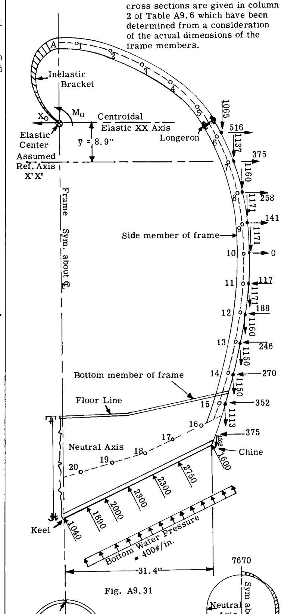

Table A9.5 は、フレームの曲げモーメントを決定するための完全な計算を示している。第1列から第7列は、フレームの弾性特性、すなわちフレームの弾性重量、弾性中心の位置、および水平図心弾性軸まわりの弾性図心慣性モーメントの計算を示している。図示のように、基準水平軸 X'X' が選択されている。表に記録されたすべての距離は、フレームの大きな図面からスケーリングすることによって得られた。

 $M_s$  モーメントを計算するために想定された静的条件は、Fig. A9.32 に例示されているような、二重対称の片持ち梁である。フレームは頂部で切断されて片持ち梁の自由端を形成し、固定端は中心線の底部フレーム断面に取られている。静的曲げモーメント図は弾性中心を通る y 軸に関して対称になり、したがって弾性中心における不静定  $Y_o$  は、項  $\sum \Phi_{sX}$  がゼロになるため、ゼロになる。Table A9.5 の第8列における静的モーメント  $M_s$  を決定するための計算は示されていない。学生は、曲面梁の曲げモーメント計算に関する考え方をリフレッシュするために、第A5章の第A5.9節を参照すべきである。

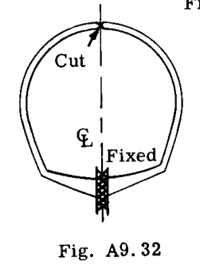
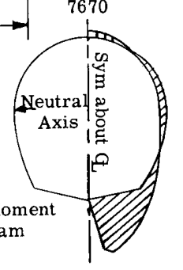

第9列と第10列は、  $\Phi_s$  値（  $M_s/I$  図の面積）と一次モーメント（  $\Phi_{sX}$  値）の計算を示している。第3、9、10列の合計により、表の下に示されるように不静定  $M_o$  および  $X_o$  を解くことができる。任意の一点における最終的な曲げモーメント  $M$  は、単純な静力学により次と等しくなる。
$$
M = M_s + M_o - X_o y
$$

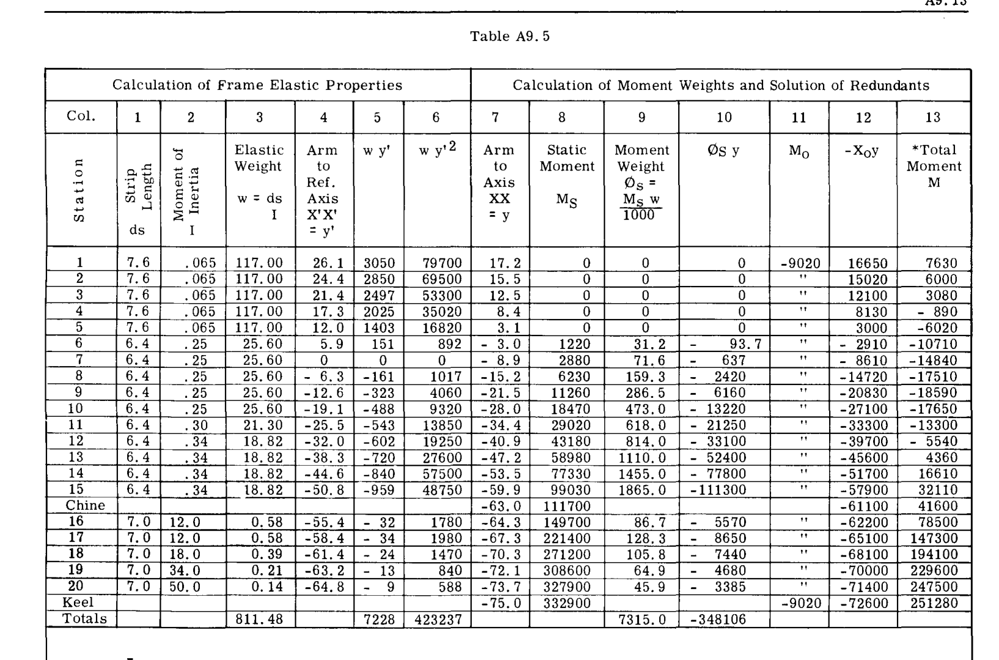

$$\bar{y} = 7228 / 811.48 = 8.9 \text{ in.}$$
$$
I_{XX} = 423237 - 811.48 \times 8.9^2 = 358940
$$
$$
M_o = - \frac{\sum \Phi_s}{\sum w} = - \frac{(7315.7 \times 1000)}{811.5} = -9020 \text{ lb. in.}
$$
$$
X_o = \frac{\sum \Phi_{sY}}{I_{XX}} = \left[ \frac{348106 \times 1000}{35894} \right] = -968 \text{ lb.}
$$

*各ステーションにおける全モーメント  $M = M_s + M_o - X_o y$ 

第11列と第12列は、各ステーション点における  $M_o$  と  $-X_o y$  の値を記録している。例えば、ステーション(1)の  $-X_o y$  の値は  $-(-968 \times 17.2) = 16650$  となり、ステーション(20)では  $-[-968(-73.7)] = -71400$  となる。

Fig. A9.44 は、第13列の値の結果としての最終的なモーメント曲線の形状を示している。

## A9.5 非対称構造。例題の解決。

### 例題1.

Fig. A9.34 は、荷重を受ける非対称フレームを示している。点 A, B, C, D における曲げモーメントを決定せよ。

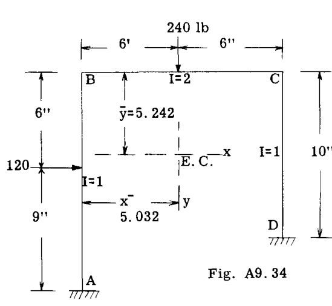

**解法:**
フレームの弾性重量 =  $\sum ds/I = (15/1) + (12/2) + 10/1 = 31$ 

線 AB から弾性中心までの距離  $\bar{x}$  は、
$$
\bar{x} = \frac{(15)0 + 6 \times 6 + 10 \times 12}{31} = 5.032 \text{ in.}
$$

線 BC から弾性中心までの距離  $\bar{y}$  は、
$$
\bar{y} = \frac{15 \times 7.5 + 6 \times 0 + 10 \times 5}{31} = 5.242 \text{ in.}
$$

弾性慣性モーメント  $I_x, I_y$  および慣性相乗モーメント  $I_{xy}$  が必要である。
$$
I_x = \frac{(15)^3}{12} + (15)(2.258)^2 + \frac{(12)}{2}(5.242)^2 + \frac{(10)^3}{12} + (10)(0.242)^2 = 606.51
$$
$$
I_y = (15)(5.032)^2 + \frac{(12)^3}{2 \times 12} + \left(\frac{12}{2}\right)(0.968)^2 + (10)(6.968)^2 = 942.96
$$
$$
I_{xy} = (15)(-5.032)(-2.258) + \left(\frac{12}{2}\right)(0.968)(5.242) + (10)(6.968)(0.242) = 217.74
$$

次のステップは、何らかの静的フレーム条件を仮定し、静的曲げモーメント図を描くことである。Fig. A9.35 は、フレームが点 C 付近で切断され、2 つの片持ち梁が生じたと仮定されたことを示している。この静的条件に対する 3 つの部分に分かれた曲げモーメント図も Fig. A9.35 に示されている。

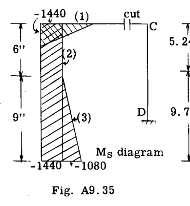
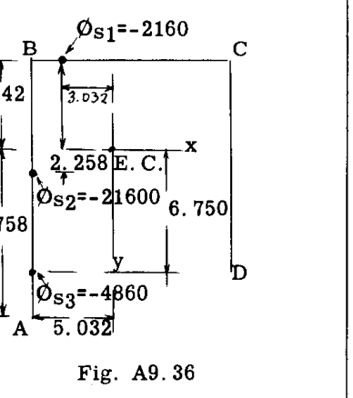

各部分の  $M_s$  図の面積を  $I$  値で割ったものに等しい  $\Phi_s$  値が計算される。
$$
\Phi_{s1} = 3(-1440)/2 = -2160
$$
$$
\Phi_{s2} = -1440 \times 15 = -21600
$$
$$
\Phi_{s3} = 4.5(-1080) = -4860
$$
$$
\sum \Phi_s = -2160 - 21600 - 4860 = -28620
$$

Fig. A9.36 は、フレームの中心線に沿った  $\Phi_s$  値の図心位置を示している。これらの  $\Phi_s$  値の x 軸および y 軸まわりのモーメントを計算する。
$$
\sum \Phi_{sx} = (-2160)(-3.032) + (-21600)(-5.032) + (-4860)(-5.032) = 139700
$$
$$
\sum \Phi_{sy} = (-2160)(5.242) + (-21600)(-2.258) + (-4860)(-6.758) = 70290
$$

弾性中心における不静定の値は、式(11), (14), (15)を用いて計算できる。すなわち、
$$
M_o = - \frac{\sum \Phi_s}{\sum ds/I} = - \frac{(-28620)}{31} = 923 \text{ in. lb.}
$$

$$
X_o = \frac{\sum \Phi_{sy} - \sum \Phi_{sx} \left(\frac{I_{xy}}{I_y}\right)}{I_x (1 - \frac{I_{xy}^2}{I_x I_y})} = \frac{70290 - 139700 \left(\frac{217.74}{942.96}\right)}{606.51 \left(1 - \frac{217.74^2}{606.51 \times 942.96}\right)} = 68.46 \text{ lb.}
$$

$$
Y_o = - \frac{\sum \Phi_{sx} - \sum \Phi_{sy} \left(\frac{I_{xy}}{I_x}\right)}{I_y (1 - \frac{I_{xy}^2}{I_x I_y})} = - \frac{139700 - 70290 \left(\frac{217.74}{606.51}\right)}{942.96 \left(1 - \frac{217.74^2}{606.51 \times 942.96}\right)} = -132.36 \text{ lb.}
$$

式(19)による任意の一点における曲げモーメントは、次のようになる。
$$
M = M_s + M_o - X_o y + Y_o x
$$
例えば、点 A を考える。
 $x = -5.032, y = -9.758, M_s = -2520$ 
$$
M_A = -2520 + 923 - 68.46(-9.758) + (-132.36)(-5.032) = -263 \text{ in. lb.}
$$

点 B.  $x = -5.032, y = 5.242, M_s = -1440$ 
$$
M_B = -1440 + 923 - 68.46 \times 5.242 + (-132.36)(-5.032) = -209 \text{ in. lb.}
$$

点 C.  $x = 6.968, y = 5.242, M_s = 0$ 
$$
M_C = 0 + 923 - 68.46 \times 5.242 + (-132.36)(6.968) = -357 \text{ in. lb.}
$$

したがって、点 D や外荷重が作用する点など、さらにいくつかの値を計算することによって、完全な曲げモーメント図を決定することができる。

### 例題2.

Fig. A9.37 は、非対称な閉じたフレームを示している。与えられたフレーム荷重の下で曲げモーメント図を決定する。

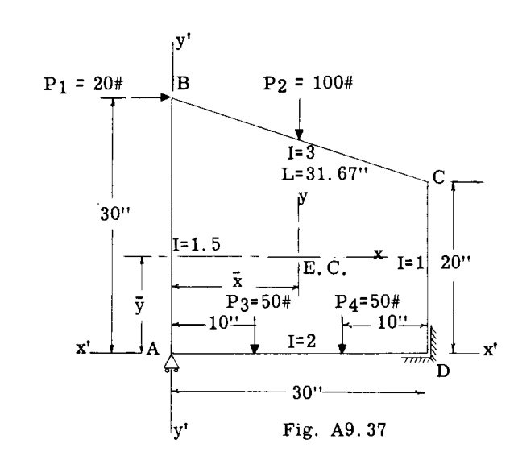

**解法:**
フレームの弾性重量は次の通りである。
$$
\sum \frac{ds}{I} = \frac{30}{1.5} + \frac{31.67}{3} + \frac{20}{1} + \frac{30}{2} = 65.58
$$

弾性軸の位置は、Fig. A9.37 に示すように、仮定された軸 x'x' および y'y' を基準として決定される。
$$
\bar{x} = \frac{(\frac{30}{1.5})(0) + (\frac{31.67}{3})(15) + (\frac{20}{1})(30) + (\frac{30}{2})(15)}{65.58} = 15 \text{ in.}
$$
$$
\bar{y} = \frac{(\frac{30}{1.5})(15) + (\frac{31.67}{3})(25) + (\frac{20}{1})(10) + (\frac{30}{2})(0)}{65.58} = 11.657 \text{ in.}
$$

これらの距離  $\bar{x}$  および  $\bar{y}$  は、Fig. A9.37 に示すように x および y 弾性軸を配置する。

弾性慣性モーメントおよび弾性慣性相乗モーメントを計算する。

** $I_x$  の計算 -**
部材 AB,  $I_x = \frac{1}{3} \times \frac{1}{1.5} (18.343^3 + 11.657^3) = 1723.51$ 
部材 CD,  $I_x = \frac{1}{3} \times \frac{1}{1} (8.343^3 + 11.657^3) = 721.58$ 
部材 BC,  $I_x = \left(\frac{31.67}{3}\right)(13.343^2) + \frac{1}{12} \left(\frac{31.67}{3}\right)(10^2) = 1967.48$ 
部材 AD,  $I_x = \left(\frac{30}{2}\right)(11.657^2) + \frac{1}{12} \times 30 \times (0.5)^3 = 2038.50$ 
全  $I_x = 6451.07$ 

** $I_y$  の計算 -**
部材 AB,  $I_y = \frac{30}{1.5} \times 15^2 + \frac{1}{12} \times 30(0.667)^3 = 4500.7$ 
部材 BC,  $I_y = \frac{1}{12} \times \frac{31.67}{3} \times 30^2 = 791.7$ 
部材 CD,  $I_y = \frac{20}{1} \times 15^2 + \frac{1}{12} \times 20(1)^3 = 4501.7$ 
部材 AD,  $I_y = \frac{1}{12} \times \frac{1}{2} \times 30^3 = 1125.0$ 
全  $I_y = 10919$ 

** $I_{xy}$  の計算 -**
部材 AB,  $I_{xy} = \frac{30}{1.5} (-15)(3.343) = -1002.9$ 
部材 BC,  $I_{xy} = \frac{31.67}{3}(13.343)(0) - \frac{1}{12} \times \frac{31.67}{3} (30)(10) = -263.92$ 
部材 CD,  $I_{xy} = \frac{20}{1} (15)(-1.657) = -497.1$ 
部材 AD,  $I_{xy} = 0$ 
全  $I_{xy} = -1763.9$ 

次のステップは、静的フレーム条件を仮定し、 $M_s$  図を描くことである。Fig. A9.38 は、仮定された静的条件、すなわち点 A でピン留めされ、点 D でローラーで支持された状態を示している。曲げモーメント図は、図示のように各部分に分けて描かれている。

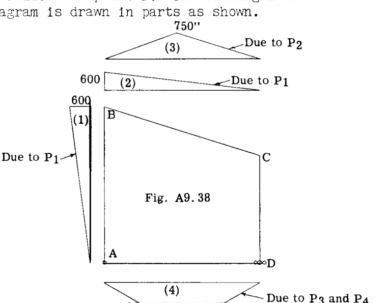

次のステップは、モーメント図の各部分の  $\Phi_s$  の値を計算することである。  $\Phi_s$  は  $M_s/I$  図の面積である。参照のために、 $M_s$  図の部分には 1 から 4 の番号が付けられている。

部分 (1).  $\Phi_s = \frac{600}{2} \times \frac{30}{1.5} = 6000$ 
部分 (2).  $\Phi_s = \frac{600}{2} \times \frac{31.67}{3} = 3167$ 
部分 (3).  $\Phi_s = \frac{31.67}{2} \times \frac{750}{3} = 3958$ 
部分 (4).  $\Phi_s = -500(\frac{10}{2}) - 500(\frac{10}{2}) = -5000$ 

 $\sum \Phi_s = 13125 - 5000 = 8125$ 

個々の  $\Phi_s$  値は、各  $M_s$  図の図心に集中している。Fig. A9.39 は、弾性中心を通る x 軸および y 軸に関する  $\Phi_s$  値の位置を示している。

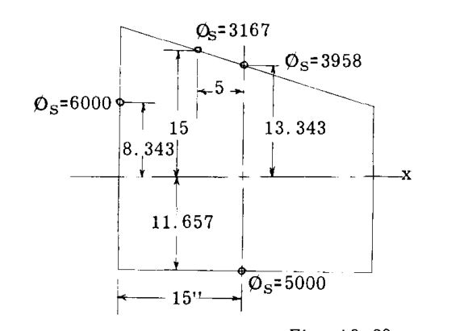

$$\sum \Phi_{sx} = 6000(-15) + 3167(-5) = -105835$$
$$\sum \Phi_{sy} = 6000(8.343) + 3167(15) + 3958(13.343) - 5000(-11.657) = 208659$$

弾性中心における不静定の値は、次のように計算できる。
$$
M_o = - \frac{\sum \Phi_s}{\sum ds/I} = - \frac{(8125)}{65.58} = -124.8 \text{ in. lb.}
$$

$$
X_o = \frac{\sum \Phi_{sy} - \sum \Phi_{sx} \left(\frac{I_{xy}}{I_y}\right)}{I_x (1 - \frac{I_{xy}^2}{I_x I_y})} = \frac{208659 - (-105835) \left(\frac{-1763.9}{10919}\right)}{6451 \left[1 - \frac{(-1763.9^2)}{10919 \times 6451}\right]} = 31.07 \text{ lb.}
$$

$$
Y_o = - \frac{\sum \Phi_{sx} - \sum \Phi_{sy} \left(\frac{I_{xy}}{I_x}\right)}{I_y (1 - \frac{I_{xy}^2}{I_x I_y})} = - \frac{-105835 - 208659 \left(\frac{-1763.9}{6451}\right)}{10919 \left[1 - \frac{(-1763.9^2)}{10919 \times 6451}\right]} = 4.674 \text{ lb.}
$$

任意の一点における曲げモーメントは、元の静的  $M_s$  に Fig. A9.40 に示す不静定量によるモーメントを加えたものに等しい。

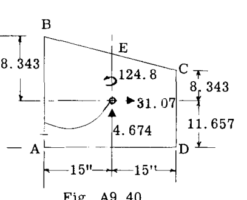
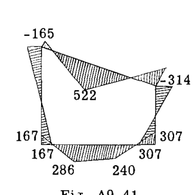

点 A を考える:  $M_s = 0$ 
$$
M_A = 0 - 124.8 - 4.674 \times 15 + 31.07 \times 11.657 = 167 \text{ in. lb.}
$$

点 B.  $M_s = 600$ 
$$
M_B = 600 - 124.8 - 4.674 \times 15 - 31.07 \times 18.343 = -165 \text{ in. lb.}
$$

点 C.  $M_s = 0$ 
$$
M_C = 0 - 124.8 - 31.07 \times 8.343 + 4.674 \times 15 = -314 \text{ in. lb.}
$$

点 D.  $M_s = 0$ 
$$
M_D = 0 - 124.8 + 4.674 \times 15 + 31.07 \times 11.657 = 307 \text{ in. lb.}
$$

Fig. A9.41 は、真の曲げモーメント図を示している。

## A9.6 ピン支持を持つフレームの解析

Fig. A9.42 は、矩形フレームと荷重を示している。このフレームは、固定ではなく点 A と D でピン留めされている点を除いて、第A9.3節の例題1と同じである。

最初のステップは、フレームの弾性重量、弾性中心の位置、および弾性中心を通る軸に関する弾性慣性モーメントを決定することである。

梁要素の長さ  $ds$  に対する項  $ds/EI$  は、その要素が単位モーメントを受けたときの両端面間の角度変化を表す。この章では、この項を要素の弾性重量と呼んできた。物理的には、弾性重量は単位モーメントによって作用を受けたときに要素が回転を生じさせる能力である。単位モーメントが剛な支持部に加えられたとき、支持部は剛であるため回転を生じない。したがって、剛な支持部は弾性重量がゼロであり、フレームの弾性特性には現れない。

支持部がピンまたはヒンジである場合、回転に対する抵抗がないため、ヒンジに作用する単位モーメントは無限の角度変化または回転を生じさせ、したがってヒンジまたはピンは無限の弾性重量を持つ。

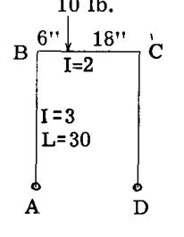
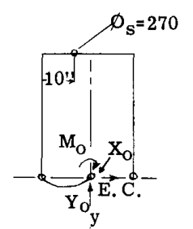
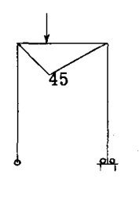

中心線 y 軸に関する構造の対称性により、弾性中心はこの軸上に位置する。A と B の 2 つのヒンジは無限の弾性重量を持つため、フレームの図心または弾性中心は明らかに A と B の中間点に位置する。Fig. A9.43 は、剛なブラケットによって点 A に接続された弾性中心 O を示している。

A と B のヒンジのため、フレームの  $\sum ds/EI$  は無限大である。

弾性中心を通る y 軸まわりの弾性慣性モーメントは、ヒンジ支持部が無限の弾性重量を持つため、無限大である。

 $I_x$  は次のように計算される。
部材 AB について =  $\frac{1}{3} \times \frac{1}{3} \times 30^3 = 3000$ 
部材 CD について =  $\frac{1}{3} \times \frac{1}{3} \times 30^3 = 3000$ 
部材 BC について =  $24 \times \frac{1}{2} \times 30^2 = 10800$ 
 $I_x = 16800$ 

Fig. A9.44 は、  $M_s$  値を得るために仮定された静的フレーム条件を示している。

部材 BC に対する  $\Phi_s$  の値は、  $M_s$  曲線の面積を BC の  $I$  で割ったものに等しく、したがって  $\Phi_s = 45 \times 24 \times 1 / 2 = 270$  となる。この  $\Phi_s$  値の図心は、点 B から 10 インチである。弾性中心における不静定力は、次のように解くことができる。

$$
M_o = - \frac{\sum \Phi_s}{\sum ds/EI} = - \frac{270}{\infty} = 0
$$
$$
Y_o = - \frac{\sum \Phi_{sx}}{I_y} = - \frac{(270)10}{\infty} = 0
$$
$$
X_o = \frac{\sum \Phi_{sy}}{I_x} = \frac{270 \times 30}{16800} = 0.482 \text{ lb.}
$$

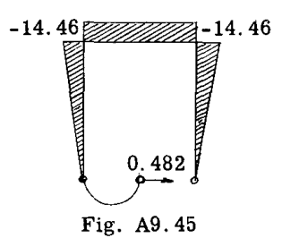
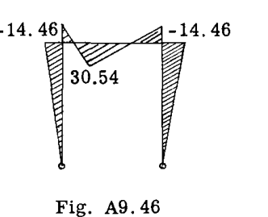

Fig. A9.45 は、不静定  $X_o$  による曲げモーメント図を示している。この図を元の静的図に加えると、Fig. A9.46 に示す最終的な曲げモーメント曲線が得られる。

## A9.7 一端ピン・一端固定支持を持つフレームの解析

Fig. A9.47 は、前の例題と同じフレームと荷重を示しているが、点 D がヒンジではなく固定されている。

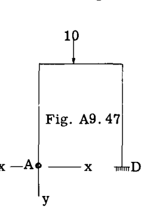

支持部 D は弾性重量がゼロであり、点 A のピンは無限の弾性重量を持っているため、フレームの弾性中心は点 A に位置する。フレームの全弾性重量は、点 A のピンのため無限大である。

A を通る x および y 軸まわりの弾性慣性モーメントが計算される。
$$
I_x = 16800 \text{ (前の例題と同じ)}
$$
$$
I_y = (\frac{30}{3} \times 24^2) + (\frac{1}{3} \times \frac{1}{2} \times 24^3) = 8064
$$
$$
I_{xy} = (\frac{30}{3} \times 15 \times 24) + (\frac{24}{2} \times 30 \times 12) = 7920
$$

静的フレーム条件は前の例題と同じであると仮定され、したがって  $\Phi_s = 270$  であり、B から 10" の位置に作用する (Fig. A9.48)。

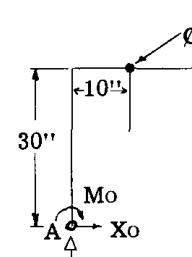
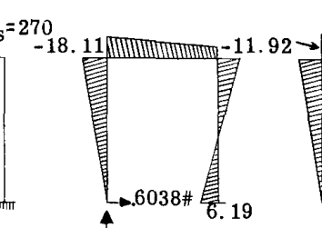
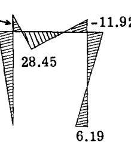

フレームが非対称であるため、A を通る x および y 軸は主軸ではなく、したがって不静定量は次のようになる。

$$
X_o = \frac{\sum \Phi_{sy} - \sum \Phi_{sx} (\frac{I_{xy}}{I_y})}{I_x (1 - \frac{I_{xy}^2}{I_x I_y})}
$$
$$
= \frac{270 \times 30 - 270 \times 10 (\frac{7920}{8064})}{16800 (1 - \frac{7920^2}{16800 \times 8064})} = 0.6038 \text{ lb.}
$$

$$
Y_o = - \left[ \frac{\sum \Phi_{sx} - \sum \Phi_{sy} (\frac{I_{xy}}{I_x})}{I_y (1 - \frac{I_{xy}^2}{I_x I_y})} \right]
$$
$$
= - \left[ \frac{270 \times 10 - 270 \times 30 (\frac{7920}{16800})}{8064 (1 - \frac{7920^2}{16800 \times 8064})} \right] = 0.2582 \text{ lb.}
$$

$$
M_o = - \frac{\sum \Phi_s}{\sum ds/EI} = - \frac{270}{\infty} = 0
$$

Fig. A9.49 は、点 A における不静定の値を示している。点 B, C, D における曲げモーメントは次の通りである。
$$
M_B = -0.6038 \times 30 = -18.11 \text{ in. lb.}
$$
$$
M_C = -18.11 + 0.2582 \times 24 = -11.92
$$
$$
M_D = 0.2582 \times 24 = 6.19
$$

静的モーメント曲線を加えると、Fig. A9.50 の最終的なモーメント曲線が得られる。

## A9.8 主軸を用いた非対称フレームの解決

Fig. A9.51 のフレームにおいて、弾性中心を通る x 軸および y 軸は、弾性慣性相乗モーメント  $I_{xy}$  がゼロでないため、主軸ではない。しかし、Fig. A9.52 に示す主軸  $x_p$  および  $y_p$  については、慣性相乗モーメントはゼロである。したがって、弾性中心における不静定力が Fig. A9.52 に示すような主軸を基準としている場合、不静定量の式は対称構造の場合と同じ形式になり、すなわち、

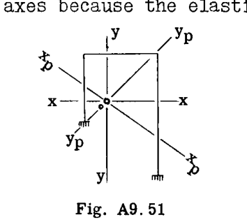
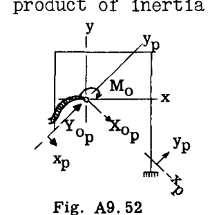

$$
M_o = - \frac{\sum \Phi_s}{\sum ds/I} \text{ (同じ)} \quad --(19)
$$
$$
X_{op} = \frac{\sum \Phi_{sy_p}}{I_{x_p}} \quad --(20)
$$
$$
Y_{op} = - \frac{\sum \Phi_{sx_p}}{I_{y_p}} \quad --(21)
$$

ここで、 $I_{x_p}$  および  $I_{y_p}$  は主軸まわりの弾性慣性モーメントであり、 $y_p$  および  $x_p$  は  $\Phi_s$  荷重から主軸までの垂直距離である。

著者は、主軸の位置、これらの軸まわりの特性、およびこれらの軸に対する垂直距離を求める必要がない、より長い式(14)および(15)を使用することを好む。これにより、必要な数値計算量が減少するためである。

学生は、2 つの解決方法を比較するために、式(19), (20), (21)を使用して第A9.5節の例題1を解くべきである。

## A9.9 問題

(1) Figs. A9.52, 53 および 54 は、3 つの異なる荷重を持つ同じフレームを示している。各荷重について曲げモーメント図を決定せよ。

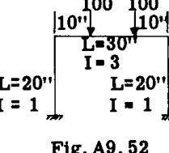
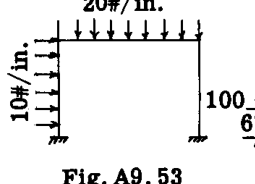
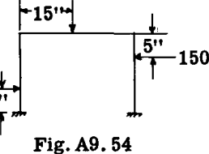

(2) Figs. A9.55, 56 および 57 は、3 つの異なる荷重を持つ同じフレームを示している。各荷重について曲げモーメント図を決定せよ。

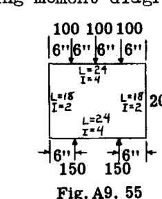
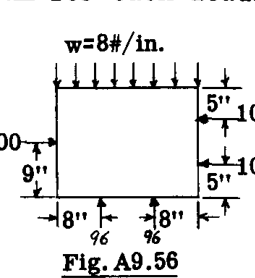
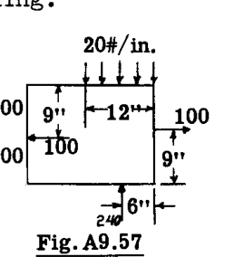

(3) Figs. A9.57 および A9.58 のフレームと荷重について、曲げモーメント図を決定せよ。

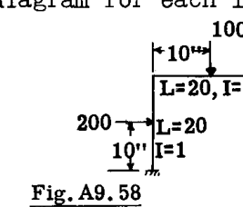
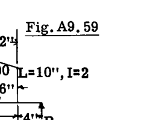

(4) Figs. A9.59 および A9.60 に示すようなフレームと荷重について、曲げモーメント図を決定せよ。

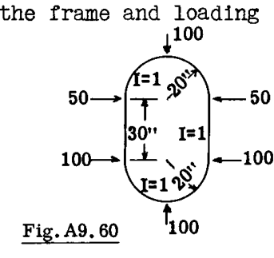
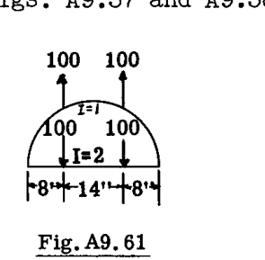