# 第A10章  
# 不静定構造物  
# 特殊解法 - カラム・アナロジー法  

## A10.1 概要  
カラム・アナロジー法*（柱相似法）は、折れ曲がり形式やリング形式の構造物の曲げモーメントを決定する際に、エンジニアによって広く利用されている手法である。この手法は、構造物の曲げによる歪みのみを考慮する。  

カラム・アナロジー法を使用する際の数値計算作業は、第A9章の弾性中心法（Elastic Center Method）を適用して行われるものと実質的に同一である。  

## A10.2 カラム・アナロジー法の一般的説明  
Fig. A10.1は、断面の主軸  $x$  および  $y$  から距離  $(a)$  および  $(b)$  の位置にある荷重  $P$  によって圧縮荷重を受ける短い柱を示している。  

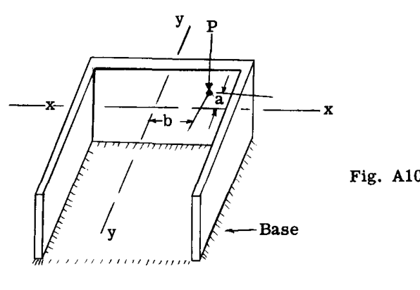  

支持基部と柱の下端との間の支圧応力を求めるには、荷重  $P$  を柱の図心に移動させ、さらに主軸まわりのモーメントを加えるのが便利である。ここで、 $yy$  軸および  $xx$  軸から距離  $x$  および  $y$  の位置にある点における支圧応力の強さを  $\sigma$  とすると、次のように書くことができる。  

$$
\sigma = \frac{P}{A} + \frac{(Pa)y}{I_{x}} + \frac{(Pb)x}{I_{y}}
$$

ここで、 $A$  は柱の断面積であり、 $Pa$  および  $Pb$  はそれぞれ  $xx$  軸および  $yy$  軸まわりの荷重  $P$  のモーメントである。 $Pa = M_{x}$  および  $Pb = M_{y}$  とすると、上記の式は次のように書ける。  

$$
\sigma = \frac{P}{A} + \frac{M_{x}y}{I_{x}} + \frac{M_{y}x}{I_{y}} \quad - - - (1)
$$

今、中心線の長さと形状が Fig. A10.1 の柱の断面と同一であるフレームを想定する。このフレームの各部分の幅は、部材の  $1/EI$  に比例するものとする。Fig. A10.2 は、この想定されたフレームを示している。さらに、フレームの端  $B$  が固定されており、剛なブラケットが端  $A$  に取り付けられ、フレームの弾性中心である点  $(O)$  で終わっていると仮定する。フレームは外荷重  $w_{1}, w_{2}$  などにさらされている。  

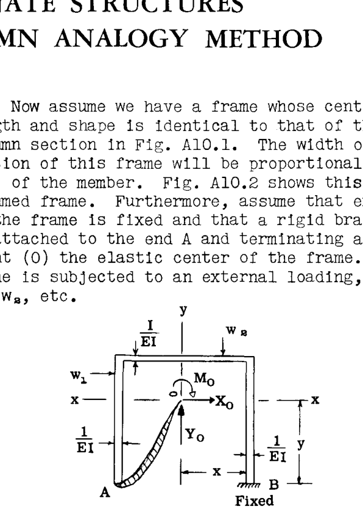  

この片持ち構造は、外荷重系  $w_{1}, w_{2}$  などの下で曲げ歪みを受け、点  $(O)$  が変位する。点  $(O)$  は、Fig. A10.2 に示すように、 $(O)$  に偶力と2つの力、すなわち  $M_{O}, X_{O}, Y_{O}$  を加えることによって、元のたわみのない位置に戻すことができる。点  $(O)$  は剛なブラケットによってフレーム端  $A$  に取り付けられているため、弾性中心  $(O)$  におけるこれら3つの力によって点  $A$  は静止したまま、言い換えれば固定された状態になる。したがって、 $A$  と  $B$  で固定された Fig. A10.2 のフレームに対して、弾性中心に作用するモーメントと2つの力は、静定モーメント  $M_{s}$  を生じさせる特定の外荷重に抵抗する際の不静定モーメント  $M_{1}$  を引き起こす。フレーム上の点における最終的な真の曲げモーメント  $M$  は、次のように等しくなる。  

$$
M = M_{s} - M_{1}
$$

Fig. A10.2 より、フレーム上の  $B$  のような点について、不静定曲げモーメント  $M_{1}$  は次のように書ける。  

$$
M_{1} = M_{O} + X_{O}y + Y_{O}x \quad - - - - - - - - (2)
$$

第A9章のArt. A9.3において、 $M_{O}, X_{O}, Y_{O}$  の式が導出された。それらは、  

$$
M_{O} = \frac{\sum \phi_{s}}{\sum ds/I}, \quad Y_{O} = \frac{\sum \phi_{s}x}{I_{y}}, \quad X_{O} = \frac{\sum \phi_{s}y}{I_{x}}
$$

用語  $\sum \phi_{s}$  は、静的な  $M_{s}/I$  曲線の面積を表す（ $E$  は一定と仮定して省略されている）。用語  $\sum \phi_{s}$  を弾性荷重（elastic load）と呼び、それに新しい記号  $P$  を与える。用語  $\sum ds/I$  はフレームの弾性重量（elastic weight）に等しく、各部材の長さにその幅（ $1/I$  に等しい）を掛けたものの合計に等しい。このフレームの総弾性重量を新しい記号  $A$  とする。  

 $Y_{O}$  および  $X_{O}$  の式において、項  $\sum \phi_{s}x$  および  $\sum \phi_{s}y$  は、フレームの弾性中心を通るそれぞれ  $y$  軸および  $x$  軸まわりの荷重として作用する静的な  $M_{s}/I$  曲線のモーメントを表す。したがって、 $\sum \phi_{s}x$  を新しい記号  $M_{y}$  とし、 $\sum \phi_{s}y$  を新しい記号  $M_{x}$  とする。これらの新しい記号を用いると、式 (2) は次のように書き換えることができる。  

$$
M_{1} = \frac{P}{A} + \frac{M_{x}y}{I_{x}} + \frac{M_{y}x}{I_{y}} \quad - - - - - - - - (3)
$$

式 (1) と式 (3) を比較すると、それらが類似していることがわかる。言い換えれば、フレームにおける不静定曲げモーメント  $M_{1}$  は、柱の支圧応力  $\sigma$  と相似である。それゆえ、式 (1) を用いる手法に対して「カラム・アナロジー（柱相似法）」という名称が付けられた。この一般的な説明により、いくつかの例題の解法を示すことで、この手法を明確に説明することができる。  

## A10.3 1つの対称軸を持つフレーム  
前述の議論から、次のように書くことができる。  

(1) 相似柱（analogous column）の断面は、与えられたフレームと同じ形状の面積で構成され、各部分の厚さはその部分の  $1/EI$  に等しい。  

(2) 相似柱の頂面に加えられる荷重は、 $M_{s}/EI$  図に等しい。ここで  $M_{s}$  は、与えられたフレームから派生した任意の基本静定構造における静定モーメントである。 $M_{s}$  がフレームの内面に曲げ圧縮を生じさせる場合、それは正の曲げモーメントであり、相似柱上の荷重  $P$  は下向きに作用する。  

(3) フレームの特定の点における不静定曲げモーメント  $M_{1}$  は、相似柱の同じ点における底面応力に等しい。したがって、フレーム上の任意の点における不静定モーメントは（式3より）次のように等しくなる。  

$$
M_{1} = \frac{P}{A} + \frac{M_{x}y}{I_{x}} + \frac{M_{y}x}{I_{y}} \quad - - - - - - - - (4)
$$

(4) 任意の点における最終的な真の曲げモーメント  $M$  は、次のように等しくなる。  

$$
M = M_{s} - M_{1} \quad - - - - - - - - - - - (5)
$$

### 例題 1  
Fig. A10.3は、点  $A$  および  $D$  で固定支持された矩形フレームを示している。点  $A, B, C, D$  における曲げモーメントをカラム・アナロジー法によって決定する。このフレームと荷重は、第A9章のArt. A9.4の例題1と同一であり、そこでは弾性中心法によって解が求められた。  

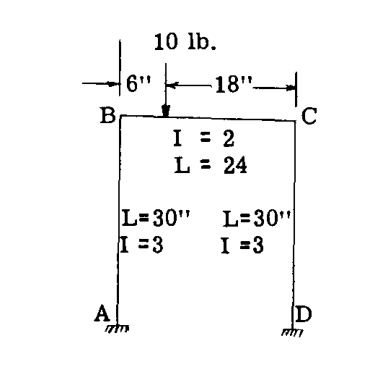  
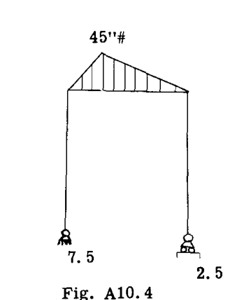  

### 解答 NO. 1  
まず、Fig. A10.3に示すフレームの中心線形状を短い柱の断面積として考える（Fig. A10.5参照）。柱断面の各部分の幅は、部材断面の  $1/EI$  に等しい。 $E$  は一定であるため、これを1とすると、幅は  $1/I$  に等しくなる。  

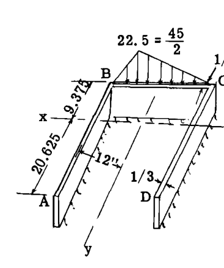  
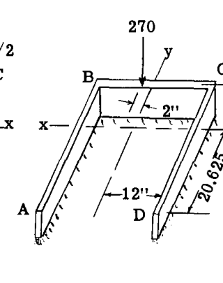  

計算の最初のステップは、Fig. A10.5の柱断面の面積  $(A)$  と、図心軸  $x$  および  $y$  まわりの柱断面の慣性モーメントを計算することである。  

$$
Area \, A = \sum \frac{ds}{I} = \frac{30}{3} + \frac{30}{3} + \frac{24}{2} = 32
$$

図心軸の位置および慣性モーメント  $I_{x}$  と  $I_{y}$  の計算は、Art. A9.4 および Table A9.1 で示された完全な計算と同一であり、そこではこの同じ問題が弾性中心法によって解かれている。これらの計算はここでは繰り返さない。結果は  $I_{x} = 3188$  および  $I_{y} = 3456$  であった。  

フレームは不静定であるため、次のステップは、与えられたフレームおよび荷重と一致する静的なフレーム条件を仮定することである。Fig. A10.4はこの解のために想定された条件、すなわち点  $A$  でピン支持、点  $D$  でローラー支持された状態を示している。したがって、静定  $M_{s}$  図は Fig. A10.4 に示すようになる。次に、Fig. A10.5 に示すように、相似柱の断面に  $M_{s}/I$  図を荷重として載せる。静定モーメントの符号は、静定条件がフレームの内面に引張を生じさせるため正となる。カラム・アナロジー法において、正の  $M_{s}/I$  荷重は柱の頂面への下向きまたは圧縮荷重であり、したがって負の  $M_{s}/I$  値は上向きまたは引張荷重となる。  

式 (3) は、 $x$  軸および  $y$  軸まわりの荷重としての  $M_{s}/I$  図のモーメントである  $M_{x}$  および  $M_{y}$  の値を必要とする。式 (3) はまた、 $M_{s}/I$  図の面積に等しい相似柱の総荷重  $P$  も必要とする。  

この問題において、Fig. A10.5 から得られる  $P$  の値は次の通りである。  

$$
P = 22.5 \times 24 / 2 = 270
$$

この三角形荷重の図心は  $y$  軸から2インチ左にある。Fig. A10.6 は、この合力荷重  $P$  を伴う柱断面を示している。  

次に、柱の底面応力に等しい不静定モーメント  $M_{1}$  を求めるために式 (3) を使用する。式 (3) には、曲げモーメント  $M_{x}, M_{y}$  および距離  $x, y$  が含まれており、これらはすべて符号を持つ必要がある。符号は次のように決定される。  

- モーメント  $M_{x}$  が  $x$  軸より上の部分で底面に圧縮を生じさせる場合、 $M_{x}$  は正である。  
- モーメント  $M_{y}$  が  $y$  軸より右の部分で底面に圧縮を生じさせる場合、 $M_{y}$  は正である。  
-  $x$  軸から上向きに測った距離  $y$  は正であり、下向きに測った距離は負である。  
-  $y$  軸から右向きに測った距離  $x$  は正であり、左向きに測った距離は負である。  

Fig. A10.6 より：  

$$
P = 270
$$

$$
M_{x} = 270 \times 9.375 = 2530 \quad \text{（x軸より上の柱部分で底面応力が圧縮となるため正）}
$$

$$
M_{y} = - (270 \times 2) = - 540 \quad \text{（y軸より右の柱部分で底面応力が引張となるため負）}
$$

式 (3) への代入：  

**フレーム点 A.**   $x = - 12", \, y = - 20.625"$   

$$
M_{1} = \frac{P}{A} + \frac{M_{x}y}{I_{x}} + \frac{M_{y}x}{I_{y}}
$$

$$
M_{1} = \frac{270}{32} + \frac{2530 (-20.625)}{3188} + \frac{(-540)(-12)}{3456}
$$

$$
= 8.44 - 16.38 + 1.88 = - 6.06 \, \text{in.lb.}
$$

式 (5) からの真の曲げモーメント：  

$$
M = M_{s} - M_{1}
$$

 $M_{s} = 0$ , Fig. A10.5 参照。  

ゆえに、  $M_{A} = 0 - (-6.06) = 6.06 \, \text{in.lb.}$   

**フレーム点 B.**   $x = - 12", \, y = 9.325"$   

$$
M_{1} = \frac{270}{32} + \frac{2530 \times 9.375}{3188} + \frac{(-540)(-12)}{3456}
$$

$$
= 8.44 + 7.44 + 1.88 = 17.77
$$

$$
M_{B} = M_{s} - M_{1} = 0 - (17.77) = - 17.77 \, \text{in.lb.}
$$

**フレーム点 C.**   $x = 12, \, y = 9.325$   

$$
M_{1} = \frac{270}{32} + \frac{2530 \times 9.325}{3188} + \frac{(-540)12}{3456}
$$

$$
= 8.44 + 7.44 - 1.88 = 14.0
$$

$$
M_{C} = M_{s} - M_{1} = 0 - (14.0) = - 14.0 \, \text{in.lb.}
$$

**フレーム点 D.**   $x = 12, \, y = - 20.625$   

$$
M_{1} = \frac{270}{32} + \frac{2530 (-20.625)}{3188} + \frac{(-540)12}{3456}
$$

$$
= 8.44 - 16.38 - 1.88 = - 9.82
$$

$$
M_{D} = M_{s} - M_{1} = 0 - (-9.82) = 9.82 \, \text{in.lb.} $Fig. A10.7は最終的な曲げモーメント図を示しており、これは当然、Art. A9.4の弾性中心法による解と一致する。相似柱法における数値計算は、弾性中心法と実質的に同じであることに学生は注目すべきである。  

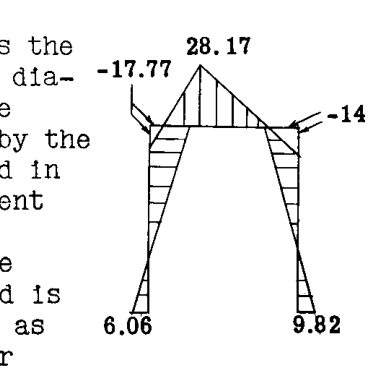  

### 解答 NO. 2  
この解法では、Fig. A10.8に示すように異なる静的なフレーム条件を仮定する。すなわち、荷重の直下でフレームを切断し、10 lb. の荷重の半分がそれぞれの片持ち部分にかかると想定する。Fig. A10.9は静定モーメント図を、Fig. A10.10は各部分の図心の位置を示す静的な$ M_{s}/I $図を示している。これらは (1), (2), (3) および (4) と番号付けされている。これら各部分の面積は Fig. A10.11 の相似柱上の荷重$ P_{1}, P_{2}$ などとなる。静定モーメントは各部分で負であるため、相似柱断面上の荷重は上向きとなる。  

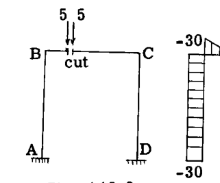  
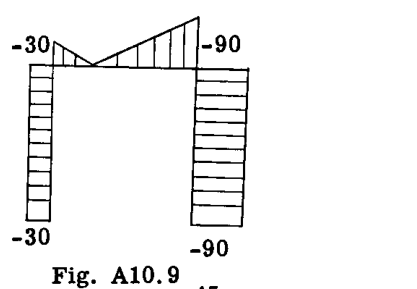  
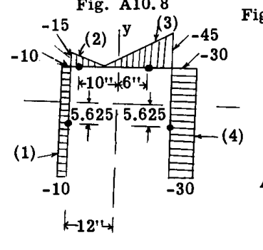  
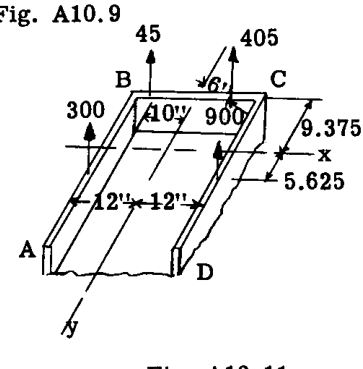  

$$
P_{1} = - 10(30) = - 300, \quad P_{3} = - 45 \times 9 = - 405
$$
$$
P_{2} = - 15(6)/2 = - 45, \quad P_{4} = - 30 \times 30 = - 900
$$
$$
P = \sum P = - 300 - 45 - 405 - 900 = - 1650
$$

Fig. A10.11 より：  

$$
M_{x} = - (45 + 405) 9.375 + (300 + 900) 5.635 = 2531
$$

$$
M_{y} = 300 \times 12 + 45 \times 10 - 405 \times 6 - 900 \times 12 = - 9180
$$

$$
M_{1} = \frac{P}{A} + \frac{M_{x}y}{I_{x}} + \frac{M_{y}x}{I_{y}}
$$

**点 A.**   $x = - 12, \, y = - 20.625$   

$$
M_{1} = \frac{-1650}{32} + \frac{2531 (-20.625)}{3188} + \frac{(-9180)(-12)}{3456} = - 36.06
$$

$$
M_{A} = M_{s} - M_{1} = - 30 - (-36.06) = 6.06 \, \text{in.lb.}
$$
これは解答1と一致する。  

**点 B.**   $x = - 12, \, y = 9.375$   

$$
M_{1} = \frac{-1650}{32} + \frac{2531 \times 9.325}{3188} + \frac{(-9180)(-12)}{3456} = - 12.23
$$

$$
M_{B} = M_{s} - M_{1} = - 30 - (-12.33) = - 17.77 \, \text{in.lb.}
$$

**点 C.**   $x = 12, \, y = 9.375$   

$$
M_{1} = \frac{-1650}{32} + \frac{2531 \times 9.375}{3188} + \frac{(-9180)12}{3456} = - 76.0
$$

$$
M_{C} = M_{s} - M_{1} = - 90 - (-76.0) = - 14.0 \, \text{in.lb.}
$$

**点 D.**   $x = 12, \, y = - 20.625$   

$$
M_{1} = \frac{-1650}{32} + \frac{2531 (-20.625)}{3188} + \frac{(-9180)12}{3456} = - 99.82
$$

$$
M_{D} = M_{s} - M_{1} = - 90 - (-99.82) = 9.82 \, \text{in.lb.}
$$

このように、解答2は解答1と一致する。学生は他の静的条件を用いてこの問題を解いてみるべきである。  

## A10.4 非対称フレームまたはリング  
カラム・アナロジー法を非対称なフレームやリングに適用する場合、 $M/EI$  図のモーメントは主軸まわりで計算し、慣性モーメントは主軸に対して求める必要がある。  

しかし、第A9章の弾性中心法で説明したように、断面特性が主軸まわりではなく図心軸に対して計算されている場合、 $M_{x}, M_{y}, I_{x}, I_{y}$  を修正して構造物の非対称性を考慮することができる。Art. A9.2 において、非対称フレーム断面における弾性中心での不静定力は次のように示された（Art. A9.2 の式11, 14, 15を参照）。  

$$
M_{O} = \frac{\sum \phi_{s}}{\sum ds/EI} = \frac{P}{A} \quad \text{（対称フレームと同じ）}
$$

$$
X_{O} = \frac{\sum \phi_{s}y - \sum \phi_{s}x (\frac{I_{xy}}{I_{y}})}{I_{x} (1 - \frac{I_{xy}^{2}}{I_{x}I_{y}})} \quad - - - - - - - (a)
$$

$$
Y_{O} = \frac{\sum \phi_{s}x - \sum \phi_{s}y (\frac{I_{xy}}{I_{x}})}{I_{y} (1 - \frac{I_{xy}^{2}}{I_{x}I_{y}})} \quad - - - - - - - (b)
$$

Art. A10.2 で以前に行ったように、次のように置く。  

 $M_{y} = \sum \phi_{s}x$  および  $M_{x} = \sum \phi_{s}y$   

さらに、次のように置く。  

 $M_{y}' = M_{y} - M_{x} (\frac{I_{xy}}{I_{x}})$  および  $M_{x}' = M_{x} - M_{y} (\frac{I_{xy}}{I_{y}})$ 

および  $k = (1 - \frac{I_{xy}^{2}}{I_{x}I_{y}})$ 

これらを式 (a) および (b) に代入すると、次式が得られる。  

$$
X_{O} = \frac{M_{x} - M_{y}'}{k I_{x}}, \quad Y_{O} = \frac{M_{y} - M_{x}'}{k I_{y}}
$$

式 (2) より、  

$$
M_{1} = M_{O} + X_{O}y + Y_{O}x
$$

 $X_{O}$  および  $Y_{O}$  の値をこの式に代入すると、カラム・アナロジー法における不静定モーメント  $M_{1}$  の式として次が得られる。  

$$
M_{1} = \frac{P}{A} + \frac{(M_{x} - M_{y}')y}{k I_{x}} + \frac{(M_{y} - M_{x}')x}{k I_{y}} \quad - - - (6)
$$

真のモーメントは対称断面の場合と同じで、すなわち、  

$$
M = M_{s} - M_{1}
$$

したがって、カラム・アナロジー法による非対称フレームの解法は、式 (3) の代わりに式 (6) が使用されることを除いて、対称断面と同じ手順に従う。  

## A10.5 例題 - 非対称断面  
Fig. A10.12 は、点  $A$  および  $D$  で固定された荷重を受けた非対称フレームを示している。点  $A, B, C, D$  における真の曲げモーメントを求めよ。この問題は、弾性中心法による解が示された Art. A9.5 の例題 1 と同一である。  

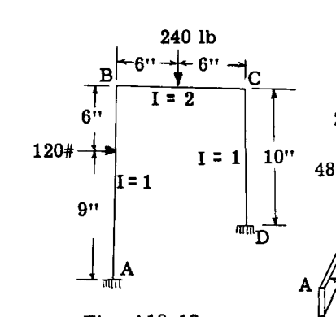  

### 解答  
Fig. A10.13 は、相似柱の断面積を示している。柱断面の各部分の長さは Fig. A10.12 と同じであり、各部分の幅は  $1/I$  である。解法の最初のステップは、柱の断面特性を求めることである。  

相似柱の総面積  $(A)$  は、  $(15/1) + (10/1) + (12/2) = 31$  に等しい。  

他に必要となる特性は、  $I_{x}, I_{y}, I_{xy}$  である。  

図心軸  $x$  および  $y$  の位置、およびこれらの軸まわりの上記の特性を決定する計算は、第A9章の例題1（同じ問題が弾性中心法で解かれている）で示されたものと同一である。結果は  $I_{x} = 606.51, I_{y} = 942.96, I_{xy} = 217.74$  であった。軸の位置は Fig. A10.13 に示す通りである。  

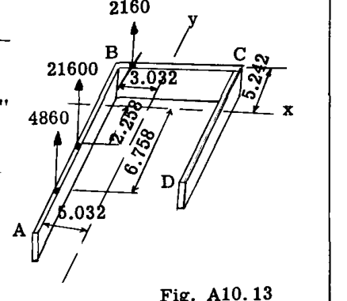  

解法の次のステップは、静的なフレーム条件を選択し、静定モーメント  $(M_{s})$  図を決定することである。Fig. A10.14 は、フレームが切断されたために2つの片持ち梁となる想定された静的条件を示している。図にはまた、(1), (2), (3) と番号付けされた3つの部分からなる静的曲げモーメント図も示されている。モーメント図の各部分の面積をそのフレーム部分の  $(I)$  で割ったものが、柱上の荷重  $P$  を与える。  

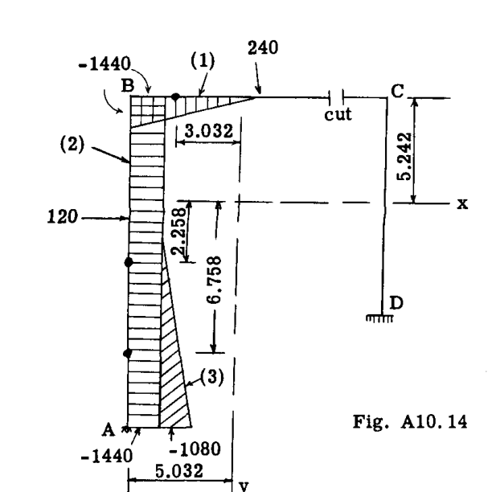  

$$
P_{1} = - 1440 \times 3 / 2 = - 2160
$$
$$
P_{2} = - 1440 \times 15 / 1 = - 21600
$$
$$
P_{3} = - 1080 \times 4.5 / 1 = - 4860
$$
$$
\sum P = - 28620
$$

これらの荷重はフレーム部材の中心線上に作用し、幾何学的なモーメント図形状の図心を通る。これらの図心の位置は Fig. A10.14 に太い点で示されており、それらの位置は図心軸  $x$  および  $y$  に対して与えられている。荷重  $P_{1}, P_{2}, P_{3}$  は負であるため、Fig. A10.13 の柱上に上向きに配置される。  

ここで、図心軸まわりの荷重  $P$  のモーメントに等しいモーメント  $M_{x}$  および  $M_{y}$  を求める。  

$$
M_{x} = - 2160 \times 5.242 + 21600 \times 2.258 + 4860 \times 6.758 = 70290
$$

$$
M_{y} = 2160 \times 3.032 + 21600 \times 5.032 + 4860 \times 5.032 = 139700
$$

式 (6) を解くためには、項  $M_{x}', M_{y}', k$  が必要である。  

$$
M_{x}' = M_{x} (\frac{I_{xy}}{I_{x}}) = 70290 \times 217.74 / 606.51 = 25234
$$

$$
M_{y}' = M_{y} (\frac{I_{xy}}{I_{y}}) = 139700 \times 217.74 / 942.96 = 32258
$$

$$
k = (1 - \frac{I_{xy}^{2}}{I_{x}I_{y}}) = (1 - \frac{217.74^{2}}{606.51 \times 942.96}) = 0.9171
$$

式 (6) に値を代入すると、次が得られる。  

$$
M_{1} = \frac{-28620}{31} + \frac{(70290 - 32258)y}{0.9171 \times 606.51} + \frac{(139700 - 25234)x}{0.9171 \times 942.96}
$$

ゆえに、  

$$
M_{1} = - 923 + 68.37y + 132.36x \quad - - - - - (7)
$$

**フレーム点 A.**   $x = - 5.032, \, y = - 9.758$   

$$
M_{1} = - 923 + 68.37 (-9.758) + 132.36 (-5.032)
$$
$$
= - 923 - 667.15 - 666.0 = - 2256
$$

$$
M_{A} = M_{s} - M_{1} = - 1440 - 1080 - (-2256) = - 264 \, \text{in.lb.}
$$

**フレーム点 B.**   $x = - 5.032, \, y = 5.242$   

$$
M_{1} = - 923 + 68.37 \times 5.242 + 132.36 (-5.032)
$$
$$
= - 923 + 358.39 - 666.0 = - 1230.6
$$

$$
M_{B} = M_{s} - M_{1} = - 1440 - (-1230.6) = - 209.4 \, \text{in.lb.}
$$

**フレーム点 C.**   $x = 6.968, \, y = 5.242$   

$$
M_{1} = - 923 + 68.37 \times 5.242 + 132.36 \times 6.968 = 357.7
$$

$$
M_{C} = M_{s} - M_{1} = 0 - (357.7) = - 357.7 \, \text{in.lb.}
$$

**フレーム点 D.**   $x = 6.968, \, y = - 4.758$   

$$
M_{1} = - 923 + 68.37 (-4.758) + 132.36 \times 6.968 = - 326
$$

$$
M_{D} = M_{s} - M_{1} = 0 - (-326) = 326 \, \text{in.lb.}
$$

上記の結果は、Art. A9.5 の弾性中心法による同じ問題の解と一致する。学生は他の静的なフレーム条件を選択してこの問題を解いてみるべきである。  

## A10.6 問題  
(1) Fig. A10.15 から A10.20 の荷重構造について曲げモーメント図を決定せよ。  

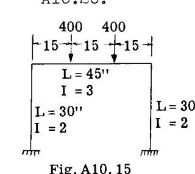  
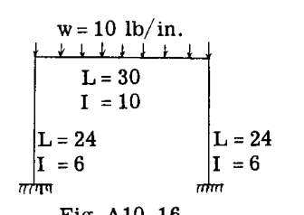  
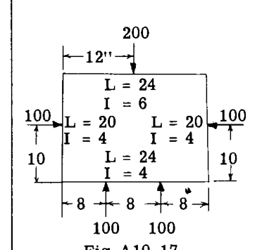  
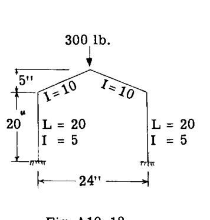  
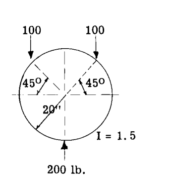  
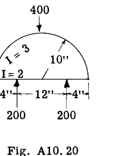  

(2) 第A9章のArt. A9.9の最後にある問題 (2) および (3) を解け。