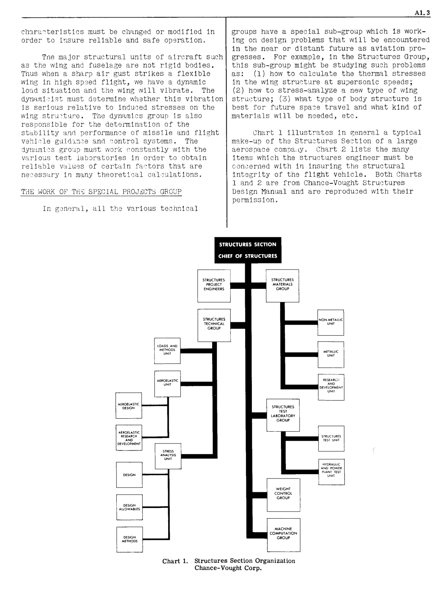
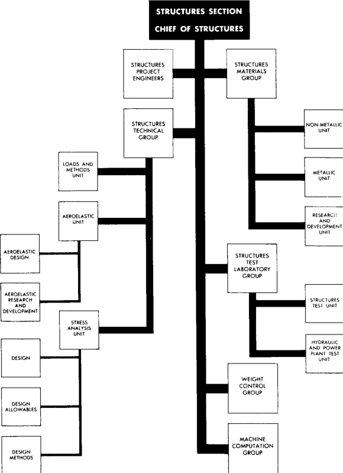
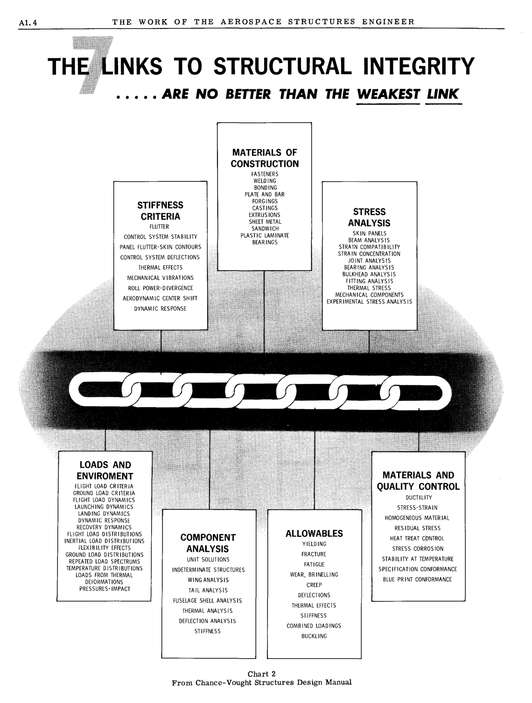
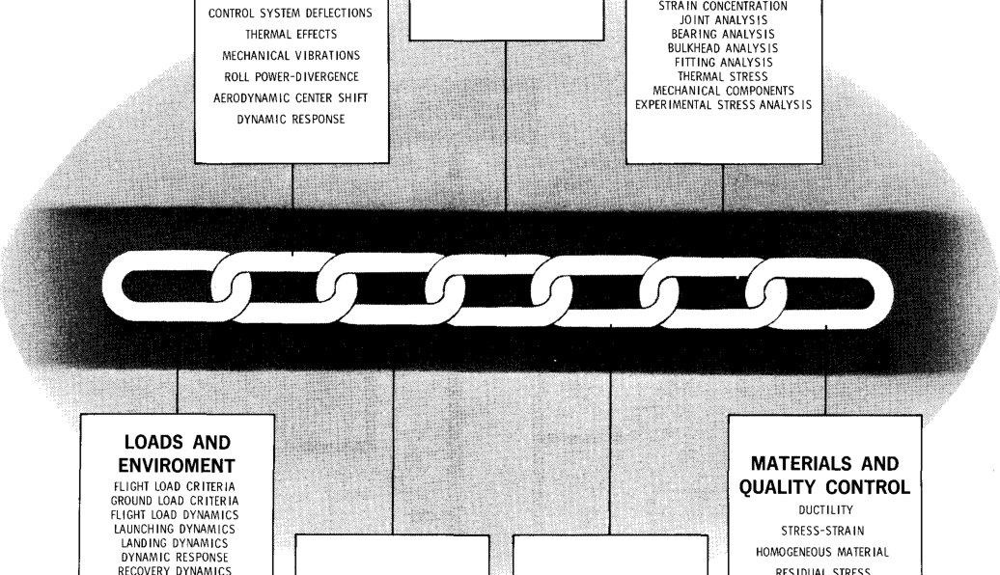
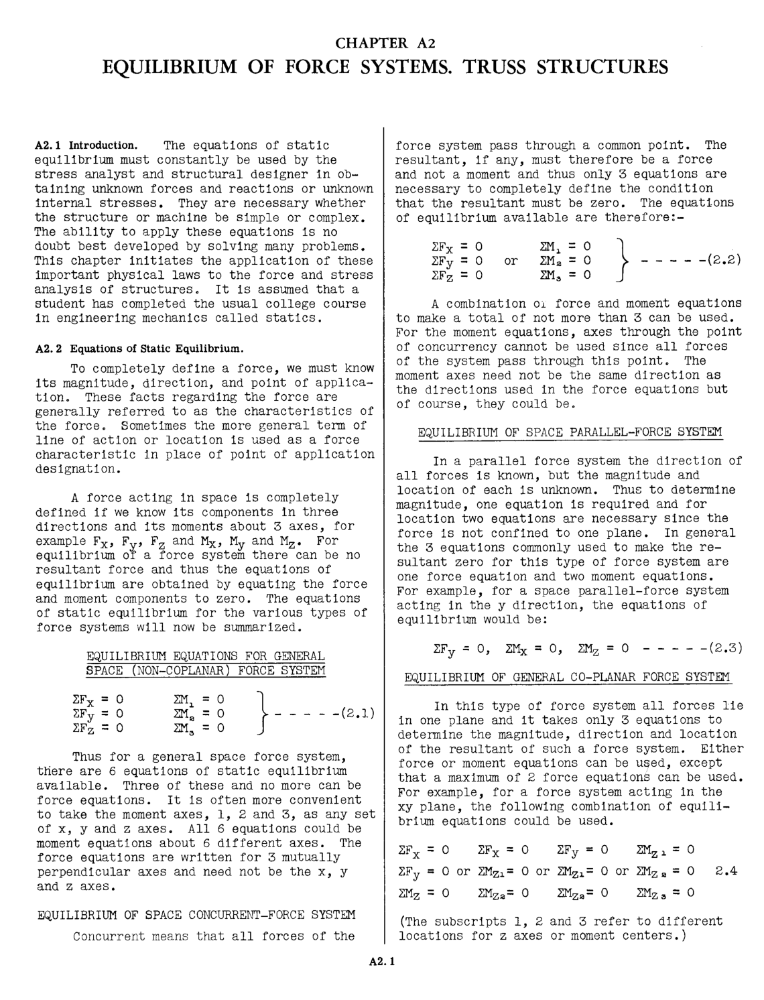

# CHAPTER A1 THE WORK OF THE AEROSPACE STRUCTURES ENGINEER

## A1.1 Introduction.

The first controllable human flight in a
heavier than air machine was made by Orville
Wright on December 17, 1903, at Kitty Hawk,
North Carolina. It covered a distance of 120
feet and the duration of flight was twenty
seconds. Today, this initial flight appears
very unimpressive, but it comes into its true
perspective of importance when we realize that
mankind for centuries has dreamed about doing
or tried to do what the Wright Brothers
accomplished in 1903.

The tremendous progress accomplished in the
first 50 years of aviation history, with most
of it occurring in the last 25 years, is almost
unbelievable, but without doubt, the progress
in the second 50 year period will still be more
unbelievable and fantastic. As this is written
in 1964, jet airline transportation at 600 MPH
is well established and several types of
military aircraft have speeds in the 1200 to
2000 MPH range. Preliminary designs of a
supersonic airliner with Mach 3 speed have been
completed and the government is on the verge of
sponsoring the development of such a flight
vehicle, thus supersonic air transportation
should become in the early 1970's. The
rapid progress in missile design has ushered
in the Space Age. Already many space vehicles
have been flown in search of new knowledge
which is needed before successful exploration
of space such as landings on several planets
can take place. Unfortunately, the rapid
development of the missile and rocket power
has given mankind a flight vehicle which, when
combined with the nuclear bomb, has the awesome
potential to quickly destroy vast regions of
the earth. While no person at present knows
where or what space exploration will lead to,
relative to benefits to mankind, we do know that
the next great aviation expansion besides
supersonic airline transportation will be the
full development and use of vertical take-off
and landing aircraft. Thus persons who will be
living through the second half century of
aviation progress will no doubt witness even
more fantastic progress than occurred in the
first 50 years of aviation history.

## A1.2 General Organization of an Aircraft Company Engineering Division.

The modern commercial airliner, military 
airplane, missile and space vehicle is a highly
scientific machine and the combined knowledge
and experience of hundreds of engineers and
scientists working in close cooperation is
necessary to insure a successful product. Thus
the engineering division of an aerospace company
consists of many groups of specialists whose
specialized training covers all fields of
engineering education such as Physics, Chemical
and Metallurgical, Mechanical, Electrical and,
of course, Aeronautical Engineering.

It so happens that practically all the
aerospace companies publish extensive pamphlets
or brochures explaining the organization of the
engineering division and the duties and
responsibilities of the many sections and groups
and illustrating the tremendous laboratory and
test facilities which the aerospace industry
possesses. It is highly recommended that the
student read and study these free publications
in order to obtain an early general uncierstanding of how the modern flight vehicle is
conceived, designed and then produced.

In general, the engineering department of
an aerospace company can be broken down into six
large rather distinct sections, which in turn
are further divided into specialized groups,
which in turn are further divided into smaller
working groups of engineers. To illustrate, the
six sections will be listed together with some
of the various groups. This is not a complete
list, but it should give an idea of the broad
engineering set-up that is necessary.

I. Preliminary Design Section.

II. Technical Analysis Section.

       (1) Aerodynamics Group  
       (2) Structures Group  
       (3) Weight and Balance Control Group  
       (4) Power Plant Analysis Group  
       (5) Materials and Processes Group  
       (6) Controls Analysis Group

III. Component Design Section.

       (1) Structural Design Group (Wing, Body and Control Surfaces)
       (2) Systems Design Group (All mechanical, hydraulic, electrical and thermal installations)

IV. Laboratory Tests Section.

       (1) Wind Tunnel and Fluid Mechanics Test Labs.
       (2) Structural Test Labs.
       (3) Propulsion Test Labs.
       (4) Electronics Test Labs.
       (5) Electro-Mechanical Test Labs.
       (6) Weapons and Controls Test Labs.
       (7) Analog and Digital Computer Labs.

V. Flight Test Section.

VI. Engineering Field Service Section.

Since this textbook deals with the subject
of structures, it seems appropriate to discuss
in some detail the work of the Structures Group.
For the detailed discussion of the other groups,
the student should refer to the various aircraft company publications.

## A1.3 The Work of the Structures Group

The structures group, relative to number of
engineers, is one of the largest of the many
groups of engineers that make up Section II,
the technical analysis section. The structures
group is primarily responsible for the
structural integrity (safety) of the airplane.
Safety may depend on sufficient strength or
sufficient rigidity. This structural integrity
must be accompanied with lightest possible
weight, because any excess weight has detrimental effect upon the performance of aircraft.
For example, in a large, long range missile,
one pound of unnecessary structural weight may
add more than 200 Ibs. to the overall weight of
the missile.

The structures group is usually divided
into sub-groups as follows:

       (1) Applied Loads Calculation Group
       (2) Stress Analysis and Strength Group
       (3) Dynamics Analysis Group
       (4) Special Projects and Research Group

### THE WORK OF THE APPLIED LOADS GROUP

Before any part of the structure can be
finally proportioned relative to strength or
rigidity, the true external loads on the aircraft must be determined. Since critical loads
come from many sources, the Loads Group must
analyze loads from aerodynamic forces, as well
as those forces from power plants, aircraft
inertia; control system actuators; launching,
landing and recovery gear; armament, etc. The
effects of the aerodynamic forces are initially
calculated on the assumption that the airplane
structure is a rigid body. After the aircraft
structure is obtained, its true rigidity can
be used to obtain dynamic effects. Results of
wind tunnel model tests are usually necessary
in the application of aerodynamic principles to
load and pressure analysis.

The final results of the work of this
group are formal reports giving complete applied
load design criteria, with many graphs and summary tables. The final results may give complete shear, moment and normal forces referred
to a convenient set of XYZ axes for major aircraft units such as the wing, fuselage, etc.

### THE WORK OF STRESS ANALYSIS AND STRENGTH GROUP

Essentially the primary job of the stress
group is to help specify or determine the kind
of material to use and the thickness, size and
cross-sectional shape of every structural member or unit on the airplane or missile, and
also to assist in the design of all joints and
connections for such members. Safety with light
weight are the paramount structural design requirements. The stress group must constantly
work closely with the structural Design Section
in order to evolve the best structural over-all
arrangement. Such factors as power plants,
built-in fuel tanks, landing gear retracting
wells, and other large cut-outs can dictate the
type of wing structure, as for example, a two
spar single cell wing, or a multiple spar
multiple cell wing.

To expedite the initial structural design
stUdies, the stress group must supply initial
structural sizes based on apprOXimate loads.
The final results of the work by the stress
group are recorded in elaborate reports which
show how the stresses were calCUlated and how
the required member sizes were obtained to carry
these stresses efficiently. The final size of
a member may be dictated by one or more factors
such as elastic action, inelastic action, elevated temperatures, fatigue, etc. To insure
the accuracy of theoretical calculations, the
stress group must have the assistance of the
structures test laboratory in order to obtain
information on which to base allowable design
stresses.

THE WORK OF THE DYNAMICS ANALYSIS GROUP

The Dynamics Analysis Group has rapidly
expanded in recent years relative to number of
engineers required because supersonic airplanes,
missiles and vertical rising aircraft have presented many new and complex problems in the
general field of dynamics. In some aircraft
companies the dynamics group is set up as a
separate group outside the Structures Group.

The engineers in the dynamics group are
responsible for the investigation of vibration
and shock, aircraft flutter and the establishment of design requirements or changes for its
control or correction. Aircraft contain dozens
of mechanical installations. Vibration of any
part of these installations or systems may be
of such character as to cause faulty operation
or danger of failure and therefore the dynamic

clnracteristics must be changed or modified in
order to insure reliable and safe operation.

Tne major structural units of aircraft such
as the wing and fuselage are not rigid bodies.
Thus when a sllilrp air gust strikes a flexible
wing in high speed flight, we have a dynamic

load situation and the wing will vibrate. The

dynami,~ist must determine whsther this vibration

is serious relative to induced stresses on the
wing stru~ture. The dynamics group is also
responsible for the determination of the
stabi Ii ty ami performan,;e of missile antj flight
vehic;le glLldl:J.,;e and control systems. The
dynamL;s group must work (~onstantly with the
various test laboratories in order to obtain
reliable values of certain fa:;tors that are
necessdry in m'lny theoreti'~'ll cal,;ulations.

Tnt<; WOH!\: OF THS SPECIAL PHOJ~CTS GROUP

In g:meral, all the various techIlical

AI. 3

groups have a special sUb-group which is working on design problems that will be encountered
in the near or distant future as aviation progresses. For example, in the Structures Group,
this sub-group might be studying such problems
as: (1) how to calculate the thermal stresses
in the wing structure at su)ersonic speeds;
(2) how to stress-analyze a new type of wing
strUi;ture; (:3) what type of body structure is
best for future space travel and what kind of
materials will be needed, etc.

Chart 1 illustrates in general a typical
make-up of the Structures Section of a large

aerospace compa:1Y. Chart 2 lists the many
items which the structures engineer must be
con'cerned with in insuring the structural
integrity of the flight vehicle. Both Charts
land 2 are from Chance-Vought Structures
Design ~lnual and are reproduced with their
permission.

**Chart** **1.** **Structures Section Organization**
**Chance-Vought Corp.**

AI. 4 THE WORK OF THE AEROSPACE STRUCTURES ENGINEER

**INKS** **TO** **STRUCTURAL** **INTEGRITY**

       - ••• **•** _**ARE**_ **NO** _**BETTER**_ **THAN** _**THE**_ _**WEAKEST**_ _**LINK**_

**MATERIALS** **OF**

**CONSTRUCTION**

**STRESS**

**ANALYSIS**

SKIN PANELS

BEAM ANALYS IS

STRAIN COMPATIBILITY

**STIFFNESS**

**CRITERIA**

FLUTTER

CONTROL SYSTEM STABILITY

PANEL FLUTIER-SKIN CONTOURS

FASTENERS

WELDING

BONDING

PLATE AND BAR

FORGINGS

CASTINGS

EXTRUS IONS

SHEET METAL

SANDWICH

PLASTIC LAMINATE

BEARINGS

FLIGHT LOAD DISTRIBUTIONS

INERTIAL LOAD DISTRIBUTIONS

FLEX IBI L1TY EFFECTS

GROUND LOAD DISTRIBUTIONS

REPEATED LOAD SPECTRUMS

TEMPERATURE DI STR I BUT IONS

LOADS FROM THERMAL

DEFORMATIONS

PRESSURES-IMPACT

**COMPONENT**

**ANALYSIS**

UN IT SOLUTIONS

INDETERMINATE STRUCTURES

WINGANALYSIS

TAIL ANALYSIS

FUSELAGE SHELL ANALYS IS

THERMAL ANALYSIS

DEFLECTION ANALYS IS

STIFFNESS

HEAT TREAT CONTROL

STRESS CORROSION

STABILITY AT TEMPERATURE

SPECIFICATION CONFORMANCE

BLUE PRINT CONFORMANCE

**ALLOWABLES**

YIELDING

FRACTURE

FATIGUE

WEAR, BRINELLING

CREEP

DEFLECTIONS

THERMAL EFFECTS

STIFFNESS

COMBINED LOADINGS

BUCKLING

Chart 2
From Chance- Vought Structures Design Manual

