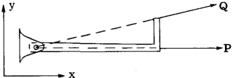

## A2.2 Equations of Static Equilibrium.

To completely define a force, we must know
its magnitude, direction, and point of application. These facts regarding the force are
generally referred to as the characteristics of
the force. Sometimes the more general term of
line of action or location is used as a force
characteristic in place of point of application
designation.

A force acting in space is completely
defined if we know its components in three
directions and its moments about 3 axes, for
example $F_x$, $F_y$, $F_z$ and $M_x$, $M_y$ and $M_z$. For
equilibrium or a force system there can be no
resultant force and thus the equations of
equilibrium are obtained by equating the force
and moment components to zero. The equations
of static equilibrium for the various types of
force systems will now be summarized.

### EQUILIBRIUM EQUATIONS FOR GENERAL SPACE (NON-COPLANAR) FORCE SYSTEM

$$
\begin{equation}
\begin{split}
\sum F_x = 0\\
\sum F_y = 0\\
\sum F_z = 0\\
\sum M_1 = 0\\
\sum M_2 = 0\\
\sum M_3 = 0 \\
\end{split}
\tag{2.1}
\end{equation}
$$

Thus for a general space force system,
there are 6 equations of static equilibrium
available. Three of these and no more can be
force equations. It is often more convenient
to take the moment axes, 1, 2 and 3, as any set
of x, y and z axes. All 6 equations could be
moment equations about 6 different axes. The
force equations are written for 3 mutually
perpendicular axes and need not be the x, y
and z axes.

force system pass through a common point. The
reSUltant, if any, must therefore be a force
and not a moment and thus only 3 equations are
necessary to completely define the condition
that the resultant must be zero. The equations
of equilibrium available are therefore:

ZF x = 0 ZMJ. =
ZF y = 0 or ZM" =
ZFz = 0 ZM a =

o

o } - - - - -(2.2)
o

ZF x = 0
ZF y = 0
ZFz = 0

ZMJ. = 0
ZM" = 0 } - - - - -(2.1)
ZM a = 0

EQ.UILIBRIUM OF SPACE CONCURRENT-FORCE SYSTEM

Concurrent means that all forces of the

**A2.1**

A combination Oi force and moment equations
to make a total of not more than 3 can be used.
For the moment equations, axes through the point
of concurrency cannot be used since all forces
of the system pass through this point. The
moment axes need not be the same direction as
the directions used in the force equations but
of course, they could be.

EQ.UILIBRIUM OF SPACE PARALLEL-FORCE SYSTEM

In a parallel force system the direction of
all forces is known, but the magnitude and
location of each is unknown. Thus to determine
magnitude, one equation is required and for
location two equations are necessary since the
force is not confined to one plane. In general
the 3 equations commonly used to make the resultant zero for this type of force system are
one force equation and two moment equations.
For example, for a space parallel-force system
acting in the y direction, the equations of
eqUilibrium would be:

ZF y .:: 0, ZM x = 0, ZM z = 0    - -(2.3)

EQ.UILIBRIUM OF GENERAL CO-PLANAR FORCE SYSTEM

In this type of force system all forces lie
in one plane and it takes only 3 equations to
determine the magnitude, direction and location
of the reSUltant of such a force system. Either
force or moment equations can be u~ed, except
that a maximum of 2 force equations can be used.
For example, for a force system acting in the
xy plane, the following combination of equilibrium equations could be used.

ZF x = 0 ZF x = 0 ZF y = 0 ZM z J. = 0

ZF y = 0 or ZMzJ.= 0 or ZMzJ.= 0 or ZM z " = 0 2.4

ZM z = 0 ZM z"= [0] ZM z"= [0] ZM za = 0

(The SUbscripts 1, 2 and 3 refer to different
locations for z axes or moment centers.)

A2.2 EQUILIBRIUM OF FORCE SYSTEMS. TRUSS STRUCTURES.

EQUILIBRIUM OF COPLANAR-CONCURRENT-FORCE SYSTD1

Since all forces lie in the same plane and
also pass through a common point, the magnitude
and direction of the resultant of this type of
force system is unknown but the location is
knO\Vll since the point of concurrency is on the
line of action of the resultant. Thus only two
equations of equilibrium are necessary to define
the resultant and make it zero. The combinations available are,

ZF x = 0 or ZFx = 0 or ZF y = 0 or ZMz~=O}2.5
ZF y = 0 ZM z = 0 Zl'1 z = 0 Zl'1 Z2 = 0

(The z axis or moment center locations must be
other than through the point of concurrency)

EQUILIBRIUM OF CO-PLANAR PARALLEL FORCE SYSTEM

Since the direction of all forces in this
type of force system is known and since the
forces all lie in the same plane, it only takes
2 equations to define the magnitude and location
of the resultant of such a force system. Hence,
there are only 2 equations of eqUilibrium available for this type of force system, namely, a
force and moment equation or two moment
equations. For example, for forces parallel to
the y axis and located in the xy plane the
equilibrium equations available would be: 

ZF y = 0
or         - - - - - 2.6

ZMz   - 0 Zl'1 z 2 = 0 }

(The moment centers 1 and 2 cannot be on the
same y axis)

EQUILIBRIUM OF COLINEAR FORCE SYSTEM

A colinear force system is one where all
forces act along the same line or, in other
words, the direction and location of the forces
are known but their magnitudes are unknown;
thus only magnitude needs to be found to define
the resultant of a colinear force system. Thus
only one equation of eqUilibrium is available,
namely

ZF = 0 or ZM~ = 0 2.7

where moment center 1 is not on the line of
action of the force system

A2. 3 Structural Fitting Units for Establishing the Force
Characteristics of Direction and Point of Application.

To completely define a force in space requires 6 equations, or 3 equations if the force
is limited to one plane. In general a structure
is loaded by known forces and these forces are
transferred through the structure in some
manner of internal stress distribution and then

reacted by other external forces, commonly
referred to as reactions which hold the known
forces on the structure in eqUilibrium. Since
the static equations of equilibrium available
for the various types of force systems are
limited, the structural engineer resorts to the
use of fitting units which establish the
direction of an unkno.vn force or its point of
application or both, thus decreasing: the number
of unknowns to be detennined. The figures
which follow illustrate the type of fitting
units employed or other general methods for
establishing the force characteristics of
direction and point of application.

Ball and Socket Fitting

For any space or conlanar force such as P
and _Q_ acting on the bar, the line of action of
such forces must act throuGh the center of the
ball if rotation of the bar is prevented. Thus
a ball and socket joint can be used to establish
or control the direction and line action of a
force applied to a structure through this type
of fitting. Since the joint has no rotational
resistance, no couples in any plane can be
applied to it.

Single Pin Fitting

For any force such as P and _Q_ acting in the
xy plane, the line of action of such a force
must pass through the pin center since the
fitting unit cannot resist a moment about a z
axis through the pin center. Therefore, for
forces acting in the xy plane, the direction
and line of action are established by the pin
joint as illustrated in the figure. Since a
single pin fitting can resist moments about axes
perpendicular to the pin axis, the direction and
line of action of out-of-plane forces is therefore not established by single pin fitting units.

A B ex
_(0 0)_

If a bar AB has single pin fittings at
each end, then any force P lying in the xy
plane and applied to end B must have a direction
and line of action coinciding with a line joining the pin centers at end fittings A and B,
since the fittings cannot resist a moment about
the z axis.

Double Pin - Universal Joint Fittings

Since single pin fitting units can resist
applied moments about axes normal to the pin
axis, a double pin joint as illustrated above
is often used. This fitting unit cannot resist
moments about y or z axes and thus applied
forces such as P and Q must have a line of
action and direction such as to pass through
the center of the fitting unit as illustrated
in the figure. The fitting unit can, however,
resist a moment about the x axis or in other
words, a universal type of fitting unit can
resist a torsional moment.

Rollers

_A~B_
~

In order to permit structures to move at
support points, a fitting unit involving the
idea of rollers is often used. For example, the
truss in the figure above is supported by a pin
fitting at (A) which is further attached to a
fitting portion that prevents any horizontal
movement of the truss at end (A); however,
the other end (B) is supported by a nest of
rollers which provide no horizontal resistance
to a horizontal movement of the truss at end (B).
The rollers fix the direction of the reaction
at (B) as perpendicular to the roller bed.
Since the fitting unit is joined to the truss
joint by a pin, the point of application of the
reaction is also known, hence only one force
characteristic, namely magnitude, is unknown
for a roller-pin type of fitting. For the
fitting unit at (A), point of application of the
reaction to the truss is known because of the
pin, but direction and magnitude are unknown.

Lubricated Slot or Double Roller Type of Fitting
Unit.

