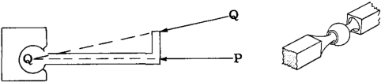
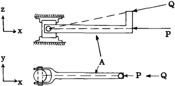

## A2. 3 Structural Fitting Units for Establishing the Force Characteristics of Direction and Point of Application.

To completely define a force in space requires 6 equations, or 3 equations if the force
is limited to one plane. In general a structure
is loaded by known forces and these forces are
transferred through the structure in some
manner of internal stress distribution and then
reacted by other external forces, commonly
referred to as reactions which hold the known
forces on the structure in equilibrium. Since
the static equations of equilibrium available
for the various types of force systems are
limited, the structural engineer resorts to the
use of fitting units which establish the
direction of an unknown force or its point of
application or both, thus decreasing the number
of unknowns to be detennined. The figures
which follow illustrate the type of fitting
units employed or other general methods for
establishing the force characteristics of
direction and point of application.

### Ball and Socket Fitting

For any space or conlanar force such as P
and Q acting on the bar, the line of action of
such forces must act through the center of the
ball if rotation of the bar is prevented. Thus
a ball and socket joint can be used to establish
or control the direction and line action of a
force applied to a structure through this type
of fitting. Since the joint has no rotational
resistance, no couples in any plane can be
applied to it.

### Single Pin Fitting

For any force such as P and Q acting in the
xy plane, the line of action of such a force
must pass through the pin center since the
fitting unit cannot resist a moment about a z
axis through the pin center. Therefore, for
forces acting in the xy plane, the direction
and line of action are established by the pin
joint as illustrated in the figure. Since a
single pin fitting can resist moments about axes
perpendicular to the pin axis, the direction and
line of action of out-of-plane forces is therefore not established by single pin fitting units.

If a bar AB has single pin fittings at
each end, then any force P lying in the xy
plane and applied to end B must have a direction
and line of action coinciding with a line joining the pin centers at end fittings A and B,
since the fittings cannot resist a moment about
the z axis.

### Double Pin - Universal Joint Fittings

Since single pin fitting units can resist
applied moments about axes normal to the pin
axis, a double pin joint as illustrated above
is often used. This fitting unit cannot resist
moments about y or z axes and thus applied
forces such as P and Q must have a line of
action and direction such as to pass through
the center of the fitting unit as illustrated
in the figure. The fitting unit can, however,
resist a moment about the x axis or in other
words, a universal type of fitting unit can
resist a torsional moment.

### Rollers

In order to permit structures to move at
support points, a fitting unit involving the
idea of rollers is often used. For example, the
truss in the figure above is supported by a pin
fitting at (A) which is further attached to a
fitting portion that prevents any horizontal
movement of the truss at end (A); however,
the other end (B) is supported by a nest of
rollers which provide no horizontal resistance
to a horizontal movement of the truss at end (B).
The rollers fix the direction of the reaction
at (B) as perpendicular to the roller bed.
Since the fitting unit is joined to the truss
joint by a pin, the point of application of the
reaction is also known, hence only one force
characteristic, namely magnitude, is unknown
for a roller-pin type of fitting. For the
fitting unit at (A), point of application of the
reaction to the truss is known because of the
pin, but direction and magnitude are unknown.

### Lubricated Slot or Double Roller Type of Fitting

Another general fitting type that is used
to establish the direction of a force or reaction
is illustrated in the figure at the bottom of the
first column. Any reacting force at joint (A)
must be horizontal since the support at (A) is
so designed to provide no vertical resistance.

### Cables - Tie Rods

Since a cable or tie rod has negligible
bending resistance, the reaction at joint B on
the crane structure from the cable must be
colinear with the cable axis, hence the cable
establishes the force characteristics of direction and point of application of the reaction
on the truss at point B.
