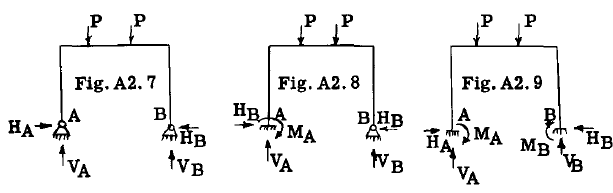
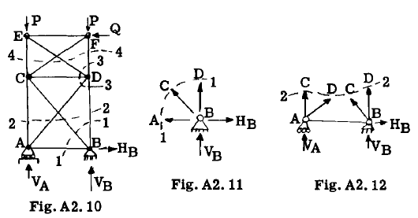

## A2.6 Examples of Statically Determinate and Statically Indeterminate Structures.

The first step in analyzing a structure is
to determine whether the structure as presented
is statically determinate. If so, the reactions
and internal stresses can be found without knowing sizes of members or kind of material. If
not statically determinate, the elastic theory
must be applied to obtain additional equations.
The elastic theory is treated in considerable
detail in Chapters A7 to A12 inclusive.

To help the student become familiar with
the problem of determining whether a structure
is statically determinate, several example
problems will be presented.

### Example Problem 1.

In the structure shown in Fig. A2.1, the
known forces or loads are the distributed loads
of 10 lb. per inch on member ABD. The reactions
at points A and C are unknown. The reaction at
C has only one unknown characteristic, namely,
magnitude, because the point of application of $R_C$
is through the pin center at C and the direction
of $R_C$ must be parallel to line CB because there
is a pin at the B end of member CB. At
point A the reaction is unknown in direction
and magnitude but the point of application must
be through the pin center at A. Thus there are
2 unknowns at A and one unknown at C or a total
of 3. With 3 equations of equilibrium 
available for a coplanar force system the structure
is statically determinate. Instead of using an
angle as an unknown at A to find the direction
of the reaction, it is usually more convenient
to replace the reaction by components at right
angles to each other as $H_A$ and $V_A$ in the figure,
and thus the 3 unknowns for the structure are 3
magnitudes.

### Example Problem 2.

Fig. A2.2 shows a structural frame carrying
a known load system P. Due to the pins at
reaction points A and B the point of application
is known for each reaction; however, the magnitude and direction of each is unknown, making a
total of 4 unknowns with only 3 equations of
equilibrium available for a coplanar force
system. At first we might conclude that the
structure is statically indeterminate but we
must realize this structure has an internal pin
at e which means the bending moment at this
point is zero since the pin has no resistance
to rotation. If the entire structure is in
equilibrium, then each part must likewise be
in equilibrium and we can cut out any portion
as a free body and apply the equilibrium
equations. Fig. A2.3 shows a free body of the
frame to left of pin at C. Taking moments
about C and equating to zero gives us a fourth
equation to use in determining the 4 unknowns,
$H_A$, $V_A$ $V_B$ and $H_B$. The moment equation about C
does not include the unknowns $V_C$ and $H_C$ since
they have no moment about e because of zero
arms. As in example problem 1, the reactions
at A and B have been replaced by H and V components instead of using an angle (direction)
as an unknown characteristic. The structure is
statically determinate.

### Example Problem 3.

Fig. A2.4 shows a straight member 1-2 carrying a
known load system P and supported by 5 struts
attached to reaction points ABCD.

At reaction points A, B and D, the reaction
is known in direction and point of application
but the magnitude is unknown as indicated by the
vector at each support. At point C, the reaction is unknown in direction because 2 struts
enter joint C. Magnitude is also unknown but
point of application is known since the reaction
must pass through C. Thus we have 5 unknowns,
namely, $R_A$, $R_B$, $R_D$, $V_C$ and $H_C$. For a coplanar
force system we have 3 equilibrium equations
available and thus the first conclusion might
be that we have a statically indeterminate
structure to (5-3) = 2 degrees redundant. However, observation of the structure shows two
internal pins at points E and F which means
that the bending moment at these two points is
zero, thus giving us 2 more equations to use
with the 3 equations of equilibrium. Thus
drawing free bodies of the structure to left of
pin E and to right of pin F and equating moments
about each pin to zero, we obtain 2 equations
which do not include unknowns other than the 5
unknowns listed above. The structure is therefore statically determinate.

### Example Problem 4.

Fig. A2.5 shows a beam AB which carries a
super-structure CED which in turn is subjected
to the known loads P and Q. The question is
whether the structure is statically determinate.
The external unknown reactions for the entire
structure are at points A and B. At A due to
the roller type of action, magnitude is the only
unknown characteristic of the reaction since
direction and point of application are known.
At B, magnitude and direction are unknown but
point of application is known, hence we have 3
unknowns, namely, $R_A$, $V_B$ and $H_B$, and with 3
equations of equilibrium available we can find
these reactions and therefore the structure is
statically determinate with respect to external
reactions. We now investigate to see if the
internal stresses can be found by statics after
having found the external reactions. Obviously,
the internal stresses will be affected by the
internal reactions at C and D, so we draw a free
body of the super-structure as illustrated in
Fig. A2.6 and consider the internal forces that
existed at C and D as external reactions. In
the actual structure the members are rigidly
attached together at point C such as a welded or
multiple bolt connection. This means that all
three force or reaction characteristics, namely,
magnitude, direction, and point of application,
are unknown; or in other words, 3 unknowns
exist at C. For convenience we will represent
these unknowns by three components as shown in
Fig. A2.6, namely, $H_C$, $V_C$ and $M_C$. At joint D in
Fig. A2.6, the only unknown regarding the reaction is $R_D$, a magnitude, since the pin at each
end of the member DE establishes the direction
and point of application of the reaction $R_D$.
Hence we have 4 unknowns and only 3 equations
of equilibrium for the structure in Fig. A2.6,
thus the structure is statically indeterminate
With respect to all of the internal stresses.
The student should observe that internal
stresses between points AC, BD and FE are
statically determinate, and thus the statically
indeterminate portion is the structural triangle CEDC.

### Example Problem 5

Figs. 2.7, 2.8 and 2.9 show the same
structure carrying the same known load system
P but with different support conditions at
points A and B. The question is whether each
structure is statically indeterminate and if
so, to what degree, that is, what number of
unknowns beyond the equations of statics available. Since we have a coplanar force system,
only 3 equations of statics are available for
equilibrium of the structure as a whole.

In the structure in Fig. 2.7, the reaction
at A and also at B is unknown in magnitUde and
direction, although their points of application
are known. Hence, 4 unknowns (With only 3
equations of statics available) make the
structure statically indeterminate to the first
degree. In Fig. 2.8, the reaction at A is a
rigid one, thus all 3 characteristics of magnitUde, direction, and point of application of
the reaction, are unknown. At point B, due to
pin only 2 unknowns, namely, magnitude and direction, thus making a total of 5 unknowns
with only 3 equations of statics available or
the structure is statically indeterminate to
the second degree. In the structure of Fig.
2.9, both supports at A and B are rigid. Thus,
all 3 force characteristics are unknown at each
support or a total of 6 unknowns Which makes
the structure statically indeterminate to the
third degree.

Example Problem 6

Fig. 2.10 shows a 2 bay truss supported at
points A and B and carrying a known load system
P, Q. All members of the truss are connected
at their ends by a common pin at each jOint.
The reactions at A and B are applied through
fittings as indicated. The question is whether
the structure is statically determinate or not.
Relative to external reactions at A and B the
structure is statically determinate because the
type of support produces only one unknown at A
and two unknowns at B, namely, VA, VB and HB as
shown in Fig. 2.10, and we have 3 equations of
static equilibrium available.

We now investigate to see if we can find
the internal member stresses after having found
the values of the reactions at A and B. Suppose
we cut out joint B as indicated by section 1-1
in Fig. 2.10 and draw a free body as shown in
Fig. 2.11. Since the members of the truss have
pins at each end, the loads in these members
must be axial, thus direction and line of action
are known and only magnitude is unknown. In
Fig. 2.11, HB and VB are known but AB, CB, and
DB are unknown in magnitude; hence we have 3 unknowns but only 2 equations of equilibrium for
a coplanar concurrent force system. If we cut
through the truss in Fig. 2.10 by the section
2-2 and draw a free body of the lower portion
as shown in Fig. 2.12, we have 4 unknowns,
namely, the axial loads in CA, DA, CB, DB but
only 3 e~uations of eqUilibrium available for
a coplanar force system.

Suppose we were able to find the stresses
in CA, DA, CB, DB in some manner, and we would
now proceed to joint D and treat it as a free
body or cut through the upper panel along
section 4-4 and use the lower portion as a free
body. The same reasoning as used above would
show us we have one more unknown than the number
of eqUilibrium equations available and thus
we have the truss statically indeterminate to
the second degree relative to internal member
stresses.

Physically, the structure has two more
members than is necessary for the stability of
the structure under load, as we could leave
out one diagonal member in each truss panel and

the structure would be still stable and all
member axial stresses could be found by the
equations of static equilibrium without regard
to their size of cross-section or the kind of
material. Adding the second diagonal member
in each panel would necessitate knowing the
size of all truss members and the kind of
material used before member stresSes could be
found, as the additional equations needed must
come from a consideration involving distortion
of the truss. Assume for example, that one
diagonal in the upper panel was left out. We
would then be able to find the stresses in the
members of the upper panel by statics but the
lower panel would still be statically indeterminate to 1 degree because of the double
diagonal system and thus one additional equation
is necessary and would involve a consideration
of truss distortion. (The solution of statically indeterminate trusses is covered in
Chapter AS.)

