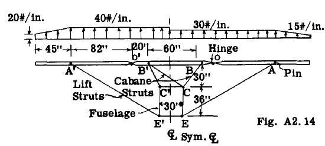
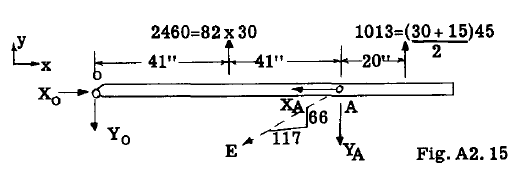

## A2. 7 Example Problem Solutions of Statically Determinate Coplanar Structures and Coplanar Loadings.

Although a student has taken a course in
statics before taking a beginning course in
aircraft structures, it is felt that a limited
review of problems involving the application
of the equations of static equilibrium is quite
justified, particularly if the problems are
possibly somewhat more difficult than most of
the problems in the usual beginning course in
statics. Since one must use the equations of
static equilibrium as part of the necessary
equations in solving statically indeterminate
structures and since statically indeterminate
structures are covered in rather complete detail
in other chapters of this book, only limited
space will be given to problems involving
statics in this chapter.

### Example Problem 8.

Fig. A2.14 shows a much simplified wing
structure, consisting of a wing spar supported
by lift and cabane struts which tie the wing
spar to the fuselage structure. The distributed
air load on the wing spar is unsymmetrical about
the center line of the airframe. The wing spar
is made in three units, readily disassembled by
using pin fittings at points O and O'. All
supporting wing struts have single pin fitting
units at each end. The problem is to determine the axial loads in the members and the reactions on the spar.

**Solution:** The first thing to decide is whether
the structure is statically determinate. From
the figure it is observed that the wing spar is
supported by five struts. Due to the pins at
each end of all struts, we have five unknowns,
namely, the magnitude of the load in each strut.
Direction and location of each strut load is
known because of the pin at each end of the
struts. We have 3 equations of equilibrium for
the wing spar as a single unit supported by the
5 struts, thus two more equations are necessary
if the 5 unknown strut loads are to be found.
It is noticed that the wing spar includes 2 internal single pin connections at points O and O'.
This establishes the fact that the moment of all
forces located to one side of the pin must be
equal to zero since the single pin fitting cannot resist a moment. Thus we obtain two additional equations because of the two internal pin
fittings and thus we have 5 equations to find 5
unknowns.

Fig. 2.15 shows a free body of the wing
spar to the right of hinge fitting at O.

In order to take moments, the distributed
load on the spar has been replaced by the resultant load on each spar portion, namely, the
total load on the portion acting through the
centroid of the distributed load system. The
strut reaction EA at A has been shown in phantom
as it is more convenient to deal with its components $Y_A$ and $X_A$. The reaction at O is unknown in magnitude and direction and for convenience we will deal with its components $X_O$
and $Y_O$. The sense assumed is indicated on the
figure.

The sense of a force is represented
graphically by an arrow head on the end of a
vector. The correct sense is obtained from the
solution of the equations of equilibrium since
a force or moment must be given a plus or minus
sign in writing the equations. Since the sense
of a force or moment is unknown, it is assumed,
and if the algebraic solution of the equilibrium
equations gives a plus value to the magnitUde
then the true sense is as assumed, and opposite
to that assumed if the solution gives a minus
sign. If the unknown forces are axial loads in
members it is Common practice to call tensile
stress plus and compressive stress minus, thus
If we assume the sense of an unknown axial load
as tension, the solution of the equilibrium
equations will give a plus value for the magnitude of the unknown if the true stress is
tension and a minus sign will indicate the
assumed tension stresses should be reversed or
compression, thus giving a consistency of signs.

To find the unknown $Y_A$ we take moments
about point O and equate to zero for equilibrium.

$$
\sum M_O = - 2460 \times 41 - 1013 \times 102 + 82Y_A =0
$$

Hence YA =204000/82 =2480 lb. The plus sign
means that the sense as assumed in the figure
is correct. By geometry XA =2480 x 117/66 =
4400 lb. and the load in strut EA equals
v4400 2 + 2480 2 =5050 lb. tension or as
assumed in the figure.
ZMO = - 2460 x 41 1013 x 102 + 82YA =0 To find load in member B'C use equation
ZFy =0 =1325 + 2000 + 1500 + 993 - 6000
(30/33.6) - 2720 (30/33.6) - B'C (30/54) =0
whence, B'C =- 3535 lb. The minus sign
means it acts opposite to that shown in figure
or is compression instead of tension.
To find Xo we use the

To find strut load B'C' take moments about
point C.

ZMc = 1325 x 65 + 2000 x 40 + (5880 - 4400)
30 - 1500 x 10 - 993 x 35 - 30 (B'C')
30/33.6 = 0

whence, B'C' = 6000 lb. with sense as shown.

ZMO = - 2460 x 41 1013 x 102 + 82YA = 0 To find load in member B'C use equation

Hence YA = 204000/82 = 2480 lb. The plus sign
means that the sense as assumed in the figure
is correct. By geometry XA = 2480 x 117/66 =
4400 lb. and the load in strut EA equals
v4400 [2] + 2480 [2] = 5050 lb. tension or as
assumed in the figure.

To find Xo we use the equilibrium equation
ZFX = 0 = Xo - 4400 = 0, whence Xo = 4400 lb.

To find YO we use,

ZF y = 0 = 2460 + 1013 - 2480 - YO = 0, whence
YO = 993 lb.

To check our results for equilibrium we
will take moments of all forces about A to see
if they equal zero.

ZMA = 2460 x 41 - 1013 x 20 - 993 x 82 = 0 check

On the spar portion O'A', the reactions
are obviously equal to 40/30 times those found
for portion OA since the external loading is 40
as compared to 30.

Hence A'E' = 6750, XO' = 5880, YO' = 1325

Fig. 2.16 shows a free body of the center
spar portion with the reactions at 0 and 0' as
found previously. The unknown loads in the
struts have been assumed tension as shown by
the arrows.

2000=50 x40 1500=50 x 30
l-- 20,,--15" 1--- 50" 5" r 20"-1
_588.Q._ <£==~~======-:i;;==:Jl--4400

f~325 B' °t
993

",
C'~--,, -- -~C,--,

ZF y = 0 = 1325 + 2000 + 1500 + 993 - 6000
(30/33.6)    - 2720 (30/33.6)    - B'C (30/54)
= 0

whence, B'C =- 3535 lb. The minus sign
means it acts opposite to that shown in figure
or is compression instead of tension.

The reactions on the spar can now be
determined and shears, bending moments and
axial loads on the spar could be found. The
numerical results should be checked for eqUilibrium of the spar as a whole by taking moments
of all forces about a different moment center
to see if the result is zero.

Example Problem 9.

RB\ f.--- 1~' + 12"----1 ;rRD

o~B ~ r -Y- T

~'\' Brae I ?; ~ 12 12"
\'\ Strut % 12 ~
~ ~\ Brace Strut
24LS,cP \'\ E          -          
12

12"
+
12"
Fig. A2.17 ~

Fig. 2.17 shows a simplified airplane
landing gear unit with all members and loads
confined to one plane. The brace struts are
pinned at each end and the support at C is of
the roller type, thus no vertical reaction can
be produced by the support fitting at point C.
The member at C can rotate on the roller but
horizontal movement is prevented. A known load
of 10,000 lb. is applied to axle unit at Ao The
problem is to find the load in the brace struts
and the reaction at C.

Solution:
Due to the single pin fitting at each end
of the brace struts, the reactions at Band D

I I

I I
1- __ -,

Fig.A2.16

To find the load in strut BC take moments
about B'

2MB' = 1325 x 20 - 2000 x 5 - 1500 x 55

   - 993 x 80 + 60 (BC) 30/33.6 = 0

Whence, BC
assumed.

2720 lb. with sense as

are colinear with the strut axis, thus direction
and point of application are known for reaction
RB and RD leaving only the magnitude of each as
unknown. The roller type fitting at C fixes
the direction and point of application of the
reaction RC' leaving magnitude as the only
unknown. Thus there are 3 unknowns RB' Rc and
RD and with 3 equations of static equilibrium
available, the structure is statically determinate with respect to external reactions. The
sense of each of the 3 unknown reactions has
been assumed as indicated by the vector.

To find RD take moments about point B:

2MB =- 10000 sin 30 [0] x 36 - 10000 cos 30 [0] x 12
- RD (12/17) 24 = 0

whence, RD = - 16750 lb. Since the result
comes out with a minus sign, the reaction RD
has a sense opposite to that shown by the
vector in Fig. 2.17. Since the reaction RD is
colinear with the line DE because of the pin
ends, the load in the brace strut DE is 16750
lb. compression. In the above moment equation
about B, the reaction RD was resolved into
vertical and horizontal components at point D,
and thus only the vertical component which
equals (12/17) RD enters into the equation
since the horizontal component has a line of
action through point B and therefore no moment.
RC does not enter in equation as it has zero
moment about B.

To find RB take ZFy = 0

ZFy = 10000 x cos 30 [0] + (- 16750)(12/17) + RB
(24/26.8) = 0

whence, RB = 3540 lb. Since sign comes
out plus, the sense is the same as assumed in
the figure. The strut load BF is therefore
3540 lb. tension, since reaction RB is colinear
wi th line BF.

To find RC take ZH = 0

ZH = 10000 sin 30 [0] - 3540 (12/26.8) + (- 16750)
(12/17) + RC = 0

whence, RC = 8407 lb. Result is plus and
therefore assumed sense was correct.

To check the numerical results take
moments about point A for equilibrium.

ZMA = 8407 x 36 + 3540 (24/26.8) 12 - 3540
(12/26.8) 36 + 16750 (12/17) 12 - 16750 (12/17)
36 = 303000 + 38100 - 57100 + 142000 - 426000

=
0 (check)
