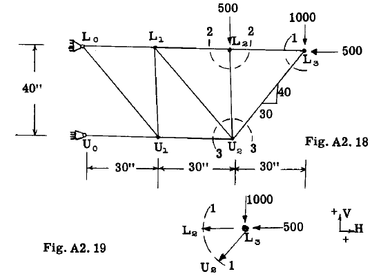
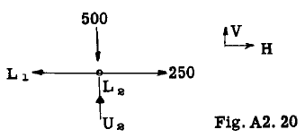
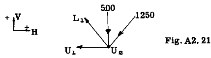
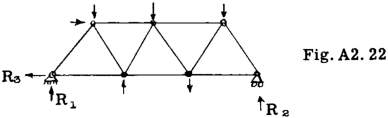

## A2.9 Method of Joints.

If the truss as a whole is in equilibrium
then each member or joint in the truss must
likewise be in equilibrium. The forces in the
members at a truss joint intersect in a common
point, thus the forces on each joint form a
concurrent-coplanar force system. The method
of joints consists in cutting out or isolating
a joint as a free body and applying the laws of
equilibrium for a concurrent force system.
Since only two independent equations are available for this type of system only two unknowns
can exist at any joint. Thus the procedure is
to start at the joint where only two unknowns
exist and continue progressively throughout the
truss joint by joint. To illustrate the method
consider the cantilever truss of Fig. A2.18.
From observation there are only two members
with internal stresses unknown at joint $L_3$.
Fig. A2.19 shows a free body of joint $L_3$. The
stresses in the members $L_$3 $L_2$ and $L_3$ $U_2$ have
been assumed as tension, as indicated by the
arrows pulling away from the joint $L_3$.

The static equations of equilibrium for
the forces acting on joint $L_3$ are $\sum H \text{ and } \sum V = 0$.

$$
\sum V = - 1000 - L_3 U_2 (40/50) = 0\\
\tag{a}
$$

whence, $L_3 U_2 = - 1250 \text{ lb}$. Since the sign
came out minus the stress is opposite to that
assumed in Fig. A2.19 or compression.

$$
\sum H =- 500 - (- 1250)(30/50) - L_2 L_3 = 0
\tag{b}
$$

whence, $L_2 L_3 = 250 \text{ lb}. Since the sign comes
out plus, sense is same as assumed in figure
or tension. 

In equation (b) the load of 1250
in $L_3 L_2$ was substituted as a minus value since
it was found to act opposite to that shown in
Fig. A2.19. Possibly a better procedure would
be to change the sense of the arrow in the free
body diagram for any solved members before writing further equilibrium equations. We must
proceed to joint $L_2$ instead of joint $U_2$, as
three unknown members still exist at joint $U_2$
whereas only two at joint $L_2$. Fig. A2.20 shows
free body of joint $L_2$ cut out by section 2-2
(see Fig. A2.18). The sense of the unknown
member stress $L_2 U_2$ has been assumed as compression (pushing toward joint) as it is obviously acting this way to balance the 500 lb.
load.

For equilibrium of joint $L_2, \sum H \text{ and } \sum V = 0$
$\sum V = - 500 + L_2 U_2 = 0, \text{ whence }, L_2 U_2 = 500 \text{ lb}$.
Since the sign came out plus, the assumed sense
in Fig. A2.20 was correct or compression.

$$
\sum H = 250 - L_2 L_1= 0, \text{ whence } L_2 L_1 = 250 \text{ lb}.
$$

Next consider joint $U_2$ as a free body cut
out by section 3-3 in Fig. A2.18 and drawn as
Fig. A2.21. The known member stresses are shown
with their true sense as previously found. The
two unknown member stresses $U_2 L_1$. and $U_2 U_1$. have
been assumed as tension.

$$
\sum V = - 500 - 1250 (40/50) + U_2 L_1. (40/50) = 0
$$

whence, $U_2 L_1 = 1875 \text{ lb}$. (tension as
assumed.)

$$
\sum H = (-1250) (30/50) - 1875 (30/50) - U_1 U_2 = 0
$$

whence, $U_1 U_2 = - 1875 \text{ lb}$. or opposite in
sense to that assumed and therefore compression.

Note: The student should continue with succeeding joints. In this example involving a cantilever truss it was not necessary to find the
reactions, as it was possible to select joint
$L_3$ as a joint involving only two unknowns. In
trusses such as illustrated in Fig. A2.22 it is
necessary to first find reactions $R_1$ or $R_2$ which
then provides a joint at the reaction point involving only two unknown forces.

