## A2.12 Aircraft Wing Structure. Truss Type with Fabric or Plastic Cover

The metal covered cantilever wing with its
better overall aerodynamic efficiency and sufficient torsional rigidity has practically replaced the externally braced wing except for low
speed commercial or private pilot aircraft as
illustrated by the aircraft in Figs. A2.31 and 32.
The wing covering is usually fabric and
therefore a drag truss inside the wing is
necessary to resist loads in the drag truss
direction. 

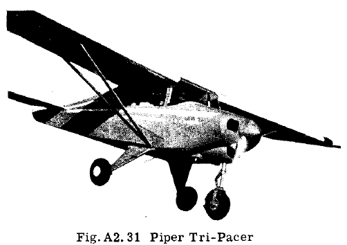

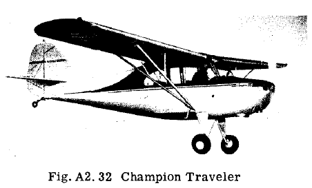

Figs. A2.33 and 34 shows the general structural layout of such wings. The two
spars or beams are metal or wood. Instead of
using double wires in each drag truss bay, a
single diagonal strut capable of taking either
tension or compressive loads could be used.
The external brace struts are stream line tubes.

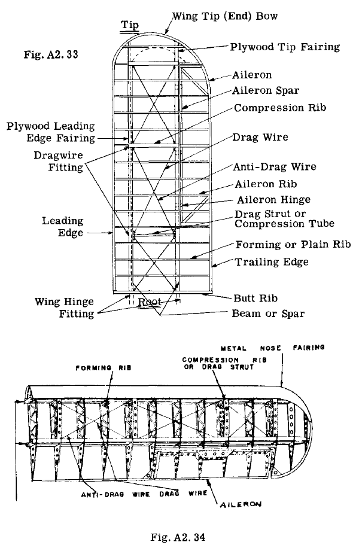

### Example Problem 10. Externally Braced Monoplane Wing Structure

Fig. A2.35 shows the structural dimensional
diagram of an externally braced monoplane wing.
The wing is fabric covered between wing beams,
and thus a drag truss composed of struts and
tie rods is necessary to provide strength and
rigidity in the drag direction. The axial loads
in all members of the lift and drag trusses will
be determined. A simplified air loading will be
assumed, as the purpose of this problem is to
hive the student practice in solving statically
determinate space truss structures.

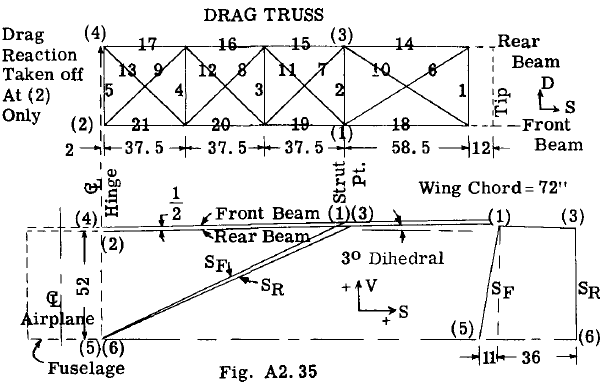

#### ASSUMED AIR LOADING:-

(1) A constant spanwise lift load of 45
Ib/in from hinrge to strut point and then tapering to 22.5 lb/in at the wing tip.

(2) A forward uniform distributed drag
load of 6 lb/in.

The above airloads represent a high angle
of attack condition. In this condition a forward load can be placed on the drag truss as
illustrated in Fig. A2.36. 

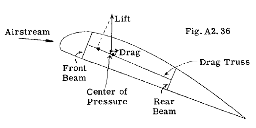

Projecting the air
lift and drag forces on the drag truss direction,
the forward projection due to the lift is greater
than the rearward projection due to the air
drar" which difference in our example problem
has been assumed as 6 lb/in. In a low angle of
attack the load in the drag truss direction
would act rearward.

#### SOLUTION:

The running loads on the front and rear
beams will be calculated as the first step in
the solution. For our flight condition, the
center of pressure of the airforces will be
assumed as shown in Fig. A2.37.

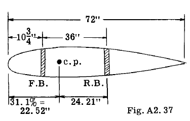

The running load on the front beam will be $45 \times 24.2/36 = 30.26 \text{ lb/in}$., and the remainder or
$45 - 30.26 = 14.74 \text{ lb/in}$ gives the load on the
rear beam.

To solve for loads in a truss system by a
method of joints, all loads must be transferred
to the truss joints. The wing beams are supported at one end by the fuselage and outboard
by the two lift struts. Thus we calculate the
reactions on each beam at the strut and hinge
points due to the running lift load on each
beam.

##### Front Beam

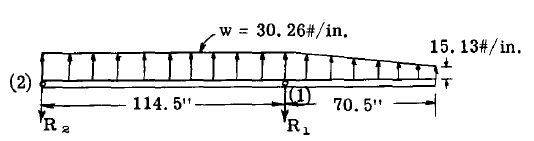

Taking moments about point (2)

$$
\begin{align*}
114.5 R_1 - 114.5 \times 30.26 \times 114.5/2 - 15.13 \times 70.5 \times 149.75 - 15.13 \times 35.25 \times 138 = 0.\\
\text{hence}\\
R_1 = 3770 lb.\\
\text{Take } \sum V = 0 \text{ where V direction is taken normal to beam}\\
\sum V = - R_2 - 3770 + 30.26 \times 114.5 +
(30.26 + 15.13)70.5/2 = 0\\
\text{hence } R_2 = 1295 \text{ lb}.
\end{align*}
$$

(The student should always check results by
taking moments about point (1) to see if $\sum M_1 = 0$)

##### Rear Beam

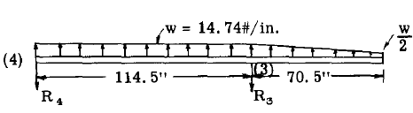

The rear beam has the same span dimensions but
the loading is 14.74 lb/in. Hence beam reactions
$R_4$ and $R_5$ will be $14.74/30.26 = .4875$
times those for front beam.

$$
\begin{align*}
\text{hence } R_3 = .4875 \times 3770 = 1838 lb.\\
R_4 = .4875 \times 1295 = 631 lb.
\end{align*}
$$

The next step in the solution is the
solving for the axial loads in all the members.
We will use the method of joints and consider
the structure made up of three truss systems
as illustrated at the top of the next column,
namely, a front lift truss, a rear lift truss
and a drag truss. The beams are common to both
lift and drag trusses.

Table A2.1 gives the V, D and S projections
of the lift truss members as determined from
information given in Fig. A2.35. The true
member lengths L and the component ratios then
follow by simple calculation.

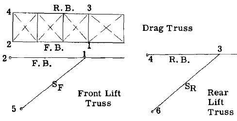

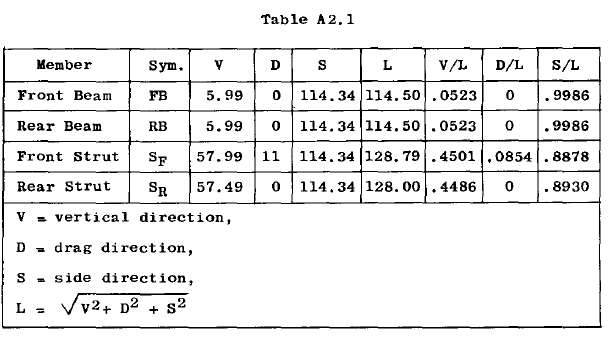

We start the solution of joints by starting
with joint (1). Free body sketches of joint (1)
are slzetched below. All members are considered
two-force members or having pins at each end,
thus magnitude is the only umznown characteristic of each member load. The drag truss members coming in to joint (1) are replaced by a
single reaction called $D_1$. After $D_1$ is found,
its influence in causing loads in drag truss
members can then be found when the drag truss as
a whole is treated. In the joint solution, the
drag truss has been assumed parallel to drag
direction which is not quite true from Fig.
A2.35, but the error on member loads is negligible.

##### JOINT 1 (Equations of Equilibriuti)

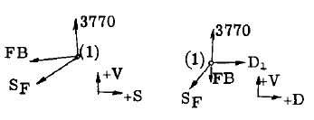

$$
\begin{equation}
\begin{alignedat}{2}
\sum V = 3770 \times .9986 - .0523 FB - .4501 S_F =0 
\end{alignedat} 
\tag{1}
\end{equation}\\
\begin{equation}
\begin{alignedat}{2}
\sum S = - 3770 \times .0523 - .9986 FB - .8878 SF = 0 
\end{alignedat} 
\tag{2}
\end{equation}\\
\begin{equation}
\begin{alignedat}{2}
\sum D = - .0854 S_F + D_1 = 0 
\end{alignedat} 
\tag{3}
\end{equation}
$$

Solving equations 1, 2 and 3, we obtain

$$
\begin{align*}
FB = -8513 \text{ lb. (compression)}\\
S_F = 9333 \text{ lb. (tension)}\\
D_1 = 798 \text{ lb. (aft)}
\end{align*} 
$$

##### Joint (3) (Equations of equilibrium)

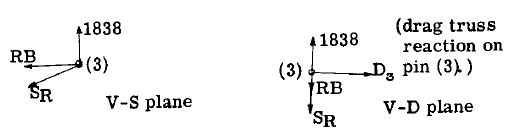

$$
\begin{equation}
\begin{alignedat}{2}
\sum V = 1838 \times .9986 - .0523 RB - .4486 S_R =0
\end{alignedat} 
\tag{4}
\end{equation}\\
\begin{equation}
\begin{alignedat}{2}
\sum S = - 1838 \times .0523 - .9986 RB -.8930 SR =0
\end{alignedat} 
\tag{5}
\end{equation}\\
\begin{equation}
\begin{alignedat}{2}
\sum D = D_3 + 0 = 0
\end{alignedat} 
\tag{6}
\end{equation}
$$

Solving equations 4, 5 and 6, we obtain

$$
\begin{align*}
RB = -4189 \text{ lb. (compression)}\\
S_R = 4579 \text{ lb. (tension)}\\
D_3 = 0 
\end{align*} 
$$

Fig. A2.38 shows the reactions of the lift
struts on the drag truss at joints (1) and (3)
as found above.

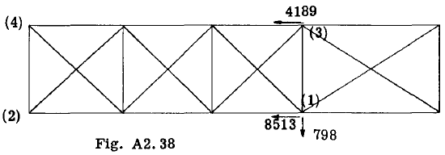

##### Drag Truss Panel Point Loads Due to Air Drag Load.

It was assumed that the air load components
in the drag direction were 6 lb./in. of wing
acting forward.

The distributed load of 6 lb./in. is replaced by concentrated loads at the panel points
as shown in Fig. A2.39. Each panel point takes
one half the distributed load to the adjacent
panel point, except for the two outboard panel
points which are affected by the overhang tip
portion.

Thus the outboard panel point concentration
of 254 lb. is determined by taking moments about
(3) of the drag load outboard of (3) as follows:

$$
P = 70.5 \times 6 \times 35s.25/58.5 = 254 \text{ lb}.
$$

To simplify the drag truss solution, the drag
strut and drag wires in the inboard drag truss
panel have been modified to intersect at hinge
points (2) and (4). In the design of the beam
and fittings at this point, the effect of the
actual conditions of eccentricity should of
course be considered.

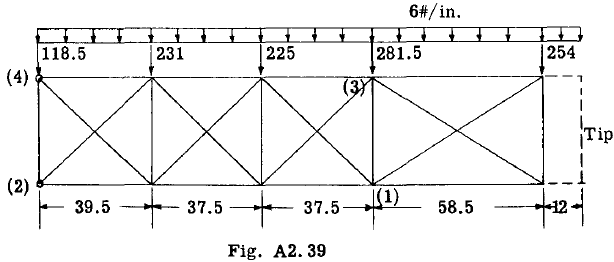

##### Combined Loads on Drag Truss

Adding the two load systems of Figs. A2.38
and A2.39, the total drag truss loading is obtained as shown in Fig. A2.40. The resulting
member axial stresses are then solved for by the
method of index stresses (Art. A2.9). The
values are indicated on the truss diagram. It
is customary to make one of the fittings attaching wing to fuselage incapable of transferring
drag reaction to fuselage, so that the entire
drag reaction from wing panel on fuselage is
definitely confined to one point. In this example point (2) has been assumed as point where
drag is resisted. Those drag wires which would
be in compression are assumed out of action.

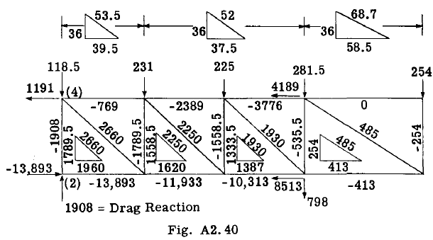

##### Fuselage Reactions

As a check on the work as well as to obtain
reference loads on fuselage from wing structure,
the fuselage reactions will be checked against
the externally applied air loads. Table A2.2
gives the calculations in table form.

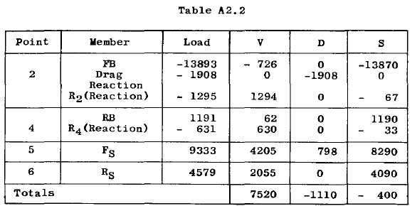

Applied Air Loads:

$$
\begin{align*}
\text{V component} = (3770 + 1295 + 1838 + 631) .9986 = 7523 \text{ lb. (error 3 lb.)}\\
\text{D component} = -185 \times 6 = 1110 \text{lb. (error = 0)}\\
\text{S component} = -(3770 + 1295 + 1838 + 631).0523 = 394 \text{lb. (error 6 lb.)}
\end{align*} 
$$

The wing beams due to the distributed lift
air loads acting upon them, are also sUbjected
to bending loads in addition to the axial loads.
The wing beams thus act as beam-columns. The
subject of beam-column action is treated in
another chapter of this book.

If the wing is covered with metal skin
instead of fabric, the drag truss can be omitted
since the top and bottom skin act as webs of a
beam which has the front and rear beams as its
flange members. The wing is then considered as
a box beam subjected to combined bending and
axial loading.

### Example Problem 11. 3-Section Externally Braced Wing.

Fig. A2.41 shows a high wing externally
braced wing structure. The wing outer panel has
been made identical to the wing panel of example
problem 1. This outer panel attached to the cen
ter panel by single pin fittings at points (2)
and (4). Placing pins at these points make the
structure statically determinate, whereas if the
beams were made continuous through all 3 panels,
the reactions of the lift and cabane struts on
the wing beams would be statically indeterminate
since we would have a 3-span continuous beam
resting on settling supports due to strut deformation.
The fitting pin at points (2) and
(4) can be made eccentric with the neutral axis
of the beams, hence very little is gained by
making beams continuous for the purpose of decreasing
the lateral beam bending moments. For
assembly, stowage and shipping it is convenient
to build such a wing in 3 portions. If a
multiple bolt fitting is used as points (2) and
(4) to obtain a continuous beam, not much is
gained because the design reqUirements of the
various governmental agencies specify that the
wing beams must also be analyzed on the assmnption
that a mUltiple bolt fitting provides
only 50 percent of the full continuity.

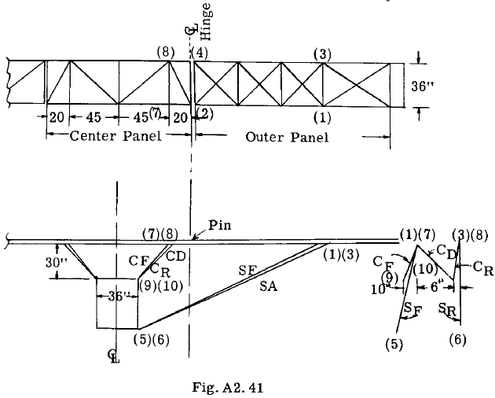

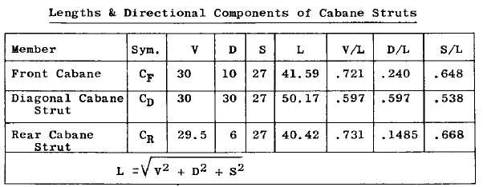

The air loads on the outer panel are taken
identical to those in example problem 1. Likewise
the dihedral and direction of the lift
struts SF and SR have been made the same as in
example problem 1. Therefore the analysis for
the loads in the outer panel drag and lift trus
trusses is identical to that in problem 1. The
solution will be continued assuming the running
lift load on center panel of 45 lb./in. and a
forward drag load of 6 lb./in.

#### Solution of Center Panel

##### Center Rear Beam

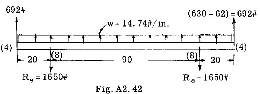

Fig. A2.42 shows the lateral loads on the center
rear beam. The loads consist of the distributed
air load and the vertical component of the forces
exerted by outer panel on center panel at
pin point (4). From Table A2.2 of example problem
1, this resultant V reaction equals $630 + 62 = 692 \text{ lb.}$

The vertical component of the cabane reaction
at joint (8) equals one half the total
beam load due to symmetry of loading or $65 \times 14.74 + 692 =1650 \text{ lb.}$

Solution of force system at Joint 8

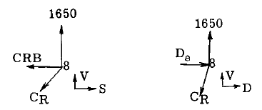

$$
\begin{align*}
\sum V = 1650 - .731 C_R = 0\\
\text{whence}\\
C_R = 1650/.731 = 2260 \text{ lb. (tension)}\\
\sum S = - CRB - 2260 \times .668 = 0\\
\text{whence}\\
CRB = - 1510 \text{ lb. (compression)}\\
\sum D = D_8 - 2260 \times .1485 = 0\\
\text{whence}\\
D_8 = 336 \text{ lb. drag truss reaction}
\end{align*} 
$$

##### Center Front Beam

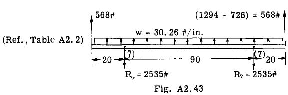

Fig. A2.43 shows the V loads on the center front
beam and the resulting V component of the cabane
reaction at joint (7).

##### Solution of force system at Joint 7

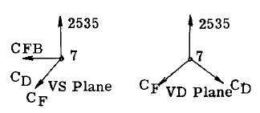

$$
\begin{align*}
\sum V = 2535 - .721 C_F - .597 C_D =0\\
\sum S = - CFB - .648 C_F - .538 C_D = 0\\
\sum D = - .240 C_F + .597 C_D =0\\
\end{align*} 
$$

Solving the three equations, we obtain

$$
\begin{align*}
CFB = - 2281 \text{ (compression)}\\
C_F =  2635\\
C_D = 1058
\end{align*} 
$$

##### Solution for Loads in Drag Truss Members

Fig. A2.44 shows all the loads applied to
the center panel drag truss. The Sand D reactions
from the outer panel at joints (2) and
(4) are taken from Table A2.2 of problem 1. The
drag load of 336 lb. at (8) is due to the rear
cabane strut, as is likewise the beam axial load
of - 1510 at (8). The axial beam load of - 2281 lb. at (7) is due to reaction of front
cabane truss. The panel point loads are due to
the given running drag load of 6 lb./in. acting
forward.

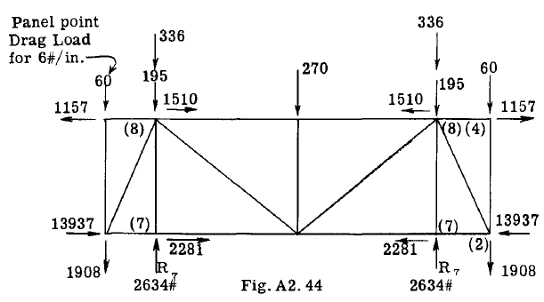

The reaction which holds all these drag
truss loads in equilibrium is supplied by the
cabane truss at point (7) since the front and
diagonal cabane struts intersect to form a rigid
triangle. Thus the drag reaction R equals one
half the total drag loads or 2634 lb.

Solving the truss for the loading of Fig.
A2.44 we obtain the member axial loads of Fig.
A2.45.

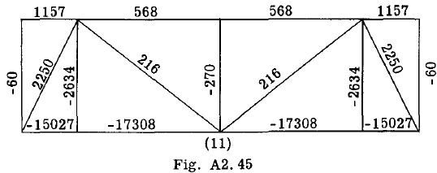

##### Loads in Cabane Struts Due to Drag Reaction at Point 7

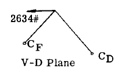

$$
\begin{align*}
\sum D = - 2634 - .240 C_F + .597 C_D =0\\
\sum V = - .721 C_F - .597 C_D = 0\\
\end{align*} 
$$

Solving for $C_F$ and $C_D$, we obtain

$$
\begin{align*}
C_F = -2740\text{ lb. (compression)}\\
C_D = 3310\text{ (tension)}
\end{align*} 
$$

adding these loads to those previously calculated
for lift loads:

$$
\begin{align*}
C_F = -2740 + 2635 -105\\
C_D = 1058 + 3310 = 4368 \text{ lb.}\\
C_R = 2260 \text{ lb.}
\end{align*} 
$$

##### Fuselage Reactions

As a check on the work the fuselage reactions
will be checked against the applied loads.
Table A2.3 gives the V, D and S components of 
the fuselage reactions.

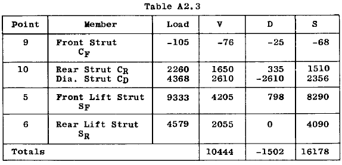

##### Applied Air Loads

$$
\begin{align*}
V component = 7523 \text{ (outer panel)} + 65 \times 45 = 10448 \text{ (check)}\\
D component = - 1110 \text{ (outer panel)} - 65 \times 6 = - 1500 \text{ (error 2 lb.)}
\end{align*} 
$$

The total side load on a vertical plane thru
centerline of airplane should equal the S component of the applied loads. The applied side
loads $= - 394$ lb. (see problem 1). The air load
on center panel is vertical and thus has zero S
component.

From Table A2.3 for fuselage reactions
have $\sum S = 16178$. From Fig. A2.45 the load in
the front beam at $\pounds$ of airplane equals - 17308
and 568 for rear beam. The horizontal component
of the diagonal drag strut at joints II equals
$216 \times 45/57.6 = 169 \text{ lb}$.

Then total S components $= 16178 - 17308 +
568 + 169 = - 393 \text{ lb}$. which checks the side
component of the applied air loads.

### Example Problem 12. Single Spar Truss Plus Torsional Truss System.

In small wings or control surfaces, fabric
is often used as the surface covering. Since
the fabric cannot provide reliable torsional
resistance, internal structure must be of such
design as to provide torsional strength. A
single spar plus a special type of truss system
is often used to give a satisfactory structure.
Fig. A2.46 illustrates such a type of structure,
namely, a trussed single spar AEFN plus a triangular truss system between the spar and the
trailing edge OS. Fig. A2.46 (a, b, c) shows
the three projections and dimensions. The air
load on the surface covering of the structure
is assumed to be 0.5 lb./in. 2 intensity at spar
line and then varying linearly to zero at the
trailing edge (See Fig. d).

The problem will be to determine the axial
loads in all the members of the structure. It
will be assumed that all members are 2 force
members as is usually done in finding the
primary loads in trussed structures.

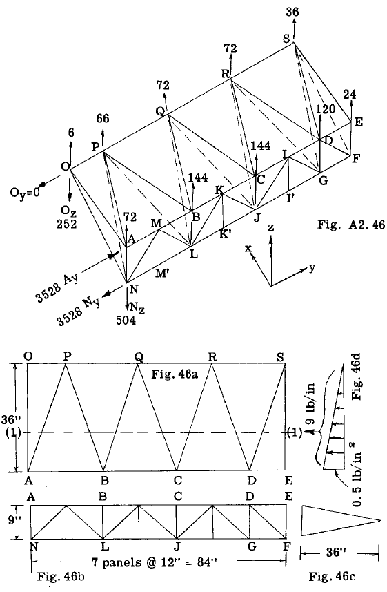

#### SOLUTION:

The total air load on the structure equals
the average intensity per square inch times the
surface area or $(0.5)(.5)(36 \times 84) = 756 \text{ lb}$. In
order to solve a truss system by a method of
joints the distributed load must be replaced by
an equivalent load system acting at the joints
of the structure. Referring to Fig. (d), the
total air load on a strip 1 inch wide and 36
inches long is $36(0.5)/2 = 9 \text{ lb}$. and its c.g.
or resultant location is 12 inches from line AE.
In Fig. A2.46a this resultant load of 9 lb./in. is
imagined as acting on an imaginary beam located
along the line 1-1. This running load applied
along this line is now replaced by an equivalent
force system acting at joints OPQRSEDBCA. The
results of this joint distribution are shown by
the joint loads in Fig. A2.46. To illustrate
how these joint loads were obtained, the calculations for loads at joints ESDR will be given.

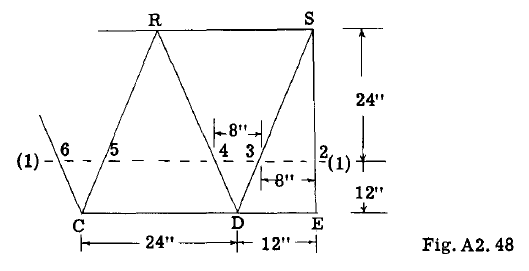

Fig. A2.48 shows a portion of the structure
to be considered. For a running load of 9
lb./in., along line 1-1, reactions will be for
simple beams resting at points 2, 3, 4, 5, etc.
The distance between 2-3 is 8 inches. The total
load on this distance is $8 \times 9 = 72 \text{ lb}$. One
half or 36 lb. goes to point (2) and the other
half to point (3). The 36 lb. at (2) is then
replaced by an equivalent force system at E and
8 or (36)/3 = 12 lb. to Sand $(36)(2/3) = 24$ to
E. The distance between points (3) and (4) is
8 inches and the load is $8 \times 9 = 72 \text{ lb}$. One
half of this or 36 goes to point (3) and this
added to the previous 36 gives 72 lb. at (3).
The load of 72 is then replaced by an equivalent
force system at Sand D, or (72)/3 = 24 lb. to
8 and (72)(2/3) = 48 to D. The final load at S
is therefore $24 + 12 = 36 \text{ lb}$. as shown in Fig.
A 2.46. Due to symmetry of the triangle CRD,
one half of the total load on the distance CD
goes to points (4) and (5) or $(24 \times 9)/2 = 108\text{ lb}$. The distribution to D is therefore $(108)(2/3) = 72$ and $(108)/3 = 36$ to R. Adding 72
to the previous load of 48 at D gives a total
load at D = 120 lb. as shown in Fig. A2.46.
The 108 lb. at point (5) also gives $(108)/3 =
36$ to R or a total of 72 lb. at R. The student
should check the distribution to other joints
as shown in Fig. A2.46.

To check the equivalence of the derived
joint load system with the original air load
system, the magnitude and moments of each
system must be the same. Adding up the total
joint loads as shown in Fig. A2.46 gives a total
of 756 lb. which checks the original air load.
The moment of the total air load about an x
axis at left end of structure equals $756 x 42 =
31752 \text{ in.lb}$. The moment of the joint load
system in Fig. A2.46 equals $(66 \times 12) + (72 \times 36) + (72 \times 60) + (56 \times 84) + 144 (24 + 48) + (120 \times 72) + (24 \times 84) = 31752 \text{ in.lb.}$ or a
check. The moment of the total air load about
line AE equals $756 x 12 = 9072 \text{ in.lb.}$ The
moment of the distributed joint loads equals
$(6 + 66 + 72 + 72 + 36)36 = 9072$ or a check.

##### Calculation of Reactions

The structure is supported by single pin
fittings at points A, N and 0, with pin axes
parallel to x axis. It will be assumed that
the fitting at N takes off the spar load in
Z direction. Fig. A2.46 shows the reactions
$O_y, O_z, A_y, N_y, N_z$. To find $O_z$ take moments
about y axis along spar AEFN.

$$
\begin{align*}
\sum M_y = (6 + 66 + 72 + 72 + 36)36 - 36 O_z = 0\\
\text{whence } O_z = 252 \text{ lb. acting down as assumed.}\\
\text{To find } O_y \text{ take moments about z axis through point (A).}\\
\sum M_z = 0 + 36 O_y = 0, Oy = 0
\end{align*} 
$$

To find $A_y$ take moments about x axis through
point N. The moment of the air loads was previously calculated as - 31752, hence,

$$
\begin{align*}
\sum M_x = - 31752 + 9 A_y = 0, \text{ whence, } A_y = 3528 \text{ lb.}\\
\text{To find } N_y \text{ take } \sum F_y = 0\\
\sum F_y = 3528 - N_y = 0, \text{ hence } N_y = 3528 \text{ lb.}\\
\text{To find } N_z \text{ take } \sum F_z = 0\\
\sum F_z = -252 + 756 - N_z = 0, \text{ hence }N_z = 504 \text{ lb.}
\end{align*} 
$$

The reactions are all recorded on Fig.
A2.46.

##### Solution of Truss Member Loads

For simplicity, the load system on the
structure will be considered separately as two
load systems. One system will include only
those loads acting along the line AE and the
second load system will be remaining loads
which act along line OS. Since no bending
moment can be resisted at joint 0, the external
load along spar AE will be reacted at A and N
entirely or in other words, the spare alone
resists the loads on line AE.

Fig. A2.49 shows a diagram of this spar
with its joint external loading. The axial
loads produced by this loading are written on
the truss members. (The student should check
these member loads.)

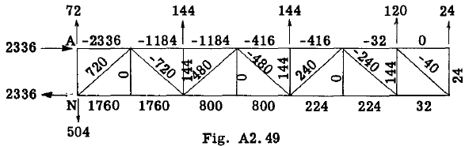

##### TRIANGULAR TRUSS SYSTEM

The load system along the trailing edge OS
causes stresses in both the spar truss and the
diagonal truss system. The support fitting at
point O provides a reaction in the Z direction
but no reacting moment about the x axis. Since
the loads on the trailing edge lie on a y axis
through O, it is obvious that all these loads
flow to point O. Since the bending strength of
the trailing edge member is negligible, the
load of 36 lb. at Joint S in order to be transferred to point O through the diagonal truss
system must follow the path SDRCQBPAO. In like
manner the load of 72 at R to reach O must take
the path RCQBPAO, etc.

##### Calculation of Loads in Diagonal Truss Members:-

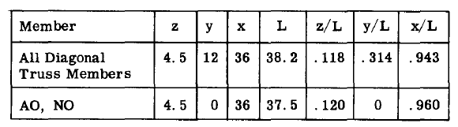

##### Consider Joint S

The triangular truss SEF cannot assist in
transferring any portion of the 36 lb. load at
S because the reaction of this truss at EF
would put torsion on the spar and the spar has
no appreciable torsional resistance.

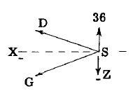

Considering Joint S
as a free body and writing
the equilibrium equations:

$$
\begin{align*}
\sum F_x = -.943 DS - .943 GS = 0\\
\text{whence } DS = - GS\\
\sum F_z = 36 + .118 DS - .118 GS = 0\\
\text{Subt. } DS = - GS \text{ and solving for GS, gives }\\
 GS = 159 \text{ lb. (tension)}, DS =-159 \text{ (compression)}
\end{align*} 
$$

##### Consider Joint D

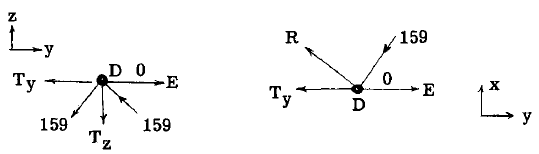

Let $T_y$ and $T_z$ be reactions of diagonal
truss system on spar truss at Joint D.

$$
\begin{align*}
\sum F_x =- 159 \times .943 + .943 DR =0, \text{ hence } DR = 159 \text{ lb.}\\
\sum F_z = - 159 \times .118 + 159 \times .118 - T_z =0\\
\end{align*} 
$$

whence $T_z =0$, which means the diagonal
truss produces no Z reaction or shear load on
spar truss at D.

$$
\begin{align*}
\sum F_y = - .314 \times 159 - .314 \times 159 - T_y = 0\\
\text{whence } T_y = - 100 \text{ lb.}
\end{align*} 
$$

If joint G is investigated in the same manner,
the results will show that $T_z = 0$ and $T_y = 100$.

The results at joint D shows that the rear
diagonal truss system produces no shear load
reaction on the spar but does produce a couple
force on the spar in the Y direction which produces
compression in the top chord of the spar
truss and tension in the bottom chord.

##### Consider Joint R

The load to be transferred to truss RCJR
is equal to the 72 lb. at R plus the 36 lb. at
S which comes to joint R from truss DRG.

$$
\begin{align*}
\text{Hence load in }RC = (72 + 36)0.5 x (1/.118)
457 \text{ lb.}\\
\text{Whence } RJ = 457, CQ = 457 \text{ and } JQ = - 457
\end{align*} 
$$

##### Joint Q

Load to be transferred to truss $QBL =72 + 72 + 36 =180$ lb.
Hence load in $QB = (180 x 0.5)(1/.118) = - 762.$
Whence $QL =762, BP =762, LP =- 762$

##### Joint P

$$
\begin{align*}
Load = 180 + 66 =246\\
\text{Load in } PA = (246 x 0.5)(1/.118) =- 1040\\
\text{Whence } PN =1040
\end{align*} 
$$

Consider Joint (A) as a free body.

$$
\begin{align*}
\sum F_x =- 1040 \times .943 + .960 AO =0, AO =
1022 \text{ lb.}
\end{align*} 
$$

In like manner, considering Joint N, gives $NO =- 2022$ lb.

##### Couple Force Reactions on Spar

As pointed out previously, the diagonal
torsion truss produces a couple reaction on the
spar in the y direction. The magnitude of the
force of this couple equals the y component of
the load in the diagonal truss members meeting
at a Spar joint. Let $T_y$ equal this reaction
load on the spar.

At Joint C:-

$$
T_y = - (457 + 457).314 = - 287 \text{ lb.}
$$

Likewise at Joint J, $T_y$ = 287

At Joint B:-

$$
T_y = - (762 + 762).314 = - 479
$$

Likewise at Joint L, $T_y = 479$

At Joint A:-

$$
T_y = - (1040 x .314) = - 326
$$

Likewise at Joint N, $T_y = 326$

These reactions of the torsion truss upon
the spar truss are shown in Fig. A2.50. The
loads in the spar truss members due to this
loading are written adjacent to each truss
member. Adding these member loads to the loads
in Fig. A2.49, we obtain the final spar truss
member loads as shown in Fig. A2.51.

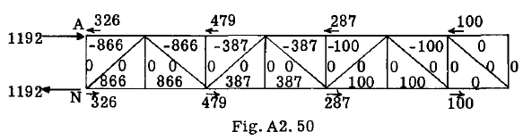

If we add the reactions in Figs. A2.50 and
A2.49, we obtain 3528 and 504 which check the
reactions obtained in Fig. A2.46.
