## A2.14 Example Problems of Calculating Reactions and Loads on Members of Landing Gear Units

In its simplest form, a landing gear could
consist of a single oleo strut acting as a
cantilever beam with its fixed end being the
upper end which would be rigidly fastened to
the supporting structure. The lower cylinder
of the oleo strut carries an axle at its lower
end for attaching the wheel and tire. This
cantilever beam is subjected to bending in two
directions, torsion and also axial loads. Since
the gear is usually made retractable, it is
difficult to design a single fitting unit at
the upper end of the oleo strut that will
resist this combination of forces and still
permit movement for a simple retracting mechanism. Furthermore, it would be difficult to
provide carry-through supporting wing or fuselage structure for such large concentrated
load systems.

Thus to decrease the magnitude of the
bending moments and also the bending flexibility
of the cantilever strut and also to simplify
the retracting problem and the carry-through
structural problem, it is customary to add one
or two braces to the oleo strut. In general,
effort is made to make the landing gear
structure statically determinate by using
specially designed fittings at member ends or
at support points in order to establish the
force characteristics of direction and point of
application.

Two example problem solutions will be presented, one dealing with a gear with a single
wheel and the other with a gear involving two
wheels.

### Example Problem 13

Fig. A2.55 shows the projections of the
landing gear configuration on the VB and VD
planes. Fig. A2.56 is a space dimensional
diagram. In landing gear analysis it is common
to use V, D and S as reference axes instead of
the symbols Z, X and Y. This gear unit is
assumed as representing one side of the main
gear on a tricycle type of landing gear system.
The loading assumed corresponds to a condition
of nose wheel up or tail down. (See lower
sketch of Fig. A2.52). The design load on the
wheel is vertical and its magnitUde for this
problem is 15000 lb.

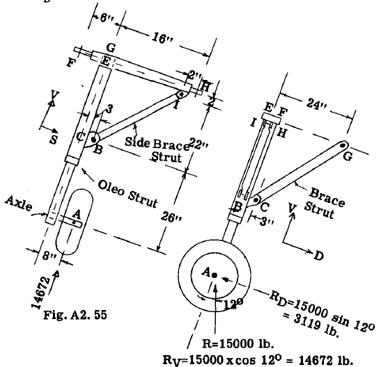

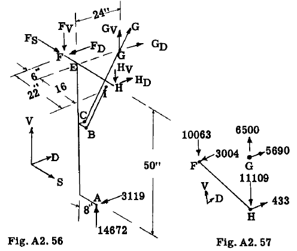

The gear unit is attached to the supporting
structure at points F, H and G. Retraction of
the gear is obtained by rotating gear rearward
and upward about axis through F and H. The
fittings at F and H are designed to resist no
bending moment. Hence, reactions at F and Hare
unknown in magnitUde and direction. Instead of
using the reaction and an angle as uhknowns,
the resultant reaction is replaced by its Y and
D components as shown in Fig. A2.56. The reaction at G is unknown in magnitUde only since
the pin fitting at each end of member GC fixes
the direction and line of action of the reaction
at G. For convenience in calculations, the
reaction G is replaced by its components $G_V$ and
$G_D$. For a side load on the landing gear, the
reaction in the S direction is taken off at
point F by a specially designed unit.

#### SOLUTION

The supporting reactions upon the gear at
points F, H, and G will be calculated as a
beginning step. There are six unknowns, namely
$F_S, F_V, F_D, H_V, HD$ and G (See Fig. A2.56). With
6 equations of static equilibrium available for
a space force system, the reactions can be found
by statics. Referring to Fig. A2.56:-

$$
\begin{align*}
\text{To find } F_S \text{ Ttake } \sum S = 0\\
F_S + 0 = 0, \text{ hence } F_S = 0\\
\end{align*} 
$$

To find reaction $G_V$ take moments about an S axis through points F, H.

$$
\begin{align*}
\sum M_S = 3119 \times 50 - 24 G_V = 0\\
\text{Whence, } G_V =6500 \text{ lb. with sense as assumed.}
\end{align*} 
$$

(The wheel load of 15000 lb. has been resolved
into V and D components as indicated in Fig.
A2.55) .

With $G_V$ known, the reaction G equals $(6500)(31.8/24) = 8610$ lb. and similarly the component $G_D = (6500)(21/24) = 5690$ lb.

To find $F_V$, take moments about a D axis
through point H.

$$
\begin{align*}
\sum M_H(D) = 16 G_V + 14672 \times 8 - 22 F_V = 0 = 16 \times 6500 + 14672 \times 8 - 22 F_V = 0\\
\text{Whence } F_V = 10063 \text{ lb. with sense as assumed.}\\
\text{To find } H_D, \text{take moments about V axis
through F.}\\
\sum M_F(V) = - 6 G_D - 22 H_D + 3119 \times 14 = 0 = - 6 \times 5690 - 22 H_D + 3119 \times 14 = 0\\
\text{Whence, } H_D = 433 \text{ lb.}\\
\text{To find } F_D \text{ take } \sum D = 0\\
\sum D = - F_D + H_D + G_D - 3119 = 0 = - F_D + 433 + 5690 - 3119 = 0\\
\text{Whence, } F_D = 3004 \text{ lb.}\\
\text{To find } H_V \text{ take } \sum V = 0\\
\sum V = - F_V + G_V - H_V + 14672 = 0 = - 10063 + 6500 - H_V + 14672 = 0\\
\text{Whence, } H_V = 11109 \text{ lb.}
\end{align*} 
$$

Fig. A2.57 summarizes the reactions as found.
The results will be checked for equilibrium of
the structure as a whole by taking moments about
D and V axes through point A.

$$
\begin{align*}
\sum M_A(D) = - 10063 \times 14 + 6500 \times 8 + 11109 \times 8 = - 140882 + 52000 + 88882 = 0 \text{ (check)}\\
\sum M_A(V) = 5690 \times 8 - 433 \times 8 - 3004 \times 14 = 45520 - 3464 - 42056 = 0 \text{ (check)}
\end{align*} 
$$

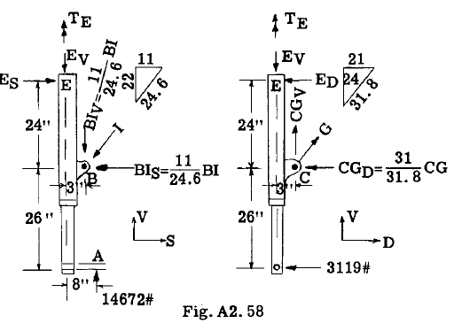

The next step in the solution will be the
calculation of the forces on the oleo strut
unit. Fig. A2.58 shows a free body of the oleostrut-axle unit. The brace members BI and CG
are two force members due to the pin at each
end, and thus magnitude is the only unknown reaction characteristic at points Band C. The
fitting at point E between the oleo strut and
the top cross member FH is designed in such a
manner as to resist torsional moments about the
oleo strut axis and to provide D, V and S force
reactions but no moment reactions about D and S
axes. The unknowns are therefore $BI, CG, E_S, E_V, E_D and T_E$ or a total of 6 and therefore
statically determinate. The torsional moment
TE is represented in Fig. A2.58 by a vector
with a double arrow. The vector direction
represents the moment axis and the sense of
rotation of the moment is given by the right
hand rule, namely, with the thumb of the right
hand pointing in the same direction as the
arrows, the curled fingers give the sense of
rotation.

To find the resisting torsional moment $T_E$
take moments about V axis through E.

$$
\begin{align*}
\sum M_E(V) = - 3119 \times 8 + T_E = 0, \\
\text{ hence } T_E = 24952 in. \text{ lb.}\\
\text{To find CG take moments about S axis through E.\\
\sum M_E(S) = 3119 \times 50 - (24/31.8) CG \times 3 24 (21/31.8) CG = 0\\
\text{Whence, } CG = 8610 \text{ lb.}\\
\end{align*} 
$$
    
This checks the value previously obtained
when the reaction at G was found to be 8610.
The D and V components of CG thus equal,

$$
\begin{align*}
CG_D = 8610 (21/31.8) = 5690 \text{ lb.}\\
CG_V = 8610 (24/31.8) = 6500 \text{ lb.}\\
\end{align*} 
$$

To find load in brace strut BI, take moments
about D axis through point E.

$$
\begin{align*}
\sum M_E(D) = - 14672 \times 8 + 3 (BI) 22/24.6 +
24 (BI) 11/24.6 = 0\\
\text{Whence, } BI = 8775 \text{ lb.}\\
\text{and thus,} \\
BI_V = (8775)(22/24.6) = 7840 \text{ lb.}\\
BI_S = (8775)(11/24.6) = 3920 \text{ lb.}\\
\text{To find } E_S \text{ take } \sum S = 0\\
\sum S = E_S - 3920 = 0, \text{ hence } E_S = 3920\\
\text{To find } E_D \text{ take } \sum D = 0\\
\sum D = 5690 - 3119 - E_D = 0, \text{ hence } E_D = 2571\\
\text{To find } E_V \text{ take } \sum V = 0\\
\sum V = - E_V + 14672 - 7840 + 6500 = 0, \\
\text{ hence } EV = 13332 \text{ lb.}
\end{align*} 
$$

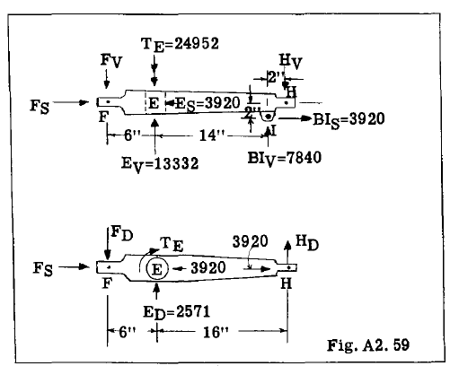

Fig. A2.59 shows a free body of the top
member FH. The unknowns are $F_V, F_D, F_S, H_V \text{ and } H_D$. The loads or reactions as found from the
analysis of the oleo strut unit are also recorded on the figure. The equations of
equilibrium for this free body are:-

$$
\begin{align*}
\sum S = 0 = - 3920 + 3920 + F_S = 0, \text{ or } F_S = 0\\
\sum M_F(D) = 22 H_V - 3920 \times 2 - 7840 \tiems 20 13332 \times 6 = 0
\end{align*} 
$$

Whence, $H_V$ = 11110 lb. This check value
was obtained previously, and therefore is a
check on our work.

$$
\begin{align*}
\sum M_F(V) = 24952 - 2571 \times 6 - 22 H_D = 0\\
\text{ whence, } H_D = 433 \text{ lb.}\\
\sum V = - F_V + 13332 + 7840 - 11110 = 0\\
\text{whence, } F_V = 10063\\
\sum D =  - F_D + 2571 + 433 = 0\\
\text{whence, } F_D = 3004 \text{ lb.}
\end{align*} 
$$

Thus working through the free bodies of
the oleo strut and the top member FH, we come
out with same reactions at F and H as obtained
when finding these reactions by equilibrium
equation for the entire landing gear.

The strength design of the oleo strut unit
and the top member FH could now be carried out
because with all loads and reactions on each
member known, axial, bending and torsional
stresses could now be found.

The loads on the brace struts CG and BI
are axial, namely, 8610 lb. tension and 8775
lb. compression respectively, and thus need no
further calculation to obtain design stresses.

#### TORQUE LINK

The oleo strut consists of two telescoping
tubes and some means must be provided to transmit torsional moment between the two tubes and
still permit the lower cylinder to move upward
into the upper cylinder. The most common way
of providing this torque transfer is to use a
double-cantilever-nut cracker type of structure.
Fig. A2.60 illustrates how such a torque length
could be applied to the oleo strut in our
problem.

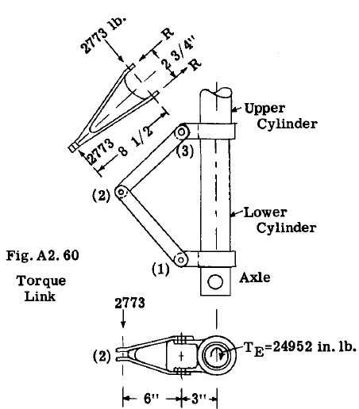

The torque to be transferred in our problem is 24952 in.lb.

The reaction $R_2$ between the two units of
the torque link at point (2), see Fig. A2.60,
thus equals $24952/9 = 2773$ lb.

The reactions $R_3$ at the base of the link at
point (3) $= 2773 x 8.5/2.75 = 8560$ lb. With
these reactions known, the strength design of
the link units and the connections could be
made.

### Example Problem 14

The landing gear as illustrated in Fig.
A2.61 is representative of a main landing gear
which could be attached to the under side of a
wing and retract forward and upward about line
AB into a space provided by the lower portion
of the power plant nacelle structure. The oleo
strut OE has a sliding attachment at E, which
prevents any vertical load to be taken by
member AB at E. However, the fitting at E does
transfer shear and torque reactions between the
oleo strut and member AB. The brace struts
GD, FD and CD are pinned at each end and will
be assumed as 2 force members.

An airplane level landing condition with
unsymmetrical wheel loading has been assumed as
shown in Fig. A2.61.

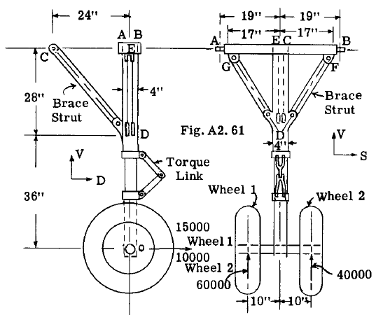

#### SOLUTION

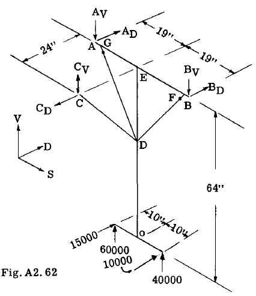

The gear is attached to supporting structure at points A, Band C. The reactions at
these points will be calcUlated first, treating
the entire gear as a free body. Fig. A2.62
shows a space diagram with loads and reactions.
The reactions at A, Band C have been replaced
by their Y and D components.

To find reaction $C_V$ take moments about an
S axis through points AB.

$$
\sum M_{AB} = - (15000 + 10000) 64 + 24 C_V = 0
$$

Whence $C_V = 66666$ lb. With sense as
assumed in Fig. A2.62.

The reaction at C must have
a line of action along the line
CD since member CD is pinned at
each end, thus the drag component
and the load in the strut
CD follow as a matter of geometry. Hence,

$$
\begin{align*}
C_D =66666 (24/28) =57142 \text{ lb.}
C_D =66666 (36.93/28) =87900 \text{ lb. tension}
\end{align*} 
$$

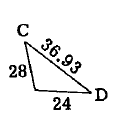

To find By take moments about a drag axis
through point (A).

$$
\begin{align*}
\sum M_A(D) = - 60000 \times 9 - 40000 \times 29 - 66666 \times 19 + 38 B_V = 0\\
\text{whence, } B_V = 78070 \text{ lb.}\\
\text{To find } A_V, \text{ take } \sum V = 0\\
\sum V = - 78070 + 60000 + 40000 + 66666 - V_A= 0\\
\text{whence, } A_V = 88596 \text{ lb.}
\end{align*} 
$$

To find BD take moments about
point (A).

$$
\begin{align*}
\sum M_A(V) = 57142 \times 19 - 15000 \times 9 - 10000 \times 29 - 38 B_D = 0\\
\text{whence, } B_D = 17386 \text{ lb.}\\
\text{To find } A_D \text{ take } \sum D =0\\
\sum D = - 57142 + 15000 + 10000 + 17386 + A_D =0\\
\text{whence } A_D = 14756 \text{ lb.}
\end{align*} 
$$

To check the results take moments about V
and D axes through point O.

$$
\begin{align*}
\sum M_O(V) = 5 \times 10000 + 14756 \times 19 - 17386 \times 19 = 0 \text{ (check)}\\
\sum M_O(D)=20000 \times 10 - 88596 \times 19 + 78070 \times 19 =0 \text{ (check)}
\end{align*} 
$$

##### REACTIONS ON OLEO STRUT OE

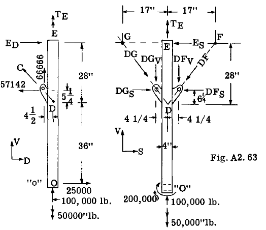

Fig. A2.63 shows a free body of the oleostrut OE. The loads applied to the wheels at
the axle centerlines have been transferred to
point (O). Thus the total V load at (O) equals
$60000 + 40000 =100000$ and the total D load
equals $15000 + 10000 =25000$. The moment of
these forces about V and D axes through (O) are
$M_O(V) = (15000 - 10000) 10 =50000$ in.lb. and
$M_O(D) =(60000 - 40000) 10 =200000$ in.lb.
These moments are indicated in Fig. A2.63 by
the vectors with double arrows. The sense of
the moment is determined by the right hand thumb
and finger rule.

The fitting at point E is designed to
resist a moment about V axis or a torsional
moment on the oleo strut. It also can provide
shear reactions $E_S$ and $E_D$ but no bending
resistance about S or D axes.

The unknowns are the forces $E_S, E_D, DF, DG $ and the moment $T_E$ 

To find $T_E$ take moments about axis OE.

$$
\sum M_{OE} = - 50000 + T_E = 0, \text{ whence } T_E = 50000 \text{ in.lb.}
$$

To find $E_S$ take moments about D axis
through point D.

$$
\sum M_D(D) = 200000 - 28 E_S = 0, \text{ whence } E_S = 7143 \text{ lb.}
$$

To find force $DF_V$ take moments about D
axis through point G.

$$
\begin{align*}
\sum M_G(D) = 200000 - 100000 \times 17 - 66666 \times 17 + 34 DF_V = 0\\
\text{whence, } DF_V = 77451 \text{ lb.}\\
\text{Then } DF_S = 77451 (17/28) = 47023 \text{ lb.}\\
\text{and } DF = 77451 (32.72/28) = 90503 \text{ lb.}\\
\end{align*} 
$$

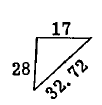

$$
\begin{align*}
\text{To find } DG_V \text{ take } \sum V = 0\\
\sum V = 100000 - 77451 + 66666 - DG_V = 0, \text{ or } DG_V = 89215\\
\text{Then, } DG_S = 89215 (17/28) = 54164 \text{ lb.}\\
DG = 89215 (32.73/28) = 104190 \text{ lb.}\\
\end{align*} 
$$

To find $E_D$ take moments about Saxis
through point D.

$$
\begin{align*}
\sum M_D(S) = - 25000 \times 35 + 28 E_D = 0,\\
E_D = 32143 \text{ lb.}
\end{align*} 
$$

The results will be checked for static
equilibrium of strut. Take moments about D
axis through point (O).

$$
\begin{align*}
\sum M_O(D) = 200000 + 54164 \times 36 - 47023 \times 36 - 7143 \times 64 = 200000 + 1949904 - 1692828 - 457150 = 0 \text{ (check)}\\
\sum M_O(S) = 32143 \ties 64 - 57142 \times 36 = 0 \text{ (check)}
\end{align*} 
$$

##### REACTIONS ON TOP MEMBER AB

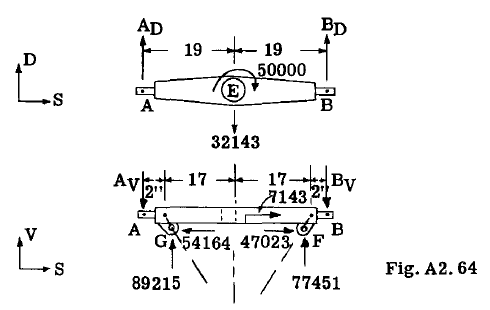

Fig. A2.64 shows a free body of member AB
with the known applied forces as found from
the previous reactions on the oleo strut.

The unknowns are $A_D, B_D, A_V$ and $B_V. To
find $B_V$ take moments about D axIs through A.

$$
\begin{align*}
\sum M_A(D) = - 89215 \times 2 - 77451 \times 36 - 38 B_V = 0\\
\text{ whence, } B_V = 78070 \text{ lb.}\\
\text{To find } A_V \text{ take } \sum V = 0\\
\sum V = 89215 + 77451 - 78070 - A_V = 0
\text{whence, } A_V = 88596 \text{ lb.}
\end{align*} 
$$

To find $B_D$ take moments V axis througb A.

$$
\begin{align*}
\sum M_V(D) = 50000 + 32143 \times 19 - 38 B_D = 0\\
\text{Whence, } B_D = 17386 \text{ lb.}\\
\text{To find } A_D \text{ take } \sum D  = 0\\
\sum D = 17386 - 32143 + A_D =0, \text{ or } A_D = 14757 \text{ lb.}
\end{align*} 
$$

These four reactions check the reactions
obtained originally when gear was treated as a
free body, thus giving a numerical check on the
calculations.

With the forces on each part of the gear
known, the parts could be designed for strength
and rigidity. The oleo strut would need a
torsion link as discussed in example problem 13
and Fig. A2.60.

