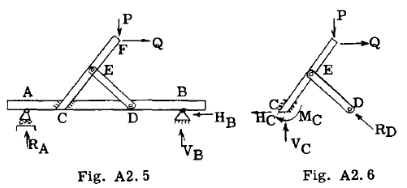
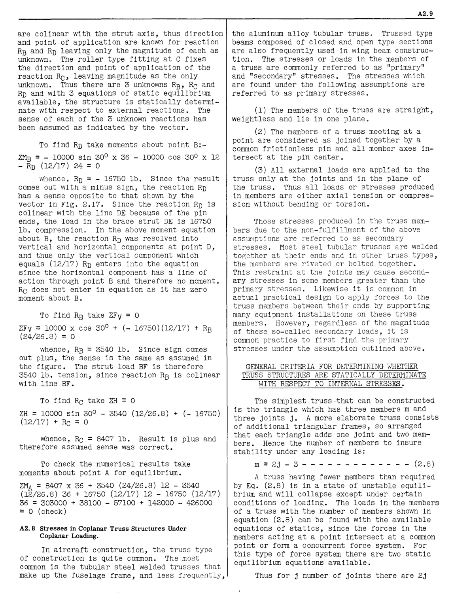
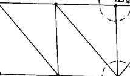
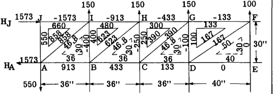
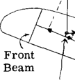
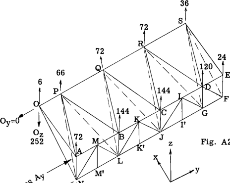
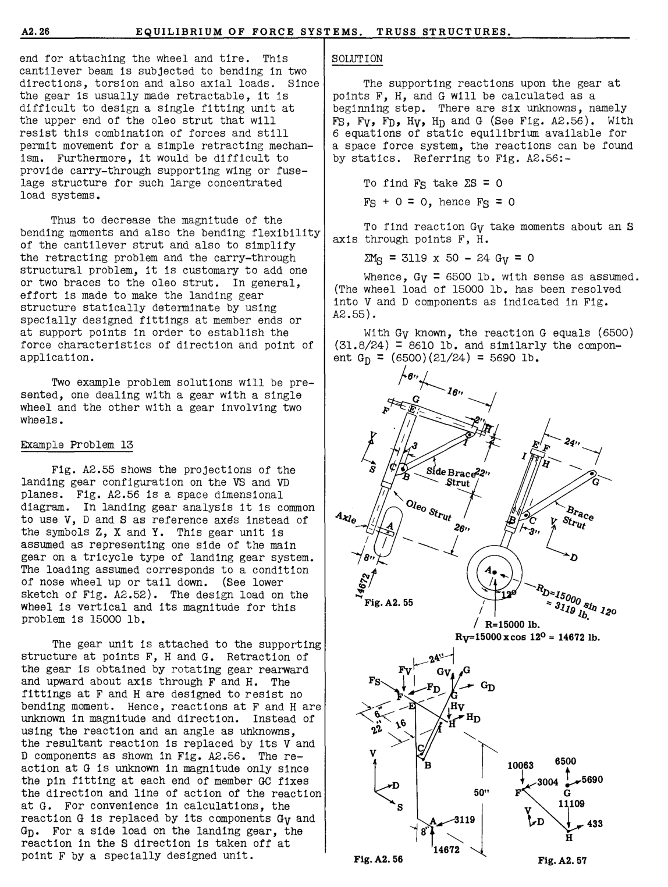

## A2.3 Structural Fitting Units for Establishing the Force Characteristics of Direction and Point of Application.

Another general fitting type that is used
to establish the direction of a force or reaction
is illustrated in the figure at the bottom of the
first column. Any reacting force at joint (A)
must be horizontal since the support at (A) is
so designed to provide no vertical resistance.

Cables - Tie Rods

Since a cable or tie rod has negligible
bending resistance, the reaction at joint B on
the crane structure from the cable must be
colinear with the cable axis, hence the cable
establishes the force characteristics of direction and point of application of the reaction
on the truss at point **B.**

## A2.4 Symbols for Reacting Fitting Units as Used in Problem Solution.

In solving a structure for reactions,
member stresses, etc., one must know what force
characteristics are unknown and it is common
practice to use simple symbols to indicate what
fitting support or attachment units are to be
used or are assumed to be used in the final
design. The following sketch symbols are commonly used for coplanar force systems.

The above graphical symbols represent a
reaction in which translation of the attachment point (b) is prevented but rotation of the
attached structure about (b) can take place.
Thus the reaction is unknown in direction and
magnitude but the point of application is known,
namely through point (b). Instead of using
direction as an unknown, it is more convenient
to replace the resultant reaction by two components at right angles to each other as indicated in the sketches.

**Pin**

**-** **,-I** _----"(0"'-) __ -'1-

~Pin
**Q,**

A small circle at the end of a member or on
a triangle represents a single pin connection
and fixes the point of application of forces
acting between this unit and a connecting member
or structure.

**R** **x** I
-& II
t
**+R**
y

**R** **x**

**by-Knife Edge**
&
t

~Ry

"A"

**4-**

~ I I

"A"

**Lubricated Slot** ~ _t_ ~ ! **Double** **Ron:**

I I

**Double** **Ron:** **4-**

**A2.4** **EQUILIBRIUM** **OF** **FORCE** **SYSTEMS.** **TRUSS** **STRUCTURES.**

~"'Edg.

**Rollers**
t

~

~n
~ **Rollers**

+

The above fitting units usinG rollers fix
the direction of the reaction as normal to the
roller bed since the fitting unit cannot resist
a horizontal force through point (b). Hence
the direction and point of application of the
reaction are established and only magnitude is
unknown.

**fixed**
'-'-1-1-1-\

**R/**

The graphical symbol above is used to
represent a rigid support which is attached
rigidly to a connectin~ structure. The reaction is completely unknown since all 3 force
characteristics are unlmown, na,11ely, magnitude,
direction and point of application. It is convenient to replace the reaction R by two force
components referred to some point (b) plUS the
unknovVll moment M which the resultant reaction R
caused about point (b) as indicated in the
above sketch. This discussion applies to a
coplanar structure with all forces in the same
plane. For a space structure the reaction
would have 3 further unknowns, namely, Rz ' Mx
and My.

## A2.5 Statically Determinate and Statically Indeterminate Structures.

A statically determinate structure is one
in which all external reactions and internal
stresses for a given load system can be found
by use of the equations of static equilibrium,
and a statically indeterminate structure is
one in which all reactions and internal stresses
cannot be found by using only the equations of
equilibrium.

A statically determinate structure is one
that has just enough external reactions, or
just enough internal members, to make the
structure stable under a load system, and if
one reaction or member is removed, the structure
is reduced to a linkage or a mechanism and is
therefore not further capable of resisting the
load system. If the structure has more external reactions or internal members than is
necessary for stability of the structure under
a given load system it is statically indeter

minate, and the degree of redundancy depends on
the number of unknolVlls beyond that number which
can be found by the equations of static equilibrium. A structure can be statically indeterminate with respect to external reactions alone
or to internal stresses alone or to both.

The additional equations that are needed
to solve a statically indeterminate structure
are obtained by considering the distortion of
the structure. This means that the size of all
members and the material from which members are
made must be known since distortions must be
calculated. In a statically determinate
structure this information on sizes and material
is not required but only the configuration of
the structure as a whole. Thus design analysis
for statically determinate structures is
straightforward, whereas a general trial and
error procedure is required for design analysis
of statically indeterminate structures.

## A2.6 Examples of Statically Determinate and Statically Indeterminate Structures.

The first step in analyzing a structure is
to determine whether the structure as presented
is statically determinate. If so, the reactions
and internal stresses can be found without knowing sizes of members or kind of material. If
not statically determinate, the elastic theory
must be applied to obtain additional equations.
The elastic theory is treated in considerable
detail in Chapters A7 to A12 inclusive.

To help the student become familiar with
the problem of determining whether a structure
is statically determinate, several example
problems will be presented.

Example Problem 1.

w **=** **10 lb.** _**lin.**_

C

**Pin**

.. **Fig.** **A2.1**

**RC/**

In the structure shown in Fig. 2.1, the
known forces or loads are the distributed loads
of 10 lb. per inch on member ABD. The reactions
at points A and C are unknown. The reaction at
C has only one unknown characteristic, nam61y,
magnitude, because the point of application of RC
is through the pin center at C and the direction
of RC must be parallel to line CB because there
is a pin at the B end of member CB. At
point A the reaction is unknown in direction
and magnitude but the point of application must
be through the pin center at A. Thus there are
2 unknowns at A and one unknown at C or a total

of 3. With 3 equations of equilibrium available for a coplanar force system the structure
is statically determinate. Instead of using an
angle as an unknown at A to find the direction
of the reaction, it is usually more convenient
to replace the reaction by components at right
angles to each other as HA and VA in the figure,
and thus the 3 unknowns for the structure are 3
magnitudes.

Example Problem 2.

P

Pin

~~c~~

Fig. A2.3
Fig. A2. 2

Fig. 2.2 shows a structural frame carrying
a known load system P. Due to the pins at
reaction points A and B the point of application
is known for each reaction; however, the magnitude and direction of each is unknown, making a
total of 4 unknowns with only 3 equations of
equilibrium available for a coplanar force
system. At first we might conclude that the
structure is statically indeterminate but we
must realize this structure has an internal pin
at e which means the bending moment at this
point is zero since the pin has no resistance
to rotation. If the entire structure is in
equilibrium, then each part must likewise be
in equilibrium and we can cut out any portion
as a free body and apply the equilibrium
equations. Fig. 2.3 shows a free body of the
frame to left of pin at e. Taking moments
about e and equating to zero gives us a fourth
equation to use in determining the 4 unknowns,
HA' VA' VB and HB' The moment equation about e
does not include the unknowns Ve and He since
they have no moment about e because of zero
arms. As in example problem 1, the reactions
at A and B have been replaced by H and V components instead of using an angle (direction)
as an unknown characteristic. The structure is
statically determinate.

Example Problem 3.

P P

(1) (2)

Fig. A2.4

Fig. 2.4 shows a straight member 1-2 carrying a
known load system P and supported by 5 struts

A2.5

attached to reaction points ABCD.

At reaction points A, Band D, the reaction
is known in direction and point of application
but the magnitude is unknown as indicated by the
vector at each support. At point C, the reaction is unknown in direction because 2 struts
enter joint e. Magnitude is also unknown but
point of application is known since the reaction
must pass through C. Thus we have 5 unknowns,
namely, RA, RB, RD, Ve and He. For a coplanar
force system we have 3 equilibriu~ equations
available and thus the first conclusion might
be that we have a statically indeterminate
structure to (5-3) = 2 degrees redundant. However, observation of the structure shows two
internal pins at points E and F which means
that the bending moment at these two points is
zero, thus giving us 2 more equations to use
with the 3 equations of equilibrium. Thus
drawing free bodies of the structure to left of
pin E and to right of pin F and equating moments
about each pin to zero, we obtain 2 equations
which do not include unknowns other than the 5
unknowns listed above. The structure is therefore statically determinate,

Example Problem 4.

Fig. 2.5 shows a beam AB which carries a
super-structure eED which in turn is SUbjected
to the known loads P and Q. The question is
whether the structure is statically determinate,
The external unknown reactions for the entire
structure are at points A and B. At A due to
the roller type of action, magnitude is the only
unknown characteristic of the reaction since
direction and point of application are known.
At B, magnitude and direction are unknown but
point of application is known, hence we have 3
unknowns, namely, RA' VB and HB, and with 3
equations of equilibrium available we can find
these reactions and therefore the structure is
statically determinate with respect to external
reactions. We now investigate to see if the
internal stresses can be found by statics after
having found the external reactions. Obviously,
the internal stresses will be affected by the
internal reactions at e and D, so we draw a free
body of the super-structure as illustrated in
Fig. 2.6 and consider the internal forces that
existed at C and D as external reactions, In
the actual structure the members are rigidly
attached together at point C such as a welded or

Fig. A2.5

)::
~cE "ED

V
e

Fig. A2.6

A2.6 EQUILIBRIUM OF FORCE SYSTEMS. TRUSS STRUCTURES.

multiple bolt connection. This means that all
three force or reaction characteristics, namely,
magnitude, direction, and point of application,
are unknown; or in other words, 3 unknowns
exist at C. For convenience we will represent
these unknowns by three components as shown in
Fig. 2.6, namely, HC' V c and Me. At joint D in
Fig. 2.6, the only unknown regarding the reaction is RD, a magnitude, since the pin at each
end of the member DE establishes the direction
and point of application of the reaction RD.
Hence we have 4 unknowns and only 3 equations
of equilibrium for the structure in Fig. 2.6,
thus the structure is statically indeterminate
With respect to all of the internal stresses.
The stUdent should observe that internal
stresses between points AC, BD and FE are
statically determinate, and thus the statically
indeterminate portion is the structural triangle CEDC.

Example Problem 5

Figs. 2.7, 2.8 and 2.9 show the same
structure carrying the same known load system
P but with different support conditions at
points A and B. The question is whether each
structure is statically indeterminate and if
so, to what degree, that is, what number of
unknowns beyond the equations of statics available. Since we have a coplanar force system,
only 3 equations of statics are available for
equilibrium of the structure as a whole.

In the structure in Fig. 2.7, the reaction
at A and also at B is unknown in magnitUde and
direction, although their points of application
are known. Hence, 4 unknowns (With only 3
equations of statics available) make the
structure statically indeterminate to the first
degree. In Fig. 2.8, the reaction at A is a
rigid one, thus all 3 characteristics of magnitUde, direction, and point of application of
the reaction, are unknown. At point B, due to
pin only 2 unknowns, namely, magnitude and direction, thus making a total of 5 unknowns
with only 3 equations of statics available or
the structure is statically indeterminate to
the second degree. In the structure of Fig.
2.9, both supports at A and B are rigid. Thus,
all 3 force characteristics are unknown at each
support or a total of 6 unknowns Which makes
the structure statically indeterminate to the
third degree.

Example Problem 6

tVA iVB Fig. A2.11 Fig. A2.12

Fig.A2.10

Fig. 2.10 shows a 2 bay truss supported at
points A and B and carrying a known load system
P, Q. All members of the truss are connected
at their ends by a common pin at each jOint.
The reactions at A and B are applied through
fittings as indicated. The question is whether
the structure is statically determinate or not.
Relative to external reactions at A and B the
structure is statically determinate because the
type of support produces only one unknown at A
and two unknowns at B, namely, VA, VB and HB as
shown in Fig. 2.10, and we have 3 equations of
static equilibrium available.

We now investigate to see if we can find
the internal member stresses after having found
the values of the reactions at A and B. Suppose
we cut out joint B as indicated by section 1-1
in Fig. 2.10 and draw a free body as shown in
Fig. 2.11. Since the members of the truss have
pins at each end, the loads in these members
must be axial, thus direction and line of action
are known and only magnitude is unknown. In
Fig. 2.11, HB and VB are known but AB, CB, and
DB are unknown in magnitude; hence we have 3 unknowns but only 2 equations of equilibrium for
a coplanar concurrent force system. If we cut
through the truss in Fig. 2.10 by the section
2-2 and draw a free body of the lower portion
as shown in Fig. 2.12, we have 4 unknowns,
namely, the axial loads in CA, DA, CB, DB but
only 3 e~uations of eqUilibrium available for
a coplanar force system.

Suppose we were able to find the stresses
in CA, DA, CB, DB in some manner, and we would
now proceed to joint D and treat it as a free
body or cut through the upper panel along
section 4-4 and use the lower portion as a free
body. The same reasoning as used above would
show us we have one more unknown than the number
of eqUilibrium equations available and thus
we have the truss statically indeterminate to
the second degree relative to internal member
stresses.

Physically, the structure has two more
members than is necessary for the stability of
the structure under load, as we could leave
out one diagonal member in each truss panel and

the structure would be still stable and all
member axial stresses could be found by the
equations of static equilibrium without regard
to their size of cross-section or the kind of
material. Adding the second diagonal member
in each panel would necessitate knowing the
size of all truss members and the kind of
material used before member stresSes could be
found, as the additional equations needed must
come from a consideration involving distortion
of the truss. Assume for example, that one
diagonal in the upper panel was left out. We
would then be able to find the stresses in the
members of the upper panel by statics but the
lower panel would still be statically indeterminate to 1 degree because of the double
diagonal system and thus one additional equation
is necessary and would involve a consideration
of truss distortion. (The solution of statically indeterminate trusses is covered in
Chapter AS.)

## A2. 7 Example Problem Solutions of Statically Determinate Coplanar Structures and Coplanar Loadings.

Although a student has taken a course in
statics before taking a beginning course in
aircraft structures, it is felt that a limited
review of problems involving the application
of the equations of static equilibrium is quite
justified, particularly if the problems are
possibly somewhat more difficult than most of
the problems in the usual beginning course in
statics. Since one must use the equations of
static equilibrium as part of the necessary
equations in solving statically indeterminate
structures and since statically indeterminate
structures are covered in rather complete detail
in other chapters of this book, only limited
space will be given to problems involving
statics in this chapter.

Example Problem S.

Fig. A2.14 shows a much simplified wing
structure, consisting of a wing spar supported
by lift and cabane struts which tie the wing
spar to the fuselage structure. The distributed
air load on the wing spar is unsymmetrical about
the center line of the airframe. The wing spar
is made in three units, readily disassembled by
using pin fittings at points 0 and 0·. All
supporting wing struts have single pin fitting
units at each end. The problem is to deter

A2.7

mine the axial loads in the members and the reactions on the spar.

Solution: The first thing to decide is whether
the structure is statically determinate. From
the figure it is observed that the wing spar is
supported by five struts. Due to the pins at
each end of all struts, we have five unknowns,
namely, the magnitude of the load in each strut.
Direction and location of each strut load is
known because of the pin at each end of the
struts. We have 3 equations of equilibrium for
the wing spar as a single unit supported by the
5 struts, thus two more equations are necessary
if the 5 unknown strut loads are to be found.
It is no~tced that the wing spar includes 2 internal single pin connections at points 0 and 0'.
This establishes the fact that the moment of all
forces located to one side of the pin must be
equal to zero since the single pin fitting cannot resist a moment. Thus we obtain two additional equations because of the two internal pin
fittings and thus we have 5 equations to find 5
unknowns.

Fig. 2.15 shows a free body of the wing
spar to the right of hinge fitting at O.

y 2460=82 x 30 1013=(30 + 15)45
Lx l;--41"~1"-+20~-2
Xo-6 _----e_ I
_l_ ~~lA
Yo E,. 117 Y. A Fig. A2. 15

In order to take moments, the distributed
load on the spar has been replaced by the resultant load on each spar portion, namely, the
total load on the portion acting through the
centroid of the distributed load system. The
strut reaction EA at A has been shown in phantom
as it is more convenient to deal with its components YA and XA. The reaction at 0 is unknown in magnitude and direction and for convenience we will deal With its components Xo
and YO. The sense assumed is indicated on the
figure.

The sense of a force is represented
graphically by an arrow head on the end of a
vector. The correct sense is obtained from the
solution of the equations of equilibrium since
a force or moment must be given a plus or minus
sign in writing the equations. Since the sense
of a force or moment is unknown, it is assumed,
and if the algebraic solution of the equilibrium
equations gives a plus value to the magnitUde
then the true sense is as assumed, and opposite
to that assumed if the solution gives a minus
sign. If the unknown forces are axial loads in
members it is COmmon practice to call tensile
stress plus and compressive stress minus, thus

If we assume the sense of an unknown axial load
as tension, the solution of the equilibrium

20,*/in. 40,*/in. I 30'*jin
J.r:rf] f f f f f 1ft Iff fit
f f.- 45"-+- 82" ---iP'1---60" ---J H~ge

A B 0"
Lift -+Struts 3 "

Fuselage

15#/in.
t t f T":r"=

A Pin

Fig. A2.14

A2.8 EQUILIBRIUM OF FORCE SYSTEMS. TRUSS STRUCTURES.

equations will give a plus value for the magnitude of the unknown if the true stress is
tension and a minus sign will indicate the
assumed tension stresses should be reversed or
compression, thus giving a consistency of signs.

To find the unknown YA we take moments
about point 0 and equate to zero for equilibrium

To find strut load B'C' take moments about
point C.

ZMc = 1325 x 65 + 2000 x 40 + (5880 - 4400)
30 - 1500 x 10 - 993 x 35 - 30 (B'C')
30/33.6 = 0

whence, B'C' = 6000 lb. with sense as shown.

ZMO = - 2460 x 41 1013 x 102 + 82YA = 0 To find load in member B'C use equation

Hence YA = 204000/82 = 2480 lb. The plus sign
means that the sense as assumed in the figure
is correct. By geometry XA = 2480 x 117/66 =
4400 lb. and the load in strut EA equals
v4400 [2] + 2480 [2] = 5050 lb. tension or as
assumed in the figure.

To find Xo we use the equilibrium equation
ZFX = 0 = Xo - 4400 = 0, whence Xo = 4400 lb.

To find YO we use,

ZF y = 0 = 2460 + 1013 - 2480 - YO = 0, whence
YO = 993 lb.

To check our results for equilibrium we
will take moments of all forces about A to see
if they equal zero.

ZMA = 2460 x 41 - 1013 x 20 - 993 x 82 = 0 check

On the spar portion O'A', the reactions
are obviously equal to 40/30 times those found
for portion OA since the external loading is 40
as compared to 30.

Hence A'E' = 6750, XO' = 5880, YO' = 1325

Fig. 2.16 shows a free body of the center
spar portion with the reactions at 0 and 0' as
found previously. The unknown loads in the
struts have been assumed tension as shown by
the arrows.

2000=50 x40 1500=50 x 30
l-- 20,,--15" 1--- 50" 5" r 20"-1
_588.Q._ <£==~~======-:i;;==:Jl--4400

f~325 B' °t
993

",
C'~--,, -- -~C,--,

ZF y = 0 = 1325 + 2000 + 1500 + 993 - 6000
(30/33.6)    - 2720 (30/33.6)    - B'C (30/54)
= 0

whence, B'C =- 3535 lb. The minus sign
means it acts opposite to that shown in figure
or is compression instead of tension.

The reactions on the spar can now be
determined and shears, bending moments and
axial loads on the spar could be found. The
numerical results should be checked for eqUilibrium of the spar as a whole by taking moments
of all forces about a different moment center
to see if the result is zero.

Example Problem 9.

RB\ f.--- 1~' + 12"----1 ;rRD

o~B ~ r -Y- T

~'\' Brae I ?; ~ 12 12"
\'\ Strut % 12 ~
~ ~\ Brace Strut
24LS,cP \'\ E          -          
12

12"
+
12"
Fig. A2.17 ~

Fig. 2.17 shows a simplified airplane
landing gear unit with all members and loads
confined to one plane. The brace struts are
pinned at each end and the support at C is of
the roller type, thus no vertical reaction can
be produced by the support fitting at point C.
The member at C can rotate on the roller but
horizontal movement is prevented. A known load
of 10,000 lb. is applied to axle unit at Ao The
problem is to find the load in the brace struts
and the reaction at C.

Solution:
Due to the single pin fitting at each end
of the brace struts, the reactions at Band D

I I

I I
1- __ -,

Fig.A2.16

To find the load in strut BC take moments
about B'

2MB' = 1325 x 20 - 2000 x 5 - 1500 x 55

   - 993 x 80 + 60 (BC) 30/33.6 = 0

Whence, BC
assumed.

2720 lb. with sense as

are colinear with the strut axis, thus direction
and point of application are known for reaction
RB and RD leaving only the magnitude of each as
unknown. The roller type fitting at C fixes
the direction and point of application of the
reaction RC' leaving magnitude as the only
unknown. Thus there are 3 unknowns RB' Rc and
RD and with 3 equations of static equilibrium
available, the structure is statically determinate with respect to external reactions. The
sense of each of the 3 unknown reactions has
been assumed as indicated by the vector.

To find RD take moments about point B:

2MB =- 10000 sin 30 [0] x 36 - 10000 cos 30 [0] x 12
- RD (12/17) 24 = 0

whence, RD = - 16750 lb. Since the result
comes out with a minus sign, the reaction RD
has a sense opposite to that shown by the
vector in Fig. 2.17. Since the reaction RD is
colinear with the line DE because of the pin
ends, the load in the brace strut DE is 16750
lb. compression. In the above moment equation
about B, the reaction RD was resolved into
vertical and horizontal components at point D,
and thus only the vertical component which
equals (12/17) RD enters into the equation
since the horizontal component has a line of
action through point B and therefore no moment.
RC does not enter in equation as it has zero
moment about B.

To find RB take ZFy = 0

ZFy = 10000 x cos 30 [0] + (- 16750)(12/17) + RB
(24/26.8) = 0

whence, RB = 3540 lb. Since sign comes
out plus, the sense is the same as assumed in
the figure. The strut load BF is therefore
3540 lb. tension, since reaction RB is colinear
wi th line BF.

To find RC take ZH = 0

ZH = 10000 sin 30 [0] - 3540 (12/26.8) + (- 16750)
(12/17) + RC = 0

whence, RC = 8407 lb. Result is plus and
therefore assumed sense was correct.

To check the numerical results take
moments about point A for equilibrium.

ZMA = 8407 x 36 + 3540 (24/26.8) 12 - 3540
(12/26.8) 36 + 16750 (12/17) 12 - 16750 (12/17)
36 = 303000 + 38100 - 57100 + 142000 - 426000

=
0 (check)

## A2.8 Stresses in Coplanar Truss Structures Under Coplanar Loading.

In aircraft construction, the truss type
of construction is quite common. The most
common is the tubular steel welded trusses that
make up the fuselage frame, and less frequently,

A2.9

the aluminum alloy tubular truss. Trussed type
beams composed of closed and open type sections
are also frequently used in wing beam construction. The stresses or loads in the members of
a truss are commonly referred to as "primary"
and "secondary" stresses. The stresses which
are found under the following assumptions are
referred to as primary stresses.

(1) The members of the truss are straight,
weightless and lie in one plane.

(2) The members of a truss meeting at a
point are considered as joined together by a
common frictionless pin and all member axes intersect at the pin center.

(3) All external loads are applied to the
truss only at the joints and in the plane of
the truss. Thus all loads or stresses produced
in members are either axial tension or compression without bending or torsion.

Those stresses produced in the truss members due to the non-fulfillment of the above
assumptions are referred to as secondary
stresses. Most steel tubular trusses are welded
tovether at their ends and in other truss types,
the members are riveted or bolted to~ether.
This restraint at the joints may cause secondary stresses in some members greater than the
primary stresses. Likewise it is common in
actual practical design to apply forces to the
truss members between their ends by supporting
many equipment installations on these truss
members. However, regardless of the magnitude
of these so-called secondary loads, it is
common practice to first find the primary
stresses under the assumption outlined above.

GENERAL CRITERIA FOR DETERMINING WHETHER

TRUSS STRUCTURES ARE STATICALLY DETERMINATE

WITH RESPECT TO INTERNAL STRESSES.

The simplest truss that can be constructed
is the triangle which has three members m and
three joints j. A more elaborate truss consists
of additional triangular frames, so arranged
that each triangle adds one joint and two members. Hence the number of members to insure
stability under any loading is:

m = 2j  - 3 - - - - - - - - - - - - - (2.8)

A truss having fewer members than required
by Eq. (2.8) is in a state of unstable eqUilibrium and will collapse except under certain
conditions of loading. The loads in the members
of a truss With the number of members shown in
equation (2.8) can be found with the available
equations of statics, since the forces in the
members acting at a point intersect at a common
point or form a concurrent force system. For
this type of force system there are two static
equilibrium equations available.

Thus for j number of joints there are 2j

A2.10 EQUILIBRIUM OF FORCE SYSTEMS. TRUSS STRUCTURES.

equations available. However three independent
equations are necessary to determine the external reactions, thus the number of equations
necessary to solve for all the loads in the
members is 2j - 3. Hence if the number of truss
members is that given by equation (2.8) the
truss is statically determinate relative to the
primary loads in the truss members and the
truss is also stable.

If the truss has more members than indicated by equation (2.8) the truss is considered
redundant and statically indeterminate since
the member loads cannot be found in all the
members by the laws of statics. Such redundant
structures if the members are properly placed
are stable and will support loads of any
arrangement.

ANALYTICAL METHODS FOR DETERl'1INING
PRIMARY STRESSES IN TRUSS STRUCTURES

In general there are three rather distinct
methods or procedures in applying the equations
of static equilibrium to finding the primary
stresses in truss type structures. They are
often referred to as the method of joints,
moments, and shears.

## A2.9 Method of Joints.

If the truss as a whole is in equilibrium
then each member or joint in the truss must
likewise be in equilibrium. The forces in the
members at a truss joint intersect in a cammon

point, thus the forces on each joint form a
concurrent-coplanar force system. The method
of joints consists in cutting out or isolating
a joint as a free body and applying the laws of
equilibrium for a concurrent force system.
Since only two independent equations are available for this type of system only two unknowns
can exist at any joint. Thus the procedure is
to start at the joint where only two unknowns
exist and continue progressively throughout the
truss joint ~y joint. To illustrate the method
consider the cantilever truss of Fig. A2.18.
From observation there are only two members
with internal stresses unknown at joint L 8 •
Fig. A2.19 shows a free body of joint L 8 • The
stresses in the members L 3 L2 and L 3 U2 have
been assumed as tension, as indicated by the
arrows pUlling away from the joint L 3 •

The static equations of equilibrium for
the forces acting on joint L 3 are ~H and ~V = O.

~V = - 1000 - L 3 U2 (40/50) = 0 - - - - - - -(a)

whence, L 3 U2 =- 1250 lb. Since the sign
came out minus the stress is opposite to that
assumed in Fig. A2.19 or compression.

~ =- 500 - (- 1250)(30/50) - L2L 3 = 0 - -(b)

whence, L2L 3 = 250 lb. Since the sign comes
out plus, sense is same as assumed in figure

1000

d

500
\ L- 3

o

L o

500

2 I 2
L1. I u. 2 /

40"
~

30

U o U1. 3 U 2 3 Fig. A2. 18
~ 30"T 30" --t- 30"-1

1 [1000]
(1 

L 1 .. - _fi-_ _[500]_

+~

+

Fig. A2.19

..   
2 \~ 3

U 2 1

or tension. In equation (b) the load of 1250
in L 3 L2 was substituted as a minus value since
it was found to act opposite to that shown in
Fig. A2.19. Possibly a better procedure would
be to change the sense of the arrow in the free
body diagram for any solved members before writing further equilibrium equations. We must
proceed to joint L2 instead of joint U2, as
three unknown members still exist at joint U2
whereas only two at joint L2• Fig. A2.20 shows
free body of joint L2 cut out by section 2-2
(see Fig. A2.18). The sense of the unknown
member stress L 2 U 2 has been assumed as compression (pushing toward joint) as it is obviously acting this way to balance the 500 lb.
load.

500
l ~H
L1. ... ~~•~~ --250
~~t~~ L2

U2 Fig.A2.20

For equilibrium of joint L2, ~H and ~V = 0

~V =- 500 + L2U2 = 0, whence, L2U2 = 500 lb.
Since the sign came out plus, the assumed sense
in Fig. A2.20 was correct or compression.

~H = 250 - L2 L1.= 0, whence L2 L1. = 250 lb.

Next consider joint U2 as a free body cut
out by section 3-3 in Fig. A2.18 and drawn as
Fig. A2.21. The known member stresses are shown
with their true sense as previously found. The
two unknown member stresses U2L1. and U2 U1. have
been assumed as tension.

Fig. A2. 21

~v = -500 - 1250 (40/50) + U2L1. (40/50) = 0

whence, U2 L1. = 1875 lb. (tension as
assumed. )

ZH = (-1250) (30/50) - 1875 (30/50) - U"U" = 0

whence, U"U" = - 1875 lb. or opposite in
sense to that assumed and therefore compression.

Note: The student should continue with succeeding joints. In this example involving a cantilever truss it was not necessary to find the
reactions, as it was possible to select ~oint
La as a j oint involving only two unknowns. In
trusses such as illustrated in Fig. A2.22 it is
necessary to first find reactions R" or R" which
then provides a joint at the reaction point involving only two unknown forces.

## A2.10 Method of Moments.

For a coplanar-non-concurrent force system
there are three equations of statics available.
These three equations may be taken as moment
equations about three different points. Fig.
A2.22 shows a typical truss. Let it be reqUired to find the loads in the members F", F",
Fa, F 4' F 6 and F 6'

The first step in the solution is to find the
reactions at points A and B. Due to the roller
type of support at B the only unknown element of
the reaction force at B is magnitude. At point
A, magnitude and direction of the reaction are
unknown giving a total of three unknowns with
three equations of statics available. For convenience the unknown reaction at A has been replaced by its unknown H and V components.

Taking moments about point A,

ZMA = 500 x 30 + 1000 x 60 + 1000 x 90 + 500 x
30 + 500 x 120 - 150 VB = 0

Hence VB = 1600 lb.

Take ZV = 0

ZV = VA - 1000-1000-500-500 + 1600 = 0 therefore VA = 1400 lb.

Take ZH = 0

ZH = 500 - HA = 0, therefore HA = 500 lb.

A2.11

The algebraic sign of all unknowns came out
positive, thus the assumed direction as shown
on Fig. A2.22 was correct.

Check results by taking 2MB = 0

2MB = 1400 x 150 + 500 x 30 - 500 x 120 - 500 x
30 - 1000 x 90 - 1000 x 60 = 0 (Check)

To determine the stress in member F", F" and Fa
we cut the section 1-1 thru the truss (Fig.
A2.22. Fig. A2.23 shows a free body diagram of
the portion of the truss to the left of this
section.

1

:"F~_

The truss as a whole is in equilibrium.
Therefore any portion must be in eqUilibrium.
In Fig. A2.23 the internal stresses in the members F", F" and Fa which existed in the truss as
a whole now are considered external forces in
holding the portion of the truss to the left of
section 1-1 in equilibrium in combination with
the other loads and reactions. Since the members a and b in Fig. A2.23 have not been cut the
loads in these members remain as internal
stresses and have no influence on the eqUilibrium of the portion of the truss shown. Thus
the portion of the truss to left of section 1-1
could be considered as a so11d block as shown
in Fig. A2.24 without affecting the values of
F", F" and Fa. The method of moments, as the
name implies, involves the operation of taking
moments about a point to find the load in a
particular member. Since there are three unknowns a moment center must be selected such
that the moment of each of the two unknown
stresses will have zero moment about the selected
moment center, thus leaVing only one unknown
force or stress to enter into the equation for
moments. For example, to determine load Fa in
Fig. A2.24 we take moments about the intersection of forces F" and F" or point O.

Thus ZMO = 1400 x 30 - 18.97 Fa = 0

42000
Hence Fa = 18.97 = 2215 lb. compression (or
acting as assumed)

To find the arm of the force Fa from the
moment center 0 involves a small amount of calculation, thus in general it is simpler to resolve the unknown force into H and V components
at a point on its line of action such that one
of these components passes thru the moment
center and the arm of the other component can
usually be determined by inspection. Thus in

1400

Fig. A2. 23

500 ~. ~;,

1400 1

Fig.A2.24

A2.12 EQUILIBRIUM OF FORCE SYSTEMS. TRUSS STRUCTURES.

Fig. A2.25 the force Fa is resolved into its
component FaV and FaH at point 0'. Then taking

Fig. A2. 25

moments about point 0 as before:

ZM o = 1400 x 30 - 20FaH = 0

whence, FaH = 2100 lb. and therefore

Fa = 2100 (31.6/30) = 2215 lb. as previously obtained.

The load F:a. can be found by taking moments
about point m, the intersection of forces Fe
and Fa (See Fig. A2.23).

ZMm = 1400 x 60 + 500 x 30 - 500 x 30

         - 30F:a. = 0

whence, F:a. = 2800 lb. (Tension as assumed)

To find force Fe by using a moment equation,
we take moments about point (r) the intersection of forces F:a. and F .. (See Fig. A2.26).
To eliminate solving for the perpendicular
distance from point (r) to line of action of
Fe, we resolve Fe into its H and V components
at point 0 on its line of action as shown in
Fig. A2.26.

ZM r =- 1400 x 30 + 500 x 60 + 60 FeV = 0

whence, FeV = 12000/60 = 200 lb.

Therefore Fe = 200 x V2 = 282 lb. compression

## A2.11 Method of Shears

In Fig. A2.22 to find the stress in member
F .. we cut the section 2-2 giving the free body
for the left portion as shown in Fig. A2.27.

The method of moments is not sufficient to
solve for member F .. because the intersection of

Referring to Fig. A2.27

_ZV_ = 1400 - 500 - 1000 - F .. (l/y'2:).= 0

whence F .. =- 141 lb. (tension or opposite
to that assumed in the figure.

To find the stress in member F 7 • we cut
section 3-3 in Fig. A2.22 and draw a free body
diagram of the left portion in Fig. A2.26.
Since F:a. and Fe are horizontal, the member F 7
must carry the shear on the truss on this section
3-3, hence the name method of shears.

_ZV_ = 1400 - 500 - 1000 + F 7 = 0

Whence F 7 = 100 lb. (compression as assumed)

Note: The stUdent should solve this example illustrating the methods of moments and shears
using as a free body the portion of the truss to
the right of the cut sections instead of the
left portion as used in these illustrative examples. In order to solve for the stresses in
the members of a truss most advantageously, one
usually makes use of more than one of the above
three methods, as each has its advantages for
certain cases or members. It is important to
realize that each is a method of sections and in
a great many cases, such as trusses with parallel chords, the stresses can practically be
found mentally without writing down equations of
equilibrium. The following statements in general are true for parallel chord trusses:

(1) The vertical component of the stress in
the panel diagonal members equals the vertical
shear (algebraic sum of external forces to one
side of the panel) on the panel, since the chord

the other two unknowns Fe and Fe lies at infinity. Thus for conditions where two of the 3 cut
members are parallel we have a method of solving
for the web member of the truss commonly referred to as the method of shears, or the summation of all the forces normal to the two
parallel unknown chord members must equal zero.
Since the parallel chord members have no component in a direction normal to their line of
action, they do not enter the above equation of
equilibrium.

1000#

2

500#
Fe
:..:..:;j""-----r-----"O...-.;..500#

1400#

Fig. A2. 27

500

1000

Fig.A2.28

members are horizontal and thus have zero vertical component.

(2) The truss verticals in general resist
the vertica~ component of the diagonals plus
any external loads applied to the end joints of
the vertical.

(3) The load in the chord members is due
to the horizontal components of the diagonal
members and in general equals the summation of
these horizontal components.

To illustrate the simplicity of determining
stresses in the members of a parallel chord
truss, consider the cantilever truss of Fig.
A2.29 with supporting reactions at points A and
J.

**Fig.** **A2.29**

First, compute the length triangles in
each panel of the truss as shown by the dashed
triangles in each panel. The other triangles
in each panel are referred to as load or index
triangles and their sides are directly proportional to the length triangles.

The shear load in each panel is first written on the vertical side of each index triangle.
Thus, in panel EFGD, considering forces to the
right of a vertical section cut thru the panel,
the shear is 100 lb., which is recorded on the
vertical side of the index triangle.

For the second panel from the free end, the
shear is 100 + 150 = 250 and for the third panel
100 + 150 + 150 = 400 lb., and in like manner
550 for fourth panel.

The loads in the diagonals as well as their
horizontal components are directly proportional
to the lengths of the diagonal and horizontal
side of the length triangles. 'Thus the load in
diagonal member DF = 100 (50/30) = 167 and for
member CG = 250 (46.8/30) = 390. The horizontal component of the load in DF = 100 (40/30)
= 133 and for CG = 250 (36/30) = 300. These
values are shown on the index triangles for
each truss panel as shown in Fig. A2.29. We
start our analysis for the loads in the members
of the truss by considering joint E first.

Using ~v = 0 gives EF = 0 by observation,

**A2.13**

since no external vertical load exists at joint
E. Similarly, by the same reasoning for ~H = 0,
load in DE = O. The load in the diagonal FD
equals the value on the diagonal of the panel
index triangle or 167 lb. It is tension by
observation since the shear in the panel to the
right is up and the vertical component of the
diagonal FD must pull down for equilibrium.

Considering Joint **F.** ~H =- FG   - F~ = 0,
which means that the horizontal component of the
load in the diagonal DF equals the load in FG,
or is equal to the value of the horizontal side
in the index triangle or - 133 lb. It is negative because the horizontal component of DF
pulls on Joint F and therefore FG must push
against the joint for equilibrium.

Considering Joint **D:-**

~v = DFV + DG = O. But DFV = 100 (vertical side
of index triangle)

**•••** DG =- 100

~H = DE + DFH - DC = 0, but DE = 0 and DFH =
133 (from index triangle)
DC = 133

Considering Joint **G:-**

~H=- GH + GF - GCH = O. But GF =- 133, and GCH
= 300 from index triangle in the second panel.
Hence GH =- 433 lb. Proceeding in this manner,
we obtain the stress in all the members as shown
in Fig. A2.29. All the equilibrium equations
can be solved mentally and with the calculations
being done on the slide rule, all member loads
can be written directly on the truss diagram.

Observation of the results of Fig. A2.29
show that the loads in the truss verticals equal
the values of the vertical sides of the index
load triangle, and the loads in the truss diagonals equal the values of the index triangle
diagonal side and in general the loads in the
top and bottom horizontal truss members equal
the summation of the values of the horizontal
sides of the index triangles.

The reactions at A and J are found when
the above general procedure reaches joints A
and J. As a check on the work the reactions
should be determined treating the truss as a
whole.

Fig. A2.30 shows the solution for the
stresses in the members of a simply supported
Pratt Truss, symmetrically loaded. Since all
panels have the same width and height, only one
length triangle is drawn as shown. Due to
symmetry, the index triangles are drawn for
panels to only one side of the truss center
line. First, the vertical shear in each panel
is written on the vertical side of each index
triangle. Due to the symmetry of the truss and

A2.14 EQUILIBRIUM OF FORCE SYSTEMS. TRUSS STRUCTURES.

loading, we know that one half of the external
loads at joints U 3 and L 3 is supported at reaction R~ and 1/2 at reaction R2, or shear in

Length

25" Triangle
30"

39" 50 50

~

Fig. A2. 30

50 50

external horizontal components of diagonal members =
at re- 312 + 187.5 = 499.5. Therefore, load in U~U2 =
in   - 499.5. Similarly at joint L2, L2L 3 = 312 +

187.5 = 499.5. At joint U2, the horizontal
components of U~U2 and U2U 3 = 499.5 + 62.5 = 562
which must be balanced by       - 562 in member U2U 3 •

50

center panel = (100 + 50) 1/2 = 75. The vertical shear in panel U~U2L~L2 equals 75 plus the
external loads at U2 and L2 or a total of 225
and similarly for the end panel shear = 225 +
50 + 100 = 375. With these values known, the
other two sides of the index triangles are directly proportional to the sides of the length
triangles for each panel, and the results are as
shown in Fig. A2.30.

The general procedure from this point is to
find the loads in the diagonals, then in the
verticals, and finally in the horizontal chord
members.

The loads in the diagonals are equal to the
values on the hypotenuse of the index triangles.
The sense, whether tension or compression, is
determined by inspection by cutting mental
sections thru the truss and noting the direction
of the external shear load which must be balanced by the vertical component of the diagonals.

The loads in the verticals are determined
by the method of joints and the sequence of
joints is so selected that the stress in the
vertical member is the only unknown in the
equation ~V = a for the joint in question.

Thus for joint U 3, ~V =- 50   - U 3 L 3 = a
or U 3 L 3 =- 50.

For joint U2, ~V =- 50 - U2L 3 V - U2L2 = 0,
but U2L 3 V ::: 75, the vertical component of U2L 3
from index triangle. .'. U2L2 =- 50 - 75 =
 - 125. For joint L~, ~V = - 100 + L~U~ = 0,
hence L~U~ = 100.

Since the horizontal chord members receive
their loads at the joints due to horizontal
components of the diagonal members of the truss,
we can start at Lo and add up these horizontal
components to obtain the chord stresses. ThUS,

LoL~ = 312 (from index triangle). L~L2 = 312
from ~H = a for joint L~. At joint U~, the

The reaction R 2 equals the value on the
vertical side of our index triangle in the end
panel, or 375. This should be checked using
the truss as a whole and taking moments about
R 2 •

If a truss is loaded unsymmetrically, the
reactions should be determined first, after
which the index triangles can be drawn, starting with the end panels, since the panel shear
is then readily calculated.

## A2.12 Aircraft Wing Structure. Truss Type with Fabric or Plastic Cover

The metal covered cantilever wing with its
better overall aerodynamic efficiency and sufficient torsional rigidity has practically replaced the externally braced wing except for low
speed commercial or private pilot aircraft as
illustrated by the aircraft in Figs. A2.31 and
32. The wing covering is usually fabric and
therefore a drag truss inside the wing is
necessary to resist loads in the drag truss
direction. Figs. A2.33 and 34 shows the general structural layout of such wings. The two
spars or beams are metal or wood. Instead of
using double wires in each drag truss bay, a
single diagonal strut capable of taking either
tension or compressive loads could be used.
The external brace struts are stream line tubes.

Fig. A2. 31 Piper Tri-Pacer

Fig. A2. 32 Champion Traveler

A2.15

in all members of the lift and drag trusses will
be determined. A simplified air loading will be

assu~ed, as the purpose of this problem is to
hive the student practice in solving statically
determinate space truss structures .

ASSUMED AIR LOADING:

(1) A constant spanwise lift load of 45
Ib/in from hinr;e to strut point and t11en tapering to 22.5 Ib/in at the wing tip.

(2) A forward uniform distributed drag
load of 6 Ib/in.

The above airloads represent a high angle
of attack condition. In this condition a forward load can be placed on the drag truss as
illustrated in Fig. A2.36. Projecting the air

, Lift

Fig. A2. 33

Plywood Leading
Edge Fairing

Dragwire
Fitting

Leading
Edge

Wing Hinge
Fitting

Wing Tip (End) Bow

"f4F~~~~-- Plywood Tip Fairing

...---Aileron

Aileron Spar

Compression Rib

Drag Wire

Anti-Drag Wire

Aileron Rib

Aileron Hinge
Drag Strut or
Compression Tube

Forming or Plain Rib

Trailing Edge

Butt Rib

v-    - Beam or Spar

Airstream

     **METAL** **FAIRING**

Drag

Center of

Pressure

Rear

Beam

Fig. A2. 36

______ Drag Truss

**AIL.E""'"**

Fig. A2. 34

Example Problem 10. Externally Braced Monoplane Wing Structure

Fig. A2.35 shows the structural dimensional
diagram of an externally braced monoplane wing.
The wing is fabric covered between wing beams,
and thus a drag truss composed of struts and
tie rods is necessary to provide strength and
rigidity in the drag direction. The axial loads

lift and drag forces on the drag truss direction,
the forward projection due to the lift is greater than the rearward projection due to the air
drar" which difference in our example problem
has been assumed as 6 Ib/in. In a low angle of
attack the load in the drag truss direction
would act rearward.

SOLUTION:

The running loads on the front and rear
beams will be calculated as the first step in
the solution., For our flight condition, the
center of pressure of the airforces will be
assumed as shown in Fig. A2.37.

22.52" Fig. A2. 37

The running load on the front beam will be 45 x
24.2/36 = 30.26 Ib/in., and the remainder or
45 - 30.26 = 14.74 Ib/in gives the load on the
rear beam.

DRAG TRUSS
Drag (4) (3)
Reaction ~-----JH------...----~---~~<l---'?t'.----_l4----0>1 - T [Rear]
: Beam
Taken off 1 I D
At (2) I 4 1 '0. L
~ ~ S
Y (2)1 --L-Front

2 -"':1---37. 5 + 37.5+37.5 58.5 ----.j121--- Beam

I Q) ~ ....;
~,S ~ Po< Wing Chord= 72"
__ U 1t :I: 1 ~ __ [J(3)

:,--Tl-~,2) T __
3 [0] Dihedral I

: ~' ~ : + ~ SF SR

lirp a1 e : + S I
17 - -(5' 6 - -- - -- ----ill _I - - (6)
I... ~ _I_ -..j uk--- 36 ---I
Fuselage Fig. A2.35

A2 16 EQUILIBRIUM OF FORCE SYSTEMS TRUSS STRUCTURES

To solve for loads in a truss system by a
method of joints, all loads must be transferred
to the truss joints. The wing beams are supported at one end by the fuselage and outboard
by the two lift struts. Thus we calculate the
reactions on each beam at the strut and hinge
points due to the running lift load on each
beam.

4 R.B. 3

2 ~~.~~ ~~1~~
;::.B

Drag Truss

_·B._

F Front Lift R Rear

Beam 5 Truss Lift

6 Truss

w= 30.26#~in.
-.-. 15.                      - 13#/in.

~t ~f;;:,::Ir-=-t=-n=J member lengths L and the component ratios
114. 5" 70. 5" ---I follow by simple calculation.
#### ~

3

_·B._

R

Lift
###### A 6

Front Beam

F Front Lift

5 Truss

w= 30.26#~in.
-.-. 15.         - 13#/in.

-.-. 15.                        
(2) ~t ~f;;:,::Ir-=-t=-n=J
114. 5" 70. 5" ---I
#### ~
R 2 R~

member lengths L and the component ratios then
follow by simple calculation.

Table A2.1

Taking moments about point (2)

114.5R~   - 114.5 x 30.26 x 114.5/2   - 15.13 x
70.5 x 149.75   - 15.13 x 35.25 x 138 = O.

hence

R~ = 3770 lb.

Take ZV = 0 where V direction is taken normal to
beam

ZV =- R2 - 3770 + 30.26 x 114.5 +
(30.26 + 15.13)
2 70.5 = 0

hence R2 = 1295 lb.

(The student should always check results by
taking moments about point (1) to see if ZM~
= 0)

Rear Beam

{w = 14. 74#/in. ;J:!..

1
(4) 1_.- -'_1 11/5,,1 f f '.1§t ;0.f5"~ 2

R 4 R"

The rear beam has the same span dimensions but
the loading is 14.74 Ib/in. Hence beam reactions R 4 and R" will be 14.74/30.26 = .4875
times those for front beam.

S/L

.9986

.9986

**Member** Sym. V

**Front** **Beam** FB 5.99

**Rear** **Beam** RB 5.99

Front strut SF 57.99

Rear Strut SR 57.49

v **=** **vertical** **direction,**

D **=** **drag** **direction,**

S **=** **side** **direction,**

L: VV2+ D [2 ] + S2

D

S L V/L D/L

o 114.34 114.50 .0523

o 114.34 114.50 .0523

o

o

11 114.34 128.79 .4501 .0854 .8878

o 114.34 128.00 .4486 0 .8930

We start the solution of joints by starting
with joint (1). Free body sketches of joint (1)
are slzetched below. All members are considered
two-force members or having pins at each end,
thus magnitude is the only umznown characteristic of each member load. The drag truss members coming in to joint (1) are replaced by a
sinGle reaction called D~. After D~ is found,
its influence in causing loads in drag truss
members can then be found when the drag truss as
a whole is treated. In the joint solution, the
drag truss has been assumed parallel to drag
direction which is not quite true from Fig.
A2.35, but the error on member loads is negligible.

JOINT 1 (Equations of Equilibriuti)

hence R" = .4875 x 3770 = 1838 lb.
R 4 = .4875 x 1295 = 631 lb. FB

S -;J

3770

770

770

FB 1)

(1) I

S -;J .+V FB
F ~+S [~]

FB 1)

(1) I D~
FB r:
SF +D

The next step in the solution is the F ~+S FB
solving for the axial loads in all the members. SF +D
We will use the method of joints and consider
the structure made up of three truss systems ZV = 3770 x .9986 - .0523 FB - .4501 SF
as illustrated at the top of the next column, ZS = - 3770 x .0523 - .9986 FB - .8878 SF
namely, a front lift truss, a rear lift truss ZD =- .0854 SF + D ~ =
and a drag truss. The beams are common to both
lift and drag trusses. Solving equations 1, 2 and 3, we obtain

ZV = 3770 x .9986 - .0523 FB - .4501 SF = 0 - (1)
ZS = - 3770 x .0523 - .9986 FB - .8878 SF = 0 - (2)
ZD =- .0854 SF + D ~ = 0 - - - - - - - - - - (3)

Table A2.1 gives the V, D and S projections
of the lift truss members as determined from =
information given in Fig. A2.35. The true =

8513 lb. (compression)
9333 lb. (tension)
798 lb. (aft)

Joint (3) (Equations of equilibrium)

1838
B 1

R 7 B

(3)

R V-S plane

(drag truss

838 reaction on
(3) " pin (3~)
RB

~ SR V-D plane

~V = 1838 X .9986 - .0523 RB - .4486 SR = 0 -(4)

~S = -1838 x .0523 - .9986 RB -.8930 SR = 0 -(5)

~D = D" + 0 = 0 - - - - - - - - - - - - - - -(6)

Solving equations 4, 5 and 6, we obtain
RB =- 4189 lb. (compression)
SR = 4579 lb. (tension)
**D** **a** **=** **0**

Fig. A2.38 shows the reactions of the lift
struts on the drag truss at joints (1) and (3)
as found above.

( 4)~

(2) 8513+

Fig. A2.38 798

Drag Truss Panel Point Loads Due to Air Drag
Load.

It was assumed that the air load components
in the drag direction were 6 Ib./in. of wing
acting forward.

The distributed load of 6 Ib./in. is replaced by concentrated loads at the panel points
as shown in Fig. A2.39. Each panel point takes
one half the distributed load to the adjacent
panel point, except for the two outboard panel
points which are affected by the overhang tip
portion.

Thus the outboard panel point concentration
of 254 lb. is determined by taking moments about
(3) of the drag load outboard of (3) as follows:

P = 70.5 x 6 x 35.25/58.5 = 254 lb.

To simplify the drag truss solution, the draG

strut and drag wires in the inboard drag truss
panel have been modified to intersect at hinge

6#/in.

281.5 J254

--,

|Member|Load|V|D|
|---|---|---|---|
|FB Drag **Reaction** R2 (Reaction)|-13893 - 1908 - 1295|- 726 0 1294|0 -1908 0|
|RB R4 (Reaction)|1191 - 631|62 630|0 0|
|FS|9333|4205|798|
|RS|4579|2055|0|

I
I
I IT' Ip
I

58.5 ~1

Fig. A2.39

A2.17

points (2) and (4). In the design of the beam
and fittings at this point, the effect of the
actual conditions of eccentricity should of
course be considered.

Combined Loads on Drag Truss

Adding the two load systems of Figs. A2.38
and A2.39, the total drag truss loading is obtained as shown in Fig. A2.40. The resulting
member axial stresses are then solved for by the
method of index stresses (Art. A2.9). The
values are indicated on the truss diagram. It
is customary to make one of the fittings attaching wing to fuselage incapable of transferring
drag reaction to fuselage, so that the entire
drag reaction from wing panel on fuselage is
definitely confined to one point. In this example point (2) has been assumed as point where
drag is resisted. Those drag wires which would
be in compression are assumed out of action.

Ga~~36~--------I+---36~ ---1

39.5 37.5 58.5

Fuselage Reactions

As a check on the work as well as to obtain
reference loads on fuselage from wing structure,
the fuselage reactions will be checked against
the externally applied air loads. Table _A2.2_
gives the calculations in table form.

Table A2.2

Totals 7520 -1110  - 400

Applied Air Loads:

V component = (3770 + 1295 + 1838 + 631)

.9986 = 7523 lb. (error 3 lb.)
D component = -185 x 6 = lllO lb. (error = 0)
S component = -(3770 + 1295 + 1838 + 631)
.0523 = 394 lb. (error 6 lb.)

A2.18 EQUILIBRIUM OF FORCE SYSTEMS. TRUSS STRUCTURES.

|The wing beams due to the distributed lift air loads acting upon them, are also sUbjected to bending loads in addition to the axial loads. The wing thus act as beam-columns. The be~~s subject of beam-column action is treated in another chapter of this book. If the wing is covered with metal skin instead of fabric, the drag truss can be omitted since the top and bottom skin act as webs of a beam which has the front and rear beams as its flange members. The wing is then considered as a box beam subjected to combined bending and axial loading. Example Problem 11. 3-Section Externally Braced Wing. Fig. A2.41 shows a high wing externally braced wing structure. The wing outer panel has been made identical to the wing panel of ex~~ple problem 1. This outer panel attached to the cen ter panel by single pin fittings at points (2) and (4). Placing pins at these points make the structure statically determinate, whereas if the beams were made continuous through all 3 panels, the reactions of the lift and cabane struts on the wing beams would be statically indeterminate since we would have a 3-span continuous beam resting on settling supports due to strut de- formation. The fitting pin at points (2) and (4) can be made eccentric with the neutral axis of the beams, hence very little is gained by making beams continuous for the purpose of de- creasing the lateral beam bending moments. For assembly, stowage and shipping it is convenient to build such a wing in 3 portions. If a mUltiple bolt fitting is used as points (2) and (4) to obtain a continuous beam, not much is gained because the design reqUirements of the various governmental agencies specify that the wing beams must also be analyzed on the as- smnption that a mUltiple bolt fitting prOVides only 50 percent of the full continUity. (l) OJ) ~.S ,0:: (8) :(4) --L 36" T|Lengths & Directional Components of Cabane Struts Member Sym. V D S L V!L D/L S/L Front Cabane CF 30 10 27 41.59 .721 .240 .648 Diagonal Cabane CD 30 30 27 50.17 .597 .597 .538 Strut Rear Cabane CR 29.5 6 27 40.42 .731 .1485 .668 Strut =Vv L 2 + D2 + S2|
|---|---|
|Example Problem 11. 3-Section Externally Braced Wing. T 36" If the wing is covered with metal skin instead of fabric, the drag truss can be omitted since the top and bottom skin act as webs of a beam which has the front and rear beams as its flange members. The wing is then considered as a box beam subjected to combined bending and axial loading. The wing beams due to the distributed lift air loads acting upon them, are also sUbjected to bending loads in addition to the axial loads. The wing be~~s thus act as beam-columns. The subject of beam-column action is treated in another chapter of this book. Fig. A2.41 shows a high wing externally braced wing structure. The wing outer panel has been made identical to the wing panel of ex~~ple problem 1. This outer panel attached to the cen ter panel by single pin fittings at points (2) and (4). Placing pins at these points make the structure statically determinate, whereas if the beams were made continuous through all 3 panels, the reactions of the lift and cabane struts on the wing beams would be statically indeterminate since we would have a 3-span continuous beam resting on settling supports due to strut de- formation. The fitting pin at points (2) and (4) can be made eccentric with the neutral axis of the beams, hence very little is gained by making beams continuous for the purpose of de- creasing the lateral beam bending moments. For assembly, stowage and shipping it is convenient to build such a wing in 3 portions. If a mUltiple bolt fitting is used as points (2) and (4) to obtain a continuous beam, not much is gained because the design reqUirements of the various governmental agencies specify that the wing beams must also be analyzed on the as- smnption that a mUltiple bolt fitting prOVides only 50 percent of the full continUity. (l) OJ) ~.S ,0:: (8) :(4) --L|(630+62)=692# R s = 1650# 1650 D~ ~   90 w= 14. 74#/in. Fig. A2. 42 1650 CRB f8 /~   R s = 1650# 692#  (4) r-----t-::.,---------.,--:::-:-t--~ Solution of Center Panel The vertical component of the cabane re- action at joint (8) equals one half the total beam load due to symmetry of loading or 65 x 14.74 + 692 =1650 lb. Solution of force system at Joint 8 Center Rear Beam Fig. A2.42 shows the lateral loads on the center rear beam. The loads consist of the distributed air load and the vertical component of the for- ces exerted by outer panel on center panel at pin point (4). From Table A2.2 of example prob- lem 1, this reSUltant V reaction equals 630 + 62 = 692 lb. The air loads on the outer panel are taken identical to those in example problem 1. Like- wise the dihedral and direction of the lift struts SF and SR have been made the same as in example problem 1. Therefore the analysis for the loads in the outer panel drag and lift trus trusses is identical to that in problem 1. The solution will be continued assuming the running lift load on center panel of 45 Ib./in. and a forward drag load of 6 Ib./in.|

Fig. A2. 41

|Sym.|V|D|S|L|V!L|D/L|
|---|---|---|---|---|---|---|
|CF|30 |10 |27 |41.59 |.721 |.240 |

CR S

C D

ZV   - 1650 - .731 CR = 0

whence

CR = 1650/.731 = 2260 lb. (tension)

ZS = - CRB    - 2260 x .668 = 0

whence

CRB 1510 lb. (compression)

ZD = De   - 2260 X .1485 = 0

whence

De = 336 lb. drag truss reaction

Center Front Beam

A2.19

(4) are taken from Table A2.2 of problem 1. The
drag load of 336 lb. at (8) is due to the rear
cabane strut, as is likewise the beam axial load
of - 1510 at (8). The axial beam load of
- 2281 lb. at (7) is due to reaction of front
cabane truss. The panel point loads are due to
the given running drag load of 6 Ib./in. acting
forward.

The reaction which holds all these drag
truss loads in equilibrium is supplied by the
cabane truss at point (7) since the front and
diagonal cabane struts intersect to form a rigid
triangle. Thus the drag reaction R equals one
half the total drag loads or 2634 lb.

568#

(1294 - 726) = 568#

w = 30.26 #/in.

(Ref., Table A2. 2)

I- 20 _--!"7iL--_ ___ 90 ----1"-'-7)20-1

R., = 2535#

Fig. A2.43

Solving the truss for the loading of Fig.
Rr = 2535# A2.44 we obtain the member axial loads of Fig.
A2.45.

Fig. A2.43 shows the V loads on the center front
beam and the resulting V component of the cabane
reaction at joint (7).

Solution of force system at Joint 7

568

o
_e:-_
N

I

568

-17308

o

«>

I

-15027 -17308

2535

7

~ VS Plane Loads in Cabane

2535

CFB 7

CD VS Plane
CF

(11)

Fig. A2.45

Loads in Cabane Struts Due to Drag Reaction at
Point 7

ZV = 2535    - .721 CF    - .597 CD = 0

ZS     - - CFB     - .648 CF     - .538 CD = 0

ZD     - - .240 CF + .597 CD = 0

Solving the three equations, we obtain

CFB =     - 2281 (compression)

         CF     - 2635

CD = [1058]

Solution for Loads in Drag Truss Members

Fig. A2.44 shows all the loads applied to
the center panel drag truss. The Sand D reactions from the outer panel at joints (2) and

Panel point 336
Drag Load 1 [336] I
for 6#/in.~ ~ 270 t 60

1157 6f 1 ~ 5~ ! 1~1~~.J95 ~ 1157
-~~-
13lli-~~VLj~7

1       - '228f 2m t (2)1
1908 [t] iR;r R [7] t 1908
26341t Fig. A2. 44 2634#

ZD - 

ZV

263~

k F "".

V-D Plane CD

2634 - .240 CF + .597 CD = 0

.721 CF - .p97 CD = 0

Solving for CF and CD, we obtain

CF   - - 2740 lb. (compression)

CD = 3310 (tension)

adding these loads to those previously calculated for lift loads:

CF =- 2740 + 2635 =- 105

CD = 1058 + 3310 = 4368 lb.

CR = 2260 lb.

Fuselage Reactions

As
actions
loads.

ponents

a check on the work the fuselage rewill be checked against the applied
Table A2.3 gives the V, D and S comof the fuselage reactions.

A2.20 EQUILIBRIUM OF FORCE SYSTEMS. TRUSS STRUCTURES.

Table A2.3

Point **Kember**

9 Front Strut

CF

10 Rear Strut CR
**Dia.** Strut CD

5 Front Lift Strut

SF

6 Rear Lift Strut

SR

Totals

Applied Air Loads

Load V D S

-105 -76 -25 -68

2260 1650 335 1510
4368 2610 -2610 2356

9333 4205 798 8290

4579 2055 0 4090

10444 -1502 16178

V component - 7523 (outer panel) + 65 x 45
= 10448 (check)

D component - - 1110 (outer panel)   - 65 x
6 - - 1500 (error 2 lb.)

The total side load on a vertical plane thru
centerline of airplane should equal the S component of the applied loads. The applied side
loads = - 394 lb. (see problem 1). The air load
on center panel is vertical and thus has zero S
component.

From Table A2.3 for fuselage reactions
have ZS = 16178. From Fig. A2.45 the load in
the front beam at ~ of airplane equals - 17308
and 568 for rear beam. The horizontal component
of the diagonal drag strut at joints 11 equals
216 x 45/57.6 = 169 lb.

Then total S components = 16178 - 17308 +
568 + 169 =- 393 lb. which checks the side
component of the applied air loads.

Example Problem 12. Single Spar Truss Plus
Torsional Truss System.

In small wings or control surfaces, fabric
is often used as the surface covering. Since
the fabric cannot provide reliable torsional
resistance, internal structure must be of such
design as to provide torsional strength. A
single spar plus a special type of truss system
is often used to give a satisfactory structure.
Fig. A2.46 illustrates such a type of structure,
namely, a trussed single spar AEFN plus a triangular truss system between the spar and the
trailing edge OS. Fig. A2.46 (a, b, c) shows
the three projections and dimensions. The air
load on the surface covering of the structure
is assumed to be 0.5 Ib./in. 2 intensity at spar
line and then varying linearly to zero at the
trailing edge (See Fig. d).

The problem will be to determine the axial
loads in all the members of the structure. It
will be assumed that all members are 2 force
members as is usually done in finding the
primary loads in trussed structures.

The total air load on the structure equals
the average intensity per square inch times the
surface area or (0.5)(.5)(36 x 84) = 756 lb. In
order to solve a truss system by a method of
joints the distributed load must be replaced by
an equivalent load system acting at the joints
of the structure. Referring to Fig. (d), the
total air load on a strip 1 inch wide and 36
inches long is 36(0.5)/2 = 9 lb. and its c.g.
or resultant location is 12 inches from line AE.
In Fig. 46a this resultant load of 9 Ib./in. is
imagined as acting on an imaginary beam located
along the line 1-1. This running load applied
along this line is now replaced by an equivalent
force system acting at joints OPQRSEDBCA. The
reSUlts of this joint distribution are shown by
the joint loads in Fig. A2.46. To illustrate
how these joint loads were obtained, the calculations for loads at joints ESDR will be given.

Fig. A2.48 shows a portion of the structure
to be considered. For a running load of 9
Ib./in., along line 1-1, reactions will be for

'!i ~1

'!>~ ~'O 504 z

T
36"
r

A B C

A B C

SOLUTION:

e

'"
)

~

'1::J
a:>
"'"

bil

ri:

bil

ri:

e

'"
)

til

.9

D E \e
D E It>

It>
c>
~36" ~

Fig.46c

Fig.A2.48

simple beams resting at points 2, 3, 4, 5, etc.
The distance between 2-3 is 8 inches. The total
load on this distance is 8 x 9 = 72 lb. One
half or 36 lb. goes to point (2) and the other
half to point (3). The 36 lb. at (2) is then
replaced by an equivalent force system at E and
8 or (36)/3 = 12 lb. to Sand (36)(2/3) = 24 to
E. The distance between points (3) and (4) is
8 inches and the load is 8 x 9 = 72 lb. One
half of this or 36 goes to point (3) and this
added to the previous 36 gives 72 lb. at (3).
The load of 72 is then replaced by an equivalent
force system at Sand D, or (72)/3 = 24 lb. to
8 and (72)(2/3) = 48 to D. The final load at S
is therefore 24 + 12 = 36 lb. as shown in Fig.
A 2.46. Due to symmetry of the triangle CRD,
one half of the total load on the distance CD
goes to points (4) and (5) or (24 x 9)/2 = 108
lb. The distribution to D is therefore (108)
(2/3) = 72 and (108)/3 = 36 to R. Adding 72
to the previous load of 48 at D gives a total
load at D = 120 lb. as shown in Fig. A2.46.
The 108 lb. at point (5) also gives (108)/3 =
36 to R or a total of 72 lb. at R. The student
should check the distribution to other joints
as shown in Fig. A2.46.

To check the equivalence of the derived
joint load system with the original air load
system, the magnitude and moments of each
system must be the same. Adding up the total
joint loads as shown in Fig. A2.46 gives a total
of 756 lb. which checks the original air load.
The moment of the total air load about an x
axis at left end of structure equals 756 x 42 =
31752 in. lb. The moment of the joint load
system in Fig. A2.46 equals (66 x 12) + (72 x
36) + (72 x 60) + (56 x 84) + 144 (24 + 48) +
(120 x 72) + (24 x 84) = 31752 in. lb. or a
check. The moment of the total air load about
line AE equals 756 x 12 = 9072 in. lb. The
moment of the distributed joint loads equals
(6 + 66 + 72 + 72 + 36)36 = 9072 or a check.

Calculation of Reactions

The structure is supported by single pin
fittings at points A, Nand 0, with pin axes
parallel to x axis. It will be assumed that
the fitting at N takes off the spar load in
Z direction. Fig. A2.46 shows the reactions
0y, 0z, Ay, Ny, Nz • To find Oz take moments
about y axis along spar AEFN.

_A2.21_

L;M y = (6 + 66 + 72 + 72 + 36)36 - 36 Oz = 0

whence Oz = 252 lb. acting down as assumed.

To find Oy take moments about z axis through
point (A).

L;M z = 0 + 36 Oy = 0, Oy = 0

To find Ay take moments about x axis through
point N. The moment of the air loads was previously calculated as - 31752, hence,

L;M x =- 31752 + 9 Ay = 0, whence, Ay =
3528 lb.

To find Ny take L;F y = 0

L;F y = 3528 - Ny = 0, hence Ny = 3528 lb.

To find Nz take L;F z = 0

**ZF** **z** **= -** **252** **+** **756 - N** **z** **=** **0,** **hence Nz** **=**
504 lb.

The reactions are all recorded on Fig.
A2.46.

Solution of Truss Member Loads

For simplicity, the load system on the
structure will be considered separately as two
load systems. One system will include only
those loads acting along the line AE and the
second load system will be remaining loads
which act along line 08. Since no bending
moment can be resisted at joint 0, the external
load along spar AE will be reacted at A and N
entirely or'in other words, the spare alone
resists the loads on line AE.

Fig. A2.49 shows a diagram of this spar
with its joint external loading. The axial
loads produced by this loading are written on
the truss members. (The student should check
these member loads.)

Fig. _A2.49_

TRIANGULAR TRUSS SYSTEM

The load system along the trailing edge OS
causes stresses in both the spar truss and the
diagonal truss system. The support fitting at
point 0 provides a reaction in the Z direction
but no reacting moment about the x axis. Since
the loads on the trailing edge lie on a y axis
through 0, it is obvious that all these loads
flow to point O. Since the bending strength of
the trailing edge member is negligible, the

A2 22 EQUILIBRIUM OF FORCE SYSTEMS TRUSS STRUCTURES

load of 36 lb. at Joint S in order to be transferred to point 0 through the diagonal truss
system must follow the path SDRCQBPAO. In like
manner the load of 72 at R to reach 0 must take
the path RCQBPAO, etc.

Calculation of Loads in Diagonal Truss Members:

reaction on the spar but does produce a couple
force on the spar in the Y direction which produces compression in the top chord of the spar
truss and tension in the bottom chord.

Consider Joint R

The load to be transferred to truss RCJR
is equal to the 72 lb. at R plus the 36 lb. at
S which comes to joint R from truss DRG.

Hence load in RC = (72 + 36)0.5 x (1/.118)
457 lb.

Whence RJ = 457, CQ = 457 and JQ =- 457

|Member|z|y|x|L|z/L|y/L|x/L|
|---|---|---|---|---|---|---|---|
|All Diagonal Truss Members|4.5|12|36|38.2|.118|.314|.943|
|AO, NO|4.5|0|36|37.5|.120|o|.960|

Consider Joint S
Joint Q

The triangular truss SEF cannot assist in
transferring any portion of the 36 lb. load at
S because the reaction of this truss at EF
would put torsion on the spar and the spar has
no appreciable torsional resistance.

Considering Joint S
as a free body and writing
the equilibrium equations:

L:F x = -.943 DS -.943 GS = 0

whence, DS =- GS

L:F z = 36 + .118 DS - .118 GS = 0

Subt. DS =- GS and solving for GS, gives
GS = 159 lb. (tension), DS = -159 (compression)

Consider Joint D

z
L TY-#:E y

159 T 159

z

R~159

T 'E
Y D

Let Ty and Tz be reactions of diagonal
truss system on spar truss at Joint D.

L:F x =- 159 x .943 + .943 DR = 0, hence DR =
159 lb.

L:Fz =- 159 x .118 + 159 x .118 - Tz = 0

whence Tz = 0, which means the diagonal
truss produces no Z reaction or shear load on
spar truss at D.

L:F y =- .314 x 159 - .314 x 159 - Ty = 0

whence Ty =- 100 lb.

If joint G is investigated in the same manner,
the results will show that Tz = 0 and Ty = 100.

The results at joint D shows that the rear
diagonal truss system produces no shear load

Load to be transferred to truss QBL = 72 +
72 + 36 = 180 lb.

Hence load in QB = (180 x 0.5)(1/.118) =
- 762.

Whence QL = 762, BP = 762, LP =- 762

Joint P

Load = 180 + 66 = 246

Load in PA = (246 x 0.5)(1/.118) =- 1040

Whence PN = 1040

Consider Joint (A) as a free body.

L:F x =- 1040 x .943 + .960 AO = 0, AO =
1022 lb.

In like manner, considering Joint N, gives NO
=- _2022_ lb.

Couple Force Reactions on Spar

As pointed out previously, the diagonal
torsion truss produces a couple reaction on the
spar in the y direction. The magnitude of the
force of this couple equals the y component of
the load in the diagonal truss members meeting
at a Spar joint. Let Ty equal this reaction
load on the spar.

At Joint C:

T y =- (457 + 457).314 =- 287 lb.

Likewise at Joint J, Ty = 287

At Joint B:

T y =- (762 + 762).314 =- 479

Likewise at Joint L, Ty = 479

At Joint A:

T y =- (1040 x .314) =- 326

Likewise at Joint N, Ty = 326

These reactions of the torsion truss upon
the spar truss are shown in Fig. A2.50. The
loads in the spar truss members due to this
loading are written adjacent to each truss
member. Adding these member loads to the loads
in Fig. A2.49, we obtain the final spar truss
member loads as shown in Fig. A2.51.

If we add the reactions in Figs. A2.50 and
A2.49, we obtain 3528 and 504 which check the
reactions obtained in Fig. A2.46.

## A2.13 Landing Gear Structure

The airplane is both a landborne and airborne vehicle, and thus a means of operating
the airplane on the ground must be provided
which means wheels and brakes. Furthermore,
provision must be made to control the impact
forces involved in landing or in taxiing over
rough ground. This requirement requires a
special energy absorption unit in the landing
gear beyond that energy absorption provided by
the tires. The landing gear thus includes a
so-called shock strut commonly referred to as
an oleo strut, which is a member composed of
two telescoping cylinders. When the strut is
compressed, oil inside the air tight cylinders
is forced through an orifice from one cylinder
to the other and the energy due to the landing
impact is absorbed by the work done in forcing
this oil through the orifice. The orifice can
be so designed as to provide practically a
uniform resistance over the displacement or
travel of the oleo strut.

An airplane can land safely with the airplane in various attitudes at the instant of
ground contact. Fig. A2.52 illustrates the
three altitudes of the airplane that are
specified by the government aviation agencies
for design of landing gear. In addition to
these symmetrical unbraked loadings, spec ial
loadings, such as a braked condition, landing
on one wheel condition, side load on wheel, etc.,
are required. In other words, a landing gear
can be sUbjected to a considerable number of
different loadings under the various landing
conditions that are encountered in the normal
operation of an airplane.

**A2.23**

**Level** **Landing with Inclined** **Reactions**

**Level** **Landing with** **Nose** **Wheel** **Just**
**Clear** **of Ground**

**Tail** **Down Landing**

**Fig.** **A2.52**

Fig. A2.53 shows photographs of typical
main gear units and Fig. A2.54 for nose wheel
gear units.

The successful design of landing gear for
present day aircraft is no doubt one of the most
difficult problems which is encountered in the
structural layout and strength design of aircraft. In general, the gear for aerodynamic
efficiency must be retracted into the interior
of the wing, nacelle or fuselage, thus a reliable, safe retracting and lowering mechanism
system is necessary. The wheels must be braked
and the nose wheel made steerable. The landing
gear is subjected to relatively large loads,
whose magnitudes are several times the gross
weight of the airplane and these large loads
must be carried into the supporting wing or
fuselage structure. Since the weight of landing gear may amount to around 6 percent of the
weight of the airplane it is evident that high
strength/weight ratio is a paramount design
requirement of landing gear, as inefficient
structural arrangement and conservative stress
analysis can add many unnecessary pounds of
weight to the airplane and thus decrease the
payor useful load.

## A2.14 Example Problems of Calculating Reactions and Loads on Members of Landing Gear Units

In its simplest form, a landing gear could
consist of a single oleo strut acting as a
cantilever beam with its fixed end being the
upper end which would be rigidly fastened to
the supporting structure. The lower cylinder
of the oleo strut carries an axle at its lower

A2.24 EQUILIBRIUM OF FORCE SYSTEMS. TRUSS STRUCTURES.

McDonnell Aircraft
(Military Airplane)

Douglas DC-7 Air Transport

Douglas DC-8
Jet Airliner

Fig. A2.53 Main Landing Gear Illustrations (One Side)

A2.25

Piper Tri-Pacer

Navy F4-J
North American Aviation Co.

Piper-Apache

Douglas DC -7 Air Transport

Beechcraft Twin Bonanza

Fig. A2. 54 Nose Wheel Gear Installations

A2.26 EQUILIBRIUM OF FORCE SYSTEMS. TRUSS STRUCTURES.

end for attaching the wheel and tire. This
cantilever beam is subjected to bending in two
directions, torsion and also axial loads. Since
the gear is usually made retractable, it is
difficult to design a single fitting unit at
the upper end of the oleo strut that will
resist this combination of forces and still
permit movement for a simple retracting mechanism. Furthermore, it would be difficult to
provide carry-through supporting wing or fuselage structure for such large concentrated
load systems.

Thus to decrease the magnitude of the
bending moments and also the bending flexibility
of the cantilever strut and also to simplify
the retracting problem and the carry-through
structural problem, it is customary to add one
or two braces to the oleo strut. In general,
effort is made to make the landing gear
structure statically determinate by using
specially designed fittings at member ends or
at support points in order to establish the
force characteristics of direction and point of
application.

Two example problem solutions will be presented, one dealing with a gear with a single
wheel and the other with a gear involving two
wheels.

Example Problem 13

Fig. A2.55 shows the projections of the
landing gear configuration on the VB and VD
planes. Fig. A2.56 is a space dimensional
diagram. In landing gear analysis it is common
to use Y, D and S as reference axes instead of
the symbols Z, X and Y. This gear unit is
assumed as representing one side of the main
gear on a tricycle type of landing gear system.
The loading assumed corresponds to a condition
of nose wheel up or tail down. (See lower
sketch of Fig. A2.52). The design load on the
wheel is vertical and its magnitUde for this
problem is 15000 lb.

The gear unit is attached to the supporting
structure at points F, H and G. Retraction of
the gear is obtained by rotating gear rearward
and upward about axis through F and H. The
fittings at F and H are designed to resist no
bending moment. Hence, reactions at F and Hare
unknown in magnitUde and direction. Instead of
using the reaction and an angle as uhknowns,
the resultant reaction is replaced by its Y and
D components as shown in Fig. A2.56. The reaction at G is unknown in magnitUde only since
the pin fitting at each end of member GC fixes
the direction and line of action of the reaction
at G. For convenience in calculations, the
reaction G is replaced by its components Gy and
GD. For a side load on the landing gear, the
reaction in the S direction is taken off at
point F by a specially designed unit.

SOLUTION

The supporting reactions upon the gear at
points F, H, and G will be calculated as a
beginning step. There are six unknowns, namely
FS, Fy, FD, Hy, HD and G (See Fig. A2.56). With
6 equations of static equilibrium available for
a space force system, the reactions can be found
by statics. Referring to Fig. A2.56:

To find FS take ~S = 0

FS + 0 = 0, hence FS = 0

To find reaction Gy take moments about an S
axis through points F, H.

ZMs = 3119 x 50 - 24 Gy = 0

Whence, Gy = 6500 lb. with sense as assumed.
(The wheel load of 15000 lb. has been resolved
into Y and D components as indicated in Fig.
A2.55) .

With Gy known, the reaction G equals (6500)
(31.8/24) = 8610 lb. and similarly the component GD = (6500)(21/24) = 5690 lb.

_f6"1--_

G 16', /

t TE ~

ESTE f'V =1;~1lrc _tri_ 11

TE
t

f,. ~~~

I

_24"_ _r_ ~

I • ~

,

+

I

I • ~ BIS=-!.L BI
, 24.6

I'~ ~S

~8l=I 14672#
Fig.A2.58

Fig. A2. 59

To find FV' take moments about a D axis
through point H.

~MH(D) = 16 GV + 14672 x 8 - 22 FV = 0
= 16 x 6500 + 14672 x 8 - 22 FV = 0

Whence FV = 10063 lb. with sense as assumed.

To find HD, take moments about V axis
through F.

~MF(V)   - - 6 GD   - 22 HD + 3119 x 14 = 0

      - - 6 x 5690 - 22 HD + 3119 x 14

= 0

Whence, HD = 433 lb.

To find FD' take ~D = 0

~D =- FD + HD + GD   - 3119 = 0
=- FD + 433 + 5690 - 3119 = 0

Whence, FD = 3004 lb.

To find HV take ~V = 0

~V =- FV + GV   - HV + 14672 = 0
=- 10063 + 6500 - HV + 14672 = 0

Whence, HV = 11109 lb.

Fig. A2.57 summarizes the reactions as found.
The results will be checked for equilibrium of

A2.27

the structure as a whole by taking moments about
D and V axes through point A.

~MA{D) =- 10063 x 14 + 6500 x 8 + 11109 x 8
=- 140882 + 52000 + 88882 = O(check)

= 5690 x 8 - 433 x 8 - 3004 x 14
= 45520 - 3464 - 42056 = 0 (check)

The next step in the solution will be the
calculation of the forces on the oleo strut
unit. Fig. A2.58 shows a free body of the oleostrut-axle unit. The brace members BI and CG
are two force members due to the pin at each
end, and thus magnitude is the only unknown reaction characteristic at points Band C. The
fitting at point E between the oleo strut and
the top cross member FH is designed in such a
manner as to resist torsional moments about the
oleo strut axis and to provide D, V and S force
reactions but no moment reactions about D and S
axes. The unknowns are therefore BI, CG, ES'
EV' ED and TE or a total of 6 and therefore
statically determinate. The torsional moment
TE is represented in Fig. A2.58 by a vector
with a double arrow. The vector direction
represents the moment axis and the sense of
rotation of the moment is given by the right
hand rule, namely, with the thumb of the right
hand pointing in the same direction as the
arrows, the curled fingers give the sense of
rotation.

To find the resisting torsional moment TE
take moments about V axis through E.

~ME{V) =- 3119 x 8 + TE = 0, hence TE
= 24952 in. lb.

To find CG take moments about Saxis
through E.

~ME(S) = 3119 x 50 - (24/31.8) CG x 3 24 (21/31.8) CG = 0

Whence, CG = 8610 lb.

This checks the value previously obtained
when the reaction at G was found to be 8610.
The D and V components of CG thus equal,

CGD = 8610 (21/31.8) = 5690 lb.

CGV = 8610 (24/31.8) = 6500 lb.

To find load in brace strut BI, take moments
about D axis through point E.

~ME{D) =- 14672 x 8 + 3 (BI) 22/24.6 +
24 (BI) 11/24.6 = 0

Whence, BI = 8775 lb.

and thUS, BIV = (8775)(22/24.6) = 7840 lb.
BIS = (8775)(11/24.6) = 3920 lb.

To find Es take ~S = 0

~s = Es    - 3920 = 0, hence ES = 3920

A2.28 EQUILIBRIUM OF FORCE SYSTEMS. TRUSS STRUCTURES.

To find ED talee ZD = 0

ZD = 5690 - 3119 - ED = 0, hence ED = 2571

To find EV take ZV = 0

Zy =- Ey + 14672 - 7840 + 6500 = 0, hence
EV = 13332 lb.

Fig. A2.59 shows a free body of the top
member FH. The unknowns are Fy, FD, FS' Hy and
HD. The loads or reactions as found from the
analysis of the oleo strut unit are also recorded on the figure. The equations of
equilibrium for this free body are:

zs = 0 =- 3920 + 3920 + FS = 0, or FS = 0

ZMF(D) = 22 Hy   - 3920 x 2 - 7840 x 20 13332x6=0

Whence, Hy = 11110 lb. This check value
was obtained previously, and therefore is a
check on our work.

ZMF(y) = 24952 - 2571 x 6 - 22 HD = 0

whence, HD = 433 lb.

Zy =- Fy + 13332 + 7840 - 11110 = 0

whence, Fy = 10063

ZD   - - FD + 2571 + 433 = 0

whence, FD = 3004 lb.

Thus working through the free bodies of
the oleo strut and the top member FH, we come
out with same reactions at F and H as obtained
when finding these reactions by equilibrium
equation for the entire landing gear.

The strength design of the oleo strut unit
and the top member FH could now be carried out
because with all loads and reactions on each
member known, axial, bending and torsional
stresses could now be found.

The loads on the brace struts CG and BI
are axial, namely, 8610 lb. tension and 8775
lb. compression respectively, and thus need no
further calculation to obtain design stresses.

TORQUE LINK

The oleo strut consists of two telescoping
tUbes and some means must be provided to transmit torsional moment between the two tubes and
still permit the lower cylinder to move upward
into the upper cylinder. The most common way
of providing this torque transfer is to use a
double-cantilever-nut cracker type of structure.
Fig. A2.60 illustrates how such a torque length
could be applied to the .oleo strut in our
problem.

Fig.A2.60

Torque
Link

The torque to be transferred in our problem is 24952 in. lb.

The reaction R .. between the two units of
the torque link at point (2), see Fig. A2.60,
thus equals 24952/9 = 2773 lb.

The reactions R a at the base of the link at
point (3) = 2773 x 8.5/2.75 = 8560 lb. With
these reactions known, the strength design of
the link units and the connections could be
made.

Example Problem 14

The landing gear as illustrated in Fig.
A2.61 is representative of a main landing gear
which could be attached to the under side of a
wing and retract forward and upward about line
AB into a space provided by the lower portion
of the power plant nacelle structure. The oleo
strut OE has a sliding attachment at E, which
prevents any vertical load to be taken by
member AB at E. However, the fitting at E does
transfer shear and torque reactions between the
oleo strut and member AB. The brace struts
GD, FD and CD are pinned at each end and will
be assumed as 2 force members.

An airplane level landing condition with
unsymmetrical wheel loading has been assumed as
shown in Fig. A2.61.

SOLUTION

The gear is attached to supporting structure at points A, Band C. The reactions at
these points will be calcUlated first, treating
the entire gear as a free body. Fig. A2.62

r- 24" ---+

AlB
r'.~ rt~~~

A2.29

ZMA(D) =- 60000 x 9 - 40000 x 29 - 66666
x 19 + 38 By = 0
whence, By = 78070 lb.

To find Ay, take ~y = 0

~y =- 78070 + 60000 + 40000 + 66666 - YA

= 0
whence, Ay = 88596 lb.

Fig.A2.62

;TE
ED- E ~G ___

<D DG

I

___

<D DG / i
<D I,\GV DFV-<y4

6000 I I

110" o·

64"

REACTIONS ON OLEO STRUT OE

Fig. A2.63 shows a free body of the oleostrut OE. The loads applied to the wheels at

r- 17"+ 17" -1
;TE

Wheel 2

40000

To find BD take moments about
point (A).

To find AD take ~D = 0

~D =- 57142 + 15000 + 10000 + 17386 +

AD = 0
whence AD = 14756 lb.

To check the results take moments about Y
and D axes through point O.

ZMA(y)

BD take moments about Y axis through

= 57142 x 19 - 15000 x 9 - 10000 x
29 - 38 BD = 0
**whence,** **BD** **=** **17386** **lb.**

ZMo(y)

~I"lO(D)

= 5 x 10000 + 14756 x 19 - 17386 x
19 = 0 (check)

= 20000 x 10 - 88596 x 19 + 78070 x
19 = 0 (check)

~G ___ E--ES~

shows a space diagram with loads and reactions.
The reactions at A, Band C have been replaced
by their Y and D components.

To find reaction Cy take moments about an
S axis through points AB.

~~B =- (15000 + 10000) 64 + 24 Cy = 0

Whence Cy = 66666 lb. With sense as
assumed in Fig. A2.62.

571~~ 28" t l/ 28"
_0 5- DGS -' _I3--r::;_ _DF_ _S_ l
At ~ I 'v 1-i. [61t]

100,000 lb. 200,00~ --100,000 lb.
t 50000"lb. t 50,000"lb.

28"

5- DGS -' _I3--r::;_ _DF_ _S_ l
~ I 'v 1-i. [61t]

41/4-1 1-41/4

VL
36"
s

L D

Fig. A2. 63

**"0"**

VL
36"
s
o~

25000 ~'O"

~\'%.9~
28LS.

The reaction at C must have
a line of action along the line
CD since member CD is pinned at
each end, thus the drag compon- 24
ent and the load in the strut
CD follow as a matter of geometry. Hence,
CD = 66666 (24/28) = 57142 lb.
CD = 66666 (36.93/28) = 87900 lb. tension

24 D

To find By take moments about a drag axis
through point (A).

the axle centerlines have been transferred to
point (0). Thus the total Y load at (0) equals
60000 + 40000 = 100000 and the total D load
equals 15000 + 10000 = 25000. The moment of
these forces about Y and D axes through (0) are
I"lO(y) = (15000 - 10000) 10 = 50000 in. lb. and
I"lO(D) = (60000 - 40000) 10 = 200000 in.lb.
These moments are indicated in Fig. A2.63 by
the vectors with double arrows. The sense of
the moment is determined by the right hand thumb

A2.30 EQUILIBRIUM OF FORCE SYSTEMS. TRUSS STRUCTURES.

and finger rule.

The fitting at point E is designed to
resist a moment about V axis or a torsional
moment on the oleo strut. It also can provide
shear reactions ES and ED but no bending
resistance about S or D axes.

The unknowns are the forces ES' ED' DF,
DG and the moment TE'

To find TE take moments about axis OE.

ZMOE =- 50000 + TE = 0, whence TE =
50000 in. lb.

Fig. _A2._ _64_

To find ES take moments about D axis
through point D.

ZMD(D) = 200000 - 28 ES = 0, whence
ES = 7143 lb.

To find force DFV take moments about D
axis through point G.

ZMa(D) = 200000 - 100000 x 17 - 66666 x
17 + 34 DFV = 0
whence, DFV = 77451 lb.

Then DFS = 77451 (17/28)
= 47023 lb.

and DF = 77451 (32.72/28)

    - 90503 lb.

To find DGV take ZV = 0

17
28'1C
~:'~

ZV = 100000 - 77451 + 66666 - DGV = 0,
or DGV = 89215

Then, DGS = 89215 (17/28) = 54164 lb.

DG = 89215 (32.73/28) = 104190 lb.

To find ED take moments about Saxis
through point D.

ZMD(S) =- 25000 x 35 + 28 ED = 0,
ED = 32143 lb.

The results will be checked for static
equilibrium of strut. Take moments about D
axis through point (0).

ZMO(D) = 200000 + 54164 x 36 - 47023 x
36 - 7143 x 64 = 200000 + 1949904

       - 1692828 - 457150 = 0 (check)

ZMO(S) = 32143 x 64 - 57142 x 36 = O(check)

REACTIONS ON TOP MEMBER AB

Fig. A2.64 shows a free body of member AB
with the known applied forces as found from
the previous reactions on the oleo strut.

The unknowns are AD' BD, A and BV' To
find BV take moments about D axIs through A.

ZMA(D) =- 89215 x 2 - 77451 x 36 - 38 BV
= 0
whence, BV = 78070 lb.

To find AV take ZV = 0

ZV = 89215 + 77451 - 78070 - AV = 0
whence, AV = 88596 lb.

To find BD take moments V axis througb A.

ZMV(D) = 50000 + 32143 x 19 - 38 BD = 0
Whence, BD = 17386 lb.

To find AD take _ZD_ = 0

~D = 17386 - 32143 + An **=** **0,** or AD =
14757 lb.

These four reactions check the reactions
obtained originally when gear was treated as a
free body, thus giving a numerical check on the
calculations.

With the forces on each part of the gear
known, the parts could be designed for strength
and rigidity. The oleo strut would need a
torsion link as discussed in example problem 13
and Fig. A2.60.

## A2.15 Problems

(1) For the structures numbered 1 to 10 determine whether structure is statically determinate with respect to external reactions
and internal stresses.

(7) ~ t + 'I --+~ ADm .. _t._ _(8)_ C

ABC B

Pin Pin
~ ~M3

Pm -10

~
(1) 10

10~

Al ~ (4)

Pin ~10 20
~ ~p ta. [B] Pin B

'
E'~IO A (3)
(2),
###### ~-10 10(5) * If ~O (6)

L.:;AO===~A _At.._ B

A B 10 10

A2.31

~ + + + ~
(9)~

+ + + B
A

~(10)
~B

A

(2) Find the horizontal and vertical components
of the reactions on the structures illustrated in Figs. 11 to 15.

Fig. 20

(6) Fig. 21 shows the wing structure of an externally braced monoplane. Determine the
axial loads in all members of the lift and
drag trusses for the following loads.

Front beam lift load = 30 lb./in. (upward)
Rear beam lift load = 24 lb./in. (upward)
Wing drag load = 8 lb./in. acting aft

PLAN VIEW

_I'_
Wing

+0

Side View

(3) Find the axial loads in the members of the
trussed structures shown in Figs. 16 to 18.

-*- T .10 T ;1.0 t10 (16)
15"~'
T 30"

10 -.t..
1. [24] + 24 4024"4

_P.OOO_

.L 10"
~"~-:k --l.. - 00
t
2000 I (18)
!--30"-+15"+15'.....j

Wing Drag Truss

Anti-Drag Wires

Fig. 21

(4) Determine the axial loads in the members
of the structure in Fig. 19. The members (7)
are pinned to supports at A, Band C.

j.-15'..j.lo.:r- 20" --l

I--- 5 Bays @ 3&' ---I
rl C 0
T - ~-DragTrUssLS
30"

..i. AI t t f 1ft t t t t t t t t 25 lb/in.

E

t 100#

60" Fuse1. lage

Fig. 22

100#

Pin Reactions

at A, B, C

Fig. 19

5 lb/in. ..JI"5"
~ 2 /. in, [•] ....... #/in.

BC B

1

60" 1. Fuse- lage I I I

E

Fig. 22

~~
10"
Fig. 22 shows a braced monoplane wing. For
given air loading, find axial loads in 11ft
drag truss members. The drag reaction on
truss is taken off at point A.

(5)

Fig. 20 shows a tri-pod frame for hoisting
a propeller for assembly on engine. Fipd
the loads in the frame for a load of 1000
lb. on hoist.

For the
11ft and
on drag

**A2.32** **EQUILIBRIUM** **OF** **FORCE** **SYSTEMS.** **TRUSS** **STRUCTURES.**

(8)

(9)

wheel 2
**,** **8"**
**15000** **10000** **Fig.** **24**

Find reactions at E and loads
BC under given wheel loading.

The fitting at
points A and B for
the landing gear
structure in Fig. 23
provides resistance
to **V,** D and S reactions and moments
about D and V axes.
Find the reactions at
A and B and the load
in member CD for
given wheel loading.

E

**30"** **L** **D**

Wheel~_= W~:'j;~'CD

F

In the
landing gear
of Fig. 24,
the brace
members BC
and BF are
two force
members. The
fitting at E
provides resistance to
V, D and S
reactions but
only moment
resistance
about V axis.
in members BF and

**10000 lb.**

**10000**

**Cessna** **Aircraft** **Douglas** **DC-8** **Jet** **Airliner**
**Nose** **Wheel Installation (Model 182)** **Main** **Landing Gear Unit**

